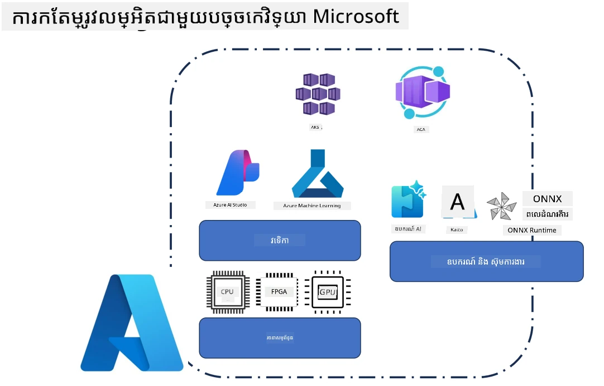
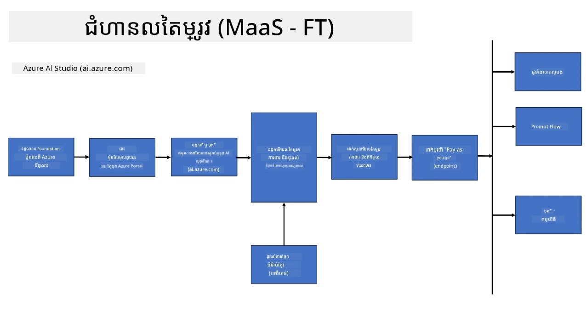
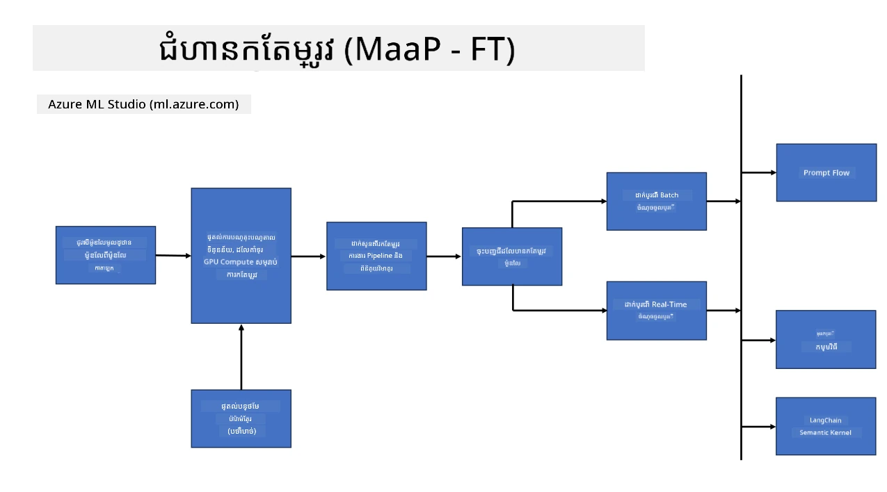
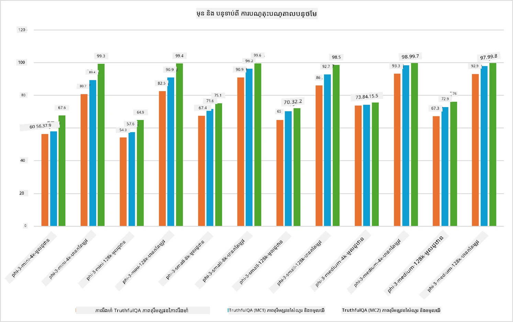

## សក្តានុពលនៃការតម្រង់ល្អប្រសើរ

ផ្នែកនេះផ្តល់ការពិពណ៌នាពីសក្តានុពលនៃការតម្រង់ល្អប្រសើរនៅក្នុងបរិវេណ Microsoft Foundry និង Azure រួមទាំងគំរូប្រើប្រាស់ ខ្នាតដំណាក់កាលរចនាសម្ព័ន្ធ និងបច្ចេកទេសបង្កើតប្រសិទ្ធភាពដែលប្រើប្រាស់ជាធម្មតា។

**វេទិកា**  
នេះរួមបញ្ចូលសេវាកម្មដែលគ្រប់គ្រងដូចជា Microsoft Foundry (ដែលមុននេះហៅថា Microsoft Foundry) និង Azure Machine Learning ដែលផ្តល់កំណត់នីតិវិធីគ្រប់គ្រងគំរូ ការប្រតិបត្តិការ ការតាមដានការសាកល្បង និងដំណើរការ deployment។

**រចនាសម្ព័ន្ធ**  
ការតម្រង់ល្អប្រសើរខ្ពស់ត្រូវការធនធានកុំព្យូទ័រដែលអាចពង្រីកបាន។ នៅក្នុងបរិវេណ Azure ជាធម្មតា រួមមានម៉ាស៊ីនវើឌុចខ្ពស់ដែលប្រើ GPU និងធនធាន CPU សម្រាប់បន្ទុកការងារតិចៗ ជាមួយនឹងការផ្ទុកទិន្នន័យដែលអាចពង្រីកសម្រាប់សំណុំនិងចំណុចពិនិត្យ។

**ឧបករណ៍ និងស៊ុម**  
ដំណើរការតម្រង់ល្អប្រសើរយ៉ាងជាធម្មតា អាស្រ័យលើស៊ុមនិងបណ្ណាល័យបង្កើតប្រសិទ្ធភាពដូចជា Hugging Face Transformers, DeepSpeed និង PEFT (Parameter-Efficient Fine-Tuning)។

ដំណើរការតម្រង់ល្អប្រសើរជាមួយបច្ចេកវិទ្យា Microsoft គ្របដណ្តប់ទៅលើសេវាវេទិកា រចនាសម្ព័ន្ធកុំព្យូទ័រ និងស៊ុមបណ្តុះបណ្តាល។ ដោយយល់ពីរបៀបដែលបច្ចេកទេសទាំងនេះធ្វើការជាមួយគ្នា អ្នកអភិវឌ្ឍន៍អាចកំណត់តម្រូវគំរូដើមឱ្យសមស្របទៅនឹងភារកិច្ចនិងសេណារីយ៉ូផលិតកម្មជាមួយប្រសិទ្ធភាព។

## គំរូជា សេវាកម្ម

តម្រង់ល្អប្រសើរក្នុងគំរូដោយប្រើ fine-tuning ជារបៀបសេវាជូនដោយមិនចាំបាច់បង្កើតនិងគ្រប់គ្រងកុំព្យូទ័រ។

ការតម្រង់ល្អប្រសើរបែប Serverless គឺមានស្រាប់សម្រាប់គ្រួសារគំរូ Phi-3, Phi-3.5 និង Phi-4 អនុញ្ញាតឲ្យអ្នកអភិវឌ្ឍន៍អាចផ្លាស់ប្តូរគំរូបានយ៉ាងរហ័ស និងងាយស្រួលសម្រាប់បរិវេណពពកនិងគោលដៅចុងដូចជា edge ដោយមិនចាំបាច់រៀបចំកុំព្យូទ័រ។

## គំរូជា វេទិកា

អ្នកប្រើគ្រប់គ្រងកុំព្យូទ័រផ្ទាល់របស់ខ្លួនដើម្បីបង្កើតការតម្រង់ល្អប្រសើរដល់គំរូរបស់ពួកគេ។

[Fine Tuning Sample](https://github.com/Azure/azureml-examples/blob/main/sdk/python/foundation-models/system/finetune/chat-completion/chat-completion.ipynb)

## ការប្រៀបធៀបបច្ចេកទេស Fine-Tuning

|សក្ដានុពល|LoRA|QLoRA|PEFT|DeepSpeed|ZeRO|DoRA|
|---|---|---|---|---|---|---|
|បង្កើត LLMs ដែលបានបណ្តុះបណ្តាលជាមុនឲ្យសមស្របទៅភារកិច្ច ឬដែនដីជាក់លាក់|បាទ|បាទ|បាទ|បាទ|បាទ|បាទ|
|ការតម្រង់ល្អប្រសើរសម្រាប់ភារកិច្ច NLP ដូចជា ចាត់ថ្នាក់អត្ថបទ ការទទួលស្គាល់ផ្ទាល់ឈ្មោះ និងការបកប្រែបច្ចេកវិទ្យា|បាទ|បាទ|បាទ|បាទ|បាទ|បាទ|
|ការតម្រង់ល្អប្រសើរសម្រាប់ភារកិច្ច QA|បាទ|បាទ|បាទ|បាទ|បាទ|បាទ|
|ការតម្រង់ល្អប្រសើរដើម្បីបង្កើតចម្លើយដូចមនុស្សនៅក្នុង chatbot|បាទ|បាទ|បាទ|បាទ|បាទ|បាទ|
|ការតម្រង់ល្អប្រសើរដើម្បីបង្កើតតន្ត្រី សិល្បៈ ឬប្រភេទសិល្បៈផ្សេងទៀត|បាទ|បាទ|បាទ|បាទ|បាទ|បាទ|
|កាត់បន្ថយចំណាយគណនា និងហិរញ្ញវត្ថុ|បាទ|បាទ|បាទ|បាទ|បាទ|បាទ|
|កាត់បន្ថយការប្រើប្រាស់អង្គចងចាំ|បាទ|បាទ|បាទ|បាទ|បាទ|បាទ|
|ប្រើប៉ារ៉ាម៉ែត្រតិចសម្រាប់ការតម្រង់ល្អប្រសើរយ៉ាងមានប្រសិទ្ធភាព|បាទ|បាទ|បាទ|ទេ|ទេ|បាទ|
|រៀបចំការចែកចាយទិន្នន័យដែលមានប្រសិទ្ធភាពធ្វើអោយអាចប្រើអង្គចងចាំ GPU សរុបទាំងមូលរបស់ឧបករណ៍ GPU គ្រប់យ៉ាងដែលមានស្រាប់|ទេ|ទេ|ទេ|បាទ|បាទ|ទេ|

> [!NOTE]
> LoRA, QLoRA, PEFT និង DoRA គឺជាវិធីសាស្ត្រតម្រង់ល្អប្រសើរដែលប្រើប៉ារ៉ាម៉ែត្រយ៉ាងមានប្រសិទ្ធភាព ខណៈដែល DeepSpeed និង ZeRO ផ្តោតទៅលើការបណ្តុះបណ្តាលចែកចាយ និងប្រសិទ្ធភាពអង្គចងចាំ។

## តំណាងឧទាហរណ៍ការសម្រួលតម្រង់ល្អប្រសើរ

---

<!-- CO-OP TRANSLATOR DISCLAIMER START -->
**ព្រមានផ្តាច់មុខ**:  
ឯកសារនេះត្រូវបានបកប្រែដោយប្រើសេវាបកប្រែ AI [Co-op Translator](https://github.com/Azure/co-op-translator)។ ខណៈពេលដែលយើងខិតខំប្រឹងប្រែងក្នុងការពិនិត្យភាពត្រឹមត្រូវ សូមយកចិត្តទុកដាក់ថាការបកប្រែមេគុណស្វ័យប្រវត្តិនេះអាចមានកំហុស ឬភាពមិនត្រឹមត្រូវ។ ឯកសារដើមនៅក្នុងភាសាវិចិត្ររបស់វាគួរត្រូវបានគិតថាជាដំណោះស្រាយដែលមានសិទ្ធិអាជ្ញាកណ្តាល។ សម្រាប់ព័ត៌មានសំខាន់ៗ សូមណែនាំឱ្យប្រើការបកប្រែដោយអ្នកជំនាញមនុស្សវិជ្ជាជីវៈ។ យើងមិនទទួលខុសត្រូវចំពោះការយល់មិនស្រប ឬការបកប្រមាថដូចមកពីការប្រើប្រាស់ការបកប្រែនេះឡើយ។
<!-- CO-OP TRANSLATOR DISCLAIMER END -->