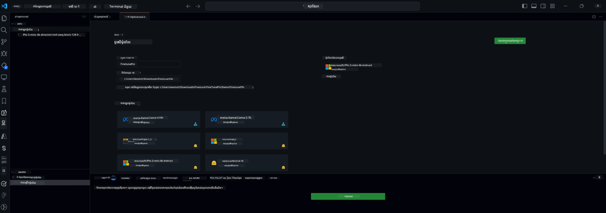

## សូមស្វាគមន៍មកកាន់ឧបករណ៍ AI សម្រាប់ VS Code

[ឧបករណ៍ AI សម្រាប់ VS Code](https://github.com/microsoft/vscode-ai-toolkit/tree/main) បានបញ្ចូលគ្នានូវម៉ូដែលផ្សេងៗពីកាឡាឡុក Azure AI Studio និងកាឡាឡុកផ្សេងទៀតដូចជា Hugging Face។ ឧបករណ៍នេះបង្កើតកំណត់បែបផែនបច្ចេកទេសធម្មតាសម្រាប់ការអភិវឌ្ឍកម្មវិធី AI ជាមួយឧបករណ៍ និងម៉ូដែល AI ផលិតរូបតាមរយៈ៖
- ចាប់ផ្តើមជាមួយការរក្សាម៉ូដែល និងទីលានលេង។
- ការត្រួតពិនិត្យម៉ូដែល និងអនុវត្តន៍ដោយប្រើធនធានកុំព្យូទ័រមូលដ្ឋាន។
- ការត្រួតពិនិត្យម៉ូដែល និងអនុវត្តន៍ពីចម្ងាយដោយប្រើធនធាន Azure

[ដំឡើងឧបករណ៍ AI សម្រាប់ VSCode](https://marketplace.visualstudio.com/items?itemName=ms-windows-ai-studio.windows-ai-studio)




**[មើលជាមុន​ខ្លួនឯង]** ការផ្ដល់ជូនតែមួយចុចសម្រាប់ Azure Container Apps ដើម្បីដំណើរការការត្រួតពិនិត្យម៉ូដែល និងអនុវត្តន៍នៅក្នុង cloud។

ឥឡូវនេះយើងចាប់ផ្តើមការអភិវឌ្ឍកម្មវិធី AI របស់អ្នក៖

- [សូមស្វាគមន៍មកកាន់ឧបករណ៍ AI សម្រាប់ VS Code](#សូមស្វាគមន៍មកកាន់ឧបករណ៍-ai-សម្រាប់-vs-code)
- [ការអភិវឌ្ឍក្នុងមូលដ្ឋាន](#ការអភិវឌ្ឍក្នុងមូលដ្ឋាន)
  - [ការរៀបចំ](#ការរៀបចំ)
  - [សកម្ម Conda](#សកម្ម-conda)
  - [ត្រួតពិនិត្យម៉ូដែលមូលដ្ឋានតែប៉ុណ្ណោះ](#ត្រួតពិនិត្យម៉ូដែលមូលដ្ឋានតែប៉ុណ្ណោះ)
  - [ការត្រួតពិនិត្យ និងអនុវត្តន៍ម៉ូដែល](#ការត្រួតពិនិត្យ-និងអនុវត្តន៍ម៉ូដែល)
  - [ការត្រួតពិនិត្យម៉ូដែល](#ការត្រួតពិនិត្យម៉ូដែល)
  - [Microsoft Olive](#microsoft-olive)
  - [គំរូ និងធនធានសម្រាប់ការត្រួតពិនិត្យជម្រះ](#គំរូ-និងធនធានសម្រាប់ការត្រួតពិនិត្យជម្រះ)
- [**\[មើលជាមុន​ខ្លួនឯង\]** ការអភិវឌ្ឍពីចម្ងាយ](#private-preview-remote-development)
  - [លក្ខខណ្ឌមុន](#លក្ខខណ្ឌមុន)
  - [ការតាំងតាំងគម្រោងអភិវឌ្ឍពីចម្ងាយ](#ការតាំងតាំងគម្រោងអភិវឌ្ឍពីចម្ងាយ)
  - [ផ្ដល់ធនធាន Azure](#ផ្ដល់ធនធាន-azure)
  - [\[ជាជំរើស\] បន្ថែមកូដ Token Huggingface ទៅសម្ងាត់ Azure Container App](#optional-add-huggingface-token-to-the-azure-container-app-secret)
  - [ដំណើរការការត្រួតពិនិត្យ](#ដំណើរការការត្រួតពិនិត្យ)
  - [ផ្ដល់ចំណុចប្រទាក់អនុវត្តន៍](#ផ្ដល់ចំណុចប្រទាក់អនុវត្តន៍)
  - [ផ្សព្វផ្សាយចំណុចប្រទាក់អនុវត្តន៍](#ផ្សព្វផ្សាយចំណុចប្រទាក់អនុវត្តន៍)
  - [ការប្រើប្រាស់កម្រិតខ្ពស់](#ការប្រើប្រាស់កម្រិតខ្ពស់)

## ការអភិវឌ្ឍក្នុងមូលដ្ឋាន
### ការរៀបចំ

1. សូមប្រាកដថាម៉ាស៊ីនមានសំណើប NVIDIA ត្រូវបានដំឡើង។  
2. ដំណើរការ `huggingface-cli login` ប្រសិនបើអ្នកកំពុងប្រើ HF សម្រាប់ការប្រើប្រាស់ dataset  
3. ពន្យល់ពីការកំណត់កូនសោ `Olive` សម្រាប់អ្វីដែលផ្លាស់ប្តូរការប្រើប្រាស់អង្គចងចាំ។  

### សកម្ម Conda
ដោយសារ​យើង​កំពុង​ប្រើ​បរិយាកាស WSL ហើយគឺជា​ការ​ចែករំលែក អ្នកត្រូវ​ដំណើរការ Conda environment ដោយដៃ។ បន្ទាប់ពីជំហាននេះ អ្នកអាចដំណើរការការត្រួតពិនិត្យឬអនុវត្តន៍បាន។

```bash
conda activate [conda-env-name] 
```

### ត្រួតពិនិត្យម៉ូដែលមូលដ្ឋានតែប៉ុណ្ណោះ
ដើម្បីសាកល្បងម៉ូដែលមូលដ្ឋានដោយមិនត្រូវបំពេញចំរូង ត្រូវរត់ពាក្យបញ្ជាខាងក្រោមបន្ទាប់ពីបានសកម្ម Conda។

```bash
cd inference

# មុខងារ​អ៊ិនធ័រហ្វេស​កម្មវិធីរុករក​បណ្ដាញ អនុញ្ញាត​ឱ្យ​កែ​ផល​ប៉ារ៉ាម៉ែត្រមួយចំនួន​ដូចជា ប្រវែងសញ្ញា​ថ្មី​ធំ​បំផុត, សីតុណ្ហភាព ហើយ​ភាព​ផ្សេងទៀត។
# អ្នកប្រើត្រូវបើកតំណភ្ជាប់ដោយដៃ (ឧ. http://0.0.0.0:7860) ក្នុងកម្មវិធីរុករក បន្ទាប់ពី gradio បើកការតភ្ជាប់។
python gradio_chat.py --baseonly
```

### ការត្រួតពិនិត្យ និងអនុវត្តន៍ម៉ូដែល

បន្ទាប់ពីបើកកន្លែងធ្វើការក្នុង dev container សូមបើក Terminal (ផ្លូវដើមលំនាំដើមគឺមូលដ្ឋានគម្រោង) បន្ទាប់រត់ពាក្យបញ្ជាខាងក្រោមដើម្បីត្រួតពិនិត្យ LLM លើ dataset ដែលបានជ្រើសរើស។

```bash
python finetuning/invoke_olive.py 
```

ការចតចាំ និងម៉ូដែលចុងក្រោយនឹងត្រូវរក្សាទុកក្នុងថត `models`។

បន្ទាប់រត់អនុវត្តន៍ជាមួយម៉ូដែលដែលត្រូវបានត្រួតពិនិត្យតាមរយៈជជែកក្នុង `console` ឬ `កម្មវិធីរកមើលវេប` ឬ `prompt flow`។

```bash
cd inference

# ចំណុចប្រទាក់ Console។
python console_chat.py

# ចំណុចប្រទាក់កម្មវិធីរុករកគេហទំព័រអនុញ្ញាតឲ្យកែរប្រែលក្ខណៈខ្លះៗដូចជាប្រវែងតួអក្សរថ្មីកំពូល, សីតុណ្ហភាព និងផ្សេងៗទៀត។
# អ្នកប្រើប្រាស់ត្រូវតែបើកតំណភ្ជាប់ដោយដៃ (ឧ. http://127.0.0.1:7860) នៅក្នុងកម្មវិធីរុករកបន្ទាប់ពី gradio ចាប់ផ្តើមការតភ្ជាប់។
python gradio_chat.py
```

ដើម្បីប្រើ `prompt flow` ក្នុង VS Code សូមយោងទៅកាន់ [Quick Start](https://microsoft.github.io/promptflow/how-to-guides/quick-start.html) នេះ។

### ការត្រួតពិនិត្យម៉ូដែល

បន្ទាប់ទាញយកម៉ូដែលខាងក្រោមដោយផ្អែកលើភាពអាចប្រើបាននៃ GPU នៅលើឧបករណ៍របស់អ្នក។

ដើម្បីចាប់ផ្តើមសម័យត្រួតពិនិត្យក្នុងមូលដ្ឋានដោយប្រើ QLoRA សូមជ្រើសម៉ូដែលដែលអ្នកចង់ត្រួតពិនិត្យពីកាឡាឡុករបស់យើង។
| វេទិកា(រ) | មាន GPU | ឈ្មោះម៉ូដែល | ទំហំ (GB) |
|---------|---------|--------|--------|
| Windows | បាទ | Phi-3-mini-4k-**directml**-int4-awq-block-128-onnx | 2.13GB |
| Linux | បាទ | Phi-3-mini-4k-**cuda**-int4-onnx | 2.30GB |
| Windows<br>Linux | ទេ | Phi-3-mini-4k-**cpu**-int4-rtn-block-32-acc-level-4-onnx | 2.72GB |

**_ចំណាំ_** អ្នកមិនចាំបាច់មានគណនី Azure ដើម្បីទាញយកម៉ូដែលទេ

ម៉ូដែល Phi3-mini (int4) មានទំហំប្រហែល 2GB-3GB។ ដោយផ្អែកលើល្បឿនបណ្តាញរបស់អ្នក វាអាចចំណាយពេលពីរបីនាទីក្នុងការទាញយក។

ចាប់ផ្តើមដោយជ្រើសឈ្មោះគម្រោង និងទីតាំង។ បន្ទាប់ជ្រើសម៉ូដែលពីកាឡាឡុកម៉ូដែល។ អ្នកនឹងត្រូវបានស្នើឲ្យទាញយកគំរូគម្រោង។ បន្ទាប់មកអ្នកអាចចុច "Configure Project" ដើម្បីកែប្រែការកំណត់នានា។

### Microsoft Olive

យើងប្រើ [Olive](https://microsoft.github.io/Olive/why-olive.html) ដើម្បីដំណើរការការត្រួតពិនិត្យ QLoRA លើម៉ូដែល PyTorch ពីកាឡាឡុករបស់យើង។ ការកំណត់ទាំងអស់ត្រូវបានកំណត់ជាមុនជាមួយតម្លៃលំនាំដើមដើម្បីសម្រួលការប្រើប្រាស់អង្គចងចាំឲ្យមានប្រសិទ្ធភាពខ្ពស់ ប៉ុន្តែអាចកែបានសម្រាប់ស្ថានភាពរបស់អ្នក។

### គំរូ និងធនធានសម្រាប់ការត្រួតពិនិត្យជម្រះ

- [មគ្គុទេសក៍ចាប់ផ្តើមការត្រួតពិនិត្យជម្រះ](https://learn.microsoft.com/windows/ai/toolkit/toolkit-fine-tune)
- [ការត្រួតពិនិត្យជម្រះជាមួយ Dataset របស់ HuggingFace](https://github.com/microsoft/vscode-ai-toolkit/blob/main/archive/walkthrough-hf-dataset.md)
- [ការត្រួតពិនិត្យជម្រះជាមួយ Simple DataSet](https://github.com/microsoft/vscode-ai-toolkit/blob/main/archive/walkthrough-simple-dataset.md)

## **[មើលជាមុន​ខ្លួនឯង]** ការអភិវឌ្ឍពីចម្ងាយ

### លក្ខខណ្ឌមុន

1. ដើម្បីដំណើរការការត្រួតពិនិត្យម៉ូដែលនៅក្នុងបរិយាកាស Azure Container App ពីចម្ងាយ សូមប្រាកដថាការជាវរបស់អ្នកមានសមត្ថភាព GPU ល្អឥតខ្ចោះ។ សូមដាក់សំបុត្រជំនួយ [support ticket](https://azure.microsoft.com/support/create-ticket/) ដើម្បីស្នើសុំសមត្ថភាពត្រូវការសម្រាប់កម្មវិធីរបស់អ្នក។ [ទទួលបានព័ត៌មានបន្ថែមអំពីសមត្ថភាព GPU](https://learn.microsoft.com/azure/container-apps/workload-profiles-overview)
2. ប្រសិនបើអ្នកប្រើ dataset ផ្ទាល់ខ្លួនលើ HuggingFace សូមប្រាកដថាអ្នកមាន [គណនី HuggingFace](https://huggingface.co/?WT.mc_id=aiml-137032-kinfeylo) និង [បង្កើតកូដដំណើរការចូល](https://huggingface.co/docs/hub/security-tokens?WT.mc_id=aiml-137032-kinfeylo)
3. បើកសញ្ញាគ្មានកំណត់ Remote Fine-tuning និង Inference នៅក្នុង AI Toolkit សម្រាប់ VS Code
   1. បើកការកំណត់ VS Code ដោយជ្រើស *File -> Preferences -> Settings*។
   2. ទៅកាន់ *Extensions* ហើយជ្រើស *AI Toolkit*។
   3. ជ្រើសជម្រើស *"Enable Remote Fine-tuning And Inference"*។
   4. បន្ថែមបញ្ចូល VS Code ម្ដងទៀតដើម្បីអនុវត្ត។

- [ការត្រួតពិនិត្យពីចម្ងាយ](https://github.com/microsoft/vscode-ai-toolkit/blob/main/archive/remote-finetuning.md)

### ការតាំងតាំងគម្រោងអភិវឌ្ឍពីចម្ងាយ
1. រត់ command palette `AI Toolkit: Focus on Resource View`។
2. ទៅកាន់ *Model Fine-tuning* ដើម្បីចូលប្រើកាឡាឡុកម៉ូដែល។ ផ្តល់ឈ្មោះគម្រោង និងជ្រើសទីតាំងលើឧបករណ៍របស់អ្នក។ បន្ទាប់ចុច *"Configure Project"*។
3. ការកំណត់គម្រោង
    1. កុំបើកជម្រើស *"Fine-tune locally"*។
    2. ការកំណត់ Olive នឹងប្រើតម្លៃលំនាំដើមដែលបានកំណត់ជាមុន។ សូមកែប្រែ និងបំពេញការកំណត់ទាំងនេះតាមតម្រូវការ។
    3. បន្តទៅ *Generate Project*។ ជំហាននេះប្រើ WSL ហើយរៀបចំបរិយាកាស Conda ថ្មី សម្រាប់ការអាប់ដេតនៅពេលក្រោយរួមមាន Dev Containers។
4. ចុច *"Relaunch Window In Workspace"* ដើម្បីបើកគម្រោងអភិវឌ្ឍពីចម្ងាយរបស់អ្នក។

> **ចំណាំ:** គម្រោងនេះដំណើរការដោយស្ថិតនៅក្នុងមូលដ្ឋាន ឬពីចម្ងាយក្នុង AI Toolkitសម្រាប់ VS Code។ ប្រសិនបើអ្នកជ្រើស *"Fine-tune locally"* នៅពេលបង្កើតគម្រោង វានឹងដំណើរការតែបែប WSL ប៉ុណ្ណោះគ្មានលក្ខណៈអភិវឌ្ឍពីចម្ងាយ។ ផ្ទុយមកវិញ ប្រសិនមិនបើក *"Fine-tune locally"* គម្រោងនឹងដំណើរការនៅក្នុងបរិយាកាស Azure Container App ចម្ងាយប៉ុណ្ណោះ។

### ផ្ដល់ធនធាន Azure
ដើម្បីចាប់ផ្តើម អ្នកត្រូវផ្ដល់ធនធាន Azure សម្រាប់ការត្រួតពិនិត្យពីចម្ងាយ។ សូមរត់ពាក្យបញ្ជា `AI Toolkit: Provision Azure Container Apps job for fine-tuning` ពី command palette។

ត្រួតពិនិត្យភាពរីកចម្រើននៃការផ្ដល់ធនធានតាមតំណដែលបង្ហាញនៅក្នុង output channel។

### [ជាជំរើស] បន្ថែមកូដ Token Huggingface ទៅសម្ងាត់ Azure Container App
ប្រសិនបើអ្នកប្រើ dataset ផ្ទាល់ខ្លួននៅ HuggingFace សូមកំណត់កូដ Token HuggingFace របស់អ្នកជាផលបរិយាកាស variable ដើម្បីជៀសវាងការចូលដោយដៃនៅលើ Hugging Face Hub។
អ្នកអាចប្រើ `AI Toolkit: Add Azure Container Apps Job secret for fine-tuning` ពាក្យបញ្ជា។ ជាមួយពាក្យបញ្ជានេះ អ្នកអាចកំណត់ឈ្មោះសម្ងាត់ជា [`HF_TOKEN`](https://huggingface.co/docs/huggingface_hub/package_reference/environment_variables#hftoken) ហើយប្រើកូដ Token Hugging Face របស់អ្នកជាតម្លៃសម្ងាត់។

### ដំណើរការការត្រួតពិនិត្យ
ដើម្បីចាប់ផ្តើមការងារត្រួតពិនិត្យពីចម្ងាយ សូមរត់ពាក្យបញ្ជា `AI Toolkit: Run fine-tuning`។

ដើម្បីមើលកំណត់ហេតុប្រព័ន្ធ និង console logs អ្នកអាចចូលប្រើ Azure portal តាមតំណដែលមាននៅក្នុងផ្ទាំង output (ជំហានបន្ថែមនៅ [មើលនិងសំណួរកំណត់ហេតុនៅលើ Azure](https://aka.ms/ai-toolkit/remote-provision#view-and-query-logs-on-azure))។ ឬ អ្នកអាចមើល console logs ត្រង់ផ្ទាំង output VSCode ដោយរត់ពាក្យបញ្ជា `AI Toolkit: Show the running fine-tuning job streaming logs`។  
> **ចំណាំ:** ការងារអាចនៅក្នុងរងចាំដោយសារតែធនធានមិនគ្រប់គ្រាន់។ ប្រសិនបើប្រតិបត្តិការណ៍មិនបង្ហាញកំណត់ហេតុ សូមរត់ពាក្យបញ្ជា `AI Toolkit: Show the running fine-tuning job streaming logs` ម្តងទៀត បន្ទាប់រង់ចាំពេលខ្លី ហើយដំណើរការពាក្យបញ្ជាវិញដើម្បីភ្ជាប់ទៅកំណត់ហេតុផ្សាយបន្ត។

ក្នុងដំណើរការនេះ QLoRA នឹងត្រូវបានប្រើសម្រាប់ការត្រួតពិនិត្យ ហើយនឹងបង្កើត LoRA adapters សម្រាប់ម៉ូដែលប្រើនៅពេលអនុវត្តន៍។
លទ្ធផលនៃការត្រួតពិនិត្យនឹងត្រូវរក្សាទុកនៅក្នុង Azure Files។

### ផ្ដល់ចំណុចប្រទាក់អនុវត្តន៍
បន្ទាប់ពី adapters ត្រូវបានបណ្ដុះក្នុងបរិយាកាសចម្ងាយ សូមប្រើកម្មវិធី Gradio សាមញ្ញដើម្បីពិភាក្សាជាមួយម៉ូដែល។
ដូចជា​ប្រតិបត្តិ​ការ​ត្រួតពិនិត្យ អ្នកត្រូវតែតាំងតាំងធនធាន Azure សម្រាប់អនុវត្តពីចម្ងាយ ដោយរត់ពាក្យបញ្ជា `AI Toolkit: Provision Azure Container Apps for inference` ពី command palette។

លំនាំដើម ការជាវ និងក្រុមធនធានសម្រាប់អនុវត្តគួរតែស្របគ្នានឹងគេហទំព័រដែលប្រើសម្រាប់ការត្រួតពិនិត្យ។ ការអនុវត្តន៍នឹងប្រើបរិយាកាស Azure Container App ដូចគ្នា និងចូលប្រើម៉ូដែល និង adapter ម៉ូដែលដែលបានរក្សាទុកក្នុង Azure Files ដែលបានបង្កើតឡើងក្នុងជំហានត្រួតពិនិត្យ។

### ផ្សព្វផ្សាយចំណុចប្រទាក់អនុវត្តន៍
ប្រសិនបើអ្នកចង់សំរុងកូដអនុវត្តឬផ្ទុកម៉ូដែលអនុវត្តឡើងវិញ សូមរត់ពាក្យបញ្ជា `AI Toolkit: Deploy for inference`។ វានឹងសម្រួលកូដចុងក្រោយរបស់អ្នកជាមួយ Azure Container App ហើយចាប់ផ្តើមឡើងវិញ Replica ។

បន្ទាប់ពីការដាក់បង្ហាញអស់ជោគជ័យ អ្នកអាចចូលប្រើ API អនុវត្ត ដោយចុចប៊ូតុង "*Go to Inference Endpoint*" ដែលបង្ហាញនៅក្នុងសេចក្តីជូនដំណឹង VSCode។ ឬ អ្នកអាចរកឃើញចំណុចទីតាំង web API នៅក្រោម `ACA_APP_ENDPOINT` ក្នុង `./infra/inference.config.json` និងក្នុងផ្ទាំង output។ ឥឡូវអ្នកបានរៀបចំរួចក្នុងការវាយតម្លៃម៉ូដែលតាមបន្ទាត់នេះ។

### ការប្រើប្រាស់កម្រិតខ្ពស់
សម្រាប់ព័ត៌មានបន្ថែមអំពីការអភិវឌ្ឍពីចម្ងាយជាមួយ AI Toolkit សូមយោងទៅកាន់ឯកសារ [ការត្រួតពិនិត្យម៉ូដែលពីចម្ងាយ](https://aka.ms/ai-toolkit/remote-provision) និង [អនុវត្តជាមួយម៉ូដែលដែលបានត្រួតពិនិត្យជម្រះ](https://aka.ms/ai-toolkit/remote-inference)។

---

<!-- CO-OP TRANSLATOR DISCLAIMER START -->
**ការបដិសេធ**៖  
ឯកសារនេះត្រូវបានបកប្រែដោយប្រើសេវាកម្មបកប្រែ AI [Co-op Translator](https://github.com/Azure/co-op-translator)។ ខណៈពេលដែលយើងខិតខំរកភាពត្រឹមត្រូវ សូមចំណាំថាការបកប្រែដោយស្វ័យប្រវត្តិអាចមានកំហុស ឬមិនត្រឹមត្រូវខ្លះ។ ឯកសារដើមដែលនៅក្នុងភាសាដើមគួរត្រូវបានរក្សាទុកជាមូលនិធិផ្លូវការជាមូលដ្ឋាន။ សម្រាប់ព័ត៌មានសំខាន់ សូមណែនាំឲ្យប្រើការបកប្រែដោយអ្នកជំនាញមនុស្សជាផ្លូវការជាងតែម៉ាស៊ីនបកប្រែ។ យើងមិនទទួលខុសត្រូវចំពោះការយល់ច្រឡំណាមួយ ឬការបកប្រែខុសៗដែលកើតឡើងពីការប្រើប្រាស់ការបកប្រែនេះឡើយ។
<!-- CO-OP TRANSLATOR DISCLAIMER END -->