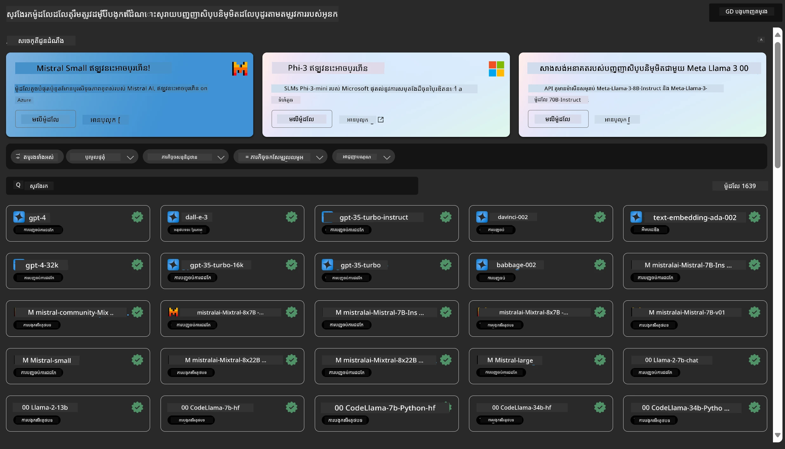
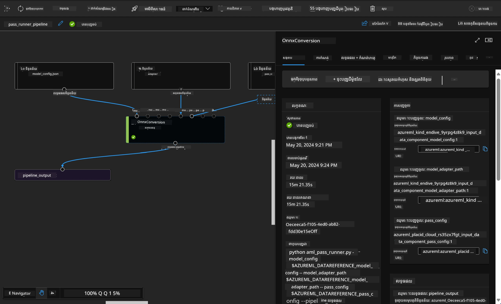

# **ណែនាំសេវាកម្ម Azure Machine Learning**

[Azure Machine Learning](https://ml.azure.com?WT.mc_id=aiml-138114-kinfeylo) គឺជាសេវាកម្មមេឃសម្រាប់បញ្ចូនល្បឿន និងគ្រប់គ្រងជាថ្នាក់អ្នកស្រីក្ដីវីធីដំណើរការគម្រោងបណ្តុះបណ្តាលម៉ាស៊ីន (ML)។

អ្នកជំនាញ ML, អ្នកវិទ្យាសាស្ត្រទិន្នន័យ និងវិស្វករ អាចប្រើវានៅក្នុងចរន្តប្រចាំថ្ងៃរបស់ពួកគេដើម្បី:

- បណ្តុះបណ្តាល និងចេញផ្សាយម៉ូដែល។
គ្រប់គ្រងប្រតិបត្តិការបណ្តុះបណ្តាលម៉ាស៊ីន (MLOps)។
- អ្នកអាចបង្កើតម៉ូដែលមួយនៅក្នុង Azure Machine Learning ឬប្រើម៉ូដែលដែលបានបង្កើតពីវេទិកាដែលមានប្រភពបើកដូចជា PyTorch, TensorFlow, ឬ scikit-learn។
- ឧបករណ៍ MLOps ជួយអ្នកត្រួតពិនិត្យ, បណ្តុះបណ្តាលឡើងវិញ, និងចេញផ្សាយម៉ូដែលឡើងវិញ។

## Azure Machine Learning សំរាប់នរណា?

**អ្នកវិទ្យាសាស្ត្រទិន្នន័យ និងវិស្វករ ML**

ពួកគេចាប់អារម្មណ៍ក្នុងការប្រើឧបករណ៍ដើម្បីបង្កើនល្បឿន និងស្វ័យប្រវត្តិក្នុងចរន្តការងារប្រចាំថ្ងៃ។
Azure ML ផ្តល់មុខងារ​សម្រាប់ភាពត្រឹមត្រូវ, ការពន្យល់, ការតាមដាន និងការត្រួតពិនិត្យ។

**អ្នកអភិវឌ្ឍន៍កម្មវិធី:**
ពួកគេអាចបញ្ចូលម៉ូដែលទៅក្នុងកម្មវិធីឬសេវាកម្មដោយរលូន។

**អ្នកអភិវឌ្ឍន៍វេទិកា**

ពួកគេមានចូលដំណើរការនៅឧបករណ៍សមត្ថភាពខ្ពស់ដែលគាំទ្រដោយ API រឹងមាំរបស់ Azure Resource Manager។
ឧបករណ៍ទាំងនេះអនុញ្ញាតឲ្យសង់ឧបករណ៍ ML កម្រិតខ្ពស់។

**សហគ្រាស**

ធ្វើការ​នៅក្នុងមេឃ Microsoft Azure, សហគ្រាសទទួលបានអត្ថប្រយោជន៍ពីសុវត្ថិភាពដែលគួរឱ្យស្គាល់ និងការគ្រប់គ្រងការចូលប្រើប្រាស់ដោយផ្អែកលើតួនាទី។
រៀបចំគម្រោងដើម្បីគ្រប់គ្រងការចូលប្រើទិន្នន័យដែលបានការពារ និងប្រតិបត្តិការជាក់លាក់។

## ផលិតភាពសម្រាប់មនុស្សគ្រប់គ្នាក្នុងក្រុម
គម្រោង ML ភាគច្រើនត្រូវការក្រុមដែលមានជំនាញផ្សេងៗគ្នាដើម្បីកសាង និងថែទាំ។

Azure ML ផ្តល់ឧបករណ៍ដែលអនុញ្ញាតអោយអ្នក:
- សហការជាមួយក្រុមរបស់អ្នកតាមរយៈកំណត់ត្រារួម, ឧបករណ៍កុំព្យូទ័រ, កុំព្យូទ័រឥតម៉ាស៊ីនមេ, ទិន្នន័យ និងបរិវេណ។
- អភិវឌ្ឍម៉ូដែលជាមួយភាពត្រឹមត្រូវ, ការពន្យល់, ការតាមដាន និងការត្រួតពិនិត្យដើម្បីបំពេញតម្រូវការដែលទាក់ទងនឹងប្រវត្តិ និងការអនុលោមតាមរយៈការត្រួតពិនិត្យ។
- ចេញផ្សាយម៉ូដែល ML បានយ៉ាងរហ័ស និងងាយស្រួលនៅចំណុចវាស់កម្រិត និងគ្រប់គ្រងវានិងគ្រប់គ្រងវាឲ្យមានប្រសិទ្ធភាពជាមួយ MLOps។
- ប្រតិបត្តិការម៉ាស៊ីនរៀននៅគ្រប់កន្លែងដោយមានគ្រប់គ្រងក្នុងខ្លួន, សុវត្ថិភាព, និងអនុលោមតាមច្បាប់។

## ឧបករណ៍វេទិកាដែលអាចប្រើប្រាស់ឆ្លូងគ្នា

នរណាមួយក្នុងក្រុម ML អាចប្រើប្រាស់ឧបករណ៍ដែលចូលចិត្តរបស់ពួកគេដើម្បីបញ្ចប់ការងារ។
មិនថាអ្នកកំពុងបើកផ្តួចផ្តើមល្បឿនលឿន, ការកែប្រែទីតាំងប៉ារ៉ាម៉ែត្រ, កសាងបណ្តាញបញ្ជា, ឬគ្រប់គ្រងការព្យាករណ៍, អ្នកអាចប្រើផ្ទាំងប្រើប្រាស់ដែលគួរឱ្យស្គាល់រួមមាន:
- Azure Machine Learning Studio
- Python SDK (v2)
- Azure CLI (v2)
- Azure Resource Manager REST APIs

ពេលអ្នកបង្កើតម៉ូដែលនៅឡើយនឹងសហការតាមលំដាប់អភិវឌ្ឍន៍ អ្នកអាចចែករំលែក និងស្វែងរកទ្រព្យសម្បត្ដិ, ឧបករណ៍ និងមាត្រដ្ឋាននៅក្នុង UI របស់ Azure Machine Learning studio។

## **LLM/SLM នៅក្នុង Azure ML**

Azure ML បានបន្ថែមមុខងារច្រើនទាក់ទងនឹង LLM/SLM ដោយបញ្ចូលគ្នា LLMOps និង SLMOps ដើម្បីបង្កើតវេទិកាបច្ចេកវិទ្យាអង្គភាព ប្រើប្រាស់បច្ចេកវិទ្យាសិល្បនកម្មបច្ចេកវិទ្យាបញ្ញាសិប្បនិម្មិត។

### **បញ្ជីម៉ូដែល**

អ្នកប្រើប្រាស់អង្គភាពអាចចេញផ្សាយម៉ូដែលផ្សេងៗតាមស្ថានភាពអាជីវកម្មផ្សេងៗតាមរយៈបញ្ជីម៉ូដែល ហើយផ្តល់សេវាកម្មជា Model as Service សម្រាប់អ្នកអភិវឌ្ឍន៍ឬប្រើប្រាស់អង្គភាពបានចូលប្រើ។

បញ្ជីម៉ូដែលនៅក្នុង Azure Machine Learning studio គឺជាគេហទំព័រដើម្បីស្វែងរក និងប្រើម៉ូដែលជាច្រើន ដែលអនុញ្ញាតឲ្យអ្នកបង្កើតកម្មវិធីបញ្ចេញសិល្បនកម្ម AI។ បញ្ជីម៉ូដែលមានម៉ូដែលរាប់រយនៅគេហទំព័រផ្គត់ផ្គង់ម៉ូដែលដូចជា Azure OpenAI service, Mistral, Meta, Cohere, Nvidia, Hugging Face, រួមទាំងម៉ូដែលដែលបានបណ្តុះបណ្តាលដោយ Microsoft។ ម៉ូដែលពីភាគីផ្គត់ផ្គង់ក្រៅពី Microsoft គឺជាផលិតផលក្រៅ Microsoft ដែលបានកំណត់ឡើងក្នុងលក្ខខណ្ឌផលិតផលរបស់ Microsoft ហើយអនុវត្តតាមលក្ខខណ្ឌដែលបានផ្តល់ជាមួយម៉ូដែល។

### **បណ្ដុំការងារបណ្ដាញ**

មូលដ្ឋាននៃបណ្តាញបណ្តុះបណ្តាលម៉ាស៊ីនគឺបំបែកកិច្ចការបណ្តុះបណ្តាលម៉ាស៊ីនពេញលេញជាលំដាប់ច្រើនជំហាន។ ជំហាននីមួយៗគឺជាឯកតាមួយដែលអាចគ្រប់គ្រងបាន ដែលអាចអភិវឌ្ឍ, បង្កើនប្រសិទ្ធភាព, កំណត់ក្របខ័ណ្ឌ និងស្វ័យប្រវត្តិកម្មដោយខ្លួនឯង។ ជំហានទាំងនេះត្រូវបានភ្ជាប់តាមរយះចំណុចផ្គត់ផ្គង់ដែលកំណត់បានល្អ។ សេវាបណ្ដាញ Azure Machine Learning pipeline ដំនើរការការគ្រប់គ្រងទំនាក់ទំនងគ្នារវាងជំហានបណ្ដាញទាំងអស់ដោយស្វ័យប្រវត្តិ។

ក្នុងការកែប្រែទ្រង់ទ្រាយ SLM / LLM, យើងអាចគ្រប់គ្រងទិន្នន័យ, ការបណ្តុះបណ្តាល និងដំណើរការបង្កើតតាមរយៈ Pipeline

### **Prompt flow**

អត្ថប្រយោជន៍នៃការប្រើ Azure Machine Learning prompt flow
Azure Machine Learning prompt flow ផ្តល់អត្ថប្រយោជន៍ជាច្រើនដែលជួយអ្នកប្រើប្រាស់ចាប់ផ្តើមពីគំនិតដល់ការសាកល្បង និងចុងក្រោយទៅកម្មវិធី LLM ដែលមានភាពរួចរាល់សម្រាប់ផលិតកម្ម៖

**សមត្ថភាពបច្ចេកវិទ្យាព្រួតការណ៍**

បទពិសោធន៍ការនិពន្ធអន្តរកម្ម៖ Azure Machine Learning prompt flow ផ្តល់ការតំណាងជាទម្រង់មើល​ឆ្លូង​នៃរចនាសម្ព័ន្ធស្ដ្រីមុខ ដើម្បីឲ្យអ្នកប្រើប្រាស់យល់ និងរុករកគម្រោងបានយ៉ាងងាយស្រួល។ វាក៏ផ្តល់បទពិសោធន៍សរសេរក្រាបឯកសារដូចកំណត់ត្រាសម្រាប់ការអភិវឌ្ឍន៍ និងស្វ័យប្រវត្តិកម្មការកែតម្រូវល្បឿន។
ជម្រើសសម្រាប់កែប្រែ prompt: អ្នកប្រើអាចបង្កើត និងប្រៀបធៀបជម្រះនៃសំណុំ prompt ច្រើន ដើម្បីជួយដំណើរការការកែប្រែច្រើនជំហាន។

ការវាយតម្លៃ៖ ប្រព័ន្ធវាយតម្លៃដែលបង្កើតឡើងជាស្រេច អនុញ្ញាតឲ្យអ្នកប្រើវាយតម្លៃគុណភាព និងប្រសិទ្ធភាពនៃ prompt និង flow របស់ពួកគេ។

ធនធានសរុប៖ Azure Machine Learning prompt flow រួមបញ្ចូលបណ្ណាល័យឧបករណ៍ គំរូ និងទំព័រគំរូ ដែលជាចំណុចចាប់ផ្តើមសម្រាប់ការអភិវឌ្ឍន៍ ដោយលើកទឹកចិត្តភាពច្នៃប្រឌិត និងបង្កើនល្បឿន។

**ភាពរួចរាល់សម្រាប់កម្មវិធីលើកមូលដ្ឋាន LLM អង្គភាព**

សហការណ៍៖ Azure Machine Learning prompt flow គាំទ្រការសហការក្រុម អនុញ្ញាតឲ្យអ្នកច្រើនធ្វើការរួមគ្នានៅលើគម្រោងការច្នៃប្រឌិត prompt, ចែករំលែកចំណេះដឹង និងគ្រប់គ្រងកំណែ។

វេទិកាគ្រប់ពីរទំហំ៖ Azure Machine Learning prompt flow ចែងចងដំណើរការច្នៃប្រឌិត prompt ពេញលេញ ចាប់ពីអភិវឌ្ឍន៍ និងវាយតម្លៃ ដល់ការចេញផ្សាយ និងត្រួតពិនិត្យ។ អ្នកប្រើអាចចេញផ្សាយ flow របស់ពួកគេជាចំណុចបញ្ចូល Azure Machine Learning និងត្រួតពិនិត្យសមត្ថភាពនៅពេលជាក់ស្តែង ដើម្បីធានាថាដំណើរការត្រឹមត្រូវ និងកែលម្អបន្ដអស់កល្បជាប់។

ដំណោះស្រាយភាពរួចរាល់អង្គភាព Azure Machine Learning៖ Prompt flow ប្រើប្រាស់ដំណោះស្រាយស្រ្តីរឹងរបស់ Azure Machine Learning សម្រាប់អភិវឌ្ឍ, សាកល្បង, និងចេញផ្សាយ flow ដោយមានសុវត្ថិភាព ប្រើអាចវាស់តម្រង់ និងជឿជាក់បាន។

ជាមួយ Azure Machine Learning prompt flow, អ្នកប្រើអាចបង្ហាញសមត្ថភាពច្នៃប្រឌិត prompt, សហការយ៉ាងមានប្រសិទ្ធភាព និងប្រើប្រាស់ដំណោះស្រាយអង្គភាពសម្រាប់ការអភិវឌ្ឍ និងចេញផ្សាយកម្មវិធីលើកមូលដ្ឋាន LLM បានយ៉ាងជោគជ័យ។

ការបញ្ចូលអំណាចគណនាកម្ម, ទិន្នន័យ និងធាតុផ្សេងៗនៃ Azure ML អ្នកអភិវឌ្ឍន៍អង្គភាពអាចបង្កើតកម្មវិធីបញ្ញាសិប្បនិម្មិតផ្ទាល់ខ្លួនបានយ៉ាងងាយស្រួល។

---

<!-- CO-OP TRANSLATOR DISCLAIMER START -->
**ការបដិសេធ**៖  
ឯកសារនេះត្រូវបានបកប្រែដោយប្រើសេវាកម្មបកប្រែ AI [Co-op Translator](https://github.com/Azure/co-op-translator)។ ខណៈពេលយើងខិតខំសំរាប់ការពិតដោយត្រឹមត្រូវ សូមយ៉ាងច្បាស់ថាការបកប្រែដោយស្វ័យប្រវត្តិអាចមានកំហុសឬភាពមិនត្រឹមត្រូវបន្តិចបន្តួច។ ឯកសារដើមនៅក្នុងភាសាមូលដ្ឋានរបស់វាគួរត្រូវបានយកទៅជាដៃគូនៅក្នុងការបញ្ជាក់។ សម្រាប់ព័ត៌មានដែលមានសារៈសំខាន់ គេហើយណែនាំឲ្យប្រើការបកប្រែដោយមនុស្សជំនាញ។ យើងមិនសុំទទួលខុសត្រូវចំពោះការយល់ច្រឡំ ឬការបកប្រែមិនត្រឹមត្រូវណាមួយដែលកើតឡើងពីការប្រើប្រាស់ការបកប្រែនេះឡើយ។
<!-- CO-OP TRANSLATOR DISCLAIMER END -->