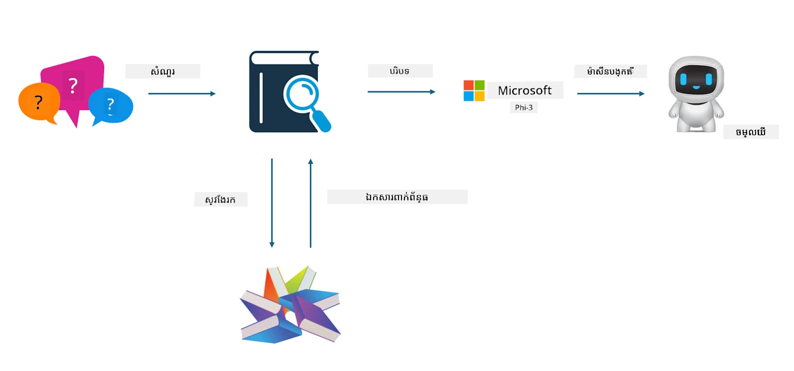
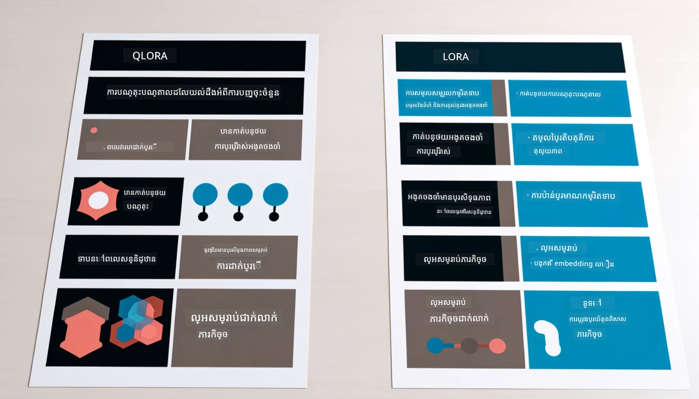

# **ឱ្យ Phi-3 ក្លាយទៅជាអ្នកជំនាញឧស្សាហកម្ម**

ដើម្បីដាក់ម៉ូដែល Phi-3 ទៅក្នុងឧស្សាហកម្ម អ្នកត្រូវតែបន្ថែមទិន្នន័យអាជីវកម្មឧស្សាហកម្មចូលទៅក្នុងម៉ូដែល Phi-3។ យើងមានជម្រើសពីរផ្សេងគ្នា៖ ជម្រើសទីមួយគឺ RAG (Retrieval Augmented Generation) ហើយជម្រើសទីពីរគឺ Fine Tuning។

## **RAG ទល់នឹង Fine-Tuning**

### **Retrieval Augmented Generation**

RAG គឺជាការយកទិន្នន័យ + ការបង្កើតអត្ថបទ។ ទិន្នន័យមានរចនាសម្ព័ន្ធ និងទិន្នន័យគ្មានរចនាសម្ព័ន្ធរបស់សហគ្រាសត្រូវបានរក្សាទុកក្នុងមូលដ្ឋានទិន្នន័យវ៉ិចទ័រ។ ពេលស្វែងរកមាតិការដែលពាក់ព័ន្ធ នឹងរកសង្ខេប និងមាតិការដែលពាក់ព័ន្ធដើម្បីបង្កើតបរិបទ ហើយសមត្ថភាពបញ្ចប់អត្ថបទរបស់ LLM/SLM ត្រូវបានបញ្ចូលរួមដើម្បីបង្កើតមាតិការថ្មី។

### **Fine-tuning**

Fine-tuning គឺផ្អែកលើការកែលម្អម៉ូដែលមួយណាមួយ។ វាមិនចាំបាច់ចាប់ផ្តើមពីអាល់ហ្គរីធមម៉ូដែលទេ ប៉ុន្តែទិន្នន័យត្រូវបានបន្ថែមប្រាកដជាបន្តៗ។ ប្រសិនបើអ្នកចង់បានពាក្យសព្ទ និងការបញ្ចេញអត្ថន័យភាសាដូចម្តេចឲ្យបានជាក់លាក់ក្នុងកម្មវិធីឧស្សាហកម្ម Fine-tuning គឺជាជម្រើសល្អរបស់អ្នក។ ប៉ុន្តែ ប្រសិនបើទិន្នន័យរបស់អ្នកប្រែប្រួលញឹកញាប់ Fine-tuning អាចក្លាយទៅជាការពិបាក។

### **របៀបជ្រើសរើស**

1. ប្រសិនបើយើងត្រូវការជំនួយជាមួយទិន្នន័យខាងក្រៅ RAG គឺជាជម្រើសល្អបំផុត

2. ប្រសិនបើអ្នកត្រូវការបញ្ចេញចំណេះដឹងឧស្សាហកម្មដែលមានស្ថាពរនិងច្បាស់លាស់ Fine-tuning នឹងជាជម្រើសល្អ។ RAG ចាត់ទុកការទាញយកមាតិកាដែលពាក់ព័ន្ធជាចម្បង ប៉ុន្តែមិនតែងតែចំពាក្យពិសេសនានាទេ។

3. Fine-tuning ត្រូវការបណ្ដុំទិន្នន័យមានគុណភាពខ្ពស់ ហើយបើវាគ្រាន់តែជាកម្រិតទិន្នន័យតូច វានឹងមិនផ្គុំការ​ច្រើនទេ។ RAG មានភាពបត់បែនខ្លាំងជាង

4. Fine-tuning គឺជាបន្ទះខ្មៅ មេតាហ្វីសិក និងពិបាកក្នុងការយល់ពីមេកានិចខាងក្នុង។ ប៉ុន្តែ RAG អាចធ្វើឲ្យងាយស្រួលក្នុងការស្វែងរកប្រភពទិន្នន័យ ដែលធ្វើឲ្យកម្រិតការលំបាកនៃការច្របូកច្របល់ ឬកំហុសមាតិកាថយចុច និងផ្តល់ភាពច្បាស់លាស់ប្រសើរជាង។

### **ស្ថានភាព**

1. ឧស្សាហកម្មដេកមានតម្រូវការពាក្យសព្ទនិងការបញ្ចេញអត្ថន័យជាពិសេស ***Fine-tuning*** នឹងជាជម្រើសល្អបំផុត

2. ប្រព័ន្ធ QA ការជួបបញ្ចូលចំណុចចំណេះដឹងផ្សេងៗគ្នា ***RAG*** នឹងជាជម្រើសល្អបំផុត

3. ការភ្ជាប់នៃប្រតិបត្តិការ​អាជីវកម្ម​ស្វ័យប្រវត្តិ ***RAG + Fine-tuning*** គឺជាជម្រើសល្អបំផុត

## **របៀបប្រើ RAG**

មូលដ្ឋានទិន្នន័យវ៉ិចទ័រជាការប្រមូលទិន្នន័យដែលបានរក្សាទុកជារូបមន្តគណិតវិទ្យា។ មូលដ្ឋានទិន្នន័យវ៉ិចទ័រធ្វើឲ្យម៉ូដែលរៀនម៉ាស៊ីនចងចាំបញ្ចូលមុនៗបានងាយស្រួលជាងមុន ដើម្បីអនុញ្ញាតឲ្យម៉ាស៊ីនរៀនត្រូវបានប្រើក្នុងករណីប្រើប្រាស់ដូចជា ស្វែងរក, ការផ្ដល់អនុសាសន៍ និងបង្កើតអត្ថបទ។ ទិន្នន័យខ្លះអាចត្រូវបានសម្គាល់ដោយផ្អែកលើយុទ្ធសាស្ត្រស្រដៀងគ្នា មិនមែនត្រូវការត្រឹមត្រូវពេញលេញទេ ដែលធ្វើឲ្យម៉ូដែលកុំព្យូទ័រអាចយល់ពីបរិបទទិន្នន័យ។

មូលដ្ឋានទិន្នន័យវ៉ិចទ័រជាគន្លងសំខាន់សម្រាប់ការអនុវត្ត RAG។ យើងអាចបម្លែងទិន្នន័យទៅជាការផ្ទុកវ៉ិចទ័រដោយគំរូវ៉ិចទ័រដូចជា text-embedding-3, jina-ai-embedding និងផ្សេងៗទៀត។

ស្វែងយល់បន្ថែមអំពីការបង្កើតកម្មវិធី RAG [https://github.com/microsoft/Phi-3CookBook](https://github.com/microsoft/Phi-3CookBook?WT.mc_id=aiml-138114-kinfeylo)

## **របៀបប្រើ Fine-tuning**

អាល់ហ្គរីធមិនដែលប្រើជាញឹកញាប់នៅក្នុង Fine-tuning គឺ Lora និង QLora។ តើធ្វើដូចម្តេចដើម្បីជ្រើសរើស?
- [សូមស្វែងយល់បន្ថែមជាមួយកញ្ជប់សំណុំឧទាហរណ៍នេះ](../../code/04.Finetuning/Phi_3_Inference_Finetuning.ipynb)
- [ឧទាហរណ៍ Python FineTuning Sample](../../../../code/04.Finetuning/FineTrainingScript.py)

### **Lora និង QLora**

LoRA (Low-Rank Adaptation) និង QLoRA (Quantized Low-Rank Adaptation) គឺជាបច្ចេកវិទ្យាទាំងពីរដែលប្រើសម្រាប់ការតម្រឹមម៉ូដែលភាសាទំហំធំ (LLMs) ដោយប្រើ Parameter Efficient Fine Tuning (PEFT)។ ក្បួន PEFT ត្រូវបានរចនាឡើងដើម្បីបណ្តុះបណ្តាលម៉ូដែលយ៉ាងមានប្រសិទ្ធភាពជាងវិធីបុរាណ។  
LoRA គឺជាបច្ចេកវិទ្យាតម្រឹមដោយឯករាជ្យ ដែលកាត់បន្ថយការប្រើស្មារតីដោយអនុវត្តការប៉ាន់ប្រមាណរកម្រិតទាបទៅលើម៉ាទ្រីសបន្ទាន់ទំងន់។ វាផ្តល់រយៈពេលបណ្តុះបណ្តាលលឿននិងថែរក្សាការសម្តែងនៅជិតវិធីបុរាណ។

QLoRA ជាបន្តបន្ទាប់នៃ LoRA ដែលបញ្ចូលបច្ចេកវិទ្យាការស្ទង់ទំហំនឹងបន្ថយការប្រើប្រាស់ស្មារតីតែម្ដង។ QLoRA ប្រើការស្ទង់ទំហំនៃភាពច្បាស់លាស់គ្រឿងទំងន់ក្នុងម៉ូដែល LLM ដែលបានបណ្តុះក្រោយទៅទំងន់4-ប៊ីត ដែលមានប្រសិទ្ធភាពប្រើស្មារតីល្អជាង LoRA។ ទោះជាយ៉ាងណា ការបណ្តុះ QLoRA យឺតជាង LoRA រហូតដល់ 30% ដោយសារការបន្ថែមជំហានស្ទង់ និងដោះស្ទង់។

QLoRA ប្រើ LoRA ជាសមាសភាគមួយសម្រាប់ជួសជុលកំហុសដែលបង្កឡើងនៅពេលស្ទង់ទំហំ។ QLoRA អាចអនុញ្ញាតឲ្យធ្វើការតម្រឹមច្រើនម៉ូដែលមានពហុព្រះគេមួយៗលើ GPU ដែលមានទំហំតូច និងអាចប្រើការបានយ៉ាងហោចណាស់។ ឧទាហរណ៍ QLoRA អាចតម្រឹមម៉ូដែល 70B ប៉ារ៉ាម៉ែត្រ ដែលទាមទារជា GPU 36 តែមួយបានត្រឹម 2 បានកាត់សិន...

---

<!-- CO-OP TRANSLATOR DISCLAIMER START -->
**ការបដិសេធ**៖  
ឯកសារនេះបានបំលែងភាសាតាមសេវាដំណែងបំលែងភាសា AI [Co-op Translator](https://github.com/Azure/co-op-translator)។ ខណៈដែលយើងខិតខំរកភាពត្រឹមត្រូវ សូមយល់ព្រមថាការបំលែងភាសាដោយស្វ័យប្រវត្តិអាចមានកំហុសឬភាពមិនត្រឹមត្រូវ។ ឯកសារដើមជាភាសា​ដើមត្រូវបានគេដឹងថាជា​ប្រភពមានអំណាចជាផ្លូវការ។ សម្រាប់ព័ត៌មានសំខាន់ៗ សូមណែនាំឱ្យមានការបំលែងភាសាដោយមនុស្សអ្នកមានជំនាញជំនួញ។ យើងមិនទទួលខុសត្រូវចំពោះការយល់ច្រឡំ ឬការបកសោតដែលកើតឡើងពីការប្រើប្រាស់ការបំលែងភាសានេះឡើយ។
<!-- CO-OP TRANSLATOR DISCLAIMER END -->