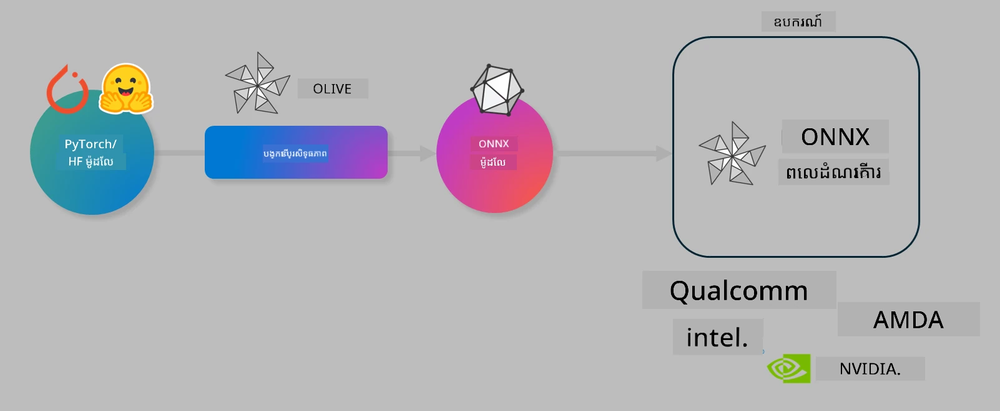

# Lab. Optimize AI models for on-device inference

## Introduction 

> [!IMPORTANT]
> សិក្ខាសាលានេះតម្រូវឱ្យមាន **Nvidia A10 or A100 GPU** ជាមួយកម្មវិធីបើកដំណើរការ (drivers) និង CUDA toolkit (version 12+) ត្រូវបានដំឡើង។

> [!NOTE]
> នេះគឺជាសិក្ខាសាលា **35-នាទី** ដែលនឹងផ្ដល់ការណែនាំអនុហត្ថប្រយោជន៍ដែលផ្ទាល់ដល់អ្នកលើគំនិតស្នូលនៃការបង្កើនប្រសិទ្ធភាពម៉ូដែលសម្រាប់ការបំពេញការងារនៅលើឧបករណ៍ដោយប្រើ OLIVE។

## Learning Objectives

By the end of this lab, you will be able to use OLIVE to:

- Quantize an AI Model using the AWQ quantization method.
- Fine-tune an AI model for a specific task.
- Generate LoRA adapters (fine-tuned model) for efficient on-device inference on the ONNX Runtime.

### What is Olive

Olive (*O*NNX *live*) គឺជាកញ្ចប់ឧបករណ៍សម្រាប់បង្កើនប្រសិទ្ធភាពម៉ូដែលដែលមាន CLI ជាសមាជិកដើម្បីអនុញ្ញាតឱ្យអ្នកដឹកជញ្ចូនម៉ូដែលសម្រាប់ ONNX runtime +++https://onnxruntime.ai+++ ដោយមានគុណភាព និងកម្រិតសមត្ថភាព។



បញ្ចូលទៅក្នុង Olive ជាទូទៅគឺជា PyTorch ឬ ម៉ូដែល Hugging Face ហើយលទ្ធផលនឹងជាម៉ូដែល ONNX ដែលបានបង្កើនប្រសិទ្ធភាព ហើយត្រូវបានអនុវត្តលើឧបករណ៍ (គោលដៅដាក់ឧបករណ៍) ដែលបើកដំណើរការ ONNX runtime។ Olive នឹងបង្កើនប្រសិទ្ធភាពម៉ូដែលសម្រាប់ឧបករណ៍ល្បឿន AI នៃគោលដៅដាក់ឧបករណ៍ (NPU, GPU, CPU) ដែលផ្តល់ដោយអ្នកផ្គត់ផ្គង់ hardware ដូចជា Qualcomm, AMD, Nvidia ឬ Intel។

Olive អនុវត្ត *workflow* មួយ ដែលជាលំដាប់រង្វិលនៃភារកិច្ចបង្កើនប្រសិទ្ធភាពម៉ូដែលនីមួយៗដែលហៅថា *passes* - ឧទាហរណ៍ passes រួមមាន៖ ការបង្រួមម៉ូដែល (model compression), ការចាប់ graph (graph capture), ការបញ្ជាក់កម្រិត (quantization), ការរៀបចំ graph (graph optimization)។ រាល់ pass មានកំណត់នៃប៉ារ៉ាម៉ែត្រ​ដែលអាចត្រូវបានកែតម្រូវដើម្បីទទួលបានមេត្រីកល្អបំផុត ដូចជា តុល្យភាព ភាពត្រឹមត្រូវ និងពេលយឺតយ៉ាវ ដែលត្រូវបានវាស់ដោយអ្នកវាយតម្លៃដែលសមរម្យ។ Olive ប្រើយុទ្ធសាស្រ្តស្វែងរកដែលប្រើអាល់ហ្គរីធម์ស្វែងរកដើម្បីធ្វើ auto-tune រាល់ pass មួយៗដោយលំដាប់ ឬជាក្រុម passes មួយ​ចំនួន។

#### Benefits of Olive

- **Reduce frustration and time** of trial-and-error manual experimentation with different techniques for graph optimization, compression and quantization. Define your quality and performance constraints and let Olive automatically find the best model for you.
- **40+ built-in model optimization components** covering cutting edge techniques in quantization, compression, graph optimization and finetuning.
- **Easy-to-use CLI** for common model optimization tasks. For example, olive quantize, olive auto-opt, olive finetune.
- Model packaging and deployment built-in.
- Supports generating models for **Multi LoRA serving**.
- Construct workflows using YAML/JSON to orchestrate model optimization and deployment tasks.
- **Hugging Face** and **Azure AI** Integration.
- Built-in **caching** mechanism to **save costs**.

## Lab Instructions
> [!NOTE]
> សូមប្រាកដថាអ្នកបាន Provision Azure AI Hub និង Project របស់អ្នក ហើយបានដាក់កំណត់ A100 compute របស់អ្នក​តាមដាន Lab 1។

### Step 0: Connect to your Azure AI Compute

You'll connect to the Azure AI compute using the remote feature in **VS Code.** 

1. Open your **VS Code** desktop application:
1. Open the **command palette** using  **Shift+Ctrl+P**
1. In the command palette search for **AzureML - remote: Connect to compute instance in New Window**.
1. Follow the on-screen instructions to connect to the Compute. This will involve selecting your Azure Subscription, Resource Group, Project and Compute name you set up in Lab 1.
1. Once your connected to your Azure ML Compute node this will be displayed in the **bottom left of Visual Code** `><Azure ML: Compute Name`

### Step 1: Clone this repo

In VS Code, you can open a new terminal with **Ctrl+J** and clone this repo:

In the terminal you should see the prompt

```
azureuser@computername:~/cloudfiles/code$ 
```
Clone the solution 

```bash
cd ~/localfiles
git clone https://github.com/microsoft/phi-3cookbook.git
```

### Step 2: Open Folder in VS Code

To open VS Code in the relevant folder execute the following command in the terminal, which will open a new window:

```bash
code phi-3cookbook/code/04.Finetuning/Olive-lab
```

Alternatively, you can open the folder by selecting **File** > **Open Folder**. 

### Step 3: Dependencies

Open a terminal window in VS Code in your Azure AI Compute Instance (tip: **Ctrl+J**) and execute the following commands to install the dependencies:

```bash
conda create -n olive-ai python=3.11 -y
conda activate olive-ai
pip install -r requirements.txt
az extension remove -n azure-cli-ml
az extension add -n ml
```

> [!NOTE]
> It will take ~5mins to install all the dependencies.

In this lab you'll download and upload models to the Azure AI Model catalog. So that you can access the model catalog, you'll need to login to Azure using:

```bash
az login
```

> [!NOTE]
> At login time you'll be asked to select your subscription. Ensure you set the subscription to the one provided for this lab.

### Step 4: Execute Olive commands 

Open a terminal window in VS Code in your Azure AI Compute Instance (tip: **Ctrl+J**) and ensure the `olive-ai` conda environment is activated:

```bash
conda activate olive-ai
```

Next, execute the following Olive commands in the command line.

1. **Inspect the data:** In this example, you're going to fine-tune Phi-3.5-Mini model so that it is specialized in answering travel related questions. The code below displays the first few records of the dataset, which are in JSON lines format:
   
    ```bash
    head data/data_sample_travel.jsonl
    ```
1. **Quantize the model:** Before training the model, you first quantize with the following command that uses a technique called Active Aware Quantization (AWQ) +++https://arxiv.org/abs/2306.00978+++. AWQ quantizes the weights of a model by considering the activations produced during inference. This means that the quantization process takes into account the actual data distribution in the activations, leading to better preservation of model accuracy compared to traditional weight quantization methods.
    
    ```bash
    olive quantize \
       --model_name_or_path microsoft/Phi-3.5-mini-instruct \
       --trust_remote_code \
       --algorithm awq \
       --output_path models/phi/awq \
       --log_level 1
    ```
    
    It takes **~8mins** to complete the AWQ quantization, which will **reduce the model size from ~7.5GB to ~2.5GB**.
   
   In this lab, we're showing you how to input models from Hugging Face (for example: `microsoft/Phi-3.5-mini-instruct`). However, Olive also allows you to input models from the Azure AI catalog by updating the `model_name_or_path` argument to an Azure AI asset ID (for example:  `azureml://registries/azureml/models/Phi-3.5-mini-instruct/versions/4`). 

1. **Train the model:** Next, the `olive finetune` command finetunes the quantized model. Quantizing the model *before* fine-tuning instead of afterwards gives better accuracy as the fine-tuning process recovers some of the loss from the quantization.
    
    ```bash
    olive finetune \
        --method lora \
        --model_name_or_path models/phi/awq \
        --data_files "data/data_sample_travel.jsonl" \
        --data_name "json" \
        --text_template "<|user|>\n{prompt}<|end|>\n<|assistant|>\n{response}<|end|>" \
        --max_steps 100 \
        --output_path ./models/phi/ft \
        --log_level 1
    ```
    
    It takes **~6mins** to complete the Fine-tuning (with 100 steps).

1. **Optimize:** With the model trained, you now optimize the model using Olive's `auto-opt` command, which will capture the ONNX graph and automatically perform a number of optimizations to improve the model performance for CPU by compressing the model and doing fusions. It should be noted, that you can also optimize for other devices such as NPU or GPU by just updating the `--device` and `--provider` arguments  - but for the purposes of this lab we'll use CPU.

    ```bash
    olive auto-opt \
       --model_name_or_path models/phi/ft/model \
       --adapter_path models/phi/ft/adapter \
       --device cpu \
       --provider CPUExecutionProvider \
       --use_ort_genai \
       --output_path models/phi/onnx-ao \
       --log_level 1
    ```
    
    It takes **~5mins** to complete the optimization.

### Step 5: Model inference quick test

To test inferencing the model, create a Python file in your folder called **app.py** and copy-and-paste the following code:

```python
import onnxruntime_genai as og
import numpy as np

print("loading model and adapters...", end="", flush=True)
model = og.Model("models/phi/onnx-ao/model")
adapters = og.Adapters(model)
adapters.load("models/phi/onnx-ao/model/adapter_weights.onnx_adapter", "travel")
print("DONE!")

tokenizer = og.Tokenizer(model)
tokenizer_stream = tokenizer.create_stream()

params = og.GeneratorParams(model)
params.set_search_options(max_length=100, past_present_share_buffer=False)
user_input = "what is the best thing to see in chicago"
params.input_ids = tokenizer.encode(f"<|user|>\n{user_input}<|end|>\n<|assistant|>\n")

generator = og.Generator(model, params)

generator.set_active_adapter(adapters, "travel")

print(f"{user_input}")

while not generator.is_done():
    generator.compute_logits()
    generator.generate_next_token()

    new_token = generator.get_next_tokens()[0]
    print(tokenizer_stream.decode(new_token), end='', flush=True)

print("\n")
```

Execute the code using:

```bash
python app.py
```

### Step 6: Upload model to Azure AI

Uploading the model to an Azure AI model repository makes the model sharable with other members of your development team and also handles version control of the model. To upload the model run the following command:

> [!NOTE]
> Update the `{}` placeholders with the name of your resource group and Azure AI Project Name. 

To find your resource group `"resourceGroup"and Azure AI Project name, run the following command 

```
az ml workspace show
```

Or by going to +++ai.azure.com+++ and selecting **management center** **project** **overview**

Update the `{}` placeholders with the name of your resource group and Azure AI Project Name.

```bash
az ml model create \
    --name ft-for-travel \
    --version 1 \
    --path ./models/phi/onnx-ao \
    --resource-group {RESOURCE_GROUP_NAME} \
    --workspace-name {PROJECT_NAME}
```
You can then see your uploaded model and deploy your model at https://ml.azure.com/model/list

---

<!-- CO-OP TRANSLATOR DISCLAIMER START -->
**Disclaimer**:
ឯកសារ​នេះ​ត្រូវ​បាន​បកប្រែ​ដោយ​ប្រើ​សេវាកម្ម​បកប្រែ AI [Co-op Translator](https://github.com/Azure/co-op-translator)។ ទោះ​បី​យើង​ព្យាយាម​រក្សា​ភាព​ត្រឹមត្រូវ ក៏ដោយ សូម​យកចិត្ត​ទុកដាក់​ថា ការបកប្រែ​ដោយ​ស្វ័យប្រវត្តិ​អាច​មាន​កំហុស ឬ​ភាព​មិន​ត្រឹមត្រូវ។ សូម​ពិចារណា​ឯកសារ​ដើម​នៅ​ក្នុង​ភាសា​ដើម​ជា​ប្រភព​ផ្លូវការ។ សម្រាប់ព័ត៌មាន​សំខាន់ៗ យើង​ផ្តល់​អនុសាសន៍​ឱ្យ​ប្រើ​ការបកប្រែ​ដោយ​អ្នក​វិជ្ជាជីវៈ​មនុស្ស។ យើង​មិន​ទទួល​ខុសត្រូវ​ចំពោះ​ការ​យល់​ច្រឡំ ឬ​ការ​បក​ស្រាយ​ខុស​ណាមួយ ដែល​កើត​ឡើង​ពី​ការ​ប្រើ​ប្រាស់​ការ​បកប្រែ​នេះ។
<!-- CO-OP TRANSLATOR DISCLAIMER END -->