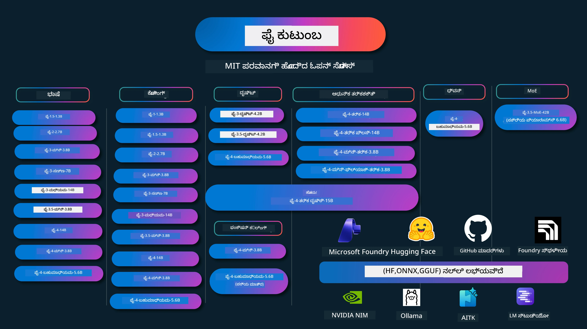

# Phi Cookbook: ಮೈಕ್ರೋಸಾಫ್ಟ್‌ನ Phi ಮಾದರಿಗಳೊಂದಿಗೆ ಹ್ಯಾಂಡ್-ಆನ್ ಉದಾಹರಣೆಗಳು

[](https://codespaces.new/microsoft/phicookbook)
[](https://vscode.dev/redirect?url=vscode://ms-vscode-remote.remote-containers/cloneInVolume?url=https://github.com/microsoft/phicookbook)

[](https://GitHub.com/microsoft/phicookbook/graphs/contributors/?WT.mc_id=aiml-137032-kinfeylo)
[](https://GitHub.com/microsoft/phicookbook/issues/?WT.mc_id=aiml-137032-kinfeylo)
[](https://GitHub.com/microsoft/phicookbook/pulls/?WT.mc_id=aiml-137032-kinfeylo)
[](http://makeapullrequest.com?WT.mc_id=aiml-137032-kinfeylo)

[](https://GitHub.com/microsoft/phicookbook/watchers/?WT.mc_id=aiml-137032-kinfeylo)
[](https://GitHub.com/microsoft/phicookbook/network/?WT.mc_id=aiml-137032-kinfeylo)
[](https://GitHub.com/microsoft/phicookbook/stargazers/?WT.mc_id=aiml-137032-kinfeylo)

[](https://discord.com/invite/ByRwuEEgH4)

Phi ಎನ್ನುವುದು ಮೈಕ್ರೋಸಾಫ್ಟ್ ಅಭಿವೃದ್ಧಿಪಡಿಸಿದ ಓಪನ್ ಸೋರ್ಸ್ AI ಮಾದರಿಗಳ ಸರಣಿಯಾಗಿದೆ.

Phi ಪ್ರಸ್ತುತ ಅತ್ಯಂತ ಶಕ್ತಿ ಮತ್ತು ವೆಚ್ಚ-ಪ್ರಭಾವಿ ಸಣ್ಣ ಭಾಷಾ ಮಾದರಿಯಾಗಿದೆ (SLM), ಬಹುಭಾಷಾ, ನಿಯಮ, ಪಠ್ಯ/ಚಾಟ್ ಉತ್ಪಾದನೆ, ಕೋಡ್, ಚಿತ್ರಗಳು, ಆಡಿಯೋ ಮತ್ತು ಇತರೆ ಪರಿಸ್ಥಿತಿಗಳಲ್ಲಿ ಅತ್ಯುತ್ತಮ ಬೆಂಚ್‌ಮಾರ್ಕ್‌ಗಳನ್ನು ಹೊಂದಿದೆ.

ನೀವು Phi ಅನ್ನು ಕ್ಲೌಡ್ ಅಥವಾ ಎಡ್ಜ್ ಸಾಧನಗಳಿಗೆ ವರ್ಗಾಯಿಸಬಹುದು, ಮತ್ತು ನಿಮಗೆ ಸೀಮಿತ ಗಣಕ ಸಾಮರ್ಥ್ಯದಿಂದ ಸುಲಭವಾಗಿ ರಚಿತ AI ಅನ್ವಯಿಕೆಗಳನ್ನು ನಿರ್ಮಿಸಬಹುದು.

ಈ ಸಂಪನ್ಮೂಲವನ್ನು ಬಳಸಲು ಈ ಹಂತಗಳನ್ನು ಅನುಸರಿಸಿ:
1. **ರಿಪೋಜಿಟರಿಯನ್ನು ಫೋರ್ಕ್ ಮಾಡಿ**: ಕ್ಲಿಕ್ ಮಾಡಿ [](https://GitHub.com/microsoft/phicookbook/network/?WT.mc_id=aiml-137032-kinfeylo)
2. **ರಿಪೋಜಿಟರಿಯನ್ನು ಕ್ಲೋನ್ ಮಾಡಿ**:   `git clone https://github.com/microsoft/PhiCookBook.git`
3. [**ಮೈಕ್ರೋಸಾಫ್ಟ್ AI ಡಿಸ್ಕಾರ್ಡ್ ಸಮುದಾಯದಲ್ಲಿ ಸೇರಿ ಹಾಗೂ ತಜ್ಞರು ಮತ್ತು ಸಹ ಡೆವಲಪರ್‌ಗಳನ್ನು ಭೇಟಿ ಮಾಡಿ**](https://discord.com/invite/ByRwuEEgH4?WT.mc_id=aiml-137032-kinfeylo)



### 🌐 ಬಹುಭಾಷಾ ಬೆಂಬಲ

#### GitHub ಕ್ರಿಯೆಯಿಂದ ಬೆಂಬಲಿತ (ಸ್ವಯಂಚಾಲಿತ ಮತ್ತು ಯಾವಾಗಲೂ ನವೀಕರಿಸಲಾಗಿದೆ)

<!-- CO-OP TRANSLATOR LANGUAGES TABLE START -->
[ಅರೇಬಿಕ್](../ar/README.md) | [ಬಂಗಾಳಿ](../bn/README.md) | [ಬಲ್ಗೇರಿಯನ್](../bg/README.md) | [ಬರ್ಮೀಸ್ (ಮ್ಯಾನ್ಮಾರ್)](../my/README.md) | [ಚೈನೀಸ್ (ಸರಳೀಕೃತ)](../zh-CN/README.md) | [ಚೈನೀಸ್ (ಪಾರಂಪರಿಕ, ಹಾಂಗ್ ಕಾಂಗ್)](../zh-HK/README.md) | [ಚೈನೀಸ್ (ಪಾರಂಪರಿಕ, ಮಕಾವು)](../zh-MO/README.md) | [ಚೈನೀಸ್ (ಪಾರಂಪರಿಕ, ತೈವಾನ್)](../zh-TW/README.md) | [ಕ್ರೊಯೇಶಿಯನ್](../hr/README.md) | [ಚೆಕ್](../cs/README.md) | [ಡೆನಿಶ್](../da/README.md) | [ಡಚ್](../nl/README.md) | [ಎಸ್ಟೋನಿಯನ್](../et/README.md) | [ಫಿನ್ನಿಶ್](../fi/README.md) | [ಫ್ರೆಂಚ್](../fr/README.md) | [ಜರ್ಮನ್](../de/README.md) | [ಗ್ರೀಕ್](../el/README.md) | [ಹೆಬ್ರೂ](../he/README.md) | [ಹിന്ദಿ](../hi/README.md) | [ಹಂಗೇರಿಯನ್](../hu/README.md) | [ಇಂಡೋನೇಷಿಯನ್](../id/README.md) | [ಇಟಾಲಿಯನ್](../it/README.md) | [ಜಪಾನೀಸ್](../ja/README.md) | [ಕನ್ನಡ](./README.md) | [ಕೊರಿಯನ್](../ko/README.md) | [ಲಿಥುವೇನಿಯನ್](../lt/README.md) | [ಮಲಾಯ್](../ms/README.md) | [ಮಲಯಾಳಂ](../ml/README.md) | [ಮರಾಠಿ](../mr/README.md) | [ನೆಪಾಳಿ](../ne/README.md) | [ನೈಜೀರಿಯನ್ ಪಿಡಿಜಿನ್](../pcm/README.md) | [ನಾರ್ವೀಜಿಯನ್](../no/README.md) | [ಪರ್ಷಿಯನ್ (ಫಾರ್ಸಿ)](../fa/README.md) | [ಪೋಲಿಶ್](../pl/README.md) | [ಪೋರ್ಚುಗೀಸ್ (ಬ್ರೆಜಿಲ್)](../pt-BR/README.md) | [ಪೋರ್ಚುಗೀಸ್ (ಪೋರ್ಟುಗಲ್)](../pt-PT/README.md) | [ಪುಂಜಾಬಿ (ಗುರ್ಮುಖಿ)](../pa/README.md) | [ರೋಮೇನಿಯನ್](../ro/README.md) | [ರುಷಿಯನ್](../ru/README.md) | [ಸೆರ್ಬಿಯನ್ (ಸಿರಿಲಿಕ್)](../sr/README.md) | [ಸ್ಲೋವಾಕ್](../sk/README.md) | [ಸ್ಲೋವೇನಿಯನ್](../sl/README.md) | [ಸ್ಪ್ಯಾನಿಷ್](../es/README.md) | [ಸ್ವಾಹಿಲಿ](../sw/README.md) | [ಸ್ವೀಡಿಶ್](../sv/README.md) | [ಟಾಗಾಲೋಗ್ (ಫಿಲಿಪಿನೋ)](../tl/README.md) | [ತಮಿಳು](../ta/README.md) | [ತೆಲುಗು](../te/README.md) | [ಥಾಯಿ](../th/README.md) | [ಟರ್ಕಿಷ್](../tr/README.md) | [ಉಕ್ರೇನಿಯನ್](../uk/README.md) | [ಉರ್ದು](../ur/README.md) | [ವಿಯೆಟ್ನಾಮೀಸ್](../vi/README.md)

> **ಸ್ಥಳೀಯವಾಗಿ ಕ್ಲೋನ್ ಮಾಡಲು ಇಚ್ಛಿಸುತ್ತೀರಾ?**
>
> ಈ ರಿಪೋಜಿಟರಿಯು 50+ ಭಾಷಾ ಅನುವಾದಗಳನ್ನು ಒಳಗೊಂಡಿದ್ದು, ಇದು ಡೌನ್‌ಲೋಡ್ ಗಾತ್ರವನ್ನು ಬಹಳ ಹೆಚ್ಚು ಹೆಚ್ಚಿಸುತ್ತದೆ. ಅನುವಾದಗಳಿಲ್ಲದೆ ಕ್ಲೋನ್ ಮಾಡಲು ಸ್ಪಾರ್ಸ್ ಔಟ್ಛೆಕ್ ಬಳಸಿ:
>
> **ಬ್ಯಾಶ್ / ಮ್ಯಾಕ್‌ಒಎಸ್ / ಲಿನಕ್ಸ್:**
> ```bash
> git clone --filter=blob:none --sparse https://github.com/microsoft/PhiCookBook.git
> cd PhiCookBook
> git sparse-checkout set --no-cone '/*' '!translations' '!translated_images'
> ```
>
> **CMD (ವಿಂಡೋಸ್):**
> ```cmd
> git clone --filter=blob:none --sparse https://github.com/microsoft/PhiCookBook.git
> cd PhiCookBook
> git sparse-checkout set --no-cone "/*" "!translations" "!translated_images"
> ```
>
> ಇದರಿಂದ ಕೋರ್ಸ್ ಪೂರ್ಣಗೊಳಿಸಲು ಬಹಳ ವೇಗವಾಗಿ ಡೌನ್‌ಲೋಡ್ ಪಡೆಯಬಹುದು.
<!-- CO-OP TRANSLATOR LANGUAGES TABLE END -->

## ವಿಷಯಗಳ ಪಟ್ಟಿ
- ಪರಿಚಯ - [ಫೈ ಕುಟುಂಬಕ್ಕೆ ಸುಸ್ವಾಗತ](./md/01.Introduction/01/01.PhiFamily.md) - [ನಿಮ್ಮ ಪರಿಸರವನ್ನು ಹೊಂದಿಸುವಿಕೆ](./md/01.Introduction/01/01.EnvironmentSetup.md) - [ಮುಖ್ಯ ತಂತ್ರಜ್ಞಾನಗಳನ್ನು ಅರ್ಥಮಾಡಿಕೊಳ್ಳುವುದು](./md/01.Introduction/01/01.Understandingtech.md) - [ಫೈ ಮಾದರಿಗಳಿಗಾಗಿ AI ಭದ್ರತೆ](./md/01.Introduction/01/01.AISafety.md) - [ಫೈ ಹಾರ್ಡ್‌ವೇರ್ ಬೆಂಬಲ](./md/01.Introduction/01/01.Hardwaresupport.md) - [ಫೈ ಮಾದರುವಿನ ಮತ್ತು ವೇದಿಕೆಗಳ ಮೇಲೆ ಲಭ್ಯತೆ](./md/01.Introduction/01/01.Edgeandcloud.md) - [ಗೈಡನ್ಸ್-ai ಮತ್ತು ಫೈ ಬಳಸುವುದು](./md/01.Introduction/01/01.Guidance.md) - [GitHub ಮಾರುಕಟ್ಟೆ ಮಾದರಿಗಳು](https://github.com/marketplace/models) - [Azure AI ಮಾದರಿ ಕ್ಯಾಟಲಾಗ್](https://ai.azure.com) - ವಿಭಿನ್ನ ಪರಿಸರಗಳಲ್ಲಿ ಫೈ ನಿರೂಪಣೆ - [ಹಗ್ಗಿಂಗ್ ಫೇಸ್](./md/01.Introduction/02/01.HF.md) - [GitHub ಮಾದರಿಗಳು](./md/01.Introduction/02/02.GitHubModel.md) - [Microsoft Foundry ಮಾದರಿ ಕ್ಯಾಟಲಾಗ್](./md/01.Introduction/02/03.AzureAIFoundry.md) - [ಒಲ್ಲಾಮ](./md/01.Introduction/02/04.Ollama.md) - [AI ಟೂಲ್ಕಿಟ್ VSCode (AITK)](./md/01.Introduction/02/05.AITK.md) - [NVIDIA NIM](./md/01.Introduction/02/06.NVIDIA.md) - [ಫೌಂಡ್ರಿ ಸ್ಥಳೀಯ](./md/01.Introduction/02/07.FoundryLocal.md) - ಫೈ ಕುಟುಂಬದ ನಿರೂಪಣೆ - [iOS ನಲ್ಲಿ ಫೈ ನಿರೂಪಣೆ](./md/01.Introduction/03/iOS_Inference.md) - [ಆಂಡ್ರಾಯ್ಡ್‌ನಲ್ಲಿ ಫೈ ನಿರೂಪಣೆ](./md/01.Introduction/03/Android_Inference.md) - [ಜೆಟ್‌ಸನ್‌ನಲ್ಲಿ ಫೈ ನಿರೂಪಣೆ](./md/01.Introduction/03/Jetson_Inference.md) - [AI ಪಿಸಿ‌ನಲ್ಲಿ ಫೈ ನಿರೂಪಣೆ](./md/01.Introduction/03/AIPC_Inference.md) - [ಆಪಲ್ MLX ಫ್ರೇಂವರ್ಕ್ ಬಳಸಿ ಫೈ ನಿರೂಪಣೆ](./md/01.Introduction/03/MLX_Inference.md) - [ಸ್ಥಳೀಯ ಸರ್ವರ್‌ನಲ್ಲಿ ಫೈ ನಿರೂಪಣೆ](./md/01.Introduction/03/Local_Server_Inference.md) - [AI ಟೂಲ್ಕಿಟ್ ಬಳಸಿ ರಿಮೋಟ್ ಸರ್ವರ್‌ನಲ್ಲಿ ಫೈ ನಿರೂಪಣೆ](./md/01.Introduction/03/Remote_Interence.md) - [ರೂಸ್ಟ್‌తో ಫೈ ನಿರೂಪಣೆ](./md/01.Introduction/03/Rust_Inference.md) - [ಸ್ಥಳೀಯದಲ್ಲಿ ಫೈ--ದೃಷ್ಟಿ ನಿರೂಪಣೆ](./md/01.Introduction/03/Vision_Inference.md) - [ಕೈಟೋ AKS, Azure ಕಂಟೈನರ್ಸ್ (ಅಧಿಕೃತ ಬೆಂಬಲ) ಬಳಸಿ ಫೈ ನಿರೂಪಣೆ](./md/01.Introduction/03/Kaito_Inference.md) - [ಫೈ ಕುಟುಂಬದ ಪ್ರಮಾಣೀಕರಣ](./md/01.Introduction/04/QuantifyingPhi.md) - [llama.cpp ಬಳಸಿ ಫೈ-3.5 / 4 ಪ್ರಮಾಣೀಕರಣ](./md/01.Introduction/04/UsingLlamacppQuantifyingPhi.md) - [onnxruntime ಗೆನರೇಟಿವ್ AI ವಿಸ್ತರಣೆಗಳನ್ನು ಬಳಸಿ ಫೈ-3.5 / 4 ಪ್ರಮಾಣೀಕರಣ](./md/01.Introduction/04/UsingORTGenAIQuantifyingPhi.md) - [ಇಂಟೆಲ್ OpenVINO ಬಳಸಿ ಫೈ-3.5 / 4 ಪ್ರಮಾಣೀಕರಣ](./md/01.Introduction/04/UsingIntelOpenVINOQuantifyingPhi.md) - [ಆಪಲ್ MLX ಫ್ರೇಂವರ್ಕ್ ಬಳಸಿ ಫೈ-3.5 / 4 ಪ್ರಮಾಣೀಕರಣ](./md/01.Introduction/04/UsingAppleMLXQuantifyingPhi.md) - ಫೈ ಮೌಲ್ಯಮಾಪನ - [ಉತ್ತರದಾಯಕ AI](./md/01.Introduction/05/ResponsibleAI.md) - [ಮೌಲ್ಯಮಾಪನಕ್ಕಾಗಿ Microsoft Foundry](./md/01.Introduction/05/AIFoundry.md) - [ಮೌಲ್ಯಮಾಪನಕ್ಕಾಗಿ Promptflow ಬಳಸುವುದು](./md/01.Introduction/05/Promptflow.md) - Azure AI ಹುಡುಕಾಟದೊಂದಿಗೆ RAG - [Phi-4-mini ಮತ್ತು Phi-4-multimodal(RAG) ಅನ್ನು Azure AI ಹುಡುಕಾಟದೊಂದಿಗೆ ಹೇಗೆ ಬಳಸುವುದು](https://github.com/microsoft/PhiCookBook/blob/main/code/06.E2E/E2E_Phi-4-RAG-Azure-AI-Search.ipynb) - ಫೈ ಅನ್ವಯಿಕೆ ಅಭಿವೃದ್ಧಿ ಉದಾಹರಣೆಗಳು - ಪಠ್ಯ ಮತ್ತು ಸಂಭಾಷಣಾ ಅನ್ವಯಿಕೆಗಳು - ಫೈ-4 ಉದಾಹರಣೆಗಳು - [📓] [Phi-4-mini ONNX ಮಾದರಿಯೊಂದಿಗೆ ಸಂಭಾಷಣೆ](./md/02.Application/01.TextAndChat/Phi4/ChatWithPhi4ONNX/README.md) - [ಸ್ಥಳೀಯ ONNX ಮಾದರಿಯೊಂದಿಗೆ Phi-4 ಸಂಭಾಷಣೆ .NET](../../md/04.HOL/dotnet/src/LabsPhi4-Chat-01OnnxRuntime) - [ಸಮ್ಯಾಂತಿಕ ಕರ್ಣಲ್ನೊಂದಿಗೆ Phi-4 ONNX ಬಳಸಿ .NET ಕನ್ಸೋಲ್ ಅಪ್ಲಿಕೇಶನ್ ಸಂಭಾಷಣೆ](../../md/04.HOL/dotnet/src/LabsPhi4-Chat-02SK) - Phi-3 / 3.5 ಉದಾಹರಣೆಗಳು - [Phi3, ONNX ರನ್‌ಟೈಮ್ ವೆಬ್ ಮತ್ತು WebGPU ಬಳಸಿ ಬ್ರೌಸರ್‌ನಲ್ಲಿ ಸ್ಥಳೀಯ ಚಾಟ್‌ಬಾಟ್](https://github.com/microsoft/onnxruntime-inference-examples/tree/main/js/chat) - [OpenVino ಚಾಟ್](./md/02.Application/01.TextAndChat/Phi3/E2E_OpenVino_Chat.md) - [ಬಹು ಮಾದರಿ - ಸಂವಾದಾತ್ಮಕ Phi-3-mini ಮತ್ತು OpenAI Whisper](./md/02.Application/01.TextAndChat/Phi3/E2E_Phi-3-mini_with_whisper.md) - [MLFlow - ಒದ್ದಿಸುವಿಕೆ ನಿರ್ಮಿಸುವುದು ಮತ್ತು Phi-3 ಬಳಸಿ MLFlow ಬಳಸುವುದು](./md//02.Application/01.TextAndChat/Phi3/E2E_Phi-3-MLflow.md) - [ಮಾದರಿ ಆಪ್ಟಿಮೈಜೆ이션 - ONNX ರನ್‌ಟೈಮ್ ವೆಬ್‌ಗೆ Phi-3-min ಮಾದರಿಯನ್ನು ಎಷ್ಟು ಪರಿಣಾಮಕಾರಿಯಾಗಿ ಆಪ್ಟಿಮೈಸ್ ಮಾಡುವುದು](https://github.com/microsoft/Olive/tree/main/examples/phi3) - [Phi-3 mini-4k-instruct-onnx ಬಳಸಿ WinUI3 ಅಪ್ಲಿಕೇಶನ್](https://github.com/microsoft/Phi3-Chat-WinUI3-Sample/) - [WinUI3 ಬಹು ಮಾದರಿ AI ಚಾಲಿತ ತೋರೆಣೆಯ ಆಪ್ ಉದಾಹರಣೆ](https://github.com/microsoft/ai-powered-notes-winui3-sample) - [Prompt flow ಮೂಲಕ ಕಸ್ಟಮ್ Phi-3 ಮಾದರಿಗಳನ್ನು ಸೂಕ್ಷ್ಮತರುವ ಮತ್ತು ಸಂಯೋಜಿಸುವುದು](./md/02.Application/01.TextAndChat/Phi3/E2E_Phi-3-FineTuning_PromptFlow_Integration.md) - [Microsoft Foundry ನಲ್ಲಿ Prompt flow ಮೂಲಕ ಕಸ್ಟಮ್ Phi-3 ಮಾದರಿಗಳನ್ನು ಸೂಕ್ಷ್ಮತರುವ ಮತ್ತು ಸಂಯೋಜಿಸುವುದು](./md/02.Application/01.TextAndChat/Phi3/E2E_Phi-3-FineTuning_PromptFlow_Integration_AIFoundry.md) - [Microsoft ನ ಉತ್ತರದಾಯಕ AI ತತ್ವಗಳಲ್ಲಿ ಗಮನಹರಿಸಿ Microsoft Foundry ನಲ್ಲಿ ಸೂಕ್ಷ್ಮತರುವ Phi-3 / Phi-3.5 ಮಾದರಿಯನ್ನು ಮೌಲ್ಯಮಾಪನ](./md/02.Application/01.TextAndChat/Phi3/E2E_Phi-3-Evaluation_AIFoundry.md) - [📓] [Phi-3.5-mini-instruct ಭಾಷಾ ಭವಿಷ್ಯವಾಣಿಯ ಉದಾಹರಣೆ (ಚೀನೀ/ಇಂಗ್ಲೀಷ್)](./md/02.Application/01.TextAndChat/Phi3/phi3-instruct-demo.ipynb) - [Phi-3.5-Instruct WebGPU RAG ಚಾಟ್‌ಬಾಟ್](./md/02.Application/01.TextAndChat/Phi3/WebGPUWithPhi35Readme.md) - [Windows GPU ಬಳಸಿಕೊಂಡು Phi-3.5-Instruct ONNX ಮೂಲಕ Prompt flow ಪರಿಹಾರವನ್ನು ರಚಿಸುವುದು](./md/02.Application/01.TextAndChat/Phi3/UsingPromptFlowWithONNX.md) - [Microsoft Phi-3.5 tflite ಬಳಸಿ ಆಂಡ್ರಾಯ್ಡ್ ಅಪ್ಲಿಕೇಶನ್ ರಚನೆ](./md/02.Application/01.TextAndChat/Phi3/UsingPhi35TFLiteCreateAndroidApp.md) - [ಸ್ಥಳೀಯ ONNX Phi-3 ಮಾದರಿಯನ್ನು ಬಳಸಿಕೊಂಡು Q&A .NET ಉದಾಹರಣೆ Microsoft.ML.OnnxRuntime ಬಳಸಿ](../../md/04.HOL/dotnet/src/LabsPhi301) - [ಸಮ್ಯಾಂತಿಕ ಕರ್ಣಲ್ನೊಂದಿಗೆ ಮತ್ತು Phi-3 ಬಳಸಿ ಕನ್ಸೋಲ್ ಚಾಟ್ .NET ಅಪ್ಲಿಕೇಶನ್](../../md/04.HOL/dotnet/src/LabsPhi302) - Azure AI ನಿರೂಪಣೆ SDK ಕೋಡ್ ಆಧಾರಿತ ಉದಾಹರಣೆಗಳು - ಫೈ-4 ಉದಾಹರಣೆಗಳು - [📓] [Phi-4-multimodal ಬಳಸಿ ಪ್ರಾಜೆಕ್ಟ್ ಕೋಡ್ ರಚನೆ](./md/02.Application/02.Code/Phi4/GenProjectCode/README.md) - Phi-3 / 3.5 ಉದಾಹರಣೆಗಳು - [Microsoft Phi-3 ಕುಟುಂಬದೊಂದಿಗೆ ನಿಮ್ಮದೇ Visual Studio Code GitHub ಕೋಪಿಲಟ್ ಚಾಟ್ ನಿರ್ಮಿಸಿ](./md/02.Application/02.Code/Phi3/VSCodeExt/README.md) - [GitHub ಮಾದರಿಗಳೊಂದಿಗೆ Phi-3.5 ಬಳಸಿ ನಿಮ್ಮದೇ Visual Studio Code ಚಾಟ್ ಕೋಪಿಲಟ್ ಏಜೆಂಟ್ ರಚಿಸಿ](/md/02.Application/02.Code/Phi3/CreateVSCodeChatAgentWithGitHubModels.md) - ಉನ್ನತ ಮಟ್ಟದ ಯುಕ್ತಿವಾದುದ ಉದಾಹರಣೆಗಳು - ಫೈ-4 ಉದಾಹರಣೆಗಳು - [📓] [Phi-4-mini-ಯುಕ್ತಿವಾದ ಅಥವಾ Phi-4-ಯುಕ್ತಿವಾದ ಉದಾಹರಣೆಗಳು](./md/02.Application/03.AdvancedReasoning/Phi4/AdvancedResoningPhi4mini/README.md) - [📓] [Microsoft Olive ಬಳಸಿ Phi-4-mini-ಯುಕ್ತಿವಾದ ಸೂಕ್ಷ್ಮತರುವ](./md/02.Application/03.AdvancedReasoning/Phi4/AdvancedResoningPhi4mini/olive_ft_phi_4_reasoning_with_medicaldata.ipynb) - [📓] [ಆಪಲ್ MLX ಬಳಸಿ Phi-4-mini-ಯುಕ್ತಿವಾದ ಸೂಕ್ಷ್ಮತರುವ](./md/02.Application/03.AdvancedReasoning/Phi4/AdvancedResoningPhi4mini/mlx_ft_phi_4_reasoning_with_medicaldata.ipynb) - [📓] [GitHub ಮಾದರಿಗಳೊಂದಿಗೆ Phi-4-mini-ಯುಕ್ತಿವಾದ](./md/02.Application/02.Code/Phi4r/github_models_inference.ipynb) - [📓] [Microsoft Foundry ಮಾದರಿಗಳೊಂದಿಗೆ Phi-4-mini-ಯುಕ್ತಿವಾದ](./md/02.Application/02.Code/Phi4r/azure_models_inference.ipynb) -
ಡೆಮೋಗಳು - [Phi-4-mini ಡೆಮೋಗಳು Hugging Face Spaces ನಲ್ಲಿ ಹೋಸ್ಟ್ ಮಾಡಲಾಗಿದೆ](https://huggingface.co/spaces/microsoft/phi-4-mini?WT.mc_id=aiml-137032-kinfeylo) - [Phi-4-multimodal ಡೆಮೋಗಳು Hugging Face Spaces ನಲ್ಲಿ ಹೋಸ್ಟ್ ಮಾಡಲಾಗಿದೆ](https://huggingface.co/spaces/microsoft/phi-4-multimodal?WT.mc_id=aiml-137032-kinfeylo) - ದೃಷ್ಟಿ സാമ്പಲ್ಸ್ - Phi-4 സാമ്പಲ್ಸ್ - [📓] [ಚಿತ್ರಗಳನ್ನು ಓದಿ ಕೋಡ್ ರಚಿಸಲು Phi-4-multimodal ಬಳಸಿ](./md/02.Application/04.Vision/Phi4/CreateFrontend/README.md) - Phi-3 / 3.5 സാമ്പಲ್ಸ್ - [📓][Phi-3-vision-ಚಿತ್ರ ಪಠ್ಯದಿಂದ ಪಠ್ಯಕ್ಕೆ](./md/02.Application/04.Vision/Phi3/E2E_Phi-3-vision-image-text-to-text-online-endpoint.ipynb) - [Phi-3-vision-ONNX](https://onnxruntime.ai/docs/genai/tutorials/phi3-v.html) - [📓][Phi-3-vision CLIP ಎम्बೆಡ್ಡಿಂಗ್](./md/02.Application/04.Vision/Phi3/E2E_Phi-3-vision-image-text-to-text-online-endpoint.ipynb) - [ಡೆಮೋ: Phi-3 ರಿಸೈಕ್ಲಿಂಗ್](https://github.com/jennifermarsman/PhiRecycling/) - [Phi-3-vision - ದೃಶ್ಯ ಭಾಷಾ ಸಹಾಯಕ - Phi3-Vision ಮತ್ತು OpenVINO ಜೊತೆ](https://docs.openvino.ai/nightly/notebooks/phi-3-vision-with-output.html) - [Phi-3 Vision Nvidia NIM](./md/02.Application/04.Vision/Phi3/E2E_Nvidia_NIM_Vision.md) - [Phi-3 Vision OpenVino](./md/02.Application/04.Vision/Phi3/E2E_OpenVino_Phi3Vision.md) - [📓][Phi-3.5 Vision ಬಹು-ಫ್ರೇಮ್ ಅಥವಾ ಬಹು-ಚಿತ್ರ ಸಾಮ್ಪಲ್](./md/02.Application/04.Vision/Phi3/phi3-vision-demo.ipynb) - [Phi-3 Vision ಸ್ಥಳೀಯ ONNX ಮಾದರಿ Microsoft.ML.OnnxRuntime .NET ಬಳಸಿ](../../md/04.HOL/dotnet/src/LabsPhi303) - [ಮೆನು ಆಧಾರಿತ Phi-3 Vision ಸ್ಥಳೀಯ ONNX ಮಾದರಿ Microsoft.ML.OnnxRuntime .NET ಬಳಸಿ](../../md/04.HOL/dotnet/src/LabsPhi304) - ತರ್ಕ-ದೃಷ್ಟಿ സാമ്പಲ್ಸ್ - Phi-4-ತರ್ಕ-ದೃಷ್ಟಿ-15B - [📓] [Phi-4-ತರ್ಕ-ದೃಷ್ಟಿ-15B ಬಳಸಿಕೊಂಡು ಜೇವು ಮುಂಗೊಳ್ಳೆಯನ್ನು ಪತ್ತೆಮಾಡುವುದು](./md/02.Application/10.ReasoningVision/Phi_4_reasoning_vision_15b_Jaywalking.ipynb) - [📓] [Phi-4-ತರ್ಕ-ದೃಷ್ಟಿ-15B ಬಳಸಿ ಗಣಿತ ಮಾಡುವುದು](./md/02.Application/10.ReasoningVision/Phi_4_reasoning_vision_15b_Math.ipynb) - [📓] [Phi-4-ತರ್ಕ-ದೃಷ್ಟಿ-15B ಬಳಸಿ UI ಪತ್ತೆಮಾಡುವುದು](./md/02.Application/10.ReasoningVision/Phi_4_reasoning_vision_15b_ui.ipynb) - ಗಣಿತ സാമ്പಲ್ಸ್ - Phi-4-Mini-ಫ್ಲ್ಯಾಶ್-ತರ್ಕ-ಅನುವಾದ ಸೂಚನೆ സാമ്പಲ್ಸ್ [Phi-4-Mini-ಫ್ಲ್ಯಾಶ್-ತರ್ಕ-ಅನುವಾದ ಸೂಚನೆ ಜೊತೆ ಗಣಿತ ಡೆಮೋ](./md/02.Application/09.Math/MathDemo.ipynb) - ಧ್ವನಿ സാമ്പಲ್ಸ್ - Phi-4 സാമ്പಲ್ಸ್ - [📓] [Phi-4-multimodal ಬಳಸಿ ಧ್ವನಿ ಪ್ರತಿಲಿಪಿಗಳನ್ನು ಹೊರತೆಗೆಯುವುದು](./md/02.Application/05.Audio/Phi4/Transciption/README.md) - [📓] [Phi-4-multimodal ಧ್ವನಿ ಸಾರಾಂಶ](./md/02.Application/05.Audio/Phi4/Siri/demo.ipynb) - [📓] [Phi-4-multimodal ಸ್ಪೀಚ್ ಅನುವಾದ ಸ್ಯಾಂಪಲ್](./md/02.Application/05.Audio/Phi4/Translate/demo.ipynb) - [.NET ಕಾನ್ಸೋಲ್ ಅಪ್ಲಿಕೇಶನ್ Phi-4-multimodal ಧ್ವನಿಯನ್ನು ವಿಶ್ಲೇಷಿಸಿ ಪ್ರತಿಲಿಪಿ ರಚಿಸಲು](../../md/04.HOL/dotnet/src/LabsPhi4-MultiModal-02Audio) - MOE സാമ്പಲ್ಸ್ - Phi-3 / 3.5 സാമ്പಲ್ಸ್ - [📓] [Phi-3.5 ಮಿಶ್ರಣ ತಜ್ಞರು ಮಾದರಿಗಳು (MoEs) ಸಾಮಾಜಿಕ ಮಾಧ್ಯಮ ಸಂಘರ್ಷ](./md/02.Application/06.MoE/Phi3/phi3_moe_demo.ipynb) - [📓] [NVIDIA NIM Phi-3 MOE, Azure AI Search, ಮತ್ತು LlamaIndex ಬಳಸಿ Retrieval-Augmented Generation (RAG) ಪೈಪ್ಲೈನ್ ನಿರ್ಮಾಣ](./md/02.Application/06.MoE/Phi3/azure-ai-search-nvidia-rag.ipynb) - - ಕಾರ್ಯ ಹೋರಾಟದ ಡೆಮೋಗಳು - Phi-4 സാമ്പಲ್ಸ್ 🆕 - [📓] [Phi-4-mini ಯೊಂದಿಗೆ ಕಾರ್ಯ ಹೋರಾಟ ಬಳಸಿ](./md/02.Application/07.FunctionCalling/Phi4/FunctionCallingBasic/README.md) - [📓] [Phi-4-mini ಯೊಂದಿಗೆ ಕಾರ್ಯ ಹೋರಾಟ ಬಳಸಿ ಬಹು-ಏಜೆಂಟ್ ಸೃಷ್ಟಿ](./md/02.Application/07.FunctionCalling/Phi4/Multiagents/Phi_4_mini_multiagent.ipynb) - [📓] [Ollama ಜೊತೆ ಕಾರ್ಯ ಹೋರಾಟ ಬಳಸಿ](./md/02.Application/07.FunctionCalling/Phi4/Ollama/ollama_functioncalling.ipynb) - [📓] [ONNX ಜೊತೆಗೆ ಕಾರ್ಯ ಹೋರಾಟ ಬಳಸಿ](./md/02.Application/07.FunctionCalling/Phi4/ONNX/onnx_parallel_functioncalling.ipynb) - ಬಹುಮಾಧ್ಯಮ ಮಿಶ್ರಣ ಡೆಮೋಗಳು - Phi-4 സാമ്പಲ್ಸ್ 🆕 - [📓] [ತಂತ್ರಜ್ಞಾನ ಪತ್ರಕರ್ತನಾಗಿ Phi-4-multimodal ಬಳಸಿ](./md/02.Application/08.Multimodel/Phi4/TechJournalist/phi_4_mm_audio_text_publish_news.ipynb) - [.NET ಕಾನ್ಸೋಲ್ ಅಪ್ಲಿಕೇಶನ್ Phi-4-multimodal ಬಳಸಿ ಚಿತ್ರಗಳನ್ನು ವಿಶ್ಲೇಷಿಸಲು](../../md/04.HOL/dotnet/src/LabsPhi4-MultiModal-01Images) - ಫೈನ್-ಟ್ಯೂನಿಂಗ್ Phi സാമ്പಲ್ಸ್ - [ಫೈನ್-ಟ್ಯೂನಿಂಗ್ ಸನ್ನಿವೇಶಗಳು](./md/03.FineTuning/FineTuning_Scenarios.md) - [ಫೈನ್-ಟ್ಯೂನಿಂಗ್ ಮತ್ತು RAG](./md/03.FineTuning/FineTuning_vs_RAG.md) - [Phi-3 ಅನ್ನು ಉದ್ಯಮ ತಜ್ಞನಾಗಿ ಫೈನ್-ಟ್ಯೂನ್ ಮಾಡುವುದು](./md/03.FineTuning/LetPhi3gotoIndustriy.md) - [Phi-3 ಅನ್ನು AI Toolkit for VS Code ಮೂಲಕ ಫೈನ್-ಟ್ಯೂನ್ ಮಾಡುವುದು](./md/03.FineTuning/Finetuning_VSCodeaitoolkit.md) - [Phi-3 ಅನ್ನು Azure Machine Learning Service ಮೂಲಕ ಫೈನ್-ಟ್ಯೂನ್ ಮಾಡುವುದು](./md/03.FineTuning/Introduce_AzureML.md) - [Phi-3 ಅನ್ನು Lora ಮೂಲಕ ಫೈನ್-ಟ್ಯೂನ್ ಮಾಡುವುದು](./md/03.FineTuning/FineTuning_Lora.md) - [Phi-3 ಅನ್ನು QLora ಮೂಲಕ ಫೈನ್-ಟ್ಯೂನ್ ಮಾಡುವುದು](./md/03.FineTuning/FineTuning_Qlora.md) - [Phi-3 ಅನ್ನು Microsoft Foundry ಮೂಲಕ ಫೈನ್-ಟ್ಯೂನ್ ಮಾಡುವುದು](./md/03.FineTuning/FineTuning_AIFoundry.md) - [Phi-3 ಅನ್ನು Azure ML CLI/SDK ಮೂಲಕ ಫೈನ್-ಟ್ಯೂನ್ ಮಾಡುವುದು](./md/03.FineTuning/FineTuning_MLSDK.md) - [Microsoft Olive ಬಳಸಿ ಫೈನ್-ಟ್ಯೂನಿಂಗ್](./md/03.FineTuning/FineTuning_MicrosoftOlive.md) - [Microsoft Olive Hands-On Lab ಬಳಸಿಕೊಂಡು ಫೈನ್-ಟ್ಯೂನಿಂಗ್](./md/03.FineTuning/olive-lab/readme.md) - [Weights and Bias ಬಳಸಿ Phi-3-vision ಫೈನ್-ಟ್ಯೂನಿಂಗ್](./md/03.FineTuning/FineTuning_Phi-3-visionWandB.md) - [Apple MLX Framework ಬಳಸಿ Phi-3 ಫೈನ್-ಟ್ಯೂನಿಂಗ್](./md/03.FineTuning/FineTuning_MLX.md) - [Phi-3-vision ಫೈನ್-ಟ್ಯೂನಿಂಗ್ (ಅಧಿಕೃತ ಬೆಂಬಲ)](./md/03.FineTuning/FineTuning_Vision.md) - [Kaito AKS, Azure Containers (ಅಧಿಕೃತ ಬೆಂಬಲ) ಬಳಸಿ Phi-3 ಫೈನ್-ಟ್ಯೂನಿಂಗ್](./md/03.FineTuning/FineTuning_Kaito.md) - [Phi-3 ಮತ್ತು 3.5 Vision ಫೈನ್-ಟ್ಯೂನಿಂಗ್](https://github.com/2U1/Phi3-Vision-Finetune) - ಹ್ಯಾಂಡ್ಸ್ ಆನ್ ಲ್ಯಾಬ್ - [ನೂತನ ತಂತ್ರಜ್ಞಾನ ಮಾದರಿಗಳನ್ನು ಪರಿಶೀಲನೆ: LLMs, SLMs, ಸ್ಥಳೀಯ ಅಭಿವೃದ್ಧಿ ಮತ್ತು ಇನ್ನಷ್ಟು](https://github.com/microsoft/aitour-exploring-cutting-edge-models) - [NLP ಸಾಮರ್ಥ್ಯವನ್ನು ಅನ್ಲಾಕ್ ಮಾಡುವುದು: Microsoft Olive ಬಳಸಿ ಫೈನ್-ಟ್ಯೂನಿಂಗ್](https://github.com/azure/Ignite_FineTuning_workshop) - ಶೈಕ್ಷಣಿಕ ಸಂಶೋಧನಾ ಪ್ರಬಂಧಗಳು ಮತ್ತು ಪ್ರಕಟಣೆಗಳು - [Textbooks Are All You Need II: phi-1.5 ತಾಂತ್ರಿಕ ವರದಿ](https://arxiv.org/abs/2309.05463) - [Phi-3 ತಾಂತ್ರಿಕ ವರದಿ: ನಿಮ್ಮ ಫೋನ್‌ನಲ್ಲಿ ಸ್ಥಳೀಯವಾಗಿ ಬಹು ಸಾಮರ್ಥ್ಯವಂತ ಭಾಷಾ ಮಾದರಿ](https://arxiv.org/abs/2404.14219) - [Phi-4 ತಾಂತ್ರಿಕ ವರದಿ](https://arxiv.org/abs/2412.08905) - [Phi-4-Mini ತಾಂತ್ರಿಕ ವರದಿ: ಸಮಾಹಾರ-ಆಫ್-ಲೋರಾಸ್ ಮೂಲಕ ಕಂಪ್ಯಾಕ್ಟ್ ಆದರೆ ಶಕ್ತಿಶಾಲಿ ಬಹುಮಾಧ್ಯಮ ಭಾಷಾ ಮಾದರಿಗಳು](https://arxiv.org/abs/2503.01743) - [ವಾಹನದೊಳಗಿನ ಕಾರ್ಯ-ಕರೆದಿಕೊಳ್ಳುವಿಕೆಗಾಗಿ ಸಣ್ಣ ಭಾಷಾ ಮಾದರಿಗಳನ್ನು ಸುಧಾರಿಸುವುದು](https://arxiv.org/abs/2501.02342) - [(ಯಾಕೆPHI) ಬಹು-ಆಯ್ಕೆ ಪ್ರಶ್ನೆ ಉತ್ತರಿಕೆಗಾಗಿ PHI-3 ಫೈನ್-ಟ್ಯೂನಿಂಗ್: ವಿಧಾನಶಾಸ್ತ್ರ, ಫಲಿತಾಂಶಗಳು, ಮತ್ತು ಸವಾಲುಗಳು](https://arxiv.org/abs/2501.01588) - [Phi-4-ತರ್ಕ-ದೃಷ್ಟಿ ತಾಂತ್ರಿಕ ವರದಿ](https://www.microsoft.com/en-us/research/wp-content/uploads/2025/04/phi_4_reasoning.pdf)
- [Phi-4-mini-ಹುಮ್ಮಾರೆ ತಾಂತ್ರಿಕ ವರದಿ](https://huggingface.co/microsoft/Phi-4-mini-reasoning/blob/main/Phi-4-Mini-Reasoning.pdf)
# ಫೈ ಕುಕ್‌ಬುಕ್: ಮೈಕ್ರೋಸಾಫ್ಟ್‌ನ ಫೈ ಮಾದರಿಗಳೊಂದಿಗೆ ಪ್ರಾಯೋಗಿಕ ಉದಾಹರಣೆಗಳು

[](https://codespaces.new/microsoft/phicookbook)
[](https://vscode.dev/redirect?url=vscode://ms-vscode-remote.remote-containers/cloneInVolume?url=https://github.com/microsoft/phicookbook)

[](https://GitHub.com/microsoft/phicookbook/graphs/contributors/?WT.mc_id=aiml-137032-kinfeylo)
[](https://GitHub.com/microsoft/phicookbook/issues/?WT.mc_id=aiml-137032-kinfeylo)
[](https://GitHub.com/microsoft/phicookbook/pulls/?WT.mc_id=aiml-137032-kinfeylo)
[](http://makeapullrequest.com?WT.mc_id=aiml-137032-kinfeylo)

[](https://GitHub.com/microsoft/phicookbook/watchers/?WT.mc_id=aiml-137032-kinfeylo)
[](https://GitHub.com/microsoft/phicookbook/network/?WT.mc_id=aiml-137032-kinfeylo)
[](https://GitHub.com/microsoft/phicookbook/stargazers/?WT.mc_id=aiml-137032-kinfeylo)

[](https://discord.com/invite/ByRwuEEgH4)

ಫೈ ಒಂದು ಸರಣಿ ಮೈಕ್ರೋಸಾಫ್ಟ್ ಅಭಿವೃದ್ಧಿಪಡಿಸಿದ ಮುಕ್ತ ಮೂಲ AI ಮಾದರಿಗಳಾಗಿವೆ.

ಫೈ ಪ್ರಸ್ತುತ ಅತ್ಯಂತ ಶಕ್ತಿಶಾಲಿ ಮತ್ತು ಖರ್ಚು-ಕಾರ್ಯಕ್ಷಮವಾದ ಸಣ್ಣ ಭಾಷಾ ಮಾದರಿ (SLM), ಬಹುಭಾಷಾ, ತರ್ಕ, ಪಠ್ಯ/ಚಾಟ್ ನಿರ್ಮಾಣ, ಕೋಡಿಂಗ್, ಚಿತ್ರಗಳು, ಧ್ವನಿ ಮತ್ತು ಇತರೆ ಸಂದರ್ಭಗಳಲ್ಲಿ ಅತ್ಯುತ್ತಮ ಬೆಂಚ್ಮಾರ್ಕ್‌ಗಳನ್ನು ಹೊಂದಿದೆ.

ನೀವು ಫೈ ಅನ್ನು ಕ್ಲೌಡ್ ಅಥವಾ ಎಡ್ಜ್ ಸಾಧನಗಳಿಗೆ ನಿಯೋಜಿಸಬಹುದು ಮತ್ತು ಸೀಮಿತ ಗಣನಾ ಶಕ್ತಿಯಿಂದ ಸರಳವಾಗಿ ಜನರೇಟಿವ್ AI ಅಪ್ಲಿಕೇಶನ್‌ಗಳನ್ನು ನಿರ್ಮಿಸಬಹುದು.

ಈ ಸಂಪನ್ಮೂಲಗಳನ್ನು ಬಳಸು ಪ್ರಾರಂಭಿಸಲು ಈ ಹಂತಗಳನ್ನು ಅನುಸರಿಸಿ:
1. **ರಿಪಾಜಿಟರಿ ಫೋರ್ಕ್ ಮಾಡಿ**: ಕ್ಲಿಕ್ ಮಾಡಿ [](https://GitHub.com/microsoft/phicookbook/network/?WT.mc_id=aiml-137032-kinfeylo)
2. **ರಿಪಾಜಿಟರಿ ಕ್ಲೋನ್ ಮಾಡಿ**: `git clone https://github.com/microsoft/PhiCookBook.git`
3. [**ಮೈಕ್ರೋಸಾಫ್ಟ್ AI ಡಿಸ್ಕೋರ್ಡ್ ಸಮುದಾಯಕ್ಕೆ ಸೇರಿ ಮತ್ತು ಪರಿಣಿತರು ಮತ್ತು ಸಹ-ವಿಕಾಸಕರನ್ನು ಭೇಟಿ ಮಾಡಿ**](https://discord.com/invite/ByRwuEEgH4?WT.mc_id=aiml-137032-kinfeylo)


### 🌐 ಬಹುಭಾಷಾ ಬೆಂಬಲ

#### ಗಿಟ್‌ಹಬ್ನ ಅಕ್ಷರರಜನೆ ಮೂಲಕ ಬೆಂಬಲಿಸಲಾಗಿದೆ (ಸ್ವಯಂಚಾಲಿತ ಮತ್ತು ಸದಾ ನವೀಕೃತ)

<!-- CO-OP TRANSLATOR LANGUAGES TABLE START -->
[ಅರೇಬಿಕ್](../ar/README.md) | [ಬೆಂಗಾಳಿ](../bn/README.md) | [ಬಲ್ಗೇರಿಯನ್](../bg/README.md) | [ಬರ್ಮೀಸ್ (ಮ್ಯಾನ್ಮಾರ್)](../my/README.md) | [ಚೈನೀಸ್ (ಸರಳೀಕೃತ)](../zh-CN/README.md) | [ಚೈನೀಸ್ (ಪ್ರಚಲಿತ, ಹಾಂಗ್ ಕಾಂಗ್)](../zh-HK/README.md) | [ಚೈನೀಸ್ (ಪ್ರಚಲಿತ, ಮಾಕಾವ್)](../zh-MO/README.md) | [ಚೈನೀಸ್ (ಪ್ರಚಲಿತ, ತೈವಾಂ)](../zh-TW/README.md) | [ಕ್ರೊಯೇಷಿಯನ್](../hr/README.md) | [ಚೆಕ್](../cs/README.md) | [ಡೆನಿಶ್](../da/README.md) | [ಡಚ್](../nl/README.md) | [ಎಸ್ಟೋನಿಯನ್](../et/README.md) | [ಫಿನ್ನಿಷ್](../fi/README.md) | [ಫ್ರೆಂಚ್](../fr/README.md) | [ಜರ್ಮನ್](../de/README.md) | [ಗರೀಕ್](../el/README.md) | [ಹೆಬ್ರೂ](../he/README.md) | [ಹಿಂದಿ](../hi/README.md) | [ಹಂಗೇರಿಯನ್](../hu/README.md) | [ಇಂಡೋನೇಷಿಯನ್](../id/README.md) | [ಇಟಾಲಿಯನ್](../it/README.md) | [ಜಪಾನೀಸ್](../ja/README.md) | [ಕನ್ನಡ](./README.md) | [ಕೊರಿಯನ್](../ko/README.md) | [ಲಿಥುವೇನಿಯನ್](../lt/README.md) | [ಮಲಯ್](../ms/README.md) | [ಮಲಯಾಳಂ](../ml/README.md) | [ಮರಾಠಿ](../mr/README.md) | [ನೇಪಾಳಿ](../ne/README.md) | [ನೈಜೀರಿಯನ್ ಪಿಡ್ಜಿನ್](../pcm/README.md) | [ನಾರ್ವೇಜಿಯನ್](../no/README.md) | [ಪರ್ಶಿಯನ್ (ಫಾರ್ಸಿ)](../fa/README.md) | [ಪೋಲಿಷ್](../pl/README.md) | [ಪೋರ್ಚುಗೀಸ್ (ಬ್ರೆಜಿಲ್)](../pt-BR/README.md) | [ಪೋರ್ಚುಗೀಸ್ (ಪೋರ್ಚುಗಾಲ್)](../pt-PT/README.md) | [ಪಂಜಾಬಿ (ಗುರ್ಮುಖಿ)](../pa/README.md) | [ರೋಮೇನಿಯನ್](../ro/README.md) | [ರಷ್ಯನ್](../ru/README.md) | [ಸರ್ಬಿಯನ್ (ಸಿರಿಲಿಕ್)](../sr/README.md) | [ಸ್ಲೋವಾಕ್](../sk/README.md) | [ಸ್ಲೋவேನಿಯನ್](../sl/README.md) | [ಸ್ಪ್ಯಾನಿಷ್](../es/README.md) | [ಸ್ವಾಹಿಲಿ](../sw/README.md) | [ಸ್ವೀಡಿಷ್](../sv/README.md) | [ಟ್ಯಾಗಲಾಗ್ (ಫಿಲಿಪಿನೊ)](../tl/README.md) | [ತಮಿಳು](../ta/README.md) | [ತೆಲುಗು](../te/README.md) | [ಥಾಯ್](../th/README.md) | [ಟರ್ಕಿಶ್](../tr/README.md) | [ಉಕ್ರೇನಿಯನ್](../uk/README.md) | [ಉರ್ದೂ](../ur/README.md) | [ವೇียด್ನಾಮೀಸ್](../vi/README.md)

> **স্থানীয় ক্লোনನ್ನು ಪ್ರಾಥಮ್ಯ ನೀಡುತ್ತೀರಾ?**
>
> ಈ ರಿಪಾಜಿಟರಿ 50+ ಭಾಷಾ ಅನುವಾದಗಳನ್ನು ಒಳಗೊಂಡಿದೆ, ಇದು ಡೌನ್ಲೋಡ್ ಗಾತ್ರವನ್ನು ಬಹಳ ಹೆಚ್ಚಿನದು ಮಾಡುತ್ತದೆ. ಅನುವಾದಗಳಿಲ್ಲದೆ ಕ್ಲೋನ್ ಮಾಡಲು, ಸ್ಪಾರ್ಸ್ ಚೆಕುಟ್ ಬಳಸಿ:
>
> **ಬ್ಯಾಷ್ / macOS / ಲಿನಕ್ಸ್ನಲ್ಲಿ:**
> ```bash
> git clone --filter=blob:none --sparse https://github.com/microsoft/PhiCookBook.git
> cd PhiCookBook
> git sparse-checkout set --no-cone '/*' '!translations' '!translated_images'
> ```
>
> **CMD (ವಿಂಡೋಸ್):**
> ```cmd
> git clone --filter=blob:none --sparse https://github.com/microsoft/PhiCookBook.git
> cd PhiCookBook
> git sparse-checkout set --no-cone "/*" "!translations" "!translated_images"
> ```
>
> ಇದರಿಂದ ನೀವು ಈ ಕೋರ್ಸ್ ಅನ್ನು ಪೂರ್ಣಗೊಳಿಸಲು ಅಗತ್ಯವಿರುವ ಎಲ್ಲವನ್ನೂ ತುಂಬಾ ವೇಗವಾಗಿ ಡೌನ್ಲೋಡ್ ಮಾಡಬಹುದು.
<!-- CO-OP TRANSLATOR LANGUAGES TABLE END -->

## ಕಂಟೆಂಟ್ ಪಟ್ಟಿ

## ಫೈ ಮಾದರಿಗಳನ್ನು ಬಳಸುವುದು

### ಮೈಕ್ರೋಸಾಫ್ಟ್ ಫೌಂಡ್ರಿಯಲ್ಲಿ ಫೈ

ನೀವು ಮೈಕ್ರೋಸಾಫ್ಟ್ ಫೈಯನ್ನು ಹೇಗೆ ಬಳಸುವುದು ಮತ್ತು ನಿಮ್ಮ ವಿಭಿನ್ನ ಸಾಧನಗಳಲ್ಲಿ ಎಂಡ್-ಟು-ಎಂಡ್ ಪರಿಹಾರಗಳನ್ನು ಹೇಗೆ ನಿರ್ಮಿಸುವುದು ಎಂದು ಕಲಿಯಬಹುದು. ನಿಮ್ಮಿಗಾಗಿ ಫೈ ಅನುಭವಿಸಲು, ಪ್ರಥಮವಾಗಿ ಮಾದರಿಗಳೊಂದಿಗೆ ಆಡಿ ಮತ್ತು ನಿಮ್ಮ ಸಂದರ್ಭಗಳಿಗೆ ಫೈ ಕಸ್ಟಮೈಸ್ ಮಾಡಿ [Microsoft Foundry ಅಝುರ್ AI Model Catalog](https://aka.ms/phi3-azure-ai) ನ್ನು ಉಪಯೋಗಿಸಿ. ನೀವು ಇನ್ನಷ್ಟು ತಿಳಿಯಲು [Microsoft Foundry](/md/02.QuickStart/AzureAIFoundry_QuickStart.md) ಬಗ್ಗೆ ಪ್ರಾರಂಭಿಸುವಿಕೆ ನೋಡಿ.

**ಪ್ಲೇಗ್ರೌಂಡ್**  
ಪ್ರತಿ ಮಾದರಿಗೆ [ಅಝುರ್ AI ಪ್ಲೇಗ್ರೌಂಡ್](https://aka.ms/try-phi3) ನಲ್ಲಿ ಪರೀಕ್ಷಿಸಲು ನಿಗದಿತ ಪ್ಲೇಗ್ರೌಂಡ್ ಇದೆ.

### GitHub ಮಾದರಿಗಳಲ್ಲಿ ಫೈ

ನೀವು ಮೈಕ್ರೋಸಾಫ್ಟ್ ಫೈಯನ್ನು ಹೇಗೆ ಬಳಸಬೇಕು ಮತ್ತು ನಿಮ್ಮ ಯಂತ್ರಗಳಲ್ಲಿ ಎಂಡ್-ಟು-ಎಂಡ್ ಪರಿಹಾರಗಳನ್ನು ಹೇಗೆ ನಿರ್ಮಿಸಬೇಕು ಎಂದು ಕಲಿಯಬಹುದು. ನಿಮ್ಮ ಅನುಭವಕ್ಕಾಗಿ, ಮಾದರಿಯನ್ನು ಆಡಲು ಪ್ರಾರಂಭಿಸಿ ಮತ್ತು ನಿಮ್ಮ ಸಂದರ್ಭದಲ್ಲಿ ಫೈ ಅನ್ನು ಕಸ್ಟಮೈಸ್ ಮಾಡಲು [GitHub Model Catalog](https://github.com/marketplace/models?WT.mc_id=aiml-137032-kinfeylo) ಬಳಸಿ. ಇನ್ನಷ್ಟು ತಿಳಿಯಲು [GitHub Model Catalog](/md/02.QuickStart/GitHubModel_QuickStart.md) ನಲ್ಲಿ ಪ್ರಾರಂಭಿಸಿ.

**ಪ್ಲೇಗ್ರೌಂಡ್**  
ಪ್ರತಿ ಮಾದರಿಗಾಗಿ ಪರೀಕ್ಷಿಸಲು ನಿಗದಿತ [ಪ್ಲೇಗ್ರೌಂಡ್](/md/02.QuickStart/GitHubModel_QuickStart.md) ಇದೆ.

### Hugging Face ನಲ್ಲಿ ಫೈ

ನೀವು ಈ ಮಾದರಿಯನ್ನು [Hugging Face](https://huggingface.co/microsoft) ನಲ್ಲಿಯೂ ಕಾಣಬಹುದು.

**ಪ್ಲೇಗ್ರೌಂಡ್**  
[Hugging Chat ಪ್ಲೇಗ್ರೌಂಡ್](https://huggingface.co/chat/models/microsoft/Phi-3-mini-4k-instruct)

## 🎒 ಇತರೆ ಕೋರ್ಸುಗಳು

ನಮ್ಮ ತಂಡ ಇತರೆ ಕೋರ್ಸುಗಳನ್ನು ಉತ್ಪಾದಿಸುತ್ತದೆ! ಪರಿಶೀಲಿಸಿ:

<!-- CO-OP TRANSLATOR OTHER COURSES START -->
### ಲಾಂಗ್ಚೈನ್  
[](https://aka.ms/langchain4j-for-beginners)  
[](https://aka.ms/langchainjs-for-beginners?WT.mc_id=m365-94501-dwahlin)  
[](https://github.com/microsoft/langchain-for-beginners?WT.mc_id=m365-94501-dwahlin)  
---

### ಅಝುರ್ / ಎಡ್ಜ್ / MCP / ಏಜೆಂಟ್ಸ್  
[](https://github.com/microsoft/AZD-for-beginners?WT.mc_id=academic-105485-koreyst)  
[](https://github.com/microsoft/edgeai-for-beginners?WT.mc_id=academic-105485-koreyst)  
[](https://github.com/microsoft/mcp-for-beginners?WT.mc_id=academic-105485-koreyst)  
[](https://github.com/microsoft/ai-agents-for-beginners?WT.mc_id=academic-105485-koreyst)  

---

### ಜನರೇಟಿವ್ AI ಸರಣಿ  
[](https://github.com/microsoft/generative-ai-for-beginners?WT.mc_id=academic-105485-koreyst)  
[-9333EA?style=for-the-badge&labelColor=E5E7EB&color=9333EA)](https://github.com/microsoft/Generative-AI-for-beginners-dotnet?WT.mc_id=academic-105485-koreyst)  

[-C084FC?style=for-the-badge&labelColor=E5E7EB&color=C084FC)](https://github.com/microsoft/generative-ai-for-beginners-java?WT.mc_id=academic-105485-koreyst)
[-E879F9?style=for-the-badge&labelColor=E5E7EB&color=E879F9)](https://github.com/microsoft/generative-ai-with-javascript?WT.mc_id=academic-105485-koreyst)

---
 
### ಪ್ರಾಥಮಿಕ ಅಧ್ಯಯನ
[](https://aka.ms/ml-beginners?WT.mc_id=academic-105485-koreyst)
[](https://aka.ms/datascience-beginners?WT.mc_id=academic-105485-koreyst)
[](https://aka.ms/ai-beginners?WT.mc_id=academic-105485-koreyst)
[](https://github.com/microsoft/Security-101?WT.mc_id=academic-96948-sayoung)
[](https://aka.ms/webdev-beginners?WT.mc_id=academic-105485-koreyst)
[](https://aka.ms/iot-beginners?WT.mc_id=academic-105485-koreyst)
[](https://github.com/microsoft/xr-development-for-beginners?WT.mc_id=academic-105485-koreyst)

---
 
### ಕೋಪೈಲಟ್ ಸರಣಿ
[](https://aka.ms/GitHubCopilotAI?WT.mc_id=academic-105485-koreyst)
[](https://github.com/microsoft/mastering-github-copilot-for-dotnet-csharp-developers?WT.mc_id=academic-105485-koreyst)
[](https://github.com/microsoft/CopilotAdventures?WT.mc_id=academic-105485-koreyst)
<!-- CO-OP TRANSLATOR OTHER COURSES END -->

## ಹೊಣೆಗಾರಿಕೆಯನ್ನು ಹೊಂದಿರುವ AI

ಮೈಕ್ರೋಸಾಫ್ಟ್ ನಮ್ಮ ಗ್ರಾಹಕರು ನಮ್ಮ AI ಉತ್ಪನ್ನಗಳನ್ನು ಹೊಣೆಗಾರಿಕೆಯೊಟ್ಟಂತೆ ಉಪಯೋಗಿಸುವಲ್ಲಿ ಸಹಾಯ ಮಾಡಲು ಬದ್ಧವಾಗಿದೆ, ನಮ್ಮ ಕಲಿತ ಪಾಠಗಳನ್ನು ಹಂಚಿಕೊಳ್ಳುವುದು ಮತ್ತು Transparency Notes ಮತ್ತು Impact Assessments ಮುಂತಾದ ಸಾಧನಗಳ ಮೂಲಕ ವಿಶ್ವಾಸದ ಸಂಬಂಧಗಳನ್ನು ನಿರ್ಮಿಸುವುದು. ಈ ಸಂಪನ್ಮೂಲಗಳ ಬಹುಭಾಗವನ್ನು ನೀವು [https://aka.ms/RAI](https://aka.ms/RAI) ನಲ್ಲಿ ಕಾಣಬಹುದು.
ಹಾಗೆಯೇ, ಮೈಕ್ರೋಸಾಫ್ಟ್‌ನ ಹೊಣೆಗಾರಿಕೆಯನ್ನು ಹೊಂದಿರುವ AI ಕೊಂಡಿಯು ನ್ಯಾಯ, ನಂಬಿಕೆ ಮತ್ತು ಸುರಕ್ಷತೆ, ಗೌಪ್ಯತೆ ಮತ್ತು ಭದ್ರತೆ, ಸಾಮರಸ್ಯ, ಪಾರದರ್ಶಕತೆ ಮತ್ತು ಹೊಣೆಗಾರಿಕೆಯ AI ತತ್ವಗಳ ಮೇಲೆ ಸ್ಥಾಪಿತವಾಗಿದೆ.

ಈ ಮಾದರಿಯಲ್ಲಿ ಬಳಕೆಯಾದ ಬಹುಮಟ್ಟಿನ ಸ್ವಾಭಾವಿಕ ಭಾಷೆ, ಚಿತ್ರ ಮತ್ತು ಭಾಷಣ ಮಾದರಿಗಳು - ನಿಷ್ಪಕ್ಷಪಾತ, ಅವಿಶ್ವಾಸಾರ್ಹ ಅಥವಾ ಅವಮಾನಕಾರಿಯಾಗಿ ವರ್ತಿಸುವ ಸಂಭವವಿದೆ, ಅದು ಹಾನಿಗಳನ್ನುಂಟು ಮಾಡಬಹುದು. ಅಪಾಯಗಳು ಮತ್ತು ಮಿತಿಗಳ ಬಗ್ಗೆ ತಿಳಿದುಕೊಳ್ಳಲು ದಯವಿಟ್ಟು [Azure OpenAI ಸೇವೆಯ Transparency note](https://learn.microsoft.com/legal/cognitive-services/openai/transparency-note?tabs=text) ಅವಲೋಕಿಸಿ.

ಈ ಅಪಾಯಗಳನ್ನು ನಿವಾರಿಸಲು ಶಿಫಾರಸು ಮಾಡಿಕೊಂಡಿರುವ ವಿಧಾನವೆಂದರೆ ನಿಮ್ಮ ಆర్కಿಟೆಕ್ಚರ್‌ನಲ್ಲಿ ಸುರಕ್ಷತಾ ವ್ಯವಸ್ಥೆಯನ್ನು ಸೇರಿಸುವುದು, ಅದು ಹಾನಿಕರ ವರ್ತನೆಯನ್ನು ಗುರ್ತಿಸಿ ತಡೆಯಬಹುದು. [Azure AI Content Safety](https://learn.microsoft.com/azure/ai-services/content-safety/overview) ಸ್ವತಂತ್ರ ಸುರಕ್ಷತಾ ಹಂತವನ್ನು ಒದಗಿಸುತ್ತದೆ, ಇದು ಅಪ್ಲಿಕೇಶನ್‌ಗಳಲ್ಲಿಯೂ ಸೇವೆಗಳಲ್ಲಿ ಬಳಕೆದಾರರ ಸೃಷ್ಟಿಸಿದ ಮತ್ತು AI ಸೃಷ್ಟಿಸಿದ ಹಾನಿಕರ ವಿಷಯವನ್ನು ಪತ್ತೆಹಚ್ಚಬಹುದು. Microsoft Foundryಯಲ್ಲಿ, Content Safety ಸೇವೆ ನಿಮಗೆ ವಿಭಿನ್ನ ಮಾಧ್ಯಮಗಳಲ್ಲಿ ಹಾನಿಕರ ವಿಷಯವನ್ನು ಪತ್ತೆಮಾಡಲು ಉದಾಹರಣಾ ಕೋಡ್ ನೋಡಲು, ಅನ್ವೇಷಿಸಲು ಮತ್ತು ಪ್ರಯೋಗಿಸಲು ಅವಕಾಶ ನೀಡುತ್ತದೆ. ಕೆಳಗಿನ [ಕ್ವಿಕ್ ಸ್ಟಾರ್ಟ್ ಡಾಕ್ಯುಮೆಂಟೇಶನ್](https://learn.microsoft.com/azure/ai-services/content-safety/quickstart-text?tabs=visual-studio%2Clinux&pivots=programming-language-rest) ನಿಮಗೆ ಸೇವೆಗೆ ವಿನಂತಿಗಳನ್ನು ಮಾಡಿಸುವಲ್ಲಿ ಮಾರ್ಗದರ್ಶನ ನೀಡುತ್ತದೆ.

ಮತ್ತೊಂದು ಪರಿಕಲ್ಪನೆ ಎಂದರೆ ಸಮಗ್ರ ಅಪ್ಲಿಕೇಶನ್ ಪ್ರದರ್ಶನ. ಬಹುಮಾಧ್ಯಮ ಮತ್ತು ಬಹುಮಾದರಿಗAMI ಅಪ್ಲಿಕೇಶನ್‌ಗಳಲ್ಲಿ, perdeèmನ್ಸ್ ಅಂದರೆ ನೀವು ಮತ್ತು ನಿಮ್ಮ ಬಳಕೆದಾರರು ನಿರೀಕ್ಷಿಸುವಂತೆ ವ್ಯವಸ್ಥೆ ಕಾರ್ಯ ನಿರ್ವಹಿಸಬೇಕು, ಹಾನಿಕರ ಔಟ್‌ಪುಟ್‌ಗಳನ್ನು ಉತ್ಪಾದಿಸುವುದಿಲ್ಲ ಎನ್ನುವುದಾಗಿ ಅನ್ನುತ್ತದೆ. ನಿಮ್ಮ ಸಮಗ್ರ ಅಪ್ಲಿಕೇಶನ್‌ನ ಪ್ರದರ್ಶನವನ್ನು [ಪ್ರದರ್ಶನ ಮತ್ತು ಗುಣಮಟ್ಟ ಮತ್ತು ಅಪಾಯ ಮತ್ತು ಸುರಕ್ಷತೆ ಮೌಲ್ಯಮಾಪಕ](https://learn.microsoft.com/azure/ai-studio/concepts/evaluation-metrics-built-in)ಗಳ ಬಳಕೆಯಿಂದ ಅಂಶಮಾಡಿಕೊಳ್ಳುವುದು ಮಹತ್ವದ ವಿಷಯವು. ನೀವು [ಕಸ್ಟಮ್ ಮೌಲ್ಯಮಾಪಕಗಳು](https://learn.microsoft.com/azure/ai-studio/how-to/develop/evaluate-sdk#custom-evaluators) ರಚಿಸಿ ಮತ್ತು ಮೌಲ್ಯಮಾಪನ ಮಾಡುವ ಸಹಿತ ಅವಕಾಶ ಹೊಂದಿದ್ದೀರಿ.

ನೀವು ನಿಮ್ಮ AI ಅಪ್ಲಿಕೇಶನ್ ಅನ್ನು ನಿಮ್ಮ ಅಭಿವೃದ್ಧಿ ಪರಿಸರದಲ್ಲಿ [Azure AI Evaluation SDK](https://microsoft.github.io/promptflow/index.html) ಬಳಸಿ ಮೌಲ್ಯಮಾಪನೆ ಮಾಡಬಹುದು. ಒಂದು ಟೆಸ್ಟ್ ಡೇಟಾಸೆಟ್ ಅಥವಾ ಗುರಿ ಕೊಡುತ್ತೀರಾ, ನಿಮ್ಮ ಜನರೇಟಿವ್ AI ಅಪ್ಲಿಕೇಶನ್‌ನ ತಯಾರಣೆಗಳನ್ನು ನಿಮ್ಮ ಆಯ್ಕೆಯ ಅಂತರ್ನಿರ್ಮಿತ ಅಥವಾ ಕಸ್ಟಮ್ ಮೌಲ್ಯಮಾಪಕಗಳಿಂದ ಪ್ರಮಾಣಿತವಾಗಿ ಅಳೆಯಲಾಗುತ್ತದೆ. ನಿಮ್ಮ ವ್ಯವಸ್ಥೆಯೇ Azure AI Evaluation SDK ಬಳಸಿ ಮೌಲ್ಯಮಾಪನೆ ಮಾಡಲು ಪ್ರಾರಂಭಿಸಲು, ನೀವು [ಕ್ವಿಕ್ ಸ್ಟಾರ್ಟ್ ಗೈಡ್](https://learn.microsoft.com/azure/ai-studio/how-to/develop/flow-evaluate-sdk) ಅನುಸರಿಸಬಹುದು. ಮೌಲ್ಯಮಾಪನವನ್ನು ನಡೆಸಿದ ನಂತರ, ನೀವು [Microsoft Foundryಯಲ್ಲಿ ಫಲಿತಾಂಶಗಳನ್ನು ದೃಶ್ಯೀಕರಿಸಬಹುದು](https://learn.microsoft.com/azure/ai-studio/how-to/evaluate-flow-results).

## ವ್ಯಾಪಾರ ಚಿಹ್ನೆಗಳು

ಈ ಯೋಜನೆಯಲ್ಲಿ ಯೋಜನೆಗಳು, ಉತ್ಪನ್ನಗಳು ಅಥವಾ ಸೇವೆಗಳ ವ್ಯಾಪಾರ ಚಿಹ್ನೆಗಳು ಅಥವಾ ಲೋಗೊ ಗಳು ಇರಬಹುದು. ಮೈಕ್ರೋಸಾಫ್ಟ್ ವ್ಯಾಪಾರ ಚಿಹ್ನೆಗಳ ಅಥವಾ ಲೋಗೊಗಳ ಅಧಿಕೃತ ಬಳಕೆಯನ್ನು [Microsoft's Trademark & Brand Guidelines](https://www.microsoft.com/legal/intellectualproperty/trademarks/usage/general) ಪ್ರಕಾರ ಅನುಸರಿಸಬೇಕು.
ಈ ಯೋಜನೆಯ ಸಂಪಾದಿಸಿದ ಆವೃತ್ತಿಗಳಲ್ಲಿ ಮೈಕ್ರೋಸಾಫ್ಟ್ ವ್ಯಾಪಾರ ಚಿಹ್ನೆಗಳ ಅಥವಾ ಲೋಗೊಗಳ ಬಳಕೆ ಗೊಂದಲ ಉಂಟುಮಾಡಬಾರದು ಅಥವಾ ಮೈಕ್ರೋಸಾಫ್ಟ್ ಪ್ರಾಯೋಜಕ ಎಂದು ಭಾವಿಸುವಂತಿಲ್ಲ. ಯಾವುದೇ ಮೂರನೇ ಪಕ್ಷದ ವ್ಯಾಪಾರ ಚಿಹ್ನೆಗಳು ಅಥವಾ ಲೋಗೊಗಳ ಬಳಕೆ ಅವುಗಳ ಪಾಲಿಸಿಗಳನ್ನು ಅನುಸರಿಸುತ್ತದೆ.

## ಸಹಾಯ ಪಡೆಯುವುದು

ನೀವು ಕಷ್ಟಪಡುವುದು ಅಥವಾ AI ಅಪ್ಲಿಕೇಶನ್ಗಳನ್ನು ನಿರ್ಮಿಸುವ ಬಗ್ಗೆ ಯಾವುದೇ ಪ್ರಶ್ನೆಗಳಿದ್ದರೆ ಸೇರಿ:

[](https://aka.ms/foundry/discord)

ನೀವು ಉತ್ಪನ್ನ ಪ್ರತಿಕ್ರಿಯೆ ಅಥವಾ ದೋಷಗಳನ್ನು ಕಂಡುಹಿಡಿದರೆ, ದಯವಿಟ್ಟು ಭೇಟಿಶೀಲೆ ಮಾಡಿ:

[](https://aka.ms/foundry/forum)

---

<!-- CO-OP TRANSLATOR DISCLAIMER START -->
**ನಿರಾಕರಣೆ**:  
ಈ ಪ್ರಬಂಧವನ್ನು AI ಅನುವಾದ ಸೇವೆ [Co-op Translator](https://github.com/Azure/co-op-translator) ಬಳಸಿ ಅನುವಾದಿಸಲಾಗಿದೆ. ನಿಖರತೆಯಿಗಾಗಿ ನಾವು ಪ್ರಯತ್ನಿಸುವುದಾಗಿದ್ದರೂ, ಸ್ವಯಂಚಾಲಿತ ಅನುವಾದಗಳಲ್ಲಿ ದೋಷಗಳು ಅಥವಾ ತಪ್ಪುಗಳಿರಬಹುದು ಎಂದು ದಯವಿಟ್ಟು ಗಮನಿಸಿ. ಮೂಲ ಭಾಷೆಯಲ್ಲಿರುವ ಮೂಲ ಪ್ರಬಂಧವೇ ಅಧಿಕೃತ ಮೂಲ ಎಂದು ಪರಿಗಣಿಸಬೇಕು. ಆವಶ್ಯಕ ಮಾಹಿತಿಗಾಗಿ ವೃತ್ತಿಪರ ಮಾನವ ಅನುವಾದವನ್ನು ಶಿಫಾರಸು ಮಾಡಲಾಗುತ್ತದೆ. ಈ ಅನುವಾದದಿಂದ ಉಂಟಾಗುವ ಯಾವುದೇ ಗದುಗು ಅಥವಾ ತಪ್ಪು ಅರ್ಥಗಳಿಗಾಗಿ ನಾವು ಜವಾಬ್ದಾರಿಯಾದನೆಲ್ಲ.
<!-- CO-OP TRANSLATOR DISCLAIMER END -->