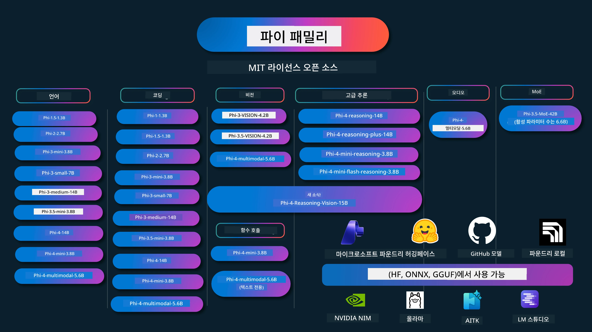

# Phi Cookbook: Microsoft의 Phi 모델을 사용한 실습 예제

[](https://codespaces.new/microsoft/phicookbook)
[](https://vscode.dev/redirect?url=vscode://ms-vscode-remote.remote-containers/cloneInVolume?url=https://github.com/microsoft/phicookbook)

[](https://GitHub.com/microsoft/phicookbook/graphs/contributors/?WT.mc_id=aiml-137032-kinfeylo)
[](https://GitHub.com/microsoft/phicookbook/issues/?WT.mc_id=aiml-137032-kinfeylo)
[](https://GitHub.com/microsoft/phicookbook/pulls/?WT.mc_id=aiml-137032-kinfeylo)
[](http://makeapullrequest.com?WT.mc_id=aiml-137032-kinfeylo)

[](https://GitHub.com/microsoft/phicookbook/watchers/?WT.mc_id=aiml-137032-kinfeylo)
[](https://GitHub.com/microsoft/phicookbook/network/?WT.mc_id=aiml-137032-kinfeylo)
[](https://GitHub.com/microsoft/phicookbook/stargazers/?WT.mc_id=aiml-137032-kinfeylo)

[](https://discord.com/invite/ByRwuEEgH4)

Phi는 Microsoft가 개발한 일련의 오픈 소스 AI 모델입니다.

Phi는 현재 다언어, 추론, 텍스트/채팅 생성, 코딩, 이미지, 오디오 및 기타 시나리오에서 매우 우수한 벤치마크를 가진 가장 강력하고 비용 효율적인 소형 언어 모델(SLM)입니다.

Phi는 클라우드나 엣지 장치에 배포할 수 있으며, 제한된 컴퓨팅 파워로도 쉽게 생성형 AI 애플리케이션을 구축할 수 있습니다.

이 리소스 사용을 시작하려면 다음 단계를 따르세요:
1. **저장소 포크하기**: 클릭 [](https://GitHub.com/microsoft/phicookbook/network/?WT.mc_id=aiml-137032-kinfeylo)
2. **저장소 클론하기**: `git clone https://github.com/microsoft/PhiCookBook.git`
3. [**Microsoft AI Discord 커뮤니티에 가입하여 전문가 및 동료 개발자 만나기**](https://discord.com/invite/ByRwuEEgH4?WT.mc_id=aiml-137032-kinfeylo)



### 🌐 다국어 지원

#### GitHub Action을 통해 지원 (자동화 및 항상 최신 유지)

<!-- CO-OP TRANSLATOR LANGUAGES TABLE START -->
[아랍어](../ar/README.md) | [벵골어](../bn/README.md) | [불가리아어](../bg/README.md) | [버마어 (미얀마)](../my/README.md) | [중국어 (간체)](../zh-CN/README.md) | [중국어 (번체, 홍콩)](../zh-HK/README.md) | [중국어 (번체, 마카오)](../zh-MO/README.md) | [중국어 (번체, 대만)](../zh-TW/README.md) | [크로아티아어](../hr/README.md) | [체코어](../cs/README.md) | [덴마크어](../da/README.md) | [네덜란드어](../nl/README.md) | [에스토니아어](../et/README.md) | [핀란드어](../fi/README.md) | [프랑스어](../fr/README.md) | [독일어](../de/README.md) | [그리스어](../el/README.md) | [히브리어](../he/README.md) | [힌디어](../hi/README.md) | [헝가리어](../hu/README.md) | [인도네시아어](../id/README.md) | [이탈리아어](../it/README.md) | [일본어](../ja/README.md) | [칸나다어](../kn/README.md) | [크메르어](../km/README.md) | [한국어](./README.md) | [리투아니아어](../lt/README.md) | [말레이어](../ms/README.md) | [말라얄람어](../ml/README.md) | [마라티어](../mr/README.md) | [네팔어](../ne/README.md) | [나이지리아 피진](../pcm/README.md) | [노르웨이어](../no/README.md) | [페르시아어 (파르시)](../fa/README.md) | [폴란드어](../pl/README.md) | [포르투갈어 (브라질)](../pt-BR/README.md) | [포르투갈어 (포르투갈)](../pt-PT/README.md) | [펀자브어 (구르무키)](../pa/README.md) | [루마니아어](../ro/README.md) | [러시아어](../ru/README.md) | [세르비아어 (키릴문자)](../sr/README.md) | [슬로바키아어](../sk/README.md) | [슬로베니아어](../sl/README.md) | [스페인어](../es/README.md) | [스와힐리어](../sw/README.md) | [스웨덴어](../sv/README.md) | [따갈로그어 (필리피노)](../tl/README.md) | [타밀어](../ta/README.md) | [텔루구어](../te/README.md) | [태국어](../th/README.md) | [터키어](../tr/README.md) | [우크라이나어](../uk/README.md) | [우르두어](../ur/README.md) | [베트남어](../vi/README.md)

> **로컬에 클론하는 것을 선호하시나요?**
>
> 이 저장소에는 50개 이상의 언어 번역이 포함되어 있어 다운로드 크기가 크게 증가합니다. 번역 없이 클론하려면 스파스 체크아웃을 사용하세요:
>
> **Bash / macOS / Linux:**
> ```bash
> git clone --filter=blob:none --sparse https://github.com/microsoft/PhiCookBook.git
> cd PhiCookBook
> git sparse-checkout set --no-cone '/*' '!translations' '!translated_images'
> ```
>
> **CMD (Windows):**
> ```cmd
> git clone --filter=blob:none --sparse https://github.com/microsoft/PhiCookBook.git
> cd PhiCookBook
> git sparse-checkout set --no-cone "/*" "!translations" "!translated_images"
> ```
>
> 이렇게 하면 코스 완료에 필요한 모든 것을 훨씬 빠른 다운로드로 얻을 수 있습니다.
<!-- CO-OP TRANSLATOR LANGUAGES TABLE END -->

## 목차

- 소개
  - [Phi 패밀리에 오신 것을 환영합니다](./md/01.Introduction/01/01.PhiFamily.md)
  - [환경 설정](./md/01.Introduction/01/01.EnvironmentSetup.md)
  - [주요 기술 이해하기](./md/01.Introduction/01/01.Understandingtech.md)
  - [Phi 모델을 위한 AI 안전성](./md/01.Introduction/01/01.AISafety.md)
  - [Phi 하드웨어 지원](./md/01.Introduction/01/01.Hardwaresupport.md)
  - [플랫폼별 Phi 모델 및 가용성](./md/01.Introduction/01/01.Edgeandcloud.md)
  - [Guidance-ai 및 Phi 사용하기](./md/01.Introduction/01/01.Guidance.md)
  - [GitHub 마켓플레이스 모델](https://github.com/marketplace/models)
  - [Azure AI 모델 카탈로그](https://ai.azure.com)

- 다양한 환경에서 Phi 추론
    -  [Hugging face](./md/01.Introduction/02/01.HF.md)
    -  [GitHub 모델](./md/01.Introduction/02/02.GitHubModel.md)
    -  [Microsoft Foundry 모델 카탈로그](./md/01.Introduction/02/03.AzureAIFoundry.md)
    -  [Ollama](./md/01.Introduction/02/04.Ollama.md)
    -  [AI Toolkit VSCode (AITK)](./md/01.Introduction/02/05.AITK.md)
    -  [NVIDIA NIM](./md/01.Introduction/02/06.NVIDIA.md)
    -  [Foundry Local](./md/01.Introduction/02/07.FoundryLocal.md)

- Phi 패밀리 추론
    - [iOS에서 Phi 추론](./md/01.Introduction/03/iOS_Inference.md)
    - [Android에서 Phi 추론](./md/01.Introduction/03/Android_Inference.md)
    - [Jetson에서 Phi 추론](./md/01.Introduction/03/Jetson_Inference.md)
    - [AI PC에서 Phi 추론](./md/01.Introduction/03/AIPC_Inference.md)
    - [Apple MLX 프레임워크와 함께하는 Phi 추론](./md/01.Introduction/03/MLX_Inference.md)
    - [로컬 서버에서 Phi 추론](./md/01.Introduction/03/Local_Server_Inference.md)
    - [AI Toolkit을 사용한 원격 서버에서 Phi 추론](./md/01.Introduction/03/Remote_Interence.md)
    - [Rust와 함께하는 Phi 추론](./md/01.Introduction/03/Rust_Inference.md)
    - [로컬에서 Phi--Vision 추론](./md/01.Introduction/03/Vision_Inference.md)
    - [Kaito AKS, Azure Containers(공식 지원)와 함께하는 Phi 추론](./md/01.Introduction/03/Kaito_Inference.md)
-  [Phi 패밀리 양자화](./md/01.Introduction/04/QuantifyingPhi.md)
    - [llama.cpp를 사용한 Phi-3.5 / 4 양자화](./md/01.Introduction/04/UsingLlamacppQuantifyingPhi.md)
    - [onnxruntime용 생성형 AI 확장을 사용한 Phi-3.5 / 4 양자화](./md/01.Introduction/04/UsingORTGenAIQuantifyingPhi.md)
    - [Intel OpenVINO를 사용한 Phi-3.5 / 4 양자화](./md/01.Introduction/04/UsingIntelOpenVINOQuantifyingPhi.md)
    - [Apple MLX 프레임워크를 사용한 Phi-3.5 / 4 양자화](./md/01.Introduction/04/UsingAppleMLXQuantifyingPhi.md)

- 평가 Phi
    - [Responsible AI](./md/01.Introduction/05/ResponsibleAI.md)
    - [평가를 위한 Microsoft Foundry](./md/01.Introduction/05/AIFoundry.md)
    - [Promptflow를 사용한 평가](./md/01.Introduction/05/Promptflow.md)
 
- Azure AI Search와 함께하는 RAG
    - [Azure AI Search와 함께 Phi-4-mini 및 Phi-4-multimodal(RAG) 사용 방법](https://github.com/microsoft/PhiCookBook/blob/main/code/06.E2E/E2E_Phi-4-RAG-Azure-AI-Search.ipynb)

- Phi 응용 프로그램 개발 샘플
  - 텍스트 및 채팅 애플리케이션
    - Phi-4 샘플 
      - [📓] [Phi-4-mini ONNX 모델과 채팅하기](./md/02.Application/01.TextAndChat/Phi4/ChatWithPhi4ONNX/README.md)
      - [Phi-4 로컬 ONNX 모델과 .NET으로 채팅하기](../../md/04.HOL/dotnet/src/LabsPhi4-Chat-01OnnxRuntime)
      - [Semantic Kernel을 사용한 Phi-4 ONNX 채팅 .NET 콘솔 앱](../../md/04.HOL/dotnet/src/LabsPhi4-Chat-02SK)
    - Phi-3 / 3.5 샘플
      - [Phi3, ONNX Runtime Web 및 WebGPU를 사용한 브라우저 내 로컬 챗봇](https://github.com/microsoft/onnxruntime-inference-examples/tree/main/js/chat)
      - [OpenVino 채팅](./md/02.Application/01.TextAndChat/Phi3/E2E_OpenVino_Chat.md)
      - [멀티 모델 - 대화형 Phi-3-mini와 OpenAI Whisper](./md/02.Application/01.TextAndChat/Phi3/E2E_Phi-3-mini_with_whisper.md)
      - [MLFlow - 래퍼 빌드 및 Phi-3와 MLFlow 사용](./md//02.Application/01.TextAndChat/Phi3/E2E_Phi-3-MLflow.md)
      - [모델 최적화 - Olive를 사용하여 ONNX Runtime Web용 Phi-3-min 모델 최적화 방법](https://github.com/microsoft/Olive/tree/main/examples/phi3)
      - [Phi-3 mini-4k-instruct-onnx와 함께하는 WinUI3 앱](https://github.com/microsoft/Phi3-Chat-WinUI3-Sample/)
      -[WinUI3 멀티 모델 AI 기반 노트 앱 샘플](https://github.com/microsoft/ai-powered-notes-winui3-sample)
      - [사용자 지정 Phi-3 모델 미세 조정 및 Prompt flow 통합](./md/02.Application/01.TextAndChat/Phi3/E2E_Phi-3-FineTuning_PromptFlow_Integration.md)
      - [Microsoft Foundry에서 Prompt flow로 사용자 지정 Phi-3 모델 미세 조정 및 통합](./md/02.Application/01.TextAndChat/Phi3/E2E_Phi-3-FineTuning_PromptFlow_Integration_AIFoundry.md)
      - [Microsoft의 책임 있는 AI 원칙에 중점을 두고 Microsoft Foundry에서 미세 조정된 Phi-3 / Phi-3.5 모델 평가](./md/02.Application/01.TextAndChat/Phi3/E2E_Phi-3-Evaluation_AIFoundry.md)
      - [📓] [Phi-3.5-mini-instruct 언어 예측 샘플 (중국어/영어)](./md/02.Application/01.TextAndChat/Phi3/phi3-instruct-demo.ipynb)
      - [Phi-3.5-Instruct WebGPU RAG 챗봇](./md/02.Application/01.TextAndChat/Phi3/WebGPUWithPhi35Readme.md)
      - [Windows GPU를 사용하여 Phi-3.5-Instruct ONNX로 Prompt flow 솔루션 만들기](./md/02.Application/01.TextAndChat/Phi3/UsingPromptFlowWithONNX.md)
      - [Microsoft Phi-3.5 tflite를 사용하여 Android 앱 만들기](./md/02.Application/01.TextAndChat/Phi3/UsingPhi35TFLiteCreateAndroidApp.md)
      - [Microsoft.ML.OnnxRuntime를 사용해 로컬 ONNX Phi-3 모델을 이용한 Q&A .NET 예제](../../md/04.HOL/dotnet/src/LabsPhi301)
      - [Semantic Kernel 및 Phi-3과 함께하는 콘솔 채팅 .NET 앱](../../md/04.HOL/dotnet/src/LabsPhi302)

  - Azure AI 추론 SDK 코드 기반 샘플 
    - Phi-4 샘플 
      - [📓] [Phi-4-multimodal로 프로젝트 코드 생성하기](./md/02.Application/02.Code/Phi4/GenProjectCode/README.md)
    - Phi-3 / 3.5 샘플
      - [Microsoft Phi-3 가족을 사용하여 Visual Studio Code GitHub Copilot Chat 만들기](./md/02.Application/02.Code/Phi3/VSCodeExt/README.md)
      - [GitHub 모델로 Phi-3.5 Visual Studio Code 채팅 코파일럿 에이전트 만들기](/md/02.Application/02.Code/Phi3/CreateVSCodeChatAgentWithGitHubModels.md)

  - 고급 추론 샘플
    - Phi-4 샘플 
      - [📓] [Phi-4-mini-추론 또는 Phi-4-추론 샘플](./md/02.Application/03.AdvancedReasoning/Phi4/AdvancedResoningPhi4mini/README.md)
      - [📓] [Microsoft Olive로 Phi-4-mini-추론 미세 조정](./md/02.Application/03.AdvancedReasoning/Phi4/AdvancedResoningPhi4mini/olive_ft_phi_4_reasoning_with_medicaldata.ipynb)
      - [📓] [Apple MLX로 Phi-4-mini-추론 미세 조정](./md/02.Application/03.AdvancedReasoning/Phi4/AdvancedResoningPhi4mini/mlx_ft_phi_4_reasoning_with_medicaldata.ipynb)
      - [📓] [GitHub 모델로 Phi-4-mini-추론](./md/02.Application/02.Code/Phi4r/github_models_inference.ipynb)
      - [📓] [Microsoft Foundry 모델로 Phi-4-mini-추론](./md/02.Application/02.Code/Phi4r/azure_models_inference.ipynb)
  - 데모
      - [Hugging Face Spaces에 호스팅된 Phi-4-mini 데모](https://huggingface.co/spaces/microsoft/phi-4-mini?WT.mc_id=aiml-137032-kinfeylo)
      - [Hugging Face Spaces에 호스팅된 Phi-4-multimodal 데모](https://huggingface.co/spaces/microsoft/phi-4-multimodal?WT.mc_id=aiml-137032-kinfeylo)
  - 비전 샘플
    - Phi-4 샘플 
      - [📓] [Phi-4-multimodal을 사용하여 이미지 읽기 및 코드 생성](./md/02.Application/04.Vision/Phi4/CreateFrontend/README.md) 
    - Phi-3 / 3.5 샘플
      -  [📓][Phi-3-vision-이미지 텍스트에서 텍스트로](./md/02.Application/04.Vision/Phi3/E2E_Phi-3-vision-image-text-to-text-online-endpoint.ipynb)
      - [Phi-3-vision-ONNX](https://onnxruntime.ai/docs/genai/tutorials/phi3-v.html)
      - [📓][Phi-3-vision CLIP 임베딩](./md/02.Application/04.Vision/Phi3/E2E_Phi-3-vision-image-text-to-text-online-endpoint.ipynb)
      - [데모: Phi-3 재활용](https://github.com/jennifermarsman/PhiRecycling/)
      - [Phi-3-vision - 시각적 언어 도우미 - Phi3-Vision 및 OpenVINO와 함께](https://docs.openvino.ai/nightly/notebooks/phi-3-vision-with-output.html)
      - [Phi-3 비전 Nvidia NIM](./md/02.Application/04.Vision/Phi3/E2E_Nvidia_NIM_Vision.md)
      - [Phi-3 비전 OpenVino](./md/02.Application/04.Vision/Phi3/E2E_OpenVino_Phi3Vision.md)
      - [📓][Phi-3.5 비전 다중 프레임 또는 다중 이미지 샘플](./md/02.Application/04.Vision/Phi3/phi3-vision-demo.ipynb)
      - [Microsoft.ML.OnnxRuntime .NET을 사용한 Phi-3 Vision 로컬 ONNX 모델](../../md/04.HOL/dotnet/src/LabsPhi303)
      - [메뉴 기반 Phi-3 Vision 로컬 ONNX 모델 Microsoft.ML.OnnxRuntime .NET 사용](../../md/04.HOL/dotnet/src/LabsPhi304)

  - 추론-비전 샘플
    - Phi-4-추론-비전-15B 
      - [📓] [Phi-4-추론-비전-15B를 사용한 무단 횡단 감지](./md/02.Application/10.ReasoningVision/Phi_4_reasoning_vision_15b_Jaywalking.ipynb)
      - [📓] [Phi-4-추론-비전-15B로 수학 문제 풀기](./md/02.Application/10.ReasoningVision/Phi_4_reasoning_vision_15b_Math.ipynb)
      - [📓] [Phi-4-추론-비전-15B를 사용한 UI 감지](./md/02.Application/10.ReasoningVision/Phi_4_reasoning_vision_15b_ui.ipynb)

  - 수학 샘플
    -  Phi-4-미니-플래시-추론-지침 샘플  [Phi-4-미니-플래시-추론-지침 수학 데모](./md/02.Application/09.Math/MathDemo.ipynb)

  - 오디오 샘플
    - Phi-4 샘플 
      - [📓] [Phi-4-multimodal을 활용한 오디오 기록 추출](./md/02.Application/05.Audio/Phi4/Transciption/README.md)
      - [📓] [Phi-4-multimodal 오디오 샘플](./md/02.Application/05.Audio/Phi4/Siri/demo.ipynb)
      - [📓] [Phi-4-multimodal 음성 번역 샘플](./md/02.Application/05.Audio/Phi4/Translate/demo.ipynb)
      - [.NET 콘솔 앱을 사용한 Phi-4-multimodal 오디오 분석 및 기록 생성](../../md/04.HOL/dotnet/src/LabsPhi4-MultiModal-02Audio)

  - MOE 샘플
    - Phi-3 / 3.5 샘플
      - [📓] [Phi-3.5 전문가 혼합 모델(MoEs) 소셜 미디어 샘플](./md/02.Application/06.MoE/Phi3/phi3_moe_demo.ipynb)
      - [📓] [NVIDIA NIM Phi-3 MOE, Azure AI Search 및 LlamaIndex를 사용한 RAG(검색 보강 생성) 파이프라인 구축](./md/02.Application/06.MoE/Phi3/azure-ai-search-nvidia-rag.ipynb)
      - 
  - 함수 호출 샘플
    - Phi-4 샘플 🆕
      -  [📓] [Phi-4-mini와 함께 함수 호출 사용하기](./md/02.Application/07.FunctionCalling/Phi4/FunctionCallingBasic/README.md)
      -  [📓] [함수 호출을 사용하여 Phi-4-mini로 다중 에이전트 만들기](./md/02.Application/07.FunctionCalling/Phi4/Multiagents/Phi_4_mini_multiagent.ipynb)
      -  [📓] [Ollama와 함께 함수 호출 사용하기](./md/02.Application/07.FunctionCalling/Phi4/Ollama/ollama_functioncalling.ipynb)
      -  [📓] [ONNX와 함께 함수 호출 사용하기](./md/02.Application/07.FunctionCalling/Phi4/ONNX/onnx_parallel_functioncalling.ipynb)
  - 멀티모달 믹싱 샘플
    - Phi-4 샘플 🆕
      -  [📓] [기술 저널리스트로서 Phi-4-multimodal 사용하기](./md/02.Application/08.Multimodel/Phi4/TechJournalist/phi_4_mm_audio_text_publish_news.ipynb)
      - [.NET 콘솔 앱을 사용하여 Phi-4-multimodal로 이미지 분석](../../md/04.HOL/dotnet/src/LabsPhi4-MultiModal-01Images)

- Phi 미세 조정 샘플
  - [미세 조정 시나리오](./md/03.FineTuning/FineTuning_Scenarios.md)
  - [미세 조정 vs RAG](./md/03.FineTuning/FineTuning_vs_RAG.md)
  - [Phi-3을 산업 전문가로 만드는 미세 조정](./md/03.FineTuning/LetPhi3gotoIndustriy.md)
  - [VS Code용 AI 도구 키트를 사용한 Phi-3 미세 조정](./md/03.FineTuning/Finetuning_VSCodeaitoolkit.md)
  - [Azure Machine Learning 서비스를 사용한 Phi-3 미세 조정](./md/03.FineTuning/Introduce_AzureML.md)
  - [Lora를 사용한 Phi-3 미세 조정](./md/03.FineTuning/FineTuning_Lora.md)
  - [QLora를 사용한 Phi-3 미세 조정](./md/03.FineTuning/FineTuning_Qlora.md)
  - [Microsoft Foundry를 사용한 Phi-3 미세 조정](./md/03.FineTuning/FineTuning_AIFoundry.md)
  - [Azure ML CLI/SDK를 사용한 Phi-3 미세 조정](./md/03.FineTuning/FineTuning_MLSDK.md)
  - [Microsoft Olive를 사용한 미세 조정](./md/03.FineTuning/FineTuning_MicrosoftOlive.md)
  - [Microsoft Olive 실습 랩을 통한 미세 조정](./md/03.FineTuning/olive-lab/readme.md)
  - [Weights and Bias를 사용한 Phi-3-vision 미세 조정](./md/03.FineTuning/FineTuning_Phi-3-visionWandB.md)
  - [Apple MLX 프레임워크를 사용한 Phi-3 미세 조정](./md/03.FineTuning/FineTuning_MLX.md)
  - [Phi-3-vision 미세 조정 (공식 지원)](./md/03.FineTuning/FineTuning_Vision.md)
  - [Kaito AKS, Azure 컨테이너(공식 지원)로 Phi-3 미세 조정하기](./md/03.FineTuning/FineTuning_Kaito.md)
  - [Phi-3 및 3.5 Vision 미세 조정](https://github.com/2U1/Phi3-Vision-Finetune)

- 실습 랩
  - [최첨단 모델 탐색: LLM, SLM, 로컬 개발 등](https://github.com/microsoft/aitour-exploring-cutting-edge-models)
  - [NLP 잠재력 열기: Microsoft Olive로 미세 조정하기](https://github.com/azure/Ignite_FineTuning_workshop)

- 학술 연구 논문 및 출판물
  - [Textbooks Are All You Need II: phi-1.5 기술 보고서](https://arxiv.org/abs/2309.05463)
  - [Phi-3 기술 보고서: 휴대폰에서 로컬로 실행하는 고성능 언어 모델](https://arxiv.org/abs/2404.14219)
  - [Phi-4 기술 보고서](https://arxiv.org/abs/2412.08905)
  - [Phi-4-Mini 기술 보고서: 혼합 LoRA를 통한 컴팩트하면서도 강력한 멀티모달 언어 모델](https://arxiv.org/abs/2503.01743)
  - [차량 내 함수 호출을 위한 소형 언어 모델 최적화](https://arxiv.org/abs/2501.02342)
  - [(WhyPHI) 다지선다형 질문 답변을 위한 PHI-3 미세 조정: 방법론, 결과 및 과제](https://arxiv.org/abs/2501.01588)
  - [Phi-4-추론 기술 보고서](https://www.microsoft.com/en-us/research/wp-content/uploads/2025/04/phi_4_reasoning.pdf)
  - [Phi-4-mini-추론 기술 보고서](https://huggingface.co/microsoft/Phi-4-mini-reasoning/blob/main/Phi-4-Mini-Reasoning.pdf)

## Phi 모델 사용하기

### Microsoft Foundry의 Phi

Microsoft Phi를 사용하는 방법과 다양한 하드웨어 장치에서 E2E 솔루션을 구축하는 방법을 배울 수 있습니다. 직접 Phi를 경험하려면, [Microsoft Foundry Azure AI 모델 카탈로그](https://aka.ms/phi3-azure-ai)에서 모델을 시험하고 시나리오에 맞게 Phi를 맞춤화하는 것부터 시작하세요. [Microsoft Foundry 시작하기](/md/02.QuickStart/AzureAIFoundry_QuickStart.md)에서 자세히 알아볼 수 있습니다.

<strong>플레이그라운드</strong>
각 모델별 전용 플레이그라운드에서 모델을 테스트할 수 있습니다: [Azure AI Playground](https://aka.ms/try-phi3).

### GitHub 모델의 Phi

Microsoft Phi를 사용하는 방법과 다양한 하드웨어 장치용 E2E 솔루션 구축 방법을 배울 수 있습니다. 직접 Phi를 경험하려면 [GitHub 모델 카탈로그](https://github.com/marketplace/models?WT.mc_id=aiml-137032-kinfeylo)를 통해 모델을 시험하고 시나리오에 맞게 Phi를 맞춤화하세요. [GitHub 모델 카탈로그 시작하기](/md/02.QuickStart/GitHubModel_QuickStart.md)에서 자세히 알아볼 수 있습니다.

<strong>플레이그라운드</strong>
각 모델별 전용 [플레이그라운드에서 모델 테스트](/md/02.QuickStart/GitHubModel_QuickStart.md) 가능합니다.

### Hugging Face의 Phi

모델은 [Hugging Face](https://huggingface.co/microsoft)에서도 찾을 수 있습니다.

<strong>플레이그라운드</strong>
[Hugging Chat 플레이그라운드](https://huggingface.co/chat/models/microsoft/Phi-3-mini-4k-instruct)

## 🎒 기타 강좌

우리 팀은 다른 강좌들도 제작합니다! 확인해 보세요:

<!-- CO-OP TRANSLATOR OTHER COURSES START -->
### LangChain
[](https://aka.ms/langchain4j-for-beginners)
[](https://aka.ms/langchainjs-for-beginners?WT.mc_id=m365-94501-dwahlin)
[](https://github.com/microsoft/langchain-for-beginners?WT.mc_id=m365-94501-dwahlin)
---

### Azure / Edge / MCP / 에이전트
[](https://github.com/microsoft/AZD-for-beginners?WT.mc_id=academic-105485-koreyst)
[](https://github.com/microsoft/edgeai-for-beginners?WT.mc_id=academic-105485-koreyst)
[](https://github.com/microsoft/mcp-for-beginners?WT.mc_id=academic-105485-koreyst)
[](https://github.com/microsoft/ai-agents-for-beginners?WT.mc_id=academic-105485-koreyst)

---

### 생성 AI 시리즈
[](https://github.com/microsoft/generative-ai-for-beginners?WT.mc_id=academic-105485-koreyst)
[-9333EA?style=for-the-badge&labelColor=E5E7EB&color=9333EA)](https://github.com/microsoft/Generative-AI-for-beginners-dotnet?WT.mc_id=academic-105485-koreyst)
[-C084FC?style=for-the-badge&labelColor=E5E7EB&color=C084FC)](https://github.com/microsoft/generative-ai-for-beginners-java?WT.mc_id=academic-105485-koreyst)
[-E879F9?style=for-the-badge&labelColor=E5E7EB&color=E879F9)](https://github.com/microsoft/generative-ai-with-javascript?WT.mc_id=academic-105485-koreyst)

---

### 핵심 학습
[](https://aka.ms/ml-beginners?WT.mc_id=academic-105485-koreyst)
[](https://aka.ms/datascience-beginners?WT.mc_id=academic-105485-koreyst)
[](https://aka.ms/ai-beginners?WT.mc_id=academic-105485-koreyst)
[](https://github.com/microsoft/Security-101?WT.mc_id=academic-96948-sayoung)
[](https://aka.ms/webdev-beginners?WT.mc_id=academic-105485-koreyst)
[](https://aka.ms/iot-beginners?WT.mc_id=academic-105485-koreyst)
[](https://github.com/microsoft/xr-development-for-beginners?WT.mc_id=academic-105485-koreyst)

---

### 코파일럿 시리즈
[](https://aka.ms/GitHubCopilotAI?WT.mc_id=academic-105485-koreyst)
[](https://github.com/microsoft/mastering-github-copilot-for-dotnet-csharp-developers?WT.mc_id=academic-105485-koreyst)
[](https://github.com/microsoft/CopilotAdventures?WT.mc_id=academic-105485-koreyst)
<!-- CO-OP TRANSLATOR OTHER COURSES END -->

## 책임 있는 AI

마이크로소프트는 고객이 당사의 AI 제품을 책임감 있게 사용할 수 있도록 지원하며, 학습 내용을 공유하고 투명성 노트 및 영향 평가와 같은 도구를 통해 신뢰 기반의 파트너십을 구축하는 데 최선을 다하고 있습니다. 이러한 자료는 [https://aka.ms/RAI](https://aka.ms/RAI)에서 찾을 수 있습니다.
마이크로소프트의 책임 있는 AI 접근 방식은 공정성, 신뢰성 및 안전성, 개인정보 보호 및 보안, 포용성, 투명성, 그리고 책임성에 관한 AI 원칙에 기반합니다.

이 샘플에 사용된 것과 같은 대규모 자연어, 이미지, 음성 모델은 부당하거나 신뢰할 수 없거나 불쾌감을 줄 수 있는 행동을 할 가능성이 있어 피해를 줄 수 있습니다. 위험과 한계에 대한 정보를 얻으려면 [Azure OpenAI 서비스 투명성 노트](https://learn.microsoft.com/legal/cognitive-services/openai/transparency-note?tabs=text)를 참조하시기 바랍니다.
위험을 완화하는 권장 방법은 아키텍처에 유해한 동작을 감지하고 방지할 수 있는 안전 시스템을 포함하는 것입니다. [Azure AI Content Safety](https://learn.microsoft.com/azure/ai-services/content-safety/overview)는 독립적인 보호 계층을 제공하여 애플리케이션과 서비스에서 유해한 사용자 생성 및 AI 생성 콘텐츠를 감지할 수 있습니다. Azure AI Content Safety에는 유해한 자료를 감지할 수 있는 텍스트 및 이미지 API가 포함되어 있습니다. Microsoft Foundry 내에서 Content Safety 서비스는 다양한 양식의 유해 콘텐츠를 감지하는 샘플 코드를 보고, 탐색하고, 시도해 볼 수 있도록 합니다. 다음 [빠른 시작 문서](https://learn.microsoft.com/azure/ai-services/content-safety/quickstart-text?tabs=visual-studio%2Clinux&pivots=programming-language-rest)는 서비스에 요청하는 방법을 안내합니다.

또 다른 고려 사항은 전체 애플리케이션 성능입니다. 다중 양식 및 다중 모델 애플리케이션의 경우, 성능은 시스템이 사용자와 개발자가 기대하는 대로, 유해한 출력을 생성하지 않는 것을 포함하여 수행하는 것을 의미합니다. [성능 및 품질 및 위험 및 안전 평가자](https://learn.microsoft.com/azure/ai-studio/concepts/evaluation-metrics-built-in)를 사용하여 전체 애플리케이션의 성능을 평가하는 것이 중요합니다. 또한 [사용자 지정 평가자](https://learn.microsoft.com/azure/ai-studio/how-to/develop/evaluate-sdk#custom-evaluators)를 생성하고 평가할 수 있는 기능도 제공합니다.

[Azure AI Evaluation SDK](https://microsoft.github.io/promptflow/index.html)를 사용하여 개발 환경에서 AI 애플리케이션을 평가할 수 있습니다. 테스트 데이터 세트 또는 목표가 주어지면, 생성 AI 애플리케이션 생성물은 내장된 평가자 또는 선택한 사용자 지정 평가자를 통해 정량적으로 측정됩니다. 시스템을 평가하기 위한 azure ai evaluation sdk를 시작하려면 [빠른 시작 가이드](https://learn.microsoft.com/azure/ai-studio/how-to/develop/flow-evaluate-sdk)를 참조할 수 있습니다. 평가 실행을 완료하면 [Microsoft Foundry에서 결과를 시각화](https://learn.microsoft.com/azure/ai-studio/how-to/evaluate-flow-results)할 수 있습니다.

## 상표

이 프로젝트에는 프로젝트, 제품 또는 서비스의 상표 또는 로고가 포함될 수 있습니다. Microsoft 상표 또는 로고의 권한 있는 사용은 [Microsoft의 상표 및 브랜드 지침](https://www.microsoft.com/legal/intellectualproperty/trademarks/usage/general)을 준수해야 합니다.
이 프로젝트의 수정된 버전에서 Microsoft 상표 또는 로고를 사용하는 것은 혼동을 초래하거나 Microsoft 후원을 시사해서는 안 됩니다. 제3자 상표 또는 로고의 모든 사용은 해당 제3자의 정책에 따릅니다.

## 도움말 받기

AI 앱 개발 중에 문제가 발생하거나 질문이 있는 경우 다음에 참여하세요:

[](https://aka.ms/foundry/discord)

제품 피드백이나 빌드 중 오류가 있는 경우 방문하세요:

[](https://aka.ms/foundry/forum)

---

<!-- CO-OP TRANSLATOR DISCLAIMER START -->
**면책 조항**:  
이 문서는 AI 번역 서비스 [Co-op Translator](https://github.com/Azure/co-op-translator)를 사용하여 번역되었습니다. 정확성을 위해 최선을 다하고 있으나, 자동 번역은 오류나 부정확한 내용이 포함될 수 있습니다. 원문은 해당 언어의 원본 문서가 권위 있는 출처로 간주되어야 합니다. 중요한 정보의 경우 전문적인 인간 번역을 권장합니다. 이 번역 사용으로 인해 발생하는 모든 오해나 오역에 대해 당사는 책임을 지지 않습니다.
<!-- CO-OP TRANSLATOR DISCLAIMER END -->