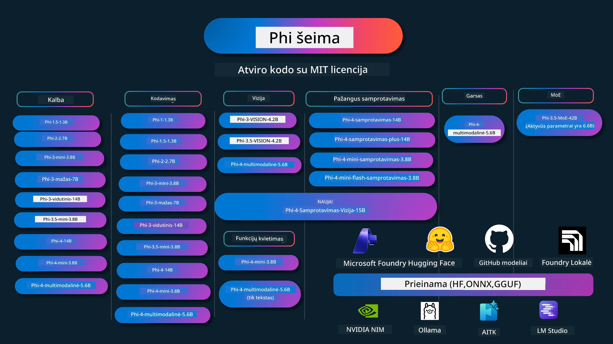

# Phi Receptų Knyga: Praktiniai Pavyzdžiai su „Microsoft“ Phi Modeliais

[](https://codespaces.new/microsoft/phicookbook)
[](https://vscode.dev/redirect?url=vscode://ms-vscode-remote.remote-containers/cloneInVolume?url=https://github.com/microsoft/phicookbook)

[](https://GitHub.com/microsoft/phicookbook/graphs/contributors/?WT.mc_id=aiml-137032-kinfeylo)
[](https://GitHub.com/microsoft/phicookbook/issues/?WT.mc_id=aiml-137032-kinfeylo)
[](https://GitHub.com/microsoft/phicookbook/pulls/?WT.mc_id=aiml-137032-kinfeylo)
[](http://makeapullrequest.com?WT.mc_id=aiml-137032-kinfeylo)

[](https://GitHub.com/microsoft/phicookbook/watchers/?WT.mc_id=aiml-137032-kinfeylo)
[](https://GitHub.com/microsoft/phicookbook/network/?WT.mc_id=aiml-137032-kinfeylo)
[](https://GitHub.com/microsoft/phicookbook/stargazers/?WT.mc_id=aiml-137032-kinfeylo)

[](https://discord.com/invite/ByRwuEEgH4)

Phi yra atvirojo kodo DI modelių serija, sukurta „Microsoft“. 

Šiuo metu Phi yra galingiausias ir ekonomiškiausias mažas kalbos modelis (SLM), kuris turi labai gerus etaloninius rodiklius daugikalbiškumo, samprotavimo, teksto/pokalbių generavimo, kodavimo, vaizdų, garso ir kitose srityse. 

Jūs galite diegti Phi debesyje arba kraštiniuose įrenginiuose, taip pat lengvai kurti generatyvios DI programas su ribotais skaičiavimo ištekliais.

Sekite šiuos žingsnius, kad pradėtumėte naudotis šiais ištekliais:
1. **Padarykite "Fork" šiam Paskirstymui**: Spauskite [](https://GitHub.com/microsoft/phicookbook/network/?WT.mc_id=aiml-137032-kinfeylo)
2. **Klonuokite Paskirstymą**: `git clone https://github.com/microsoft/PhiCookBook.git`
3. [**Prisijunkite prie Microsoft AI Discord bendruomenės ir susipažinkite su ekspertais ir kitais kūrėjais**](https://discord.com/invite/ByRwuEEgH4?WT.mc_id=aiml-137032-kinfeylo)



### 🌐 Daugiakalbė Parama

#### Palaikoma per GitHub Action (automatizuota ir visada atnaujinama)

<!-- CO-OP TRANSLATOR LANGUAGES TABLE START -->
[Arabic](../ar/README.md) | [Bengali](../bn/README.md) | [Bulgarian](../bg/README.md) | [Burmese (Myanmar)](../my/README.md) | [Chinese (Simplified)](../zh-CN/README.md) | [Chinese (Traditional, Hong Kong)](../zh-HK/README.md) | [Chinese (Traditional, Macau)](../zh-MO/README.md) | [Chinese (Traditional, Taiwan)](../zh-TW/README.md) | [Croatian](../hr/README.md) | [Czech](../cs/README.md) | [Danish](../da/README.md) | [Dutch](../nl/README.md) | [Estonian](../et/README.md) | [Finnish](../fi/README.md) | [French](../fr/README.md) | [German](../de/README.md) | [Greek](../el/README.md) | [Hebrew](../he/README.md) | [Hindi](../hi/README.md) | [Hungarian](../hu/README.md) | [Indonesian](../id/README.md) | [Italian](../it/README.md) | [Japanese](../ja/README.md) | [Kannada](../kn/README.md) | [Khmer](../km/README.md) | [Korean](../ko/README.md) | [Lithuanian](./README.md) | [Malay](../ms/README.md) | [Malayalam](../ml/README.md) | [Marathi](../mr/README.md) | [Nepali](../ne/README.md) | [Nigerian Pidgin](../pcm/README.md) | [Norwegian](../no/README.md) | [Persian (Farsi)](../fa/README.md) | [Polish](../pl/README.md) | [Portuguese (Brazil)](../pt-BR/README.md) | [Portuguese (Portugal)](../pt-PT/README.md) | [Punjabi (Gurmukhi)](../pa/README.md) | [Romanian](../ro/README.md) | [Russian](../ru/README.md) | [Serbian (Cyrillic)](../sr/README.md) | [Slovak](../sk/README.md) | [Slovenian](../sl/README.md) | [Spanish](../es/README.md) | [Swahili](../sw/README.md) | [Swedish](../sv/README.md) | [Tagalog (Filipino)](../tl/README.md) | [Tamil](../ta/README.md) | [Telugu](../te/README.md) | [Thai](../th/README.md) | [Turkish](../tr/README.md) | [Ukrainian](../uk/README.md) | [Urdu](../ur/README.md) | [Vietnamese](../vi/README.md)

> **Teikiate pirmenybę klonuoti lokaliai?**
>
> Šiame paskirstyme yra daugiau nei 50 kalbų vertimų, kurie ženkliai padidina parsisiuntimo dydį. Norėdami klonuoti be vertimų, naudokite ribotą atsisiuntimą:
>
> **Bash / macOS / Linux:**
> ```bash
> git clone --filter=blob:none --sparse https://github.com/microsoft/PhiCookBook.git
> cd PhiCookBook
> git sparse-checkout set --no-cone '/*' '!translations' '!translated_images'
> ```
>
> **CMD (Windows):**
> ```cmd
> git clone --filter=blob:none --sparse https://github.com/microsoft/PhiCookBook.git
> cd PhiCookBook
> git sparse-checkout set --no-cone "/*" "!translations" "!translated_images"
> ```
>
> Tai suteiks jums viską, ko reikia kursui užbaigti, daug greičiau atsisiunčiant.
<!-- CO-OP TRANSLATOR LANGUAGES TABLE END -->

## Turinys

- Įvadas
  - [Sveiki atvykę į Phi šeimą](./md/01.Introduction/01/01.PhiFamily.md)
  - [Jūsų aplinkos nustatymas](./md/01.Introduction/01/01.EnvironmentSetup.md)
  - [Pagrindinių technologijų supratimas](./md/01.Introduction/01/01.Understandingtech.md)
  - [DI saugumas Phi modeliams](./md/01.Introduction/01/01.AISafety.md)
  - [Phi aparatinės įrangos palaikymas](./md/01.Introduction/01/01.Hardwaresupport.md)
  - [Phi modeliai ir jų prieinamumas platformose](./md/01.Introduction/01/01.Edgeandcloud.md)
  - [Naudojant Guidance-ai ir Phi](./md/01.Introduction/01/01.Guidance.md)
  - [GitHub Marketplace modeliai](https://github.com/marketplace/models)
  - [Azure DI modelių katalogas](https://ai.azure.com)

- Phi spėjimas skirtingose aplinkose
    -  [Hugging face](./md/01.Introduction/02/01.HF.md)
    -  [GitHub modeliai](./md/01.Introduction/02/02.GitHubModel.md)
    -  [Microsoft Foundry modelių katalogas](./md/01.Introduction/02/03.AzureAIFoundry.md)
    -  [Ollama](./md/01.Introduction/02/04.Ollama.md)
    -  [DI įrankių rinkinys VSCode (AITK)](./md/01.Introduction/02/05.AITK.md)
    -  [NVIDIA NIM](./md/01.Introduction/02/06.NVIDIA.md)
    -  [Foundry vietinis](./md/01.Introduction/02/07.FoundryLocal.md)

- Phi šeimos spėjimas
    - [Phi spėjimas iOS](./md/01.Introduction/03/iOS_Inference.md)
    - [Phi spėjimas Android](./md/01.Introduction/03/Android_Inference.md)
    - [Phi spėjimas Jetson](./md/01.Introduction/03/Jetson_Inference.md)
    - [Phi spėjimas DI kompiuteryje](./md/01.Introduction/03/AIPC_Inference.md)
    - [Phi spėjimas su Apple MLX Framework](./md/01.Introduction/03/MLX_Inference.md)
    - [Phi spėjimas vietiniame serveryje](./md/01.Introduction/03/Local_Server_Inference.md)
    - [Phi spėjimas nuotoliniame serveryje naudojant DI įrankių rinkinį](./md/01.Introduction/03/Remote_Interence.md)
    - [Phi spėjimas su Rust](./md/01.Introduction/03/Rust_Inference.md)
    - [Phi – regos spėjimas vietoje](./md/01.Introduction/03/Vision_Inference.md)
    - [Phi spėjimas su Kaito AKS, Azure konteineriais (oficialus palaikymas)](./md/01.Introduction/03/Kaito_Inference.md)
-  [Phi šeimos kiekybinimas](./md/01.Introduction/04/QuantifyingPhi.md)
    - [Phi-3.5 / 4 kiekybinimas naudojant llama.cpp](./md/01.Introduction/04/UsingLlamacppQuantifyingPhi.md)
    - [Phi-3.5 / 4 kiekybinimas naudojant Generatyvios DI plėtinius for onnxruntime](./md/01.Introduction/04/UsingORTGenAIQuantifyingPhi.md)
    - [Phi-3.5 / 4 kiekybinimas naudojant Intel OpenVINO](./md/01.Introduction/04/UsingIntelOpenVINOQuantifyingPhi.md)
    - [Phi-3.5 / 4 kiekybinimas naudojant Apple MLX Framework](./md/01.Introduction/04/UsingAppleMLXQuantifyingPhi.md)

-  Phi vertinimas
    - [Atsakinga DI](./md/01.Introduction/05/ResponsibleAI.md)
    - [Microsoft Foundry vertinimui](./md/01.Introduction/05/AIFoundry.md)
    - [Naudojant Promptflow vertinimui](./md/01.Introduction/05/Promptflow.md)
 
- RAG su Azure DI paieška
    - [Kaip naudoti Phi-4-mini ir Phi-4-multimodal (RAG) su Azure DI paieška](https://github.com/microsoft/PhiCookBook/blob/main/code/06.E2E/E2E_Phi-4-RAG-Azure-AI-Search.ipynb)

- Phi programėlių kūrimo pavyzdžiai
  - Teksto ir pokalbių programėlės
    - Phi-4 pavyzdžiai 
      - [📓] [Pokalbis su Phi-4-mini ONNX modeliu](./md/02.Application/01.TextAndChat/Phi4/ChatWithPhi4ONNX/README.md)
      - [Pokalbis su Phi-4 vietiniu ONNX modeliu .NET](../../md/04.HOL/dotnet/src/LabsPhi4-Chat-01OnnxRuntime)
      - [Pokalbis .NET konsolėje su Phi-4 ONNX, naudojant Semantinį branduolį](../../md/04.HOL/dotnet/src/LabsPhi4-Chat-02SK)
    - Phi-3 / 3.5 pavyzdžiai
      - [Vietinis pokalbių robotas naršyklėje naudojant Phi3, ONNX Runtime Web ir WebGPU](https://github.com/microsoft/onnxruntime-inference-examples/tree/main/js/chat)
      - [OpenVino Chat](./md/02.Application/01.TextAndChat/Phi3/E2E_OpenVino_Chat.md)
      - [Daugiamodelinis - Interaktyvus Phi-3-mini ir OpenAI Whisper](./md/02.Application/01.TextAndChat/Phi3/E2E_Phi-3-mini_with_whisper.md)
      - [MLFlow - Apvyniojimo kūrimas ir Phi-3 naudojimas su MLFlow](./md//02.Application/01.TextAndChat/Phi3/E2E_Phi-3-MLflow.md)
      - [Modelio optimizavimas - Kaip optimizuoti Phi-3-min modelį ONNX Runtime Web naudojant Olive](https://github.com/microsoft/Olive/tree/main/examples/phi3)
      - [WinUI3 programa su Phi-3 mini-4k-instruct-onnx](https://github.com/microsoft/Phi3-Chat-WinUI3-Sample/)
      -[WinUI3 daugiamodelio DI varoma užrašų programėlės pavyzdys](https://github.com/microsoft/ai-powered-notes-winui3-sample)
      - [Tobulinti ir integruoti individualius Phi-3 modelius su Prompt flow](./md/02.Application/01.TextAndChat/Phi3/E2E_Phi-3-FineTuning_PromptFlow_Integration.md)
      - [Tobulinti ir integruoti individualius Phi-3 modelius su Prompt flow Microsoft Foundry aplinkoje](./md/02.Application/01.TextAndChat/Phi3/E2E_Phi-3-FineTuning_PromptFlow_Integration_AIFoundry.md)
      - [Įvertinti tobulintą Phi-3 / Phi-3.5 modelį Microsoft Foundry, sutelkiant dėmesį į Microsoft atsakingos DI principus](./md/02.Application/01.TextAndChat/Phi3/E2E_Phi-3-Evaluation_AIFoundry.md)
      - [📓] [Phi-3.5-mini-instruct kalbos prognozavimo pavyzdys (kinų/anglų)](./md/02.Application/01.TextAndChat/Phi3/phi3-instruct-demo.ipynb)
      - [Phi-3.5-Instruct WebGPU RAG pokalbių robotas](./md/02.Application/01.TextAndChat/Phi3/WebGPUWithPhi35Readme.md)
      - [Naudojant Windows GPU sukurti Prompt flow sprendimą su Phi-3.5-Instruct ONNX](./md/02.Application/01.TextAndChat/Phi3/UsingPromptFlowWithONNX.md)
      - [Naudojant Microsoft Phi-3.5 tflite sukurti Android programėlę](./md/02.Application/01.TextAndChat/Phi3/UsingPhi35TFLiteCreateAndroidApp.md)
      - [Klausimai ir atsakymai .NET pavyzdys naudojant vietinį ONNX Phi-3 modelį su Microsoft.ML.OnnxRuntime](../../md/04.HOL/dotnet/src/LabsPhi301)
      - [Konsolinė pokalbių .NET programa su Semantic Kernel ir Phi-3](../../md/04.HOL/dotnet/src/LabsPhi302)

  - Azure DI objektų atpažinimo SDK kodo pavyzdžiai
    - Phi-4 pavyzdžiai
      - [📓] [Projekto kodo generavimas naudojant Phi-4-multimodal](./md/02.Application/02.Code/Phi4/GenProjectCode/README.md)
    - Phi-3 / 3.5 pavyzdžiai
      - [Sukurti savo Visual Studio Code GitHub Copilot pokalbį su Microsoft Phi-3 šeima](./md/02.Application/02.Code/Phi3/VSCodeExt/README.md)
      - [Sukurti savo Visual Studio Code pokalbių Copilot agentą su Phi-3.5 pagal GitHub modelius](/md/02.Application/02.Code/Phi3/CreateVSCodeChatAgentWithGitHubModels.md)

  - Sudėtingo mąstymo pavyzdžiai
    - Phi-4 pavyzdžiai
      - [📓] [Phi-4-mini-mąstymo arba Phi-4-mąstymo pavyzdžiai](./md/02.Application/03.AdvancedReasoning/Phi4/AdvancedResoningPhi4mini/README.md)
      - [📓] [Phi-4-mini-mąstymo tobulinimas su Microsoft Olive](./md/02.Application/03.AdvancedReasoning/Phi4/AdvancedResoningPhi4mini/olive_ft_phi_4_reasoning_with_medicaldata.ipynb)
      - [📓] [Phi-4-mini-mąstymo tobulinimas su Apple MLX](./md/02.Application/03.AdvancedReasoning/Phi4/AdvancedResoningPhi4mini/mlx_ft_phi_4_reasoning_with_medicaldata.ipynb)
      - [📓] [Phi-4-mini-mąstymas su GitHub modeliais](./md/02.Application/02.Code/Phi4r/github_models_inference.ipynb)
      - [📓] [Phi-4-mini-mąstymas su Microsoft Foundry modeliais](./md/02.Application/02.Code/Phi4r/azure_models_inference.ipynb)
  - Demonstracijos
      - [Phi-4-mini demonstracijos talpinamos Hugging Face Spaces](https://huggingface.co/spaces/microsoft/phi-4-mini?WT.mc_id=aiml-137032-kinfeylo)
      - [Phi-4-multimodal demonstracijos talpinamos Hugging Face Spaces](https://huggingface.co/spaces/microsoft/phi-4-multimodal?WT.mc_id=aiml-137032-kinfeylo)
  - Vaizdų pavyzdžiai
    - Phi-4 pavyzdžiai
      - [📓] [Naudokite Phi-4-multimodal vaizdams skaityti ir kodo generavimui](./md/02.Application/04.Vision/Phi4/CreateFrontend/README.md)
    - Phi-3 / 3.5 pavyzdžiai
      -  [📓][Phi-3-vaizdų Tekstas į tekstą](./md/02.Application/04.Vision/Phi3/E2E_Phi-3-vision-image-text-to-text-online-endpoint.ipynb)
      - [Phi-3-vision-ONNX](https://onnxruntime.ai/docs/genai/tutorials/phi3-v.html)
      - [📓][Phi-3-vaizdų CLIP įterpimas](./md/02.Application/04.Vision/Phi3/E2E_Phi-3-vision-image-text-to-text-online-endpoint.ipynb)
      - [DEMO: Phi-3 perdirbimas](https://github.com/jennifermarsman/PhiRecycling/)
      - [Phi-3-vision - Vaizdinis kalbos asistentas - su Phi3-Vision ir OpenVINO](https://docs.openvino.ai/nightly/notebooks/phi-3-vision-with-output.html)
      - [Phi-3 Vision Nvidia NIM](./md/02.Application/04.Vision/Phi3/E2E_Nvidia_NIM_Vision.md)
      - [Phi-3 Vision OpenVino](./md/02.Application/04.Vision/Phi3/E2E_OpenVino_Phi3Vision.md)
      - [📓][Phi-3.5 Vision daugialygis arba daugiavaizdinis pavyzdys](./md/02.Application/04.Vision/Phi3/phi3-vision-demo.ipynb)
      - [Phi-3 Vision vietinis ONNX modelis naudojant Microsoft.ML.OnnxRuntime .NET](../../md/04.HOL/dotnet/src/LabsPhi303)
      - [Meniu pagrindu Phi-3 Vision vietinis ONNX modelis naudojant Microsoft.ML.OnnxRuntime .NET](../../md/04.HOL/dotnet/src/LabsPhi304)

  - Mąstymo ir vaizdų pavyzdžiai
    - Phi-4-Mąstymas-Vaizdas-15B
      - [📓] [Naudojant Phi-4-Mąstymas-Vaizdas-15B avarinių perėjimų aptikimui](./md/02.Application/10.ReasoningVision/Phi_4_reasoning_vision_15b_Jaywalking.ipynb)
      - [📓] [Naudojant Phi-4-Mąstymas-Vaizdas-15B matematikai](./md/02.Application/10.ReasoningVision/Phi_4_reasoning_vision_15b_Math.ipynb)
      - [📓] [Naudojant Phi-4-Mąstymas-Vaizdas-15B UI aptikimui](./md/02.Application/10.ReasoningVision/Phi_4_reasoning_vision_15b_ui.ipynb)

  - Matematikos pavyzdžiai
    - Phi-4-Mini-Flash-Mąstymo-Instruktavimo pavyzdžiai [Matematikos demonstracija su Phi-4-Mini-Flash-Mąstymo-Instruktavimu](./md/02.Application/09.Math/MathDemo.ipynb)

  - Garso pavyzdžiai
    - Phi-4 pavyzdžiai
      - [📓] [Garso transkriptų išgijimas naudojant Phi-4-multimodal](./md/02.Application/05.Audio/Phi4/Transciption/README.md)
      - [📓] [Phi-4-multimodal garso pavyzdys](./md/02.Application/05.Audio/Phi4/Siri/demo.ipynb)
      - [📓] [Phi-4-multimodal kalbos vertimo pavyzdys](./md/02.Application/05.Audio/Phi4/Translate/demo.ipynb)
      - [.NET konsolinė programa naudojant Phi-4-multimodal garsui analizuoti ir transkripcijai generuoti](../../md/04.HOL/dotnet/src/LabsPhi4-MultiModal-02Audio)

  - MoE pavyzdžiai
    - Phi-3 / 3.5 pavyzdžiai
      - [📓] [Phi-3.5 ekspertų mišiniai (MoEs) socialinės žiniasklaidos pavyzdys](./md/02.Application/06.MoE/Phi3/phi3_moe_demo.ipynb)
      - [📓] [Retrieval-Augmented Generation (RAG) grandinės kūrimas su NVIDIA NIM Phi-3 MOE, Azure AI Search ir LlamaIndex](./md/02.Application/06.MoE/Phi3/azure-ai-search-nvidia-rag.ipynb)
      - 
  - Funkcijų iškvietimo pavyzdžiai
    - Phi-4 pavyzdžiai 🆕
      -  [📓] [Funkcijų iškvietimo naudojimas su Phi-4-mini](./md/02.Application/07.FunctionCalling/Phi4/FunctionCallingBasic/README.md)
      -  [📓] [Funkcijų iškvietimo naudojimas kuriant daugiaprieinagius su Phi-4-mini](./md/02.Application/07.FunctionCalling/Phi4/Multiagents/Phi_4_mini_multiagent.ipynb)
      -  [📓] [Funkcijų iškvietimo naudojimas su Ollama](./md/02.Application/07.FunctionCalling/Phi4/Ollama/ollama_functioncalling.ipynb)
      -  [📓] [Funkcijų iškvietimo naudojimas su ONNX](./md/02.Application/07.FunctionCalling/Phi4/ONNX/onnx_parallel_functioncalling.ipynb)
  - Daugiamodelinis mišrinimas pavyzdžiai
    - Phi-4 pavyzdžiai 🆕
      -  [📓] [Phi-4-multimodal naudojimas kaip technologijų žurnalistas](./md/02.Application/08.Multimodel/Phi4/TechJournalist/phi_4_mm_audio_text_publish_news.ipynb)
      - [.NET konsolinė programa naudojant Phi-4-multimodal vaizdams analizuoti](../../md/04.HOL/dotnet/src/LabsPhi4-MultiModal-01Images)

- Phi tobulinimo pavyzdžiai
  - [Tobulinimo scenarijai](./md/03.FineTuning/FineTuning_Scenarios.md)
  - [Tobulinimas vs RAG](./md/03.FineTuning/FineTuning_vs_RAG.md)
  - [Leiskite Phi-3 tapti pramonės ekspertu](./md/03.FineTuning/LetPhi3gotoIndustriy.md)
  - [Phi-3 tobulinimas su AI Toolkit for VS Code](./md/03.FineTuning/Finetuning_VSCodeaitoolkit.md)
  - [Phi-3 tobulinimas su Azure Machine Learning Service](./md/03.FineTuning/Introduce_AzureML.md)
  - [Phi-3 tobulinimas su Lora](./md/03.FineTuning/FineTuning_Lora.md)
  - [Phi-3 tobulinimas su QLora](./md/03.FineTuning/FineTuning_Qlora.md)
  - [Phi-3 tobulinimas su Microsoft Foundry](./md/03.FineTuning/FineTuning_AIFoundry.md)
  - [Phi-3 tobulinimas su Azure ML CLI/SDK](./md/03.FineTuning/FineTuning_MLSDK.md)
  - [Tobulinimas su Microsoft Olive](./md/03.FineTuning/FineTuning_MicrosoftOlive.md)
  - [Tobulinimas su Microsoft Olive praktinis laboratorinis darbas](./md/03.FineTuning/olive-lab/readme.md)
  - [Phi-3-vision tobulinimas su Weights and Bias](./md/03.FineTuning/FineTuning_Phi-3-visionWandB.md)
  - [Phi-3 tobulinimas su Apple MLX Framework](./md/03.FineTuning/FineTuning_MLX.md)
  - [Phi-3-vision tobulinimas (oficiali parama)](./md/03.FineTuning/FineTuning_Vision.md)
  - [Phi-3 tobulinimas su Kaito AKS, Azure konteineriai (oficiali palaikymas)](./md/03.FineTuning/FineTuning_Kaito.md)
  - [Phi-3 ir 3.5 Vision tobulinimas](https://github.com/2U1/Phi3-Vision-Finetune)

- Praktinė laboratorija
  - [Pažangiausių modelių tyrinėjimas: LLM, SLM, vietinė plėtra ir daugiau](https://github.com/microsoft/aitour-exploring-cutting-edge-models)
  - [NLP potencialo atrakcionas: Tobulinimas su Microsoft Olive](https://github.com/azure/Ignite_FineTuning_workshop)

- Akademiniai moksliniai straipsniai ir publikacijos
  - [Vadovėliai yra viskas, ko reikia II: phi-1.5 techninis pranešimas](https://arxiv.org/abs/2309.05463)
  - [Phi-3 techninis pranešimas: itin gabus kalbos modelis tiesiog jūsų telefone](https://arxiv.org/abs/2404.14219)
  - [Phi-4 techninis pranešimas](https://arxiv.org/abs/2412.08905)
  - [Phi-4-Mini techninis pranešimas: kompaktiški, bet galingi multimodaliniai kalbos modeliai per mišrų LoRA](https://arxiv.org/abs/2503.01743)
  - [Mažų kalbos modelių optimizavimas automobilių funkcijų iškvietimui](https://arxiv.org/abs/2501.02342)
  - [(Kodėl PHI) PHI-3 tobulinimas daugelio pasirinkimų klausimų atsakymams: metodologija, rezultatai ir iššūkiai](https://arxiv.org/abs/2501.01588)
  - [Phi-4 sprendimo techninis pranešimas](https://www.microsoft.com/en-us/research/wp-content/uploads/2025/04/phi_4_reasoning.pdf)
  - [Phi-4-mini sprendimo techninis pranešimas](https://huggingface.co/microsoft/Phi-4-mini-reasoning/blob/main/Phi-4-Mini-Reasoning.pdf)

## Phi modelių naudojimas

### Phi Microsoft Foundry platformoje

Galite sužinoti, kaip naudoti Microsoft Phi ir kaip kurti E2E sprendimus savo įvairiuose įrenginiuose. Norėdami patirti Phi patys, pradėkite žaisti su modeliais ir pritaikyti Phi savo scenarijams naudodami [Microsoft Foundry Azure AI Model Catalog](https://aka.ms/phi3-azure-ai). Daugiau sužinosite skiltyje „Pradžia su [Microsoft Foundry](/md/02.QuickStart/AzureAIFoundry_QuickStart.md)“.

**Bandomoji aplinka**  
Kiekvienas modelis turi specialią bandomąją aplinką, kurioje galite išbandyti modelį: [Azure AI Playground](https://aka.ms/try-phi3).

### Phi GitHub modeliuose

Galite sužinoti, kaip naudoti Microsoft Phi ir kurti E2E sprendimus savo įvairiuose įrenginiuose. Norėdami patirti Phi patys, pradėkite žaisti su modeliu ir pritaikyti Phi savo scenarijams naudodami [GitHub Model Catalog](https://github.com/marketplace/models?WT.mc_id=aiml-137032-kinfeylo). Daugiau sužinosite skiltyje „Pradžia su [GitHub Model Catalog](/md/02.QuickStart/GitHubModel_QuickStart.md)“.

**Bandomoji aplinka**  
Kiekvienas modelis turi specialią [bandomąją aplinką modelio testavimui](/md/02.QuickStart/GitHubModel_QuickStart.md).

### Phi Hugging Face platformoje

Modelį taip pat galite rasti [Hugging Face](https://huggingface.co/microsoft) svetainėje.

**Bandomoji aplinka**  
[Hugging Chat bandomoji aplinka](https://huggingface.co/chat/models/microsoft/Phi-3-mini-4k-instruct)

## 🎒 Kiti kursai

Mūsų komanda kuria ir kitus kursus! Peržiūrėkite:

<!-- CO-OP TRANSLATOR OTHER COURSES START -->
### LangChain  
[](https://aka.ms/langchain4j-for-beginners)  
[](https://aka.ms/langchainjs-for-beginners?WT.mc_id=m365-94501-dwahlin)  
[](https://github.com/microsoft/langchain-for-beginners?WT.mc_id=m365-94501-dwahlin)  
---

### Azure / Edge / MCP / Agentai  
[](https://github.com/microsoft/AZD-for-beginners?WT.mc_id=academic-105485-koreyst)  
[](https://github.com/microsoft/edgeai-for-beginners?WT.mc_id=academic-105485-koreyst)  
[](https://github.com/microsoft/mcp-for-beginners?WT.mc_id=academic-105485-koreyst)  
[](https://github.com/microsoft/ai-agents-for-beginners?WT.mc_id=academic-105485-koreyst)  

---

### Generatyvinis DI serija  
[](https://github.com/microsoft/generative-ai-for-beginners?WT.mc_id=academic-105485-koreyst)  
[-9333EA?style=for-the-badge&labelColor=E5E7EB&color=9333EA)](https://github.com/microsoft/Generative-AI-for-beginners-dotnet?WT.mc_id=academic-105485-koreyst)  
[-C084FC?style=for-the-badge&labelColor=E5E7EB&color=C084FC)](https://github.com/microsoft/generative-ai-for-beginners-java?WT.mc_id=academic-105485-koreyst)  
[-E879F9?style=for-the-badge&labelColor=E5E7EB&color=E879F9)](https://github.com/microsoft/generative-ai-with-javascript?WT.mc_id=academic-105485-koreyst)  

---

### Pagrindinis mokymasis  
[](https://aka.ms/ml-beginners?WT.mc_id=academic-105485-koreyst)  
[](https://aka.ms/datascience-beginners?WT.mc_id=academic-105485-koreyst)  
[](https://aka.ms/ai-beginners?WT.mc_id=academic-105485-koreyst)  
[](https://github.com/microsoft/Security-101?WT.mc_id=academic-96948-sayoung)  
[](https://aka.ms/webdev-beginners?WT.mc_id=academic-105485-koreyst)  
[](https://aka.ms/iot-beginners?WT.mc_id=academic-105485-koreyst)  
[](https://github.com/microsoft/xr-development-for-beginners?WT.mc_id=academic-105485-koreyst)  

---

### Copilot serija  
[](https://aka.ms/GitHubCopilotAI?WT.mc_id=academic-105485-koreyst)  
[](https://github.com/microsoft/mastering-github-copilot-for-dotnet-csharp-developers?WT.mc_id=academic-105485-koreyst)  
[](https://github.com/microsoft/CopilotAdventures?WT.mc_id=academic-105485-koreyst)  
<!-- CO-OP TRANSLATOR OTHER COURSES END -->

## Atsakingas DI

Microsoft įsipareigoja padėti savo klientams atsakingai naudoti mūsų DI produktus, dalintis mūsų patirtimi ir kurti pasitikėjimu grįstus partnerystes per įrankius, tokius kaip Skaidrumo Užrašai ir Poveikio Vertinimai. Daugelį šių išteklių rasite adresu [https://aka.ms/RAI](https://aka.ms/RAI).  
Microsoft atsakingo DI požiūris grindžiamas mūsų DI principais: teisingumo, patikimumo ir saugumo, privatumo ir saugumo, įtraukties, skaidrumo ir atsakomybės.

Didelio masto natūralios kalbos, vaizdų ir balso modeliai – tokie, kokie naudojami šiame pavyzdyje – gali elgtis neteisingai, nepatikimai arba galimai įžeidžiančiai, sukeldami žalą. Prašome susipažinti su [Azure OpenAI paslaugos Skaidrumo užrašu](https://learn.microsoft.com/legal/cognitive-services/openai/transparency-note?tabs=text), kad būtumėte informuoti apie rizikas ir apribojimus.
Rekomenduojamas šių rizikų mažinimo būdas yra įtraukti saugumo sistemą į jūsų architektūrą, kuri gali aptikti ir užkirsti kelią žalingam elgesiui. [Azure AI Content Safety](https://learn.microsoft.com/azure/ai-services/content-safety/overview) suteikia nepriklausomą apsaugos sluoksnį, gebantį aptikti žalingą naudotojų ir dirbtinio intelekto generuojamą turinį programose ir paslaugose. Azure AI Content Safety apima teksto ir vaizdų API, leidžiančias aptikti žalingą medžiagą. Microsoft Foundry aplinkoje Content Safety paslauga leidžia peržiūrėti, tyrinėti ir išbandyti pavyzdinį kodą, skirtą žalingo turinio aptikimui įvairiose modalitetuose. Toliau pateikta [greito starto dokumentacija](https://learn.microsoft.com/azure/ai-services/content-safety/quickstart-text?tabs=visual-studio%2Clinux&pivots=programming-language-rest) padės jums atlikti užklausas šiai paslaugai.

Kitas aspektas, kurį reikia apsvarstyti, yra bendras programos našumas. Su daugiapločiais ir daugiamodeliais sprendimais, pagal našumą suprantame, kad sistema veikia taip, kaip tikitės jūs ir jūsų naudotojai, įskaitant ir nesugeneruojant kenksmingų rezultatų. Svarbu įvertinti bendrą programos našumą naudojant [Veiklos ir kokybės bei rizikos ir saugos vertinimo priemones](https://learn.microsoft.com/azure/ai-studio/concepts/evaluation-metrics-built-in). Taip pat turite galimybę kurti ir vertinti naudodami [individualias vertinimo priemones](https://learn.microsoft.com/azure/ai-studio/how-to/develop/evaluate-sdk#custom-evaluators).

Galite įvertinti savo DI programą kūrimo aplinkoje naudodami [Azure AI Evaluation SDK](https://microsoft.github.io/promptflow/index.html). Turėdami testinį duomenų rinkinį arba tikslą, jūsų generuojami DI rezultatai kiekybiškai matuojami naudojant įmontuotas arba pasirinktas individualias vertinimo priemones. Norėdami pradėti naudotis azure ai evaluation sdk savo sistemos vertinimui, galite sekti [greito starto vadovą](https://learn.microsoft.com/azure/ai-studio/how-to/develop/flow-evaluate-sdk). Užbaigę vertinimo ciklą, galite [vizualizuoti rezultatus Microsoft Foundry aplinkoje](https://learn.microsoft.com/azure/ai-studio/how-to/evaluate-flow-results). 

## Prekių ženklai

Šiame projekte gali būti prekių ženklai arba logotipai projektams, produktams ar paslaugoms. Leidžiama naudoti Microsoft prekių ženklus ar logotipus tik laikantis ir vadovaujantis [Microsoft prekių ženklų ir prekės ženklo gairėmis](https://www.microsoft.com/legal/intellectualproperty/trademarks/usage/general).
Modifikuotose šio projekto versijose Microsoft prekių ženklų ar logotipų naudojimas neturi sukelti painiavos ar nurodyti Microsoft rėmimą. Bet koks trečiųjų šalių prekių ženklų ar logotipų naudojimas yra reglamentuojamas atitinkamų trečiųjų šalių taisyklių.

## Pagalba

Jei sutriktumėte arba turite klausimų dėl DI programų kūrimo, prisijunkite prie:

[](https://aka.ms/foundry/discord)

Jei turite produktų atsiliepimų arba aptikote klaidų kūrimo metu, apsilankykite:

[](https://aka.ms/foundry/forum)

---

<!-- CO-OP TRANSLATOR DISCLAIMER START -->
**Atsakomybės apribojimas**:
Šis dokumentas buvo išverstas naudojant dirbtinio intelekto vertimo paslaugą [Co-op Translator](https://github.com/Azure/co-op-translator). Nors siekiame tikslumo, prašome atkreipti dėmesį, kad automatizuoti vertimai gali turėti klaidų ar netikslumų. Originalus dokumentas jo gimtąja kalba laikomas autoritetingu šaltiniu. Svarbiai informacijai rekomenduojama naudoti profesionalų žmogaus vertimą. Mes neatsakome už jokius nesusipratimus ar netinkamus aiškinimus, kilusius naudojantis šiuo vertimu.
<!-- CO-OP TRANSLATOR DISCLAIMER END -->