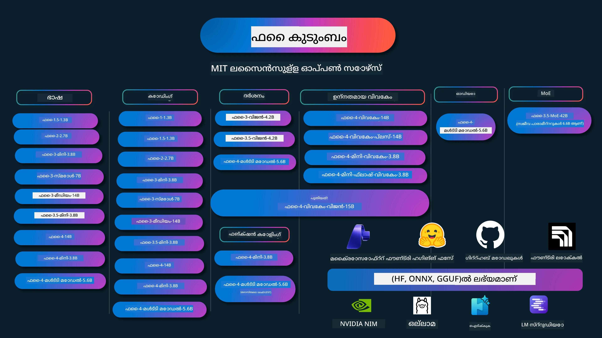

# Phi Cookbook: Microsoft's Phi മോഡലുകളുമായി കൈകഴ്‌ത്താം ഉദാഹരണങ്ങൾ

[](https://codespaces.new/microsoft/phicookbook)
[](https://vscode.dev/redirect?url=vscode://ms-vscode-remote.remote-containers/cloneInVolume?url=https://github.com/microsoft/phicookbook)

[](https://GitHub.com/microsoft/phicookbook/graphs/contributors/?WT.mc_id=aiml-137032-kinfeylo)
[](https://GitHub.com/microsoft/phicookbook/issues/?WT.mc_id=aiml-137032-kinfeylo)
[](https://GitHub.com/microsoft/phicookbook/pulls/?WT.mc_id=aiml-137032-kinfeylo)
[](http://makeapullrequest.com?WT.mc_id=aiml-137032-kinfeylo)

[](https://GitHub.com/microsoft/phicookbook/watchers/?WT.mc_id=aiml-137032-kinfeylo)
[](https://GitHub.com/microsoft/phicookbook/network/?WT.mc_id=aiml-137032-kinfeylo)
[](https://GitHub.com/microsoft/phicookbook/stargazers/?WT.mc_id=aiml-137032-kinfeylo)

[](https://discord.com/invite/ByRwuEEgH4)

Phi മൈക്രോസോഫ്റ്റ് വികസിപ്പിച്ചെടുത്ത ഒരു ഓപ്പൺ സോഴ്‌സ് AI മോഡലുകളുടെ പരമ്പരയാണ്.

Phi ഇപ്പോൾ ഏറ്റവും ശക്തവും ചെലവുകുറഞ്ഞതുമായ ചെറിയ ഭാഷാ മോഡലാണ് (SLM), ഡയവേഴ്സ് ഭാഷകൾ, റീസണിംഗ്, ടെക്‌സ്‌റ്റ് / ചാറ്റ് ജനറേഷൻ, കോഡിംഗ്, ചിത്രങ്ങൾ, ഓഡിയോ എന്നിവയിൽ വളരെ നല്ല ബेंച്മാർക്കുകളുണ്ട്.

Phiയെ ക്ലൗഡിലോ എഡ്ജ് ഉപകരണങ്ങളിലോ വിനിയോഗിക്കാം, കൂടാതെ പരിമിതമായ കമ്പ്യൂട്ടിങ് ശക്തിയുമായി ലളിതമായി ജെനറേറ്റീവ് AI അവതരണങ്ങൾ നിർമ്മിക്കാം.

ഈ റിസോഴ്‌സുകൾ ഉപയോഗിച്ച് തുടക്കം കുറിക്കാനായി താഴെ കാണുന്ന ഘട്ടങ്ങൾ പിന്തുടരുക:
1. **റിപ്പോസിറ്ററി ഫോർക്ക് ചെയ്യുക**: ക്ലിക്ക് ചെയ്യുക [](https://GitHub.com/microsoft/phicookbook/network/?WT.mc_id=aiml-137032-kinfeylo)
2. **റിപ്പോസിറ്ററി ക്ലോൺ ചെയ്യുക**:   `git clone https://github.com/microsoft/PhiCookBook.git`
3. [**Microsoft AI Discord കമ്മ്യൂണിറ്റിയിൽ ചേരുക, വിദഗ്ധരും മറ്റ് വികസിപ്പകരും കാണുന്നതിനും**](https://discord.com/invite/ByRwuEEgH4?WT.mc_id=aiml-137032-kinfeylo)



### 🌐 ബഹുഭാഷാ പിന്തുണ

#### GitHub ആക്ഷൻ വഴി പിന്തുണ ലഭ്യമാണ് (സ്വയംനയിച്ച് എല്ലായ്പ്പോഴും അപ്-ടു-ഡേറ്റ്)

<!-- CO-OP TRANSLATOR LANGUAGES TABLE START -->
[Arabic](../ar/README.md) | [Bengali](../bn/README.md) | [Bulgarian](../bg/README.md) | [Burmese (Myanmar)](../my/README.md) | [Chinese (Simplified)](../zh-CN/README.md) | [Chinese (Traditional, Hong Kong)](../zh-HK/README.md) | [Chinese (Traditional, Macau)](../zh-MO/README.md) | [Chinese (Traditional, Taiwan)](../zh-TW/README.md) | [Croatian](../hr/README.md) | [Czech](../cs/README.md) | [Danish](../da/README.md) | [Dutch](../nl/README.md) | [Estonian](../et/README.md) | [Finnish](../fi/README.md) | [French](../fr/README.md) | [German](../de/README.md) | [Greek](../el/README.md) | [Hebrew](../he/README.md) | [Hindi](../hi/README.md) | [Hungarian](../hu/README.md) | [Indonesian](../id/README.md) | [Italian](../it/README.md) | [Japanese](../ja/README.md) | [Kannada](../kn/README.md) | [Korean](../ko/README.md) | [Lithuanian](../lt/README.md) | [Malay](../ms/README.md) | [Malayalam](./README.md) | [Marathi](../mr/README.md) | [Nepali](../ne/README.md) | [Nigerian Pidgin](../pcm/README.md) | [Norwegian](../no/README.md) | [Persian (Farsi)](../fa/README.md) | [Polish](../pl/README.md) | [Portuguese (Brazil)](../pt-BR/README.md) | [Portuguese (Portugal)](../pt-PT/README.md) | [Punjabi (Gurmukhi)](../pa/README.md) | [Romanian](../ro/README.md) | [Russian](../ru/README.md) | [Serbian (Cyrillic)](../sr/README.md) | [Slovak](../sk/README.md) | [Slovenian](../sl/README.md) | [Spanish](../es/README.md) | [Swahili](../sw/README.md) | [Swedish](../sv/README.md) | [Tagalog (Filipino)](../tl/README.md) | [Tamil](../ta/README.md) | [Telugu](../te/README.md) | [Thai](../th/README.md) | [Turkish](../tr/README.md) | [Ukrainian](../uk/README.md) | [Urdu](../ur/README.md) | [Vietnamese](../vi/README.md)

> **ലോക്കലായി ക്ലോൺ ചെയ്യാൻ ഇഷ്ടപ്പെടുന്നുണ്ടോ?**
>
> ഈ റിപോസിറ്ററിയിൽ 50-ഓളം ഭാഷാ വിവർത്തനങ്ങൾ ഉൾക്കൊള്ളുന്നു, ഇത് ഡൗൺലോഡ് വലുതാക്കുന്നു. വിവർത്തനങ്ങളില്ലാതെ ക്ലോൺ ചെയ്യാൻ, സ്പാർസ് ചെക്ക്ഔട്ട് ഉപയോഗിക്കുക:
>
> **Bash / macOS / Linux:**
> ```bash
> git clone --filter=blob:none --sparse https://github.com/microsoft/PhiCookBook.git
> cd PhiCookBook
> git sparse-checkout set --no-cone '/*' '!translations' '!translated_images'
> ```
>
> **CMD (Windows):**
> ```cmd
> git clone --filter=blob:none --sparse https://github.com/microsoft/PhiCookBook.git
> cd PhiCookBook
> git sparse-checkout set --no-cone "/*" "!translations" "!translated_images"
> ```
>
> കോഴ്‌സ് പൂർത്തിയാക്കുന്നതിന് ആവശ്യമായ എല്ലാ വസ്തുക്കളും കുറഞ്ഞ സമയത്ത് ഇത് ലഭ്യമാക്കുന്നു.
<!-- CO-OP TRANSLATOR LANGUAGES TABLE END -->

## ഉള്ളടക്ക പട്ടിക
- പരിചയം - [ഫൈ കുടുംബത്തിലേക്ക് സ്വാഗതം](./md/01.Introduction/01/01.PhiFamily.md) - [നിങ്ങളുടെ പരിസരം സജ്ജീകരിക്കൽ](./md/01.Introduction/01/01.EnvironmentSetup.md) - [പ്രധാന സാങ്കേതികവിദ്യകൾ മനസ്സിലാക്കൽ](./md/01.Introduction/01/01.Understandingtech.md) - [ഫൈ മോഡലുകളിൽ എ.ഐ. സുരക്ഷ](./md/01.Introduction/01/01.AISafety.md) - [ഫൈ ഹാർഡ്‌വെയർ പിന്തുണ](./md/01.Introduction/01/01.Hardwaresupport.md) - [പ്ലാറ്റ്‌ഫോമുകളിൽ ഫൈ മോഡലുകളും ലഭ്യതയും](./md/01.Introduction/01/01.Edgeandcloud.md) - [ഗൈഡൻസ്-എഐയും ഫൈയും ഉപയോഗിക്കുന്നത്](./md/01.Introduction/01/01.Guidance.md) - [GitHub മാർക്കറ്റ്പ്ലേസ് മോഡലുകൾ](https://github.com/marketplace/models) - [അഷ്യൂർ എ.ഐ. മോഡൽ കാറ്റലോഗ്](https://ai.azure.com) - വ്യത്യസ്ത പരിസരങ്ങളിലായി ഇൻഫെറൻസ് ഫൈ - [ഹഗ്ഗിംഗ് फेस](./md/01.Introduction/02/01.HF.md) - [GitHub മോഡലുകൾ](./md/01.Introduction/02/02.GitHubModel.md) - [മൈക്രോസോഫ്റ്റ് ഫൗണ്ട്രി മോഡൽ കാറ്റലോഗ്](./md/01.Introduction/02/03.AzureAIFoundry.md) - [ഒള്ളാമ](./md/01.Introduction/02/04.Ollama.md) - [എ ഐ ടൂൾകിറ്റ് വി എസ് കോഡ് (AITK)](./md/01.Introduction/02/05.AITK.md) - [എൻവിഡിആർ NIM](./md/01.Introduction/02/06.NVIDIA.md) - [ഫൗണ്ട്രി ലോക്കൽ](./md/01.Introduction/02/07.FoundryLocal.md) - ഇൻഫെറൻസ് ഫൈ ഫാമിലി - [iOS ലെ ഇൻഫെറൻസ് ഫൈ](./md/01.Introduction/03/iOS_Inference.md) - [ആൻഡ്രോയിഡിൽ ഇൻഫെറൻസ് ഫൈ](./md/01.Introduction/03/Android_Inference.md) - [ജെറ്റ്സണിൽ ഇൻഫെറൻസ് ഫൈ](./md/01.Introduction/03/Jetson_Inference.md) - [എ ഐ പി സി-യിൽ ഇൻഫെറൻസ് ഫൈ](./md/01.Introduction/03/AIPC_Inference.md) - [ആപ്പിൾ MLX ഫ്രെയിംവർക്ക് ഉപയോഗിച്ച് ഇൻഫെറൻസ് ഫൈ](./md/01.Introduction/03/MLX_Inference.md) - [ലോക്കൽ സെർവറിൽ ഇൻഫെറൻസ് ഫൈ](./md/01.Introduction/03/Local_Server_Inference.md) - [എ ഐ ടൂൾകിറ്റ് ഉപയോഗിച്ച് റിമോട്ട് സെർവറിൽ ഇൻഫെറൻസ് ഫൈ](./md/01.Introduction/03/Remote_Interence.md) - [റസ്റ്റ് ഉപയോഗിച്ച് ഇൻഫെറൻസ് ഫൈ](./md/01.Introduction/03/Rust_Inference.md) - [ലോകൽ-യിൽ ഇൻഫെറൻസ് ഫൈ-വിഷൻ](./md/01.Introduction/03/Vision_Inference.md) - [കൈറ്റോ AKS, അഷ്യൂർ കണ്ടെയ്‌നറുകൾ (അധികാര പിന്തുണ) ഉപയോഗിച്ച് ഇൻഫെറൻസ് ഫൈ](./md/01.Introduction/03/Kaito_Inference.md) - [ഫൈ കുടുംബം ക്വാണ്ടിഫൈ ചെയ്യൽ](./md/01.Introduction/04/QuantifyingPhi.md) - [ലാമാ.cpp ഉപയോഗിച്ച് ഫൈ-3.5 / 4 ക്വാണ്ടൈസിംഗ്](./md/01.Introduction/04/UsingLlamacppQuantifyingPhi.md) - [ഓൺഎക്സ്സ് റൺടൈംക്കായി ജനറേറ്റീവ് എ ഐ വിപുലീകരണങ്ങൾ ഉപയോഗിച്ച് ഫൈ-3.5 / 4 ക്വാണ്ടൈസിംഗ്](./md/01.Introduction/04/UsingORTGenAIQuantifyingPhi.md) - [ഇൻറൽ ഓപ്പൺവിനോ ഉപയോഗിച്ച് ഫൈ-3.5 / 4 ക്വാണ്ടൈസിംഗ്](./md/01.Introduction/04/UsingIntelOpenVINOQuantifyingPhi.md) - [ആപ്പിൾ MLX ഫ്രെയിംവർക്ക് ഉപയോഗിച്ച് ഫൈ-3.5 / 4 ക്വാണ്ടൈസിംഗ്](./md/01.Introduction/04/UsingAppleMLXQuantifyingPhi.md) - ഫൈ മൂല്യനിർണ്ണയം - [ജവാബ് എ.ഐ](./md/01.Introduction/05/ResponsibleAI.md) - [മൈക്രോസോഫ്റ്റ് ഫൗണ്ട്രി മൂല്യനിർണ്ണയത്തിനായി](./md/01.Introduction/05/AIFoundry.md) - [പ്രംപ്റ്റ്‌ഫ്ലോ ഉപയോഗിച്ച് മൂല്യനിർണ്ണയം](./md/01.Introduction/05/Promptflow.md) - അഷ്യൂർ എ.ഐ. സെർച്ച് ഉപയോഗിച്ച് RAG - [ഫൈ-4-മിനി, ഫൈ-4-മൾട്ടിമോഡൽ (RAG) അഷ്യൂർ എ.ഐ സെർച്ച് ഉപയോഗിച്ച് എങ്ങനെ ഉപയോഗിക്കാമെന്ന്](https://github.com/microsoft/PhiCookBook/blob/main/code/06.E2E/E2E_Phi-4-RAG-Azure-AI-Search.ipynb) - ഫീ അപ്പ്ലിക്കേഷൻ വികസന സാമ്പിളുകൾ - ടെക്സ്റ്റ് & ചാറ്റ് ആപ്ലിക്കേഷനുകൾ - ഫൈ-4 സാമ്പിളുകൾ - [📓] [ഫൈ-4-മിനി ONNX മോഡലുമായി ചാറ്റ് ചെയ്യുക](./md/02.Application/01.TextAndChat/Phi4/ChatWithPhi4ONNX/README.md) - [ഫൈ-4 ലോക്കൽ ONNX മോഡലുമായി ഡോട്ട് നെറ്റ് ചാറ്റ്](../../md/04.HOL/dotnet/src/LabsPhi4-Chat-01OnnxRuntime) - [സെമെന്റിക് കർണൽ ഉപയോഗിച്ച് ഫൈ-4 ONNX ഡോട്ട് നെറ്റ് കൺസോൾ ആപ്പ്](../../md/04.HOL/dotnet/src/LabsPhi4-Chat-02SK) - ഫൈ-3 / 3.5 സാമ്പിളുകൾ - [ഫൈ3, ONNX റൺടൈം വെബ്, വെബ്GPU ഉപയോഗിച്ച് ബ്രൗസറിൽ ലോക്കൽ ചാറ്റ്‌ബോട്ട്](https://github.com/microsoft/onnxruntime-inference-examples/tree/main/js/chat) - [ഓപ്പൺവിനോ ചാറ്റ്](./md/02.Application/01.TextAndChat/Phi3/E2E_OpenVino_Chat.md) - [മൾട്ടി മോഡൽ - ഇന്ററാക്ടീവ് ഫൈ-3-മിനി, ഓപ്പൺഎ ഐ വീസ്പർ](./md/02.Application/01.TextAndChat/Phi3/E2E_Phi-3-mini_with_whisper.md) - [എം എൽ ഫ്ലോ - റാപ്പർ നിര്‍മ്മിച്ച് ഫൈ-3 MLFlow ഉപയോഗിക്കുക](./md//02.Application/01.TextAndChat/Phi3/E2E_Phi-3-MLflow.md) - [മോഡൽ ഓപ്റ്റിമൈസേഷൻ - ഒലിവി ഉപയോഗിച്ച് ONNX റൺടൈം വെബിനായി ഫൈ-3-മിന് മോഡൽ എങ്ങനെ ഒപ്റ്റിമൈസ് ചെയ്യാം](https://github.com/microsoft/Olive/tree/main/examples/phi3) - [ഫൈ-3 മിനി-4കെ-ഇൻസ്ട്രക്റ്റ്-onnx ഉപയോഗിച്ച് WinUI3 ആപ്പ്](https://github.com/microsoft/Phi3-Chat-WinUI3-Sample/) - [WinUI3 മൾട്ടി മോഡൽ എ.ഐ. പവർഡ് നോണ്ട് ആപ്പ് സാമ്പിൾ](https://github.com/microsoft/ai-powered-notes-winui3-sample) - [കസ്റ്റം ഫൈ-3 മോഡലുകൾ പ്രംപ്റ്റ് ഫ്ലോ ഉപയോഗിച്ച് ഫൈൻ-ട്യൂൺ ചെയ്ത് സംയോജിപ്പിക്കുക](./md/02.Application/01.TextAndChat/Phi3/E2E_Phi-3-FineTuning_PromptFlow_Integration.md) - [മൈക്രോസോഫ്റ്റ് ഫൗണ്ട്രിയിൽ പ്രംപ്റ്റ് ഫ്ലോ ഉപയോഗിച്ച് കസ്റ്റം ഫൈ-3 മോഡലുകൾ ഫൈൻ-ട്യൂൺ ചെയ്യുക, സംയോജിപ്പിക്കുക](./md/02.Application/01.TextAndChat/Phi3/E2E_Phi-3-FineTuning_PromptFlow_Integration_AIFoundry.md) - [മൈക്രോസോഫ്റ്റിന്റെ ഉത്തരവാദിത്വമുള്ള എ.ഐ. സംഘടനാമൂല്യങ്ങളെ കേന്ദ്രീകരിച്ച് മൈക്രോസോഫ്റ്റ് ഫൗണ്ട്രിയിൽ ഫൈൻ-ടuned ഫൈ-3 / ഫൈ-3.5 മോഡലുകൾ മൂല്യനിർണ്ണയിക്കുക](./md/02.Application/01.TextAndChat/Phi3/E2E_Phi-3-Evaluation_AIFoundry.md) - [📓] [ഫൈ-3.5-മിനി-ഇൻസ്ട്രക്റ്റ് ഭാഷ പ്രവചന സാമ്പിൾ (ചൈനീസ്/ഇംഗ്ലീഷ്)](./md/02.Application/01.TextAndChat/Phi3/phi3-instruct-demo.ipynb) - [ഫൈ-3.5-ഇൻസ്ട്രക്റ്റ് വെബ്GPU RAG ചാറ്റ്‌ബോട്ട്](./md/02.Application/01.TextAndChat/Phi3/WebGPUWithPhi35Readme.md) - [വിൻഡോസ് GPU ഉപയോഗിച്ച് ഫൈ-3.5-ഇൻസ്ട്രക്റ്റ് ONNX പ്രംപ്റ്റ് ഫ്ലോ സൊല്യൂഷൻ സൃഷ്ടിക്കുക](./md/02.Application/01.TextAndChat/Phi3/UsingPromptFlowWithONNX.md) - [മൈക്രോസോഫ്റ്റ് ഫൈ-3.5 tflite ഉപയോഗിച്ച് ആൻഡ്രോയിഡ് ആപ്പ് സൃഷ്ടിക്കുക](./md/02.Application/01.TextAndChat/Phi3/UsingPhi35TFLiteCreateAndroidApp.md) - [മൈക്രോസോഫ്റ്റ്.ML.ONNX റൺടൈം ഉപയോഗിച്ച് ലോക്കൽ ONNX ഫൈ-3 മോഡൽ ഉപയോഗിച്ച് ചോദ്യം & ഉത്തരം ഡോട്ട് നെറ്റ് ഉദാഹരണം](../../md/04.HOL/dotnet/src/LabsPhi301) - [സെമെന്റിക് കർണൽ ഉപയോഗിച്ച് ഫൈ-3 ഉള്ള കൺസോൾ ചാറ്റ് ഡോട്ട് നെറ്റ് ആപ്പ്](../../md/04.HOL/dotnet/src/LabsPhi302) - അഷ്യൂർ എഐ ഇൻഫെറൻസ് SDK കോഡ് അടിസ്ഥാനത്തിലുള്ള സാമ്പിളുകൾ - ഫൈ-4 സാമ്പിളുകൾ - [📓] [ഫൈ-4-മൾട്ടിമോഡൽ ഉപയോഗിച്ച് പ്രോജക്റ്റ് കോഡ് സൃഷ്ടിക്കുക](./md/02.Application/02.Code/Phi4/GenProjectCode/README.md) - ഫൈ-3 / 3.5 സാമ്പിളുകൾ - [മൈക്രോസോഫ്റ്റ് ഫൈ-3 കുടുംബവുമായി നിങ്ങളുടെ സ്വന്തം Visual Studio Code GitHub കോപിലോട്ട് ചാറ്റ് നിർമ്മിക്കുക](./md/02.Application/02.Code/Phi3/VSCodeExt/README.md) - [GitHub മോഡലുകളുടെ സഹായത്തോടുകൂടെ ഫൈ-3.5 ഉപയോഗിച്ച് നിങ്ങളുടെ സ്വന്തം Visual Studio Code ചാറ്റ് കോപിലോട്ട് ഏജന്റ് സൃഷ്ടിക്കുക](/md/02.Application/02.Code/Phi3/CreateVSCodeChatAgentWithGitHubModels.md) - ആഡ്‌വാൻസ്ഡ് റീസണിംഗ് സാമ്പിളുകൾ - ഫൈ-4 സാമ്പിളുകൾ - [📓] [ഫൈ-4-മിനി-റീസണിംഗ് അല്ലെങ്കിൽ ഫൈ-4-റീസണിംഗ് സാമ്പിളുകൾ](./md/02.Application/03.AdvancedReasoning/Phi4/AdvancedResoningPhi4mini/README.md) - [📓] [മൈക്രോസോഫ്റ്റ് ഒലിവി ഉപയോഗിച്ച് ഫൈ-4-മിനി-റീസണിംഗ് ഫൈൻ-ട്യൂണിംഗ്](./md/02.Application/03.AdvancedReasoning/Phi4/AdvancedResoningPhi4mini/olive_ft_phi_4_reasoning_with_medicaldata.ipynb) - [📓] [ആപ്പിൾ MLX ഉപയോഗിച്ച് ഫൈൻ-ട്യൂൺ ചെയ്‌ത ഫൈ-4-മിനി-റീസണിംഗ്](./md/02.Application/03.AdvancedReasoning/Phi4/AdvancedResoningPhi4mini/mlx_ft_phi_4_reasoning_with_medicaldata.ipynb) - [📓] [GitHub മോഡലുകളോടൊപ്പം ഫൈ-4-മിനി-റീസണിംഗ്](./md/02.Application/02.Code/Phi4r/github_models_inference.ipynb) - [📓] [മൈക്രോസോഫ്റ്റ് ഫൗണ്ട്രി മോഡലുകളോടൊപ്പം ഫൈ-4-മിനി-റീസണിംഗ്](./md/02.Application/02.Code/Phi4r/azure_models_inference.ipynb) -
ഡെമോകൾ - [Phi-4-mini ഡെമോകൾ Hugging Face Spaces-ൽ ഹോസ്റ്റ് ചെയ്യുന്നവ](https://huggingface.co/spaces/microsoft/phi-4-mini?WT.mc_id=aiml-137032-kinfeylo) - [Phi-4-multimodal ഡെമോകൾ Hugging Face Spaces-ൽ ഹോസ്റ്റ് ചെയ്യുന്നവ](https://huggingface.co/spaces/microsoft/phi-4-multimodal?WT.mc_id=aiml-137032-kinfeylo) - വിസൻ സാമ്പിളുകൾ - Phi-4 സാമ്പിളുകൾ - [📓] [ചിത്രങ്ങൾ വായിച്ച് കോഡ് ജനറേറ്റ് ചെയ്യാൻ Phi-4-multimodal ഉപയോഗിക്കുക](./md/02.Application/04.Vision/Phi4/CreateFrontend/README.md) - Phi-3 / 3.5 സാമ്പിളുകൾ - [📓][Phi-3-vision-ചિત્રം ബാക്യം മുതൽ വാചകമാകുന്നത്](./md/02.Application/04.Vision/Phi3/E2E_Phi-3-vision-image-text-to-text-online-endpoint.ipynb) - [Phi-3-vision-ONNX](https://onnxruntime.ai/docs/genai/tutorials/phi3-v.html) - [📓][Phi-3-vision CLIP എംബഡ്ഡിംഗ്](./md/02.Application/04.Vision/Phi3/E2E_Phi-3-vision-image-text-to-text-online-endpoint.ipynb) - [ഡെമോ: Phi-3 റിസൈക്ലിംഗ്](https://github.com/jennifermarsman/PhiRecycling/) - [Phi-3-vision - ദൃശ്യ ഭാഷാ സഹായി - Phi3-Vision ഒപ്പം OpenVINO](https://docs.openvino.ai/nightly/notebooks/phi-3-vision-with-output.html) - [Phi-3 Vision Nvidia NIM](./md/02.Application/04.Vision/Phi3/E2E_Nvidia_NIM_Vision.md) - [Phi-3 Vision OpenVino](./md/02.Application/04.Vision/Phi3/E2E_OpenVino_Phi3Vision.md) - [📓][Phi-3.5 Vision മൾട്ടി-ഫ്രെയിം അല്ലെങ്കിൽ മൾട്ടി-ഇമേജ് സാമ്പിൾ](./md/02.Application/04.Vision/Phi3/phi3-vision-demo.ipynb) - [Phi-3 Vision ലോക്കൽ ONNX മോഡൽ Microsoft.ML.OnnxRuntime .NET ഉപയോഗിച്ച്](../../md/04.HOL/dotnet/src/LabsPhi303) - [മെനു അടിസ്ഥാനമുള്ള Phi-3 Vision ലോക്കൽ ONNX മോഡൽ Microsoft.ML.OnnxRuntime .NET ഉപയോഗിച്ച്](../../md/04.HOL/dotnet/src/LabsPhi304) - റീസണിങ്-വിഷൻ സാമ്പിളുകൾ - Phi-4-റീസണിങ്-വിഷൻ-15B - [📓] [Phi-4-റീസണിങ്-വിഷൻ-15B ഉപയോഗിച്ച് ജയ്വാക്കിംഗ് കണ്ടെത്തൽ](./md/02.Application/10.ReasoningVision/Phi_4_reasoning_vision_15b_Jaywalking.ipynb) - [📓] [Phi-4-റീസണിങ്-വിഷൻ-15B ഉപയോഗിച്ച് മാനിതം](./md/02.Application/10.ReasoningVision/Phi_4_reasoning_vision_15b_Math.ipynb) - [📓] [Phi-4-റീസണിങ്-വിഷൻ-15B ഉപയോഗിച്ച് UI കണ്ടെത്തൽ](./md/02.Application/10.ReasoningVision/Phi_4_reasoning_vision_15b_ui.ipynb) - ഗണിത സാമ്പിളുകൾ - Phi-4-Mini-Flash-Reasoning-Instruct സാമ്പിളുകൾ [Phi-4-Mini-Flash-Reasoning-Instruct ഗണിത ഡെമോ](./md/02.Application/09.Math/MathDemo.ipynb) - ഓഡിയോ സാമ്പിളുകൾ - Phi-4 സാമ്പിളുകൾ - [📓] [Phi-4-multimodal ഉപയോഗിച്ച് ഓഡിയോ ട്രാൻസ്ക്രിപ്റ്റുകൾ മില്പിക്കുക](./md/02.Application/05.Audio/Phi4/Transciption/README.md) - [📓] [Phi-4-multimodal ഓഡിയോ സാമ്പിൾ](./md/02.Application/05.Audio/Phi4/Siri/demo.ipynb) - [📓] [Phi-4-multimodal സ്പീച്ച് ട്രാൻസ്ലേഷൻ സാമ്പിൾ](./md/02.Application/05.Audio/Phi4/Translate/demo.ipynb) - [.NET കൺസോൾ അപ്ലിക്കേഷൻ Phi-4-multimodal ഓഡിയോ ഉപയോഗിച്ച് ഒരു ഓഡിയോ ഫയൽ വിശകലനം ചെയ്‌തും ട്രാൻസ്ക്രിപ്റ്റ് ഒരുക്കുന്നവ](../../md/04.HOL/dotnet/src/LabsPhi4-MultiModal-02Audio) - MOE സാമ്പിളുകൾ - Phi-3 / 3.5 സാമ്പിളുകൾ - [📓] [Phi-3.5 മിക്‌സ്‌ചർ ഓഫ് എക്സ്പർട്സ് മോഡലുകൾ (MoEs) സോഷ്യൽ മീഡിയ സാമ്പിൾ](./md/02.Application/06.MoE/Phi3/phi3_moe_demo.ipynb) - [📓] [NVIDIA NIM Phi-3 MOE, Azure AI Search, LlamaIndex ഉപയോഗിച്ച് ഒരു Retrieval-Augmented Generation (RAG) പൈപ്പ്ലൈൻ നിർമ്മിക്കൽ](./md/02.Application/06.MoE/Phi3/azure-ai-search-nvidia-rag.ipynb) - ഫംഗ്ഷൻ കോളിംഗ് സാമ്പിളുകൾ - Phi-4 സാമ്പിളുകൾ 🆕 - [📓] [Phi-4-mini ഉപയോഗിച്ച് ഫംഗ്ഷൻ കോളിംഗ് ഉപയോഗിക്കല്‍](./md/02.Application/07.FunctionCalling/Phi4/FunctionCallingBasic/README.md) - [📓] [Phi-4-mini ഉപയോഗിച്ച് മൾട്ടി-ഏജന്റുകൾ സൃഷ്ടിക്കാൻ ഫംഗ്ഷൻ കോളിംഗ് ഉപയോഗിക്കുക](./md/02.Application/07.FunctionCalling/Phi4/Multiagents/Phi_4_mini_multiagent.ipynb) - [📓] [ഒള്ളാമ ഉപയോഗിച്ച് ഫംഗ്ഷൻ കോളിംഗ്](./md/02.Application/07.FunctionCalling/Phi4/Ollama/ollama_functioncalling.ipynb) - [📓] [ONNX ഉപയോഗിച്ച് ഫംഗ്ഷൻ കോളിംഗ്](./md/02.Application/07.FunctionCalling/Phi4/ONNX/onnx_parallel_functioncalling.ipynb) - മൾടിമോഡൽ മിക്സിംഗ് സാമ്പിളുകൾ - Phi-4 സാമ്പിളുകൾ 🆕 - [📓] [ടെക്നോളജി ജേർണലിസ്റ്റായി Phi-4-multimodal ഉപയോഗിക്കുന്നത്](./md/02.Application/08.Multimodel/Phi4/TechJournalist/phi_4_mm_audio_text_publish_news.ipynb) - [.NET കൺസോൾ അപ്ലിക്കേഷൻ Phi-4-multimodal ഉപയോഗിച്ച് ചിത്രങ്ങൾ വിശകലനം ചെയ്യുന്നു](../../md/04.HOL/dotnet/src/LabsPhi4-MultiModal-01Images) - ഫൈൻ-ട്യൂണിംഗ് Phi സാമ്പിളുകൾ - [ഫൈൻ-ട്യൂണിംഗ് രംഗങ്ങൾ](./md/03.FineTuning/FineTuning_Scenarios.md) - [ഫൈൻ-ട്യൂണിംഗ് vs RAG](./md/03.FineTuning/FineTuning_vs_RAG.md) - [ഫൈൻ-ട്യൂണിംഗ് Phi-3 ഒരു വ്യവസായ വിദഗ്ധനായി മാറ്റുക](./md/03.FineTuning/LetPhi3gotoIndustriy.md) - [ഫൈൻ-ട്യൂണിംഗ് Phi-3 AI ടൂള്കിറ്റ് ഫോർ VS കോഡ് ഉപയോഗിച്ച്](./md/03.FineTuning/Finetuning_VSCodeaitoolkit.md) - [ഫൈൻ-ട്യൂണിംഗ് Phi-3 Azure മെഷീൻ ലേർണിംഗ് സർവീസ് ഉപയോഗിച്ച്](./md/03.FineTuning/Introduce_AzureML.md) - [ഫൈൻ-ട്യൂണിംഗ് Phi-3 Lora ഉപയോഗിച്ച്](./md/03.FineTuning/FineTuning_Lora.md) - [ഫൈൻ-ട്യൂണിംഗ് Phi-3 QLora ഉപയോഗിച്ച്](./md/03.FineTuning/FineTuning_Qlora.md) - [ഫൈൻ-ട്യൂണിംഗ് Phi-3 Microsoft Foundry ഉപയോഗിച്ച്](./md/03.FineTuning/FineTuning_AIFoundry.md) - [ഫൈൻ-ട്യൂണിംഗ് Phi-3 Azure ML CLI/SDK ഉപയോഗിച്ച്](./md/03.FineTuning/FineTuning_MLSDK.md) - [Microsoft Olive ഉപയോഗിച്ച് ഫൈന ട്യൂണിംഗ്](./md/03.FineTuning/FineTuning_MicrosoftOlive.md) - [Microsoft Olive Hands-On ലാബ് ഉപയോഗിച്ച് ഫൈന ട്യൂണിംഗ്](./md/03.FineTuning/olive-lab/readme.md) - [Phi-3-vision വെയ്റ്റ്സ് ആൻഡ് ബയസ് ഉപയോഗിച്ച് ഫൈന ട്യൂണിംഗ്](./md/03.FineTuning/FineTuning_Phi-3-visionWandB.md) - [Phi-3 Apple MLX ഫ്രെയിംവർക്ക് ഉപയോഗിച്ച് ഫൈന ട്യൂണിംഗ്](./md/03.FineTuning/FineTuning_MLX.md) - [Phi-3-vision ഫൈന ട്യൂണിംഗ് (അധികൃത പിന്തുണ)](./md/03.FineTuning/FineTuning_Vision.md) - [Phi-3 Kaito AKS, Azure Containers-ഉം (അധികൃത പിന്തുണ) ഉപയോഗിച്ച് ഫൈന ട്യൂണിംഗ്](./md/03.FineTuning/FineTuning_Kaito.md) - [Phi-3, 3.5 Vision ഫൈന ട്യൂണിംഗ്](https://github.com/2U1/Phi3-Vision-Finetune) - ഹാൻഡ്‌സ് ഓൺ ലാബ് - [അത്യാധുനിക മോഡലുകൾ അന്വേഷിക്കുന്നു: LLMകൾ, SLMകൾ, ലോക്കൽ ഡെവലപ്പ്മെന്റ്, മറ്റ് വശങ്ങൾ](https://github.com/microsoft/aitour-exploring-cutting-edge-models) - [NLP ശേഷി വഴി തുറക്കൽ: Microsoft Olive ഉപയോഗിച്ച് ഫൈൻ-ട്യൂണിംഗ്](https://github.com/azure/Ignite_FineTuning_workshop) - അക്കാഡമിക് ഗവേഷണ പേപ്പറുകൾ ഇനിയും പ്രസിദ്ധീകരണങ്ങൾ - [Textbooks Are All You Need II: phi-1.5 സാങ്കേതിക റിപ്പോർട്ട്](https://arxiv.org/abs/2309.05463) - [Phi-3 സാങ്കേതിക റിപ്പോർട്ട്: നിങ്ങളുടെ ഫോണിൽ ഹൈലി ക്യാപബിൾ ലാൻഗ്വേജ് മോഡൽ](https://arxiv.org/abs/2404.14219) - [Phi-4 സാങ്കേതിക റിപ്പോർട്ട്](https://arxiv.org/abs/2412.08905) - [Phi-4-Mini സാങ്കേതിക റിപ്പോർട്ട്: Mixture-of-LoRAs വഴി കമ്പാക്റ്റും ശക്തിയും കൂടിയ മൾടിമോഡൽ ഭാഷാ മോഡലുകൾ](https://arxiv.org/abs/2503.01743) - [ഇൻ-വാഹന ഫംഗ്ഷൻ-കോൾ ചെയ്യലിന് ചെറിയ ഭാഷാ മോഡലുകൾ ഓപ്ടിമൈസ് ചെയ്യൽ](https://arxiv.org/abs/2501.02342) - [(WhyPHI) ധാരാളം-ഓപ്ഷൻ ചോദ്യം ഉത്തരവാദിത്വത്തിനായി PHI-3 ഫൈൻ-ട്യൂണിംഗ്: രീതിശാസ്ത്രം, ഫലം, ചോദ്യങ്ങൾ](https://arxiv.org/abs/2501.01588) - [Phi-4-റീസണിംഗ് സാങ്കേതിക റിപ്പോർട്ട്](https://www.microsoft.com/en-us/research/wp-content/uploads/2025/04/phi_4_reasoning.pdf)
- [ഫൈ-4-മിനി-റീസണിങ്ങ് സാങ്കേതിക റിപ്പോർട്ട്](https://huggingface.co/microsoft/Phi-4-mini-reasoning/blob/main/Phi-4-Mini-Reasoning.pdf)
# Phi കുക്ക്ബുക്ക്: Microsoft's Phi മോഡലുകളുമായുള്ള പ്രായോഗിക ഉദാഹരണങ്ങൾ

[](https://codespaces.new/microsoft/phicookbook)
[](https://vscode.dev/redirect?url=vscode://ms-vscode-remote.remote-containers/cloneInVolume?url=https://github.com/microsoft/phicookbook)

[](https://GitHub.com/microsoft/phicookbook/graphs/contributors/?WT.mc_id=aiml-137032-kinfeylo)
[](https://GitHub.com/microsoft/phicookbook/issues/?WT.mc_id=aiml-137032-kinfeylo)
[](https://GitHub.com/microsoft/phicookbook/pulls/?WT.mc_id=aiml-137032-kinfeylo)
[](http://makeapullrequest.com?WT.mc_id=aiml-137032-kinfeylo)

[](https://GitHub.com/microsoft/phicookbook/watchers/?WT.mc_id=aiml-137032-kinfeylo)
[](https://GitHub.com/microsoft/phicookbook/network/?WT.mc_id=aiml-137032-kinfeylo)
[](https://GitHub.com/microsoft/phicookbook/stargazers/?WT.mc_id=aiml-137032-kinfeylo)

[](https://discord.com/invite/ByRwuEEgH4)

Phi മൈക്രോസോഫ്റ്റ് വികസിപ്പിച്ചിട്ടുള്ള ഒരു ഓപ്പൺ സോഴ്‌സ് AI മോഡലുകളുടെ സിരീസ് ആണ്.

Phi ഇപ്പോൾ ഏറ്റവും ശക്തവും ചെലവു കുറവുമായ ചെറിയ ഭാഷാ മോഡലാണ് (SLM), ബഹുഭാഷാ, കാരണം മനസ്സിലാക്കൽ, വാചകം/ചാറ്റ് ജനന, കോഡിംഗ്, ചിത്രങ്ങൾ, ഓഡിയോ തുടങ്ങിയ പല രംഗങ്ങളിലും വളരെ നല്ല ബെഞ്ച്മാർക്ക് സാദ്ധ്യമാക്കി.

Phi നെ ക്ലൗഡിലും എഡ്ജ് ഉപകരണങ്ങളിലും വിന്യസിക്കാം, കൂടാതെ ചെറു കംപ്യൂട്ടിംഗ് ശക്തിയുള്ളവയുമായി ജനകീയ AI ആപ്ലിക്കേഷനുകൾ എളുപ്പത്തിൽ നിർമ്മിക്കാമെന്നു നിങ്ങൾക്ക് സാധിക്കും.

ഈ വിഭവങ്ങൾ ഉപയോഗിക്കാൻ തുടങ്ങുവാൻ താഴെപ്പറയുന്ന ക്രമങ്ങൾ പിന്തുടരുക:
1. **റിപ്പോസിറ്ററി ഫോർക് ചെയ്യുക**: ക്ലിക്ക് ചെയ്യുക [](https://GitHub.com/microsoft/phicookbook/network/?WT.mc_id=aiml-137032-kinfeylo)
2. **റിപ്പോസിറ്ററി ക്ലോൺ ചെയ്യുക**: `git clone https://github.com/microsoft/PhiCookBook.git`
3. [**Microsoft AI ഡിസ്കോർഡ് കമ്മ്യൂണിറ്റിയിൽ ചേര്‍ന്ന് വിദഗ്ദ്ധന്മാരെയും fellow ഡെവലപ്പർമാരെയും കാണുക**](https://discord.com/invite/ByRwuEEgH4?WT.mc_id=aiml-137032-kinfeylo)


### 🌐 ബഹുഭാഷാ പിന്തുണ

#### GitHub Action വഴി പിന്തുണ (സ്വയം പ്രവർത്തിക്കുന്നതും എല്ലായ്പ്പോഴും പുതുക്കപ്പെട്ടതും)

<!-- CO-OP TRANSLATOR LANGUAGES TABLE START -->
[ആറബിക്ക്](../ar/README.md) | [ബംഗാളി](../bn/README.md) | [ബൾഗേറിയൻ](../bg/README.md) | [ബർമീസ് (മ്യാന്മാർ)](../my/README.md) | [ചൈനീസ് (പരിപാടി)](../zh-CN/README.md) | [ചൈനീസ് (പരമ്പരാഗതം, ഹോങ്കോംഗ്)](../zh-HK/README.md) | [ചൈനീസ് (പരമ്പരാഗതം, മാകാവ്)](../zh-MO/README.md) | [ചൈനീസ് (പരമ്പരാഗതം, തായ്‌വാൻ)](../zh-TW/README.md) | [ക്രോവേഷ്യൻ](../hr/README.md) | [ചെക്ക്](../cs/README.md) | [ഡാനിഷ്](../da/README.md) | [ഡച്ച്](../nl/README.md) | [എസ്റ്റോണിയൻ](../et/README.md) | [ഫിന്നിഷ്](../fi/README.md) | [ഫ്രെഞ്ച്](../fr/README.md) | [ജർമ്മൻ](../de/README.md) | [ഗ്രീക്ക്](../el/README.md) | [ഹീബ്രു](../he/README.md) | [ഹിന്ദി](../hi/README.md) | [ഹംഗേറിയൻ](../hu/README.md) | [ഇന്തോനേഷ്യൻ](../id/README.md) | [ഇറ്റാലിയൻ](../it/README.md) | [ജാപ്പനീസ്](../ja/README.md) | [കന്നഡ](../kn/README.md) | [കൊറിയൻ](../ko/README.md) | [ലിതുവേനിയൻ](../lt/README.md) | [മലയിൽ](../ms/README.md) | [മലയാളം](./README.md) | [മറാത്തി](../mr/README.md) | [നേപ്പാളി](../ne/README.md) | [നൈജീരിയൻ പിഡ്ജിൻ](../pcm/README.md) | [നോർവീജിയൻ](../no/README.md) | [ഫേഴ്സി (പേഴ്ഷ്യൻ)](../fa/README.md) | [പോളിഷ്](../pl/README.md) | [പോർച്ചുഗീസ് (ബ്രസീൽ)](../pt-BR/README.md) | [പോർച്ചുഗീസ് (പോർചുഗൽ)](../pt-PT/README.md) | [പഞ്ചാബി (ഗുരുമുഖി)](../pa/README.md) | [റൊമാനിയൻ](../ro/README.md) | [റഷ്യൻ](../ru/README.md) | [സെർബിയൻ (സിറിലിക്)](../sr/README.md) | [സ്ലൊവാക്](../sk/README.md) | [സ്ലോവീനിയൻ](../sl/README.md) | [സ്പാനിഷ്](../es/README.md) | [സ്വാഹിലി](../sw/README.md) | [സ്വീഡിഷ്](../sv/README.md) | [ടാഗലോഗ് (ഫിലിപ്പിനോ)](../tl/README.md) | [തമിൽ](../ta/README.md) | [തെലുങ്കു](../te/README.md) | [തായ്](../th/README.md) | [ടർക്കിഷ്](../tr/README.md) | [ഉക്രെയ്‌നിയൻ](../uk/README.md) | [ഉർദു](../ur/README.md) | [വിയറ്റ്നാമീസ്](../vi/README.md)

> **പ്രാഥമികമായി ലോക്കൽ എന്നാക്കി ക്ലോൺ ചെയ്യണമോ?**
>
> ഈ റിപ്പോസിറ്ററിയിൽ 50-க்கும் മുകളിൽ ഭാഷാ പരിഭാഷകൾ ഉൾപ്പെടുത്തിയിട്ടുണ്ട്, അതിനാൽ ഡൗൺലോഡ് വലുതാകുന്നു. പരിഭാഷകൾ ഇല്ലാതെ ക്ലോൺ ചെയ്യാൻ sparse checkout ഉപയോഗിക്കുക:
>
> **ബാഷ് / മാക്‌ഓഎസ് / ലിനക്സ്നിങ്ങ്:**
> ```bash
> git clone --filter=blob:none --sparse https://github.com/microsoft/PhiCookBook.git
> cd PhiCookBook
> git sparse-checkout set --no-cone '/*' '!translations' '!translated_images'
> ```
>
> **CMD (വിൻഡോസ്):**
> ```cmd
> git clone --filter=blob:none --sparse https://github.com/microsoft/PhiCookBook.git
> cd PhiCookBook
> git sparse-checkout set --no-cone "/*" "!translations" "!translated_images"
> ```
>
> ഇത് നിങ്ങൾക്ക് കോഴ്‌സ് പൂര്‍ത്തിയാക്കാൻ ആവശ്യമായ വല്ലതും വളരെ വേഗത്തിൽ ഡൗൺലോഡ് ചെയ്യാൻ സഹായിക്കും.
<!-- CO-OP TRANSLATOR LANGUAGES TABLE END -->

## ഉള്ളടക്ക പട്ടിക

## Phi മോഡലുകൾ ഉപയോഗിക്കുന്നത്

### Microsoft Foundry-യിലെ Phi

മൈക്രോസോഫ്റ്റ് Phi എങ്ങനെ ഉപയോഗിക്കാമെന്ന്, നിങ്ങളുടെ വ്യത്യസ്ത ഹാർഡ്‌വെയർ ഉപകരണങ്ങളിൽ E2E പരിഹാരങ്ങൾ എങ്ങനെ നിർമ്മിക്കാമെന്ന് നിങ്ങൾക്ക് പഠിക്കാം. Phi നേരിട്ട് അനുഭവിക്കാൻ, മോഡലുകളുമായി കളിച്ച് നിങ്ങൾക്ക് നിങ്ങളുടെ സാഹചര്യങ്ങൾക്ക് Phi റ്റെ ക്രമീകരിച്ച് പരിശീലിക്കുക [Microsoft Foundry Azure AI Model Catalog](https://aka.ms/phi3-azure-ai) ഉപയോഗിച്ച്. കൂടുതൽ വിവരങ്ങൾക്കായി [Microsoft Foundry](/md/02.QuickStart/AzureAIFoundry_QuickStart.md)  പുതിയതായി തുടങ്ങൽ കാണുക.

**പ്ലേഗ്രൗണ്ട്**  
പ്രത്യേക മോഡലുകൾ ഓരോന്നിനുമുണ്ട് പരീക്ഷിക്കാൻ [Azure AI Playground](https://aka.ms/try-phi3).

### GitHub മോഡലുകളിലെ Phi

മൈക്രോസോഫ്റ്റ് Phi എങ്ങനെ ഉപയോഗിക്കാമെന്ന്, നിങ്ങളുടെ വ്യത്യസ്ത ഹാർഡ്‌വെയർ ഉപകരണങ്ങളിൽ E2E പരിഹാരങ്ങൾ എങ്ങനെ നിർമ്മിക്കാമെന്ന് നിങ്ങൾക്ക് പഠിക്കാം. Phi നേരിട്ട് അനുഭവിക്കാൻ, മോഡലുമായി കളിച്ച് നിങ്ങളുടെ സാഹചര്യങ്ങൾക്ക് Phi ക്രമീകരിക്കുക [GitHub Model Catalog](https://github.com/marketplace/models?WT.mc_id=aiml-137032-kinfeylo) ഉപയോഗിച്ച്. കൂടുതൽ അറിയാൻ [GitHub Model Catalog](/md/02.QuickStart/GitHubModel_QuickStart.md) പുതിയതായി തുടങ്ങൽ കാണുക.

**പ്ലേഗ്രൗണ്ട്**  
ഓരോ മോഡലിനും പരീക്ഷിക്കാൻ പ്രത്യേക [പ്ലേഗ്രൗണ്ട്](/md/02.QuickStart/GitHubModel_QuickStart.md) ഉണ്ട്.

### Hugging Face-ൽ Phi

മോഡൽ [Hugging Face](https://huggingface.co/microsoft) ൽ കണ്ടെത്താം.

**പ്ലേഗ്രൗണ്ട്**  
[Hugging Chat പ്ലേഗ്രൗണ്ട്](https://huggingface.co/chat/models/microsoft/Phi-3-mini-4k-instruct)

## 🎒 മറ്റ് കോഴ്‌സുകൾ

ഞങ്ങളുടെ ടീം മറ്റ് കോഴ്‌സുകളും നിർമിക്കുന്നു! പരിശോധിക്കുക:

<!-- CO-OP TRANSLATOR OTHER COURSES START -->
### ലാംഗ്‌ചെയിൻ  
[](https://aka.ms/langchain4j-for-beginners)
[](https://aka.ms/langchainjs-for-beginners?WT.mc_id=m365-94501-dwahlin)
[](https://github.com/microsoft/langchain-for-beginners?WT.mc_id=m365-94501-dwahlin)
---

### അസ്യൂർ / എഡ്ജ് / MCP / ഏജന്‍റ്സ്  
[](https://github.com/microsoft/AZD-for-beginners?WT.mc_id=academic-105485-koreyst)
[](https://github.com/microsoft/edgeai-for-beginners?WT.mc_id=academic-105485-koreyst)
[](https://github.com/microsoft/mcp-for-beginners?WT.mc_id=academic-105485-koreyst)
[](https://github.com/microsoft/ai-agents-for-beginners?WT.mc_id=academic-105485-koreyst)

---

### ജനറേറ്റീവ് AI സീരീസ്  
[](https://github.com/microsoft/generative-ai-for-beginners?WT.mc_id=academic-105485-koreyst)
[-9333EA?style=for-the-badge&labelColor=E5E7EB&color=9333EA)](https://github.com/microsoft/Generative-AI-for-beginners-dotnet?WT.mc_id=academic-105485-koreyst)
[-C084FC?style=for-the-badge&labelColor=E5E7EB&color=C084FC)](https://github.com/microsoft/generative-ai-for-beginners-java?WT.mc_id=academic-105485-koreyst)
[-E879F9?style=for-the-badge&labelColor=E5E7EB&color=E879F9)](https://github.com/microsoft/generative-ai-with-javascript?WT.mc_id=academic-105485-koreyst)

---
 
### ഭാഷാശാസ്ത്ര പഠനം
[](https://aka.ms/ml-beginners?WT.mc_id=academic-105485-koreyst)
[](https://aka.ms/datascience-beginners?WT.mc_id=academic-105485-koreyst)
[](https://aka.ms/ai-beginners?WT.mc_id=academic-105485-koreyst)
[](https://github.com/microsoft/Security-101?WT.mc_id=academic-96948-sayoung)
[](https://aka.ms/webdev-beginners?WT.mc_id=academic-105485-koreyst)
[](https://aka.ms/iot-beginners?WT.mc_id=academic-105485-koreyst)
[](https://github.com/microsoft/xr-development-for-beginners?WT.mc_id=academic-105485-koreyst)

---
 
### കോപൈലറ്റ് സീരീസ്
[](https://aka.ms/GitHubCopilotAI?WT.mc_id=academic-105485-koreyst)
[](https://github.com/microsoft/mastering-github-copilot-for-dotnet-csharp-developers?WT.mc_id=academic-105485-koreyst)
[](https://github.com/microsoft/CopilotAdventures?WT.mc_id=academic-105485-koreyst)
<!-- CO-OP TRANSLATOR OTHER COURSES END -->

## ഉത്തരവാദിത്വമുള്ള AI

Microsoft നമ്മുടെ ഉപഭോക്താക്കളെ നമ്മുടെ AI ഉല്‍പ്പന്നങ്ങൾ ഉത്തരവാദിത്വത്തോടെ ഉപയോഗിക്കാൻ സഹായിക്കാൻ, നമ്മുടെ പഠനങ്ങൾ പങ്കുവെക്കാനും, Transparency Notes, Impact Assessments പോലുള്ള ഉപകരണങ്ങളിലൂടെ വിശ്വാസപൂർത്തിയുള്ള പങ്കാളിത്തങ്ങൾ ഉണ്ടാക്കാനും പ്രതിജ്ഞാബദ്ധമാണ്. ഇവരിൽ പല സമ്പദ്വര്‍ണ്ണങ്ങളും [https://aka.ms/RAI](https://aka.ms/RAI) ൽ കണ്ടെത്താൻ കഴിയും.
Microsoftയുടെ ഉത്തരവാദിത്വമുള്ള AI സമീപനം നീതിത്തോടുകൂടിയ, വിശ്വസനീയവും സുരക്ഷിതവുമായ, സ്വകാര്യതയും സുരക്ഷയും ഉൾക്കൊള്ളുകയും, ഉൾക്കൊള്ളൽ, മേധാവിത്വം, ഉത്തരവാദിത്തം എന്നിവയോടുകൂടിയ AI 원칙ങ്ങളിലാണ് ആധാരിതമായത്.

ഈ സാമ്പിളിൽ ഉപയോഗിച്ച വലിയ തോതിലുള്ള സ്വാഭാവിക ഭാഷ, ചിത്ര, ശബ്ദ മോഡലുകൾ - അവ അനീതിയുള്ള, വിശ്വസനീയമല്ലാത്ത, അപമാനകരമായ പ്രവൃത്തികൾ കാണിക്കുന്നതായി പെരുമാറാൻ സാധ്യതയുണ്ട്, അതിനാൽ ഹാനി ഉണ്ടാകാം. ദയവായി [Azure OpenAI service Transparency note](https://learn.microsoft.com/legal/cognitive-services/openai/transparency-note?tabs=text) സന്ദർശിച്ച് അപകടങ്ങളും പരിമിതികളും മനസ്സിലാക്കുക.

ഈ അപകടങ്ങൾ കുറയ്ക്കാനുള്ള ശിപാർശ ചെയ്ത സമീപനം നിങ്ങളുടെ ആർക്കിടെക്ചറിൽ അപകടകരമായ പെരുമാറ്റം കണ്ടെത്തി തടയുന്ന സുരക്ഷാ സമ്പ്രദായങ്ങൾ ഉൾപ്പെടുത്തുകയാണ്. [Azure AI Content Safety](https://learn.microsoft.com/azure/ai-services/content-safety/overview) സ്വതന്ത്ര സംരക്ഷണ നിരക്ക് നൽകുന്നു, അത് ആപ്ലിക്കേഷനുകളിൽ, സേവനങ്ങളിൽ ഉപയോക്താവും AIയും സൃഷ്ടിച്ച ദേഹാസ്വസ്ഥകരവും അപകടകരവുമായ ഉള്ളടക്കം കണ്ടെത്താൻ സാധിക്കും. Microsoft Foundryയിൽ Content Safety സേവനം വിവിധ രൂപങ്ങളിൽ ഹാനികരമായ ഉള്ളടക്കം കണ്ടെത്താനുള്ള സാമ്പിള്‍ കോഡ് കാണാനും പരീക്ഷിക്കാനും അനുവദിക്കുന്നു. താഴെ നൽകിയിരിക്കുന്ന [വേഗത്തിലുള്ള തുടക്കമുള്ള ഡോക്യുമെന്റേഷൻ](https://learn.microsoft.com/azure/ai-services/content-safety/quickstart-text?tabs=visual-studio%2Clinux&pivots=programming-language-rest) സേവനത്തിന് പരാതി നൽകുന്ന വിധം ഗൈഡ് ചെയ്യുന്നു.

മറ്റൊരു പരിഗണിക്കേണ്ട ഘടകം ആപ്ലിക്കേഷൻയുടെ ആകെ പ്രകടനമാണ്. വിവിധ മോഡലുകളും പലവിധ മാധ്യമങ്ങളും ഉപയോഗിക്കുന്ന ആപ്ലിക്കേഷനുകളിൽ, പ്രകടനം എന്നാണ് നിങ്ങൾക്കും നിങ്ങളുടെ ഉപയോക്താക്കൾക്കും പ്രതീക്ഷിക്കുന്ന വിധം സിസ്റ്റം പ്രവർത്തിക്കുക എന്നർത്ഥം, അപകടകരമായ പുറംവെട്ടുകൾ ഉണ്ടാകാതിരിക്കണം. നിങ്ങളുടെ ആകെ ആപ്ലിക്കേഷന്റെ പ്രകടനം വിലയിരുത്താൻ [Performance and Quality and Risk and Safety evaluators](https://learn.microsoft.com/azure/ai-studio/concepts/evaluation-metrics-built-in) ഉപയോഗിക്കാം. നിങ്ങൾക്ക് [custom evaluators](https://learn.microsoft.com/azure/ai-studio/how-to/develop/evaluate-sdk#custom-evaluators) സൃഷ്ടിച്ച് വിലയിരുത്താനും കഴിയും.

നിങ്ങളുടെ AI ആപ്ലിക്കേഷൻ നിങ്ങളുടെ വികസന പരിസരത്ത് [Azure AI Evaluation SDK](https://microsoft.github.io/promptflow/index.html) ഉപയോഗിച്ച് വിലയിരുത്താം. പരീക്ഷാ ഡേറ്റാ സെറ്റ് അല്ലെങ്കിൽ ലക്ഷ്യം നൽകി, നിങ്ങളുടെ ജനറേറ്റീവ് AI ആപ്ലിക്കേഷൻ ജനറേഷനുകൾ സംഖ്യാത്മകമായി നിർമ്മിതമോ തിരഞ്ഞെടുക്കപ്പെട്ട കസ്റ്റം മൊഡൽ ഓർക്കങ്ങളോ ഉപയോഗിച്ച് വിലയിരുത്തപ്പെടും. നിങ്ങളുടെ സിസ്റ്റം വിലയിരുത്താൻ Azure AI Evaluation SDK ഉപയോഗിച്ച് ആരംഭിക്കാൻ, നിങ്ങൾ [വേഗത്തിലുള്ള ഗൈഡ്](https://learn.microsoft.com/azure/ai-studio/how-to/develop/flow-evaluate-sdk) പിന്തുടരാം. വിലയിരുത്തൽ പ്രവർത്തി പൂർത്തിയാക്കിയ ശേഷം [Microsoft Foundry ൽ ഫലങ്ങൾ കാണാം](https://learn.microsoft.com/azure/ai-studio/how-to/evaluate-flow-results). 

## ട്രേഡ്മാർക്കുകൾ

ഈ പദ്ധതിയിൽ പ്രോജക്റ്റുകൾ, ഉൽപ്പന്നങ്ങൾ, സേവനങ്ങൾ എന്നിവയ്ക്കുള്ള ട്രേഡ്മാർക്കുകൾ അല്ലെങ്കിൽ ലോഗോകൾ ഉൾപ്പെടാം. Microsoft ട്രേഡ്മാർക്കുകളും ലോഗോകൾക്കും അതിനുള്ള അനുവാദപ്പെട്ട ഉപയോഗം [Microsoftയുടെ ട്രേഡ്മാർക്ക് & ബ്രാൻഡ് മാർഗ്ഗ നിർദ്ദേശങ്ങൾ](https://www.microsoft.com/legal/intellectualproperty/trademarks/usage/general) അനുസരിക്കണം.
ഈ പദ്ധതിയുടെ മാറ്റി രൂപപ്പെടുത്തിയ പതിപ്പുകളിൽ Microsoft ട്രേഡ്മാർക്കുകൾ അല്ലെങ്കിൽ ലോഗോകൾ ഉപയോഗിക്കുന്നത് Microsoft മേധാവിത്വം സൃഷ്ടിക്കുന്നയെങ്കിൽ ആശയക്കുഴപ്പം ഉണ്ടാകരുത്. മൂന്നാം കക്ഷി ട്രേഡ്മാർക്കുകളും ലോഗോകളും അവരുടെ നയങ്ങൾ അനുസരിക്കേണ്ടതാണ്.

## സഹായം നേടുക

നിന്നെ തടസ്സപ്പെടുകയോ AI അപ്ലിക്കേഷനുകൾ നിർമ്മിക്കാൻ സംശയങ്ങളുണ്ടോയെങ്കില്‍ ചേരുക:

[](https://aka.ms/foundry/discord)

ഉൽപ്പന്ന പ്രതികരണം നൽകുകയോ പിഴവുകൾ നേരിടുകയോ ചെയ്യുകയാണെങ്കിൽ സന്ദർശിക്കുക:

[](https://aka.ms/foundry/forum)

---

<!-- CO-OP TRANSLATOR DISCLAIMER START -->
**ഡിസ്‌ക്ലെയിമർ**:  
ഈ രേഖ [Co-op Translator](https://github.com/Azure/co-op-translator) എന്ന AI തര്‍ജ്ജമാ സേവനം ഉപയോഗിച്ച് തര്‍ജ്ജമ ചെയ്തിരിക്കുന്നു. നാം കൃത്യതയ്ക്ക് പരിശ്രമിച്ചിട്ടുണ്ടെങ്കിലും, സ്വയംപ്രവർത്തിത തര്‍ജ്ജമകളിൽ പിശകുകൾ അല്ലെങ്കിൽ അംശഭ്രാന്തികൾ ഉണ്ടാകാമെന്ന് ദയവായി മനസിലിടുക. മൊഴിമാറ്റത്തിൽ പരമാധികാര ഉറവിടം എന്ന നിലയിൽ ആദിമ രേഖയാണു പരിഗണിക്കേണ്ടത്. പ്രധാനപ്പെട്ട വിവരങ്ങൾക്കായി പ്രൊഫഷണൽ മനുഷ്യ വിവർത്തനമാണ് ശുപാർശ ചെയ്യപ്പെടുന്നത്. ഈ തർജ്ജമ ഉപയോഗിച്ചുകൊണ്ടുള്ള അപവാദങ്ങളോ തെറ്റായ വ്യാഖ്യാനങ്ങളോ ഉണ്ടാകുന്ന പക്ഷം ഞങ്ങൾ ഉത്തരവാദികളല്ല.
<!-- CO-OP TRANSLATOR DISCLAIMER END -->