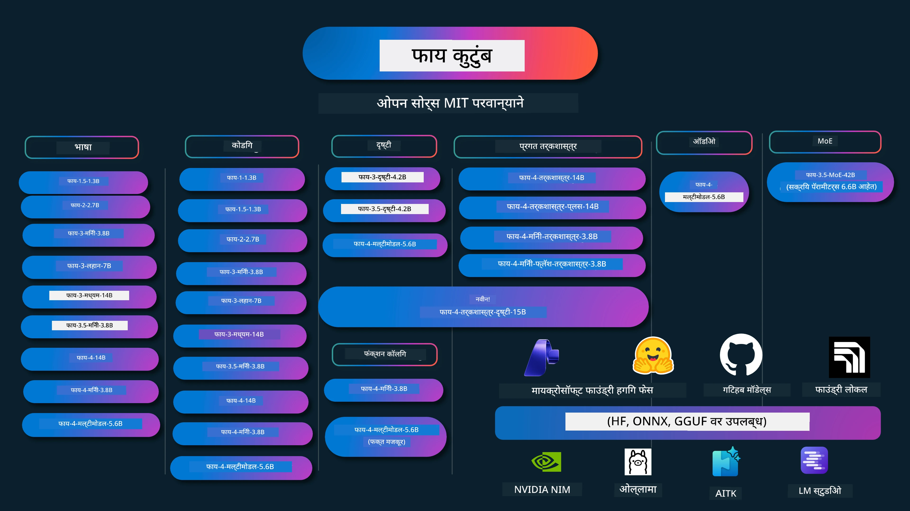

# Phi कुकबुक: Microsoft च्या Phi मॉडेल्ससह प्रत्यक्ष उदाहरणे

[](https://codespaces.new/microsoft/phicookbook)
[](https://vscode.dev/redirect?url=vscode://ms-vscode-remote.remote-containers/cloneInVolume?url=https://github.com/microsoft/phicookbook)

[](https://GitHub.com/microsoft/phicookbook/graphs/contributors/?WT.mc_id=aiml-137032-kinfeylo)
[](https://GitHub.com/microsoft/phicookbook/issues/?WT.mc_id=aiml-137032-kinfeylo)
[](https://GitHub.com/microsoft/phicookbook/pulls/?WT.mc_id=aiml-137032-kinfeylo)
[](http://makeapullrequest.com?WT.mc_id=aiml-137032-kinfeylo)

[](https://GitHub.com/microsoft/phicookbook/watchers/?WT.mc_id=aiml-137032-kinfeylo)
[](https://GitHub.com/microsoft/phicookbook/network/?WT.mc_id=aiml-137032-kinfeylo)
[](https://GitHub.com/microsoft/phicookbook/stargazers/?WT.mc_id=aiml-137032-kinfeylo)

[](https://discord.com/invite/ByRwuEEgH4)

Phi हा Microsoft द्वारे विकसित केलेल्या ओपन सोर्स AI मॉडेल्सची एक मालिका आहे.

Phi सध्या सर्वात शक्तिशाली आणि किफायतशीर लहान भाषा मॉडेल (SLM) असून, मल्टि-भाषा, तर्कशक्ति, मजकूर/चैट जनरेशन, कोडिंग, प्रतिमा, ऑडिओ आणि इतर परिस्थितींमध्ये अत्युत्तम परफॉर्मन्स दाखवतो.

आपण Phi ला क्लाऊड किंवा एज डिव्हायसेसवर डिप्लॉय करू शकता आणि कमी कम्प्यूटिंग पॉवरसह सहजपणे जनरेटिव्ह AI ऍप्लिकेशन्स तयार करू शकता.

या संसाधनांचा वापर सुरू करण्यासाठी खालील पावले अनुसरा:
1. **रिपॉझिटरी फोर्क करा**: क्लिक करा [](https://GitHub.com/microsoft/phicookbook/network/?WT.mc_id=aiml-137032-kinfeylo)
2. **रिपॉझिटरी क्लोन करा**: `git clone https://github.com/microsoft/PhiCookBook.git`
3. [**Microsoft AI Discord कम्युनिटीमध्ये सहभागी व्हा आणि तज्ञ व सहकारी विकसकांशी भेटा**](https://discord.com/invite/ByRwuEEgH4?WT.mc_id=aiml-137032-kinfeylo)



### 🌐 बहुभाषिक समर्थन

#### GitHub Action द्वारे समर्थित (स्वयंचलित आणि सदैव अद्ययावत)

<!-- CO-OP TRANSLATOR LANGUAGES TABLE START -->
[अरबी](../ar/README.md) | [बंगाली](../bn/README.md) | [बुल्गेरियन](../bg/README.md) | [बर्मी (म्यानमार)](../my/README.md) | [चिनी (सोप्या)][(./translations/zh-CN/README.md)] | [चिनी (परंपरागत, हॉंगकॉग)](../zh-HK/README.md) | [चिनी (परंपरागत, मकाउ)](../zh-MO/README.md) | [चिनी (परंपरागत, तैवान)](../zh-TW/README.md) | [क्रोएशियन](../hr/README.md) | [चेक](../cs/README.md) | [डॅनिश](../da/README.md) | [डच](../nl/README.md) | [एस्टोनियन](../et/README.md) | [फिनिश](../fi/README.md) | [फ्रेंच](../fr/README.md) | [जर्मन](../de/README.md) | [ग्रीक](../el/README.md) | [हिब्रू](../he/README.md) | [हिंदी](../hi/README.md) | [हंगेरीयन](../hu/README.md) | [इंडोनेशियन](../id/README.md) | [इटालियन](../it/README.md) | [जपानी](../ja/README.md) | [कन्नड](../kn/README.md) | [ख्मेर](../km/README.md) | [कोरियन](../ko/README.md) | [लिथुव्हेनियन](../lt/README.md) | [मलय](../ms/README.md) | [मल्याळम](../ml/README.md) | [मराठी](./README.md) | [नेपाली](../ne/README.md) | [नायजेरियन पिजिन](../pcm/README.md) | [नॉर्वेजियन](../no/README.md) | [फारसी (पर्शियन)](../fa/README.md) | [पोलिश](../pl/README.md) | [पोर्तुगिझ (ब्राझील)](../pt-BR/README.md) | [पोर्तुगिझ (पोर्तुगाल)](../pt-PT/README.md) | [पंजाबी (गुरुमुखी)](../pa/README.md) | [रोमानियन](../ro/README.md) | [रशियन](../ru/README.md) | [सर्बियन (सिरिलिक)](../sr/README.md) | [स्लोव्हाक](../sk/README.md) | [स्लोव्हेनियन](../sl/README.md) | [स्पॅनिश](../es/README.md) | [स्वाहिली](../sw/README.md) | [स्वीडिश](../sv/README.md) | [टागालॉग (फिलिपिनो)](../tl/README.md) | [तमिळ](../ta/README.md) | [तेलुगू](../te/README.md) | [थाई](../th/README.md) | [तुर्की](../tr/README.md) | [युक्रेनियन](../uk/README.md) | [उर्दू](../ur/README.md) | [व्हिएतनामी](../vi/README.md)

> **स्थानिक पद्धतीने क्लोन करायला प्राधान्य देता?**
>
> या रिपॉझिटरीमध्ये ५०+ भाषांमध्ये अनुवाद आहेत ज्यामुळे डाउनलोडचा आकार खूप वाढतो. भाषांतरांशिवाय क्लोन करण्यासाठी sparse checkout वापरा:
>
> **Bash / macOS / Linux:**
> ```bash
> git clone --filter=blob:none --sparse https://github.com/microsoft/PhiCookBook.git
> cd PhiCookBook
> git sparse-checkout set --no-cone '/*' '!translations' '!translated_images'
> ```
>
> **CMD (Windows):**
> ```cmd
> git clone --filter=blob:none --sparse https://github.com/microsoft/PhiCookBook.git
> cd PhiCookBook
> git sparse-checkout set --no-cone "/*" "!translations" "!translated_images"
> ```
>
> यामुळे तुम्हाला कोर्स पूर्ण करण्यासाठी आवश्यक सर्व काही मिळेल आणि डाउनलोडही खूप लवकर होईल.
<!-- CO-OP TRANSLATOR LANGUAGES TABLE END -->

## सामग्रीची सूची

- परिचय
  - [Phi कुटुंबात आपले स्वागत आहे](./md/01.Introduction/01/01.PhiFamily.md)
  - [आपले वातावरण सेट करणे](./md/01.Introduction/01/01.EnvironmentSetup.md)
  - [महत्त्वाच्या तंत्रज्ञानांचे समजणे](./md/01.Introduction/01/01.Understandingtech.md)
  - [Phi मॉडेल्ससाठी AI सुरक्षा](./md/01.Introduction/01/01.AISafety.md)
  - [Phi हार्डवेअर समर्थन](./md/01.Introduction/01/01.Hardwaresupport.md)
  - [Phi मॉडेल्स आणि प्लॅटफॉर्मवरील उपलब्धता](./md/01.Introduction/01/01.Edgeandcloud.md)
  - [Guidance-ai आणि Phi चा वापर](./md/01.Introduction/01/01.Guidance.md)
  - [GitHub मार्केटप्लेस मॉडेल्स](https://github.com/marketplace/models)
  - [Azure AI मॉडेल कॅटलॉग](https://ai.azure.com)

- वेगवेगळ्या वातावरणात Phi चे प्रेरणा घेतलेले (Inference)
    -  [हगींग फेस](./md/01.Introduction/02/01.HF.md)
    -  [GitHub मॉडेल्स](./md/01.Introduction/02/02.GitHubModel.md)
    -  [Microsoft Foundry मॉडेल कॅटलॉग](./md/01.Introduction/02/03.AzureAIFoundry.md)
    -  [ओल्लामा](./md/01.Introduction/02/04.Ollama.md)
    -  [AI टूलकिट VSCode (AITK)](./md/01.Introduction/02/05.AITK.md)
    -  [एनव्हीआयडीआयए NIM](./md/01.Introduction/02/06.NVIDIA.md)
    -  [Foundry Local](./md/01.Introduction/02/07.FoundryLocal.md)

- Phi कुटुंबाचा प्रेरणा (Inference)
    - [iOS मध्ये Phi प्रेरणा](./md/01.Introduction/03/iOS_Inference.md)
    - [Android मध्ये Phi प्रेरणा](./md/01.Introduction/03/Android_Inference.md)
    - [Jetson मध्ये Phi प्रेरणा](./md/01.Introduction/03/Jetson_Inference.md)
    - [AI PC मध्ये Phi प्रेरणा](./md/01.Introduction/03/AIPC_Inference.md)
    - [Apple MLX फ्रेमवर्कसह Phi प्रेरणा](./md/01.Introduction/03/MLX_Inference.md)
    - [स्थानिक सर्व्हरमध्ये Phi प्रेरणा](./md/01.Introduction/03/Local_Server_Inference.md)
    - [AI टूलकिट वापरून रिमोट सर्व्हरवर Phi प्रेरणा](./md/01.Introduction/03/Remote_Interence.md)
    - [Rust सह Phi प्रेरणा](./md/01.Introduction/03/Rust_Inference.md)
    - [स्थानिक Vision मध्ये Phi प्रेरणा](./md/01.Introduction/03/Vision_Inference.md)
    - [Kaito AKS, Azure कंटेनर्ससह Phi प्रेरणा (अधिकृत समर्थन)](./md/01.Introduction/03/Kaito_Inference.md)
-  [Phi कुटुंबाचे क्वांटिफायिंग](./md/01.Introduction/04/QuantifyingPhi.md)
    - [llama.cpp वापरून Phi-3.5 / 4 चे क्वांटायझिंग](./md/01.Introduction/04/UsingLlamacppQuantifyingPhi.md)
    - [onnxruntime साठी जनरेटिव्ह AI एक्सटेंशन्स वापरून Phi-3.5 / 4 चे क्वांटायझिंग](./md/01.Introduction/04/UsingORTGenAIQuantifyingPhi.md)
    - [Intel OpenVINO वापरून Phi-3.5 / 4 चे क्वांटायझिंग](./md/01.Introduction/04/UsingIntelOpenVINOQuantifyingPhi.md)
    - [Apple MLX फ्रेमवर्क वापरून Phi-3.5 / 4 चे क्वांटायझिंग](./md/01.Introduction/04/UsingAppleMLXQuantifyingPhi.md)

-  Phi चे मूल्यांकन
    - [उत्तरदायी AI](./md/01.Introduction/05/ResponsibleAI.md)
    - [मूल्यमापनासाठी Microsoft Foundry](./md/01.Introduction/05/AIFoundry.md)
    - [मूल्यमापनासाठी Promptflow वापरणे](./md/01.Introduction/05/Promptflow.md)
 
- Azure AI Search सह RAG
    - [Phi-4-mini आणि Phi-4-multimodal (RAG) सह Azure AI Search कसे वापरावे](https://github.com/microsoft/PhiCookBook/blob/main/code/06.E2E/E2E_Phi-4-RAG-Azure-AI-Search.ipynb)

- Phi अ‍ॅप्लिकेशन विकास नमुने
  - मजकूर आणि चैट अ‍ॅप्लिकेशन्स
    - Phi-4 नमुने 
      - [📓] [Phi-4-mini ONNX मॉडेलसह चैट करा](./md/02.Application/01.TextAndChat/Phi4/ChatWithPhi4ONNX/README.md)
      - [Phi-4 स्थानिक ONNX मॉडेलसह NET मध्ये चैट करा](../../md/04.HOL/dotnet/src/LabsPhi4-Chat-01OnnxRuntime)
      - [सामांतिक कर्नेल वापरून Phi-4 ONNX सह .NET कन्सोल अ‍ॅपमध्ये चैट करा](../../md/04.HOL/dotnet/src/LabsPhi4-Chat-02SK)
    - Phi-3 / 3.5 नमुने
      - [Phi3, ONNX Runtime Web आणि WebGPU वापरून ब्राउझरमधील स्थानिक चैटबॉट](https://github.com/microsoft/onnxruntime-inference-examples/tree/main/js/chat)
      - [OpenVino Chat](./md/02.Application/01.TextAndChat/Phi3/E2E_OpenVino_Chat.md)
      - [Multi Model - इंटरऐक्टिव Phi-3-मिनी आणि OpenAI Whisper](./md/02.Application/01.TextAndChat/Phi3/E2E_Phi-3-mini_with_whisper.md)
      - [MLFlow - एक रॅपर तयार करणे आणि MLFlow सह Phi-3 वापरणे](./md//02.Application/01.TextAndChat/Phi3/E2E_Phi-3-MLflow.md)
      - [मॉडेल ऑप्टिमायझेशन - Olive सह ONNX Runtime Web साठी Phi-3-min मॉडेल कसे ऑप्टिमाइज़ करायचे](https://github.com/microsoft/Olive/tree/main/examples/phi3)
      - [Phi-3 मिनी-4k-instruct-onnx सह WinUI3 अॅप](https://github.com/microsoft/Phi3-Chat-WinUI3-Sample/)
      -[WinUI3 मल्टी मॉडेल AI-चालित नोट्स अॅप सॅम्पल](https://github.com/microsoft/ai-powered-notes-winui3-sample)
      - [कस्टम Phi-3 मॉडेल्सचे फाइन-ट्युनिंग आणि Prompt flow सह एकत्रीकरण](./md/02.Application/01.TextAndChat/Phi3/E2E_Phi-3-FineTuning_PromptFlow_Integration.md)
      - [Microsoft Foundry मध्ये Prompt flow सह कस्टम Phi-3 मॉडेल्सचे फाइन-ट्युनिंग आणि एकत्रीकरण](./md/02.Application/01.TextAndChat/Phi3/E2E_Phi-3-FineTuning_PromptFlow_Integration_AIFoundry.md)
      - [Microsoft च्या जबाबदार AI तत्त्वांवर लक्ष केंद्रित करून Microsoft Foundry मध्ये फाइन-ट्यून केलेल्या Phi-3 / Phi-3.5 मॉडेलचे मूल्यांकन](./md/02.Application/01.TextAndChat/Phi3/E2E_Phi-3-Evaluation_AIFoundry.md)
      - [📓] [Phi-3.5-मिनी-इन्स्ट्रक्शन्स भाषिक भविष्यवाणी सॅम्पल (चिनी/इंग्रजी)](./md/02.Application/01.TextAndChat/Phi3/phi3-instruct-demo.ipynb)
      - [Phi-3.5-Instruct WebGPU RAG Chatbot](./md/02.Application/01.TextAndChat/Phi3/WebGPUWithPhi35Readme.md)
      - [Windows GPU वापरून Phi-3.5-Instruct ONNX सह Prompt flow सोल्यूशन तयार करणे](./md/02.Application/01.TextAndChat/Phi3/UsingPromptFlowWithONNX.md)
      - [Android अॅप तयार करण्यासाठी Microsoft Phi-3.5 tflite वापरणे](./md/02.Application/01.TextAndChat/Phi3/UsingPhi35TFLiteCreateAndroidApp.md)
      - [Microsoft.ML.OnnxRuntime वापरून स्थानिक ONNX Phi-3 मॉडेलसह Q&A .NET उदाहरण](../../md/04.HOL/dotnet/src/LabsPhi301)
      - [Semantic Kernel आणि Phi-3 सह कन्सोल चॅट .NET अॅप](../../md/04.HOL/dotnet/src/LabsPhi302)

  - Azure AI Inference SDK कोड आधारित सॅम्पल्स 
    - Phi-4 सॅम्पल्स 
      - [📓] [Phi-4-multimodal वापरून प्रोजेक्ट कोड तयार करा](./md/02.Application/02.Code/Phi4/GenProjectCode/README.md)
    - Phi-3 / 3.5 सॅम्पल्स
      - [Microsoft Phi-3 फॅमिली वापरून तुमचे स्वतःचे Visual Studio Code GitHub Copilot Chat तयार करा](./md/02.Application/02.Code/Phi3/VSCodeExt/README.md)
      - [GitHub मॉडेल्ससह Phi-3.5 वापरून तुमचा स्वतःचा Visual Studio Code Chat Copilot एजंट तयार करा](/md/02.Application/02.Code/Phi3/CreateVSCodeChatAgentWithGitHubModels.md)

  - प्रगत तर्कशास्त्र सॅम्पल्स
    - Phi-4 सॅम्पल्स 
      - [📓] [Phi-4-मिनी-तर्कशास्त्र किंवा Phi-4-तर्कशास्त्र सॅम्पल्स](./md/02.Application/03.AdvancedReasoning/Phi4/AdvancedResoningPhi4mini/README.md)
      - [📓] [Microsoft Olive सह Phi-4-मिनी-तर्कशास्त्राचे फाइन-ट्युनिंग](./md/02.Application/03.AdvancedReasoning/Phi4/AdvancedResoningPhi4mini/olive_ft_phi_4_reasoning_with_medicaldata.ipynb)
      - [📓] [Apple MLX सह Phi-4-मिनी-तर्कशास्त्राचे फाइन-ट्युनिंग](./md/02.Application/03.AdvancedReasoning/Phi4/AdvancedResoningPhi4mini/mlx_ft_phi_4_reasoning_with_medicaldata.ipynb)
      - [📓] [GitHub मॉडेल्ससह Phi-4-मिनी-तर्कशास्त्र](./md/02.Application/02.Code/Phi4r/github_models_inference.ipynb)
      - [📓] [Microsoft Foundry मॉडेल्ससह Phi-4-मिनी-तर्कशास्त्र](./md/02.Application/02.Code/Phi4r/azure_models_inference.ipynb)
  - डेमो
      - [Phi-4-मिनी डेमो Hugging Face Spaces वर होस्ट केलेले](https://huggingface.co/spaces/microsoft/phi-4-mini?WT.mc_id=aiml-137032-kinfeylo)
      - [Phi-4-multimodal डेमो Hugging Face Spaces वर होस्ट केलेले](https://huggingface.co/spaces/microsoft/phi-4-multimodal?WT.mc_id=aiml-137032-kinfeylo)
  - व्हिजन सॅम्पल्स
    - Phi-4 सॅम्पल्स 
      - [📓] [Phi-4-multimodal वापरून प्रतिमा वाचा आणि कोड तयार करा](./md/02.Application/04.Vision/Phi4/CreateFrontend/README.md) 
    - Phi-3 / 3.5 सॅम्पल्स
      -  [📓][Phi-3-व्हिजन-प्रतिमा मजकूरातून मजकूरात रुपांतरण](./md/02.Application/04.Vision/Phi3/E2E_Phi-3-vision-image-text-to-text-online-endpoint.ipynb)
      - [Phi-3-व्हिजन-ONNX](https://onnxruntime.ai/docs/genai/tutorials/phi3-v.html)
      - [📓][Phi-3-व्हिजन CLIP एम्बेडिंग](./md/02.Application/04.Vision/Phi3/E2E_Phi-3-vision-image-text-to-text-online-endpoint.ipynb)
      - [डेमो: Phi-3 पुनर्वापर](https://github.com/jennifermarsman/PhiRecycling/)
      - [Phi-3-व्हिजन - दृश्य भाषा सहाय्यक - Phi3-व्हिजन आणि OpenVINO सह](https://docs.openvino.ai/nightly/notebooks/phi-3-vision-with-output.html)
      - [Phi-3 व्हिजन Nvidia NIM](./md/02.Application/04.Vision/Phi3/E2E_Nvidia_NIM_Vision.md)
      - [Phi-3 व्हिजन OpenVino](./md/02.Application/04.Vision/Phi3/E2E_OpenVino_Phi3Vision.md)
      - [📓][Phi-3.5 व्हिजन मल्टी-फ्रेम किंवा मल्टी-इमेज सॅम्पल](./md/02.Application/04.Vision/Phi3/phi3-vision-demo.ipynb)
      - [Microsoft.ML.OnnxRuntime .NET वापरून Phi-3 व्हिजन स्थानिक ONNX मॉडेल](../../md/04.HOL/dotnet/src/LabsPhi303)
      - [मेनू आधारित Phi-3 व्हिजन स्थानिक ONNX मॉडेल Microsoft.ML.OnnxRuntime .NET वापरून](../../md/04.HOL/dotnet/src/LabsPhi304)

  - तर्कशास्त्र-व्हिजन सॅम्पल्स
    - Phi-4-Reasoning-Vision-15B 
      - [📓] [Phi-4-Reasoning-Vision-15B वापरून jaywalking ओळखणे](./md/02.Application/10.ReasoningVision/Phi_4_reasoning_vision_15b_Jaywalking.ipynb)
      - [📓] [Phi-4-Reasoning-Vision-15B वापरून गणित](./md/02.Application/10.ReasoningVision/Phi_4_reasoning_vision_15b_Math.ipynb)
      - [📓] [Phi-4-Reasoning-Vision-15B वापरून UI ओळखणे](./md/02.Application/10.ReasoningVision/Phi_4_reasoning_vision_15b_ui.ipynb)

  - गणित सॅम्पल्स
    -  Phi-4-मिनी-फ्लॅश-तर्कशास्त्र-इन्स्ट्रक्शन सॅम्पल्स  [Phi-4-मिनी-फ्लॅश-तर्कशास्त्र-इन्स्ट्रक्शनसह गणित डेमो](./md/02.Application/09.Math/MathDemo.ipynb)

  - ऑडिओ सॅम्पल्स
    - Phi-4 सॅम्पल्स 
      - [📓] [Phi-4-multimodal वापरून ऑडिओ ट्रान्सक्रिप्ट्स काढणे](./md/02.Application/05.Audio/Phi4/Transciption/README.md)
      - [📓] [Phi-4-multimodal ऑडिओ सॅम्पल](./md/02.Application/05.Audio/Phi4/Siri/demo.ipynb)
      - [📓] [Phi-4-multimodal भाषांतर सॅम्पल](./md/02.Application/05.Audio/Phi4/Translate/demo.ipynb)
      - [.NET कन्सोल अॅप्लिकेशन वापरून ऑडिओ फाइलचे विश्लेषण करण्यासाठी आणि ट्रान्सक्रिप्ट तयार करण्यासाठी Phi-4-multimodal](../../md/04.HOL/dotnet/src/LabsPhi4-MultiModal-02Audio)

  - MOE सॅम्पल्स
    - Phi-3 / 3.5 सॅम्पल्स
      - [📓] [Phi-3.5 मिक्स्चर ऑफ एक्सपर्ट्स मॉडेल्स (MoEs) सोशल मीडिया सॅम्पल](./md/02.Application/06.MoE/Phi3/phi3_moe_demo.ipynb)
      - [📓] [Retrieval-Augmented Generation (RAG) पाइपलाइन तयार करणे NVIDIA NIM Phi-3 MOE, Azure AI Search, आणि LlamaIndex सह](./md/02.Application/06.MoE/Phi3/azure-ai-search-nvidia-rag.ipynb)
      - 
  - फंक्शन कॉलिंग सॅम्पल्स
    - Phi-4 सॅम्पल्स 🆕
      -  [📓] [Phi-4-मिनी सह फंक्शन कॉलिंग वापरणे](./md/02.Application/07.FunctionCalling/Phi4/FunctionCallingBasic/README.md)
      -  [📓] [Phi-4-मिनी सह मल्टी-एजंट तयार करण्यासाठी फंक्शन कॉलिंग वापरणे](./md/02.Application/07.FunctionCalling/Phi4/Multiagents/Phi_4_mini_multiagent.ipynb)
      -  [📓] [Ollama सह फंक्शन कॉलिंग वापरणे](./md/02.Application/07.FunctionCalling/Phi4/Ollama/ollama_functioncalling.ipynb)
      -  [📓] [ONNX सह फंक्शन कॉलिंग वापरणे](./md/02.Application/07.FunctionCalling/Phi4/ONNX/onnx_parallel_functioncalling.ipynb)
  - मल्टीमॉडाल मिक्सिंग सॅम्पल्स
    - Phi-4 सॅम्पल्स 🆕
      -  [📓] [Phi-4-multimodal तंत्रज्ञान पत्रकार म्हणून वापरणे](./md/02.Application/08.Multimodel/Phi4/TechJournalist/phi_4_mm_audio_text_publish_news.ipynb)
      - [.NET कन्सोल अॅप्लिकेशन वापरून Phi-4-multimodal वापरून प्रतिमा विश्लेषण करणे](../../md/04.HOL/dotnet/src/LabsPhi4-MultiModal-01Images)

- Phi फाइन-ट्युनिंग सॅम्पल्स
  - [फाइन-ट्युनिंग संकसनार्यांसाठी](./md/03.FineTuning/FineTuning_Scenarios.md)
  - [फाइन-ट्युनिंग विरुद्ध RAG](./md/03.FineTuning/FineTuning_vs_RAG.md)
  - [Phi-3 ला उद्योगातील तज्ञ बनवा फाइन-ट्युनिंग](./md/03.FineTuning/LetPhi3gotoIndustriy.md)
  - [AI Toolkit for VS Code सह Phi-3 चे फाइन-ट्युनिंग](./md/03.FineTuning/Finetuning_VSCodeaitoolkit.md)
  - [Azure मशीन लर्निंग सेवा सह Phi-3 चे फाइन-ट्युनिंग](./md/03.FineTuning/Introduce_AzureML.md)
  - [Lora सह Phi-3 चे फाइन-ट्युनिंग](./md/03.FineTuning/FineTuning_Lora.md)
  - [QLora सह Phi-3 चे फाइन-ट्युनिंग](./md/03.FineTuning/FineTuning_Qlora.md)
  - [Microsoft Foundry सह Phi-3 चे फाइन-ट्युनिंग](./md/03.FineTuning/FineTuning_AIFoundry.md)
  - [Azure ML CLI/SDK सह Phi-3 चे फाइन-ट्युनिंग](./md/03.FineTuning/FineTuning_MLSDK.md)
  - [Microsoft Olive सह फाइन-ट्युनिंग](./md/03.FineTuning/FineTuning_MicrosoftOlive.md)
  - [Microsoft Olive Hands-On Lab सह फाइन-ट्युनिंग](./md/03.FineTuning/olive-lab/readme.md)
  - [Weights and Bias सह Phi-3-vision चे फाइन-ट्युनिंग](./md/03.FineTuning/FineTuning_Phi-3-visionWandB.md)
  - [Apple MLX फ्रेमवर्क सह Phi-3 चे फाइन-ट्युनिंग](./md/03.FineTuning/FineTuning_MLX.md)
  - [Phi-3-vision (अधिकृत समर्थन) चे फाइन-ट्युनिंग](./md/03.FineTuning/FineTuning_Vision.md)
  - [काइटो AKS सह Phi-3 चे फाइन-ट्यूनिंग, Azure कंटेनर्स (अधिकृत समर्थन)](./md/03.FineTuning/FineTuning_Kaito.md)
  - [Phi-3 आणि 3.5 व्हिजनचे फाइन-ट्यूनिंग](https://github.com/2U1/Phi3-Vision-Finetune)

- हाताळणी लॅब
  - [काटकनीतील मॉडेल्सचा शोध: LLMs, SLMs, स्थानिक विकास आणि बरेच काही](https://github.com/microsoft/aitour-exploring-cutting-edge-models)
  - [NLP क्षमता अनलॉक करणे: Microsoft Olive सह फाइन-ट्यूनिंग](https://github.com/azure/Ignite_FineTuning_workshop)

- शैक्षणिक संशोधन पेपर्स आणि प्रकाशने
  - [Textbooks Are All You Need II: phi-1.5 तांत्रिक अहवाल](https://arxiv.org/abs/2309.05463)
  - [Phi-3 तांत्रिक अहवाल: तुमच्या फोनवर स्थानिकरीत्या एक अत्यंत सक्षम भाषा मॉडेल](https://arxiv.org/abs/2404.14219)
  - [Phi-4 तांत्रिक अहवाल](https://arxiv.org/abs/2412.08905)
  - [Phi-4-Mini तांत्रिक अहवाल: मिश्रण-ऑफ-LoRAs द्वारे संकुचित परंतु शक्तिशाली मल्टीमोडल भाषा मॉडेल्स](https://arxiv.org/abs/2503.01743)
  - [वाहनातील फंक्शन-कॉलिंगसाठी लहान भाषा मॉडेल्सचे ऑप्टिमायझेशन](https://arxiv.org/abs/2501.02342)
  - [(WhyPHI) बहुपर्यायी प्रश्न उत्तर देण्यासाठी PHI-3 चे फाइन-ट्यूनिंग: पद्धतशास्त्र, परिणाम आणि आव्हाने](https://arxiv.org/abs/2501.01588)
  - [Phi-4-तर्कशास्त्र तांत्रिक अहवाल](https://www.microsoft.com/en-us/research/wp-content/uploads/2025/04/phi_4_reasoning.pdf)
  - [Phi-4-मिनी-तर्कशास्त्र तांत्रिक अहवाल](https://huggingface.co/microsoft/Phi-4-mini-reasoning/blob/main/Phi-4-Mini-Reasoning.pdf)

## Phi मॉडेल्सचा वापर

### Microsoft Foundry वर Phi

तुम्ही Microsoft Phi कसा वापरायचा आणि तुमच्या वेगवेगळ्या हार्डवेअर उपकरणांमध्ये E2E सोल्यूशन्स कसे तयार करायचे हे शिकू शकता. Phi स्वतः अनुभवण्यासाठी, मॉडेल्सशी खेळण्यापासून सुरुवात करा आणि तुमच्या परिस्थितीसाठी Phi सानुकूलित करा [Microsoft Foundry Azure AI Model Catalog](https://aka.ms/phi3-azure-ai) वापरून. अधिक जाणून घेण्यासाठी [Microsoft Foundry](./md/02.QuickStart/AzureAIFoundry_QuickStart.md) मधील Getting Started पहा.

**प्लेयग्राउंड**
प्रत्येक मॉडेलसाठी समर्पित प्लेयग्राउंड आहे [Azure AI Playground](https://aka.ms/try-phi3) मध्ये मॉडेल ची चाचणी करण्यासाठी.

### GitHub मॉडेल्सवर Phi

तुम्ही Microsoft Phi कसा वापरायचा आणि तुमच्या वेगवेगळ्या हार्डवेअर उपकरणांमध्ये E2E सोल्यूशन्स कसे तयार करायचे हे शिकू शकता. Phi स्वतः अनुभवण्यासाठी, मॉडेलशी खेळण्यापासून सुरुवात करा आणि तुमच्या परिस्थितीसाठी Phi सानुकूलित करा [GitHub Model Catalog](https://github.com/marketplace/models?WT.mc_id=aiml-137032-kinfeylo) वापरून. अधिक जाणून घेण्यासाठी [GitHub Model Catalog](./md/02.QuickStart/GitHubModel_QuickStart.md) मधील Getting Started पहा.

**प्लेयग्राउंड**
प्रत्येक मॉडेलसाठी समर्पित [प्लेयग्राउंड आहे मॉडेलची चाचणी करण्यासाठी](./md/02.QuickStart/GitHubModel_QuickStart.md).

### Hugging Face वर Phi

तुम्ही मॉडेल [Hugging Face](https://huggingface.co/microsoft) वरही शोधू शकता.

**प्लेयग्राउंड**
 [Hugging Chat प्लेयग्राउंड](https://huggingface.co/chat/models/microsoft/Phi-3-mini-4k-instruct)

 ## 🎒 इतर कोर्स

आमच्या टीमने इतर कोर्सेस तयार केले आहेत! पाहा:

<!-- CO-OP TRANSLATOR OTHER COURSES START -->
### LangChain
[](https://aka.ms/langchain4j-for-beginners)
[](https://aka.ms/langchainjs-for-beginners?WT.mc_id=m365-94501-dwahlin)
[](https://github.com/microsoft/langchain-for-beginners?WT.mc_id=m365-94501-dwahlin)
---

### Azure / Edge / MCP / Agents
[](https://github.com/microsoft/AZD-for-beginners?WT.mc_id=academic-105485-koreyst)
[](https://github.com/microsoft/edgeai-for-beginners?WT.mc_id=academic-105485-koreyst)
[](https://github.com/microsoft/mcp-for-beginners?WT.mc_id=academic-105485-koreyst)
[](https://github.com/microsoft/ai-agents-for-beginners?WT.mc_id=academic-105485-koreyst)

---
 
### जनरेटिव AI सिरीज
[](https://github.com/microsoft/generative-ai-for-beginners?WT.mc_id=academic-105485-koreyst)
[-9333EA?style=for-the-badge&labelColor=E5E7EB&color=9333EA)](https://github.com/microsoft/Generative-AI-for-beginners-dotnet?WT.mc_id=academic-105485-koreyst)
[-C084FC?style=for-the-badge&labelColor=E5E7EB&color=C084FC)](https://github.com/microsoft/generative-ai-for-beginners-java?WT.mc_id=academic-105485-koreyst)
[-E879F9?style=for-the-badge&labelColor=E5E7EB&color=E879F9)](https://github.com/microsoft/generative-ai-with-javascript?WT.mc_id=academic-105485-koreyst)

---
 
### मूलभूत शिकणे
[](https://aka.ms/ml-beginners?WT.mc_id=academic-105485-koreyst)
[](https://aka.ms/datascience-beginners?WT.mc_id=academic-105485-koreyst)
[](https://aka.ms/ai-beginners?WT.mc_id=academic-105485-koreyst)
[](https://github.com/microsoft/Security-101?WT.mc_id=academic-96948-sayoung)
[](https://aka.ms/webdev-beginners?WT.mc_id=academic-105485-koreyst)
[](https://aka.ms/iot-beginners?WT.mc_id=academic-105485-koreyst)
[](https://github.com/microsoft/xr-development-for-beginners?WT.mc_id=academic-105485-koreyst)

---
 
### कॉपायलेट सिरीज
[](https://aka.ms/GitHubCopilotAI?WT.mc_id=academic-105485-koreyst)
[](https://github.com/microsoft/mastering-github-copilot-for-dotnet-csharp-developers?WT.mc_id=academic-105485-koreyst)
[](https://github.com/microsoft/CopilotAdventures?WT.mc_id=academic-105485-koreyst)
<!-- CO-OP TRANSLATOR OTHER COURSES END -->

## जबाबदार AI

Microsoft आपल्या ग्राहकांना आमची AI उत्पादने जबाबदारीने वापरण्यात मदत करण्यासाठी, आमचे शिक्षण सामायिक करण्यासाठी आणि Transparency Notes आणि Impact Assessments सारख्या साधनांद्वारे विश्वासावर आधारित भागीदारी तयार करण्यासाठी वचनबद्ध आहे. अनेक हे संसाधने [https://aka.ms/RAI](https://aka.ms/RAI) येथे मिळू शकतात.
जवाबदार AI बाबतीत Microsoft ची दृष्टिकोन आमच्या AI नीतींवर आधारित आहे ज्यात नीतिमत्ता, विश्वासार्हता आणि सुरक्षा, गोपनीयता आणि सुरक्षितता, समावेशकता, पारदर्शकता आणि जबाबदारी यांचा समावेश आहे.

मोठ्या प्रमाणात नैसर्गिक भाषा, प्रतिमा, आणि भाषण मॉडेल्स - या नमुन्यात वापरल्या गेलेल्या सारख्या - कदाचित अनुचित, अविश्वसनीय किंवा आक्षेपार्ह वर्तन करू शकतात, ज्यामुळे हानी होऊ शकते. कृपया धोक्यां आणि मर्यादा जाणून घेण्यासाठी [Azure OpenAI सेवा Transparency note](https://learn.microsoft.com/legal/cognitive-services/openai/transparency-note?tabs=text) तपासा.
या जोखमी कमी करण्यासाठी शिफारस केलेली पद्धत म्हणजे आपल्या आर्किटेक्चरमध्ये एक सुरक्षितता प्रणाली समाविष्ट करणे जी हानिकारक वर्तन ओळखू आणि टाळू शकते. [Azure AI Content Safety](https://learn.microsoft.com/azure/ai-services/content-safety/overview) स्वतंत्र संरक्षणाच्या स्तराची पूर्तता करते, जी अनुप्रयोगांमध्ये आणि सेवांमध्ये वापरकर्त्यांनी तयार केलेले आणि AI-निर्मित हानिकारक सामग्री ओळखू शकते. Azure AI Content Safety मध्ये टेक्स्ट आणि इमेज API समाविष्ट आहेत, जे तुम्हाला हानिकारक सामग्री ओळखण्याची परवानगी देतात. Microsoft Foundry मध्ये, Content Safety सेवा तुम्हाला वेगवेगळ्या माध्यमांमध्ये हानिकारक सामग्री शोधण्यासाठी नमुना कोड पाहण्याची, शोधण्याची आणि वापरून पाहण्याची संधी देते. खालील [quickstart दस्तऐवज](https://learn.microsoft.com/azure/ai-services/content-safety/quickstart-text?tabs=visual-studio%2Clinux&pivots=programming-language-rest) तुम्हाला सेवेवर विनंत्या कशा करायच्या हे मार्गदर्शन करतो. 

दुसरा विचार करण्याचा मुद्दा म्हणजे एकूण अ‍ॅप्लिकेशन परफॉर्मन्स. मल्टी-मोडल आणि मल्टी-मॉडेल्स अ‍ॅप्लिकेशन्ससाठी, आपण परफॉर्मन्स म्हणजे की प्रणाली तुमच्याला आणि तुमच्या वापरकर्त्यांना अपेक्षित असणारी कामगिरी करते, ज्यात हानिकारक आउटपुट तयार न करणे समाविष्ट आहे, असे मानतो. [परफॉर्मन्स आणि गुणवत्ता आणि जोखमी आणि सुरक्षितता मूल्यांकनकर्ता](https://learn.microsoft.com/azure/ai-studio/concepts/evaluation-metrics-built-in) वापरून आपले संपूर्ण अ‍ॅप्लिकेशनचे कामकाज मोजणे महत्त्वाचे आहे. तुम्हाला [कस्टम मूल्यांकन करणार्‍या साधनांसह](https://learn.microsoft.com/azure/ai-studio/how-to/develop/evaluate-sdk#custom-evaluators) तयार करण्याची आणि मोजमाप करण्याची देखील क्षमता आहे. 

तुम्ही तुमच्या विकास वातावरणात [Azure AI Evaluation SDK](https://microsoft.github.io/promptflow/index.html) वापरून तुमचे AI अ‍ॅप्लिकेशन मूल्यमापन करू शकता. दिलेला टेस्ट डेटासेट किंवा टार्गेट सापडल्यावर, तुमचे जनरेटिव्ह AI अ‍ॅप्लिकेशनचे जनरेट केलेले परिणाम अंगभूत मूल्यांकन किंवा तुमच्या पसंतीनुसार कस्टम मूल्यांकन साधनांद्वारे प्रमाणात्मकपणे मोजले जातात. तुमची प्रणाली मूल्यमापन करण्यासाठी Azure AI Evaluation SDK सह सुरू करण्यासाठी, तुम्ही [quickstart मार्गदर्शक](https://learn.microsoft.com/azure/ai-studio/how-to/develop/flow-evaluate-sdk) फॉलो करू शकता. एकदा मूल्यमापन सत्र चालविल्यावर, तुम्ही [Microsoft Foundry मध्ये निकालांचे दृश्य पाहू शकता](https://learn.microsoft.com/azure/ai-studio/how-to/evaluate-flow-results).

## ट्रेडमार्क

हा प्रकल्प प्रकल्पांचे, उत्पादनांचे किंवा सेवा यांचे ट्रेडमार्क किंवा लोगो समाविष्ट करू शकतो. Microsoft ट्रेडमार्क किंवा लोगोच्या अधिकृत वापरासाठी [Microsoft चे ट्रेडमार्क आणि ब्रँड मार्गदर्शक](https://www.microsoft.com/legal/intellectualproperty/trademarks/usage/general) पालनीय आहेत आणि त्यांचे पालन करणे आवश्यक आहे. Microsoft ट्रेडमार्क किंवा लोगोच्या सुधारित आवृत्त्यांमध्ये वापरामुळे गैरसमज होऊ नये किंवा Microsoft च्या प्रायोजकत्वाची भावना होऊ नये. तृतीय पक्ष ट्रेडमार्क किंवा लोगोच्या वापरासाठी त्या तृतीय पक्षाच्या धोरणांचे पालन करणे आवश्यक आहे.

## मदत घेणे

तुम्हाला अडचण आल्यास किंवा AI अ‍ॅप तयार करण्याबाबत काही प्रश्न असल्यास, सामील व्हा:

[](https://aka.ms/foundry/discord)

जर तुम्हाला उत्पादन अभिप्राय किंवा बिल्ड करताना त्रुटी आढळल्यास येथे भेट द्या:

[](https://aka.ms/foundry/forum)

---

<!-- CO-OP TRANSLATOR DISCLAIMER START -->
**अस्वीकरण**:
हा दस्तऐवज AI अनुवाद सेवा [Co-op Translator](https://github.com/Azure/co-op-translator) वापरून अनुवादित केला आहे. आम्ही अचूकतेसाठी प्रयत्नशील असलो तरी, कृपया लक्षात घ्या की स्वयंचलित अनुवादांमध्ये चुका किंवा अचूकतेची तूट असू शकते. मूळ दस्तऐवज त्याच्या स्थानिक भाषेत अधिकृत स्रोत मानले पाहिजे. महत्वपूर्ण माहितीसाठी व्यावसायिक मानवी अनुवाद शिफारस केली जाते. या अनुवादाच्या वापरामुळे उद्भवणाऱ्या कोणत्याही गैरसमजुती किंवा चुकीच्या अर्थसमजांसाठी आम्ही जबाबदार नाही.
<!-- CO-OP TRANSLATOR DISCLAIMER END -->