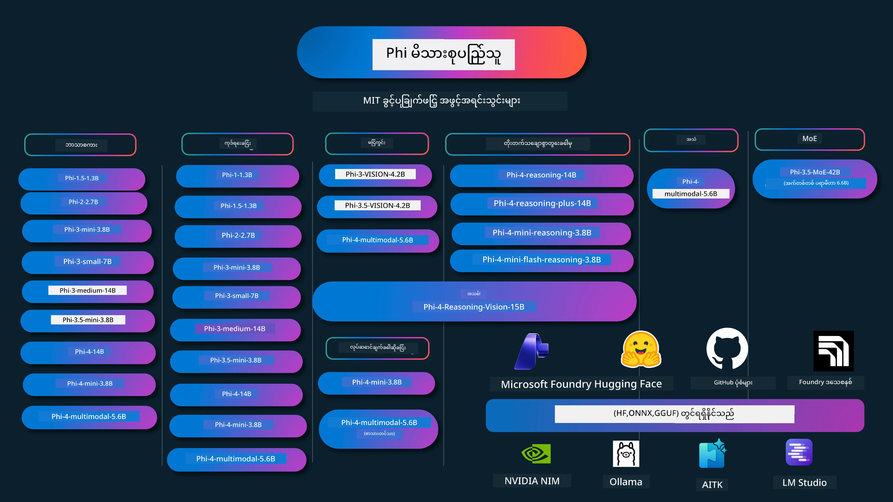

# Phi Cookbook: Microsoft ၏ Phi မော်ဒယ်များနှင့် လက်တွေ့နမူနာများ

[](https://codespaces.new/microsoft/phicookbook)
[](https://vscode.dev/redirect?url=vscode://ms-vscode-remote.remote-containers/cloneInVolume?url=https://github.com/microsoft/phicookbook)

[](https://GitHub.com/microsoft/phicookbook/graphs/contributors/?WT.mc_id=aiml-137032-kinfeylo)
[](https://GitHub.com/microsoft/phicookbook/issues/?WT.mc_id=aiml-137032-kinfeylo)
[](https://GitHub.com/microsoft/phicookbook/pulls/?WT.mc_id=aiml-137032-kinfeylo)
[](http://makeapullrequest.com?WT.mc_id=aiml-137032-kinfeylo)

[](https://GitHub.com/microsoft/phicookbook/watchers/?WT.mc_id=aiml-137032-kinfeylo)
[](https://GitHub.com/microsoft/phicookbook/network/?WT.mc_id=aiml-137032-kinfeylo)
[](https://GitHub.com/microsoft/phicookbook/stargazers/?WT.mc_id=aiml-137032-kinfeylo)

[](https://discord.com/invite/ByRwuEEgH4)

Phi သည် Microsoft မှဖန်တီးထားသော အမှတ်တံဆိပ်ဖြစ်ပြီး ဖွင့်လှစ်အရင်းမြစ် AI မော်ဒယ်စီးရီးတစ်ခုဖြစ်သည်။

Phi သည် လက်ရှိတွင်အကြီးဆုံးစွမ်းအားဖြင့် သက်သာဆုံးသော သေးငယ်သောဘာသာစကားမော်ဒယ် (SLM) ဖြစ်ပြီး၊ ဘာသာစကားအမျိုးမျိုး၊ အတွေးအခေါ်၊ စာသား/စကားပြောထုတ်လုပ်ခြင်း၊ ကုဒ်ရေးခြင်း၊ ပုံများ၊ အသံနှင့် အခြား မ်ားစွာသောဖြစ်ရပ်များတွင် အကောင်းဆုံး စမ်းသပ်ချက်များ ရရှိထားသည်။

Phi ကို Cloud သို့မဟုတ် ဒြပ်စင်ကိရိယာများတွင် တပ်ဆင်နိုင်ပြီး ကွန်ပျူတာစွမ်းအား ကန့်သတ်ချက် ရှိသော်လည်း လွယ်ကူစွာ စိတ်ကူးမှန် AI အပလီကေးရှင်းများ တည်ဆောက်နိုင်သည်။

ဒီအရင်းအမြစ်များကို အသုံးပြု၍ စတင်ရန် အဆင့်များကို လိုက်နာပါ။
1. **Repository ကို Fork လုပ်ပါ**: Click [](https://GitHub.com/microsoft/phicookbook/network/?WT.mc_id=aiml-137032-kinfeylo)
2. **Repository ကို Clone လုပ်ပါ**: `git clone https://github.com/microsoft/PhiCookBook.git`
3. [**Microsoft AI Discord လူမှုအသိုင်းအဝိုင်းတွင် ပါဝင်၍ ကျွမ်းကျင်သူများနှင့် တက်ကြွဖော်ရွေများနှင့် တွေ့ဆုံပါ**](https://discord.com/invite/ByRwuEEgH4?WT.mc_id=aiml-137032-kinfeylo)



### 🌐 ဘာသာစကားစုံပံ့ပိုးမှု

#### GitHub Action မှတဆင့် ပံ့ပိုးထား (အလိုအလျောက် နှင့် အမြဲတမ်း အပ်ဒိတ်ဖြစ်)

<!-- CO-OP TRANSLATOR LANGUAGES TABLE START -->
[Arabic](../ar/README.md) | [Bengali](../bn/README.md) | [Bulgarian](../bg/README.md) | [Burmese (Myanmar)](./README.md) | [Chinese (Simplified)](../zh-CN/README.md) | [Chinese (Traditional, Hong Kong)](../zh-HK/README.md) | [Chinese (Traditional, Macau)](../zh-MO/README.md) | [Chinese (Traditional, Taiwan)](../zh-TW/README.md) | [Croatian](../hr/README.md) | [Czech](../cs/README.md) | [Danish](../da/README.md) | [Dutch](../nl/README.md) | [Estonian](../et/README.md) | [Finnish](../fi/README.md) | [French](../fr/README.md) | [German](../de/README.md) | [Greek](../el/README.md) | [Hebrew](../he/README.md) | [Hindi](../hi/README.md) | [Hungarian](../hu/README.md) | [Indonesian](../id/README.md) | [Italian](../it/README.md) | [Japanese](../ja/README.md) | [Kannada](../kn/README.md) | [Khmer](../km/README.md) | [Korean](../ko/README.md) | [Lithuanian](../lt/README.md) | [Malay](../ms/README.md) | [Malayalam](../ml/README.md) | [Marathi](../mr/README.md) | [Nepali](../ne/README.md) | [Nigerian Pidgin](../pcm/README.md) | [Norwegian](../no/README.md) | [Persian (Farsi)](../fa/README.md) | [Polish](../pl/README.md) | [Portuguese (Brazil)](../pt-BR/README.md) | [Portuguese (Portugal)](../pt-PT/README.md) | [Punjabi (Gurmukhi)](../pa/README.md) | [Romanian](../ro/README.md) | [Russian](../ru/README.md) | [Serbian (Cyrillic)](../sr/README.md) | [Slovak](../sk/README.md) | [Slovenian](../sl/README.md) | [Spanish](../es/README.md) | [Swahili](../sw/README.md) | [Swedish](../sv/README.md) | [Tagalog (Filipino)](../tl/README.md) | [Tamil](../ta/README.md) | [Telugu](../te/README.md) | [Thai](../th/README.md) | [Turkish](../tr/README.md) | [Ukrainian](../uk/README.md) | [Urdu](../ur/README.md) | [Vietnamese](../vi/README.md)

> **ဒေသခံစကာင်လုပ်ဖို့ ပိုနှစ်သက်ပါသလား?**
>
> ဤ repository မှာ ဘာသာစကား ၅၀ ကျော် အနက် များစွာသော ဘာသာပြန်ချက်များပါရှိသည်။ ၎င်းကြောင့် ဒေါင်းလုဒ်အရွယ်အစား ကြီးပွားပါသည်။ ဘာသာပြန်ချက်များမပါဘဲ clone လုပ်ချင်ပါက sparse checkout ကို အသုံးပြုပါ။
>
> **Bash / macOS / Linux:**
> ```bash
> git clone --filter=blob:none --sparse https://github.com/microsoft/PhiCookBook.git
> cd PhiCookBook
> git sparse-checkout set --no-cone '/*' '!translations' '!translated_images'
> ```
>
> **CMD (Windows):**
> ```cmd
> git clone --filter=blob:none --sparse https://github.com/microsoft/PhiCookBook.git
> cd PhiCookBook
> git sparse-checkout set --no-cone "/*" "!translations" "!translated_images"
> ```
>
> ၎င်းသည် သင်တန်းကို အရှိန်မြန်စွာ ပြီးမြောက်စေရန် လိုအပ်သည့် အရာအားလုံးကို ပေးသည်။
<!-- CO-OP TRANSLATOR LANGUAGES TABLE END -->

## အကြောင်းအရာဇယား

- နိဒါန်း
  - [Phi မိသားစုမှ ကြိုဆိုပါသည်](./md/01.Introduction/01/01.PhiFamily.md)
  - [သင့်ပတ်ဝန်းကျင် စီစဉ်ခြင်း](./md/01.Introduction/01/01.EnvironmentSetup.md)
  - [အဓိကနည်းပညာများကို နားလည်မှု](./md/01.Introduction/01/01.Understandingtech.md)
  - [Phi မော်ဒယ်များအတွက် AI လုံခြုံမှု](./md/01.Introduction/01/01.AISafety.md)
  - [Phi ဟာ့ဒ်ဝဲ ပံ့ပိုးမှု](./md/01.Introduction/01/01.Hardwaresupport.md)
  - [Phi မော်ဒယ်များနှင့် ပလက်ဖောင်းအလိုက်ရရှိနိုင်မှု](./md/01.Introduction/01/01.Edgeandcloud.md)
  - [Guidance-ai နှင့် Phi အသုံးပြုခြင်း](./md/01.Introduction/01/01.Guidance.md)
  - [GitHub Marketplace မော်ဒယ်များ](https://github.com/marketplace/models)
  - [Azure AI မော်ဒယ်ကက်တားလော့(စ်)](https://ai.azure.com)

- မတူညီသော ပတ်ဝန်းကျင်များတွင် Phi ကို အကြံပြုခြင်း
    -  [Hugging face](./md/01.Introduction/02/01.HF.md)
    -  [GitHub မော်ဒယ်များ](./md/01.Introduction/02/02.GitHubModel.md)
    -  [Microsoft Foundry မော်ဒယ်ကက်တားလော့](./md/01.Introduction/02/03.AzureAIFoundry.md)
    -  [Ollama](./md/01.Introduction/02/04.Ollama.md)
    -  [AI Toolkit VSCode (AITK)](./md/01.Introduction/02/05.AITK.md)
    -  [NVIDIA NIM](./md/01.Introduction/02/06.NVIDIA.md)
    -  [Foundry Local](./md/01.Introduction/02/07.FoundryLocal.md)

- Phi မိသားစု အကြံပြုခြင်း
    - [iOS တွင် Phi အကြံပြုခြင်း](./md/01.Introduction/03/iOS_Inference.md)
    - [Android တွင် Phi အကြံပြုခြင်း](./md/01.Introduction/03/Android_Inference.md)
    - [Jetson တွင် Phi အကြံပြုခြင်း](./md/01.Introduction/03/Jetson_Inference.md)
    - [AI PC တွင် Phi အကြံပြုခြင်း](./md/01.Introduction/03/AIPC_Inference.md)
    - [Apple MLX Framework နှင့် Phi အကြံပြုခြင်း](./md/01.Introduction/03/MLX_Inference.md)
    - [ဒေသခံ ဆာဗာတွင် Phi အကြံပြုခြင်း](./md/01.Introduction/03/Local_Server_Inference.md)
    - [AI Toolkit ဖြင့် Remote ဆာဗာတွင် Phi အကြံပြုခြင်း](./md/01.Introduction/03/Remote_Interence.md)
    - [Rust ဖြင့် Phi အကြံပြုခြင်း](./md/01.Introduction/03/Rust_Inference.md)
    - [ဒေသခံတွင် Phi--Vision အကြံပြုခြင်း](./md/01.Introduction/03/Vision_Inference.md)
    - [Kaito AKS, Azure Containers (တရားဝင်ပံ့ပိုးမှု) ဖြင့် Phi အကြံပြုခြင်း](./md/01.Introduction/03/Kaito_Inference.md)
-  [Phi မိသားစုကို Quantify လုပ်ခြင်း](./md/01.Introduction/04/QuantifyingPhi.md)
    - [llama.cpp ဖြင့် Phi-3.5 / 4 ကို Quantize လုပ်ခြင်း](./md/01.Introduction/04/UsingLlamacppQuantifyingPhi.md)
    - [onnxruntime အတွက် Generative AI ပေါင်းစပ်ခြင်းဖြင့် Phi-3.5 / 4 ကို Quantize လုပ်ခြင်း](./md/01.Introduction/04/UsingORTGenAIQuantifyingPhi.md)
    - [Intel OpenVINO ဖြင့် Phi-3.5 / 4 ကို Quantize လုပ်ခြင်း](./md/01.Introduction/04/UsingIntelOpenVINOQuantifyingPhi.md)
    - [Apple MLX Framework ဖြင့် Phi-3.5 / 4 ကို Quantize လုပ်ခြင်း](./md/01.Introduction/04/UsingAppleMLXQuantifyingPhi.md)

-  Phi အကဲဖြတ်ခြင်း
    - [တာဝန်ရှိသော AI](./md/01.Introduction/05/ResponsibleAI.md)
    - [Microsoft Foundry ဖြင့် အကဲဖြတ်ခြင်း](./md/01.Introduction/05/AIFoundry.md)
    - [Promptflow အသုံးပြု၍ အကဲဖြတ်ခြင်း](./md/01.Introduction/05/Promptflow.md)
 
- Azure AI ရှာဖွေမှုနှင့် RAG
    - [Phi-4-mini နှင့် Phi-4-multimodal (RAG) ကို Azure AI ရှာဖွေမှုနှင့် သုံးနည်း](https://github.com/microsoft/PhiCookBook/blob/main/code/06.E2E/E2E_Phi-4-RAG-Azure-AI-Search.ipynb)

- Phi အပလီကေးရှင်း ဖွံ့ဖြိုးမှု နမူနာများ
  - စာသားနှင့် စကားပြော အပလီကေးရှင်းများ
    - Phi-4 နမူနာများ
      - [📓] [Phi-4-mini ONNX မော်ဒယ်ဖြင့် စကားပြော](./md/02.Application/01.TextAndChat/Phi4/ChatWithPhi4ONNX/README.md)
      - [Phi-4 ဒေသခံ ONNX မော်ဒယ်နှင့် စကားပြော .NET](../../md/04.HOL/dotnet/src/LabsPhi4-Chat-01OnnxRuntime)
      - [Semantic Kernel အသုံးပြု၍ Phi-4 ONNX နှင့် .NET console app တွင် စကားပြော](../../md/04.HOL/dotnet/src/LabsPhi4-Chat-02SK)
    - Phi-3 / 3.5 နမူနာများ
      - [Phi3, ONNX Runtime Web နှင့် WebGPU အသုံးပြုပြီး ဒေါ်ဘရေဇာတွင် ဒေသခံ Chatbot](https://github.com/microsoft/onnxruntime-inference-examples/tree/main/js/chat)
      - [OpenVino Chat](./md/02.Application/01.TextAndChat/Phi3/E2E_OpenVino_Chat.md)
      - [Multi Model - Interactive Phi-3-mini and OpenAI Whisper](./md/02.Application/01.TextAndChat/Phi3/E2E_Phi-3-mini_with_whisper.md)
      - [MLFlow - Building a wrapper and using Phi-3 with MLFlow](./md//02.Application/01.TextAndChat/Phi3/E2E_Phi-3-MLflow.md)
      - [Model Optimization - How to optimize Phi-3-min model for ONNX Runtime Web with Olive](https://github.com/microsoft/Olive/tree/main/examples/phi3)
      - [WinUI3 App with Phi-3 mini-4k-instruct-onnx](https://github.com/microsoft/Phi3-Chat-WinUI3-Sample/)
      -[WinUI3 Multi Model AI Powered Notes App Sample](https://github.com/microsoft/ai-powered-notes-winui3-sample)
      - [Fine-tune and Integrate custom Phi-3 models with Prompt flow](./md/02.Application/01.TextAndChat/Phi3/E2E_Phi-3-FineTuning_PromptFlow_Integration.md)
      - [Fine-tune and Integrate custom Phi-3 models with Prompt flow in Microsoft Foundry](./md/02.Application/01.TextAndChat/Phi3/E2E_Phi-3-FineTuning_PromptFlow_Integration_AIFoundry.md)
      - [Evaluate the Fine-tuned Phi-3 / Phi-3.5 Model in Microsoft Foundry Focusing on Microsoft's Responsible AI Principles](./md/02.Application/01.TextAndChat/Phi3/E2E_Phi-3-Evaluation_AIFoundry.md)
      - [📓] [Phi-3.5-mini-instruct language prediction sample (Chinese/English)](./md/02.Application/01.TextAndChat/Phi3/phi3-instruct-demo.ipynb)
      - [Phi-3.5-Instruct WebGPU RAG Chatbot](./md/02.Application/01.TextAndChat/Phi3/WebGPUWithPhi35Readme.md)
      - [Using Windows GPU to create Prompt flow solution with Phi-3.5-Instruct ONNX](./md/02.Application/01.TextAndChat/Phi3/UsingPromptFlowWithONNX.md)
      - [Using Microsoft Phi-3.5 tflite to create Android app](./md/02.Application/01.TextAndChat/Phi3/UsingPhi35TFLiteCreateAndroidApp.md)
      - [Q&A .NET Example using local ONNX Phi-3 model using the Microsoft.ML.OnnxRuntime](../../md/04.HOL/dotnet/src/LabsPhi301)
      - [Console chat .NET app with Semantic Kernel and Phi-3](../../md/04.HOL/dotnet/src/LabsPhi302)

  - Azure AI Inference SDK Code Based Samples 
    - Phi-4 Samples 
      - [📓] [Generate project code using Phi-4-multimodal](./md/02.Application/02.Code/Phi4/GenProjectCode/README.md)
    - Phi-3 / 3.5 Samples
      - [Build your own Visual Studio Code GitHub Copilot Chat with Microsoft Phi-3 Family](./md/02.Application/02.Code/Phi3/VSCodeExt/README.md)
      - [Create your own Visual Studio Code Chat Copilot Agent with Phi-3.5 by GitHub Models](/md/02.Application/02.Code/Phi3/CreateVSCodeChatAgentWithGitHubModels.md)

  - Advanced Reasoning Samples
    - Phi-4 Samples 
      - [📓] [Phi-4-mini-reasoning or Phi-4-reasoning Samples](./md/02.Application/03.AdvancedReasoning/Phi4/AdvancedResoningPhi4mini/README.md)
      - [📓] [Fine-tuning Phi-4-mini-reasoning with Microsoft Olive](./md/02.Application/03.AdvancedReasoning/Phi4/AdvancedResoningPhi4mini/olive_ft_phi_4_reasoning_with_medicaldata.ipynb)
      - [📓] [Fine-tuning Phi-4-mini-reasoning with Apple MLX](./md/02.Application/03.AdvancedReasoning/Phi4/AdvancedResoningPhi4mini/mlx_ft_phi_4_reasoning_with_medicaldata.ipynb)
      - [📓] [Phi-4-mini-reasoning with GitHub Models](./md/02.Application/02.Code/Phi4r/github_models_inference.ipynb)
      - [📓] [Phi-4-mini-reasoning with Microsoft Foundry Models](./md/02.Application/02.Code/Phi4r/azure_models_inference.ipynb)
  - Demos
      - [Phi-4-mini demos hosted on Hugging Face Spaces](https://huggingface.co/spaces/microsoft/phi-4-mini?WT.mc_id=aiml-137032-kinfeylo)
      - [Phi-4-multimodal demos hosted on Hugginge Face Spaces](https://huggingface.co/spaces/microsoft/phi-4-multimodal?WT.mc_id=aiml-137032-kinfeylo)
  - Vision Samples
    - Phi-4 Samples 
      - [📓] [Use Phi-4-multimodal to read images and generate code](./md/02.Application/04.Vision/Phi4/CreateFrontend/README.md) 
    - Phi-3 / 3.5 Samples
      -  [📓][Phi-3-vision-Image text to text](./md/02.Application/04.Vision/Phi3/E2E_Phi-3-vision-image-text-to-text-online-endpoint.ipynb)
      - [Phi-3-vision-ONNX](https://onnxruntime.ai/docs/genai/tutorials/phi3-v.html)
      - [📓][Phi-3-vision CLIP Embedding](./md/02.Application/04.Vision/Phi3/E2E_Phi-3-vision-image-text-to-text-online-endpoint.ipynb)
      - [DEMO: Phi-3 Recycling](https://github.com/jennifermarsman/PhiRecycling/)
      - [Phi-3-vision - Visual language assistant - with Phi3-Vision and OpenVINO](https://docs.openvino.ai/nightly/notebooks/phi-3-vision-with-output.html)
      - [Phi-3 Vision Nvidia NIM](./md/02.Application/04.Vision/Phi3/E2E_Nvidia_NIM_Vision.md)
      - [Phi-3 Vision OpenVino](./md/02.Application/04.Vision/Phi3/E2E_OpenVino_Phi3Vision.md)
      - [📓][Phi-3.5 Vision multi-frame or multi-image sample](./md/02.Application/04.Vision/Phi3/phi3-vision-demo.ipynb)
      - [Phi-3 Vision Local ONNX Model using the Microsoft.ML.OnnxRuntime .NET](../../md/04.HOL/dotnet/src/LabsPhi303)
      - [Menu based Phi-3 Vision Local ONNX Model using the Microsoft.ML.OnnxRuntime .NET](../../md/04.HOL/dotnet/src/LabsPhi304)

  - Reasoning-Vision Samples
    - Phi-4-Reasoning-Vision-15B 
      - [📓] [Using Phi-4-Reasoning-Vision-15B to detect jaywalking](./md/02.Application/10.ReasoningVision/Phi_4_reasoning_vision_15b_Jaywalking.ipynb)
      - [📓] [Using Phi-4-Reasoning-Vision-15B to math](./md/02.Application/10.ReasoningVision/Phi_4_reasoning_vision_15b_Math.ipynb)
      - [📓] [Using Phi-4-Reasoning-Vision-15B to detect UI](./md/02.Application/10.ReasoningVision/Phi_4_reasoning_vision_15b_ui.ipynb)

  - Math Samples
    -  Phi-4-Mini-Flash-Reasoning-Instruct Samples  [Math Demo with Phi-4-Mini-Flash-Reasoning-Instruct](./md/02.Application/09.Math/MathDemo.ipynb)

  - Audio Samples
    - Phi-4 Samples 
      - [📓] [Extracting audio transcripts using Phi-4-multimodal](./md/02.Application/05.Audio/Phi4/Transciption/README.md)
      - [📓] [Phi-4-multimodal Audio Sample](./md/02.Application/05.Audio/Phi4/Siri/demo.ipynb)
      - [📓] [Phi-4-multimodal Speech Translation Sample](./md/02.Application/05.Audio/Phi4/Translate/demo.ipynb)
      - [.NET console application using Phi-4-multimodal Audio to analyze an audio file and generate transcript](../../md/04.HOL/dotnet/src/LabsPhi4-MultiModal-02Audio)

  - MOE Samples
    - Phi-3 / 3.5 Samples
      - [📓] [Phi-3.5 Mixture of Experts Models (MoEs) Social Media Sample](./md/02.Application/06.MoE/Phi3/phi3_moe_demo.ipynb)
      - [📓] [Building a Retrieval-Augmented Generation (RAG) Pipeline with NVIDIA NIM Phi-3 MOE, Azure AI Search, and LlamaIndex](./md/02.Application/06.MoE/Phi3/azure-ai-search-nvidia-rag.ipynb)
      - 
  - Function Calling Samples
    - Phi-4 Samples 🆕
      -  [📓] [Using Function Calling With Phi-4-mini](./md/02.Application/07.FunctionCalling/Phi4/FunctionCallingBasic/README.md)
      -  [📓] [Using Function Calling to create multi-agents With Phi-4-mini](./md/02.Application/07.FunctionCalling/Phi4/Multiagents/Phi_4_mini_multiagent.ipynb)
      -  [📓] [Using Function Calling with Ollama](./md/02.Application/07.FunctionCalling/Phi4/Ollama/ollama_functioncalling.ipynb)
      -  [📓] [Using Function Calling with ONNX](./md/02.Application/07.FunctionCalling/Phi4/ONNX/onnx_parallel_functioncalling.ipynb)
  - Multimodal Mixing Samples
    - Phi-4 Samples 🆕
      -  [📓] [Using Phi-4-multimodal as a Technology journalist](./md/02.Application/08.Multimodel/Phi4/TechJournalist/phi_4_mm_audio_text_publish_news.ipynb)
      - [.NET console application using Phi-4-multimodal to analyze images](../../md/04.HOL/dotnet/src/LabsPhi4-MultiModal-01Images)

- Fine-tuning Phi Samples
  - [Fine-tuning Scenarios](./md/03.FineTuning/FineTuning_Scenarios.md)
  - [Fine-tuning vs RAG](./md/03.FineTuning/FineTuning_vs_RAG.md)
  - [Fine-tuning Let Phi-3 become an industry expert](./md/03.FineTuning/LetPhi3gotoIndustriy.md)
  - [Fine-tuning Phi-3 with AI Toolkit for VS Code](./md/03.FineTuning/Finetuning_VSCodeaitoolkit.md)
  - [Fine-tuning Phi-3 with Azure Machine Learning Service](./md/03.FineTuning/Introduce_AzureML.md)
  - [Fine-tuning Phi-3 with Lora](./md/03.FineTuning/FineTuning_Lora.md)
  - [Fine-tuning Phi-3 with QLora](./md/03.FineTuning/FineTuning_Qlora.md)
  - [Fine-tuning Phi-3 with Microsoft Foundry](./md/03.FineTuning/FineTuning_AIFoundry.md)
  - [Fine-tuning Phi-3 with Azure ML CLI/SDK](./md/03.FineTuning/FineTuning_MLSDK.md)
  - [Fine-tuning with Microsoft Olive](./md/03.FineTuning/FineTuning_MicrosoftOlive.md)
  - [Fine-tuning with Microsoft Olive Hands-On Lab](./md/03.FineTuning/olive-lab/readme.md)
  - [Fine-tuning Phi-3-vision with Weights and Bias](./md/03.FineTuning/FineTuning_Phi-3-visionWandB.md)
  - [Fine-tuning Phi-3 with Apple MLX Framework](./md/03.FineTuning/FineTuning_MLX.md)
  - [Fine-tuning Phi-3-vision (official support)](./md/03.FineTuning/FineTuning_Vision.md)
  - [Kaito AKS နှင့် Phi-3 ကို Fine-Tuning ပြုလုပ်ခြင်း၊ Azure Containers(အတည်ပြုမှု ရရှိထား)](./md/03.FineTuning/FineTuning_Kaito.md)
  - [Phi-3 နှင့် 3.5 Vision Fine-Tuning](https://github.com/2U1/Phi3-Vision-Finetune)

- လက်တွေ့လေ့ကျင့်ခန်း
  - [နောက်ဆုံးပေါ်မော်ဒယ်များကို လေ့လာခြင်း: LLMs, SLMs, ဒေသတွင်း ဖွံ့ဖြိုးတိုးတက်မှုနှင့် အခြားများ](https://github.com/microsoft/aitour-exploring-cutting-edge-models)
  - [NLP အာဏာကို ဖွင့်လှစ်ခြင်း: Microsoft Olive ဖြင့် Fine-Tuning](https://github.com/azure/Ignite_FineTuning_workshop)

- အကောလိပ်သုတေသနစာတမ်းများနှင့် ထုတ်ဝေမှုများ
  - [Textbooks Are All You Need II: phi-1.5 နည်းပညာအစီရင်ခံစာ](https://arxiv.org/abs/2309.05463)
  - [Phi-3 နည်းပညာအစီရင်ခံစာ: သင့်ဖုန်းပေါ်တွင် ဒေသဆိုင်ရာ အွန်လိုင်း စကားဝိုင်းမော်ဒယ်](https://arxiv.org/abs/2404.14219)
  - [Phi-4 နည်းပညာအစီရင်ခံစာ](https://arxiv.org/abs/2412.08905)
  - [Phi-4-Mini နည်းပညာအစီရင်ခံစာ: LoRA များပေါင်းစပ်မှုမှတဆင့် ချိုချဥ်သော်လည်း ထူးချွန်သော Multimodal စကားဝိုင်းမော်ဒယ်များ](https://arxiv.org/abs/2503.01743)
  - [ကားအတွင်း လုပ်ဆောင်ချက်ခေါ်ဆိုမှုအတွက် အငယ်စားစကားဝိုင်းမော်ဒယ်များ ကိုအကောင်းဆုံးလုပ်ဆောင်ခြင်း](https://arxiv.org/abs/2501.02342)
  - [(WhyPHI) ခုနှစ်ရွေးချယ်မေးခွန်းဖြေဆိုရန် PHI-3 Fine-Tuning: နည်းဗျူဟာ၊ ရလဒ်များနှင့် စိန်ခေါ်မှုများ](https://arxiv.org/abs/2501.01588)
  - [Phi-4-reasoning နည်းပညာအစီရင်ခံစာ](https://www.microsoft.com/en-us/research/wp-content/uploads/2025/04/phi_4_reasoning.pdf)
  - [Phi-4-mini-reasoning နည်းပညာအစီရင်ခံစာ](https://huggingface.co/microsoft/Phi-4-mini-reasoning/blob/main/Phi-4-Mini-Reasoning.pdf)

## Phi မော်ဒယ်များ အသုံးပြုခြင်း

### Microsoft Foundry တွင် Phi

Microsoft Phi ကို မည်သည့် hardware ကိရိယာပေါ်တွင်မဆို အသုံးပြုပုံနှင့် E2E ဖြေရှင်းချက်များ ဆောက်လုပ်နည်းကို သင်ယူနိုင်သည်။ Phi ကို ကိုယ်တိုင်အတွေ့အကြုံရရှိရန်အတွက် မော်ဒယ်များနှင့် ကစားပြီး သင့်အခြေအနေများအတွက် Phi ကို ချိန်ညှိခြင်းကို [Microsoft Foundry Azure AI Model Catalog](https://aka.ms/phi3-azure-ai) မှတဆင့် စတင်ကြည့်ရှုနိုင်ပြီး Getting Started with [Microsoft Foundry](/md/02.QuickStart/AzureAIFoundry_QuickStart.md) တွင် ထပ်မံလေ့လာနိုင်သည်။

**ကစားရန်နေရာ**
မော်ဒယ်တိုင်းတွင် စမ်းသပ်နိုင်သောစမ်းသပ်ခန်းတစ်ခုရှိပြီး [Azure AI Playground](https://aka.ms/try-phi3) တွင် လုပ်ဆောင်နိုင်ပါသည်။

### GitHub မော်ဒယ်များတွင် Phi

Microsoft Phi ကို မည်သည့် hardware ကိရိယာပေါ်တွင်မဆို အသုံးပြုပုံနှင့် E2E ဖြေရှင်းချက်များ ဆောက်လုပ်နည်းကို သင်ယူနိုင်သည်။ Phi ကို ကိုယ်တိုင်အတွေ့အကြုံရရှိရန်အတွက် မော်ဒယ်နှင့်ကစားပြီး သင့်အခြေအနေများအတွက် Phi ကို ချိန်ညှိနိုင်ရန် [GitHub Model Catalog](https://github.com/marketplace/models?WT.mc_id=aiml-137032-kinfeylo) ကိုအသုံးပြုနိုင်ပြီး Getting Started with [GitHub Model Catalog](/md/02.QuickStart/GitHubModel_QuickStart.md) တွင် ထပ်မံလေ့လာနိုင်သည်။

**ကစားရန်နေရာ**
မော်ဒယ်တိုင်းအား [စမ်းသပ်ရန် ကစားရန်နေရာ](/md/02.QuickStart/GitHubModel_QuickStart.md) တစ်ခု ဖော်ပြထားသည်။

### Hugging Face တွင် Phi

မော်ဒယ်အား [Hugging Face](https://huggingface.co/microsoft) တွင်လည်း ရှာဖွေတွေ့ရှိနိုင်သည်။

**ကစားရန်နေရာ**
 [Hugging Chat ကစားရန်နေရာ](https://huggingface.co/chat/models/microsoft/Phi-3-mini-4k-instruct)

 ## 🎒 အခြားသင်တန်းများ

ကျွန်ုပ်တို့၏အဖွဲ့က အခြားသင်တန်းများကိုထုတ်လုပ်သည်! ကြည့်ရှုပါ:

<!-- CO-OP TRANSLATOR OTHER COURSES START -->
### LangChain
[](https://aka.ms/langchain4j-for-beginners)
[](https://aka.ms/langchainjs-for-beginners?WT.mc_id=m365-94501-dwahlin)
[](https://github.com/microsoft/langchain-for-beginners?WT.mc_id=m365-94501-dwahlin)
---

### Azure / Edge / MCP / အေးဂျင့်များ
[](https://github.com/microsoft/AZD-for-beginners?WT.mc_id=academic-105485-koreyst)
[](https://github.com/microsoft/edgeai-for-beginners?WT.mc_id=academic-105485-koreyst)
[](https://github.com/microsoft/mcp-for-beginners?WT.mc_id=academic-105485-koreyst)
[](https://github.com/microsoft/ai-agents-for-beginners?WT.mc_id=academic-105485-koreyst)

---
 
### Generative AI အစဉ်
[](https://github.com/microsoft/generative-ai-for-beginners?WT.mc_id=academic-105485-koreyst)
[-9333EA?style=for-the-badge&labelColor=E5E7EB&color=9333EA)](https://github.com/microsoft/Generative-AI-for-beginners-dotnet?WT.mc_id=academic-105485-koreyst)
[-C084FC?style=for-the-badge&labelColor=E5E7EB&color=C084FC)](https://github.com/microsoft/generative-ai-for-beginners-java?WT.mc_id=academic-105485-koreyst)
[-E879F9?style=for-the-badge&labelColor=E5E7EB&color=E879F9)](https://github.com/microsoft/generative-ai-with-javascript?WT.mc_id=academic-105485-koreyst)

---
 
### အခြေခံသင်ထုတ်မှုများ
[](https://aka.ms/ml-beginners?WT.mc_id=academic-105485-koreyst)
[](https://aka.ms/datascience-beginners?WT.mc_id=academic-105485-koreyst)
[](https://aka.ms/ai-beginners?WT.mc_id=academic-105485-koreyst)
[](https://github.com/microsoft/Security-101?WT.mc_id=academic-96948-sayoung)
[](https://aka.ms/webdev-beginners?WT.mc_id=academic-105485-koreyst)
[](https://aka.ms/iot-beginners?WT.mc_id=academic-105485-koreyst)
[](https://github.com/microsoft/xr-development-for-beginners?WT.mc_id=academic-105485-koreyst)

---
 
### Copilot အစဉ်
[](https://aka.ms/GitHubCopilotAI?WT.mc_id=academic-105485-koreyst)
[](https://github.com/microsoft/mastering-github-copilot-for-dotnet-csharp-developers?WT.mc_id=academic-105485-koreyst)
[](https://github.com/microsoft/CopilotAdventures?WT.mc_id=academic-105485-koreyst)
<!-- CO-OP TRANSLATOR OTHER COURSES END -->

## တာဝန်ရှိသော AI 

Microsoft သည် သုံးစွဲသူများအား ကျွန်ုပ်တို့၏ AI ထုတ်ကုန်များကို တာဝန်ရှိကြီးကြပ်မှုဖြင့်အသုံးပြုနိုင်ရန် ကူညီရန်၊ ကျွန်ုပ်တို့၏ သင်ယူမှုများကို မျှဝေရန်နှင့် Transparency Notes နှင့် Impact Assessments စသည့် ကိရိယာများမှတဆင့် ယုံကြည်မှုအခြေပြု ပူးပေါင်းဆောင်ရွက်မှုများ တည်ဆောက်ပေးရန် ကတိပြုထားသည်။ ဤကိရိယာအများအပြားကို [https://aka.ms/RAI](https://aka.ms/RAI) တွင် တွေ့နိုင်သည်။
Microsoft ၏ တာဝန်ရှိသော AI သဘောထားသည် တရားမျှတမှု၊ ယုံကြည်စိတ်ချရမှုနှင့် ဘေးကင်းမှု၊ ပုဂ္ဂိုလ်ရေးနှင့် လုံခြုံမှု၊ အပါအဝင် ဖြစ်စဉ်၊ ဖွင့်ဝင်းမှုနှင့် တာဝန်ယူမှုတို့အပေါ်အခြေခံသည်။

ဤဥပမာတွင် အသုံးပြုထားသည့် ကြီးမားသော အကြောင်းအရာသဘာဝဘာသာစကား၊ ဓာတ်ပုံ၊ မိန့်ခွန်း မော်ဒယ်များသည် မတရားသော၊ ယုံကြည်စိတ်ချရမှုမရှိသော်လည်း ဒဏ်ရာဖြစ်စေနိုင်သော အပြုအမူများ ပြုလုပ်နိုင်သည်။ အန္တရာယ်များနှင့် ကန့်သတ်ချက်များကို သိရှိရန် [Azure OpenAI service Transparency note](https://learn.microsoft.com/legal/cognitive-services/openai/transparency-note?tabs=text) ကို ကြည့်ရှုပါ။
ဤရိုက်ခတ်မှုများကိုလျော့ပါးစေရေးအတွက် အကြံပြုထားသောနည်းလမ်းမှာ အန္တရာယ်ရှိသောအပြုအမူများကို ရှာဖွေတားမြစ်နိုင်သော ဘေးကင်းရေးစနစ်တစ်ခုကို သင်၏ ဖွဲ့စည်းမှုအတွင်း ထည့်သွင်းခြင်းဖြစ်သည်။ [Azure AI Content Safety](https://learn.microsoft.com/azure/ai-services/content-safety/overview) သည် လွတ်လပ်၍ဘာသာရပ်ပိုင် မဟုတ်သော ကာကွယ်မှုအလွှာတစ်ခုဖြစ်ပြီး၊ အပလီကေးရှင်းများနှင့် ဝန်ဆောင်မှုများအတွက် အသုံးပြုသူထံမှထုတ်လုပ်သည့် မကောင်းသော အကြောင်းအရာများနှင့် AI ထုတ်လုပ်သော မကောင်းသော အကြောင်းအရာများကို ရှာဖွေစစ်ဆေးနိုင်သည်။ Azure AI Content Safety တွင် မကောင်းသော အကြောင်းအရာများကို ရှာဖွေရန် အကူအညီပေးသည့် စာသားနှင့် ပုံ API များ ပါဝင်သည်။ Microsoft Foundry အတွင်းရှိ Content Safety ဝန်ဆောင်မှုက မကောင်းသောအကြောင်းအရာများကို မတူညီသော ပုံစံများအားဖြင့် ရှာဖွေရန်၊ စူးစမ်းကြည့်ရှုရန်နှင့် နမူနာကုဒ်များကို စမ်းသပ်ကြည့်နိုင်ရန် ခွင့်ပြုသည်။ အောက်ပါ [အမြန်စတင်လမ်းညွှန်စာမျက်နှာ](https://learn.microsoft.com/azure/ai-services/content-safety/quickstart-text?tabs=visual-studio%2Clinux&pivots=programming-language-rest) သည် ဝန်ဆောင်မှုသို့ တောင်းဆိုချက်များပေးပို့ရာတွင် ဦးဆောင်လမ်းညွှန်ပေးပါသည်။

စဉ်းစားရန်ရှိသော တခြားအချက်မှာ အပလီကေးရှင်းတစ်ခုလုံး၏ စွမ်းဆောင်ရည်ဖြစ်သည်။ မျိုးစုံနည်းနှင့် မျိုးစုံမော်ဒယ်ပါဝင်သည့် အပလီကေးရှင်းများအတွက် ကျွန်ုပ်တို့အနေဖြင့် စွမ်းဆောင်ရည်မှာ သင်နှင့် သင်၏ အသုံးပြုသူများမျှော်လင့်သောအတိုင်း စနစ်သည် ဆောင်ရွက်ပေးနိုင်ခြင်း၊ မကောင်းသော ထုတ်လွှင့်မှုများမဖြစ်ပေါ်စေရန်ဖြစ်သည်ဟုယူဆပါသည်။ သင့်အပလီကေးရှင်းတစ်ခုလုံး၏ စွမ်းဆောင်ရည်ကို [စွမ်းဆောင်ရည်နှင့် အရည်အသွေး၊ ဖြစ်နိုင်သော အန္တရာယ်နှင့် ဘေးကင်းရေးအကဲဖြတ်ကိရိယာများ](https://learn.microsoft.com/azure/ai-studio/concepts/evaluation-metrics-built-in)ဖြင့် တိုင်းတာသုံးသပ်ခြင်းမှာ အရေးကြီးသည်။ သင်၌ [သင်၏ကိုယ်ပိုင်အကဲဖြတ်ကိရိယာများ](https://learn.microsoft.com/azure/ai-studio/how-to/develop/evaluate-sdk#custom-evaluators) ဖြင့် ဖန်တီးပြီး အကဲဖြတ်နိုင်သည်။

သင့် AI အပလီကေးရှင်းကို ဖွံ့ဖြိုးမှုပတ်ဝန်းကျင်၌ [Azure AI Evaluation SDK](https://microsoft.github.io/promptflow/index.html) အသုံးပြု၍ အကဲဖြတ်နိုင်သည်။ စမ်းသပ်ဒေတာစုတစ်ခု သို့မဟုတ် ရည်မှန်းချက်တစ်ခုကို အသုံးပြုပြီး သင့်ရဲ့ ထုတ်လုပ်မှုမျိုးစုံ generative AI မှ ထုတ်လွှင့်မှုများကို ဖွဲ့စည်းထားသော အကဲဖြတ်ကိရိယာများ သို့မဟုတ် သင်ရွေးချယ်နိုင်သော ကိုယ်ပိုင်အကဲဖြတ်ကိရိယာများဖြင့် အရေအတွက်ဖြင့်တိုင်းတာပေးသည်။ သင့်စနစ်ကို အကဲဖြတ်ရန် azure ai evaluation sdk ဖြင့် စတင်လိုပါက [အမြန်စတင်လမ်းညွှန်စာမျက်နှာ](https://learn.microsoft.com/azure/ai-studio/how-to/develop/flow-evaluate-sdk) ကို လိုက်နာနိုင်သည်။ အကဲဖြတ်အလုပ်ဆောင်ပြီးနောက်၊ [Microsoft Foundry တွင် ရလဒ်များကို မြင်ကွင်းဖော်ပြနိုင်သည်](https://learn.microsoft.com/azure/ai-studio/how-to/evaluate-flow-results)။

## Trademarks

ဤပရောဂျက်တွင် ပရောဂျက်များ၊ ထုတ်ကုန်များ သို့မဟုတ် ဝန်ဆောင်မှုများအတွက် trademark များ သို့မဟုတ် အမှတ်တံဆိပ်များ ပါဝင်နိုင်သည်။ Microsoft အမှတ်တံဆိပ်များ သို့မဟုတ် အမှတ်တံဆိပ်များကို ကျင့်သုံးခြင်းသည် [Microsoft ၏ Trademark & Brand Guidelines](https://www.microsoft.com/legal/intellectualproperty/trademarks/usage/general) များနှင့် ကိုက်ညီရမည်ဖြစ်သည်။ ဤပရောဂျက်၏ ပြင်ဆင်ပြီး ဗားရှင်းများတွင် Microsoft ၏ trademark များ သို့မဟုတ် အမှတ်တံဆိပ်များကို အသုံးပြုမှုမှာ မရောထွေးမှု ဖြစ်စေမှာမဟုတ်ရ၊ Microsoft ၏ အာမခံမှုရှိကြောင်း အဓိပ္ပါယ်မပေးရပါ။ တတိယပါတီ trademark များ သို့မဟုတ် အမှတ်တံဆိပ်များကို အသုံးပြုခြင်းသည် ယင်း တတိယပါတီ၏ မူဝါဒများအတိုင်း ဖြစ်ရမည်ဖြစ်သည်။

## Getting Help

AI အပလီကေးရှင်းများ ဖန်တီးရာတွင် အခက်အခဲရှိပါက သို့မဟုတ် မေးခွန်းများရှိပါက အောက်ပါနေရာသို့ ဝင်ရောက်ပါ-

[](https://aka.ms/foundry/discord)

ထုတ်ကုန်တုံ့ပြန်ချက်များ သို့မဟုတ် ဖွဲ့စည်းနေစဉ် အမှားတွေရှိပါက အောက်ပါနေရာသို့ သွားပါ-

[](https://aka.ms/foundry/forum)

---

<!-- CO-OP TRANSLATOR DISCLAIMER START -->
**ကန့်သတ်ချက်**  
ဤစာတမ်းကို AI ဘာသာပြန်ဝန်ဆောင်မှုဖြစ်သော [Co-op Translator](https://github.com/Azure/co-op-translator) အသုံးပြု၍ ဘာသာပြန်ထားပါသည်။ တိကျမှုအတွက် ကြိုးပမ်းဆောင်ရွက်သည်မှ ဖြစ်ပေမယ့် အလိုအလျောက် ဘာသာပြန်ချက်များတွင် အမှားများ သို့မဟုတ် မှားယွင်းမှုများ ရှိနိုင်ကြောင်း ကျေးဇူးပြု၍ သတိထားပါ။ မူလစာတမ်းသည် မိမိဘာသာစကားဖြင့် ရှိသည့် ထိုစာရင်းကို အတည်ပြုရင်းမြစ်အဖြစ် သတ်မှတ်သင့်ပါသည်။ အရေးကြီးသော သတင်းအချက်အလက်များအတွက် အတတ်ပညာရှင် လူသားဘာသာပြန်မှုကို အကြံပြုပါသည်။ ဤဘာသာပြန်မှုကို အသုံးပြုမှုကြောင့် ဖြစ်ပေါ်လာသော မဖတ်ခွင့်ရမှု သို့မဟုတ် အမှားနားလည်မှုများအတွက် ကျွန်ုပ်တို့ တာဝန်မယူပါ။
<!-- CO-OP TRANSLATOR DISCLAIMER END -->