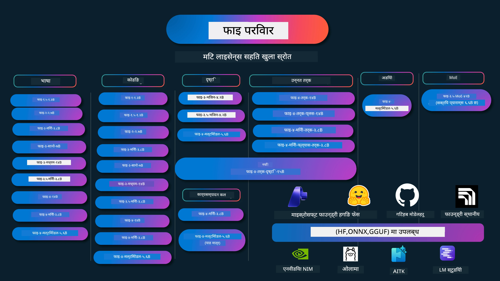

# Phi कुकबुक: Microsoft का Phi मोडेलहरूसँग हातेमालो गर्ने उदाहरणहरू

[](https://codespaces.new/microsoft/phicookbook)
[](https://vscode.dev/redirect?url=vscode://ms-vscode-remote.remote-containers/cloneInVolume?url=https://github.com/microsoft/phicookbook)

[](https://GitHub.com/microsoft/phicookbook/graphs/contributors/?WT.mc_id=aiml-137032-kinfeylo)
[](https://GitHub.com/microsoft/phicookbook/issues/?WT.mc_id=aiml-137032-kinfeylo)
[](https://GitHub.com/microsoft/phicookbook/pulls/?WT.mc_id=aiml-137032-kinfeylo)
[](http://makeapullrequest.com?WT.mc_id=aiml-137032-kinfeylo)

[](https://GitHub.com/microsoft/phicookbook/watchers/?WT.mc_id=aiml-137032-kinfeylo)
[](https://GitHub.com/microsoft/phicookbook/network/?WT.mc_id=aiml-137032-kinfeylo)
[](https://GitHub.com/microsoft/phicookbook/stargazers/?WT.mc_id=aiml-137032-kinfeylo)

[](https://discord.com/invite/ByRwuEEgH4)

Phi Microsoft द्वारा विकास गरिएको एक शृङ्खला खुला स्रोत AI मोडेलहरू हो।

Phi हालसम्म सबैभन्दा शक्तिशाली र लागत-प्रभावी सानो भाषा मोडेल (SLM) हो, जसले बहुभाषिक, तर्क, पाठ/च्याट उत्पादन, कोडिङ, छवि, अडियो र अन्य परिदृश्यहरूमा अत्यन्त राम्रो बेंचमार्कहरू प्रदर्शन गर्छ।

तपाईं Phi लाई क्लाउडमा वा एज उपकरणहरूमा तैनाथ गर्न सक्नुहुन्छ र सीमित कम्प्युटिङ शक्ति प्रयोग गरेर सजिलैसँग उत्पादनात्मक AI अनुप्रयोगहरू निर्माण गर्न सक्नुहुन्छ।

यी स्रोतहरू प्रयोग गर्न सुरू गर्न निम्न चरणहरू पालना गर्नुहोस्:
1. **रिपोजिटरी फोर्क गर्नुहोस्**: क्लिक गर्नुहोस् [](https://GitHub.com/microsoft/phicookbook/network/?WT.mc_id=aiml-137032-kinfeylo)
2. **रिपोजिटरी क्लोन गर्नुहोस्**: `git clone https://github.com/microsoft/PhiCookBook.git`
3. [**Microsoft AI Discord समुदायमा सहभागी हुनुहोस् र विशेषज्ञ र साथी विकासकर्ताहरूसँग भेट्नुहोस्**](https://discord.com/invite/ByRwuEEgH4?WT.mc_id=aiml-137032-kinfeylo)



### 🌐 बहुभाषिक समर्थन

#### GitHub Action मार्फत समर्थन गरिएको (स्वचालित र सधैं अद्यावधिक)

<!-- CO-OP TRANSLATOR LANGUAGES TABLE START -->
[अरबी](../ar/README.md) | [बङ्गाली](../bn/README.md) | [बल्गेरियन](../bg/README.md) | [बर्मीस (म्यानमार)](../my/README.md) | [चिनी (सरलीकृत)](../zh-CN/README.md) | [चिनी (परम्परागत, हङकङ)](../zh-HK/README.md) | [चिनी (परम्परागत, मकाऊ)](../zh-MO/README.md) | [चिनी (परम्परागत, ताइवान)](../zh-TW/README.md) | [क्रोएशियन](../hr/README.md) | [चेक](../cs/README.md) | [डेनिश](../da/README.md) | [डच](../nl/README.md) | [एस्टोनियन](../et/README.md) | [फिनिश](../fi/README.md) | [फ्रेन्च](../fr/README.md) | [जर्मन](../de/README.md) | [ग्रीक](../el/README.md) | [हिब्रू](../he/README.md) | [हिन्दी](../hi/README.md) | [हंगेरीअन](../hu/README.md) | [इन्डोनेशियाली](../id/README.md) | [इटालियन](../it/README.md) | [जापानी](../ja/README.md) | [कन्नड](../kn/README.md) | [खमेर](../km/README.md) | [कोरियन](../ko/README.md) | [लिथुआनियन](../lt/README.md) | [मलाय](../ms/README.md) | [मलयालम](../ml/README.md) | [मराठी](../mr/README.md) | [नेपाली](./README.md) | [नाइजेरियन पिड्गिन](../pcm/README.md) | [नोर्वेजियन](../no/README.md) | [फारसी (पर्सियन)](../fa/README.md) | [पोलिश](../pl/README.md) | [पोर्चुगाली (ब्राजील)](../pt-BR/README.md) | [पोर्चुगाली (पोर्चुगल)](../pt-PT/README.md) | [पंजाबी (गुरमुखी)](../pa/README.md) | [रोमानियन](../ro/README.md) | [रूसी](../ru/README.md) | [सर्बियन (सिरिलिक)](../sr/README.md) | [स्लोभाक](../sk/README.md) | [स्लोभेनियाली](../sl/README.md) | [स्पेनी](../es/README.md) | [स्वाहिली](../sw/README.md) | [स्वीडिश](../sv/README.md) | [ट्यागालग (फिलिपिनो)](../tl/README.md) | [तमिल](../ta/README.md) | [तेलुगु](../te/README.md) | [थाई](../th/README.md) | [तुर्किश](../tr/README.md) | [युक्रेनी](../uk/README.md) | [उर्दू](../ur/README.md) | [भियतनामी](../vi/README.md)

> **स्थानीय रूपमा क्लोन गर्न प्राथमिकता दिनुहुन्छ?**
>
> यो रिपोजिटरीमा ५० भन्दा बढी भाषा अनुवादहरू समावेश छन् जसले डाउनलोड आकारलाई उल्लेखनीय रूपमा बढाउँछ। अनुवादहरू बिना क्लोन गर्नको लागि, sparse checkout प्रयोग गर्नुहोस्:
>
> **Bash / macOS / Linux:**
> ```bash
> git clone --filter=blob:none --sparse https://github.com/microsoft/PhiCookBook.git
> cd PhiCookBook
> git sparse-checkout set --no-cone '/*' '!translations' '!translated_images'
> ```
>
> **CMD (Windows):**
> ```cmd
> git clone --filter=blob:none --sparse https://github.com/microsoft/PhiCookBook.git
> cd PhiCookBook
> git sparse-checkout set --no-cone "/*" "!translations" "!translated_images"
> ```
>
> यसले तपाईंलाई कोर्स पूरा गर्न आवश्यक सबै कुरा धेरै छिटो डाउनलोडको साथ प्रदान गर्दछ।
<!-- CO-OP TRANSLATOR LANGUAGES TABLE END -->

## विषय सूची

- परिचय
  - [Phi परिवारमा स्वागत](./md/01.Introduction/01/01.PhiFamily.md)
  - [तपाईंको वातावरण सेटअप गर्ने](./md/01.Introduction/01/01.EnvironmentSetup.md)
  - [प्रमुख प्रविधिहरूको बुझाइ](./md/01.Introduction/01/01.Understandingtech.md)
  - [Phi मोडेलहरूको AI सुरक्षा](./md/01.Introduction/01/01.AISafety.md)
  - [Phi हार्डवेयर समर्थन](./md/01.Introduction/01/01.Hardwaresupport.md)
  - [Phi मोडेलहरू र प्लेटफर्महरूमा उपलब्धता](./md/01.Introduction/01/01.Edgeandcloud.md)
  - [Guidance-ai र Phi को प्रयोग](./md/01.Introduction/01/01.Guidance.md)
  - [GitHub मार्केटप्लेस मोडेलहरू](https://github.com/marketplace/models)
  - [Azure AI मोडेल क्याटलक](https://ai.azure.com)

- विभिन्न वातावरणमा Phi को इन्फरेन्स
    -  [Hugging face](./md/01.Introduction/02/01.HF.md)
    -  [GitHub मोडेलहरू](./md/01.Introduction/02/02.GitHubModel.md)
    -  [Microsoft Foundry मोडेल क्याटलक](./md/01.Introduction/02/03.AzureAIFoundry.md)
    -  [Ollama](./md/01.Introduction/02/04.Ollama.md)
    -  [AI Toolkit VSCode (AITK)](./md/01.Introduction/02/05.AITK.md)
    -  [NVIDIA NIM](./md/01.Introduction/02/06.NVIDIA.md)
    -  [Foundry Local](./md/01.Introduction/02/07.FoundryLocal.md)

- Phi परिवारको इन्फरेन्स
    - [iOS मा Phi को इन्फरेन्स](./md/01.Introduction/03/iOS_Inference.md)
    - [Android मा Phi को इन्फरेन्स](./md/01.Introduction/03/Android_Inference.md)
    - [Jetson मा Phi को इन्फरेन्स](./md/01.Introduction/03/Jetson_Inference.md)
    - [AI PC मा Phi को इन्फरेन्स](./md/01.Introduction/03/AIPC_Inference.md)
    - [Apple MLX फ्रेमवर्कसँग Phi को इन्फरेन्स](./md/01.Introduction/03/MLX_Inference.md)
    - [स्थानीय सर्भरमा Phi को इन्फरेन्स](./md/01.Introduction/03/Local_Server_Inference.md)
    - [AI Toolkit प्रयोग गरी रिमोट सर्भरमा Phi को इन्फरेन्स](./md/01.Introduction/03/Remote_Interence.md)
    - [Rust सँग Phi को इन्फरेन्स](./md/01.Introduction/03/Rust_Inference.md)
    - [स्थानीयमा Phi—Vision को इन्फरेन्स](./md/01.Introduction/03/Vision_Inference.md)
    - [Kaito AKS, Azure Containers (आधिकारिक समर्थन) सँग Phi को इन्फरेन्स](./md/01.Introduction/03/Kaito_Inference.md)
-  [Phi परिवारको मात्राकरण](./md/01.Introduction/04/QuantifyingPhi.md)
    - [llama.cpp प्रयोग गरी Phi-3.5 / 4 मात्राकरण](./md/01.Introduction/04/UsingLlamacppQuantifyingPhi.md)
    - [onnxruntime का लागि जेनेरेटिभ AI विस्तारहरू प्रयोग गरी Phi-3.5 / 4 मात्राकरण](./md/01.Introduction/04/UsingORTGenAIQuantifyingPhi.md)
    - [Intel OpenVINO प्रयोग गरी Phi-3.5 / 4 मात्राकरण](./md/01.Introduction/04/UsingIntelOpenVINOQuantifyingPhi.md)
    - [Apple MLX फ्रेमवर्क प्रयोग गरी Phi-3.5 / 4 मात्राकरण](./md/01.Introduction/04/UsingAppleMLXQuantifyingPhi.md)

-  Phi को मूल्याङ्कन
    - [जिम्मेवार AI](./md/01.Introduction/05/ResponsibleAI.md)
    - [मूल्याङ्कनका लागि Microsoft Foundry](./md/01.Introduction/05/AIFoundry.md)
    - [Promptflow प्रयोग गरी मूल्याङ्कन](./md/01.Introduction/05/Promptflow.md)
 
- Azure AI Search सँग RAG
    - [Phi-4-mini र Phi-4-multimodal (RAG) लाई Azure AI Search सँग कसरी प्रयोग गर्ने](https://github.com/microsoft/PhiCookBook/blob/main/code/06.E2E/E2E_Phi-4-RAG-Azure-AI-Search.ipynb)

- Phi अनुप्रयोग विकास नमूना
  - पाठ र च्याट अनुप्रयोगहरू
    - Phi-4 नमूना
      - [📓] [Phi-4-mini ONNX मोडेलसँग च्याट गर्नुहोस्](./md/02.Application/01.TextAndChat/Phi4/ChatWithPhi4ONNX/README.md)
      - [Phi-4 स्थानीय ONNX मोडेल .NET सँग च्याट गर्नुहोस्](../../md/04.HOL/dotnet/src/LabsPhi4-Chat-01OnnxRuntime)
      - [Semantic Kernel प्रयोग गरी Phi-4 ONNX सँग .NET कन्सोल एप्लिकेसनमा च्याट](../../md/04.HOL/dotnet/src/LabsPhi4-Chat-02SK)
    - Phi-3 / 3.5 नमूना
      - [ब्राउजरमा Phi3, ONNX Runtime Web र WebGPU प्रयोग गरी स्थानीय च्याटबोट](https://github.com/microsoft/onnxruntime-inference-examples/tree/main/js/chat)
      - [OpenVino च्याट](./md/02.Application/01.TextAndChat/Phi3/E2E_OpenVino_Chat.md)
      - [बहु मोडेल - अन्तरक्रियात्मक Phi-3-mini र OpenAI व्हिस्पर](./md/02.Application/01.TextAndChat/Phi3/E2E_Phi-3-mini_with_whisper.md)
      - [MLFlow - र्यापर निर्माण र Phi-3 लाई MLFlow सँग प्रयोग गर्ने](./md//02.Application/01.TextAndChat/Phi3/E2E_Phi-3-MLflow.md)
      - [मोडेल अनुकूलन - Olive सँग ONNX Runtime वेबका लागि Phi-3-min मोडेल कसरी अनुकूल गर्ने](https://github.com/microsoft/Olive/tree/main/examples/phi3)
      - [Phi-3 mini-4k-instruct-onnx सहित WinUI3 ऐप](https://github.com/microsoft/Phi3-Chat-WinUI3-Sample/)
      -[WinUI3 बहु मोडेल एआई पावर्ड नोट्स ऐप नमूना](https://github.com/microsoft/ai-powered-notes-winui3-sample)
      - [अनुकूलन र एकीकृत गर्नुहोस् अनुकूलित Phi-3 मोडेलहरू Prompt flow सँग](./md/02.Application/01.TextAndChat/Phi3/E2E_Phi-3-FineTuning_PromptFlow_Integration.md)
      - [माइक्रोसफ्ट फाउन्ड्रीमा Prompt flow सँग अनुकूलित Phi-3 मोडेलहरू अनुकूलन र एकीकृत गर्नुहोस्](./md/02.Application/01.TextAndChat/Phi3/E2E_Phi-3-FineTuning_PromptFlow_Integration_AIFoundry.md)
      - [माइक्रोसफ्टको जिम्मेवार एआई सिद्धान्तहरूमा केन्द्रित माइक्रोसफ्ट फाउन्ड्रीमा अनुकूलित Phi-3 / Phi-3.5 मोडेलको मुल्याङ्कन गर्नुहोस्](./md/02.Application/01.TextAndChat/Phi3/E2E_Phi-3-Evaluation_AIFoundry.md)
      - [📓] [Phi-3.5-mini-instruct भाषा भविष्यवाणी नमूना (चिनी/अंग्रेजी)](./md/02.Application/01.TextAndChat/Phi3/phi3-instruct-demo.ipynb)
      - [Phi-3.5-Instruct WebGPU RAG च्याटबोट](./md/02.Application/01.TextAndChat/Phi3/WebGPUWithPhi35Readme.md)
      - [विन्डोज GPU प्रयोग गरेर Phi-3.5-Instruct ONNX सँग Prompt flow समाधान सिर्जना गर्ने](./md/02.Application/01.TextAndChat/Phi3/UsingPromptFlowWithONNX.md)
      - [माइक्रोसफ्ट Phi-3.5 tflite प्रयोग गरेर एन्ड्रोइड ऐप सिर्जना गर्ने](./md/02.Application/01.TextAndChat/Phi3/UsingPhi35TFLiteCreateAndroidApp.md)
      - [Q&A .NET उदाहरण स्थानीय ONNX Phi-3 मोडेल उपयोग गरेर Microsoft.ML.OnnxRuntime सँग](../../md/04.HOL/dotnet/src/LabsPhi301)
      - [Semantic Kernel र Phi-3 सँग कन्सोल च्याट .NET ऐप](../../md/04.HOL/dotnet/src/LabsPhi302)

  - Azure AI Inference SDK कोड आधारित नमूनाहरू
    - Phi-4 नमूनाहरू
      - [📓] [Phi-4-multimodal प्रयोग गरी परियोजना कोड उत्पादन गर्ने](./md/02.Application/02.Code/Phi4/GenProjectCode/README.md)
    - Phi-3 / 3.5 नमूनाहरू
      - [Microsoft Phi-3 परिवारको साथ आफ्नो Visual Studio Code GitHub Copilot Chat निर्माण गर्नुहोस्](./md/02.Application/02.Code/Phi3/VSCodeExt/README.md)
      - [GitHub मोडेलहरूसँग Phi-3.5 प्रयोग गरेर Visual Studio Code च्याट कोपिलट एजेन्ट सिर्जना गर्ने](/md/02.Application/02.Code/Phi3/CreateVSCodeChatAgentWithGitHubModels.md)

  - उन्नत निर्णय नमूनाहरू
    - Phi-4 नमूनाहरू
      - [📓] [Phi-4-mini-reasoning वा Phi-4-reasoning नमूनाहरू](./md/02.Application/03.AdvancedReasoning/Phi4/AdvancedResoningPhi4mini/README.md)
      - [📓] [Microsoft Olive सँग Phi-4-mini-reasoning अनुकूलन](./md/02.Application/03.AdvancedReasoning/Phi4/AdvancedResoningPhi4mini/olive_ft_phi_4_reasoning_with_medicaldata.ipynb)
      - [📓] [Apple MLX सँग Phi-4-mini-reasoning अनुकूलन](./md/02.Application/03.AdvancedReasoning/Phi4/AdvancedResoningPhi4mini/mlx_ft_phi_4_reasoning_with_medicaldata.ipynb)
      - [📓] [GitHub मोडेलहरूसँग Phi-4-mini-reasoning](./md/02.Application/02.Code/Phi4r/github_models_inference.ipynb)
      - [📓] [Microsoft फाउन्ड्री मोडेलहरूसँग Phi-4-mini-reasoning](./md/02.Application/02.Code/Phi4r/azure_models_inference.ipynb)
  - डेमोहरू
      - [Hugging Face Spaces मा होस्ट गरिएको Phi-4-mini डेमोहरू](https://huggingface.co/spaces/microsoft/phi-4-mini?WT.mc_id=aiml-137032-kinfeylo)
      - [Hugging Face Spaces मा होस्ट गरिएको Phi-4-multimodal डेमोहरू](https://huggingface.co/spaces/microsoft/phi-4-multimodal?WT.mc_id=aiml-137032-kinfeylo)
  - भिजन नमूनाहरू
    - Phi-4 नमूनाहरू
      - [📓] [Phi-4-multimodal प्रयोग गरी छविहरू पढ्ने र कोड उत्पादन गर्ने](./md/02.Application/04.Vision/Phi4/CreateFrontend/README.md)
    - Phi-3 / 3.5 नमूनाहरू
      -  [📓][Phi-3-vision-छवि टेक्स्टबाट टेक्स्टमा](./md/02.Application/04.Vision/Phi3/E2E_Phi-3-vision-image-text-to-text-online-endpoint.ipynb)
      - [Phi-3-vision-ONNX](https://onnxruntime.ai/docs/genai/tutorials/phi3-v.html)
      - [📓][Phi-3-vision CLIP एम्बेडिङ](./md/02.Application/04.Vision/Phi3/E2E_Phi-3-vision-image-text-to-text-online-endpoint.ipynb)
      - [डेमो: Phi-3 रिसाइकलिङ](https://github.com/jennifermarsman/PhiRecycling/)
      - [Phi-3-vision - भिजुअल भाषा सहायक - Phi3-Vision र OpenVINO सँग](https://docs.openvino.ai/nightly/notebooks/phi-3-vision-with-output.html)
      - [Phi-3 Vision Nvidia NIM](./md/02.Application/04.Vision/Phi3/E2E_Nvidia_NIM_Vision.md)
      - [Phi-3 Vision OpenVino](./md/02.Application/04.Vision/Phi3/E2E_OpenVino_Phi3Vision.md)
      - [📓][Phi-3.5 Vision बहु-फ्रेम वा बहु-छवि नमूना](./md/02.Application/04.Vision/Phi3/phi3-vision-demo.ipynb)
      - [Microsoft.ML.OnnxRuntime .NET प्रयोग गरी Phi-3 Vision स्थानीय ONNX मोडेल](../../md/04.HOL/dotnet/src/LabsPhi303)
      - [मेनु आधारित Phi-3 Vision स्थानीय ONNX मोडेल Microsoft.ML.OnnxRuntime .NET प्रयोग गरी](../../md/04.HOL/dotnet/src/LabsPhi304)

  - निर्णय-भिजन नमूनाहरू
    - Phi-4-Reasoning-Vision-15B
      - [📓] [Jaywalking पत्ता लगाउन Phi-4-Reasoning-Vision-15B प्रयोग गर्दै](./md/02.Application/10.ReasoningVision/Phi_4_reasoning_vision_15b_Jaywalking.ipynb)
      - [📓] [गणितका लागि Phi-4-Reasoning-Vision-15B प्रयोग गर्दै](./md/02.Application/10.ReasoningVision/Phi_4_reasoning_vision_15b_Math.ipynb)
      - [📓] [UI पत्ता लगाउन Phi-4-Reasoning-Vision-15B प्रयोग गर्दै](./md/02.Application/10.ReasoningVision/Phi_4_reasoning_vision_15b_ui.ipynb)

  - गणित नमूनाहरू
    - Phi-4-Mini-Flash-Reasoning-Instruct नमूनाहरू [Phi-4-Mini-Flash-Reasoning-Instruct सहित गणित डेमो](./md/02.Application/09.Math/MathDemo.ipynb)

  - अडियो नमूनाहरू
    - Phi-4 नमूनाहरू
      - [📓] [Phi-4-multimodal प्रयोग गरी अडियो ट्रान्सक्रिप्ट निकाल्ने](./md/02.Application/05.Audio/Phi4/Transciption/README.md)
      - [📓] [Phi-4-multimodal अडियो नमूना](./md/02.Application/05.Audio/Phi4/Siri/demo.ipynb)
      - [📓] [Phi-4-multimodal भाषण अनुवाद नमूना](./md/02.Application/05.Audio/Phi4/Translate/demo.ipynb)
      - [.NET कन्सोल अनुप्रयोग Phi-4-multimodal अडियो प्रयोग गरेर अडियो फाइल विश्लेषण र ट्रान्सक्रिप्ट उत्पादन गर्न](../../md/04.HOL/dotnet/src/LabsPhi4-MultiModal-02Audio)

  - MOE नमूनाहरू
    - Phi-3 / 3.5 नमूनाहरू
      - [📓] [Phi-3.5 विशेषज्ञहरूको मिश्रण (MoEs) सामाजिक मिडिया नमूना](./md/02.Application/06.MoE/Phi3/phi3_moe_demo.ipynb)
      - [📓] [NVIDIA NIM Phi-3 MOE, Azure AI Search, र LlamaIndex सँग RAG पाइपलाइन निर्माण](./md/02.Application/06.MoE/Phi3/azure-ai-search-nvidia-rag.ipynb)
      - 
  - फंक्शन कलिङ नमूनाहरू
    - Phi-4 नमूनाहरू 🆕
      - [📓] [Phi-4-mini सँग फंक्शन कलिङ प्रयोग गर्दै](./md/02.Application/07.FunctionCalling/Phi4/FunctionCallingBasic/README.md)
      - [📓] [Phi-4-mini सँग मल्टि-एजेन्टहरूको सिर्जनाका लागि फंक्शन कलिङ प्रयोग गर्दै](./md/02.Application/07.FunctionCalling/Phi4/Multiagents/Phi_4_mini_multiagent.ipynb)
      - [📓] [Ollama सँग फंक्शन कलिङ प्रयोग गर्दै](./md/02.Application/07.FunctionCalling/Phi4/Ollama/ollama_functioncalling.ipynb)
      - [📓] [ONNX सँग फंक्शन कलिङ प्रयोग गर्दै](./md/02.Application/07.FunctionCalling/Phi4/ONNX/onnx_parallel_functioncalling.ipynb)
  - बहु-मोडल मिसिंग नमूनाहरू
    - Phi-4 नमूनाहरू 🆕
      - [📓] [प्रविधि पत्रकारको रूपमा Phi-4-multimodal प्रयोग गर्दै](./md/02.Application/08.Multimodel/Phi4/TechJournalist/phi_4_mm_audio_text_publish_news.ipynb)
      - [.NET कन्सोल अनुप्रयोग Phi-4-multimodal प्रयोग गरी छविहरू विश्लेषण गर्न](../../md/04.HOL/dotnet/src/LabsPhi4-MultiModal-01Images)

- Phi अनुकूलन नमूनाहरू
  - [अनुकूलन परिदृश्यहरू](./md/03.FineTuning/FineTuning_Scenarios.md)
  - [अनुकूलन विरुद्ध RAG](./md/03.FineTuning/FineTuning_vs_RAG.md)
  - [Phi-3 लाई उद्योग विशेषज्ञ बन्न दिनुहोस्](./md/03.FineTuning/LetPhi3gotoIndustriy.md)
  - [AI Toolkit for VS Code सँग Phi-3 अनुकूलन](./md/03.FineTuning/Finetuning_VSCodeaitoolkit.md)
  - [Azure Machine Learning सेवा सँग Phi-3 अनुकूलन](./md/03.FineTuning/Introduce_AzureML.md)
  - [Lora सँग Phi-3 अनुकूलन](./md/03.FineTuning/FineTuning_Lora.md)
  - [QLora सँग Phi-3 अनुकूलन](./md/03.FineTuning/FineTuning_Qlora.md)
  - [Microsoft Foundry सँग Phi-3 अनुकूलन](./md/03.FineTuning/FineTuning_AIFoundry.md)
  - [Azure ML CLI/SDK सँग Phi-3 अनुकूलन](./md/03.FineTuning/FineTuning_MLSDK.md)
  - [Microsoft Olive सँग अनुकूलन](./md/03.FineTuning/FineTuning_MicrosoftOlive.md)
  - [Microsoft Olive Hands-On Lab सँग अनुकूलन](./md/03.FineTuning/olive-lab/readme.md)
  - [Weights and Bias सँग Phi-3-vision अनुकूलन](./md/03.FineTuning/FineTuning_Phi-3-visionWandB.md)
  - [Apple MLX Framework सँग Phi-3 अनुकूलन](./md/03.FineTuning/FineTuning_MLX.md)
  - [Phi-3-vision अनुकूलन (आधिकारिक समर्थन)](./md/03.FineTuning/FineTuning_Vision.md)
  - [काइटो AKS सहित Phi-3 लाई फाइन-ट्यूनिङ, एजुर कन्टेनरहरू (आधिकारिक समर्थन)](./md/03.FineTuning/FineTuning_Kaito.md)
  - [Phi-3 र 3.5 भिजनलाई फाइन-ट्यूनिङ](https://github.com/2U1/Phi3-Vision-Finetune)

- प्रायोगात्मक प्रयोगशाला
  - [अत्याधुनिक मोडेलहरू अन्वेषण: LLMs, SLMs, स्थानीय विकास र थप](https://github.com/microsoft/aitour-exploring-cutting-edge-models)
  - [NLP को सम्भावना उद्घाटन: Microsoft Olive सँग फाइन-ट्यूनिङ](https://github.com/azure/Ignite_FineTuning_workshop)

- शैक्षिक अनुसन्धान पत्रपत्रिकाहरू र प्रकाशनहरू
  - [पाठ्यपुस्तकहरू नै तपाईंलाई चाहिन्छ II: phi-1.5 प्राविधिक प्रतिवेदन](https://arxiv.org/abs/2309.05463)
  - [Phi-3 प्राविधिक प्रतिवेदन: तपाईंको फोनमा स्थानीय रूपमा अत्यन्त सक्षम भाषा मोडेल](https://arxiv.org/abs/2404.14219)
  - [Phi-4 प्राविधिक प्रतिवेदन](https://arxiv.org/abs/2412.08905)
  - [Phi-4-Mini प्राविधिक प्रतिवेदन: मिश्रण-ऑफ-लोरा मार्फत सङ्कुचित तर शक्तिशाली बहुमाध्यमी भाषा मोडेलहरू](https://arxiv.org/abs/2503.01743)
  - [सवारीमा फङ्शन-कलिङका लागि साना भाषा मोडेलहरू अनुकूलन गर्दै](https://arxiv.org/abs/2501.02342)
  - [(WhyPHI) बहु-चयन प्रश्न उत्तरको लागि PHI-3 फाइन-ट्यूनिङ: कार्यप्रणाली, परिणाम र चुनौतीहरू](https://arxiv.org/abs/2501.01588)
  - [Phi-4-तर्क प्राविधिक प्रतिवेदन](https://www.microsoft.com/en-us/research/wp-content/uploads/2025/04/phi_4_reasoning.pdf)
  - [Phi-4-मिनी-तर्क प्राविधिक प्रतिवेदन](https://huggingface.co/microsoft/Phi-4-mini-reasoning/blob/main/Phi-4-Mini-Reasoning.pdf)

## Phi मोडेलहरू प्रयोग

### Microsoft Foundry मा Phi

तपाईं Microsoft Phi कसरी प्रयोग गर्ने र विभिन्न हार्डवेयर उपकरणहरूमा E2E समाधानहरू कसरी निर्माण गर्ने सिक्न सक्नुहुन्छ। Phi आफैं अनुभव गर्न, मोडेलहरू सँग खेल्न सुरु गर्नुहोस् र तपाईंका परिदृश्यहरूको लागि Phi अनुकूलन गर्नुहोस् [Microsoft Foundry Azure AI Model Catalog](https://aka.ms/phi3-azure-ai) मार्फत। तपाईं [Microsoft Foundry](/md/02.QuickStart/AzureAIFoundry_QuickStart.md) मा Getting Started मा थप जान्न सक्नुहुन्छ।

**प्लेटग्राउन्ड**  
प्रत्येक मोडेलसँग मोडेल परीक्षण गर्न समर्पित प्लेटग्राउन्ड हुन्छ [Azure AI Playground](https://aka.ms/try-phi3) मा।

### GitHub मोडेलहरूमा Phi

तपाईं Microsoft Phi कसरी प्रयोग गर्ने र विभिन्न हार्डवेयर उपकरणहरूमा E2E समाधानहरू कसरी निर्माण गर्ने सिक्न सक्नुहुन्छ। Phi आफैं अनुभव गर्न, मोडेलसँग खेल्न सुरु गर्नुहोस् र तपाईंका परिदृश्यहरूको लागि Phi अनुकूलन गर्नुहोस् [GitHub Model Catalog](https://github.com/marketplace/models?WT.mc_id=aiml-137032-kinfeylo) मार्फत। तपाईं [GitHub Model Catalog](/md/02.QuickStart/GitHubModel_QuickStart.md) मा Getting Started मा थप जान्न सक्नुहुन्छ।

**प्लेटग्राउन्ड**  
प्रत्येक मोडेलसँग समर्पित [प्लेटग्राउन्ड छ मोडेल परीक्षणको लागि](/md/02.QuickStart/GitHubModel_QuickStart.md)।

### Hugging Face मा Phi

तपाईं मोडेल [Hugging Face](https://huggingface.co/microsoft) मा पनि फेला पार्न सक्नुहुन्छ।

**प्लेटग्राउन्ड**  
[Hugging Chat प्लेटग्राउन्ड](https://huggingface.co/chat/models/microsoft/Phi-3-mini-4k-instruct)

 ## 🎒 अन्य पाठ्यक्रमहरू

हाम्रो टोलीले अन्य पाठ्यक्रमहरू उत्पादित गर्दछ! जाँच गर्नुहोस्:

<!-- CO-OP TRANSLATOR OTHER COURSES START -->
### LangChain  
[](https://aka.ms/langchain4j-for-beginners)  
[](https://aka.ms/langchainjs-for-beginners?WT.mc_id=m365-94501-dwahlin)  
[](https://github.com/microsoft/langchain-for-beginners?WT.mc_id=m365-94501-dwahlin)  
---

### Azure / Edge / MCP / Agents  
[](https://github.com/microsoft/AZD-for-beginners?WT.mc_id=academic-105485-koreyst)  
[](https://github.com/microsoft/edgeai-for-beginners?WT.mc_id=academic-105485-koreyst)  
[](https://github.com/microsoft/mcp-for-beginners?WT.mc_id=academic-105485-koreyst)  
[](https://github.com/microsoft/ai-agents-for-beginners?WT.mc_id=academic-105485-koreyst)  

---
 
### जनरेटिभ AI शृंखला  
[](https://github.com/microsoft/generative-ai-for-beginners?WT.mc_id=academic-105485-koreyst)  
[-9333EA?style=for-the-badge&labelColor=E5E7EB&color=9333EA)](https://github.com/microsoft/Generative-AI-for-beginners-dotnet?WT.mc_id=academic-105485-koreyst)  
[-C084FC?style=for-the-badge&labelColor=E5E7EB&color=C084FC)](https://github.com/microsoft/generative-ai-for-beginners-java?WT.mc_id=academic-105485-koreyst)  
[-E879F9?style=for-the-badge&labelColor=E5E7EB&color=E879F9)](https://github.com/microsoft/generative-ai-with-javascript?WT.mc_id=academic-105485-koreyst)  

---
 
### कोर सिकाइ  
[](https://aka.ms/ml-beginners?WT.mc_id=academic-105485-koreyst)  
[](https://aka.ms/datascience-beginners?WT.mc_id=academic-105485-koreyst)  
[](https://aka.ms/ai-beginners?WT.mc_id=academic-105485-koreyst)  
[](https://github.com/microsoft/Security-101?WT.mc_id=academic-96948-sayoung)  
[](https://aka.ms/webdev-beginners?WT.mc_id=academic-105485-koreyst)  
[](https://aka.ms/iot-beginners?WT.mc_id=academic-105485-koreyst)  
[](https://github.com/microsoft/xr-development-for-beginners?WT.mc_id=academic-105485-koreyst)  

---
 
### Copilot शृंखला  
[](https://aka.ms/GitHubCopilotAI?WT.mc_id=academic-105485-koreyst)  
[](https://github.com/microsoft/mastering-github-copilot-for-dotnet-csharp-developers?WT.mc_id=academic-105485-koreyst)  
[](https://github.com/microsoft/CopilotAdventures?WT.mc_id=academic-105485-koreyst)  
<!-- CO-OP TRANSLATOR OTHER COURSES END -->

## जिम्मेवार AI

Microsoft ले हाम्रो ग्राहकहरूलाई AI उत्पादनहरू जिम्मेवार तरिकाले प्रयोग गर्न मद्दत गर्न प्रतिबद्ध छ, हाम्रो सिकाइहरू साझा गर्दै, र पारदर्शिता नोट्स तथा प्रभाव मूल्याङ्कन जस्ता उपकरणहरू मार्फत विश्वासमा आधारित साझेदारीहरू निर्माण गर्दै। यी मध्ये धेरै स्रोतहरू [https://aka.ms/RAI](https://aka.ms/RAI) मा भेट्न सकिन्छ।  
Microsoft को जिम्मेवार AI दृष्टिकोण हाम्रो AI सिद्धान्तहरूमा आधारित छ: निष्पक्षता, विश्वसनीयता र सुरक्षा, गोपनीयता र सुरक्षा, समावेशिता, पारदर्शिता, र जवाफदेहिता।

यो नमुना मा प्रयोग गरिएका ठूला आकारका प्राकृतिक भाषा, छवि, र भाषण मोडेलहरू संभावित रूपमा अनुचित, अविश्वसनीय, वा अपमानजनक तरिकाले व्यवहार गर्न सक्छन्, जसले नोक्सान पुर्याउन सक्छ। कृपया जोखिमहरू र सीमाहरूबारे जानकारी पाउन [Azure OpenAI सेवा पारदर्शिता नोट](https://learn.microsoft.com/legal/cognitive-services/openai/transparency-note?tabs=text) हेर्नुहोस्।
यी जोखिमहरूलाई कम गर्ने सिफारिस गरिएका तरिका भनेको तपाइँको वास्तुकलामा एउटा सुरक्षा प्रणाली समावेश गर्नु हो जसले हानिकारक व्यवहार पत्ता लगाउन र रोक्न सक्षम हुन्छ। [Azure AI Content Safety](https://learn.microsoft.com/azure/ai-services/content-safety/overview) एक स्वतन्त्र सुरक्षा तह प्रदान गर्दछ, जसले अनुप्रयोगहरू र सेवाहरूमा हानिकारक प्रयोगकर्ता-उत्पन्न र AI-उत्पन्न सामग्री पत्ता लगाउन सक्छ। Azure AI Content Safety मा पाठ र छवि API हरू समावेश छन् जसले तपाइँलाई हानिकारक सामग्री पत्ता लगाउन अनुमति दिन्छ। Microsoft Foundry भित्र, Content Safety सेवा तपाईंलाई विभिन्न मोडालिटीहरूमा हानिकारक सामग्री पत्ता लगाउन नमूना कोडहरू हेर्न, अन्वेषण गर्न र प्रयास गर्न अनुमति दिन्छ। तलको [छिटो सुरु गर्ने कागजात](https://learn.microsoft.com/azure/ai-services/content-safety/quickstart-text?tabs=visual-studio%2Clinux&pivots=programming-language-rest) ले तपाईंलाई सेवामा अनुरोधहरू बनाउने प्रक्रिया देखाउँछ।

अर्को पक्ष विचार गर्नुपर्ने कुरा भनेको समग्र अनुप्रयोग प्रदर्शन हो। बहु-मोडाल र बहु-मोडेल अनुप्रयोगहरूसँग, हामी प्रदर्शनले अर्थ राख्छ कि प्रणालीले तपाईं र तपाईंको प्रयोगकर्ताले अपेक्षा गरेजस्तै काम गर्दछ, जसमा हानिकारक नतिजा उत्पादन नगर्नु पनि समावेश छ। तपाईंले आफ्नो समग्र अनुप्रयोगको प्रदर्शनलाई [Performance and Quality and Risk and Safety evaluators](https://learn.microsoft.com/azure/ai-studio/concepts/evaluation-metrics-built-in) को उपयोग गरी मूल्यांकन गर्नु महत्त्वपूर्ण छ। तपाईंलाई [custom evaluators](https://learn.microsoft.com/azure/ai-studio/how-to/develop/evaluate-sdk#custom-evaluators) सिर्जना गर्न र मूल्यांकन गर्न पनि क्षमता छ।

तपाईं आफ्नो विकास वातावरणमा [Azure AI Evaluation SDK](https://microsoft.github.io/promptflow/index.html) को प्रयोग गरेर आफ्नो AI अनुप्रयोग मूल्यांकन गर्न सक्नुहुन्छ। परीक्षण डेटासेट वा लक्ष्य दिइएको अवस्थामा, तपाईंको जेनेरेटिभ AI अनुप्रयोगका उत्पादनहरू built-in evaluators वा आफ्नो रोजाइका custom evaluators द्वारा मात्रात्मक रूपमा मापन गरिन्छ। Azure AI Evaluation SDK प्रयोग गरेर आफ्नो प्रणाली मूल्यांकन गर्न सुरु गर्न, तपाईं [छिटो सुरु गर्ने मार्गदर्शन](https://learn.microsoft.com/azure/ai-studio/how-to/develop/flow-evaluate-sdk) अनुसरण गर्न सक्नुहुन्छ। मूल्यांकन चलाएपछि, तपाईं [Microsoft Foundry मा परिणामहरू दृश्यात्मक रूपमा देख्न](https://learn.microsoft.com/azure/ai-studio/how-to/evaluate-flow-results) सक्नुहुन्छ।

## ट्रेडमार्कहरू

यो परियोजनामा परियोजना, उत्पादन वा सेवाहरूका लागि ट्रेडमार्क वा लोगोजहरू समावेश हुन सक्छन्। Microsoft ट्रेडमार्क वा लोगोजहरूको अनुमति प्राप्त प्रयोग [Microsoft's Trademark & Brand Guidelines](https://www.microsoft.com/legal/intellectualproperty/trademarks/usage/general) अनुसार हुनुपर्दछ र त्यसको पालना अनिवार्य छ। 

Microsoft ट्रेडमार्क वा लोगोजहरुको कुनै संशोधित संस्करणहरूमा प्रयोगले भ्रम सिर्जना गर्नु हुँदैन वा Microsoft प्रायोजन भएको अर्थ नलगाउनु पर्छ। तेस्रो-पक्ष ट्रेडमार्क वा लोगोजहरू प्रयोग गर्दा तेस्रो-पक्षको नीतिहरू लागू हुन्छन्।

## सहयोग प्राप्त गर्ने

यदि तपाईं अलमलमा परे वा AI अनुप्रयोगहरू निर्माण गर्न सम्बन्धित कुनै प्रश्न भएमा, सहभागी हुनुहोस्:

[](https://aka.ms/foundry/discord)

यदि तपाईंसँग उत्पादन प्रतिक्रिया वा निर्माण गर्दा त्रुटिहरू छन् भने भ्रमण गर्नुहोस्:

[](https://aka.ms/foundry/forum)

---

<!-- CO-OP TRANSLATOR DISCLAIMER START -->
**अस्वीकरण**:
यो दस्तावेज़ AI अनुवाद सेवा [Co-op Translator](https://github.com/Azure/co-op-translator) प्रयोग गरी अनुवाद गरिएको हो। हामी शुद्धताको लागि प्रयास गर्छौं, तर कृपया बुझ्नुहोस् कि स्वचालित अनुवादमा त्रुटिहरू वा गलतथापना हुनसक्छ। मूल दस्तावेज़लाई यसको मूल भाषामा आधिकारिक स्रोत मानिनुपर्छ। महत्वपूर्ण जानकारीका लागि, पेशेवर मानवीय अनुवाद सिफारिस गरिन्छ। यस अनुवादको प्रयोगबाट उत्पन्न हुने कुनै पनि गलत बुझाइ वा गलत व्याख्याको लागि हामी जिम्मेवार छैनौं।
<!-- CO-OP TRANSLATOR DISCLAIMER END -->