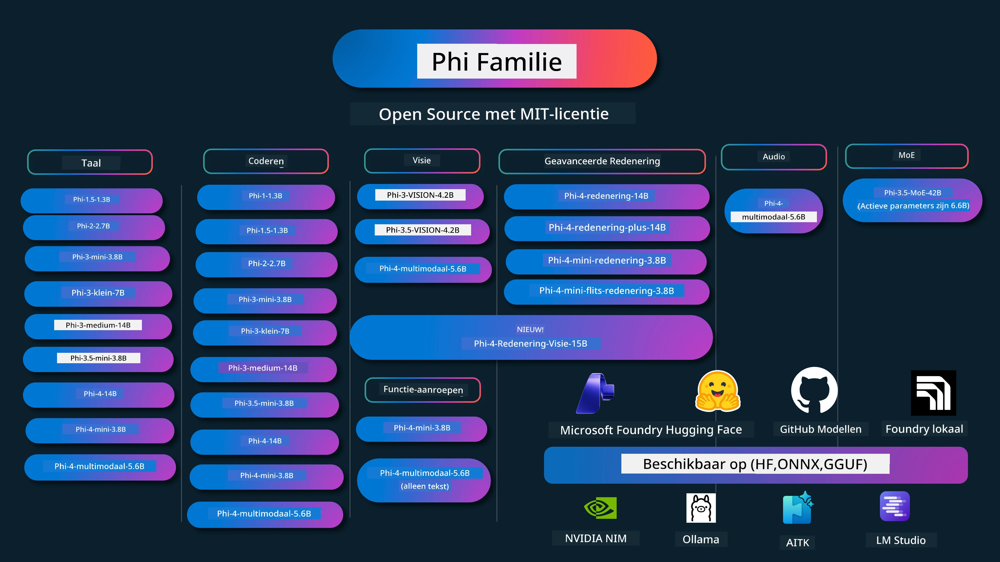

# Phi Cookbook: Praktische Voorbeelden met Microsofts Phi Modellen

[](https://codespaces.new/microsoft/phicookbook)
[](https://vscode.dev/redirect?url=vscode://ms-vscode-remote.remote-containers/cloneInVolume?url=https://github.com/microsoft/phicookbook)

[](https://GitHub.com/microsoft/phicookbook/graphs/contributors/?WT.mc_id=aiml-137032-kinfeylo)
[](https://GitHub.com/microsoft/phicookbook/issues/?WT.mc_id=aiml-137032-kinfeylo)
[](https://GitHub.com/microsoft/phicookbook/pulls/?WT.mc_id=aiml-137032-kinfeylo)
[](http://makeapullrequest.com?WT.mc_id=aiml-137032-kinfeylo)

[](https://GitHub.com/microsoft/phicookbook/watchers/?WT.mc_id=aiml-137032-kinfeylo)
[](https://GitHub.com/microsoft/phicookbook/network/?WT.mc_id=aiml-137032-kinfeylo)
[](https://GitHub.com/microsoft/phicookbook/stargazers/?WT.mc_id=aiml-137032-kinfeylo)

[](https://discord.com/invite/ByRwuEEgH4)

Phi is een serie open source AI-modellen ontwikkeld door Microsoft.

Phi is momenteel het krachtigste en meest kosteneffectieve kleine taalmodel (SLM), met zeer goede benchmarks in meerdere talen, redeneren, tekst-/chatgeneratie, codering, afbeeldingen, audio en andere scenario’s.

Je kunt Phi implementeren in de cloud of op randapparaten, en je kunt gemakkelijk generatieve AI-toepassingen bouwen met beperkte rekenkracht.

Volg deze stappen om aan de slag te gaan met deze bronnen:
1. **Fork de Repository**: Klik op [](https://GitHub.com/microsoft/phicookbook/network/?WT.mc_id=aiml-137032-kinfeylo)
2. **Clone de Repository**: `git clone https://github.com/microsoft/PhiCookBook.git`
3. [**Word lid van de Microsoft AI Discord Community en ontmoet experts en medegebruikers**](https://discord.com/invite/ByRwuEEgH4?WT.mc_id=aiml-137032-kinfeylo)



### 🌐 Meertalige Ondersteuning

#### Ondersteund via GitHub Action (Geautomatiseerd & Altijd Up-to-Date)

<!-- CO-OP TRANSLATOR LANGUAGES TABLE START -->
[Arabisch](../ar/README.md) | [Bengaals](../bn/README.md) | [Bulgaars](../bg/README.md) | [Birmaans (Myanmar)](../my/README.md) | [Chinees (Vereenvoudigd)](../zh-CN/README.md) | [Chinees (Traditioneel, Hong Kong)](../zh-HK/README.md) | [Chinees (Traditioneel, Macau)](../zh-MO/README.md) | [Chinees (Traditioneel, Taiwan)](../zh-TW/README.md) | [Kroatisch](../hr/README.md) | [Tsjechisch](../cs/README.md) | [Deens](../da/README.md) | [Nederlands](./README.md) | [Estisch](../et/README.md) | [Fins](../fi/README.md) | [Frans](../fr/README.md) | [Duits](../de/README.md) | [Grieks](../el/README.md) | [Hebreeuws](../he/README.md) | [Hindi](../hi/README.md) | [Hongaars](../hu/README.md) | [Indonesisch](../id/README.md) | [Italiaans](../it/README.md) | [Japans](../ja/README.md) | [Kannada](../kn/README.md) | [Koreaans](../ko/README.md) | [Litouws](../lt/README.md) | [Maleis](../ms/README.md) | [Malayalam](../ml/README.md) | [Marathi](../mr/README.md) | [Nepalees](../ne/README.md) | [Nigeriaans Pidgin](../pcm/README.md) | [Noors](../no/README.md) | [Perzisch (Farsi)](../fa/README.md) | [Pools](../pl/README.md) | [Portugees (Brazilië)](../pt-BR/README.md) | [Portugees (Portugal)](../pt-PT/README.md) | [Punjabi (Gurmukhi)](../pa/README.md) | [Roemeens](../ro/README.md) | [Russisch](../ru/README.md) | [Servisch (Cyrillisch)](../sr/README.md) | [Slowaaks](../sk/README.md) | [Sloveens](../sl/README.md) | [Spaans](../es/README.md) | [Swahili](../sw/README.md) | [Zweeds](../sv/README.md) | [Tagalog (Filipijns)](../tl/README.md) | [Tamil](../ta/README.md) | [Telugu](../te/README.md) | [Thai](../th/README.md) | [Turks](../tr/README.md) | [Oekraïens](../uk/README.md) | [Urdu](../ur/README.md) | [Vietnamees](../vi/README.md)

> **Liever lokaal clonen?**
>
> Deze repository bevat vertalingen in meer dan 50 talen, wat de downloadgrootte aanzienlijk vergroot. Om zonder vertalingen te clonen, gebruik je sparse checkout:
>
> **Bash / macOS / Linux:**
> ```bash
> git clone --filter=blob:none --sparse https://github.com/microsoft/PhiCookBook.git
> cd PhiCookBook
> git sparse-checkout set --no-cone '/*' '!translations' '!translated_images'
> ```
>
> **CMD (Windows):**
> ```cmd
> git clone --filter=blob:none --sparse https://github.com/microsoft/PhiCookBook.git
> cd PhiCookBook
> git sparse-checkout set --no-cone "/*" "!translations" "!translated_images"
> ```
>
> Dit geeft je alles wat je nodig hebt om de cursus te voltooien met een veel snellere download.
<!-- CO-OP TRANSLATOR LANGUAGES TABLE END -->

## Inhoudsopgave
- Introductie - [Welkom bij de Phi Familie](./md/01.Introduction/01/01.PhiFamily.md) - [Je omgeving instellen](./md/01.Introduction/01/01.EnvironmentSetup.md) - [Begrip van sleuteltechnologieën](./md/01.Introduction/01/01.Understandingtech.md) - [AI Veiligheid voor Phi Modellen](./md/01.Introduction/01/01.AISafety.md) - [Ondersteuning van Phi Hardware](./md/01.Introduction/01/01.Hardwaresupport.md) - [Phi Modellen & Beschikbaarheid op diverse platforms](./md/01.Introduction/01/01.Edgeandcloud.md) - [Gebruik van Guidance-ai en Phi](./md/01.Introduction/01/01.Guidance.md) - [GitHub Marketplace Modellen](https://github.com/marketplace/models) - [Azure AI Model Catalogus](https://ai.azure.com) - Inference Phi in verschillende omgevingen - [Hugging face](./md/01.Introduction/02/01.HF.md) - [GitHub Modellen](./md/01.Introduction/02/02.GitHubModel.md) - [Microsoft Foundry Model Catalogus](./md/01.Introduction/02/03.AzureAIFoundry.md) - [Ollama](./md/01.Introduction/02/04.Ollama.md) - [AI Toolkit VSCode (AITK)](./md/01.Introduction/02/05.AITK.md) - [NVIDIA NIM](./md/01.Introduction/02/06.NVIDIA.md) - [Foundry Lokaal](./md/01.Introduction/02/07.FoundryLocal.md) - Inference Phi Familie - [Inference Phi in iOS](./md/01.Introduction/03/iOS_Inference.md) - [Inference Phi in Android](./md/01.Introduction/03/Android_Inference.md) - [Inference Phi in Jetson](./md/01.Introduction/03/Jetson_Inference.md) - [Inference Phi in AI PC](./md/01.Introduction/03/AIPC_Inference.md) - [Inference Phi met Apple MLX Framework](./md/01.Introduction/03/MLX_Inference.md) - [Inference Phi in Lokale Server](./md/01.Introduction/03/Local_Server_Inference.md) - [Inference Phi op Afstandsserver via AI Toolkit](./md/01.Introduction/03/Remote_Interence.md) - [Inference Phi met Rust](./md/01.Introduction/03/Rust_Inference.md) - [Inference Phi--Vision lokaal](./md/01.Introduction/03/Vision_Inference.md) - [Inference Phi met Kaito AKS, Azure Containers (officiële ondersteuning)](./md/01.Introduction/03/Kaito_Inference.md) - [Quantificeren van de Phi Familie](./md/01.Introduction/04/QuantifyingPhi.md) - [Quantificeren van Phi-3.5 / 4 met llama.cpp](./md/01.Introduction/04/UsingLlamacppQuantifyingPhi.md) - [Quantificeren van Phi-3.5 / 4 met Generative AI uitbreidingen voor onnxruntime](./md/01.Introduction/04/UsingORTGenAIQuantifyingPhi.md) - [Quantificeren van Phi-3.5 / 4 met Intel OpenVINO](./md/01.Introduction/04/UsingIntelOpenVINOQuantifyingPhi.md) - [Quantificeren van Phi-3.5 / 4 met Apple MLX Framework](./md/01.Introduction/04/UsingAppleMLXQuantifyingPhi.md) - Evaluatie Phi - [Verantwoordelijke AI](./md/01.Introduction/05/ResponsibleAI.md) - [Microsoft Foundry voor Evaluatie](./md/01.Introduction/05/AIFoundry.md) - [Gebruik van Promptflow voor Evaluatie](./md/01.Introduction/05/Promptflow.md) - RAG met Azure AI Search - [Hoe Phi-4-mini en Phi-4-multimodal (RAG) te gebruiken met Azure AI Search](https://github.com/microsoft/PhiCookBook/blob/main/code/06.E2E/E2E_Phi-4-RAG-Azure-AI-Search.ipynb) - Phi applicatieontwikkelingsvoorbeelden - Tekst & Chat Applicaties - Phi-4 Voorbeelden - [📓] [Chat met Phi-4-mini ONNX Model](./md/02.Application/01.TextAndChat/Phi4/ChatWithPhi4ONNX/README.md) - [Chat met Phi-4 lokaal ONNX Model .NET](../../md/04.HOL/dotnet/src/LabsPhi4-Chat-01OnnxRuntime) - [Chat .NET Console App met Phi-4 ONNX via Semantic Kernel](../../md/04.HOL/dotnet/src/LabsPhi4-Chat-02SK) - Phi-3 / 3.5 Voorbeelden - [Lokale Chatbot in de browser met Phi3, ONNX Runtime Web en WebGPU](https://github.com/microsoft/onnxruntime-inference-examples/tree/main/js/chat) - [OpenVino Chat](./md/02.Application/01.TextAndChat/Phi3/E2E_OpenVino_Chat.md) - [Multi Model - Interactieve Phi-3-mini en OpenAI Whisper](./md/02.Application/01.TextAndChat/Phi3/E2E_Phi-3-mini_with_whisper.md) - [MLFlow - Een wrapper bouwen en Phi-3 gebruiken met MLFlow](./md//02.Application/01.TextAndChat/Phi3/E2E_Phi-3-MLflow.md) - [Modeloptimalisatie - Hoe het Phi-3-mini model te optimaliseren voor ONNX Runtime Web met Olive](https://github.com/microsoft/Olive/tree/main/examples/phi3) - [WinUI3 App met Phi-3 mini-4k-instruct-onnx](https://github.com/microsoft/Phi3-Chat-WinUI3-Sample/) - [WinUI3 Multi Model AI Powered Notes App Voorbeeld](https://github.com/microsoft/ai-powered-notes-winui3-sample) - [Fijn afstemmen en integreren van aangepaste Phi-3 modellen met Prompt flow](./md/02.Application/01.TextAndChat/Phi3/E2E_Phi-3-FineTuning_PromptFlow_Integration.md) - [Fijn afstemmen en integreren van aangepaste Phi-3 modellen met Prompt flow in Microsoft Foundry](./md/02.Application/01.TextAndChat/Phi3/E2E_Phi-3-FineTuning_PromptFlow_Integration_AIFoundry.md) - [Evaluatie van het fijn afgestemde Phi-3 / Phi-3.5 Model in Microsoft Foundry met focus op Microsoft’s principes voor Verantwoorde AI](./md/02.Application/01.TextAndChat/Phi3/E2E_Phi-3-Evaluation_AIFoundry.md) - [📓] [Phi-3.5-mini-instruct taalkundig voorspellingsvoorbeeld (Chinees/Engels)](./md/02.Application/01.TextAndChat/Phi3/phi3-instruct-demo.ipynb) - [Phi-3.5-Instruct WebGPU RAG Chatbot](./md/02.Application/01.TextAndChat/Phi3/WebGPUWithPhi35Readme.md) - [Gebruik van Windows GPU om Prompt flow oplossing te maken met Phi-3.5-Instruct ONNX](./md/02.Application/01.TextAndChat/Phi3/UsingPromptFlowWithONNX.md) - [Gebruik van Microsoft Phi-3.5 tflite om Android app te maken](./md/02.Application/01.TextAndChat/Phi3/UsingPhi35TFLiteCreateAndroidApp.md) - [Q&A .NET Voorbeeld met lokaal ONNX Phi-3 model via Microsoft.ML.OnnxRuntime](../../md/04.HOL/dotnet/src/LabsPhi301) - [Console chat .NET app met Semantic Kernel en Phi-3](../../md/04.HOL/dotnet/src/LabsPhi302) - Azure AI Inference SDK Code gebaseerde Voorbeelden - Phi-4 Voorbeelden - [📓] [Genereer projectcode met Phi-4-multimodal](./md/02.Application/02.Code/Phi4/GenProjectCode/README.md) - Phi-3 / 3.5 Voorbeelden - [Bouw je eigen Visual Studio Code GitHub Copilot Chat met Microsoft Phi-3 Familie](./md/02.Application/02.Code/Phi3/VSCodeExt/README.md) - [Maak je eigen Visual Studio Code Chat Copilot Agent met Phi-3.5 via GitHub Modellen](/md/02.Application/02.Code/Phi3/CreateVSCodeChatAgentWithGitHubModels.md) - Geavanceerde Redeneer Voorbeelden - Phi-4 Voorbeelden - [📓] [Phi-4-mini-redenering of Phi-4-redeneringsvoorbeeld](./md/02.Application/03.AdvancedReasoning/Phi4/AdvancedResoningPhi4mini/README.md) - [📓] [Fijn afstemmen van Phi-4-mini-redenering met Microsoft Olive](./md/02.Application/03.AdvancedReasoning/Phi4/AdvancedResoningPhi4mini/olive_ft_phi_4_reasoning_with_medicaldata.ipynb) - [📓] [Fijn afstemmen van Phi-4-mini-redenering met Apple MLX](./md/02.Application/03.AdvancedReasoning/Phi4/AdvancedResoningPhi4mini/mlx_ft_phi_4_reasoning_with_medicaldata.ipynb) - [📓] [Phi-4-mini-redenering met GitHub Modellen](./md/02.Application/02.Code/Phi4r/github_models_inference.ipynb) - [📓] [Phi-4-mini-redenering met Microsoft Foundry Modellen](./md/02.Application/02.Code/Phi4r/azure_models_inference.ipynb) -
Demo's - [Phi-4-mini demo's gehost op Hugging Face Spaces](https://huggingface.co/spaces/microsoft/phi-4-mini?WT.mc_id=aiml-137032-kinfeylo) - [Phi-4-multimodaal demo's gehost op Hugging Face Spaces](https://huggingface.co/spaces/microsoft/phi-4-multimodal?WT.mc_id=aiml-137032-kinfeylo) - Visie Voorbeelden - Phi-4 Voorbeelden - [📓] [Gebruik Phi-4-multimodaal om afbeeldingen te lezen en code te genereren](./md/02.Application/04.Vision/Phi4/CreateFrontend/README.md) - Phi-3 / 3.5 Voorbeelden - [📓][Phi-3-visie-Afbeelding tekst naar tekst](./md/02.Application/04.Vision/Phi3/E2E_Phi-3-vision-image-text-to-text-online-endpoint.ipynb) - [Phi-3-visie-ONNX](https://onnxruntime.ai/docs/genai/tutorials/phi3-v.html) - [📓][Phi-3-visie CLIP Embedding](./md/02.Application/04.Vision/Phi3/E2E_Phi-3-vision-image-text-to-text-online-endpoint.ipynb) - [DEMO: Phi-3 Recycling](https://github.com/jennifermarsman/PhiRecycling/) - [Phi-3-visie - Visuele taalassistent - met Phi3-Vision en OpenVINO](https://docs.openvino.ai/nightly/notebooks/phi-3-vision-with-output.html) - [Phi-3 Visie Nvidia NIM](./md/02.Application/04.Vision/Phi3/E2E_Nvidia_NIM_Vision.md) - [Phi-3 Visie OpenVino](./md/02.Application/04.Vision/Phi3/E2E_OpenVino_Phi3Vision.md) - [📓][Phi-3.5 Visie multi-frame of multi-afbeelding voorbeeld](./md/02.Application/04.Vision/Phi3/phi3-vision-demo.ipynb) - [Phi-3 Visie Lokale ONNX Model met Microsoft.ML.OnnxRuntime .NET](../../md/04.HOL/dotnet/src/LabsPhi303) - [Menu gebaseerd Phi-3 Visie Lokale ONNX Model met Microsoft.ML.OnnxRuntime .NET](../../md/04.HOL/dotnet/src/LabsPhi304) - Redeneren-Visie Voorbeelden - Phi-4-Reasoning-Vision-15B - [📓] [Gebruik Phi-4-Reasoning-Vision-15B om oversteken buiten het zebrapad te detecteren](./md/02.Application/10.ReasoningVision/Phi_4_reasoning_vision_15b_Jaywalking.ipynb) - [📓] [Gebruik Phi-4-Reasoning-Vision-15B voor wiskunde](./md/02.Application/10.ReasoningVision/Phi_4_reasoning_vision_15b_Math.ipynb) - [📓] [Gebruik Phi-4-Reasoning-Vision-15B om UI te detecteren](./md/02.Application/10.ReasoningVision/Phi_4_reasoning_vision_15b_ui.ipynb) - Wiskunde Voorbeelden - Phi-4-Mini-Flash-Reasoning-Instruct Voorbeelden [Wiskunde Demo met Phi-4-Mini-Flash-Reasoning-Instruct](./md/02.Application/09.Math/MathDemo.ipynb) - Audio Voorbeelden - Phi-4 Voorbeelden - [📓] [Audio transcripties extraheren met Phi-4-multimodaal](./md/02.Application/05.Audio/Phi4/Transciption/README.md) - [📓] [Phi-4-multimodaal Audio Voorbeeld](./md/02.Application/05.Audio/Phi4/Siri/demo.ipynb) - [📓] [Phi-4-multimodaal Spraakvertaling Voorbeeld](./md/02.Application/05.Audio/Phi4/Translate/demo.ipynb) - [.NET console applicatie met Phi-4-multimodaal Audio om een audiobestand te analyseren en transcript te genereren](../../md/04.HOL/dotnet/src/LabsPhi4-MultiModal-02Audio) - MOE Voorbeelden - Phi-3 / 3.5 Voorbeelden - [📓] [Phi-3.5 Mixture of Experts Models (MoEs) Social Media Voorbeeld](./md/02.Application/06.MoE/Phi3/phi3_moe_demo.ipynb) - [📓] [Een Retrieval-Augmented Generation (RAG) Pipeline bouwen met NVIDIA NIM Phi-3 MOE, Azure AI Search en LlamaIndex](./md/02.Application/06.MoE/Phi3/azure-ai-search-nvidia-rag.ipynb) - - Functie Aanroeping Voorbeelden - Phi-4 Voorbeelden 🆕 - [📓] [Functie Aanroep gebruiken met Phi-4-mini](./md/02.Application/07.FunctionCalling/Phi4/FunctionCallingBasic/README.md) - [📓] [Functie Aanroep gebruiken om multi-agenten te creëren met Phi-4-mini](./md/02.Application/07.FunctionCalling/Phi4/Multiagents/Phi_4_mini_multiagent.ipynb) - [📓] [Functie Aanroep gebruiken met Ollama](./md/02.Application/07.FunctionCalling/Phi4/Ollama/ollama_functioncalling.ipynb) - [📓] [Functie Aanroep gebruiken met ONNX](./md/02.Application/07.FunctionCalling/Phi4/ONNX/onnx_parallel_functioncalling.ipynb) - Multimodaal Mixin Voorbeelden - Phi-4 Voorbeelden 🆕 - [📓] [Phi-4-multimodaal gebruiken als technologiejournalist](./md/02.Application/08.Multimodel/Phi4/TechJournalist/phi_4_mm_audio_text_publish_news.ipynb) - [.NET console applicatie met Phi-4-multimodaal om afbeeldingen te analyseren](../../md/04.HOL/dotnet/src/LabsPhi4-MultiModal-01Images) - Fine-tuning Phi Voorbeelden - [Fine-tuning Scenario's](./md/03.FineTuning/FineTuning_Scenarios.md) - [Fine-tuning vs RAG](./md/03.FineTuning/FineTuning_vs_RAG.md) - [Fine-tuning Laat Phi-3 een industrie-expert worden](./md/03.FineTuning/LetPhi3gotoIndustriy.md) - [Fine-tuning Phi-3 met AI Toolkit voor VS Code](./md/03.FineTuning/Finetuning_VSCodeaitoolkit.md) - [Fine-tuning Phi-3 met Azure Machine Learning Service](./md/03.FineTuning/Introduce_AzureML.md) - [Fine-tuning Phi-3 met Lora](./md/03.FineTuning/FineTuning_Lora.md) - [Fine-tuning Phi-3 met QLora](./md/03.FineTuning/FineTuning_Qlora.md) - [Fine-tuning Phi-3 met Microsoft Foundry](./md/03.FineTuning/FineTuning_AIFoundry.md) - [Fine-tuning Phi-3 met Azure ML CLI/SDK](./md/03.FineTuning/FineTuning_MLSDK.md) - [Fine-tuning met Microsoft Olive](./md/03.FineTuning/FineTuning_MicrosoftOlive.md) - [Fine-tuning met Microsoft Olive Hands-On Lab](./md/03.FineTuning/olive-lab/readme.md) - [Fine-tuning Phi-3-visie met Weights and Bias](./md/03.FineTuning/FineTuning_Phi-3-visionWandB.md) - [Fine-tuning Phi-3 met Apple MLX Framework](./md/03.FineTuning/FineTuning_MLX.md) - [Fine-tuning Phi-3-visie (officiële ondersteuning)](./md/03.FineTuning/FineTuning_Vision.md) - [Fine-tuning Phi-3 met Kaito AKS, Azure Containers (officiële ondersteuning)](./md/03.FineTuning/FineTuning_Kaito.md) - [Fine-tuning Phi-3 en 3.5 Visie](https://github.com/2U1/Phi3-Vision-Finetune) - Hands on Lab - [Ontdek de nieuwste modellen: LLMs, SLMs, lokale ontwikkeling en meer](https://github.com/microsoft/aitour-exploring-cutting-edge-models) - [Ontgrendel het potentieel van NLP: Fine-Tuning met Microsoft Olive](https://github.com/azure/Ignite_FineTuning_workshop) - Academische Onderzoeksartikelen en Publicaties - [Textbooks Are All You Need II: phi-1.5 technisch rapport](https://arxiv.org/abs/2309.05463) - [Phi-3 Technisch Rapport: Een zeer capabel taalmodel lokaal op je telefoon](https://arxiv.org/abs/2404.14219) - [Phi-4 Technisch Rapport](https://arxiv.org/abs/2412.08905) - [Phi-4-Mini Technisch Rapport: Compact maar krachtig multimodaal taalmodel via Mixture-of-LoRAs](https://arxiv.org/abs/2503.01743) - [Optimalisatie van kleine taalmodellen voor functie-aanroep in voertuigen](https://arxiv.org/abs/2501.02342) - [(WhyPHI) Fine-Tuning PHI-3 voor multiple-choice vraag beantwoording: Methodologie, resultaten en uitdagingen](https://arxiv.org/abs/2501.01588) - [Phi-4-redenerings Technisch Rapport](https://www.microsoft.com/en-us/research/wp-content/uploads/2025/04/phi_4_reasoning.pdf)
- [Phi-4-mini-redenatie Technisch Rapport](https://huggingface.co/microsoft/Phi-4-mini-reasoning/blob/main/Phi-4-Mini-Reasoning.pdf)
# Phi Cookbook: Hands-on Voorbeelden met Microsofts Phi-modellen

[](https://codespaces.new/microsoft/phicookbook)
[](https://vscode.dev/redirect?url=vscode://ms-vscode-remote.remote-containers/cloneInVolume?url=https://github.com/microsoft/phicookbook)

[](https://GitHub.com/microsoft/phicookbook/graphs/contributors/?WT.mc_id=aiml-137032-kinfeylo)
[](https://GitHub.com/microsoft/phicookbook/issues/?WT.mc_id=aiml-137032-kinfeylo)
[](https://GitHub.com/microsoft/phicookbook/pulls/?WT.mc_id=aiml-137032-kinfeylo)
[](http://makeapullrequest.com?WT.mc_id=aiml-137032-kinfeylo)

[](https://GitHub.com/microsoft/phicookbook/watchers/?WT.mc_id=aiml-137032-kinfeylo)
[](https://GitHub.com/microsoft/phicookbook/network/?WT.mc_id=aiml-137032-kinfeylo)
[](https://GitHub.com/microsoft/phicookbook/stargazers/?WT.mc_id=aiml-137032-kinfeylo)

[](https://discord.com/invite/ByRwuEEgH4)

Phi is een reeks open source AI-modellen ontwikkeld door Microsoft.

Phi is momenteel het krachtigste en meest kosteneffectieve kleine taalmodel (SLM), met zeer goede benchmarks in meertaligheid, redeneren, tekst/chat generatie, coderen, afbeeldingen, audio en andere scenario's.

Je kunt Phi implementeren in de cloud of op edge-apparaten, en je kunt gemakkelijk generatieve AI-toepassingen bouwen met beperkte rekenkracht.

Volg deze stappen om aan de slag te gaan met deze bronnen:
1. **Fork de Repository**: Klik op [](https://GitHub.com/microsoft/phicookbook/network/?WT.mc_id=aiml-137032-kinfeylo)
2. **Clone de Repository**:   `git clone https://github.com/microsoft/PhiCookBook.git`
3. [**Word lid van de Microsoft AI Discord-community en ontmoet experts en mede-ontwikkelaars**](https://discord.com/invite/ByRwuEEgH4?WT.mc_id=aiml-137032-kinfeylo)


### 🌐 Meertalige Ondersteuning

#### Ondersteund via GitHub Action (Geautomatiseerd & Altijd Up-to-Date)

<!-- CO-OP TRANSLATOR LANGUAGES TABLE START -->
[Arabisch](../ar/README.md) | [Bengaals](../bn/README.md) | [Bulgaars](../bg/README.md) | [Birmaans (Myanmar)](../my/README.md) | [Chinees (Vereenvoudigd)](../zh-CN/README.md) | [Chinees (Traditioneel, Hong Kong)](../zh-HK/README.md) | [Chinees (Traditioneel, Macau)](../zh-MO/README.md) | [Chinees (Traditioneel, Taiwan)](../zh-TW/README.md) | [Kroatisch](../hr/README.md) | [Tsjechisch](../cs/README.md) | [Deens](../da/README.md) | [Nederlands](./README.md) | [Ests](../et/README.md) | [Fins](../fi/README.md) | [Frans](../fr/README.md) | [Duits](../de/README.md) | [Grieks](../el/README.md) | [Hebreeuws](../he/README.md) | [Hindi](../hi/README.md) | [Hongaars](../hu/README.md) | [Indonesisch](../id/README.md) | [Italiaans](../it/README.md) | [Japans](../ja/README.md) | [Kannada](../kn/README.md) | [Koreaans](../ko/README.md) | [Litouws](../lt/README.md) | [Maleis](../ms/README.md) | [Malayalam](../ml/README.md) | [Marathi](../mr/README.md) | [Nepalees](../ne/README.md) | [Nigeriaans Pidgin](../pcm/README.md) | [Noors](../no/README.md) | [Perzisch (Farsi)](../fa/README.md) | [Pools](../pl/README.md) | [Portugees (Brazilië)](../pt-BR/README.md) | [Portugees (Portugal)](../pt-PT/README.md) | [Punjabi (Gurmukhi)](../pa/README.md) | [Roemeens](../ro/README.md) | [Russisch](../ru/README.md) | [Servisch (Cyrillisch)](../sr/README.md) | [Slowaaks](../sk/README.md) | [Sloveens](../sl/README.md) | [Spaans](../es/README.md) | [Swahili](../sw/README.md) | [Zweeds](../sv/README.md) | [Tagalog (Filipijns)](../tl/README.md) | [Tamil](../ta/README.md) | [Telugu](../te/README.md) | [Thais](../th/README.md) | [Turks](../tr/README.md) | [Oekraïens](../uk/README.md) | [Urdu](../ur/README.md) | [Vietnamees](../vi/README.md)

> **Voorkeur om lokaal te clonen?**
>
> Deze repository bevat meer dan 50 vertalingen wat de downloadgrootte aanzienlijk vergroot. Om zonder vertalingen te clonen, gebruik je sparse checkout:
>
> **Bash / macOS / Linux:**
> ```bash
> git clone --filter=blob:none --sparse https://github.com/microsoft/PhiCookBook.git
> cd PhiCookBook
> git sparse-checkout set --no-cone '/*' '!translations' '!translated_images'
> ```
>
> **CMD (Windows):**
> ```cmd
> git clone --filter=blob:none --sparse https://github.com/microsoft/PhiCookBook.git
> cd PhiCookBook
> git sparse-checkout set --no-cone "/*" "!translations" "!translated_images"
> ```
>
> Dit geeft je alles wat je nodig hebt om de cursus te voltooien met een veel snellere download.
<!-- CO-OP TRANSLATOR LANGUAGES TABLE END -->

## Inhoudsopgave

## Phi-modellen gebruiken

### Phi op Microsoft Foundry

Je kunt leren hoe je Microsoft Phi gebruikt en hoe je end-to-end oplossingen bouwt op je verschillende hardwareapparaten. Om Phi zelf te ervaren, begin met het spelen met de modellen en het aanpassen van Phi voor jouw scenario’s via de [Microsoft Foundry Azure AI Model Catalog](https://aka.ms/phi3-azure-ai). Je kunt meer leren in Aan de slag met [Microsoft Foundry](/md/02.QuickStart/AzureAIFoundry_QuickStart.md).

**Speelruimte**
Elk model heeft een speciale speelruimte om het model te testen [Azure AI Playground](https://aka.ms/try-phi3).

### Phi op GitHub-modellen

Je kunt leren hoe je Microsoft Phi gebruikt en hoe je end-to-end oplossingen bouwt op je verschillende hardwareapparaten. Om Phi zelf te ervaren, begin met het spelen met het model en het aanpassen van Phi voor jouw scenario’s via de [GitHub Model Catalog](https://github.com/marketplace/models?WT.mc_id=aiml-137032-kinfeylo). Je kunt meer leren in Aan de slag met [GitHub Model Catalog](/md/02.QuickStart/GitHubModel_QuickStart.md).

**Speelruimte**
Elk model heeft een speciale [speelruimte om het model te testen](/md/02.QuickStart/GitHubModel_QuickStart.md).

### Phi op Hugging Face

Je kunt het model ook vinden op [Hugging Face](https://huggingface.co/microsoft).

**Speelruimte**
[Hugging Chat speelruimte](https://huggingface.co/chat/models/microsoft/Phi-3-mini-4k-instruct)

## 🎒 Andere Cursussen

Ons team produceert andere cursussen! Bekijk:

<!-- CO-OP TRANSLATOR OTHER COURSES START -->
### LangChain
[](https://aka.ms/langchain4j-for-beginners)
[](https://aka.ms/langchainjs-for-beginners?WT.mc_id=m365-94501-dwahlin)
[](https://github.com/microsoft/langchain-for-beginners?WT.mc_id=m365-94501-dwahlin)
---

### Azure / Edge / MCP / Agents
[](https://github.com/microsoft/AZD-for-beginners?WT.mc_id=academic-105485-koreyst)
[](https://github.com/microsoft/edgeai-for-beginners?WT.mc_id=academic-105485-koreyst)
[](https://github.com/microsoft/mcp-for-beginners?WT.mc_id=academic-105485-koreyst)
[](https://github.com/microsoft/ai-agents-for-beginners?WT.mc_id=academic-105485-koreyst)

---
 
### Generatieve AI Series
[](https://github.com/microsoft/generative-ai-for-beginners?WT.mc_id=academic-105485-koreyst)
[-9333EA?style=for-the-badge&labelColor=E5E7EB&color=9333EA)](https://github.com/microsoft/Generative-AI-for-beginners-dotnet?WT.mc_id=academic-105485-koreyst)
[-C084FC?style=for-the-badge&labelColor=E5E7EB&color=C084FC)](https://github.com/microsoft/generative-ai-for-beginners-java?WT.mc_id=academic-105485-koreyst)
[-E879F9?style=for-the-badge&labelColor=E5E7EB&color=E879F9)](https://github.com/microsoft/generative-ai-with-javascript?WT.mc_id=academic-105485-koreyst)

---
 
### Kernleren
[](https://aka.ms/ml-beginners?WT.mc_id=academic-105485-koreyst)
[](https://aka.ms/datascience-beginners?WT.mc_id=academic-105485-koreyst)
[](https://aka.ms/ai-beginners?WT.mc_id=academic-105485-koreyst)
[](https://github.com/microsoft/Security-101?WT.mc_id=academic-96948-sayoung)
[](https://aka.ms/webdev-beginners?WT.mc_id=academic-105485-koreyst)
[](https://aka.ms/iot-beginners?WT.mc_id=academic-105485-koreyst)
[](https://github.com/microsoft/xr-development-for-beginners?WT.mc_id=academic-105485-koreyst)

---
 
### Copilot Serie
[](https://aka.ms/GitHubCopilotAI?WT.mc_id=academic-105485-koreyst)
[](https://github.com/microsoft/mastering-github-copilot-for-dotnet-csharp-developers?WT.mc_id=academic-105485-koreyst)
[](https://github.com/microsoft/CopilotAdventures?WT.mc_id=academic-105485-koreyst)
<!-- CO-OP TRANSLATOR OTHER COURSES END -->

## Verantwoordelijke AI 

Microsoft zet zich in om onze klanten te helpen onze AI-producten op een verantwoorde manier te gebruiken, onze bevindingen te delen en vertrouwen op te bouwen door middel van tools zoals Transparantienota's en Impactbeoordelingen. Veel van deze bronnen zijn te vinden op [https://aka.ms/RAI](https://aka.ms/RAI).
De benadering van Microsoft voor verantwoordelijke AI is gebaseerd op onze AI-principes van eerlijkheid, betrouwbaarheid en veiligheid, privacy en beveiliging, inclusiefheid, transparantie en aansprakelijkheid.

Grote natuurlijke taal-, beeld- en spraakmodellen - zoals de modellen die in dit voorbeeld worden gebruikt - kunnen zich mogelijk op manieren gedragen die oneerlijk, onbetrouwbaar of aanstootgevend zijn, wat schade kan veroorzaken. Raadpleeg de [Azure OpenAI service Transparantienota](https://learn.microsoft.com/legal/cognitive-services/openai/transparency-note?tabs=text) om geïnformeerd te worden over risico's en beperkingen.

De aanbevolen methode om deze risico's te beperken is het opnemen van een veiligheidssysteem in je architectuur dat schadelijk gedrag kan detecteren en voorkomen. [Azure AI Content Safety](https://learn.microsoft.com/azure/ai-services/content-safety/overview) biedt een onafhankelijke beschermingslaag die schadelijke door gebruikers gegenereerde en AI-gegenereerde inhoud in applicaties en diensten kan detecteren. Azure AI Content Safety bevat tekst- en beeld-API's waarmee je schadelijk materiaal kunt detecteren. Binnen Microsoft Foundry kun je met de Content Safety-service voorbeeldcode bekijken, verkennen en uitproberen voor het detecteren van schadelijke inhoud in verschillende modaliteiten. De volgende [quickstartdocumentatie](https://learn.microsoft.com/azure/ai-services/content-safety/quickstart-text?tabs=visual-studio%2Clinux&pivots=programming-language-rest) begeleidt je bij het maken van verzoeken aan de service.

Een ander aspect om rekening mee te houden is de algehele prestaties van de applicatie. Bij multimodale en multimodelapplicaties verstaan we onder prestaties dat het systeem presteert zoals jij en je gebruikers verwachten, inclusief het niet genereren van schadelijke output. Het is belangrijk om de prestaties van je hele applicatie te beoordelen met behulp van [Performance and Quality and Risk and Safety evaluators](https://learn.microsoft.com/azure/ai-studio/concepts/evaluation-metrics-built-in). Je hebt ook de mogelijkheid om te creëren en te evalueren met [aangepaste evaluators](https://learn.microsoft.com/azure/ai-studio/how-to/develop/evaluate-sdk#custom-evaluators).

Je kunt je AI-applicatie evalueren in je ontwikkelomgeving met behulp van de [Azure AI Evaluatie SDK](https://microsoft.github.io/promptflow/index.html). Aan de hand van een testdataset of een doelstelling worden je generatieve AI-generaties kwantitatief gemeten met ingebouwde evaluators of aangepaste evaluators naar keuze. Om aan de slag te gaan met de Azure AI Evaluatie SDK om je systeem te evalueren, kun je de [quickstartgids](https://learn.microsoft.com/azure/ai-studio/how-to/develop/flow-evaluate-sdk) volgen. Nadat je een evaluatierun hebt uitgevoerd, kun je de resultaten [visualiseren in Microsoft Foundry](https://learn.microsoft.com/azure/ai-studio/how-to/evaluate-flow-results). 

## Handelsmerken

Dit project kan handelsmerken of logo's bevatten van projecten, producten of diensten. Het geautoriseerd gebruik van Microsoft-handelsmerken of logo's is onderworpen aan en moet voldoen aan de [Microsoft's Handelsmerk- en Merkrichtlijnen](https://www.microsoft.com/legal/intellectualproperty/trademarks/usage/general).
Het gebruik van Microsoft-handelsmerken of logo's in gewijzigde versies van dit project mag geen verwarring veroorzaken of impliceren dat Microsoft sponsor is. Elk gebruik van handelsmerken of logo's van derden is onderworpen aan het beleid van die derden.

## Hulp krijgen

Als je vastloopt of vragen hebt over het bouwen van AI-apps, sluit je aan bij:

[](https://aka.ms/foundry/discord)

Als je productfeedback of fouten hebt tijdens het bouwen, bezoek dan:

[](https://aka.ms/foundry/forum)

---

<!-- CO-OP TRANSLATOR DISCLAIMER START -->
**Disclaimer**:  
Dit document is vertaald met behulp van de AI-vertalingsservice [Co-op Translator](https://github.com/Azure/co-op-translator). Hoewel wij streven naar nauwkeurigheid, dient u zich ervan bewust te zijn dat automatische vertalingen fouten of onnauwkeurigheden kunnen bevatten. Het originele document in de oorspronkelijke taal dient als gezaghebbende bron te worden beschouwd. Voor kritieke informatie wordt professionele menselijke vertaling aanbevolen. Wij zijn niet aansprakelijk voor eventuele misverstanden of verkeerde interpretaties voortvloeiend uit het gebruik van deze vertaling.
<!-- CO-OP TRANSLATOR DISCLAIMER END -->