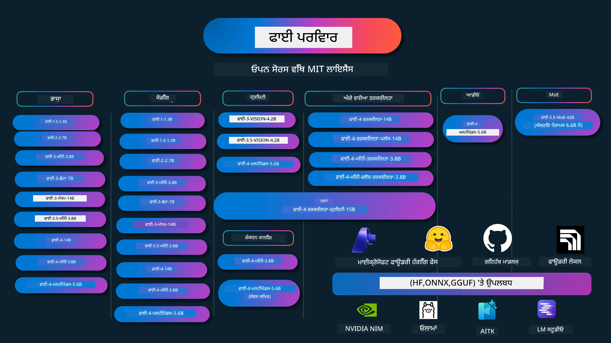

# Phi CookBook: Microsoft ਦੇ Phi ਮੋਡਲਾਂ ਨਾਲ ਹੱਥ-ਉੱਤੇ ਉਦਾਹਰਣ

[](https://codespaces.new/microsoft/phicookbook)
[](https://vscode.dev/redirect?url=vscode://ms-vscode-remote.remote-containers/cloneInVolume?url=https://github.com/microsoft/phicookbook)

[](https://GitHub.com/microsoft/phicookbook/graphs/contributors/?WT.mc_id=aiml-137032-kinfeylo)
[](https://GitHub.com/microsoft/phicookbook/issues/?WT.mc_id=aiml-137032-kinfeylo)
[](https://GitHub.com/microsoft/phicookbook/pulls/?WT.mc_id=aiml-137032-kinfeylo)
[](http://makeapullrequest.com?WT.mc_id=aiml-137032-kinfeylo)

[](https://GitHub.com/microsoft/phicookbook/watchers/?WT.mc_id=aiml-137032-kinfeylo)
[](https://GitHub.com/microsoft/phicookbook/network/?WT.mc_id=aiml-137032-kinfeylo)
[](https://GitHub.com/microsoft/phicookbook/stargazers/?WT.mc_id=aiml-137032-kinfeylo)

[](https://discord.com/invite/ByRwuEEgH4)

Phi Microsoft ਵਲੋਂ ਵਿਕਸਤ ਕੁਝ ਖੁੱਲ੍ਹੇ ਸਰੋਤ ਵਾਲੇ AI ਮਾਡਲਾਂ ਦੀ ਇੱਕ ਲੜੀ ਹੈ।

Phi ਇਸ ਸਮੇਂ ਸਭ ਤੋਂ ਸ਼ਕਤੀਸ਼ਾਲੀ ਅਤੇ ਲਾਗਤ-ਕੁਸ਼ਲ ਛੋਟਾ ਭਾਸ਼ਾਈ ਮਾਡਲ (SLM) ਹੈ, ਜਿਸ ਵਿੱਚ ਬਹੁ-ਭਾਸ਼ਾਈ, ਤਰਕ, ਲਿਖਤ/ਚੈਟ ਉਤਪਾਦਨ, ਕੋਡਿੰਗ, ਚਿੱਤਰਾਂ, ਆਡੀਓ ਅਤੇ ਹੋਰ ਪਰਿਸਥਿਤੀਆਂ ਲਈ ਬਹੁਤ ਵਧੀਆ ਬੈਂਚਮਾਰਕ ਹਨ।

ਤੁਸੀਂ Phi ਨੂੰ ਕਲਾਊਡ ਜਾਂ ਐਜ ਡਿਵਾਈਸز ਤੇ ਡਿਪਲੋਯ ਕਰ ਸਕਦੇ ਹੋ, ਅਤੇ ਤੁਸੀਂ ਘੱਟ ਗਣਨਾਤਮਕ ਸ਼ਕਤੀ ਨਾਲ ਆਸਾਨੀ ਨਾਲ ਜਨਰੇਟਿਵ AI ਐਪਲੀਕੇਸ਼ਨ ਬਣਾਉ ਸਕਦੇ ਹੋ।

ਇਹ ਜ਼ਰੂਰੀ ਕਦਮਾਂ ਦੀ ਪਾਲਣਾ ਕਰ ਕੇ ਸ਼ੁਰੂ ਕਰੋ:
1. **ਰਿਪੋਜ਼ਿਟਰੀ ਨੂੰ ਫੋਰਕ ਕਰੋ**: ਕਲਿੱਕ ਕਰੋ [](https://GitHub.com/microsoft/phicookbook/network/?WT.mc_id=aiml-137032-kinfeylo)
2. **ਰਿਪੋਜ਼ਿਟਰੀ ਨੂੰ ਕਲੋਨ ਕਰੋ**: `git clone https://github.com/microsoft/PhiCookBook.git`
3. [**Microsoft AI Discord ਕਮਿਊਨਿਟੀ ਵਿੱਚ ਸ਼ਾਮਿਲ ਹੋਵੋ ਅਤੇ ਮਾਹਿਰਾਂ ਅਤੇ ਹੋਰ ਵਿਕਾਸਕਾਰਾਂ ਨਾਲ ਮਿਲੋ**](https://discord.com/invite/ByRwuEEgH4?WT.mc_id=aiml-137032-kinfeylo)



### 🌐 ਬਹੁ-ਭਾਸ਼ਾਈ ਸਹਾਇਤਾ

#### GitHub ਆਕਸ਼ਨ ਰਾਹੀਂ ਸਮਰਥਿਤ (ਸਵੈਚਾਲਿਤ ਅਤੇ ਹਮੇਸ਼ਾ ਅਪ ਟੂ ਡੇਟ)

<!-- CO-OP TRANSLATOR LANGUAGES TABLE START -->
[Arabic](../ar/README.md) | [Bengali](../bn/README.md) | [Bulgarian](../bg/README.md) | [Burmese (Myanmar)](../my/README.md) | [Chinese (Simplified)](../zh-CN/README.md) | [Chinese (Traditional, Hong Kong)](../zh-HK/README.md) | [Chinese (Traditional, Macau)](../zh-MO/README.md) | [Chinese (Traditional, Taiwan)](../zh-TW/README.md) | [Croatian](../hr/README.md) | [Czech](../cs/README.md) | [Danish](../da/README.md) | [Dutch](../nl/README.md) | [Estonian](../et/README.md) | [Finnish](../fi/README.md) | [French](../fr/README.md) | [German](../de/README.md) | [Greek](../el/README.md) | [Hebrew](../he/README.md) | [Hindi](../hi/README.md) | [Hungarian](../hu/README.md) | [Indonesian](../id/README.md) | [Italian](../it/README.md) | [Japanese](../ja/README.md) | [Kannada](../kn/README.md) | [Korean](../ko/README.md) | [Lithuanian](../lt/README.md) | [Malay](../ms/README.md) | [Malayalam](../ml/README.md) | [Marathi](../mr/README.md) | [Nepali](../ne/README.md) | [Nigerian Pidgin](../pcm/README.md) | [Norwegian](../no/README.md) | [Persian (Farsi)](../fa/README.md) | [Polish](../pl/README.md) | [Portuguese (Brazil)](../pt-BR/README.md) | [Portuguese (Portugal)](../pt-PT/README.md) | [Punjabi (Gurmukhi)](./README.md) | [Romanian](../ro/README.md) | [Russian](../ru/README.md) | [Serbian (Cyrillic)](../sr/README.md) | [Slovak](../sk/README.md) | [Slovenian](../sl/README.md) | [Spanish](../es/README.md) | [Swahili](../sw/README.md) | [Swedish](../sv/README.md) | [Tagalog (Filipino)](../tl/README.md) | [Tamil](../ta/README.md) | [Telugu](../te/README.md) | [Thai](../th/README.md) | [Turkish](../tr/README.md) | [Ukrainian](../uk/README.md) | [Urdu](../ur/README.md) | [Vietnamese](../vi/README.md)

> **ਸਥਾਨਕ ਤੌਰ 'ਤੇ ਕਲੋਨ ਕਰਨਾ ਪਸੰਦ ਕਰਦੇ ਹੋ?**
>
> ਇਸ ਰਿਪੋਜ਼ਿਟਰੀ ਵਿੱਚ 50+ ਭਾਸ਼ਾਈ ਅਨੁਵਾਦ ਹਨ ਜੋ ਡਾਊਨਲੋਡ ਦੀ ਸਾਈਜ਼ ਨੂੰ ਕਾਫ਼ੀ ਵਧਾਉਂਦੇ ਹਨ। ਬਿਨਾਂ ਅਨੁਵਾਦਾਂ ਦੇ ਕਲੋਨ ਕਰਨ ਲਈ sparse checkout ਦੀ ਵਰਤੋਂ ਕਰੋ:
>
> **Bash / macOS / Linux:**
> ```bash
> git clone --filter=blob:none --sparse https://github.com/microsoft/PhiCookBook.git
> cd PhiCookBook
> git sparse-checkout set --no-cone '/*' '!translations' '!translated_images'
> ```
>
> **CMD (Windows):**
> ```cmd
> git clone --filter=blob:none --sparse https://github.com/microsoft/PhiCookBook.git
> cd PhiCookBook
> git sparse-checkout set --no-cone "/*" "!translations" "!translated_images"
> ```
>
> ਇਸ ਨਾਲ ਤੁਹਾਨੂੰ ਇੱਥੇ ਜ਼ਰੂਰੀ ਸਾਰਾ ਕੁਝ ਮਿਲੇਗਾ, ਜੋ ਕੋਰਸ ਪੂਰਾ ਕਰਨ ਲਈ ਤੇਜ਼ ਡਾਊਨਲੋਡ ਹੈ।
<!-- CO-OP TRANSLATOR LANGUAGES TABLE END -->

## ਵਿਚਾਰ-ਸੂਚੀ
- ਪ੍ਰਸਤਾਵਨਾ - [ਫਾਈ ਪਰਿਵਾਰ ਵਿੱਚ ਤੁਹਾਡਾ ਸਵਾਗਤ ਹੈ](./md/01.Introduction/01/01.PhiFamily.md) - [ਆਪਣੇ ਵਾਤਾਵਰਣ ਦੀ ਸੈਟਿੰਗ ਕਰੋ](./md/01.Introduction/01/01.EnvironmentSetup.md) - [ਮੁੱਖ ਤਕਨਾਲੋਜੀਆਂ ਨੂੰ ਸਮਝਣਾ](./md/01.Introduction/01/01.Understandingtech.md) - [ਫਾਈ ਮਾਡਲਾਂ ਲਈ ਏਆਈ ਸੁਰੱਖਿਆ](./md/01.Introduction/01/01.AISafety.md) - [ਫਾਈ ਹਾਰਡਵੇਅਰ ਸਮਰਥਨ](./md/01.Introduction/01/01.Hardwaresupport.md) - [ਫਾਈ ਮਾਡਲ ਅਤੇ ਪਲੇਟਫਾਰਮਾਂ ਉੱਤੇ ਉਪਲਬਧਤਾ](./md/01.Introduction/01/01.Edgeandcloud.md) - [ਗਾਇਡੈਂਸ-ਏਆਈ ਅਤੇ ਫਾਈ ਦੀ ਵਰਤੋਂ](./md/01.Introduction/01/01.Guidance.md) - [ਗਿਟਹਬ ਮਾਰਕਿਟਪਲੇਸ ਮਾਡਲ](https://github.com/marketplace/models) - [ਅਜ਼ੂਰ ਏਆਈ ਮਾਡਲ ਕੈਟਾਲੌਗ](https://ai.azure.com) - ਵੱਖ-ਵੱਖ ਵਾਤਾਵਰਣ ਵਿੱਚ ਫਾਈ ਇਨਫਰੈਂਸ - [ਹਗੀੰਗ ਫੇਸ](./md/01.Introduction/02/01.HF.md) - [ਗਿਟਹਬ ਮਾਡਲ](./md/01.Introduction/02/02.GitHubModel.md) - [ਮਾਈਕ੍ਰੋਸਾਫਟ ਫਾਉਂਡਰੀ ਮਾਡਲ ਕੈਟਾਲੌਗ](./md/01.Introduction/02/03.AzureAIFoundry.md) - [ਓਲਾਮਾ](./md/01.Introduction/02/04.Ollama.md) - [ਏਆਈ ਟੂਲਕਿਟ ਵੀਐੱਸਕੋਡ (AITK)](./md/01.Introduction/02/05.AITK.md) - [ਐਨ ਵੀਡੀਆ ਨਿਮ](./md/01.Introduction/02/06.NVIDIA.md) - [ਫਾਉਂਡਰੀ ਲੋਕਲ](./md/01.Introduction/02/07.FoundryLocal.md) - ਫਾਈ ਪਰਿਵਾਰ ਵਿੱਚ ਇਨਫਰੈਂਸ - [iOS ਵਿੱਚ ਫਾਈ ਇਨਫਰੈਂਸ](./md/01.Introduction/03/iOS_Inference.md) - [ਐਂਡ੍ਰਾਇਡ ਵਿੱਚ ਫਾਈ ਇਨਫਰੈਂਸ](./md/01.Introduction/03/Android_Inference.md) - [ਜੇਟਸਨ ਵਿੱਚ ਫਾਈ ਇਨਫਰੈਂਸ](./md/01.Introduction/03/Jetson_Inference.md) - [ਏਆਈ ਪੀਸੀ ਵਿੱਚ ਫਾਈ ਇਨਫਰੈਂਸ](./md/01.Introduction/03/AIPC_Inference.md) - [ਐਪਲ MLX ਫ੍ਰੇਮਵਰਕ ਨਾਲ ਫਾਈ ਇਨਫਰੈਂਸ](./md/01.Introduction/03/MLX_Inference.md) - [ਲੋਕਲ ਸਰਵਰ ਵਿੱਚ ਫਾਈ ਇਨਫਰੈਂਸ](./md/01.Introduction/03/Local_Server_Inference.md) - [ਏਆਈ ਟੂਲਕਿਟ ਦੀ ਵਰਤੋਂ ਨਾਲ ਰਿਮੋਟ ਸਰਵਰ ਵਿੱਚ ਫਾਈ ਇਨਫਰੈਂਸ](./md/01.Introduction/03/Remote_Interence.md) - [ਰੱਸਟ ਨਾਲ ਫਾਈ ਇਨਫਰੈਂਸ](./md/01.Introduction/03/Rust_Inference.md) - [ਲੋਕਲ ਵਿੱਚ ਫਾਈ ਵਿਜ਼ਨ ਇਨਫਰੈਂਸ](./md/01.Introduction/03/Vision_Inference.md) - [ਕੈਇਟੋ ਏਕੇਐਸ, ਅਜ਼ੂਰ ਕੰਟੇਨਰ (ਬਨਿਆਦੀ ਸਮਰਥਨ) ਨਾਲ ਫਾਈ ਇਨਫਰੈਂਸ](./md/01.Introduction/03/Kaito_Inference.md) - [ਫਾਈ ਪਰਿਵਾਰ ਦੀ ਗਣਨਾ](./md/01.Introduction/04/QuantifyingPhi.md) - [ਲਾਮਾ.cpp ਨਾਲ ਫਾਈ-3.5 / 4 ਦੀ ਗਣਨਾ](./md/01.Introduction/04/UsingLlamacppQuantifyingPhi.md) - [onnxruntime ਲਈ ਜেনਰੇਟਿਵ ਏਆਈ ਐਕਸਟੈਂਸ਼ਨਜ਼ ਨਾਲ ਫਾਈ-3.5 / 4 ਦੀ ਗਣਨਾ](./md/01.Introduction/04/UsingORTGenAIQuantifyingPhi.md) - [ਇੰਟਲ ਓਪਨਵੀਨੋ ਨਾਲ ਫਾਈ-3.5 / 4 ਦੀ ਗਣਨਾ](./md/01.Introduction/04/UsingIntelOpenVINOQuantifyingPhi.md) - [ਐਪਲ MLX ਫ੍ਰੇਮਵਰਕ ਨਾਲ ਫਾਈ-3.5 / 4 ਦੀ ਗਣਨਾ](./md/01.Introduction/04/UsingAppleMLXQuantifyingPhi.md) - ਫਾਈ ਮੁਲਾਂਕਣ - [ਉੱਤਰਦਾਇਤ ਏਆਈ](./md/01.Introduction/05/ResponsibleAI.md) - [ਮਾਈਕ੍ਰੋਸਾਫਟ ਫਾਉਂਡਰੀ ਲਈ ਮੁਲਾਂਕਣ](./md/01.Introduction/05/AIFoundry.md) - [ਮੁਲਾਂਕਣ ਲਈ ਪ੍ਰੋਂਪਟਫਲੋ ਦੀ ਵਰਤੋਂ](./md/01.Introduction/05/Promptflow.md) - ਅਜ਼ੂਰ ਏਆਈ ਖੋਜ ਨਾਲ RAG - [ਅਜ਼ੂਰ ਏਆਈ ਖੋਜ ਨਾਲ ਫਾਈ-4-ਮਿਨੀ ਅਤੇ ਫਾਈ-4-ਮਲਟੀਮੋਡਲ (RAG) ਕਿਵੇਂ ਵਰਤੋਂ](https://github.com/microsoft/PhiCookBook/blob/main/code/06.E2E/E2E_Phi-4-RAG-Azure-AI-Search.ipynb) - ਫਾਈ ਐਪਲੀਕੇਸ਼ਨ ਵਿਕਾਸ ਨਮੂਨੇ - ਟੈਕਸਟ ਅਤੇ ਚੈਟ ਐਪਲੀਕੇਸ਼ਨ - ਫਾਈ-4 ਨਮੂਨੇ - [📓] [ਫਾਈ-4-ਮਿਨੀ ONNX ਮਾਡਲ ਨਾਲ ਚੈਟ](./md/02.Application/01.TextAndChat/Phi4/ChatWithPhi4ONNX/README.md) - [ਫਾਈ-4 ਲੋਕਲ ONNX ਮਾਡਲ ਨਾਲ ਚੈਟ .NET](../../md/04.HOL/dotnet/src/LabsPhi4-Chat-01OnnxRuntime) - [ਸੈਮੈੰਟਿਕ ਕਰਨਲ ਵਰਤ ਕੇ ਫਾਈ-4 ONNX ਨਾਲ .NET ਕੰਸੋਲ ਐਪ ਚੈਟ](../../md/04.HOL/dotnet/src/LabsPhi4-Chat-02SK) - ਫਾਈ-3 / 3.5 ਨਮੂਨੇ - [ਫਾਈ3, ONNX ਰਨਟਾਈਮ ਵੇਬ ਅਤੇ ਵੇਬਜੀਪੀਯੂ ਵਰਤ ਕੇ ਬ੍ਰਾਊਜ਼ਰ ਵਿੱਚ ਲੋਕਲ ਚੈਟਬੋਟ](https://github.com/microsoft/onnxruntime-inference-examples/tree/main/js/chat) - [ਓਪਨਵੀਨੋ ਚੈਟ](./md/02.Application/01.TextAndChat/Phi3/E2E_OpenVino_Chat.md) - [ਮਲਟੀ ਮਾਡਲ - ਇੰਟਰਐਕਟਿਵ ਫਾਈ-3-ਮਿਨੀ ਅਤੇ ਓਪਨਏਆਈ ਵਿਸਪਰ](./md/02.Application/01.TextAndChat/Phi3/E2E_Phi-3-mini_with_whisper.md) - [ਐਮਐਲਫਲੋ - ਢਾਂਚਾ ਬਣਾਉਣਾ ਅਤੇ ਐਮਐਲਫਲੋ ਨਾਲ ਫਾਈ-3 ਦੀ ਵਰਤੋਂ](./md//02.Application/01.TextAndChat/Phi3/E2E_Phi-3-MLflow.md) - [ਮਾਡਲ ਅਪਟੀਮਾਈਜ਼ੇਸ਼ਨ - ਅਲੀਵ ਨਾਲ ONNX ਰਨਟਾਈਮ ਵੇਬ ਲਈ ਫਾਈ-3-ਮਿਨੀ ਮਾਡਲ ਕਿਵੇਂ ਅਪਟੀਮਾਈਜ਼ ਕਰਨਾ](https://github.com/microsoft/Olive/tree/main/examples/phi3) - [ਫਾਈ-3 ਮਿਨੀ-4k-ਇੰਸਟ੍ਰਕਟ-onnx ਨਾਲ WinUI3 ਐਪ](https://github.com/microsoft/Phi3-Chat-WinUI3-Sample/) -[WinUI3 ਮਲਟੀ ਮਾਡਲ ਏਆਈ ਪਾਵਰਡ ਨੋਟਸ ਐਪ ਸੈਂਪਲ](https://github.com/microsoft/ai-powered-notes-winui3-sample) - [ਕਸਟਮ ਫਾਈ-3 ਮਾਡਲਾਂ ਨੂੰ ਪ੍ਰੋਂਪਟਫਲੋ ਨਾਲ ਫਾਈਨ-ਟਿਊਨ ਅਤੇ ਇੰਟੀਗ੍ਰੇਟ ਕਰੋ](./md/02.Application/01.TextAndChat/Phi3/E2E_Phi-3-FineTuning_PromptFlow_Integration.md) - [ਮਾਈਕ੍ਰੋਸਾਫਟ ਫਾਉਂਡਰੀ ਵਿੱਚ ਪ੍ਰੋਂਪਟਫਲੋ ਨਾਲ ਕਸਟਮ ਫਾਈ-3 ਮਾਡਲਾਂ ਦੀ ਫਾਈਨ-ਟਿਊਨ ਅਤੇ ਇੰਟੀਗ੍ਰੇਸ਼ਨ](./md/02.Application/01.TextAndChat/Phi3/E2E_Phi-3-FineTuning_PromptFlow_Integration_AIFoundry.md) - [ਮਾਈਕ੍ਰੋਸਾਫਟ ਦੇ ਜ਼ਿੰਮੇਵਾਰ ਏਆਈ ਮੂਲ ਨਿਯਮਾਂ ‘ਤੇ ਧਿਆਨ ਕੇਂਦਰਿਤ ਕਰਦੇ ਹੋਏ ਮਾਈਕ੍ਰੋਸਾਫਟ ਫਾਉਂਡਰੀ ਵਿੱਚ ਫਾਇਨ-ਟਿਊਨ ਕੀਤੀ ਫਾਈ-3 / ਫਾਈ-3.5 ਮਾਡਲ ਦਾ ਮੁਲਾਂਕਣ](./md/02.Application/01.TextAndChat/Phi3/E2E_Phi-3-Evaluation_AIFoundry.md) - [📓] [ਫਾਈ-3.5-ਮਿਨੀ-ਇੰਸਟ੍ਰਕਟ ਭਾਸ਼ਾ ਪਰੇਡਿਕਸ਼ਨ ਨਮੂਨਾ (ਚੀਨੀ/ਅੰਗਰੇਜ਼ੀ)](./md/02.Application/01.TextAndChat/Phi3/phi3-instruct-demo.ipynb) - [ਫਾਈ-3.5-ਇੰਸਟ੍ਰਕਟ WebGPU RAG ਚੈਟਬੋਟ](./md/02.Application/01.TextAndChat/Phi3/WebGPUWithPhi35Readme.md) - [Windows GPU ਦੀ ਵਰਤੋਂ ਕਰਕੇ ਫਾਈ-3.5-ਇੰਸਟ੍ਰਕਟ ONNX ਨਾਲ ਪ੍ਰੋਂਪਟਫਲੋ ਹੱਲ ਬਣਾਉਣਾ](./md/02.Application/01.TextAndChat/Phi3/UsingPromptFlowWithONNX.md) - [ਮਾਈਕ੍ਰੋਸਾਫਟ ਫਾਈ-3.5 tflite ਨਾਲ ਐਂਡ੍ਰਾਇਡ ਐਪ ਬਣਾਉਣਾ](./md/02.Application/01.TextAndChat/Phi3/UsingPhi35TFLiteCreateAndroidApp.md) - [ਮਾਈਕ੍ਰੋਸਾਫਟ.ML.OnnxRuntime ਵਰਤ ਕੇ ਲੋਕਲ ONNX ਫਾਈ-3 ਮਾਡਲ ਨਾਲ ਪ੍ਰਸ਼ਨ-ਉੱਤਰ .NET ਉਦਾਹਰਨ](../../md/04.HOL/dotnet/src/LabsPhi301) - [ਸੈਮੈਂਟਿਕ ਕਰਨਲ ਅਤੇ ਫਾਈ-3 ਨਾਲ ਕੰਸੋਲ ਚੈਟ .NET ਐਪ](../../md/04.HOL/dotnet/src/LabsPhi302) - ਅਜ਼ੂਰ ਏਆਈ ਇਨਫਰੈਂਸ SDK ਕੋਡ ਆਧਾਰਿਤ ਨਮੂਨੇ - ਫਾਈ-4 ਨਮੂਨੇ - [📓] [ਫਾਈ-4 ਮਲਟੀਮੋਡਲ ਦੀ ਵਰਤੋਂ ਕਰਕੇ ਪ੍ਰੋਜੈਕਟ ਕੋਡ ਜਨਰੇਟ ਕਰੋ](./md/02.Application/02.Code/Phi4/GenProjectCode/README.md) - ਫਾਈ-3 / 3.5 ਨਮੂਨੇ - [ਮਾਈਕ੍ਰੋਸਾਫਟ ਫਾਈ-3 ਪਰਿਵਾਰ ਨਾਲ ਆਪਣਾ ਵਿਜ਼ੁਅਲ ਸਟੂਡੀਓ ਕੋਡ ਗਿਟਹਬ ਕੋਪਾਇਲਟ ਚੈਟ ਬਣਾਓ](./md/02.Application/02.Code/Phi3/VSCodeExt/README.md) - [ਗਿਟਹਬ ਮਾਡਲਾਂ ਨਾਲ ਫਾਈ-3.5 ਵਰਤ ਕੇ ਆਪਣਾ ਵਿਜ਼ੁਅਲ ਸਟੂਡੀਓ ਕੋਡ ਚੈਟ ਕੋਪਾਇਲਟ ਏਜੰਟ ਬਣਾਓ](/md/02.Application/02.Code/Phi3/CreateVSCodeChatAgentWithGitHubModels.md) - ਉੱਚ ਤਰੱਕੀ ਦੇ ਤਰਕ ਨਮੂਨੇ - ਫਾਈ-4 ਨਮੂਨੇ - [📓] [ਫਾਈ-4-ਮਿਨੀ-ਤਰਕਸ਼ੀਲ ਜਾਂ ਫਾਈ-4-ਤਰਕਸ਼ੀਲ ਨਮੂਨੇ](./md/02.Application/03.AdvancedReasoning/Phi4/AdvancedResoningPhi4mini/README.md) - [📓] [ਮਾਈਕ੍ਰੋਸਾਫਟ ਅਲੀਵ ਨਾਲ ਫਾਈ-4-ਮਿਨੀ-ਤਰਕਸ਼ੀਲ ਦੀ ਫਾਈਨ-ਟਿਊਨਿੰਗ](./md/02.Application/03.AdvancedReasoning/Phi4/AdvancedResoningPhi4mini/olive_ft_phi_4_reasoning_with_medicaldata.ipynb) - [📓] [ਐਪਲ MLX ਨਾਲ ਫਾਈ-4-ਮਿਨੀ-ਤਰਕਸ਼ੀਲ ਦੀ ਫਾਈਨ-ਟਿਊਨਿੰਗ](./md/02.Application/03.AdvancedReasoning/Phi4/AdvancedResoningPhi4mini/mlx_ft_phi_4_reasoning_with_medicaldata.ipynb) - [📓] [ਗਿਟਹਬ ਮਾਡਲਾਂ ਨਾਲ ਫਾਈ-4-ਮਿਨੀ-ਤਰਕਸ਼ੀਲ](./md/02.Application/02.Code/Phi4r/github_models_inference.ipynb) - [📓] [ਮਾਈਕ੍ਰੋਸਾਫਟ ਫਾਉਂਡਰੀ ਮਾਡਲਾਂ ਨਾਲ ਫਾਈ-4-ਮਿਨੀ-ਤਰਕਸ਼ੀਲ](./md/02.Application/02.Code/Phi4r/azure_models_inference.ipynb) -
ਡੈਮੋਜ਼ - [Phi-4-mਨੀ ਡੈਮੋ ਜੋ Hugging Face ਸਪੇਸز 'ਤੇ ਹੋਸਟ ਕੀਤੇ ਗਏ ਹਨ](https://huggingface.co/spaces/microsoft/phi-4-mini?WT.mc_id=aiml-137032-kinfeylo) - [Phi-4-ਮਲਟੀਮਾਡਲ ਡੈਮੋਜ਼ ਜੋ Hugging Face ਸਪੇਸਜ਼ 'ਤੇ ਹੋਸਟ ਕੀਤੇ ਗਏ ਹਨ](https://huggingface.co/spaces/microsoft/phi-4-multimodal?WT.mc_id=aiml-137032-kinfeylo) - ਵਿਜ਼ਨ ਸੈਂਪਲ - Phi-4 ਸੈਂਪਲ - [📓] [ਚਿੱਤਰਾਂ ਨੂੰ ਪੜ੍ਹਨ ਅਤੇ ਕੋਡ ਜਨਰੇਟ ਕਰਨ ਲਈ Phi-4-ਮਲਟੀਮਾਡਲ ਦੀ ਵਰਤੋਂ ਕਰੋ](./md/02.Application/04.Vision/Phi4/CreateFrontend/README.md) - Phi-3 / 3.5 ਸੈਂਪਲ - [📓][Phi-3-ਵਿਜ਼ਨ-ਚਿੱਤਰ ਪਾਠ ਤੋਂ ਪਾਠ](./md/02.Application/04.Vision/Phi3/E2E_Phi-3-vision-image-text-to-text-online-endpoint.ipynb) - [Phi-3-ਵਿਜ਼ਨ-ONNX](https://onnxruntime.ai/docs/genai/tutorials/phi3-v.html) - [📓][Phi-3-ਵਿਜ਼ਨ CLIP ਐਂਬੈਡਿੰਗ](./md/02.Application/04.Vision/Phi3/E2E_Phi-3-vision-image-text-to-text-online-endpoint.ipynb) - [ਡੈਮੋ: Phi-3 ਰੀਸਾਈਕਲਿੰਗ](https://github.com/jennifermarsman/PhiRecycling/) - [Phi-3-ਵਿਜ਼ਨ - ਵਿਜ਼ੁਅਲ ਭਾਸ਼ਾ ਸਹਾਇਕ - Phi3-ਵਿਜ਼ਨ ਅਤੇ OpenVINO ਨਾਲ](https://docs.openvino.ai/nightly/notebooks/phi-3-vision-with-output.html) - [Phi-3 Vision Nvidia NIM](./md/02.Application/04.Vision/Phi3/E2E_Nvidia_NIM_Vision.md) - [Phi-3 Vision OpenVino](./md/02.Application/04.Vision/Phi3/E2E_OpenVino_Phi3Vision.md) - [📓][Phi-3.5 Vision ਮਲਟੀ-ਫ੍ਰੇਮ ਜਾਂ ਮਲਟੀ-ਚਿੱਤਰ ਸੈਂਪਲ](./md/02.Application/04.Vision/Phi3/phi3-vision-demo.ipynb) - [Phi-3 Vision ਲੋਕਲ ONNX ਮਾਡਲ Microsoft.ML.OnnxRuntime .NET ਦੀ ਵਰਤੋਂ ਨਾਲ](../../md/04.HOL/dotnet/src/LabsPhi303) - [ਮੇਨੂ ਆਧਾਰਿਤ Phi-3 Vision ਲੋਕਲ ONNX ਮਾਡਲ Microsoft.ML.OnnxRuntime .NET ਦੀ ਵਰਤੋਂ ਨਾਲ](../../md/04.HOL/dotnet/src/LabsPhi304) - ਗੁਣਾਂਕਨ-ਵਿਜ਼ਨ ਸੈਂਪਲ - Phi-4-ਗੁਣਾਂਕਨ-ਵਿਜ਼ਨ-15B - [📓] [Phi-4-ਗੁਣਾਂਕਨ-ਵਿਜ਼ਨ-15B ਦੀ ਵਰਤੋਂ ਕਰਕੇ ਜੇਵਾਕਿੰਗ ਦੀ ਪਛਾਣ ਕਰਨਾ](./md/02.Application/10.ReasoningVision/Phi_4_reasoning_vision_15b_Jaywalking.ipynb) - [📓] [Phi-4-ਗੁਣਾਂਕਨ-ਵਿਜ਼ਨ-15B ਨਾਲ ਗਣਿਤ](./md/02.Application/10.ReasoningVision/Phi_4_reasoning_vision_15b_Math.ipynb) - [📓] [Phi-4-ਗੁਣਾਂਕਨ-ਵਿਜ਼ਨ-15B ਨਾਲ UI ਦੀ ਪਛਾਣ](./md/02.Application/10.ReasoningVision/Phi_4_reasoning_vision_15b_ui.ipynb) - ਗਣਿਤ ਸੈਂਪਲ - Phi-4-Mਨੀ-ਫਲੈਸ਼-ਗੁਣਾਂਕਨ-ਅਦਿਸ਼ਨਾਂ ਦੇ ਸੈਂਪਲ [Phi-4-Mਨੀ-ਫਲੈਸ਼-ਗੁਣਾਂਕਨ-ਅਦਿਸ਼ਨਾਂ ਨਾਲ ਗਣਿਤ ਡੈਮੋ](./md/02.Application/09.Math/MathDemo.ipynb) - ਆਡੀਓ ਸੈਂਪਲ - Phi-4 ਸੈਂਪਲ - [📓] [Phi-4-ਮਲਟੀਮਾਡਲ ਨਾਲ ਆਡੀਓ ਟ੍ਰਾਂਸਕ੍ਰਿਪਟਸ ਪ੍ਰਾਪਤ ਕਰਨਾ](./md/02.Application/05.Audio/Phi4/Transciption/README.md) - [📓] [Phi-4-ਮਲਟੀਮਾਡਲ ਆਡੀਓ ਸੈਂਪਲ](./md/02.Application/05.Audio/Phi4/Siri/demo.ipynb) - [📓] [Phi-4-ਮਲਟੀਮਾਡਲ ਬੋਲ ਚਾਲ ਦਾ ਅਨੁਵਾਦ ਸੈਂਪਲ](./md/02.Application/05.Audio/Phi4/Translate/demo.ipynb) - [.NET ਕੌਂਸੋਲ ਐਪਲੀਕੇਸ਼ਨ ਜੋ Phi-4-ਮਲਟੀਮਾਡਲ ਆਡੀਓ ਦੀ ਵਰਤੋਂ ਕਰਕੇ ਆਡੀਓ ਫਾਇਲ ਦਾ ਵਿਸ਼ਲੇਸ਼ਣ ਕਰਦਾ ਹੈ ਅਤੇ ਟ੍ਰਾਂਸਕ੍ਰਿਪਟ ਤਿਆਰ ਕਰਦਾ ਹੈ](../../md/04.HOL/dotnet/src/LabsPhi4-MultiModal-02Audio) - MOE ਸੈਂਪਲ - Phi-3 / 3.5 ਸੈਂਪਲ - [📓] [Phi-3.5 ਮਿਸ਼ਰਨ ਅਕਸਰ ਮਾਹਿਰ ਮਾਡਲ (MoEs) ਸਮਾਜਿਕ ਮੀਡੀਆ ਸੈਂਪਲ](./md/02.Application/06.MoE/Phi3/phi3_moe_demo.ipynb) - [📓] [NVIDIA NIM Phi-3 MOE, ਅਜ਼ੂਰ AI Search ਅਤੇ LlamaIndex ਨਾਲ Retrieval-Augmented Generation (RAG) ਪਾਈਪਲਾਈਨ ਬਣਾਉਣਾ](./md/02.Application/06.MoE/Phi3/azure-ai-search-nvidia-rag.ipynb) - - ਫੰਕਸ਼ਨ ਕਾਲਿੰਗ ਸੈਂਪਲ - Phi-4 ਸੈਂਪਲ 🆕 - [📓] [Phi-4-mini ਨਾਲ ਫੰਕਸ਼ਨ ਕਾਲਿੰਗ ਦੀ ਵਰਤੋਂ](./md/02.Application/07.FunctionCalling/Phi4/FunctionCallingBasic/README.md) - [📓] [Phi-4-mini ਨਾਲ ਮਲਟੀ-ਏਜੰਟ ਬਣਾਉਣ ਲਈ ਫੰਕਸ਼ਨ ਕਾਲਿੰਗ ਦੀ ਵਰਤੋਂ](./md/02.Application/07.FunctionCalling/Phi4/Multiagents/Phi_4_mini_multiagent.ipynb) - [📓] [ਓਲਾਮਾ ਨਾਲ ਫੰਕਸ਼ਨ ਕਾਲਿੰਗ ਦੀ ਵਰਤੋਂ](./md/02.Application/07.FunctionCalling/Phi4/Ollama/ollama_functioncalling.ipynb) - [📓] [ONNX ਨਾਲ ਫੰਕਸ਼ਨ ਕਾਲਿੰਗ ਦੀ ਵਰਤੋਂ](./md/02.Application/07.FunctionCalling/Phi4/ONNX/onnx_parallel_functioncalling.ipynb) - ਮਲਟੀਮਾਡਲ ਮਿਕਸਿੰਗ ਸੈਂਪਲ - Phi-4 ਸੈਂਪਲ 🆕 - [📓] [ਤਕਨਾਲੋਜੀ ਪੱਤਰਕਾਰ ਵਜੋਂ Phi-4-ਮਲਟੀਮਾਡਲ ਦੀ ਵਰਤੋਂ](./md/02.Application/08.Multimodel/Phi4/TechJournalist/phi_4_mm_audio_text_publish_news.ipynb) - [.NET ਕੌਂਸੋਲ ਐਪਲੀਕੇਸ਼ਨ ਜੋ Phi-4-ਮਲਟੀਮਾਡਲ ਦੀ ਵਰਤੋਂ ਕਰਕੇ ਚਿੱਤਰਾਂ ਦਾ ਵਿਸ਼ਲੇਸ਼ਣ ਕਰਦਾ ਹੈ](../../md/04.HOL/dotnet/src/LabsPhi4-MultiModal-01Images) - ਫਾਈਨ-ਟਿਊਨਿੰਗ Phi ਸੈਂਪਲ - [ਫਾਈਨ-ਟਿਊਨਿੰਗ ਦੇ ਸਿਨਾਰੀਓ](./md/03.FineTuning/FineTuning_Scenarios.md) - [ਫਾਈਨ-ਟਿਊਨਿੰਗ ਬਨਾਮ RAG](./md/03.FineTuning/FineTuning_vs_RAG.md) - [Phi-3 ਨੂੰ ਇੱਕ ਉਦਯੋਗ ਵਿਸ਼ੇਸ਼ਜ્ઞ ਬਣਾਉਣ ਲਈ ਫਾਈਨ-ਟਿਊਨਿੰਗ](./md/03.FineTuning/LetPhi3gotoIndustriy.md) - [VS ਕੋਡ ਲਈ AI ਟੂਲਕਿਟ ਨਾਲ Phi-3 ਦੀ ਫਾਈਨ-ਟਿਊਨਿੰਗ](./md/03.FineTuning/Finetuning_VSCodeaitoolkit.md) - [ਅਜ਼ੂਰ ਮਸ਼ੀਨ ਲਰਨਿੰਗ ਸੇਵਾ ਨਾਲ Phi-3 ਦੀ ਫਾਈਨ-ਟਿਊਨਿੰਗ](./md/03.FineTuning/Introduce_AzureML.md) - [ਲੋਰਾ ਨਾਲ Phi-3 ਦੀ ਫਾਈਨ-ਟਿਊਨਿੰਗ](./md/03.FineTuning/FineTuning_Lora.md) - [QLora ਨਾਲ Phi-3 ਦੀ ਫਾਈਨ-ਟਿਊਨਿੰਗ](./md/03.FineTuning/FineTuning_Qlora.md) - [Microsoft Foundry ਨਾਲ Phi-3 ਦੀ ਫਾਈਨ-ਟਿਊਨਿੰਗ](./md/03.FineTuning/FineTuning_AIFoundry.md) - [Azure ML CLI/SDK ਨਾਲ Phi-3 ਦੀ ਫਾਈਨ-ਟਿਊਨਿੰਗ](./md/03.FineTuning/FineTuning_MLSDK.md) - [Microsoft Olive ਨਾਲ ਫਾਈਨ-ਟਿਊਨਿੰਗ](./md/03.FineTuning/FineTuning_MicrosoftOlive.md) - [Microsoft Olive ਹੈਂਡਜ਼-ਆਨ ਲੈਬ ਨਾਲ ਫਾਈਨ-ਟਿਊਨਿੰਗ](./md/03.FineTuning/olive-lab/readme.md) - [Weights and Bias ਨਾਲ Phi-3-ਵਿਜ਼ਨ ਦੀ ਫਾਈਨ-ਟਿਊਨਿੰਗ](./md/03.FineTuning/FineTuning_Phi-3-visionWandB.md) - [ਐਪਲ MLX ਫਰੇਮਵਰਕ ਨਾਲ Phi-3 ਦੀ ਫਾਈਨ-ਟਿਊਨਿੰਗ](./md/03.FineTuning/FineTuning_MLX.md) - [Phi-3-ਵਿਜ਼ਨ ਦੀ ਫਾਈਨ-ਟਿਊਨਿੰਗ (ਅਧਿਕਾਰਿਤ ਸਹਾਇਤਾ)](./md/03.FineTuning/FineTuning_Vision.md) - [Kaito AKS, ਅਜ਼ੂਰ ਕੰਟੇਨਰਜ਼ (ਅਧਿਕਾਰਿਤ ਸਹਾਇਤਾ) ਨਾਲ Phi-3 ਦੀ ਫਾਈਨ-ਟਿਊਨਿੰਗ](./md/03.FineTuning/FineTuning_Kaito.md) - [Phi-3 ਅਤੇ 3.5 ਵਿਜ਼ਨ ਦੀ ਫਾਈਨ-ਟਿਊਨਿੰਗ](https://github.com/2U1/Phi3-Vision-Finetune) - ਹੈਂਡਜ਼-ਆਨ ਲੈਬ - [ਕਟਿੰਗ-ਐਜ ਮਾਡਲ: LLMs, SLMs, ਲੋਕਲ ਵਿਕਾਸ ਅਤੇ ਹੋਰ ਵਿਚ ਖੋਜੋ](https://github.com/microsoft/aitour-exploring-cutting-edge-models) - [NLP ਸਮਰੱਥਾ ਖੋਲ੍ਹਣਾ: Microsoft Olive ਨਾਲ ਫਾਈਨ-ਟਿਊਨਿੰਗ](https://github.com/azure/Ignite_FineTuning_workshop) - ਅਕਾਡਮਿਕ ਰਿਸਰਚ ਪੇਪਰ ਅਤੇ ਪ੍ਰਕਾਸ਼ਨ - [Textbooks Are All You Need II: phi-1.5 ਤਕਨੀਕੀ ਰਿਪੋਰਟ](https://arxiv.org/abs/2309.05463) - [Phi-3 ਤਕਨੀਕੀ ਰਿਪੋਰਟ: ਇੱਕ ਬਹੁਤ ਯੋਗ ਭਾਸ਼ਾ ਮਾਡਲ ਤੁਹਾਡੇ ਫ਼ੋਨ 'ਤੇ](https://arxiv.org/abs/2404.14219) - [Phi-4 ਤਕਨੀਕੀ ਰਿਪੋਰਟ](https://arxiv.org/abs/2412.08905) - [Phi-4-Mਨੀ ਤਕਨੀਕੀ ਰਿਪੋਰਟ: ਕਾਂਪੈਕਟ ਪਰ ਤਾਕਤਵਰ ਮਲਟੀਮਾਡਲ ਭਾਸ਼ਾ ਮਾਡਲ ਮਿਸ਼ਰਨ-ਆਫ-ਲੋਰਾ ਦੁਆਰਾ](https://arxiv.org/abs/2503.01743) - [ਇਨ-ਵਹੀਕਲ ਫੰਕਸ਼ਨ ਕਾਲਿੰਗ ਲਈ ਛੋਟੇ ਭਾਸ਼ਾ ਮਾਡਲਾਂ ਦਾ ਅਪਟੀਮਾਈਜ਼ੇਸ਼ਨ](https://arxiv.org/abs/2501.02342) - [(WhyPHI) ਬਹੁ-ਚੋਣ ਪ੍ਰਸ਼ਨ ਉੱਤਰ ਦੇਣ ਲਈ PHI-3 ਦੀ ਫਾਈਨ-ਟਿਊਨਿੰਗ: ਵਿਧੀ, ਨਤੀਜੇ ਅਤੇ ਚੁਣੌਤੀਆਂ](https://arxiv.org/abs/2501.01588) - [Phi-4-ਗੁਣਾਂਕਨ ਤਕਨੀਕੀ ਰਿਪੋਰਟ](https://www.microsoft.com/en-us/research/wp-content/uploads/2025/04/phi_4_reasoning.pdf)
- [Phi-4-mini-reasoning ਟੈਕਨੀਕਲ ਰਿਪੋਰਟ](https://huggingface.co/microsoft/Phi-4-mini-reasoning/blob/main/Phi-4-Mini-Reasoning.pdf)
# ਫਾਈ ਕੂਕਬੁੱਕ: ਮਾਇਕਰੋਸੌਫਟ ਦੇ ਫਾਈ ਮਾਡਲਾਂ ਨਾਲ ਪ੍ਰਯੋਗਕਾਰੀ ਉਦਾਹਰਣਾਂ

[](https://codespaces.new/microsoft/phicookbook)
[](https://vscode.dev/redirect?url=vscode://ms-vscode-remote.remote-containers/cloneInVolume?url=https://github.com/microsoft/phicookbook)

[](https://GitHub.com/microsoft/phicookbook/graphs/contributors/?WT.mc_id=aiml-137032-kinfeylo)
[](https://GitHub.com/microsoft/phicookbook/issues/?WT.mc_id=aiml-137032-kinfeylo)
[](https://GitHub.com/microsoft/phicookbook/pulls/?WT.mc_id=aiml-137032-kinfeylo)
[](http://makeapullrequest.com?WT.mc_id=aiml-137032-kinfeylo)

[](https://GitHub.com/microsoft/phicookbook/watchers/?WT.mc_id=aiml-137032-kinfeylo)
[](https://GitHub.com/microsoft/phicookbook/network/?WT.mc_id=aiml-137032-kinfeylo)
[](https://GitHub.com/microsoft/phicookbook/stargazers/?WT.mc_id=aiml-137032-kinfeylo)

[](https://discord.com/invite/ByRwuEEgH4)

ਫਾਈ ਮਾਇਕਰੋਸਾਫਟ ਵੱਲੋਂ ਵਿਕਸਤ ਇੱਕ ਖੁੱਲ੍ਹਾ ਸਰੋਤ ਏਆਈ ਮਾਡਲਾਂ ਦੀ ਸੀਰੀਜ਼ ਹੈ।

ਫਾਈ ਵਰਤਮਾਨ ਵਿੱਚ ਸਭ ਤੋਂ ਸ਼ਕਤੀਸ਼ਾਲੀ ਅਤੇ ਲਾਗਤ-ਪ੍ਰਭਾਵੀ ਛੋਟਾ ਭਾਸ਼ਾ ਮਾਡਲ (SLM) ਹੈ, ਜਿਸ ਵਿੱਚ ਬਹੁ-ਭਾਸ਼ਾਈ ਸਹਾਇਤਾ, ਤਰਕਸ਼ੀਲਤਾ, ਲੇਖ/ਚੈਟ ਸృష్టੀ, ਕੋਡਿੰਗ, ਚਿੱਤਰ, ਆਡੀਓ ਅਤੇ ਹੋਰ ਸੈਨਾਰਿਓਜ਼ ਵਿੱਚ ਬਹੁਤ ਵਧੀਆ ਬੈਂਚਮਾਰਕ ਹਨ।

ਤੁਸੀਂ ਫਾਈ ਨੂੰ ਕਲਾਉਡ ਜਾਂ ਐਜ ਡਿਵਾਈਸਾਂ ‘ਤੇ ਤੈਨਾਤ ਕਰ ਸਕਦੇ ਹੋ, ਅਤੇ ਸੀਮਤ ਕੰਪਿਊਟਿੰਗ ਸ਼ਕਤੀ ਨਾਲ ਆਸਾਨੀ ਨਾਲ ਜਨਰੇਟਿਵ ਏਆਈ ਐਪਲੀਕੇਸ਼ਨਾਂ ਬਣਾ ਸਕਦੇ ਹੋ।

ਇਹਨਾਂ ਸਰੋਤਾਂ ਦੀ ਵਰਤੋਂ ਸ਼ੁਰੂ ਕਰਨ ਲਈ ਇਹ ਕਦਮ Follow ਕਰੋ :
1. **ਰੀਪੋਜ਼ਿਟਰੀ ਨੂੰ ਫੋਰਕ ਕਰੋ**: ਕਲਿੱਕ ਕਰੋ [](https://GitHub.com/microsoft/phicookbook/network/?WT.mc_id=aiml-137032-kinfeylo)
2. **ਰੀਪੋਜ਼ਿਟਰੀ ਕਲੋਨ ਕਰੋ**:   `git clone https://github.com/microsoft/PhiCookBook.git`
3. [**ਮਾਇਕਰੋਸਾਫਟ AI Discord ਕਮਿਊਨਿਟੀ ਵਿੱਚ ਸ਼ਾਮਿਲ ਹੋਵੋ ਅਤੇ ਮਾਹਿਰਾਂ ਅਤੇ ਹੋਰ ਵਿਕਾਸਕਾਰਾਂ ਨਾਲ ਮਿਲੋ**](https://discord.com/invite/ByRwuEEgH4?WT.mc_id=aiml-137032-kinfeylo)


### 🌐 ਬਹੁ-ਭਾਸ਼ਾ ਸਹਾਇਤਾ

#### GitHub ਐਕਸ਼ਨ ਰਾਹੀਂ ਸਮਰਥਿਤ (ਆਟੋਮੇਟਿਡ ਅਤੇ ਹਮੇਸ਼ਾਂ ਅੱਪ-ਟੂ-ਡੇਟ)

<!-- CO-OP TRANSLATOR LANGUAGES TABLE START -->
[ਅਰਬੀ](../ar/README.md) | [ਬੰਗਾਲੀ](../bn/README.md) | [ਬਲਗੇਰੀਆਈ](../bg/README.md) | [ਬਰਮੀ (ਮਿਆਂਮਾਰ)](../my/README.md) | [ਚੀਨੀ (ਸਧਾਰਨ)](../zh-CN/README.md) | [ਚੀਨੀ (ਪारੰਪਰਿਕ, ਹੌਂਗ ਕੰਗ)](../zh-HK/README.md) | [ਚੀਨੀ (ਪਾਰੰਪਰਿਕ, ਮਕਾਉ)](../zh-MO/README.md) | [ਚੀਨੀ (ਪਾਰੰਪਰਿਕ, ਤਾਈਵਾਨ)](../zh-TW/README.md) | [ਕ੍ਰੋਏਸ਼ੀਆਈ](../hr/README.md) | [ਚੈੱਕ](../cs/README.md) | [ਡੈਨਿਸ਼](../da/README.md) | [ਡੱਚ](../nl/README.md) | [ਐਸਟੋਨੀਅਨ](../et/README.md) | [ਫਿਨਿਸ਼](../fi/README.md) | [ਫਰਾਂਸੀਸੀ](../fr/README.md) | [ਜਰਮਨ](../de/README.md) | [ਗ੍ਰੀਕ](../el/README.md) | [ਹੀਬਰੂ](../he/README.md) | [ਹਿੰਦੀ](../hi/README.md) | [ਹੰਗੇਰੀ](../hu/README.md) | [ਇੰਡੋਨੇਸ਼ੀਆਈ](../id/README.md) | [ਇਟਾਲਵੀ](../it/README.md) | [ਜਾਪਾਨੀ](../ja/README.md) | [ਕੰਨੜ](../kn/README.md) | [ਕੋਰੀਆਈ](../ko/README.md) | [ਲਿਥੁਆਨੀਆਈ](../lt/README.md) | [ਮਲਏ](../ms/README.md) | [ਮਲਯਾਲਮ](../ml/README.md) | [ਮਰਾਠੀ](../mr/README.md) | [ਨੇਪਾਲੀ](../ne/README.md) | [ਨਾਈਜੀਰੀਆਈ ਪਿਡਜਿਨ](../pcm/README.md) | [ਨਾਰਵੇਜੀਅਨ](../no/README.md) | [ਫਾਰਸੀ (ਪੇਰਸ਼ੀ)](../fa/README.md) | [ਪੋਲੈਂਡ](../pl/README.md) | [ਪੁਰਤਗਾਲੀ (ਬ੍ਰਾਜ਼ੀਲ)](../pt-BR/README.md) | [ਪੁਰਤਗਾਲੀ (ਪੁਰਤਗਾਲ)](../pt-PT/README.md) | [ਪੰਜਾਬੀ (ਗੁਰਮੁਖੀ)](./README.md) | [ਰੋਮਾਨੀਅਨ](../ro/README.md) | [ਰੂਸੀ](../ru/README.md) | [ਸਰਬੀ (ਸਿਰਿਲਿਕ)](../sr/README.md) | [ਸਲੋਵਾਕ](../sk/README.md) | [ਸਲੋਵੇਨੀਆਈ](../sl/README.md) | [ਸਪੈਨਿਸ਼](../es/README.md) | [ਸਵਾਹਿੱਲੀ](../sw/README.md) | [ਸਵੀਡਿਸ਼](../sv/README.md) | [ਟੈਗਾਲੋਗ (ਫਿਲੀਪੀਨੀ)](../tl/README.md) | [ਤਮਿਲ](../ta/README.md) | [ਤੇਲੁਗੂ](../te/README.md) | [ਥਾਈ](../th/README.md) | [ਤੁਰਕੀ](../tr/README.md) | [ਯੂਕਰੇਨੀਅਨ](../uk/README.md) | [ਉਰਦੂ](../ur/README.md) | [ਵੀਅਤਨਾਮੀਜ਼](../vi/README.md)

> **ਕੀ ਤੁਸੀਂ ਸਥਾਨਕ ਕਲੋਨ ਕਰਨਾ ਪਸੰਦ ਕਰਦੇ ਹੋ?**
>
> ਇਸ ਰੀਪੋਜ਼ਿਟਰੀ ਵਿੱਚ 50+ ਭਾਸ਼ਾ ਅਨੁਵਾਦ ਹਨ ਜੋ ਡਾਊਨਲੋਡ ਆਕਾਰ ਨੂੰ ਗੰਭੀਰਤਾ ਨਾਲ ਵਧਾਉਂਦੇ ਹਨ। ਬਿਨਾ ਅਨੁਵਾਦਾਂ ਦੇ ਕਲੋਨ ਕਰਨ ਲਈ, sparse checkout ਵਰਤੋਂ:
>
> **ਬੈਸ਼ / macOS / ਲਿਨਕਸ:**
> ```bash
> git clone --filter=blob:none --sparse https://github.com/microsoft/PhiCookBook.git
> cd PhiCookBook
> git sparse-checkout set --no-cone '/*' '!translations' '!translated_images'
> ```
>
> **CMD (ਵਿੰਡੋਜ਼):**
> ```cmd
> git clone --filter=blob:none --sparse https://github.com/microsoft/PhiCookBook.git
> cd PhiCookBook
> git sparse-checkout set --no-cone "/*" "!translations" "!translated_images"
> ```
>
> ਇਸ ਨਾਲ ਤੁਹਾਨੂੰ ਇੱਕ ਤੇਜ਼ ਡਾਊਨਲੋਡ ਨਾਲ ਕੋਰਸ ਪੂਰਾ ਕਰਨ ਲਈ ਸਭ ਕੁਝ ਮਿਲਦਾ ਹੈ।
<!-- CO-OP TRANSLATOR LANGUAGES TABLE END -->

## ਸਮੱਗਰੀ ਸੂਚੀ

## ਫਾਈ ਮਾਡਲਾਂ ਦੀ ਵਰਤੋਂ

### ਮਾਇਕਰੋਸਾਫਟ ਫਾਉਂਡਰੀ ਤੇ ਫਾਈ

ਤੁਸੀਂ ਸਿੱਖ ਸਕਦੇ ਹੋ ਕਿ ਮਾਇਕਰੋਸਾਫਟ ਫਾਈ ਨੂੰ ਕਿਵੇਂ ਵਰਤਣਾ ਹੈ ਅਤੇ ਆਪਣੇ ਵੱਖ-ਵੱਖ ਹਾਰਡਵੇਅਰ ਡਿਵਾਈਸਾਂ ਵਿੱਚ E2E ਹੱਲ ਕਿਵੇਂ ਬਣਾਏ ਜਾਣ। ਆਪਣੇ ਲਈ ਫਾਈ ਦਾ ਅਨੁਭਵ ਕਰਨ ਲਈ, ਮਾਡਲਾਂ ਨਾਲ ਖੇਡਣਾ ਸ਼ੁਰੂ ਕਰੋ ਅਤੇ ਆਪਣੇ ਸੈਨਾਰਿਓਜ਼ ਲਈ ਫਾਈ ਨੂੰ ਵਿਅਕਤੀਗਤ ਬਣਾਓ ਇਸ ਨੂੰ [Microsoft Foundry Azure AI Model Catalog](https://aka.ms/phi3-azure-ai) ਦੀ ਵਰਤੋਂ ਨਾਲ. ਤੁਸੀਂ "Getting Started with [Microsoft Foundry](/md/02.QuickStart/AzureAIFoundry_QuickStart.md)" ਵਿੱਚ ਵਧੇਰੇ ਜਾਣ ਸਕਦੇ ਹੋ।

**ਪਲੇਗ੍ਰਾਊਂਡ**  
ਹਰ ਮਾਡਲ ਲਈ ਇੱਕ ਸਮਰਪਿਤ ਪਲੇਗ੍ਰਾਊਂਡ ਹੈ ਜਿੱਥੇ ਮਾਡਲ ਨੂੰ ਟੈਸਟ ਕੀਤਾ ਜਾ ਸਕਦਾ ਹੈ [Azure AI Playground](https://aka.ms/try-phi3)।

### GitHub ਮਾਡਲਾਂ ਤੇ ਫਾਈ

ਤੁਸੀਂ ਸਿੱਖ ਸਕਦੇ ਹੋ ਕਿ ਮਾਇਕਰੋਸਾਫਟ ਫਾਈ ਨੂੰ ਕਿਵੇਂ ਵਰਤਣਾ ਹੈ ਅਤੇ ਆਪਣੇ ਵੱਖ-ਵੱਖ ਹਾਰਡਵੇਅਰ ਡਿਵਾਈਸਾਂ ਵਿੱਚ E2E ਹੱਲ ਕਿਵੇਂ ਬਣਾਏ ਜਾਣ। ਆਪਣੇ ਲਈ ਫਾਈ ਦਾ ਅਨੁਭਵ ਕਰਨ ਲਈ, ਮਾਡਲ ਨਾਲ ਖੇਡਣਾ ਸ਼ੁਰੂ ਕਰੋ ਅਤੇ ਆਪਣੇ ਸੈਨਾਰਿਓਜ਼ ਲਈ ਫਾਈ ਨੂੰ ਵਿਅਕਤੀਗਤ ਬਣਾਓ ਇਸ ਨੂੰ [GitHub Model Catalog](https://github.com/marketplace/models?WT.mc_id=aiml-137032-kinfeylo) ਦੀ ਵਰਤੋਂ ਨਾਲ. ਤੁਸੀਂ "Getting Started with [GitHub Model Catalog](/md/02.QuickStart/GitHubModel_QuickStart.md)" ਵਿੱਚ ਵਧੇਰੇ ਜਾਣ ਸਕਦੇ ਹੋ।

**ਪਲੇਗ੍ਰਾਊਂਡ**  
ਹਰ ਮਾਡਲ ਲਈ ਇੱਕ ਸਮਰਪਿਤ [ਪਲੇਗ੍ਰਾਊਂਡ ਹੈ ਜਿੱਥੇ ਮਾਡਲ ਨੂੰ ਟੈਸਟ ਕੀਤਾ ਜਾ ਸਕਦਾ ਹੈ](/md/02.QuickStart/GitHubModel_QuickStart.md)।

### Hugging Face ਤੇ ਫਾਈ

ਤੁਸੀਂ ਮਾਡਲ ਨੂੰ [Hugging Face](https://huggingface.co/microsoft) 'ਤੇ ਵੀ ਲੱਭ ਸਕਦੇ ਹੋ।

**ਪਲੇਗ੍ਰਾਊਂਡ**  
[Hugging Chat playground](https://huggingface.co/chat/models/microsoft/Phi-3-mini-4k-instruct)

## 🎒 ਹੋਰ ਕੋਰਸ

ਸਾਡੀ ਟੀਂਮ ਹੋਰ ਕੋਰਸ ਵੀ ਤਿਆਰ ਕਰਦੀ ਹੈ! ਚੈੱਕ ਕਰੋ:

<!-- CO-OP TRANSLATOR OTHER COURSES START -->
### LangChain  
[](https://aka.ms/langchain4j-for-beginners)  
[](https://aka.ms/langchainjs-for-beginners?WT.mc_id=m365-94501-dwahlin)  
[](https://github.com/microsoft/langchain-for-beginners?WT.mc_id=m365-94501-dwahlin)  
---

### Azure / Edge / MCP / ਏਜੰਟ  
[](https://github.com/microsoft/AZD-for-beginners?WT.mc_id=academic-105485-koreyst)  
[](https://github.com/microsoft/edgeai-for-beginners?WT.mc_id=academic-105485-koreyst)  
[](https://github.com/microsoft/mcp-for-beginners?WT.mc_id=academic-105485-koreyst)  
[](https://github.com/microsoft/ai-agents-for-beginners?WT.mc_id=academic-105485-koreyst)  

---

### ਜਨਰੇਟਿਵ ਏਆਈ ਸੀਰੀਜ਼  
[](https://github.com/microsoft/generative-ai-for-beginners?WT.mc_id=academic-105485-koreyst)  
[-9333EA?style=for-the-badge&labelColor=E5E7EB&color=9333EA)](https://github.com/microsoft/Generative-AI-for-beginners-dotnet?WT.mc_id=academic-105485-koreyst)  

[-C084FC?style=for-the-badge&labelColor=E5E7EB&color=C084FC)](https://github.com/microsoft/generative-ai-for-beginners-java?WT.mc_id=academic-105485-koreyst)
[-E879F9?style=for-the-badge&labelColor=E5E7EB&color=E879F9)](https://github.com/microsoft/generative-ai-with-javascript?WT.mc_id=academic-105485-koreyst)

---
 
### ਮੂਲ ਸਿੱਖਿਆ
[](https://aka.ms/ml-beginners?WT.mc_id=academic-105485-koreyst)
[](https://aka.ms/datascience-beginners?WT.mc_id=academic-105485-koreyst)
[](https://aka.ms/ai-beginners?WT.mc_id=academic-105485-koreyst)
[](https://github.com/microsoft/Security-101?WT.mc_id=academic-96948-sayoung)
[](https://aka.ms/webdev-beginners?WT.mc_id=academic-105485-koreyst)
[](https://aka.ms/iot-beginners?WT.mc_id=academic-105485-koreyst)
[](https://github.com/microsoft/xr-development-for-beginners?WT.mc_id=academic-105485-koreyst)

---
 
### ਕੋਪਾਇਲਟ ਸਿਰਿਜ਼
[](https://aka.ms/GitHubCopilotAI?WT.mc_id=academic-105485-koreyst)
[](https://github.com/microsoft/mastering-github-copilot-for-dotnet-csharp-developers?WT.mc_id=academic-105485-koreyst)
[](https://github.com/microsoft/CopilotAdventures?WT.mc_id=academic-105485-koreyst)
<!-- CO-OP TRANSLATOR OTHER COURSES END -->

## ਜ਼ਿੰਮੇਵਾਰ AI

ਮਾਇਕ੍ਰੋਸੌਫਟ ਆਪਣੇ ਗਾਹਕਾਂ ਨੂੰ ਸਾਡੀਆਂ AI ਉਤਪਾਦਾਂ ਨੂੰ ਜ਼ਿੰਮੇਵਾਰੀ ਨਾਲ ਵਰਤਣ ਵਿੱਚ ਸਹਾਇਤਾ ਕਰਨ, ਸਾਡੀਆਂ ਸਿੱਖਿਆਵਾਂ ਸਾਂਝਾ ਕਰਨ ਅਤੇ ਟ੍ਰਾਂਸਪੇਰੰਸੀ ਨੋਟਸ ਅਤੇ ਇੰਪੈਕਟ ਅਸੈਸਮੈਂਟ ਵਰਗੇ ਸੰਦਾਂ ਰਾਹੀਂ ਭਰੋਸੇਯੋਗ ਭਾਈਚਾਰਿਆਂ ਦਾ ਨਿਰਮਾਣ ਕਰਨ ਦਾ ਵਚਨਬੱਧ ਹੈ। ਇਹਨਾਂ ਵਿੱਚੋਂ ਬਹੁਤ ਸਾਰੇ ਸਰੋਤ [https://aka.ms/RAI](https://aka.ms/RAI) ’ਤੇ ਮਿਲ ਸਕਦੇ ਹਨ।
ਮਾਇਕ੍ਰੋਸੌਫਟ ਦਾ ਜ਼ਿੰਮੇਵਾਰ AI ਲਈ ਸਬੰਧਿਤ ਪਹੁੰਚ ਸਾਡੇ AI ਦੇ ਅਧਾਰਤ ਨਿਆਇ, ਭਰੋਸੇਯੋਗਤਾ ਅਤੇ ਸੁਰੱਖਿਆ, ਪ੍ਰਾਈਵੇਸੀ ਅਤੇ ਸੁਰੱਖਿਆ, ਸ਼ਾਮਿਲ ਕਰਨ, ਪਾਰਦਰਸ਼ਤਾ ਅਤੇ ਜਵਾਬਦੇਹੀ ਦੇ ਸਿਧਾਂਤਾਂ 'ਤੇ ਟਿਕੀ ਹੈ।

ਵੱਡੇ ਪੱਧਰ ਦੇ ਕੁਦਰਤੀ ਭਾਸ਼ਾ, ਚਿੱਤਰ ਅਤੇ ਸਪੀਚ ਮਾਡਲ – ਜਿਵੇਂ ਕਿ ਇਸ ਨਮੂਨੇ ਵਿੱਚ ਵਰਤੇ गए - ਕਈ ਵਾਰੀ ਅਣਨਿਆਇਕ, ਅਪਭਾਜਕ ਜਾਂ ਅਪਮਾਨਜਨਕ ਤਰ੍ਹਾਂ ਵਰਤ ਸਕਦੇ ਹਨ, ਜਿਸ ਕਰਕੇ ਨੁਕਸਾਨ ਹੋ ਸਕਦਾ ਹੈ। ਕਿਰਪਾ ਕਰਕੇ [ਏਜ਼ਯੂਰ ਓਪਨਏਆਈ ਸੇਵਾ ਟ੍ਰਾਂਸਪੇਰੰਸੀ ਨੋਟ](https://learn.microsoft.com/legal/cognitive-services/openai/transparency-note?tabs=text) ਦਿਖੋ ਤਾਂ ਜੋ ਖਤਰੇ ਅਤੇ ਸੀਮਾਵਾਂ ਬਾਰੇ ਜਾਣੂ ਰਹੋ।

ਇਹ ਖਤਰਿਆਂ ਤੋਂ ਬਚਾਅ ਲਈ, ਤੁਹਾਡੇ ਆਰਕੀਟੈਕਚਰ ਵਿੱਚ ਇੱਕ ਸੁਰੱਖਿਆ ਪ੍ਰਣਾਲੀ ਸ਼ਾਮਲ ਕਰਨ ਦੀ ਸਿਫ਼ਾਰਸ਼ ਕੀਤੀ ਜਾਂਦੀ ਹੈ ਜੋ ਹਾਨੀਕਾਰਕ ਵਰਤਾਰ ਨੂੰ ਪਹਿਚਾਣ ਸਕੇ ਅਤੇ ਰੋਕ ਸਕੇ। [ਏਜ਼ਯੂਰ AI ਸਮੱਗਰੀ ਸੁਰੱਖਿਆ](https://learn.microsoft.com/azure/ai-services/content-safety/overview) ਇੱਕ ਸੁਤੰਤਰ ਲੇਅਰ ਹੈ ਜੋ ਐਪਲੀਕੇਸ਼ਨਾਂ ਅਤੇ ਸੇਵਾਵਾਂ ਵਿੱਚ ਹਾਨੀਕਾਰਕ ਉਪਭੋਗਤਾ-ਜਨਰੇਟਡ ਅਤੇ AI-ਜਨਰੇਟਡ ਸਮੱਗਰੀ ਦਾ ਪਤਾ ਲਗਾ ਸਕਦੀ ਹੈ। ਮਾਇਕ੍ਰੋਸੌਫਟ ਫਾਊਂਡਰੀ ਵਿੱਚ, ਸਮੱਗਰੀ ਸੁਰੱਖਿਆ ਸੇਵਾ ਤੁਹਾਨੂੰ ਵੱਖ-ਵੱਖ ਰੂਪਾਂ ਵਿੱਚ ਹਾਨੀਕਾਰਕ ਸਮੱਗਰੀ ਦਾ ਪਤਾ ਲਗਾਉਣ ਲਈ ਨਮੂਨਾ ਕੋਡ ਵੇਖਣ, ਖੋਜਣ ਅਤੇ ਕੋਸ਼ਿਸ਼ ਕਰਨ ਦੇ ਸਮਰੱਥ ਕਰਦੀ ਹੈ। ਹੇਠਾਂ ਦਿੱਤੀ [ਤੁਰੰਤ ਸ਼ੁਰੂਆਤੀ ਦਸਤਾਵੇਜ਼ੀਕਰਨ](https://learn.microsoft.com/azure/ai-services/content-safety/quickstart-text?tabs=visual-studio%2Clinux&pivots=programming-language-rest) ਤੁਹਾਨੂੰ ਸੇਵਾ ਨੂੰ ਬੇਨਤੀ ਭੇਜਣ ਦੀ ਪ੍ਰਕਿਰਿਆ ਵਿੱਚ ਮਦਦ ਕਰਦੀ ਹੈ।

ਹੋਰ ਇੱਕ ਪਹਲੂ ਜੋ ਧਿਆਨ ਵਿੱਚ ਰੱਖਣਾ ਚਾਹੀਦਾ ਹੈ ਉਹ ਹੈ ਸਮੁੱਚੇ ਐਪਲੀਕੇਸ਼ਨ ਦਾ ਪ੍ਰਦਰਸ਼ਨ। ਬਹੁ-ਮੋਡਲ ਅਤੇ ਬਹੁ-ਮਾਡਲ ਐਪਲੀਕੇਸ਼ਨਾਂ ਦੇ ਨਾਲ, ਅਸੀਂ ਪ੍ਰਦਰਸ਼ਨ ਨੂੰ ਇਸ ਤਰ੍ਹਾਂ ਸਮਝਦੇ ਹਾਂ ਕਿ ਪ੍ਰਣਾਲੀ ਤੁਹਾਡੀ ਅਤੇ ਤੁਹਾਡੇ ਉਪਭੋਗਤਾਵਾਂ ਦੀ ਉਮੀਦਾਂ ਅਨੁਸਾਰ ਕੰਮ ਕਰੇ, ਜਿਸ ਵਿੱਚ ਹਾਨੀਕਾਰਕ ਨਤੀਜੇ ਨਜਰ ਨਾ ਆਉਣ। ਆਪਣੀ ਸਮੁੱਚੀ ਐਪਲੀਕੇਸ਼ਨ ਦੇ ਪ੍ਰਦਰਸ਼ਨ ਦੀ ਜਾਂਚ ਲਈ [ਪ੍ਰਦਰਸ਼ਨ ਅਤੇ ਗੁਣਵੱਤਾ ਅਤੇ ਜੋਖਮ ਅਤੇ ਸੁਰੱਖਿਆ ਮੁਲਾਂਕਣ](https://learn.microsoft.com/azure/ai-studio/concepts/evaluation-metrics-built-in) ਵਰਤੋਂ। ਤੁਹਾਡੇ ਕੋਲ [ਕਸਟਮ ਮੁਲਾਂਕਣਕਾਰੀਆਂ](https://learn.microsoft.com/azure/ai-studio/how-to/develop/evaluate-sdk#custom-evaluators) ਬਣਾਉਣ ਅਤੇ ਮੁਲਾਂਕਣ ਕਰਨ ਦੀ ਸਮਰੱਥਾ ਵੀ ਮੌਜੂਦ ਹੈ।

ਤੁਸੀਂ ਆਪਣੀ ਵਿਕਾਸ ਵਾਤਾਵਰਣ ਵਿੱਚ [ਏਜ਼ਯੂਰ AI ਮੁਲਾਂਕਣ SDK](https://microsoft.github.io/promptflow/index.html) ਦੀ ਵਰਤੋਂ ਕਰਕੇ ਆਪਣੀ AI ਐਪਲੀਕੇਸ਼ਨ ਦਾ ਮੁਲਾਂਕਣ ਕਰ ਸਕਦੇ ਹੋ। ਜਾਂ ਤਾਂ ਇੱਕ ਟੈਸਟ ਡਾਟਾਸੈੱਟ ਜਾਂ ਲਕੜੀ ਦੇ ਨਿਸ਼ਾਨੇ ਦੇ ਨਾਲ, ਤੁਹਾਡੇ ਜਨਰੇਟਿਵ AI ਐਪਲੀਕੇਸ਼ਨ ਦੀ ਪੈਦਾਵਾਰ ਮਾਤਰਾ ਸਹਾਇਤਾ ਦੇ ਨਾਲ-ਨਾਲ ਬਿਲਟ-ਇਨ ਜਾਂ ਕਸਟਮ ਮੁਲਾਂਕਣਕਾਰੀਆਂ ਦੁਆਰਾ ਮਾਪੀ ਜਾਂਦੀ ਹੈ। ਆਪਣੇ ਪ੍ਰਣਾਲੀ ਦਾ ਮੁਲਾਂਕਣ ਕਰਨ ਲਈ ਏਜ਼ਯੂਰ AI ਮੁਲਾਂਕਣ SDK ਨਾਲ ਸ਼ੁਰੂਆਤ ਕਰਨ ਲਈ ਤੁਸੀਂ [ਤੁਰੰਤ ਸ਼ੁਰੂਆਤੀ ਮਾਰਗਦਰਸ਼ਿਕਾ](https://learn.microsoft.com/azure/ai-studio/how-to/develop/flow-evaluate-sdk) ਫੋਲੋ ਕਰ ਸਕਦੇ ਹੋ। ਜਦੋਂ ਤੁਸੀਂ ਮੁਲਾਂਕਣ ਚਲਾਉਂਦੇ ਹੋ, ਤਦ ਤੁਸੀਂ ਨਤੀਜੇ [ਮਾਇਕ੍ਰੋਸੌਫਟ ਫਾਊਂਡਰੀ ਵਿੱਚ ਵੇਖ ਸਕਦੇ ਹੋ](https://learn.microsoft.com/azure/ai-studio/how-to/evaluate-flow-results)। 

## ਟ੍ਰੇਡਮਾਰਕ

ਇਸ ਪ੍ਰੋਜੈਕਟ ਵਿੱਚ ਪੁਰੋਜੈਕਟ, ਉਤਪਾਦ, ਜਾਂ ਸੇਵਾਵਾਂ ਲਈ ਟ੍ਰੇਡਮਾਰਕ ਜਾਂ ਲੋਗੋ ਹੋ ਸਕਦੇ ਹਨ। ਮਾਇਕ੍ਰੋਸੌਫਟ ਦੇ ਟ੍ਰੇਡਮਾਰਕ ਜਾਂ ਲੋਗੋ ਦੀ ਪ੍ਰਮਾਣਿਤ ਵਰਤੋਂ [ਮਾਇਕ੍ਰੋਸੌਫਟ ਟ੍ਰੇਡਮਾਰਕ ਅਤੇ ਬ੍ਰਾਂਡ ਦਿਸ਼ਾ-ਨਿਰਦੇਸ਼](https://www.microsoft.com/legal/intellectualproperty/trademarks/usage/general) ਦੇ ਅਧੀਨ ਹੈ ਅਤੇ ਉਹਨਾਂ ਦੀ ਪਾਲਣਾ ਕਰਨੀ ਲਾਜ਼ਮੀ ਹੈ।
ਮਾਇਕ੍ਰੋਸੌਫਟ ਟ੍ਰੇਡਮਾਰਕ ਜਾਂ ਲੋਗੋ ਦੀ ਕਸੀ ਪ੍ਰਕਾਰ ਦੀ ਸੋਧ ਕੀਤੀ ਵਰਜਨ ਵਿੱਚ ਵਰਤੋਂ ਗਲਤ ਫਹਿਮੀ ਜਾਂ ਮਾਇਕ੍ਰੋਸੌਫਟ ਦੀ ਸਪਰਸ਼ਰਤ ਦਾ ਭਾਸ਼ਾ ਨਹੀਂ ਜਨਮਾਉਂਦੀ। ਕਿਸੇ ਤੀਸਰੇ ਪਾਸੇ ਦੇ ਟ੍ਰੇਡਮਾਰਕ ਜਾਂ ਲੋਗੋ ਦੀ ਵਰਤੋਂ ਉਨ੍ਹਾਂ ਤੀਸਰੇ ਪਾਸੇ ਦੀਆਂ ਨੀਤੀਆਂ ਵਿੱਚ ਆਉਂਦੀ ਹੈ।

## ਸਹਾਇਤਾ ਪ੍ਰਾਪਤ ਕਰੋ

ਜੇ ਤੁਸੀਂ ਫਸੇ ਹੋ ਜਾਂ AI ਐਪ ਬਣਾਉਣ ਬਾਰੇ ਕੋਈ ਸਵਾਲ ਹੋਣ, ਤਾਂ ਜੁੜੋ:

[](https://aka.ms/foundry/discord)

ਜੇ ਤੁਹਾਡੇ ਕੋਲ ਉਤਪਾਦ ਬਾਰੇ ਫੀਡਬੈਕ ਹੈ ਜਾਂ ਤੁਸੀਂ ਗਲਤੀਆਂ ਦਾ ਸਾਹਮਣਾ ਕਰ ਰਹੇ ਹੋ, ਤਾਂ ਜਾਓ:

[](https://aka.ms/foundry/forum)

---

<!-- CO-OP TRANSLATOR DISCLAIMER START -->
**ਅਸਵੀਕਾਰੋਪੱਤਰ**:  
ਇਸ ਦਸਤਾਵੇਜ਼ ਦਾ ਅਨੁਵਾਦ AI ਅਨੁਵਾਦ ਸੇਵਾ [Co-op Translator](https://github.com/Azure/co-op-translator) ਦੀ ਵਰਤੋਂ ਕਰਕੇ ਕੀਤਾ ਗਿਆ ਹੈ। ਜਦੋਂ ਕਿ ਅਸੀਂ ਸਹੀਤਾ ਲਈ ਕੋਸ਼ਿਸ਼ ਕਰਦੇ ਹਾਂ, ਕਿਰਪਾ ਕਰਕੇ ਧਿਆਨ ਵਿੱਚ ਰੱਖੋ ਕਿ ਆਪਣੇ ਆਪ ਕੀਤੇ ਅਨੁਵਾਦਾਂ ਵਿੱਚ ਗਲਤੀਆਂ ਜਾਂ ਅਣਸੁਝੀਆਂ ਹੋ ਸਕਦੀਆਂ ਹਨ। ਮੂਲ ਦਸਤਾਵੇਜ਼ ਇਸ ਦੀ ਮੂਲ ਭਾਸ਼ਾ ਵਿੱਚ ਪ੍ਰਮਾਣਿਕ ਸਰੋਤ ਵਜੋਂ ਮਨਿਆ ਜਾਣਾ ਚਾਹੀਦਾ ਹੈ। ਜਰੂਰੀ ਜਾਣਕਾਰੀ ਲਈ ਪੇਸ਼ੇਵਰ ਮਨੁੱਖੀ ਅਨੁਵਾਦ ਦੀ ਸਿਫਾਰਿਸ਼ ਕੀਤੀ ਜਾਂਦੀ ਹੈ। ਅਸੀਂ ਇਸ ਅਨੁਵਾਦ ਦੀ ਵਰਤੋਂ ਨਾਲ ਹੋਣ ਵਾਲੀਆਂ ਕਿਸੇ ਵੀ ਗਲਤਫਹਿਮੀਆਂ ਜਾਂ ਗਲਤ ਵਿਵਰਣਾਂ ਲਈ ਜ਼ਿੰਮੇਵਾਰ ਨਹੀਂ ਹਾਂ।
<!-- CO-OP TRANSLATOR DISCLAIMER END -->