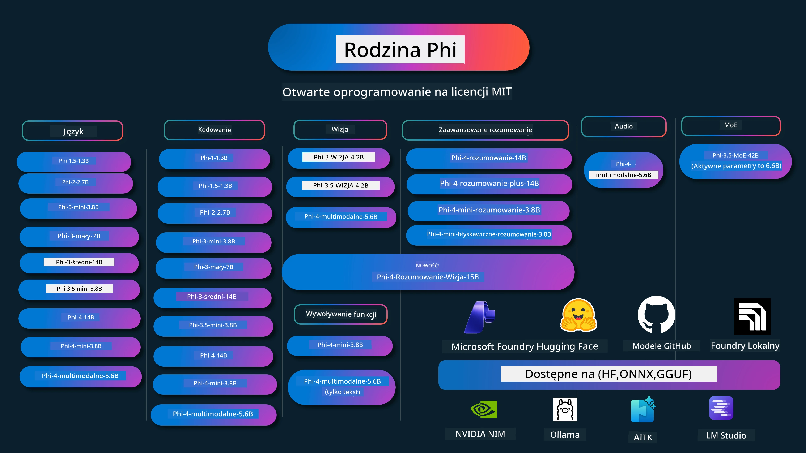

# Phi Cookbook: Praktyczne przykłady z modelami Phi firmy Microsoft

[](https://codespaces.new/microsoft/phicookbook)
[](https://vscode.dev/redirect?url=vscode://ms-vscode-remote.remote-containers/cloneInVolume?url=https://github.com/microsoft/phicookbook)

[](https://GitHub.com/microsoft/phicookbook/graphs/contributors/?WT.mc_id=aiml-137032-kinfeylo)
[](https://GitHub.com/microsoft/phicookbook/issues/?WT.mc_id=aiml-137032-kinfeylo)
[](https://GitHub.com/microsoft/phicookbook/pulls/?WT.mc_id=aiml-137032-kinfeylo)
[](http://makeapullrequest.com?WT.mc_id=aiml-137032-kinfeylo)

[](https://GitHub.com/microsoft/phicookbook/watchers/?WT.mc_id=aiml-137032-kinfeylo)
[](https://GitHub.com/microsoft/phicookbook/network/?WT.mc_id=aiml-137032-kinfeylo)
[](https://GitHub.com/microsoft/phicookbook/stargazers/?WT.mc_id=aiml-137032-kinfeylo)

[](https://discord.com/invite/ByRwuEEgH4)

Phi to seria otwartych modeli AI opracowanych przez Microsoft.

Phi jest obecnie najpotężniejszym i najbardziej opłacalnym małym modelem językowym (SLM), z bardzo dobrymi wynikami w wielu językach, wnioskowaniu, generowaniu tekstu/czatów, kodowaniu, obrazach, dźwięku i innych scenariuszach.

Możesz wdrożyć Phi w chmurze lub na urządzeniach edge i łatwo tworzyć aplikacje generatywnego AI przy ograniczonej mocy obliczeniowej.

Wykonaj poniższe kroki, aby rozpocząć korzystanie z tych zasobów:
1. **Rozgałęź repozytorium**: Kliknij [](https://GitHub.com/microsoft/phicookbook/network/?WT.mc_id=aiml-137032-kinfeylo)
2. **Sklonuj repozytorium**: `git clone https://github.com/microsoft/PhiCookBook.git`
3. [**Dołącz do Microsoft AI Discord Community i spotkaj ekspertów oraz innych deweloperów**](https://discord.com/invite/ByRwuEEgH4?WT.mc_id=aiml-137032-kinfeylo)



### 🌐 Wsparcie wielojęzyczne

#### Wspierane przez GitHub Action (zautomatyzowane i zawsze aktualne)

<!-- CO-OP TRANSLATOR LANGUAGES TABLE START -->
[Arabski](../ar/README.md) | [Bengalski](../bn/README.md) | [Bułgarski](../bg/README.md) | [Birmański (Myanmar)](../my/README.md) | [Chiński (uproszczony)](../zh-CN/README.md) | [Chiński (tradycyjny, Hongkong)](../zh-HK/README.md) | [Chiński (tradycyjny, Makau)](../zh-MO/README.md) | [Chiński (tradycyjny, Tajwan)](../zh-TW/README.md) | [Chorwacki](../hr/README.md) | [Czeski](../cs/README.md) | [Duński](../da/README.md) | [Holenderski](../nl/README.md) | [Estoński](../et/README.md) | [Fiński](../fi/README.md) | [Francuski](../fr/README.md) | [Niemiecki](../de/README.md) | [Grecki](../el/README.md) | [Hebrajski](../he/README.md) | [Hindi](../hi/README.md) | [Węgierski](../hu/README.md) | [Indonezyjski](../id/README.md) | [Włoski](../it/README.md) | [Japoński](../ja/README.md) | [Kannada](../kn/README.md) | [Khmer](../km/README.md) | [Koreański](../ko/README.md) | [Litewski](../lt/README.md) | [Malajski](../ms/README.md) | [Malajalam](../ml/README.md) | [Marathi](../mr/README.md) | [Nepalski](../ne/README.md) | [Nigeryjski Pidgin](../pcm/README.md) | [Norweski](../no/README.md) | [Perski (Farsi)](../fa/README.md) | [Polski](./README.md) | [Portugalski (Brazylia)](../pt-BR/README.md) | [Portugalski (Portugalia)](../pt-PT/README.md) | [Pendżabski (Gurmukhi)](../pa/README.md) | [Rumuński](../ro/README.md) | [Rosyjski](../ru/README.md) | [Serbski (cyrylica)](../sr/README.md) | [Słowacki](../sk/README.md) | [Słoweński](../sl/README.md) | [Hiszpański](../es/README.md) | [Suahili](../sw/README.md) | [Szwedzki](../sv/README.md) | [Tagalog (Filipiński)](../tl/README.md) | [Tamilski](../ta/README.md) | [Telugu](../te/README.md) | [Tajski](../th/README.md) | [Turecki](../tr/README.md) | [Ukraiński](../uk/README.md) | [Urdu](../ur/README.md) | [Wietnamski](../vi/README.md)

> **Wolisz klonować lokalnie?**
>
> To repozytorium zawiera ponad 50 tłumaczeń, co znacząco zwiększa rozmiar pobierania. Aby sklonować bez tłumaczeń, użyj sparse checkout:
>
> **Bash / macOS / Linux:**
> ```bash
> git clone --filter=blob:none --sparse https://github.com/microsoft/PhiCookBook.git
> cd PhiCookBook
> git sparse-checkout set --no-cone '/*' '!translations' '!translated_images'
> ```
>
> **CMD (Windows):**
> ```cmd
> git clone --filter=blob:none --sparse https://github.com/microsoft/PhiCookBook.git
> cd PhiCookBook
> git sparse-checkout set --no-cone "/*" "!translations" "!translated_images"
> ```
>
> Dzięki temu zyskasz wszystko, co potrzebne do ukończenia kursu, przy znacznie szybszym pobieraniu.
<!-- CO-OP TRANSLATOR LANGUAGES TABLE END -->

## Spis treści

- Wprowadzenie
  - [Witamy w rodzinie Phi](./md/01.Introduction/01/01.PhiFamily.md)
  - [Konfiguracja środowiska](./md/01.Introduction/01/01.EnvironmentSetup.md)
  - [Zrozumienie kluczowych technologii](./md/01.Introduction/01/01.Understandingtech.md)
  - [Bezpieczeństwo AI w modelach Phi](./md/01.Introduction/01/01.AISafety.md)
  - [Wsparcie sprzętowe Phi](./md/01.Introduction/01/01.Hardwaresupport.md)
  - [Modele Phi i ich dostępność na platformach](./md/01.Introduction/01/01.Edgeandcloud.md)
  - [Używanie Guidance-ai i Phi](./md/01.Introduction/01/01.Guidance.md)
  - [Modele na GitHub Marketplace](https://github.com/marketplace/models)
  - [Katalog modeli AI Azure](https://ai.azure.com)

- Wnioskowanie Phi w różnych środowiskach
    -  [Hugging face](./md/01.Introduction/02/01.HF.md)
    -  [Modele GitHub](./md/01.Introduction/02/02.GitHubModel.md)
    -  [Microsoft Foundry Model Catalog](./md/01.Introduction/02/03.AzureAIFoundry.md)
    -  [Ollama](./md/01.Introduction/02/04.Ollama.md)
    -  [Narzędzia AI VSCode (AITK)](./md/01.Introduction/02/05.AITK.md)
    -  [NVIDIA NIM](./md/01.Introduction/02/06.NVIDIA.md)
    -  [Foundry Local](./md/01.Introduction/02/07.FoundryLocal.md)

- Rodzina Wnioskowania Phi
    - [Wnioskowanie Phi na iOS](./md/01.Introduction/03/iOS_Inference.md)
    - [Wnioskowanie Phi na Android](./md/01.Introduction/03/Android_Inference.md)
    - [Wnioskowanie Phi na Jetson](./md/01.Introduction/03/Jetson_Inference.md)
    - [Wnioskowanie Phi na AI PC](./md/01.Introduction/03/AIPC_Inference.md)
    - [Wnioskowanie Phi z wykorzystaniem Apple MLX Framework](./md/01.Introduction/03/MLX_Inference.md)
    - [Wnioskowanie Phi na serwerze lokalnym](./md/01.Introduction/03/Local_Server_Inference.md)
    - [Wnioskowanie Phi na serwerze zdalnym przy użyciu AI Toolkit](./md/01.Introduction/03/Remote_Interence.md)
    - [Wnioskowanie Phi z Rust](./md/01.Introduction/03/Rust_Inference.md)
    - [Wnioskowanie Phi--Vision lokalnie](./md/01.Introduction/03/Vision_Inference.md)
    - [Wnioskowanie Phi z Kaito AKS, Azure Containers (oficjalne wsparcie)](./md/01.Introduction/03/Kaito_Inference.md)
-  [Kwantyzacja rodziny Phi](./md/01.Introduction/04/QuantifyingPhi.md)
    - [Kwantyzacja Phi-3.5 / 4 za pomocą llama.cpp](./md/01.Introduction/04/UsingLlamacppQuantifyingPhi.md)
    - [Kwantyzacja Phi-3.5 / 4 z rozszerzeniami generatywnego AI dla onnxruntime](./md/01.Introduction/04/UsingORTGenAIQuantifyingPhi.md)
    - [Kwantyzacja Phi-3.5 / 4 za pomocą Intel OpenVINO](./md/01.Introduction/04/UsingIntelOpenVINOQuantifyingPhi.md)
    - [Kwantyzacja Phi-3.5 / 4 za pomocą Apple MLX Framework](./md/01.Introduction/04/UsingAppleMLXQuantifyingPhi.md)

-  Ocena Phi
    - [AI odpowiedzialne](./md/01.Introduction/05/ResponsibleAI.md)
    - [Microsoft Foundry do oceny](./md/01.Introduction/05/AIFoundry.md)
    - [Użycie Promptflow do oceny](./md/01.Introduction/05/Promptflow.md)
 
- RAG z Azure AI Search
    - [Jak używać Phi-4-mini i Phi-4-multimodal(RAG) z Azure AI Search](https://github.com/microsoft/PhiCookBook/blob/main/code/06.E2E/E2E_Phi-4-RAG-Azure-AI-Search.ipynb)

- Przykłady tworzenia aplikacji Phi
  - Aplikacje tekstowe i czatowe
    - Przykłady Phi-4
      - [📓] [Czat z modelem Phi-4-mini ONNX](./md/02.Application/01.TextAndChat/Phi4/ChatWithPhi4ONNX/README.md)
      - [Czat z lokalnym modelem Phi-4 ONNX w .NET](../../md/04.HOL/dotnet/src/LabsPhi4-Chat-01OnnxRuntime)
      - [Konsolowa aplikacja czatu .NET z Phi-4 ONNX używająca Semantic Kernel](../../md/04.HOL/dotnet/src/LabsPhi4-Chat-02SK)
    - Przykłady Phi-3 / 3.5
      - [Lokalny chatbot w przeglądarce korzystający z Phi3, ONNX Runtime Web i WebGPU](https://github.com/microsoft/onnxruntime-inference-examples/tree/main/js/chat)
      - [OpenVino Chat](./md/02.Application/01.TextAndChat/Phi3/E2E_OpenVino_Chat.md)
      - [Multi Model - Interaktywny Phi-3-mini i OpenAI Whisper](./md/02.Application/01.TextAndChat/Phi3/E2E_Phi-3-mini_with_whisper.md)
      - [MLFlow - Tworzenie wrappera i używanie Phi-3 z MLFlow](./md//02.Application/01.TextAndChat/Phi3/E2E_Phi-3-MLflow.md)
      - [Optymalizacja Modelu - Jak zoptymalizować model Phi-3-min na ONNX Runtime Web z Olive](https://github.com/microsoft/Olive/tree/main/examples/phi3)
      - [Aplikacja WinUI3 z Phi-3 mini-4k-instruct-onnx](https://github.com/microsoft/Phi3-Chat-WinUI3-Sample/)
      -[WinUI3 Multi Model AI Powered Notes App Sample](https://github.com/microsoft/ai-powered-notes-winui3-sample)
      - [Dostrajanie i integracja niestandardowych modeli Phi-3 z Prompt flow](./md/02.Application/01.TextAndChat/Phi3/E2E_Phi-3-FineTuning_PromptFlow_Integration.md)
      - [Dostrajanie i integracja niestandardowych modeli Phi-3 z Prompt flow w Microsoft Foundry](./md/02.Application/01.TextAndChat/Phi3/E2E_Phi-3-FineTuning_PromptFlow_Integration_AIFoundry.md)
      - [Ocena dostrojonego modelu Phi-3 / Phi-3.5 w Microsoft Foundry z naciskiem na zasady odpowiedzialnej AI Microsoft](./md/02.Application/01.TextAndChat/Phi3/E2E_Phi-3-Evaluation_AIFoundry.md)
      - [📓] [Przykład przewidywania języka Phi-3.5-mini-instruct (chiński/angielski)](./md/02.Application/01.TextAndChat/Phi3/phi3-instruct-demo.ipynb)
      - [Phi-3.5-Instruct WebGPU RAG Chatbot](./md/02.Application/01.TextAndChat/Phi3/WebGPUWithPhi35Readme.md)
      - [Używanie GPU Windows do tworzenia rozwiązania Prompt flow z Phi-3.5-Instruct ONNX](./md/02.Application/01.TextAndChat/Phi3/UsingPromptFlowWithONNX.md)
      - [Używanie Microsoft Phi-3.5 tflite do tworzenia aplikacji na Android](./md/02.Application/01.TextAndChat/Phi3/UsingPhi35TFLiteCreateAndroidApp.md)
      - [Przykład Q&A .NET używający lokalnego modelu ONNX Phi-3 z Microsoft.ML.OnnxRuntime](../../md/04.HOL/dotnet/src/LabsPhi301)
      - [Konsolowa aplikacja chat .NET z Semantic Kernel i Phi-3](../../md/04.HOL/dotnet/src/LabsPhi302)

  - Przykłady kodu na bazie Azure AI Inference SDK 
    - Przykłady Phi-4 
      - [📓] [Generowanie kodu projektu używając Phi-4-multimodal](./md/02.Application/02.Code/Phi4/GenProjectCode/README.md)
    - Przykłady Phi-3 / 3.5
      - [Zbuduj własny Visual Studio Code GitHub Copilot Chat z rodziną Microsoft Phi-3](./md/02.Application/02.Code/Phi3/VSCodeExt/README.md)
      - [Stwórz własnego agenta chat Copilot dla Visual Studio Code z Phi-3.5 za pomocą modeli GitHub](/md/02.Application/02.Code/Phi3/CreateVSCodeChatAgentWithGitHubModels.md)

  - Zaawansowane przykłady rozumowania
    - Przykłady Phi-4 
      - [📓] [Przykłady Phi-4-mini-reasoning lub Phi-4-reasoning](./md/02.Application/03.AdvancedReasoning/Phi4/AdvancedResoningPhi4mini/README.md)
      - [📓] [Dostrajanie Phi-4-mini-reasoning z Microsoft Olive](./md/02.Application/03.AdvancedReasoning/Phi4/AdvancedResoningPhi4mini/olive_ft_phi_4_reasoning_with_medicaldata.ipynb)
      - [📓] [Dostrajanie Phi-4-mini-reasoning z Apple MLX](./md/02.Application/03.AdvancedReasoning/Phi4/AdvancedResoningPhi4mini/mlx_ft_phi_4_reasoning_with_medicaldata.ipynb)
      - [📓] [Phi-4-mini-reasoning z modelami z GitHub](./md/02.Application/02.Code/Phi4r/github_models_inference.ipynb)
      - [📓] [Phi-4-mini-reasoning z modelami Microsoft Foundry](./md/02.Application/02.Code/Phi4r/azure_models_inference.ipynb)
  - Dema
      - [Dema Phi-4-mini hostowane na Hugging Face Spaces](https://huggingface.co/spaces/microsoft/phi-4-mini?WT.mc_id=aiml-137032-kinfeylo)
      - [Dema Phi-4-multimodal hostowane na Hugginge Face Spaces](https://huggingface.co/spaces/microsoft/phi-4-multimodal?WT.mc_id=aiml-137032-kinfeylo)
  - Przykłady dla wizji
    - Przykłady Phi-4 
      - [📓] [Użyj Phi-4-multimodal do odczytu obrazów i generowania kodu](./md/02.Application/04.Vision/Phi4/CreateFrontend/README.md) 
    - Przykłady Phi-3 / 3.5
      -  [📓][Phi-3-vision-Obraz tekst na tekst](./md/02.Application/04.Vision/Phi3/E2E_Phi-3-vision-image-text-to-text-online-endpoint.ipynb)
      - [Phi-3-vision-ONNX](https://onnxruntime.ai/docs/genai/tutorials/phi3-v.html)
      - [📓][Phi-3-vision CLIP Embedding](./md/02.Application/04.Vision/Phi3/E2E_Phi-3-vision-image-text-to-text-online-endpoint.ipynb)
      - [DEMO: Phi-3 Recycling](https://github.com/jennifermarsman/PhiRecycling/)
      - [Phi-3-vision - wizualny asystent językowy - z Phi3-Vision i OpenVINO](https://docs.openvino.ai/nightly/notebooks/phi-3-vision-with-output.html)
      - [Phi-3 Vision Nvidia NIM](./md/02.Application/04.Vision/Phi3/E2E_Nvidia_NIM_Vision.md)
      - [Phi-3 Vision OpenVino](./md/02.Application/04.Vision/Phi3/E2E_OpenVino_Phi3Vision.md)
      - [📓][Phi-3.5 Vision próba wielu ramek lub wielu obrazów](./md/02.Application/04.Vision/Phi3/phi3-vision-demo.ipynb)
      - [Lokalny model Phi-3 Vision ONNX z Microsoft.ML.OnnxRuntime .NET](../../md/04.HOL/dotnet/src/LabsPhi303)
      - [Menu do lokalnego modelu Phi-3 Vision ONNX z Microsoft.ML.OnnxRuntime .NET](../../md/04.HOL/dotnet/src/LabsPhi304)

  - Przykłady Reasoning-Vision
    - Phi-4-Reasoning-Vision-15B 
      - [📓] [Użycie Phi-4-Reasoning-Vision-15B do wykrywania przechodzenia na czerwonym](./md/02.Application/10.ReasoningVision/Phi_4_reasoning_vision_15b_Jaywalking.ipynb)
      - [📓] [Użycie Phi-4-Reasoning-Vision-15B do matematyki](./md/02.Application/10.ReasoningVision/Phi_4_reasoning_vision_15b_Math.ipynb)
      - [📓] [Użycie Phi-4-Reasoning-Vision-15B do wykrywania UI](./md/02.Application/10.ReasoningVision/Phi_4_reasoning_vision_15b_ui.ipynb)

  - Przykłady matematyczne
    -  Przykłady Phi-4-Mini-Flash-Reasoning-Instruct  [Demo matematyczne z Phi-4-Mini-Flash-Reasoning-Instruct](./md/02.Application/09.Math/MathDemo.ipynb)

  - Przykłady audio
    - Przykłady Phi-4 
      - [📓] [Wyodrębnianie transkryptów audio z Phi-4-multimodal](./md/02.Application/05.Audio/Phi4/Transciption/README.md)
      - [📓] [Przykład audio Phi-4-multimodal](./md/02.Application/05.Audio/Phi4/Siri/demo.ipynb)
      - [📓] [Przykład tłumaczenia mowy Phi-4-multimodal](./md/02.Application/05.Audio/Phi4/Translate/demo.ipynb)
      - [Konsolowa aplikacja .NET używająca Phi-4-multimodal Audio do analizy pliku audio i generowania transkryptu](../../md/04.HOL/dotnet/src/LabsPhi4-MultiModal-02Audio)

  - Przykłady MOE
    - Przykłady Phi-3 / 3.5
      - [📓] [Modele mieszaniny ekspertów Phi-3.5 (MoEs) - przykład dla mediów społecznościowych](./md/02.Application/06.MoE/Phi3/phi3_moe_demo.ipynb)
      - [📓] [Budowanie pipeline Retrieval-Augmented Generation (RAG) z NVIDIA NIM Phi-3 MOE, Azure AI Search i LlamaIndex](./md/02.Application/06.MoE/Phi3/azure-ai-search-nvidia-rag.ipynb)
      - 
  - Przykłady wywoływania funkcji
    - Przykłady Phi-4 🆕
      -  [📓] [Użycie wywoływania funkcji z Phi-4-mini](./md/02.Application/07.FunctionCalling/Phi4/FunctionCallingBasic/README.md)
      -  [📓] [Użycie wywoływania funkcji do tworzenia multi-agentów z Phi-4-mini](./md/02.Application/07.FunctionCalling/Phi4/Multiagents/Phi_4_mini_multiagent.ipynb)
      -  [📓] [Użycie wywoływania funkcji z Ollama](./md/02.Application/07.FunctionCalling/Phi4/Ollama/ollama_functioncalling.ipynb)
      -  [📓] [Użycie wywoływania funkcji z ONNX](./md/02.Application/07.FunctionCalling/Phi4/ONNX/onnx_parallel_functioncalling.ipynb)
  - Przykłady mieszania multimodalnego
    - Przykłady Phi-4 🆕
      -  [📓] [Użycie Phi-4-multimodal jako dziennikarza technologicznego](./md/02.Application/08.Multimodel/Phi4/TechJournalist/phi_4_mm_audio_text_publish_news.ipynb)
      - [Konsolowa aplikacja .NET używająca Phi-4-multimodal do analizy obrazów](../../md/04.HOL/dotnet/src/LabsPhi4-MultiModal-01Images)

- Dostrajanie próbek Phi
  - [Scenariusze dostrajania](./md/03.FineTuning/FineTuning_Scenarios.md)
  - [Dostrajanie vs RAG](./md/03.FineTuning/FineTuning_vs_RAG.md)
  - [Dostrajanie: Niech Phi-3 stanie się ekspertem branżowym](./md/03.FineTuning/LetPhi3gotoIndustriy.md)
  - [Dostrajanie Phi-3 z AI Toolkit dla VS Code](./md/03.FineTuning/Finetuning_VSCodeaitoolkit.md)
  - [Dostrajanie Phi-3 z Azure Machine Learning Service](./md/03.FineTuning/Introduce_AzureML.md)
  - [Dostrajanie Phi-3 z Lora](./md/03.FineTuning/FineTuning_Lora.md)
  - [Dostrajanie Phi-3 z QLora](./md/03.FineTuning/FineTuning_Qlora.md)
  - [Dostrajanie Phi-3 z Microsoft Foundry](./md/03.FineTuning/FineTuning_AIFoundry.md)
  - [Dostrajanie Phi-3 z Azure ML CLI/SDK](./md/03.FineTuning/FineTuning_MLSDK.md)
  - [Dostrajanie z Microsoft Olive](./md/03.FineTuning/FineTuning_MicrosoftOlive.md)
  - [Dostrajanie z Microsoft Olive Hands-On Lab](./md/03.FineTuning/olive-lab/readme.md)
  - [Dostrajanie Phi-3-vision z Weights and Bias](./md/03.FineTuning/FineTuning_Phi-3-visionWandB.md)
  - [Dostrajanie Phi-3 z Apple MLX Framework](./md/03.FineTuning/FineTuning_MLX.md)
  - [Dostrajanie Phi-3-vision (oficjalne wsparcie)](./md/03.FineTuning/FineTuning_Vision.md)
  - [Dostrajanie Phi-3 z Kaito AKS, Azure Containers (oficjalne wsparcie)](./md/03.FineTuning/FineTuning_Kaito.md)
  - [Dostrajanie Phi-3 i 3.5 Vision](https://github.com/2U1/Phi3-Vision-Finetune)

- Warsztaty praktyczne
  - [Eksploracja najnowocześniejszych modeli: LLM, SLM, lokalny rozwój i więcej](https://github.com/microsoft/aitour-exploring-cutting-edge-models)
  - [Odblokowanie potencjału NLP: dostrajanie z Microsoft Olive](https://github.com/azure/Ignite_FineTuning_workshop)

- Prace badawcze i publikacje akademickie
  - [Textbooks Are All You Need II: raport techniczny phi-1.5](https://arxiv.org/abs/2309.05463)
  - [Raport techniczny Phi-3: wysoce zaawansowany model językowy lokalnie na Twoim telefonie](https://arxiv.org/abs/2404.14219)
  - [Raport techniczny Phi-4](https://arxiv.org/abs/2412.08905)
  - [Raport techniczny Phi-4-Mini: kompaktowe, lecz potężne multimodalne modele językowe z użyciem Mixture-of-LoRAs](https://arxiv.org/abs/2503.01743)
  - [Optymalizacja małych modeli językowych do wywoływania funkcji w pojeździe](https://arxiv.org/abs/2501.02342)
  - [(WhyPHI) Dostrajanie PHI-3 do odpowiadania na pytania wielokrotnego wyboru: metodologia, wyniki i wyzwania](https://arxiv.org/abs/2501.01588)
  - [Raport techniczny Phi-4-reasoning](https://www.microsoft.com/en-us/research/wp-content/uploads/2025/04/phi_4_reasoning.pdf)
  - [Raport techniczny Phi-4-mini-reasoning](https://huggingface.co/microsoft/Phi-4-mini-reasoning/blob/main/Phi-4-Mini-Reasoning.pdf)

## Korzystanie z modeli Phi

### Phi na Microsoft Foundry

Możesz nauczyć się, jak korzystać z Microsoft Phi i jak budować kompleksowe rozwiązania na różnych urządzeniach sprzętowych. Aby osobiście doświadczyć Phi, zacznij od zabawy z modelami i dostosowywania Phi do swoich scenariuszy za pomocą [Microsoft Foundry Azure AI Model Catalog](https://aka.ms/phi3-azure-ai). Więcej informacji znajdziesz w przewodniku Rozpoczęcie pracy z [Microsoft Foundry](/md/02.QuickStart/AzureAIFoundry_QuickStart.md).

**Plac zabaw**  
Każdy model ma dedykowany plac zabaw do testowania modelu [Azure AI Playground](https://aka.ms/try-phi3).

### Phi na modelach GitHub

Możesz nauczyć się, jak korzystać z Microsoft Phi i jak budować kompleksowe rozwiązania na różnych urządzeniach sprzętowych. Aby osobiście doświadczyć Phi, zacznij od zabawy z modelem i dostosowywania Phi do swoich scenariuszy za pomocą [GitHub Model Catalog](https://github.com/marketplace/models?WT.mc_id=aiml-137032-kinfeylo). Więcej informacji znajdziesz w przewodniku Rozpoczęcie pracy z [GitHub Model Catalog](/md/02.QuickStart/GitHubModel_QuickStart.md).

**Plac zabaw**  
Każdy model ma dedykowany [plac zabaw do testowania modelu](/md/02.QuickStart/GitHubModel_QuickStart.md).

### Phi na Hugging Face

Model jest również dostępny na [Hugging Face](https://huggingface.co/microsoft).

**Plac zabaw**  
[Hugging Chat playground](https://huggingface.co/chat/models/microsoft/Phi-3-mini-4k-instruct)

## 🎒 Inne kursy

Nasz zespół tworzy też inne kursy! Sprawdź:

<!-- CO-OP TRANSLATOR OTHER COURSES START -->
### LangChain
[](https://aka.ms/langchain4j-for-beginners)
[](https://aka.ms/langchainjs-for-beginners?WT.mc_id=m365-94501-dwahlin)
[](https://github.com/microsoft/langchain-for-beginners?WT.mc_id=m365-94501-dwahlin)
---

### Azure / Edge / MCP / Agenci
[](https://github.com/microsoft/AZD-for-beginners?WT.mc_id=academic-105485-koreyst)
[](https://github.com/microsoft/edgeai-for-beginners?WT.mc_id=academic-105485-koreyst)
[](https://github.com/microsoft/mcp-for-beginners?WT.mc_id=academic-105485-koreyst)
[](https://github.com/microsoft/ai-agents-for-beginners?WT.mc_id=academic-105485-koreyst)

---

### Seria Generative AI
[](https://github.com/microsoft/generative-ai-for-beginners?WT.mc_id=academic-105485-koreyst)
[-9333EA?style=for-the-badge&labelColor=E5E7EB&color=9333EA)](https://github.com/microsoft/Generative-AI-for-beginners-dotnet?WT.mc_id=academic-105485-koreyst)
[-C084FC?style=for-the-badge&labelColor=E5E7EB&color=C084FC)](https://github.com/microsoft/generative-ai-for-beginners-java?WT.mc_id=academic-105485-koreyst)
[-E879F9?style=for-the-badge&labelColor=E5E7EB&color=E879F9)](https://github.com/microsoft/generative-ai-with-javascript?WT.mc_id=academic-105485-koreyst)

---

### Podstawowa nauka
[](https://aka.ms/ml-beginners?WT.mc_id=academic-105485-koreyst)
[](https://aka.ms/datascience-beginners?WT.mc_id=academic-105485-koreyst)
[](https://aka.ms/ai-beginners?WT.mc_id=academic-105485-koreyst)
[](https://github.com/microsoft/Security-101?WT.mc_id=academic-96948-sayoung)
[](https://aka.ms/webdev-beginners?WT.mc_id=academic-105485-koreyst)
[](https://aka.ms/iot-beginners?WT.mc_id=academic-105485-koreyst)
[](https://github.com/microsoft/xr-development-for-beginners?WT.mc_id=academic-105485-koreyst)

---

### Seria Copilot
[](https://aka.ms/GitHubCopilotAI?WT.mc_id=academic-105485-koreyst)
[](https://github.com/microsoft/mastering-github-copilot-for-dotnet-csharp-developers?WT.mc_id=academic-105485-koreyst)
[](https://github.com/microsoft/CopilotAdventures?WT.mc_id=academic-105485-koreyst)
<!-- CO-OP TRANSLATOR OTHER COURSES END -->

## Odpowiedzialne AI

Microsoft zobowiązuje się do pomocy klientom w odpowiedzialnym korzystaniu z naszych produktów AI, dzielenia się naszymi doświadczeniami oraz budowania partnerstw opartych na zaufaniu przy pomocy narzędzi takich jak Transparency Notes i Impact Assessments. Wiele z tych zasobów można znaleźć pod adresem [https://aka.ms/RAI](https://aka.ms/RAI).  
Podejście Microsoft do odpowiedzialnej AI opiera się na naszych zasadach AI: uczciwości, niezawodności i bezpieczeństwie, prywatności i ochronie, integracyjności, przejrzystości oraz odpowiedzialności.

Duże modele językowe, obrazowe i mowy - takie jak te używane w tym przykładzie - mogą potencjalnie zachowywać się w sposób nieuczciwy, niespójny lub obraźliwy, co może powodować szkody. Prosimy o zapoznanie się z [Notatką transparentności usługi Azure OpenAI](https://learn.microsoft.com/legal/cognitive-services/openai/transparency-note?tabs=text), aby zostać poinformowanym o ryzykach i ograniczeniach.
Zalecanym podejściem do łagodzenia tych ryzyk jest uwzględnienie w architekturze systemu bezpieczeństwa, który potrafi wykrywać i zapobiegać szkodliwemu zachowaniu. [Azure AI Content Safety](https://learn.microsoft.com/azure/ai-services/content-safety/overview) zapewnia niezależną warstwę ochrony, zdolną do wykrywania szkodliwych treści generowanych przez użytkowników i AI w aplikacjach i usługach. Azure AI Content Safety obejmuje API do analizy tekstu i obrazów, które pozwalają wykrywać materiały szkodliwe. W ramach Microsoft Foundry, usługa Content Safety umożliwia przeglądanie, eksplorowanie oraz wypróbowywanie przykładowego kodu do wykrywania szkodliwych treści w różnych modalnościach. Następująca [dokumentacja szybkiego startu](https://learn.microsoft.com/azure/ai-services/content-safety/quickstart-text?tabs=visual-studio%2Clinux&pivots=programming-language-rest) przeprowadzi Cię przez proces wysyłania zapytań do usługi.

Innym aspektem, który należy uwzględnić, jest ogólna wydajność aplikacji. W przypadku aplikacji multimodalnych i wielomodelowych wydajność oznacza, że system działa zgodnie z oczekiwaniami twoimi i twoich użytkowników, w tym nie generuje szkodliwych wyników. Ważne jest, aby ocenić wydajność całej aplikacji za pomocą [evaluatorów wydajności, jakości oraz ryzyka i bezpieczeństwa](https://learn.microsoft.com/azure/ai-studio/concepts/evaluation-metrics-built-in). Masz również możliwość tworzenia i oceniania za pomocą [evaluatorów niestandardowych](https://learn.microsoft.com/azure/ai-studio/how-to/develop/evaluate-sdk#custom-evaluators).

Możesz ocenić swoją aplikację AI w środowisku deweloperskim za pomocą [Azure AI Evaluation SDK](https://microsoft.github.io/promptflow/index.html). Mając zestaw danych testowych lub cel, generacje Twojej aplikacji generatywnej AI są mierzone ilościowo za pomocą wbudowanych evaluatorów lub wybranych evaluatorów niestandardowych. Aby zacząć korzystać z azure ai evaluation sdk do oceny Twojego systemu, możesz skorzystać z [przewodnika szybkiego startu](https://learn.microsoft.com/azure/ai-studio/how-to/develop/flow-evaluate-sdk). Po wykonaniu uruchomienia oceny możesz [wizualizować wyniki w Microsoft Foundry](https://learn.microsoft.com/azure/ai-studio/how-to/evaluate-flow-results). 

## Znaki towarowe

Projekt ten może zawierać znaki towarowe lub logotypy projektów, produktów lub usług. Autoryzowane użycie znaków towarowych lub logotypów Microsoft musi podlegać i przestrzegać [Wytycznych dotyczących znaków towarowych i marek Microsoft](https://www.microsoft.com/legal/intellectualproperty/trademarks/usage/general).  
Użycie znaków towarowych lub logotypów Microsoft w zmodyfikowanych wersjach tego projektu nie może powodować nieporozumień ani sugerować sponsorowania przez Microsoft. Każde użycie znaków towarowych lub logotypów stron trzecich podlega zasadom tych stron trzecich.

## Uzyskanie pomocy

Jeśli napotkasz problemy lub masz pytania dotyczące tworzenia aplikacji AI, dołącz do:

[](https://aka.ms/foundry/discord)

Jeśli masz opinie o produkcie lub zgłaszasz błędy podczas tworzenia, odwiedź:

[](https://aka.ms/foundry/forum)

---

<!-- CO-OP TRANSLATOR DISCLAIMER START -->
**Zastrzeżenie**:
Niniejszy dokument został przetłumaczony za pomocą usługi tłumaczenia AI [Co-op Translator](https://github.com/Azure/co-op-translator). Chociaż dokładamy starań, aby tłumaczenie było jak najbardziej precyzyjne, prosimy mieć na uwadze, że automatyczne tłumaczenia mogą zawierać błędy lub niedokładności. Oryginalny dokument w języku źródłowym powinien być uznawany za wiążące źródło informacji. W przypadku krytycznych informacji zalecane jest korzystanie z profesjonalnego tłumaczenia wykonanego przez człowieka. Nie ponosimy odpowiedzialności za jakiekolwiek nieporozumienia lub błędną interpretację wynikające z korzystania z tego tłumaczenia.
<!-- CO-OP TRANSLATOR DISCLAIMER END -->