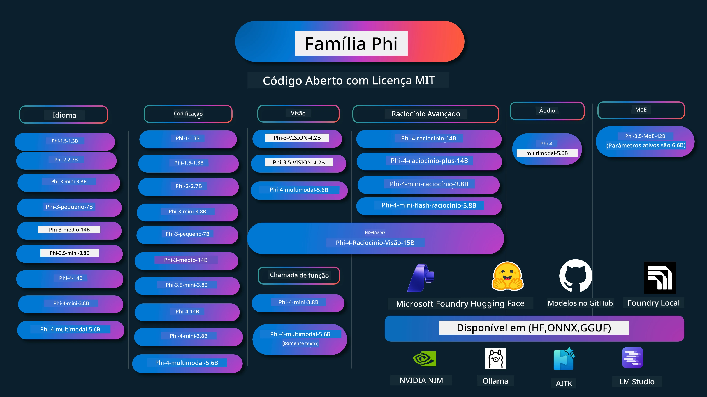

# Cookbook Phi: Exemplos Práticos com os Modelos Phi da Microsoft

[](https://codespaces.new/microsoft/phicookbook)
[](https://vscode.dev/redirect?url=vscode://ms-vscode-remote.remote-containers/cloneInVolume?url=https://github.com/microsoft/phicookbook)

[](https://GitHub.com/microsoft/phicookbook/graphs/contributors/?WT.mc_id=aiml-137032-kinfeylo)
[](https://GitHub.com/microsoft/phicookbook/issues/?WT.mc_id=aiml-137032-kinfeylo)
[](https://GitHub.com/microsoft/phicookbook/pulls/?WT.mc_id=aiml-137032-kinfeylo)
[](http://makeapullrequest.com?WT.mc_id=aiml-137032-kinfeylo)

[](https://GitHub.com/microsoft/phicookbook/watchers/?WT.mc_id=aiml-137032-kinfeylo)
[](https://GitHub.com/microsoft/phicookbook/network/?WT.mc_id=aiml-137032-kinfeylo)
[](https://GitHub.com/microsoft/phicookbook/stargazers/?WT.mc_id=aiml-137032-kinfeylo)

[](https://discord.com/invite/ByRwuEEgH4)

Phi é uma série de modelos de IA open source desenvolvidos pela Microsoft.

Atualmente, Phi é o modelo de linguagem pequena (SLM) mais poderoso e econômico, com excelentes benchmarks em múltiplos idiomas, raciocínio, geração de texto/chat, codificação, imagens, áudio e outros cenários.

Você pode implantar Phi na nuvem ou em dispositivos de borda, e construir facilmente aplicações de IA generativa com poder computacional limitado.

Siga estes passos para começar a usar estes recursos:
1. **Faça um fork do repositório**: Clique [](https://GitHub.com/microsoft/phicookbook/network/?WT.mc_id=aiml-137032-kinfeylo)
2. **Clone o repositório**: `git clone https://github.com/microsoft/PhiCookBook.git`
3. [**Junte-se à Comunidade Discord da Microsoft AI e conheça especialistas e outros desenvolvedores**](https://discord.com/invite/ByRwuEEgH4?WT.mc_id=aiml-137032-kinfeylo)



### 🌐 Suporte Multilíngue

#### Suportado via GitHub Action (Automatizado e Sempre Atualizado)

<!-- CO-OP TRANSLATOR LANGUAGES TABLE START -->
[Árabe](../ar/README.md) | [Bengali](../bn/README.md) | [Búlgaro](../bg/README.md) | [Birmanês (Myanmar)](../my/README.md) | [Chinês (Simplificado)](../zh-CN/README.md) | [Chinês (Tradicional, Hong Kong)](../zh-HK/README.md) | [Chinês (Tradicional, Macau)](../zh-MO/README.md) | [Chinês (Tradicional, Taiwan)](../zh-TW/README.md) | [Croata](../hr/README.md) | [Tcheco](../cs/README.md) | [Dinamarquês](../da/README.md) | [Holandês](../nl/README.md) | [Estoniano](../et/README.md) | [Finlandês](../fi/README.md) | [Francês](../fr/README.md) | [Alemão](../de/README.md) | [Grego](../el/README.md) | [Hebraico](../he/README.md) | [Hindi](../hi/README.md) | [Húngaro](../hu/README.md) | [Indonésio](../id/README.md) | [Italiano](../it/README.md) | [Japonês](../ja/README.md) | [Kannada](../kn/README.md) | [Coreano](../ko/README.md) | [Lituano](../lt/README.md) | [Malaio](../ms/README.md) | [Malaiala](../ml/README.md) | [Marata](../mr/README.md) | [Nepali](../ne/README.md) | [Pidgin Nigeriano](../pcm/README.md) | [Norueguês](../no/README.md) | [Persa (Farsi)](../fa/README.md) | [Polonês](../pl/README.md) | [Português (Brasil)](./README.md) | [Português (Portugal)](../pt-PT/README.md) | [Punjabi (Gurmukhi)](../pa/README.md) | [Romeno](../ro/README.md) | [Russo](../ru/README.md) | [Sérvio (Cirílico)](../sr/README.md) | [Eslovaco](../sk/README.md) | [Esloveno](../sl/README.md) | [Espanhol](../es/README.md) | [Suaíli](../sw/README.md) | [Sueco](../sv/README.md) | [Tagalog (Filipino)](../tl/README.md) | [Tâmil](../ta/README.md) | [Telugu](../te/README.md) | [Tailandês](../th/README.md) | [Turco](../tr/README.md) | [Ucraniano](../uk/README.md) | [Urdu](../ur/README.md) | [Vietnamita](../vi/README.md)

> **Prefere clonar localmente?**
>
> Este repositório inclui traduções para mais de 50 idiomas, o que aumenta significativamente o tamanho do download. Para clonar sem traduções, use checkout esparso:
>
> **Bash / macOS / Linux:**
> ```bash
> git clone --filter=blob:none --sparse https://github.com/microsoft/PhiCookBook.git
> cd PhiCookBook
> git sparse-checkout set --no-cone '/*' '!translations' '!translated_images'
> ```
>
> **CMD (Windows):**
> ```cmd
> git clone --filter=blob:none --sparse https://github.com/microsoft/PhiCookBook.git
> cd PhiCookBook
> git sparse-checkout set --no-cone "/*" "!translations" "!translated_images"
> ```
>
> Isso fornece tudo que você precisa para completar o curso com um download muito mais rápido.
<!-- CO-OP TRANSLATOR LANGUAGES TABLE END -->

## Índice
- Introdução - [Bem-vindo à Família Phi](./md/01.Introduction/01/01.PhiFamily.md) - [Configurando seu ambiente](./md/01.Introduction/01/01.EnvironmentSetup.md) - [Entendendo Tecnologias-Chave](./md/01.Introduction/01/01.Understandingtech.md) - [Segurança em IA para Modelos Phi](./md/01.Introduction/01/01.AISafety.md) - [Suporte de Hardware Phi](./md/01.Introduction/01/01.Hardwaresupport.md) - [Modelos Phi e Disponibilidade em várias plataformas](./md/01.Introduction/01/01.Edgeandcloud.md) - [Usando Guidance-ai e Phi](./md/01.Introduction/01/01.Guidance.md) - [Modelos GitHub Marketplace](https://github.com/marketplace/models) - [Catálogo de Modelos AI do Azure](https://ai.azure.com) - Inferência Phi em diferentes ambientes - [Hugging face](./md/01.Introduction/02/01.HF.md) - [Modelos GitHub](./md/01.Introduction/02/02.GitHubModel.md) - [Catálogo de Modelos Microsoft Foundry](./md/01.Introduction/02/03.AzureAIFoundry.md) - [Ollama](./md/01.Introduction/02/04.Ollama.md) - [AI Toolkit VSCode (AITK)](./md/01.Introduction/02/05.AITK.md) - [NVIDIA NIM](./md/01.Introduction/02/06.NVIDIA.md) - [Foundry Local](./md/01.Introduction/02/07.FoundryLocal.md) - Inferência Família Phi - [Inferência Phi no iOS](./md/01.Introduction/03/iOS_Inference.md) - [Inferência Phi no Android](./md/01.Introduction/03/Android_Inference.md) - [Inferência Phi no Jetson](./md/01.Introduction/03/Jetson_Inference.md) - [Inferência Phi no PC de IA](./md/01.Introduction/03/AIPC_Inference.md) - [Inferência Phi com Apple MLX Framework](./md/01.Introduction/03/MLX_Inference.md) - [Inferência Phi em Servidor Local](./md/01.Introduction/03/Local_Server_Inference.md) - [Inferência Phi em Servidor Remoto usando AI Toolkit](./md/01.Introduction/03/Remote_Interence.md) - [Inferência Phi com Rust](./md/01.Introduction/03/Rust_Inference.md) - [Inferência Phi--Visão Local](./md/01.Introduction/03/Vision_Inference.md) - [Inferência Phi com Kaito AKS, Contêineres Azure (suporte oficial)](./md/01.Introduction/03/Kaito_Inference.md) - [Quantificando Família Phi](./md/01.Introduction/04/QuantifyingPhi.md) - [Quantizando Phi-3.5 / 4 usando llama.cpp](./md/01.Introduction/04/UsingLlamacppQuantifyingPhi.md) - [Quantizando Phi-3.5 / 4 usando Extensões de IA Generativa para onnxruntime](./md/01.Introduction/04/UsingORTGenAIQuantifyingPhi.md) - [Quantizando Phi-3.5 / 4 usando Intel OpenVINO](./md/01.Introduction/04/UsingIntelOpenVINOQuantifyingPhi.md) - [Quantizando Phi-3.5 / 4 usando Apple MLX Framework](./md/01.Introduction/04/UsingAppleMLXQuantifyingPhi.md) - Avaliação Phi - [IA Responsável](./md/01.Introduction/05/ResponsibleAI.md) - [Microsoft Foundry para Avaliação](./md/01.Introduction/05/AIFoundry.md) - [Usando Promptflow para Avaliação](./md/01.Introduction/05/Promptflow.md) - RAG com Azure AI Search - [Como usar Phi-4-mini e Phi-4-multimodal (RAG) com Azure AI Search](https://github.com/microsoft/PhiCookBook/blob/main/code/06.E2E/E2E_Phi-4-RAG-Azure-AI-Search.ipynb) - Exemplos de desenvolvimento de aplicações Phi - Aplicações de Texto e Chat - Exemplos Phi-4 - [📓] [Chat com Modelo ONNX Phi-4-mini](./md/02.Application/01.TextAndChat/Phi4/ChatWithPhi4ONNX/README.md) - [Chat com Modelo ONNX Phi-4 local .NET](../../md/04.HOL/dotnet/src/LabsPhi4-Chat-01OnnxRuntime) - [App Console Chat .NET com Phi-4 ONNX usando Semantic Kernel](../../md/04.HOL/dotnet/src/LabsPhi4-Chat-02SK) - Exemplos Phi-3 / 3.5 - [Chatbot local no navegador usando Phi3, ONNX Runtime Web e WebGPU](https://github.com/microsoft/onnxruntime-inference-examples/tree/main/js/chat) - [Chat OpenVino](./md/02.Application/01.TextAndChat/Phi3/E2E_OpenVino_Chat.md) - [Modelo Múltiplo - Phi-3-mini interativo e OpenAI Whisper](./md/02.Application/01.TextAndChat/Phi3/E2E_Phi-3-mini_with_whisper.md) - [MLFlow - Construindo um wrapper e usando Phi-3 com MLFlow](./md//02.Application/01.TextAndChat/Phi3/E2E_Phi-3-MLflow.md) - [Otimização de Modelo - Como otimizar o modelo Phi-3-min para ONNX Runtime Web com Olive](https://github.com/microsoft/Olive/tree/main/examples/phi3) - [App WinUI3 com Phi-3 mini-4k-instruct-onnx](https://github.com/microsoft/Phi3-Chat-WinUI3-Sample/) -[Exemplo de App de Notas AI Powered Multi Model WinUI3](https://github.com/microsoft/ai-powered-notes-winui3-sample) - [Fine-tune e Integre modelos Phi-3 personalizados com Prompt flow](./md/02.Application/01.TextAndChat/Phi3/E2E_Phi-3-FineTuning_PromptFlow_Integration.md) - [Fine-tune e Integre modelos Phi-3 personalizados com Prompt flow no Microsoft Foundry](./md/02.Application/01.TextAndChat/Phi3/E2E_Phi-3-FineTuning_PromptFlow_Integration_AIFoundry.md) - [Avalie o modelo Phi-3 / Phi-3.5 Fine-tuned no Microsoft Foundry focando nos Princípios de IA Responsável da Microsoft](./md/02.Application/01.TextAndChat/Phi3/E2E_Phi-3-Evaluation_AIFoundry.md) - [📓] [Exemplo de predição linguística Phi-3.5-mini-instruct (Chinês/Inglês)](./md/02.Application/01.TextAndChat/Phi3/phi3-instruct-demo.ipynb) - [Chatbot WebGPU Phi-3.5-Instruct RAG](./md/02.Application/01.TextAndChat/Phi3/WebGPUWithPhi35Readme.md) - [Usando GPU do Windows para criar solução Prompt flow com Phi-3.5-Instruct ONNX](./md/02.Application/01.TextAndChat/Phi3/UsingPromptFlowWithONNX.md) - [Usando Microsoft Phi-3.5 tflite para criar app Android](./md/02.Application/01.TextAndChat/Phi3/UsingPhi35TFLiteCreateAndroidApp.md) - [Exemplo Q&A .NET usando modelo ONNX Phi-3 local com Microsoft.ML.OnnxRuntime](../../md/04.HOL/dotnet/src/LabsPhi301) - [App Console chat .NET com Semantic Kernel e Phi-3](../../md/04.HOL/dotnet/src/LabsPhi302) - Exemplos de código com Azure AI Inference SDK - Exemplos Phi-4 - [📓] [Gerar código de projeto usando Phi-4-multimodal](./md/02.Application/02.Code/Phi4/GenProjectCode/README.md) - Exemplos Phi-3 / 3.5 - [Construa seu próprio GitHub Copilot Chat do Visual Studio Code com Microsoft Phi-3 Family](./md/02.Application/02.Code/Phi3/VSCodeExt/README.md) - [Crie seu próprio Agente Chat Copilot no Visual Studio Code com Phi-3.5 usando Modelos GitHub](/md/02.Application/02.Code/Phi3/CreateVSCodeChatAgentWithGitHubModels.md) - Exemplos de Raciocínio Avançado - Exemplos Phi-4 - [📓] [Amostras Phi-4-mini-reasoning ou Phi-4-reasoning](./md/02.Application/03.AdvancedReasoning/Phi4/AdvancedResoningPhi4mini/README.md) - [📓] [Fine-tuning Phi-4-mini-reasoning com Microsoft Olive](./md/02.Application/03.AdvancedReasoning/Phi4/AdvancedResoningPhi4mini/olive_ft_phi_4_reasoning_with_medicaldata.ipynb) - [📓] [Fine-tuning Phi-4-mini-reasoning com Apple MLX](./md/02.Application/03.AdvancedReasoning/Phi4/AdvancedResoningPhi4mini/mlx_ft_phi_4_reasoning_with_medicaldata.ipynb) - [📓] [Phi-4-mini-reasoning com Modelos GitHub](./md/02.Application/02.Code/Phi4r/github_models_inference.ipynb) - [📓] [Phi-4-mini-reasoning com Modelos Microsoft Foundry](./md/02.Application/02.Code/Phi4r/azure_models_inference.ipynb) -
Demos - [Demos Phi-4-mini hospedados no Hugging Face Spaces](https://huggingface.co/spaces/microsoft/phi-4-mini?WT.mc_id=aiml-137032-kinfeylo) - [Demos Phi-4-multimodal hospedados no Hugginge Face Spaces](https://huggingface.co/spaces/microsoft/phi-4-multimodal?WT.mc_id=aiml-137032-kinfeylo) - Amostras de Visão - Amostras Phi-4 - [📓] [Use Phi-4-multimodal para ler imagens e gerar código](./md/02.Application/04.Vision/Phi4/CreateFrontend/README.md) - Amostras Phi-3 / 3.5 - [📓][Phi-3-vision-Texto de imagem para texto](./md/02.Application/04.Vision/Phi3/E2E_Phi-3-vision-image-text-to-text-online-endpoint.ipynb) - [Phi-3-vision-ONNX](https://onnxruntime.ai/docs/genai/tutorials/phi3-v.html) - [📓][Incorporação CLIP Phi-3-vision](./md/02.Application/04.Vision/Phi3/E2E_Phi-3-vision-image-text-to-text-online-endpoint.ipynb) - [DEMO: Phi-3 Recycling](https://github.com/jennifermarsman/PhiRecycling/) - [Phi-3-vision - Assistente de linguagem visual - com Phi3-Vision e OpenVINO](https://docs.openvino.ai/nightly/notebooks/phi-3-vision-with-output.html) - [Phi-3 Vision Nvidia NIM](./md/02.Application/04.Vision/Phi3/E2E_Nvidia_NIM_Vision.md) - [Phi-3 Vision OpenVino](./md/02.Application/04.Vision/Phi3/E2E_OpenVino_Phi3Vision.md) - [📓][Amostra Phi-3.5 Vision multi-quadro ou multi-imagem](./md/02.Application/04.Vision/Phi3/phi3-vision-demo.ipynb) - [Modelo ONNX local Phi-3 Vision usando Microsoft.ML.OnnxRuntime .NET](../../md/04.HOL/dotnet/src/LabsPhi303) - [Modelo ONNX local Phi-3 Vision baseado em menu usando Microsoft.ML.OnnxRuntime .NET](../../md/04.HOL/dotnet/src/LabsPhi304) - Amostras de Raciocínio-Visão - Phi-4-Reasoning-Vision-15B - [📓] [Usando Phi-4-Reasoning-Vision-15B para detectar passagem perigosa](./md/02.Application/10.ReasoningVision/Phi_4_reasoning_vision_15b_Jaywalking.ipynb) - [📓] [Usando Phi-4-Reasoning-Vision-15B para matemática](./md/02.Application/10.ReasoningVision/Phi_4_reasoning_vision_15b_Math.ipynb) - [📓] [Usando Phi-4-Reasoning-Vision-15B para detectar UI](./md/02.Application/10.ReasoningVision/Phi_4_reasoning_vision_15b_ui.ipynb) - Amostras de Matemática - Amostras Phi-4-Mini-Flash-Reasoning-Instruct [Demonstração de Matemática com Phi-4-Mini-Flash-Reasoning-Instruct](./md/02.Application/09.Math/MathDemo.ipynb) - Amostras de Áudio - Amostras Phi-4 - [📓] [Extraindo transcrições de áudio usando Phi-4-multimodal](./md/02.Application/05.Audio/Phi4/Transciption/README.md) - [📓] [Amostra de Áudio Phi-4-multimodal](./md/02.Application/05.Audio/Phi4/Siri/demo.ipynb) - [📓] [Amostra de Tradução de Fala Phi-4-multimodal](./md/02.Application/05.Audio/Phi4/Translate/demo.ipynb) - [Aplicação console .NET usando Phi-4-multimodal Áudio para analisar um arquivo de áudio e gerar transcrição](../../md/04.HOL/dotnet/src/LabsPhi4-MultiModal-02Audio) - Amostras MOE - Amostras Phi-3 / 3.5 - [📓] [Modelos Mistura de Especialistas (MoEs) Phi-3.5 - Amostra de Mídias Sociais](./md/02.Application/06.MoE/Phi3/phi3_moe_demo.ipynb) - [📓] [Construindo um Pipeline de Geração Aumentada por Recuperação (RAG) com NVIDIA NIM Phi-3 MOE, Azure AI Search, e LlamaIndex](./md/02.Application/06.MoE/Phi3/azure-ai-search-nvidia-rag.ipynb) - - Amostras de Chamada de Função - Amostras Phi-4 🆕 - [📓] [Usando Chamada de Função com Phi-4-mini](./md/02.Application/07.FunctionCalling/Phi4/FunctionCallingBasic/README.md) - [📓] [Usando Chamada de Função para criar multiagentes com Phi-4-mini](./md/02.Application/07.FunctionCalling/Phi4/Multiagents/Phi_4_mini_multiagent.ipynb) - [📓] [Usando Chamada de Função com Ollama](./md/02.Application/07.FunctionCalling/Phi4/Ollama/ollama_functioncalling.ipynb) - [📓] [Usando Chamada de Função com ONNX](./md/02.Application/07.FunctionCalling/Phi4/ONNX/onnx_parallel_functioncalling.ipynb) - Amostras de Mistura Multimodal - Amostras Phi-4 🆕 - [📓] [Usando Phi-4-multimodal como jornalista de tecnologia](./md/02.Application/08.Multimodel/Phi4/TechJournalist/phi_4_mm_audio_text_publish_news.ipynb) - [Aplicação console .NET usando Phi-4-multimodal para analisar imagens](../../md/04.HOL/dotnet/src/LabsPhi4-MultiModal-01Images) - Amostras de Fine-tuning Phi - [Cenários de Fine-tuning](./md/03.FineTuning/FineTuning_Scenarios.md) - [Fine-tuning vs RAG](./md/03.FineTuning/FineTuning_vs_RAG.md) - [Fine-tuning: Deixe Phi-3 se tornar um especialista da indústria](./md/03.FineTuning/LetPhi3gotoIndustriy.md) - [Fine-tuning Phi-3 com AI Toolkit para VS Code](./md/03.FineTuning/Finetuning_VSCodeaitoolkit.md) - [Fine-tuning Phi-3 com Azure Machine Learning Service](./md/03.FineTuning/Introduce_AzureML.md) - [Fine-tuning Phi-3 com Lora](./md/03.FineTuning/FineTuning_Lora.md) - [Fine-tuning Phi-3 com QLora](./md/03.FineTuning/FineTuning_Qlora.md) - [Fine-tuning Phi-3 com Microsoft Foundry](./md/03.FineTuning/FineTuning_AIFoundry.md) - [Fine-tuning Phi-3 com Azure ML CLI/SDK](./md/03.FineTuning/FineTuning_MLSDK.md) - [Fine-tuning com Microsoft Olive](./md/03.FineTuning/FineTuning_MicrosoftOlive.md) - [Laboratório prático de Fine-tuning com Microsoft Olive](./md/03.FineTuning/olive-lab/readme.md) - [Fine-tuning Phi-3-vision com Weights and Bias](./md/03.FineTuning/FineTuning_Phi-3-visionWandB.md) - [Fine-tuning Phi-3 com Apple MLX Framework](./md/03.FineTuning/FineTuning_MLX.md) - [Fine-tuning Phi-3-vision (suporte oficial)](./md/03.FineTuning/FineTuning_Vision.md) - [Fine-Tuning Phi-3 com Kaito AKS, Contêineres Azure (Suporte oficial)](./md/03.FineTuning/FineTuning_Kaito.md) - [Fine-Tuning Phi-3 e 3.5 Vision](https://github.com/2U1/Phi3-Vision-Finetune) - Laboratório prático - [Explorando modelos de ponta: LLMs, SLMs, desenvolvimento local e mais](https://github.com/microsoft/aitour-exploring-cutting-edge-models) - [Desbloqueando o potencial de NLP: Fine-Tuning com Microsoft Olive](https://github.com/azure/Ignite_FineTuning_workshop) - Artigos acadêmicos e publicações - [Textbooks Are All You Need II: relatório técnico phi-1.5](https://arxiv.org/abs/2309.05463) - [Relatório Técnico Phi-3: Um modelo de linguagem altamente capaz localmente no seu telefone](https://arxiv.org/abs/2404.14219) - [Relatório Técnico Phi-4](https://arxiv.org/abs/2412.08905) - [Relatório Técnico Phi-4-Mini: Modelos compactos porém poderosos de linguagem multimodal via Mistura de LoRAs](https://arxiv.org/abs/2503.01743) - [Otimização de pequenos modelos de linguagem para chamada de função em veículos](https://arxiv.org/abs/2501.02342) - [(WhyPHI) Fine-Tuning PHI-3 para perguntas de múltipla escolha: Metodologia, Resultados e Desafios](https://arxiv.org/abs/2501.01588) - [Relatório Técnico Phi-4-reasoning](https://www.microsoft.com/en-us/research/wp-content/uploads/2025/04/phi_4_reasoning.pdf)
- [Relatório Técnico Phi-4-mini-raciocínio](https://huggingface.co/microsoft/Phi-4-mini-reasoning/blob/main/Phi-4-Mini-Reasoning.pdf)
# Phi Cookbook: Exemplos Práticos com os Modelos Phi da Microsoft

[](https://codespaces.new/microsoft/phicookbook)
[](https://vscode.dev/redirect?url=vscode://ms-vscode-remote.remote-containers/cloneInVolume?url=https://github.com/microsoft/phicookbook)

[](https://GitHub.com/microsoft/phicookbook/graphs/contributors/?WT.mc_id=aiml-137032-kinfeylo)
[](https://GitHub.com/microsoft/phicookbook/issues/?WT.mc_id=aiml-137032-kinfeylo)
[](https://GitHub.com/microsoft/phicookbook/pulls/?WT.mc_id=aiml-137032-kinfeylo)
[](http://makeapullrequest.com?WT.mc_id=aiml-137032-kinfeylo)

[](https://GitHub.com/microsoft/phicookbook/watchers/?WT.mc_id=aiml-137032-kinfeylo)
[](https://GitHub.com/microsoft/phicookbook/network/?WT.mc_id=aiml-137032-kinfeylo)
[](https://GitHub.com/microsoft/phicookbook/stargazers/?WT.mc_id=aiml-137032-kinfeylo)

[](https://discord.com/invite/ByRwuEEgH4)

Phi é uma série de modelos de IA open source desenvolvidos pela Microsoft.

Phi é atualmente o modelo de linguagem pequeno (SLM) mais poderoso e com custo-benefício, apresentando ótimos benchmarks em múltiplos idiomas, raciocínio, geração de texto/chat, codificação, imagens, áudio e outros cenários.

Você pode implantar Phi na nuvem ou em dispositivos de borda, e pode facilmente construir aplicações de IA generativa com poder computacional limitado.

Siga estes passos para começar a usar esses recursos:
1. **Faça um fork do Repositório**: Clique em [](https://GitHub.com/microsoft/phicookbook/network/?WT.mc_id=aiml-137032-kinfeylo)
2. **Clone o Repositório**: `git clone https://github.com/microsoft/PhiCookBook.git`
3. [**Junte-se à Comunidade Microsoft AI no Discord e conheça especialistas e outros desenvolvedores**](https://discord.com/invite/ByRwuEEgH4?WT.mc_id=aiml-137032-kinfeylo)


### 🌐 Suporte Multilíngue

#### Suportado via GitHub Action (Automatizado & Sempre Atualizado)

<!-- CO-OP TRANSLATOR LANGUAGES TABLE START -->
[Árabe](../ar/README.md) | [Bengali](../bn/README.md) | [Búlgaro](../bg/README.md) | [Birmanês (Myanmar)](../my/README.md) | [Chinês (Simplificado)](../zh-CN/README.md) | [Chinês (Tradicional, Hong Kong)](../zh-HK/README.md) | [Chinês (Tradicional, Macau)](../zh-MO/README.md) | [Chinês (Tradicional, Taiwan)](../zh-TW/README.md) | [Croata](../hr/README.md) | [Tcheco](../cs/README.md) | [Dinamarquês](../da/README.md) | [Holandês](../nl/README.md) | [Estoniano](../et/README.md) | [Finlandês](../fi/README.md) | [Francês](../fr/README.md) | [Alemão](../de/README.md) | [Grego](../el/README.md) | [Hebraico](../he/README.md) | [Hindi](../hi/README.md) | [Húngaro](../hu/README.md) | [Indonésio](../id/README.md) | [Italiano](../it/README.md) | [Japonês](../ja/README.md) | [Kannada](../kn/README.md) | [Coreano](../ko/README.md) | [Lituano](../lt/README.md) | [Malaio](../ms/README.md) | [Malaiala](../ml/README.md) | [Marata](../mr/README.md) | [Nepali](../ne/README.md) | [Pidgin Nigeriano](../pcm/README.md) | [Norueguês](../no/README.md) | [Persa (Farsi)](../fa/README.md) | [Polonês](../pl/README.md) | [Português (Brasil)](./README.md) | [Português (Portugal)](../pt-PT/README.md) | [Punjabi (Gurmukhi)](../pa/README.md) | [Romeno](../ro/README.md) | [Russo](../ru/README.md) | [Sérvio (Cirílico)](../sr/README.md) | [Eslovaco](../sk/README.md) | [Esloveno](../sl/README.md) | [Espanhol](../es/README.md) | [Swahili](../sw/README.md) | [Sueco](../sv/README.md) | [Tagalog (Filipino)](../tl/README.md) | [Tâmil](../ta/README.md) | [Telugu](../te/README.md) | [Tailandês](../th/README.md) | [Turco](../tr/README.md) | [Ucraniano](../uk/README.md) | [Urdu](../ur/README.md) | [Vietnamita](../vi/README.md)

> **Prefere Clonar Localmente?**
>
> Este repositório inclui mais de 50 traduções de idiomas, o que aumenta significativamente o tamanho do download. Para clonar sem traduções, use checkout esparso:
>
> **Bash / macOS / Linux:**
> ```bash
> git clone --filter=blob:none --sparse https://github.com/microsoft/PhiCookBook.git
> cd PhiCookBook
> git sparse-checkout set --no-cone '/*' '!translations' '!translated_images'
> ```
>
> **CMD (Windows):**
> ```cmd
> git clone --filter=blob:none --sparse https://github.com/microsoft/PhiCookBook.git
> cd PhiCookBook
> git sparse-checkout set --no-cone "/*" "!translations" "!translated_images"
> ```
>
> Isso te dá tudo que você precisa para completar o curso com um download muito mais rápido.
<!-- CO-OP TRANSLATOR LANGUAGES TABLE END -->

## Índice

## Usando os Modelos Phi

### Phi no Microsoft Foundry

Você pode aprender a usar o Microsoft Phi e como construir soluções E2E em seus diferentes dispositivos de hardware. Para experimentar o Phi por conta própria, comece testando os modelos e personalizando o Phi para seus cenários usando o [Catálogo de Modelos Azure AI do Microsoft Foundry](https://aka.ms/phi3-azure-ai). Você pode aprender mais em Começando com [Microsoft Foundry](/md/02.QuickStart/AzureAIFoundry_QuickStart.md)

**Playground**  
Cada modelo tem um playground dedicado para testar o modelo [Azure AI Playground](https://aka.ms/try-phi3).

### Phi nos Modelos do GitHub

Você pode aprender a usar o Microsoft Phi e como construir soluções E2E em seus diferentes dispositivos de hardware. Para experimentar o Phi por conta própria, comece testando o modelo e personalizando Phi para seus cenários usando o [Catálogo de Modelos do GitHub](https://github.com/marketplace/models?WT.mc_id=aiml-137032-kinfeylo). Você pode aprender mais em Começando com [Catálogo de Modelos do GitHub](/md/02.QuickStart/GitHubModel_QuickStart.md)

**Playground**  
Cada modelo tem um [playground dedicado para testar o modelo](/md/02.QuickStart/GitHubModel_QuickStart.md).

### Phi na Hugging Face

Você também pode encontrar o modelo na [Hugging Face](https://huggingface.co/microsoft)

**Playground**  
[Hugging Chat playground](https://huggingface.co/chat/models/microsoft/Phi-3-mini-4k-instruct)

## 🎒 Outros Cursos

Nossa equipe produz outros cursos! Confira:

<!-- CO-OP TRANSLATOR OTHER COURSES START -->
### LangChain
[](https://aka.ms/langchain4j-for-beginners)
[](https://aka.ms/langchainjs-for-beginners?WT.mc_id=m365-94501-dwahlin)
[](https://github.com/microsoft/langchain-for-beginners?WT.mc_id=m365-94501-dwahlin)
---

### Azure / Edge / MCP / Agentes
[](https://github.com/microsoft/AZD-for-beginners?WT.mc_id=academic-105485-koreyst)
[](https://github.com/microsoft/edgeai-for-beginners?WT.mc_id=academic-105485-koreyst)
[](https://github.com/microsoft/mcp-for-beginners?WT.mc_id=academic-105485-koreyst)
[](https://github.com/microsoft/ai-agents-for-beginners?WT.mc_id=academic-105485-koreyst)

---

### Série de IA Generativa
[](https://github.com/microsoft/generative-ai-for-beginners?WT.mc_id=academic-105485-koreyst)
[-9333EA?style=for-the-badge&labelColor=E5E7EB&color=9333EA)](https://github.com/microsoft/Generative-AI-for-beginners-dotnet?WT.mc_id=academic-105485-koreyst)
[-C084FC?style=for-the-badge&labelColor=E5E7EB&color=C084FC)](https://github.com/microsoft/generative-ai-for-beginners-java?WT.mc_id=academic-105485-koreyst)
[-E879F9?style=for-the-badge&labelColor=E5E7EB&color=E879F9)](https://github.com/microsoft/generative-ai-with-javascript?WT.mc_id=academic-105485-koreyst)

---
 
### Aprendizado Fundamental
[](https://aka.ms/ml-beginners?WT.mc_id=academic-105485-koreyst)
[](https://aka.ms/datascience-beginners?WT.mc_id=academic-105485-koreyst)
[](https://aka.ms/ai-beginners?WT.mc_id=academic-105485-koreyst)
[](https://github.com/microsoft/Security-101?WT.mc_id=academic-96948-sayoung)
[](https://aka.ms/webdev-beginners?WT.mc_id=academic-105485-koreyst)
[](https://aka.ms/iot-beginners?WT.mc_id=academic-105485-koreyst)
[](https://github.com/microsoft/xr-development-for-beginners?WT.mc_id=academic-105485-koreyst)

---
 
### Série Copilot
[](https://aka.ms/GitHubCopilotAI?WT.mc_id=academic-105485-koreyst)
[](https://github.com/microsoft/mastering-github-copilot-for-dotnet-csharp-developers?WT.mc_id=academic-105485-koreyst)
[](https://github.com/microsoft/CopilotAdventures?WT.mc_id=academic-105485-koreyst)
<!-- CO-OP TRANSLATOR OTHER COURSES END -->

## IA Responsável

A Microsoft está comprometida em ajudar nossos clientes a usar nossos produtos de IA de forma responsável, compartilhando nossas aprendizagens e construindo parcerias baseadas na confiança por meio de ferramentas como Notas de Transparência e Avaliações de Impacto. Muitos desses recursos podem ser encontrados em [https://aka.ms/RAI](https://aka.ms/RAI).
A abordagem da Microsoft para IA responsável está fundamentada em nossos princípios de IA de justiça, confiabilidade e segurança, privacidade e segurança, inclusão, transparência e responsabilidade.

Modelos de linguagem natural, imagens e fala em grande escala - como os usados neste exemplo - podem potencialmente se comportar de maneiras injustas, não confiáveis ou ofensivas, causando danos. Por favor, consulte a [nota de transparência do serviço Azure OpenAI](https://learn.microsoft.com/legal/cognitive-services/openai/transparency-note?tabs=text) para se informar sobre riscos e limitações.

A abordagem recomendada para mitigar esses riscos é incluir um sistema de segurança em sua arquitetura que possa detectar e prevenir comportamentos prejudiciais. [Azure AI Content Safety](https://learn.microsoft.com/azure/ai-services/content-safety/overview) fornece uma camada independente de proteção, capaz de detectar conteúdo gerado por usuários e por IA prejudicial em aplicativos e serviços. O Azure AI Content Safety inclui APIs de texto e imagens que permitem detectar material prejudicial. Dentro do Microsoft Foundry, o serviço Content Safety permite que você visualize, explore e experimente código de exemplo para detectar conteúdo prejudicial em diferentes modalidades. A [documentação de início rápido](https://learn.microsoft.com/azure/ai-services/content-safety/quickstart-text?tabs=visual-studio%2Clinux&pivots=programming-language-rest) a seguir orienta você a fazer solicitações ao serviço.

Outro aspecto a considerar é o desempenho geral da aplicação. Com aplicações multimodais e multimodelos, consideramos desempenho a capacidade do sistema de funcionar conforme as expectativas suas e dos usuários, incluindo não gerar resultados prejudiciais. É importante avaliar o desempenho da sua aplicação geral usando os [avaliadores de Desempenho e Qualidade e Risco e Segurança](https://learn.microsoft.com/azure/ai-studio/concepts/evaluation-metrics-built-in). Você também tem a habilidade de criar e avaliar com [avaliadores personalizados](https://learn.microsoft.com/azure/ai-studio/how-to/develop/evaluate-sdk#custom-evaluators).

Você pode avaliar sua aplicação de IA no seu ambiente de desenvolvimento usando o [Azure AI Evaluation SDK](https://microsoft.github.io/promptflow/index.html). Dado um conjunto de dados de teste ou um objetivo, as gerações da sua aplicação de IA generativa são medidas quantitativamente com avaliadores embutidos ou avaliadores personalizados de sua escolha. Para começar com o azure ai evaluation sdk para avaliar seu sistema, você pode seguir o [guia de início rápido](https://learn.microsoft.com/azure/ai-studio/how-to/develop/flow-evaluate-sdk). Uma vez executada uma avaliação, você pode [visualizar os resultados no Microsoft Foundry](https://learn.microsoft.com/azure/ai-studio/how-to/evaluate-flow-results).

## Marcas Registradas

Este projeto pode conter marcas registradas ou logos de projetos, produtos ou serviços. O uso autorizado das marcas ou logos da Microsoft está sujeito e deve seguir as [Diretrizes de Marcas Registradas e Marca da Microsoft](https://www.microsoft.com/legal/intellectualproperty/trademarks/usage/general).
O uso das marcas ou logos da Microsoft em versões modificadas deste projeto não deve causar confusão nem implicar patrocínio da Microsoft. Qualquer uso de marcas ou logos de terceiros está sujeito às políticas desses terceiros.

## Obtendo Ajuda

Se você travar ou tiver alguma dúvida sobre a construção de aplicativos de IA, entre:

[](https://aka.ms/foundry/discord)

Se você tem feedback do produto ou erros durante a construção, visite:

[](https://aka.ms/foundry/forum)

---

<!-- CO-OP TRANSLATOR DISCLAIMER START -->
**Aviso Legal**:  
Este documento foi traduzido usando o serviço de tradução por IA [Co-op Translator](https://github.com/Azure/co-op-translator). Embora nos esforcemos pela precisão, esteja ciente de que traduções automáticas podem conter erros ou imprecisões. O documento original em seu idioma nativo deve ser considerado a fonte autorizada. Para informações críticas, recomenda-se tradução profissional realizada por humanos. Não nos responsabilizamos por quaisquer mal-entendidos ou interpretações incorretas decorrentes do uso desta tradução.
<!-- CO-OP TRANSLATOR DISCLAIMER END -->