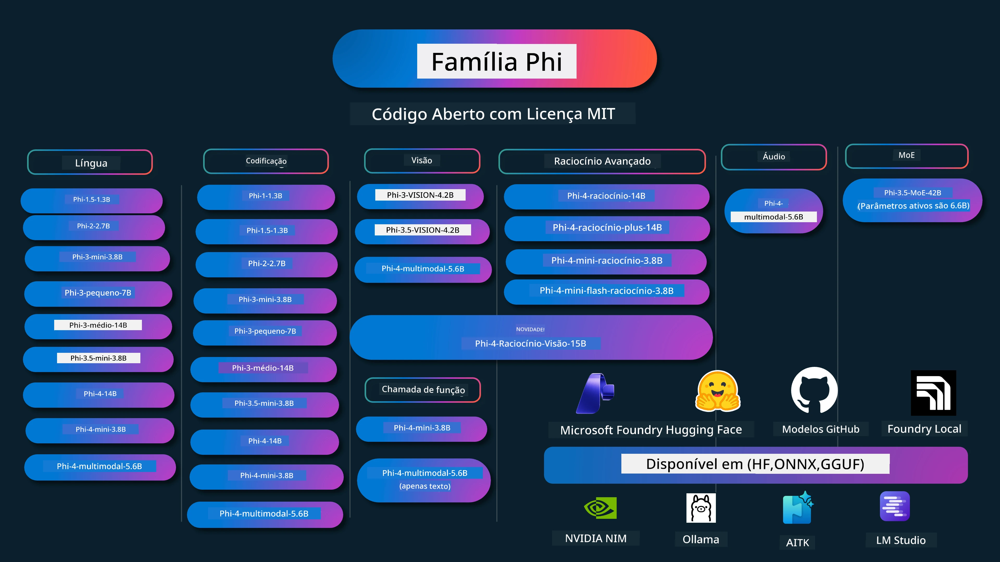

# Phi Cookbook: Exemplos Práticos com os Modelos Phi da Microsoft

[](https://codespaces.new/microsoft/phicookbook)
[](https://vscode.dev/redirect?url=vscode://ms-vscode-remote.remote-containers/cloneInVolume?url=https://github.com/microsoft/phicookbook)

[](https://GitHub.com/microsoft/phicookbook/graphs/contributors/?WT.mc_id=aiml-137032-kinfeylo)
[](https://GitHub.com/microsoft/phicookbook/issues/?WT.mc_id=aiml-137032-kinfeylo)
[](https://GitHub.com/microsoft/phicookbook/pulls/?WT.mc_id=aiml-137032-kinfeylo)
[](http://makeapullrequest.com?WT.mc_id=aiml-137032-kinfeylo)

[](https://GitHub.com/microsoft/phicookbook/watchers/?WT.mc_id=aiml-137032-kinfeylo)
[](https://GitHub.com/microsoft/phicookbook/network/?WT.mc_id=aiml-137032-kinfeylo)
[](https://GitHub.com/microsoft/phicookbook/stargazers/?WT.mc_id=aiml-137032-kinfeylo)

[](https://discord.com/invite/ByRwuEEgH4)

Phi é uma série de modelos de IA de código aberto desenvolvidos pela Microsoft.

Phi é atualmente o modelo de linguagem pequena (SLM) mais poderoso e económico, com benchmarks muito bons em múltiplas línguas, raciocínio, geração de texto/chat, programação, imagens, áudio e outros cenários.

Pode implementar o Phi na cloud ou em dispositivos edge e pode facilmente construir aplicações de IA generativa com capacidade computacional limitada.

Siga estes passos para começar a utilizar estes recursos :
1. **Faça Fork do Repositório**: Clique em [](https://GitHub.com/microsoft/phicookbook/network/?WT.mc_id=aiml-137032-kinfeylo)
2. **Clone o Repositório**: `git clone https://github.com/microsoft/PhiCookBook.git`
3. [**Junte-se à Comunidade Microsoft AI no Discord e conheça especialistas e outros desenvolvedores**](https://discord.com/invite/ByRwuEEgH4?WT.mc_id=aiml-137032-kinfeylo)



### 🌐 Suporte Multilíngue

#### Suportado via GitHub Action (Automatizado e Sempre Atualizado)

<!-- CO-OP TRANSLATOR LANGUAGES TABLE START -->
[Árabe](../ar/README.md) | [Bengali](../bn/README.md) | [Búlgaro](../bg/README.md) | [Birmanês (Myanmar)](../my/README.md) | [Chinês (Simplificado)](../zh-CN/README.md) | [Chinês (Tradicional, Hong Kong)](../zh-HK/README.md) | [Chinês (Tradicional, Macau)](../zh-MO/README.md) | [Chinês (Tradicional, Taiwan)](../zh-TW/README.md) | [Croata](../hr/README.md) | [Checo](../cs/README.md) | [Dinamarquês](../da/README.md) | [Holandês](../nl/README.md) | [Estónio](../et/README.md) | [Finlandês](../fi/README.md) | [Francês](../fr/README.md) | [Alemão](../de/README.md) | [Grego](../el/README.md) | [Hebraico](../he/README.md) | [Hindi](../hi/README.md) | [Húngaro](../hu/README.md) | [Indonésio](../id/README.md) | [Italiano](../it/README.md) | [Japonês](../ja/README.md) | [Kannada](../kn/README.md) | [Khmer](../km/README.md) | [Coreano](../ko/README.md) | [Lituano](../lt/README.md) | [Malaio](../ms/README.md) | [Malaiala](../ml/README.md) | [Marati](../mr/README.md) | [Nepali](../ne/README.md) | [Pidgin Nigeriano](../pcm/README.md) | [Norueguês](../no/README.md) | [Persa (Farsi)](../fa/README.md) | [Polaco](../pl/README.md) | [Português (Brasil)](../pt-BR/README.md) | [Português (Portugal)](./README.md) | [Punjabi (Gurmukhi)](../pa/README.md) | [Romeno](../ro/README.md) | [Russo](../ru/README.md) | [Sérvio (Cirílico)](../sr/README.md) | [Eslovaco](../sk/README.md) | [Esloveno](../sl/README.md) | [Espanhol](../es/README.md) | [Suaíli](../sw/README.md) | [Sueco](../sv/README.md) | [Tagalog (Filipino)](../tl/README.md) | [Tamil](../ta/README.md) | [Telugo](../te/README.md) | [Tailandês](../th/README.md) | [Turco](../tr/README.md) | [Ucraniano](../uk/README.md) | [Urdu](../ur/README.md) | [Vietnamita](../vi/README.md)

> **Prefere Clonar Localmente?**
>
> Este repositório inclui mais de 50 traduções de línguas, o que aumenta significativamente o tamanho do download. Para clonar sem traduções, use sparse checkout:
>
> **Bash / macOS / Linux:**
> ```bash
> git clone --filter=blob:none --sparse https://github.com/microsoft/PhiCookBook.git
> cd PhiCookBook
> git sparse-checkout set --no-cone '/*' '!translations' '!translated_images'
> ```
>
> **CMD (Windows):**
> ```cmd
> git clone --filter=blob:none --sparse https://github.com/microsoft/PhiCookBook.git
> cd PhiCookBook
> git sparse-checkout set --no-cone "/*" "!translations" "!translated_images"
> ```
>
> Isto dá-lhe tudo o que precisa para completar o curso com um download muito mais rápido.
<!-- CO-OP TRANSLATOR LANGUAGES TABLE END -->

## Índice

- Introdução
  - [Bem-vindo à Família Phi](./md/01.Introduction/01/01.PhiFamily.md)
  - [Configurar o seu ambiente](./md/01.Introduction/01/01.EnvironmentSetup.md)
  - [Compreender Tecnologias Chave](./md/01.Introduction/01/01.Understandingtech.md)
  - [Segurança em IA para Modelos Phi](./md/01.Introduction/01/01.AISafety.md)
  - [Suporte de Hardware Phi](./md/01.Introduction/01/01.Hardwaresupport.md)
  - [Modelos Phi e Disponibilidade em várias plataformas](./md/01.Introduction/01/01.Edgeandcloud.md)
  - [Usar Guidance-ai e Phi](./md/01.Introduction/01/01.Guidance.md)
  - [Modelos do GitHub Marketplace](https://github.com/marketplace/models)
  - [Catálogo de Modelos Azure AI](https://ai.azure.com)

- Inferência Phi em diferentes ambientes
    -  [Hugging face](./md/01.Introduction/02/01.HF.md)
    -  [Modelos GitHub](./md/01.Introduction/02/02.GitHubModel.md)
    -  [Catálogo de Modelos Microsoft Foundry](./md/01.Introduction/02/03.AzureAIFoundry.md)
    -  [Ollama](./md/01.Introduction/02/04.Ollama.md)
    -  [AI Toolkit VSCode (AITK)](./md/01.Introduction/02/05.AITK.md)
    -  [NVIDIA NIM](./md/01.Introduction/02/06.NVIDIA.md)
    -  [Foundry Local](./md/01.Introduction/02/07.FoundryLocal.md)

- Inferência Phi Family
    - [Inferência Phi em iOS](./md/01.Introduction/03/iOS_Inference.md)
    - [Inferência Phi em Android](./md/01.Introduction/03/Android_Inference.md)
    - [Inferência Phi em Jetson](./md/01.Introduction/03/Jetson_Inference.md)
    - [Inferência Phi em AI PC](./md/01.Introduction/03/AIPC_Inference.md)
    - [Inferência Phi com Apple MLX Framework](./md/01.Introduction/03/MLX_Inference.md)
    - [Inferência Phi em Servidor Local](./md/01.Introduction/03/Local_Server_Inference.md)
    - [Inferência Phi em Servidor Remoto usando AI Toolkit](./md/01.Introduction/03/Remote_Interence.md)
    - [Inferência Phi com Rust](./md/01.Introduction/03/Rust_Inference.md)
    - [Inferência Phi--Visão em Local](./md/01.Introduction/03/Vision_Inference.md)
    - [Inferência Phi com Kaito AKS, Azure Containers (suporte oficial)](./md/01.Introduction/03/Kaito_Inference.md)
-  [Quantificação da Família Phi](./md/01.Introduction/04/QuantifyingPhi.md)
    - [Quantizar Phi-3.5 / 4 usando llama.cpp](./md/01.Introduction/04/UsingLlamacppQuantifyingPhi.md)
    - [Quantizar Phi-3.5 / 4 usando extensões de IA Generativa para onnxruntime](./md/01.Introduction/04/UsingORTGenAIQuantifyingPhi.md)
    - [Quantizar Phi-3.5 / 4 usando Intel OpenVINO](./md/01.Introduction/04/UsingIntelOpenVINOQuantifyingPhi.md)
    - [Quantizar Phi-3.5 / 4 usando Apple MLX Framework](./md/01.Introduction/04/UsingAppleMLXQuantifyingPhi.md)

- Avaliação Phi
    - [IA Responsável](./md/01.Introduction/05/ResponsibleAI.md)
    - [Microsoft Foundry para Avaliação](./md/01.Introduction/05/AIFoundry.md)
    - [Usar Promptflow para Avaliação](./md/01.Introduction/05/Promptflow.md)
 
- RAG com Azure AI Search
    - [Como usar Phi-4-mini e Phi-4-multimodal (RAG) com Azure AI Search](https://github.com/microsoft/PhiCookBook/blob/main/code/06.E2E/E2E_Phi-4-RAG-Azure-AI-Search.ipynb)

- Exemplos de desenvolvimento de aplicações Phi
  - Aplicações de Texto & Chat
    - Exemplos Phi-4 
      - [📓] [Chat com Modelo Phi-4-mini ONNX](./md/02.Application/01.TextAndChat/Phi4/ChatWithPhi4ONNX/README.md)
      - [Chat com Modelo ONNX Phi-4 local .NET](../../md/04.HOL/dotnet/src/LabsPhi4-Chat-01OnnxRuntime)
      - [App Console Chat .NET com Phi-4 ONNX usando Sementic Kernel](../../md/04.HOL/dotnet/src/LabsPhi4-Chat-02SK)
    - Exemplos Phi-3 / 3.5
      - [Chatbot Local no navegador usando Phi3, ONNX Runtime Web e WebGPU](https://github.com/microsoft/onnxruntime-inference-examples/tree/main/js/chat)
      - [OpenVino Chat](./md/02.Application/01.TextAndChat/Phi3/E2E_OpenVino_Chat.md)
      - [Multi Modelo - Phi-3-mini interativo e OpenAI Whisper](./md/02.Application/01.TextAndChat/Phi3/E2E_Phi-3-mini_with_whisper.md)
      - [MLFlow - Construir um wrapper e usar Phi-3 com MLFlow](./md//02.Application/01.TextAndChat/Phi3/E2E_Phi-3-MLflow.md)
      - [Otimização de Modelo - Como otimizar o modelo Phi-3-min para ONNX Runtime Web com Olive](https://github.com/microsoft/Olive/tree/main/examples/phi3)
      - [App WinUI3 com Phi-3 mini-4k-instruct-onnx](https://github.com/microsoft/Phi3-Chat-WinUI3-Sample/)
      -[Exemplo de App de Notas com vários modelos alimentado por IA WinUI3](https://github.com/microsoft/ai-powered-notes-winui3-sample)
      - [Ajuste fino e integração de modelos Phi-3 personalizados com Prompt flow](./md/02.Application/01.TextAndChat/Phi3/E2E_Phi-3-FineTuning_PromptFlow_Integration.md)
      - [Ajuste fino e integração de modelos Phi-3 personalizados com Prompt flow na Microsoft Foundry](./md/02.Application/01.TextAndChat/Phi3/E2E_Phi-3-FineTuning_PromptFlow_Integration_AIFoundry.md)
      - [Avaliação do modelo Phi-3 / Phi-3.5 ajustado na Microsoft Foundry com foco nos princípios de IA responsável da Microsoft](./md/02.Application/01.TextAndChat/Phi3/E2E_Phi-3-Evaluation_AIFoundry.md)
      - [📓] [Exemplo de predição de linguagem Phi-3.5-mini-instruct (Chinês/Inglês)](./md/02.Application/01.TextAndChat/Phi3/phi3-instruct-demo.ipynb)
      - [Phi-3.5-Instruct Chatbot WebGPU RAG](./md/02.Application/01.TextAndChat/Phi3/WebGPUWithPhi35Readme.md)
      - [Usar GPU Windows para criar solução Prompt flow com Phi-3.5-Instruct ONNX](./md/02.Application/01.TextAndChat/Phi3/UsingPromptFlowWithONNX.md)
      - [Usar Microsoft Phi-3.5 tflite para criar app Android](./md/02.Application/01.TextAndChat/Phi3/UsingPhi35TFLiteCreateAndroidApp.md)
      - [Exemplo Q&A .NET usando modelo ONNX Phi-3 local com Microsoft.ML.OnnxRuntime](../../md/04.HOL/dotnet/src/LabsPhi301)
      - [App .NET consola de chat com Semantic Kernel e Phi-3](../../md/04.HOL/dotnet/src/LabsPhi302)

  - Exemplos Baseados em Código do Azure AI Inference SDK 
    - Exemplos Phi-4 
      - [📓] [Gerar código de projeto usando Phi-4-multimodal](./md/02.Application/02.Code/Phi4/GenProjectCode/README.md)
    - Exemplos Phi-3 / 3.5
      - [Crie o seu próprio Visual Studio Code GitHub Copilot Chat com Microsoft Phi-3 Family](./md/02.Application/02.Code/Phi3/VSCodeExt/README.md)
      - [Crie o seu próprio agente Visual Studio Code Chat Copilot com Phi-3.5 usando modelos GitHub](/md/02.Application/02.Code/Phi3/CreateVSCodeChatAgentWithGitHubModels.md)

  - Exemplos de Raciocínio Avançado
    - Exemplos Phi-4 
      - [📓] [Exemplos Phi-4-mini-reasoning ou Phi-4-reasoning](./md/02.Application/03.AdvancedReasoning/Phi4/AdvancedResoningPhi4mini/README.md)
      - [📓] [Ajuste fino de Phi-4-mini-reasoning com Microsoft Olive](./md/02.Application/03.AdvancedReasoning/Phi4/AdvancedResoningPhi4mini/olive_ft_phi_4_reasoning_with_medicaldata.ipynb)
      - [📓] [Ajuste fino de Phi-4-mini-reasoning com Apple MLX](./md/02.Application/03.AdvancedReasoning/Phi4/AdvancedResoningPhi4mini/mlx_ft_phi_4_reasoning_with_medicaldata.ipynb)
      - [📓] [Phi-4-mini-reasoning com modelos GitHub](./md/02.Application/02.Code/Phi4r/github_models_inference.ipynb)
      - [📓] [Phi-4-mini-reasoning com modelos Microsoft Foundry](./md/02.Application/02.Code/Phi4r/azure_models_inference.ipynb)
  - Demonstrações
      - [Demos Phi-4-mini alojados em Hugging Face Spaces](https://huggingface.co/spaces/microsoft/phi-4-mini?WT.mc_id=aiml-137032-kinfeylo)
      - [Demos Phi-4-multimodal alojados em Hugginge Face Spaces](https://huggingface.co/spaces/microsoft/phi-4-multimodal?WT.mc_id=aiml-137032-kinfeylo)
  - Exemplos de Visão
    - Exemplos Phi-4 
      - [📓] [Usar Phi-4-multimodal para ler imagens e gerar código](./md/02.Application/04.Vision/Phi4/CreateFrontend/README.md) 
    - Exemplos Phi-3 / 3.5
      -  [📓][Texto para texto de imagem Phi-3-vision](./md/02.Application/04.Vision/Phi3/E2E_Phi-3-vision-image-text-to-text-online-endpoint.ipynb)
      - [Phi-3-vision-ONNX](https://onnxruntime.ai/docs/genai/tutorials/phi3-v.html)
      - [📓][Phi-3-vision CLIP Embedding](./md/02.Application/04.Vision/Phi3/E2E_Phi-3-vision-image-text-to-text-online-endpoint.ipynb)
      - [DEMO: Phi-3 Recycling](https://github.com/jennifermarsman/PhiRecycling/)
      - [Phi-3-vision - Assistente de linguagem visual - com Phi3-Vision e OpenVINO](https://docs.openvino.ai/nightly/notebooks/phi-3-vision-with-output.html)
      - [Phi-3 Vision Nvidia NIM](./md/02.Application/04.Vision/Phi3/E2E_Nvidia_NIM_Vision.md)
      - [Phi-3 Vision OpenVino](./md/02.Application/04.Vision/Phi3/E2E_OpenVino_Phi3Vision.md)
      - [📓][Exemplo Phi-3.5 Vision multi-frame ou multi-imagem](./md/02.Application/04.Vision/Phi3/phi3-vision-demo.ipynb)
      - [Modelo Local ONNX Phi-3 Vision usando Microsoft.ML.OnnxRuntime .NET](../../md/04.HOL/dotnet/src/LabsPhi303)
      - [Modelo Local ONNX Phi-3 Vision baseado em menu usando Microsoft.ML.OnnxRuntime .NET](../../md/04.HOL/dotnet/src/LabsPhi304)

  - Exemplos Raciocínio-Visão
    - Phi-4-Reasoning-Vision-15B 
      - [📓] [Usar Phi-4-Reasoning-Vision-15B para detetar atravessamento ilegal](./md/02.Application/10.ReasoningVision/Phi_4_reasoning_vision_15b_Jaywalking.ipynb)
      - [📓] [Usar Phi-4-Reasoning-Vision-15B para matemática](./md/02.Application/10.ReasoningVision/Phi_4_reasoning_vision_15b_Math.ipynb)
      - [📓] [Usar Phi-4-Reasoning-Vision-15B para detetar UI](./md/02.Application/10.ReasoningVision/Phi_4_reasoning_vision_15b_ui.ipynb)

  - Exemplos de Matemática
    -  Exemplos Phi-4-Mini-Flash-Reasoning-Instruct  [Demo Matemática com Phi-4-Mini-Flash-Reasoning-Instruct](./md/02.Application/09.Math/MathDemo.ipynb)

  - Exemplos de Áudio
    - Exemplos Phi-4 
      - [📓] [Extrair transcrições de áudio usando Phi-4-multimodal](./md/02.Application/05.Audio/Phi4/Transciption/README.md)
      - [📓] [Exemplo de Áudio Phi-4-multimodal](./md/02.Application/05.Audio/Phi4/Siri/demo.ipynb)
      - [📓] [Exemplo de Tradução de Fala Phi-4-multimodal](./md/02.Application/05.Audio/Phi4/Translate/demo.ipynb)
      - [Aplicação consola .NET usando Phi-4-multimodal Audio para analisar ficheiro áudio e gerar transcrição](../../md/04.HOL/dotnet/src/LabsPhi4-MultiModal-02Audio)

  - Exemplos MOE
    - Exemplos Phi-3 / 3.5
      - [📓] [Exemplo Phi-3.5 Modelos de Mistura de Especialistas (MoEs) em Redes Sociais](./md/02.Application/06.MoE/Phi3/phi3_moe_demo.ipynb)
      - [📓] [Construção de uma pipeline de geração aumentada por recuperação (RAG) com NVIDIA NIM Phi-3 MOE, Azure AI Search, e LlamaIndex](./md/02.Application/06.MoE/Phi3/azure-ai-search-nvidia-rag.ipynb)
      - 
  - Exemplos de Chamada de Função
    - Exemplos Phi-4 🆕
      -  [📓] [Usar Function Calling com Phi-4-mini](./md/02.Application/07.FunctionCalling/Phi4/FunctionCallingBasic/README.md)
      -  [📓] [Usar Function Calling para criar multi-agentes com Phi-4-mini](./md/02.Application/07.FunctionCalling/Phi4/Multiagents/Phi_4_mini_multiagent.ipynb)
      -  [📓] [Usar Function Calling com Ollama](./md/02.Application/07.FunctionCalling/Phi4/Ollama/ollama_functioncalling.ipynb)
      -  [📓] [Usar Function Calling com ONNX](./md/02.Application/07.FunctionCalling/Phi4/ONNX/onnx_parallel_functioncalling.ipynb)
  - Exemplos de Mistura Multimodal
    - Exemplos Phi-4 🆕
      -  [📓] [Usar Phi-4-multimodal como jornalista tecnológico](./md/02.Application/08.Multimodel/Phi4/TechJournalist/phi_4_mm_audio_text_publish_news.ipynb)
      - [Aplicação consola .NET usando Phi-4-multimodal para analisar imagens](../../md/04.HOL/dotnet/src/LabsPhi4-MultiModal-01Images)

- Ajuste fino de Exemplos Phi
  - [Cenários de ajuste fino](./md/03.FineTuning/FineTuning_Scenarios.md)
  - [Ajuste fino vs RAG](./md/03.FineTuning/FineTuning_vs_RAG.md)
  - [Ajuste fino para tornar Phi-3 um especialista na indústria](./md/03.FineTuning/LetPhi3gotoIndustriy.md)
  - [Ajuste fino de Phi-3 com AI Toolkit para VS Code](./md/03.FineTuning/Finetuning_VSCodeaitoolkit.md)
  - [Ajuste fino de Phi-3 com Azure Machine Learning Service](./md/03.FineTuning/Introduce_AzureML.md)
  - [Ajuste fino de Phi-3 com Lora](./md/03.FineTuning/FineTuning_Lora.md)
  - [Ajuste fino de Phi-3 com QLora](./md/03.FineTuning/FineTuning_Qlora.md)
  - [Ajuste fino de Phi-3 com Microsoft Foundry](./md/03.FineTuning/FineTuning_AIFoundry.md)
  - [Ajuste fino de Phi-3 com Azure ML CLI/SDK](./md/03.FineTuning/FineTuning_MLSDK.md)
  - [Ajuste fino com Microsoft Olive](./md/03.FineTuning/FineTuning_MicrosoftOlive.md)
  - [Laboratório prático de ajuste fino com Microsoft Olive](./md/03.FineTuning/olive-lab/readme.md)
  - [Ajuste fino de Phi-3-vision com Weights and Bias](./md/03.FineTuning/FineTuning_Phi-3-visionWandB.md)
  - [Ajuste fino de Phi-3 com Apple MLX Framework](./md/03.FineTuning/FineTuning_MLX.md)
  - [Ajuste fino de Phi-3-vision (suporte oficial)](./md/03.FineTuning/FineTuning_Vision.md)
  - [Ajuste Fino do Phi-3 com Kaito AKS, Azure Containers (Suporte Oficial)](./md/03.FineTuning/FineTuning_Kaito.md)
  - [Ajuste Fino do Phi-3 e Phi-3.5 Vision](https://github.com/2U1/Phi3-Vision-Finetune)

- Laboratório Prático
  - [Explorando modelos inovadores: LLMs, SLMs, desenvolvimento local e mais](https://github.com/microsoft/aitour-exploring-cutting-edge-models)
  - [Desbloquear o Potencial do NLP: Ajuste Fino com Microsoft Olive](https://github.com/azure/Ignite_FineTuning_workshop)

- Artigos e Publicações Académicas
  - [Textbooks Are All You Need II: relatório técnico phi-1.5](https://arxiv.org/abs/2309.05463)
  - [Relatório Técnico Phi-3: Um Modelo de Linguagem Altamente Capaz Localmente no Telemóvel](https://arxiv.org/abs/2404.14219)
  - [Relatório Técnico Phi-4](https://arxiv.org/abs/2412.08905)
  - [Relatório Técnico Phi-4-Mini: Modelos de Linguagem Multimodais Compactos mas Poderosos via Mistura de LoRAs](https://arxiv.org/abs/2503.01743)
  - [Otimização de Pequenos Modelos de Linguagem para Chamada de Funções em Veículos](https://arxiv.org/abs/2501.02342)
  - [(WhyPHI) Ajuste Fino do PHI-3 para Respostas a Questões de Escolha Múltipla: Metodologia, Resultados e Desafios](https://arxiv.org/abs/2501.01588)
  - [Relatório Técnico Phi-4-raciocínio](https://www.microsoft.com/en-us/research/wp-content/uploads/2025/04/phi_4_reasoning.pdf)
  - [Relatório Técnico Phi-4-mini-raciocínio](https://huggingface.co/microsoft/Phi-4-mini-reasoning/blob/main/Phi-4-Mini-Reasoning.pdf)

## Utilizar Modelos Phi

### Phi na Microsoft Foundry

Pode aprender a usar o Microsoft Phi e como construir soluções E2E nos seus diferentes dispositivos de hardware. Para experimentar o Phi por si próprio, comece a brincar com os modelos e a personalizar o Phi para os seus cenários usando o [Catálogo de Modelos Azure AI da Microsoft Foundry](https://aka.ms/phi3-azure-ai). Pode saber mais em Começar com a [Microsoft Foundry](/md/02.QuickStart/AzureAIFoundry_QuickStart.md).

**Playground**
Cada modelo tem um playground dedicado para testar o modelo [Azure AI Playground](https://aka.ms/try-phi3).

### Phi nos Modelos do GitHub

Pode aprender como usar o Microsoft Phi e como construir soluções E2E nos seus diferentes dispositivos de hardware. Para experimentar o Phi por si próprio, comece por brincar com o modelo e personalizar o Phi para os seus cenários usando o [Catálogo de Modelos do GitHub](https://github.com/marketplace/models?WT.mc_id=aiml-137032-kinfeylo). Pode saber mais em Começar com o [Catálogo de Modelos do GitHub](/md/02.QuickStart/GitHubModel_QuickStart.md).

**Playground**
Cada modelo tem um [playground dedicado para testar o modelo](/md/02.QuickStart/GitHubModel_QuickStart.md).

### Phi no Hugging Face

Também pode encontrar o modelo no [Hugging Face](https://huggingface.co/microsoft).

**Playground**
[Playground Hugging Chat](https://huggingface.co/chat/models/microsoft/Phi-3-mini-4k-instruct)

## 🎒 Outros Cursos

A nossa equipa produz outros cursos! Confira:

<!-- CO-OP TRANSLATOR OTHER COURSES START -->
### LangChain
[](https://aka.ms/langchain4j-for-beginners)
[](https://aka.ms/langchainjs-for-beginners?WT.mc_id=m365-94501-dwahlin)
[](https://github.com/microsoft/langchain-for-beginners?WT.mc_id=m365-94501-dwahlin)
---

### Azure / Edge / MCP / Agentes
[](https://github.com/microsoft/AZD-for-beginners?WT.mc_id=academic-105485-koreyst)
[](https://github.com/microsoft/edgeai-for-beginners?WT.mc_id=academic-105485-koreyst)
[](https://github.com/microsoft/mcp-for-beginners?WT.mc_id=academic-105485-koreyst)
[](https://github.com/microsoft/ai-agents-for-beginners?WT.mc_id=academic-105485-koreyst)

---
 
### Série de IA Generativa
[](https://github.com/microsoft/generative-ai-for-beginners?WT.mc_id=academic-105485-koreyst)
[-9333EA?style=for-the-badge&labelColor=E5E7EB&color=9333EA)](https://github.com/microsoft/Generative-AI-for-beginners-dotnet?WT.mc_id=academic-105485-koreyst)
[-C084FC?style=for-the-badge&labelColor=E5E7EB&color=C084FC)](https://github.com/microsoft/generative-ai-for-beginners-java?WT.mc_id=academic-105485-koreyst)
[-E879F9?style=for-the-badge&labelColor=E5E7EB&color=E879F9)](https://github.com/microsoft/generative-ai-with-javascript?WT.mc_id=academic-105485-koreyst)

---
 
### Aprendizagem Base
[](https://aka.ms/ml-beginners?WT.mc_id=academic-105485-koreyst)
[](https://aka.ms/datascience-beginners?WT.mc_id=academic-105485-koreyst)
[](https://aka.ms/ai-beginners?WT.mc_id=academic-105485-koreyst)
[](https://github.com/microsoft/Security-101?WT.mc_id=academic-96948-sayoung)
[](https://aka.ms/webdev-beginners?WT.mc_id=academic-105485-koreyst)
[](https://aka.ms/iot-beginners?WT.mc_id=academic-105485-koreyst)
[](https://github.com/microsoft/xr-development-for-beginners?WT.mc_id=academic-105485-koreyst)

---
 
### Série Copilot
[](https://aka.ms/GitHubCopilotAI?WT.mc_id=academic-105485-koreyst)
[](https://github.com/microsoft/mastering-github-copilot-for-dotnet-csharp-developers?WT.mc_id=academic-105485-koreyst)
[](https://github.com/microsoft/CopilotAdventures?WT.mc_id=academic-105485-koreyst)
<!-- CO-OP TRANSLATOR OTHER COURSES END -->

## IA Responsável 

A Microsoft compromete-se a ajudar os nossos clientes a usar os nossos produtos de IA de forma responsável, partilhando as nossas aprendizagens e construindo parcerias de confiança através de ferramentas como Notas de Transparência e Avaliações de Impacto. Muitos destes recursos podem ser encontrados em [https://aka.ms/RAI](https://aka.ms/RAI).
A abordagem da Microsoft à IA responsável baseia-se nos nossos princípios de IA de equidade, fiabilidade e segurança, privacidade e segurança, inclusão, transparência e responsabilidade.

Modelos de linguagem, imagem e voz de grande escala - como os usados neste exemplo - podem potencialmente comportar-se de formas que são injustas, pouco fiáveis ou ofensivas, causando assim danos. Por favor, consulte a [nota de transparência do serviço Azure OpenAI](https://learn.microsoft.com/legal/cognitive-services/openai/transparency-note?tabs=text) para se informar sobre riscos e limitações.
A abordagem recomendada para mitigar estes riscos é incluir um sistema de segurança na sua arquitetura que possa detetar e prevenir comportamentos prejudiciais. [Azure AI Content Safety](https://learn.microsoft.com/azure/ai-services/content-safety/overview) fornece uma camada independente de proteção, capaz de detetar conteúdos prejudiciais gerados por utilizadores e por IA em aplicações e serviços. O Azure AI Content Safety inclui APIs de texto e imagem que permitem detetar material que é prejudicial. Dentro do Microsoft Foundry, o serviço Content Safety permite-lhe ver, explorar e experimentar código de exemplo para detetar conteúdos prejudiciais em diferentes modalidades. A seguinte [documentação quickstart](https://learn.microsoft.com/azure/ai-services/content-safety/quickstart-text?tabs=visual-studio%2Clinux&pivots=programming-language-rest) guia-o através da realização de pedidos ao serviço.

Outro aspeto a ter em conta é o desempenho geral da aplicação. Com aplicações multimodais e multimodelos, consideramos desempenho como o sistema a funcionar conforme espera, assim como os seus utilizadores, incluindo a não geração de resultados prejudiciais. É importante avaliar o desempenho da sua aplicação global utilizando os [avaliadores de Performance and Quality e Risk and Safety](https://learn.microsoft.com/azure/ai-studio/concepts/evaluation-metrics-built-in). Também tem a capacidade de criar e avaliar com [avaliadores personalizados](https://learn.microsoft.com/azure/ai-studio/how-to/develop/evaluate-sdk#custom-evaluators).

Pode avaliar a sua aplicação de IA no seu ambiente de desenvolvimento usando o [Azure AI Evaluation SDK](https://microsoft.github.io/promptflow/index.html). Dado um conjunto de dados de teste ou um objetivo, as gerações da sua aplicação de IA generativa são medidas quantitativamente com avaliadores incorporados ou avaliadores personalizados à sua escolha. Para começar com o azure ai evaluation sdk para avaliar o seu sistema, pode seguir o [guia quickstart](https://learn.microsoft.com/azure/ai-studio/how-to/develop/flow-evaluate-sdk). Após executar uma avaliação, pode [visualizar os resultados no Microsoft Foundry](https://learn.microsoft.com/azure/ai-studio/how-to/evaluate-flow-results). 

## Marcas Comerciais

Este projeto pode conter marcas comerciais ou logótipos de projetos, produtos ou serviços. O uso autorizado das marcas comerciais ou logótipos da Microsoft está sujeito e deve seguir as [Diretrizes de Marca e Marca da Microsoft](https://www.microsoft.com/legal/intellectualproperty/trademarks/usage/general).
O uso das marcas comerciais ou logótipos da Microsoft em versões modificadas deste projeto não deve causar confusão nem implicar patrocínio da Microsoft. Qualquer uso de marcas comerciais ou logótipos de terceiros está sujeito às políticas desses terceiros.

## Obter Ajuda

Se ficar preso ou tiver alguma dúvida sobre como construir aplicações de IA, junte-se a:

[](https://aka.ms/foundry/discord)

Se tiver feedback sobre o produto ou encontrar erros durante o desenvolvimento, visite:

[](https://aka.ms/foundry/forum)

---

<!-- CO-OP TRANSLATOR DISCLAIMER START -->
**Aviso Legal**:  
Este documento foi traduzido utilizando o serviço de tradução por IA [Co-op Translator](https://github.com/Azure/co-op-translator). Embora nos esforcemos por garantir a precisão, tenha em atenção que traduções automáticas podem conter erros ou imprecisões. O documento original na sua língua nativa deve ser considerado a fonte autoritativa. Para informações críticas, recomenda-se a tradução profissional humana. Não nos responsabilizamos por quaisquer mal-entendidos ou interpretações incorretas decorrentes do uso desta tradução.
<!-- CO-OP TRANSLATOR DISCLAIMER END -->