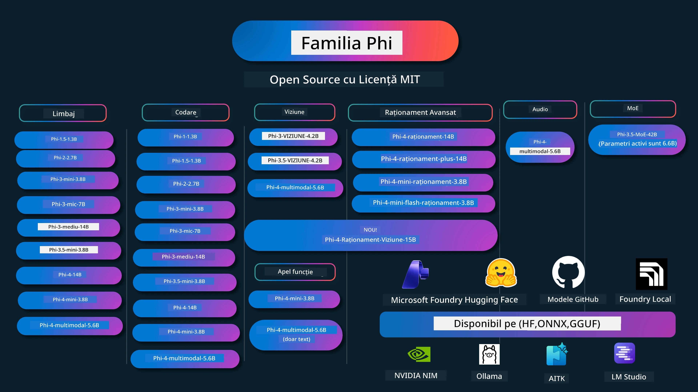

# Carte de rețete Phi: Exemple practice cu modelele Phi de la Microsoft

[](https://codespaces.new/microsoft/phicookbook)
[](https://vscode.dev/redirect?url=vscode://ms-vscode-remote.remote-containers/cloneInVolume?url=https://github.com/microsoft/phicookbook)

[](https://GitHub.com/microsoft/phicookbook/graphs/contributors/?WT.mc_id=aiml-137032-kinfeylo)
[](https://GitHub.com/microsoft/phicookbook/issues/?WT.mc_id=aiml-137032-kinfeylo)
[](https://GitHub.com/microsoft/phicookbook/pulls/?WT.mc_id=aiml-137032-kinfeylo)
[](http://makeapullrequest.com?WT.mc_id=aiml-137032-kinfeylo)

[](https://GitHub.com/microsoft/phicookbook/watchers/?WT.mc_id=aiml-137032-kinfeylo)
[](https://GitHub.com/microsoft/phicookbook/network/?WT.mc_id=aiml-137032-kinfeylo)
[](https://GitHub.com/microsoft/phicookbook/stargazers/?WT.mc_id=aiml-137032-kinfeylo)

[](https://discord.com/invite/ByRwuEEgH4)

Phi este o serie de modele AI open source dezvoltate de Microsoft.

Phi este în prezent cel mai puternic și rentabil model mic de limbaj (SLM), cu repere foarte bune în multi-limbaj, raționament, generare text/chat, codare, imagini, audio și alte scenarii.

Poți implementa Phi în cloud sau pe dispozitive edge și poți construi ușor aplicații AI generative cu putere de calcul limitată.

Urmează acești pași pentru a începe să folosești aceste resurse:
1. **Fă un fork al Repozitoriului**: Click [](https://GitHub.com/microsoft/phicookbook/network/?WT.mc_id=aiml-137032-kinfeylo)
2. **Clonează Repozitoriul**: `git clone https://github.com/microsoft/PhiCookBook.git`
3. [**Alătură-te Comunității Microsoft AI pe Discord și întâlnește experți și alți dezvoltatori**](https://discord.com/invite/ByRwuEEgH4?WT.mc_id=aiml-137032-kinfeylo)



### 🌐 Suport multilingv

#### Susținut prin GitHub Action (automatizat și mereu actualizat)

<!-- CO-OP TRANSLATOR LANGUAGES TABLE START -->
[Arabă](../ar/README.md) | [Bengaleză](../bn/README.md) | [Bulgară](../bg/README.md) | [Burmese (Myanmar)](../my/README.md) | [Chineză (Simplificată)](../zh-CN/README.md) | [Chineză (Tradițională, Hong Kong)](../zh-HK/README.md) | [Chineză (Tradițională, Macau)](../zh-MO/README.md) | [Chineză (Tradițională, Taiwan)](../zh-TW/README.md) | [Croată](../hr/README.md) | [Cehă](../cs/README.md) | [Daneză](../da/README.md) | [Olandeză](../nl/README.md) | [Estonă](../et/README.md) | [Finlandeză](../fi/README.md) | [Franceză](../fr/README.md) | [Germană](../de/README.md) | [Greacă](../el/README.md) | [Ebraică](../he/README.md) | [Hindi](../hi/README.md) | [Maghiară](../hu/README.md) | [Indoneziană](../id/README.md) | [Italiană](../it/README.md) | [Japoneză](../ja/README.md) | [Kannada](../kn/README.md) | [Khmer](../km/README.md) | [Coreeană](../ko/README.md) | [Lituaniană](../lt/README.md) | [Malaysiană](../ms/README.md) | [Malayalam](../ml/README.md) | [Marathi](../mr/README.md) | [Nepaleză](../ne/README.md) | [Pidgin Nigerianc](../pcm/README.md) | [Norvegiană](../no/README.md) | [Persană (Farsi)](../fa/README.md) | [Poloneză](../pl/README.md) | [Portugheză (Brazilia)](../pt-BR/README.md) | [Portugheză (Portugalia)](../pt-PT/README.md) | [Punjabi (Gurmukhi)](../pa/README.md) | [Română](./README.md) | [Rusă](../ru/README.md) | [Sârbă (Chirilică)](../sr/README.md) | [Slovacă](../sk/README.md) | [Slovenă](../sl/README.md) | [Spaniolă](../es/README.md) | [Swahili](../sw/README.md) | [Suedeză](../sv/README.md) | [Tagalog (Filipino)](../tl/README.md) | [Tamil](../ta/README.md) | [Telugu](../te/README.md) | [Thailandeză](../th/README.md) | [Turcă](../tr/README.md) | [Ucraineană](../uk/README.md) | [Urdu](../ur/README.md) | [Vietnameză](../vi/README.md)

> **Preferi să clonezi local?**
>
> Acest depozit include peste 50 de traduceri în limbi diferite, ceea ce crește semnificativ dimensiunea descărcării. Pentru a clona fără traduceri, folosește sparse checkout:
>
> **Bash / macOS / Linux:**
> ```bash
> git clone --filter=blob:none --sparse https://github.com/microsoft/PhiCookBook.git
> cd PhiCookBook
> git sparse-checkout set --no-cone '/*' '!translations' '!translated_images'
> ```
>
> **CMD (Windows):**
> ```cmd
> git clone --filter=blob:none --sparse https://github.com/microsoft/PhiCookBook.git
> cd PhiCookBook
> git sparse-checkout set --no-cone "/*" "!translations" "!translated_images"
> ```
>
> Aceasta îți oferă tot ce ai nevoie pentru a parcurge cursul cu o descărcare mult mai rapidă.
<!-- CO-OP TRANSLATOR LANGUAGES TABLE END -->

## Cuprins

- Introducere
  - [Bine ai venit în familia Phi](./md/01.Introduction/01/01.PhiFamily.md)
  - [Configurarea mediului](./md/01.Introduction/01/01.EnvironmentSetup.md)
  - [Înțelegerea tehnologiilor cheie](./md/01.Introduction/01/01.Understandingtech.md)
  - [Siguranța AI pentru modelele Phi](./md/01.Introduction/01/01.AISafety.md)
  - [Suport hardware Phi](./md/01.Introduction/01/01.Hardwaresupport.md)
  - [Modele Phi & Disponibilitate pe platforme](./md/01.Introduction/01/01.Edgeandcloud.md)
  - [Utilizarea Guidance-ai și Phi](./md/01.Introduction/01/01.Guidance.md)
  - [Modele în GitHub Marketplace](https://github.com/marketplace/models)
  - [Catalogul de modele AI Azure](https://ai.azure.com)

- Inferență Phi în medii diferite
    -  [Hugging face](./md/01.Introduction/02/01.HF.md)
    -  [Modele GitHub](./md/01.Introduction/02/02.GitHubModel.md)
    -  [Catalogul modelelor Microsoft Foundry](./md/01.Introduction/02/03.AzureAIFoundry.md)
    -  [Ollama](./md/01.Introduction/02/04.Ollama.md)
    -  [Kitul de unelte AI VSCode (AITK)](./md/01.Introduction/02/05.AITK.md)
    -  [NVIDIA NIM](./md/01.Introduction/02/06.NVIDIA.md)
    -  [Foundry Local](./md/01.Introduction/02/07.FoundryLocal.md)

- Inferență Phi Family
    - [Inferență Phi pe iOS](./md/01.Introduction/03/iOS_Inference.md)
    - [Inferență Phi pe Android](./md/01.Introduction/03/Android_Inference.md)
    - [Inferență Phi pe Jetson](./md/01.Introduction/03/Jetson_Inference.md)
    - [Inferență Phi pe AI PC](./md/01.Introduction/03/AIPC_Inference.md)
    - [Inferență Phi cu Apple MLX Framework](./md/01.Introduction/03/MLX_Inference.md)
    - [Inferență Phi pe server local](./md/01.Introduction/03/Local_Server_Inference.md)
    - [Inferență Phi pe server la distanță folosind AI Toolkit](./md/01.Introduction/03/Remote_Interence.md)
    - [Inferență Phi cu Rust](./md/01.Introduction/03/Rust_Inference.md)
    - [Inferență Phi--Vision local](./md/01.Introduction/03/Vision_Inference.md)
    - [Inferență Phi cu Kaito AKS, Azure Containers (suport oficial)](./md/01.Introduction/03/Kaito_Inference.md)
-  [Cuantificarea Phi Family](./md/01.Introduction/04/QuantifyingPhi.md)
    - [Cuantificarea Phi-3.5 / 4 folosind llama.cpp](./md/01.Introduction/04/UsingLlamacppQuantifyingPhi.md)
    - [Cuantificarea Phi-3.5 / 4 folosind extensii Generative AI pentru onnxruntime](./md/01.Introduction/04/UsingORTGenAIQuantifyingPhi.md)
    - [Cuantificarea Phi-3.5 / 4 folosind Intel OpenVINO](./md/01.Introduction/04/UsingIntelOpenVINOQuantifyingPhi.md)
    - [Cuantificarea Phi-3.5 / 4 folosind Apple MLX Framework](./md/01.Introduction/04/UsingAppleMLXQuantifyingPhi.md)

-  Evaluarea Phi
    - [AI Responsabil](./md/01.Introduction/05/ResponsibleAI.md)
    - [Microsoft Foundry pentru evaluare](./md/01.Introduction/05/AIFoundry.md)
    - [Utilizarea Promptflow pentru evaluare](./md/01.Introduction/05/Promptflow.md)
 
- RAG cu Azure AI Search
    - [Cum să folosești Phi-4-mini și Phi-4-multimodal (RAG) cu Azure AI Search](https://github.com/microsoft/PhiCookBook/blob/main/code/06.E2E/E2E_Phi-4-RAG-Azure-AI-Search.ipynb)

- Exemple de dezvoltare aplicații Phi
  - Aplicații text și chat
    - Mostre Phi-4 
      - [📓] [Chat cu modelul Phi-4-mini ONNX](./md/02.Application/01.TextAndChat/Phi4/ChatWithPhi4ONNX/README.md)
      - [Chat cu model local Phi-4 ONNX .NET](../../md/04.HOL/dotnet/src/LabsPhi4-Chat-01OnnxRuntime)
      - [Aplicație de chat .NET Console cu Phi-4 ONNX folosind Semantic Kernel](../../md/04.HOL/dotnet/src/LabsPhi4-Chat-02SK)
    - Mostre Phi-3 / 3.5
      - [Chatbot local în browser folosind Phi3, ONNX Runtime Web și WebGPU](https://github.com/microsoft/onnxruntime-inference-examples/tree/main/js/chat)
      - [OpenVino Chat](./md/02.Application/01.TextAndChat/Phi3/E2E_OpenVino_Chat.md)
      - [Multi Model - Phi-3-mini interactiv și OpenAI Whisper](./md/02.Application/01.TextAndChat/Phi3/E2E_Phi-3-mini_with_whisper.md)
      - [MLFlow - Construirea unui wrapper și utilizarea Phi-3 cu MLFlow](./md//02.Application/01.TextAndChat/Phi3/E2E_Phi-3-MLflow.md)
      - [Optimizarea Modelului - Cum să optimizezi modelul Phi-3-min pentru ONNX Runtime Web cu Olive](https://github.com/microsoft/Olive/tree/main/examples/phi3)
      - [Aplicație WinUI3 cu Phi-3 mini-4k-instruct-onnx](https://github.com/microsoft/Phi3-Chat-WinUI3-Sample/)
      -[Exemplu aplicație WinUI3 Multi Model AI Powered Notes](https://github.com/microsoft/ai-powered-notes-winui3-sample)
      - [Antrenare fină și integrare modele personalizate Phi-3 cu Prompt flow](./md/02.Application/01.TextAndChat/Phi3/E2E_Phi-3-FineTuning_PromptFlow_Integration.md)
      - [Antrenare fină și integrare modele personalizate Phi-3 cu Prompt flow în Microsoft Foundry](./md/02.Application/01.TextAndChat/Phi3/E2E_Phi-3-FineTuning_PromptFlow_Integration_AIFoundry.md)
      - [Evaluarea modelului Phi-3 / Phi-3.5 antrenat fin în Microsoft Foundry concentrându-se pe principiile AI responsabile de la Microsoft](./md/02.Application/01.TextAndChat/Phi3/E2E_Phi-3-Evaluation_AIFoundry.md)
      - [📓] [Exemplu de predicție a limbajului Phi-3.5-mini-instruct (chineză/engleză)](./md/02.Application/01.TextAndChat/Phi3/phi3-instruct-demo.ipynb)
      - [Phi-3.5-Instruct WebGPU RAG Chatbot](./md/02.Application/01.TextAndChat/Phi3/WebGPUWithPhi35Readme.md)
      - [Utilizarea GPU-ului Windows pentru a crea soluție Prompt flow cu Phi-3.5-Instruct ONNX](./md/02.Application/01.TextAndChat/Phi3/UsingPromptFlowWithONNX.md)
      - [Utilizarea Microsoft Phi-3.5 tflite pentru a crea aplicație Android](./md/02.Application/01.TextAndChat/Phi3/UsingPhi35TFLiteCreateAndroidApp.md)
      - [Exemplu Q&A .NET folosind modelul local ONNX Phi-3 cu Microsoft.ML.OnnxRuntime](../../md/04.HOL/dotnet/src/LabsPhi301)
      - [Aplicație console chat .NET cu Semantic Kernel și Phi-3](../../md/04.HOL/dotnet/src/LabsPhi302)

  - Exemple de cod bazate pe Azure AI Inference SDK 
    - Exemple Phi-4 
      - [📓] [Generare cod proiect folosind Phi-4-multimodal](./md/02.Application/02.Code/Phi4/GenProjectCode/README.md)
    - Exemple Phi-3 / 3.5
      - [Construiește-ți propriul Visual Studio Code GitHub Copilot Chat cu familia Microsoft Phi-3](./md/02.Application/02.Code/Phi3/VSCodeExt/README.md)
      - [Creează-ți propriul agent Chat Copilot pentru Visual Studio Code cu Phi-3.5 de la modelele GitHub](/md/02.Application/02.Code/Phi3/CreateVSCodeChatAgentWithGitHubModels.md)

  - Exemple de raționament avansat
    - Exemple Phi-4 
      - [📓] [Exemple Phi-4-mini-reasoning sau Phi-4-reasoning](./md/02.Application/03.AdvancedReasoning/Phi4/AdvancedResoningPhi4mini/README.md)
      - [📓] [Antrenare fină Phi-4-mini-reasoning cu Microsoft Olive](./md/02.Application/03.AdvancedReasoning/Phi4/AdvancedResoningPhi4mini/olive_ft_phi_4_reasoning_with_medicaldata.ipynb)
      - [📓] [Antrenare fină Phi-4-mini-reasoning cu Apple MLX](./md/02.Application/03.AdvancedReasoning/Phi4/AdvancedResoningPhi4mini/mlx_ft_phi_4_reasoning_with_medicaldata.ipynb)
      - [📓] [Phi-4-mini-reasoning cu modelele GitHub](./md/02.Application/02.Code/Phi4r/github_models_inference.ipynb)
      - [📓] [Phi-4-mini-reasoning cu modelele Microsoft Foundry](./md/02.Application/02.Code/Phi4r/azure_models_inference.ipynb)
  - Demo-uri
      - [Demo-uri Phi-4-mini găzduite pe Hugging Face Spaces](https://huggingface.co/spaces/microsoft/phi-4-mini?WT.mc_id=aiml-137032-kinfeylo)
      - [Demo-uri Phi-4-multimodal găzduite pe Hugging Face Spaces](https://huggingface.co/spaces/microsoft/phi-4-multimodal?WT.mc_id=aiml-137032-kinfeylo)
  - Exemple Vision
    - Exemple Phi-4 
      - [📓] [Folosește Phi-4-multimodal pentru a citi imagini și a genera cod](./md/02.Application/04.Vision/Phi4/CreateFrontend/README.md) 
    - Exemple Phi-3 / 3.5
      -  [📓][Phi-3-vision-Text din imagine în text](./md/02.Application/04.Vision/Phi3/E2E_Phi-3-vision-image-text-to-text-online-endpoint.ipynb)
      - [Phi-3-vision-ONNX](https://onnxruntime.ai/docs/genai/tutorials/phi3-v.html)
      - [📓][Phi-3-vision CLIP Embedding](./md/02.Application/04.Vision/Phi3/E2E_Phi-3-vision-image-text-to-text-online-endpoint.ipynb)
      - [DEMO: Phi-3 Reciclare](https://github.com/jennifermarsman/PhiRecycling/)
      - [Phi-3-vision - Asistent vizual de limbaj - cu Phi3-Vision și OpenVINO](https://docs.openvino.ai/nightly/notebooks/phi-3-vision-with-output.html)
      - [Phi-3 Vision Nvidia NIM](./md/02.Application/04.Vision/Phi3/E2E_Nvidia_NIM_Vision.md)
      - [Phi-3 Vision OpenVino](./md/02.Application/04.Vision/Phi3/E2E_OpenVino_Phi3Vision.md)
      - [📓][Phi-3.5 Vision multi-frame sau exemplu multi-imagine](./md/02.Application/04.Vision/Phi3/phi3-vision-demo.ipynb)
      - [Model local ONNX Phi-3 Vision folosind Microsoft.ML.OnnxRuntime .NET](../../md/04.HOL/dotnet/src/LabsPhi303)
      - [Model local ONNX Phi-3 Vision bazat pe meniuri folosind Microsoft.ML.OnnxRuntime .NET](../../md/04.HOL/dotnet/src/LabsPhi304)

  - Exemple Reasoning-Vision
    - Phi-4-Reasoning-Vision-15B 
      - [📓] [Utilizarea Phi-4-Reasoning-Vision-15B pentru detectarea traversării neregulamentare](./md/02.Application/10.ReasoningVision/Phi_4_reasoning_vision_15b_Jaywalking.ipynb)
      - [📓] [Utilizarea Phi-4-Reasoning-Vision-15B pentru matematică](./md/02.Application/10.ReasoningVision/Phi_4_reasoning_vision_15b_Math.ipynb)
      - [📓] [Utilizarea Phi-4-Reasoning-Vision-15B pentru detectarea UI](./md/02.Application/10.ReasoningVision/Phi_4_reasoning_vision_15b_ui.ipynb)

  - Exemple matematică
    - Exemple Phi-4-Mini-Flash-Reasoning-Instruct  [Demo matematică cu Phi-4-Mini-Flash-Reasoning-Instruct](./md/02.Application/09.Math/MathDemo.ipynb)

  - Exemple audio
    - Exemple Phi-4 
      - [📓] [Extrage transcrieri audio folosind Phi-4-multimodal](./md/02.Application/05.Audio/Phi4/Transciption/README.md)
      - [📓] [Exemplu audio Phi-4-multimodal](./md/02.Application/05.Audio/Phi4/Siri/demo.ipynb)
      - [📓] [Exemplu traducere vorbire Phi-4-multimodal](./md/02.Application/05.Audio/Phi4/Translate/demo.ipynb)
      - [Aplicație console .NET folosind Phi-4-multimodal Audio pentru a analiza un fișier audio și a genera transcriere](../../md/04.HOL/dotnet/src/LabsPhi4-MultiModal-02Audio)

  - Exemple MOE
    - Exemple Phi-3 / 3.5
      - [📓] [Exemplu Social Media pentru Modelele de Mixtură a Experților (MoEs) Phi-3.5](./md/02.Application/06.MoE/Phi3/phi3_moe_demo.ipynb)
      - [📓] [Construirea unui pipeline Retrieval-Augmented Generation (RAG) cu NVIDIA NIM Phi-3 MOE, Azure AI Search, și LlamaIndex](./md/02.Application/06.MoE/Phi3/azure-ai-search-nvidia-rag.ipynb)
      - 
  - Exemple Apelare Funcții
    - Exemple Phi-4 🆕
      -  [📓] [Utilizarea Apelării Funcțiilor cu Phi-4-mini](./md/02.Application/07.FunctionCalling/Phi4/FunctionCallingBasic/README.md)
      -  [📓] [Utilizarea Apelării Funcțiilor pentru a crea agenți multipli cu Phi-4-mini](./md/02.Application/07.FunctionCalling/Phi4/Multiagents/Phi_4_mini_multiagent.ipynb)
      -  [📓] [Utilizarea Apelării Funcțiilor cu Ollama](./md/02.Application/07.FunctionCalling/Phi4/Ollama/ollama_functioncalling.ipynb)
      -  [📓] [Utilizarea Apelării Funcțiilor cu ONNX](./md/02.Application/07.FunctionCalling/Phi4/ONNX/onnx_parallel_functioncalling.ipynb)
  - Exemple amestec multimodal
    - Exemple Phi-4 🆕
      -  [📓] [Utilizarea Phi-4-multimodal ca jurnalist tehnologic](./md/02.Application/08.Multimodel/Phi4/TechJournalist/phi_4_mm_audio_text_publish_news.ipynb)
      - [Aplicație console .NET folosind Phi-4-multimodal pentru analiza imaginilor](../../md/04.HOL/dotnet/src/LabsPhi4-MultiModal-01Images)

- Exemple de antrenare fină Phi
  - [Scenarii de antrenare fină](./md/03.FineTuning/FineTuning_Scenarios.md)
  - [Antrenarea fină vs RAG](./md/03.FineTuning/FineTuning_vs_RAG.md)
  - [Antrenarea fină - Lasă Phi-3 să devină un expert în industrie](./md/03.FineTuning/LetPhi3gotoIndustriy.md)
  - [Antrenarea fină Phi-3 cu AI Toolkit pentru VS Code](./md/03.FineTuning/Finetuning_VSCodeaitoolkit.md)
  - [Antrenarea fină Phi-3 cu Azure Machine Learning Service](./md/03.FineTuning/Introduce_AzureML.md)
  - [Antrenarea fină Phi-3 cu Lora](./md/03.FineTuning/FineTuning_Lora.md)
  - [Antrenarea fină Phi-3 cu QLora](./md/03.FineTuning/FineTuning_Qlora.md)
  - [Antrenarea fină Phi-3 cu Microsoft Foundry](./md/03.FineTuning/FineTuning_AIFoundry.md)
  - [Antrenarea fină Phi-3 cu Azure ML CLI/SDK](./md/03.FineTuning/FineTuning_MLSDK.md)
  - [Antrenarea fină cu Microsoft Olive](./md/03.FineTuning/FineTuning_MicrosoftOlive.md)
  - [Laborator practic pentru antrenarea fină cu Microsoft Olive](./md/03.FineTuning/olive-lab/readme.md)
  - [Antrenarea fină Phi-3-vision cu Weights and Bias](./md/03.FineTuning/FineTuning_Phi-3-visionWandB.md)
  - [Antrenarea fină Phi-3 cu Apple MLX Framework](./md/03.FineTuning/FineTuning_MLX.md)
  - [Antrenarea fină Phi-3-vision (suport oficial)](./md/03.FineTuning/FineTuning_Vision.md)
  - [Fine-Tuning Phi-3 cu Kaito AKS , Containere Azure(Suport oficial)](./md/03.FineTuning/FineTuning_Kaito.md)
  - [Fine-Tuning Phi-3 și 3.5 Vision](https://github.com/2U1/Phi3-Vision-Finetune)

- Laborator Practic
  - [Explorarea modelelor de ultimă generație: LLM-uri, SLM-uri, dezvoltare locală și altele](https://github.com/microsoft/aitour-exploring-cutting-edge-models)
  - [Dezvăluirea potențialului NLP: Fine-Tuning cu Microsoft Olive](https://github.com/azure/Ignite_FineTuning_workshop)

- Lucrări academice și publicații
  - [Manualele Sunt Tot Ce Ai Nevoie II: raport tehnic phi-1.5](https://arxiv.org/abs/2309.05463)
  - [Raport tehnic Phi-3: Un model lingvistic foarte capabil local pe telefonul tău](https://arxiv.org/abs/2404.14219)
  - [Raport tehnic Phi-4](https://arxiv.org/abs/2412.08905)
  - [Raport tehnic Phi-4-Mini: Modele lingvistice multimodale compacte dar puternice prin Mixtură de LoRA-uri](https://arxiv.org/abs/2503.01743)
  - [Optimizarea modelelor lingvistice mici pentru apelarea funcțiilor în vehicul](https://arxiv.org/abs/2501.02342)
  - [(WhyPHI) Fine-Tuning PHI-3 pentru răspunsuri la întrebări cu opțiuni multiple: Metodologie, rezultate și provocări](https://arxiv.org/abs/2501.01588)
  - [Raport tehnic Phi-4-deducción](https://www.microsoft.com/en-us/research/wp-content/uploads/2025/04/phi_4_reasoning.pdf)
  - [Raport tehnic Phi-4-mini-deducción](https://huggingface.co/microsoft/Phi-4-mini-reasoning/blob/main/Phi-4-Mini-Reasoning.pdf)

## Utilizarea modelelor Phi

### Phi pe Microsoft Foundry

Poți învăța cum să folosești Microsoft Phi și cum să construiești soluții end-to-end pe diverse dispozitive hardware. Pentru a experimenta Phi personal, începe prin a testa modelele și a personaliza Phi pentru scenariile tale folosind [Catalogul de modele AI Microsoft Foundry Azure](https://aka.ms/phi3-azure-ai). Poți afla mai multe de la Început cu [Microsoft Foundry](/md/02.QuickStart/AzureAIFoundry_QuickStart.md)

**Zona de testare**
Fiecare model are un spațiu dedicat pentru a testa modelul în [Azure AI Playground](https://aka.ms/try-phi3).

### Phi pe modelele GitHub

Poți învăța cum să folosești Microsoft Phi și cum să construiești soluții end-to-end pe diverse dispozitive hardware. Pentru a experimenta Phi personal, începe prin a testa modelul și a personaliza Phi pentru scenariile tale folosind [Catalogul de modele GitHub](https://github.com/marketplace/models?WT.mc_id=aiml-137032-kinfeylo). Poți afla mai multe de la Început cu [Catalogul de modele GitHub](/md/02.QuickStart/GitHubModel_QuickStart.md)

**Zona de testare**
Fiecare model are un [spațiu dedicat pentru testare](/md/02.QuickStart/GitHubModel_QuickStart.md).

### Phi pe Hugging Face

Poți găsi modelul și pe [Hugging Face](https://huggingface.co/microsoft)

**Zona de testare**
[Hugging Chat playground](https://huggingface.co/chat/models/microsoft/Phi-3-mini-4k-instruct)

## 🎒 Alte cursuri

Echipa noastră produce și alte cursuri! Vezi:

<!-- CO-OP TRANSLATOR OTHER COURSES START -->
### LangChain
[](https://aka.ms/langchain4j-for-beginners)
[](https://aka.ms/langchainjs-for-beginners?WT.mc_id=m365-94501-dwahlin)
[](https://github.com/microsoft/langchain-for-beginners?WT.mc_id=m365-94501-dwahlin)
---

### Azure / Edge / MCP / Agenți
[](https://github.com/microsoft/AZD-for-beginners?WT.mc_id=academic-105485-koreyst)
[](https://github.com/microsoft/edgeai-for-beginners?WT.mc_id=academic-105485-koreyst)
[](https://github.com/microsoft/mcp-for-beginners?WT.mc_id=academic-105485-koreyst)
[](https://github.com/microsoft/ai-agents-for-beginners?WT.mc_id=academic-105485-koreyst)

---
 
### Seria Generative AI
[](https://github.com/microsoft/generative-ai-for-beginners?WT.mc_id=academic-105485-koreyst)
[-9333EA?style=for-the-badge&labelColor=E5E7EB&color=9333EA)](https://github.com/microsoft/Generative-AI-for-beginners-dotnet?WT.mc_id=academic-105485-koreyst)
[-C084FC?style=for-the-badge&labelColor=E5E7EB&color=C084FC)](https://github.com/microsoft/generative-ai-for-beginners-java?WT.mc_id=academic-105485-koreyst)
[-E879F9?style=for-the-badge&labelColor=E5E7EB&color=E879F9)](https://github.com/microsoft/generative-ai-with-javascript?WT.mc_id=academic-105485-koreyst)

---
 
### Învățare de bază
[](https://aka.ms/ml-beginners?WT.mc_id=academic-105485-koreyst)
[](https://aka.ms/datascience-beginners?WT.mc_id=academic-105485-koreyst)
[](https://aka.ms/ai-beginners?WT.mc_id=academic-105485-koreyst)
[](https://github.com/microsoft/Security-101?WT.mc_id=academic-96948-sayoung)
[](https://aka.ms/webdev-beginners?WT.mc_id=academic-105485-koreyst)
[](https://aka.ms/iot-beginners?WT.mc_id=academic-105485-koreyst)
[](https://github.com/microsoft/xr-development-for-beginners?WT.mc_id=academic-105485-koreyst)

---
 
### Seria Copilot
[](https://aka.ms/GitHubCopilotAI?WT.mc_id=academic-105485-koreyst)
[](https://github.com/microsoft/mastering-github-copilot-for-dotnet-csharp-developers?WT.mc_id=academic-105485-koreyst)
[](https://github.com/microsoft/CopilotAdventures?WT.mc_id=academic-105485-koreyst)
<!-- CO-OP TRANSLATOR OTHER COURSES END -->

## AI Responsabilă 

Microsoft este dedicat să ajute clienții noștri să utilizeze produsele noastre AI în mod responsabil, împărtășind învățăturile noastre și construind parteneriate bazate pe încredere prin instrumente cum ar fi Notele de Transparență și Evaluările de Impact. Multe dintre aceste resurse pot fi găsite la [https://aka.ms/RAI](https://aka.ms/RAI).
Abordarea Microsoft pentru AI responsabilă se bazează pe principiile noastre AI de corectitudine, fiabilitate și siguranță, confidențialitate și securitate, incluziune, transparență și responsabilitate.

Modelele pe scară largă pentru limbaj natural, imagine și vorbire - precum cele folosite în acest exemplu - pot avea un comportament potențial nedrept, nesigur sau ofensator, cauzând astfel prejudicii. Vă rugăm să consultați [nota de transparență a serviciului Azure OpenAI](https://learn.microsoft.com/legal/cognitive-services/openai/transparency-note?tabs=text) pentru a fi informat despre riscuri și limitări.
Abordarea recomandată pentru a reduce aceste riscuri este includerea unui sistem de siguranță în arhitectura dvs. care să poată detecta și preveni comportamentul dăunător. [Azure AI Content Safety](https://learn.microsoft.com/azure/ai-services/content-safety/overview) oferă un strat independent de protecție, capabil să detecteze conținut generat de utilizatori și de AI care este dăunător în aplicații și servicii. Azure AI Content Safety include API-uri pentru text și imagini care vă permit să detectați materialul dăunător. În cadrul Microsoft Foundry, serviciul Content Safety vă permite să vizualizați, să explorați și să testați coduri exemplu pentru detectarea conținutului dăunător în diferite modalități. Următoarea [documentație quickstart](https://learn.microsoft.com/azure/ai-services/content-safety/quickstart-text?tabs=visual-studio%2Clinux&pivots=programming-language-rest) vă ghidează prin efectuarea cererilor către serviciu.

Un alt aspect de luat în considerare este performanța generală a aplicației. În aplicațiile multi-modale și multi-modele, considerăm performanța ca însemnând că sistemul funcționează așa cum vă așteptați dvs. și utilizatorii dvs., inclusiv negenerarea de rezultate dăunătoare. Este important să evaluați performanța aplicației dvs. folosind [evaluatori de Performanță și Calitate și Risc și Siguranță](https://learn.microsoft.com/azure/ai-studio/concepts/evaluation-metrics-built-in). Aveți, de asemenea, posibilitatea de a crea și evalua cu [evaluatori personalizați](https://learn.microsoft.com/azure/ai-studio/how-to/develop/evaluate-sdk#custom-evaluators).

Puteți evalua aplicația dvs. AI în mediul de dezvoltare folosind [Azure AI Evaluation SDK](https://microsoft.github.io/promptflow/index.html). Având un set de date de test sau un obiectiv, generările aplicației dvs. AI generative sunt măsurate cantitativ cu evaluatori încorporați sau evaluatori personalizați la alegere. Pentru a începe cu azure ai evaluation sdk și a vă evalua sistemul, puteți urma [ghidul quickstart](https://learn.microsoft.com/azure/ai-studio/how-to/develop/flow-evaluate-sdk). Odată ce executați o rulare de evaluare, puteți [vizualiza rezultatele în Microsoft Foundry](https://learn.microsoft.com/azure/ai-studio/how-to/evaluate-flow-results).

## Mărci comerciale

Acest proiect poate conține mărci comerciale sau logo-uri pentru proiecte, produse sau servicii. Utilizarea autorizată a mărcilor comerciale sau a logo-urilor Microsoft este supusă și trebuie să respecte [Ghidul de utilizare a mărcilor comerciale și brandurilor Microsoft](https://www.microsoft.com/legal/intellectualproperty/trademarks/usage/general).
Utilizarea mărcilor comerciale sau a logo-urilor Microsoft în versiunile modificate ale acestui proiect nu trebuie să cauzeze confuzie sau să implice sponsorizarea Microsoft. Orice utilizare a mărcilor comerciale sau logo-urilor terțe este supusă politicilor acelor terțe părți.

## Obținerea ajutorului

Dacă întâmpinați dificultăți sau aveți întrebări despre construirea aplicațiilor AI, alăturați-vă:

[](https://aka.ms/foundry/discord)

Dacă aveți feedback despre produs sau erori în timpul construirii, vizitați:

[](https://aka.ms/foundry/forum)

---

<!-- CO-OP TRANSLATOR DISCLAIMER START -->
**Avertisment**:  
Acest document a fost tradus folosind serviciul de traducere AI [Co-op Translator](https://github.com/Azure/co-op-translator). Deși ne străduim pentru acuratețe, vă rugăm să rețineți că traducerile automate pot conține erori sau inexactități. Documentul original în limba sa nativă trebuie considerat sursa autorizată. Pentru informații critice, se recomandă traducerea profesională realizată de un specialist uman. Nu ne asumăm responsabilitatea pentru eventualele neînțelegeri sau interpretări greșite rezultate din utilizarea acestei traduceri.
<!-- CO-OP TRANSLATOR DISCLAIMER END -->