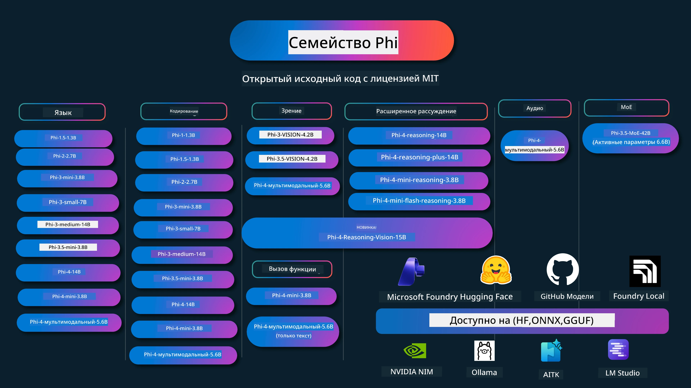

# Phi Cookbook: Практические примеры с моделями Phi от Microsoft

[](https://codespaces.new/microsoft/phicookbook)
[](https://vscode.dev/redirect?url=vscode://ms-vscode-remote.remote-containers/cloneInVolume?url=https://github.com/microsoft/phicookbook)

[](https://GitHub.com/microsoft/phicookbook/graphs/contributors/?WT.mc_id=aiml-137032-kinfeylo)
[](https://GitHub.com/microsoft/phicookbook/issues/?WT.mc_id=aiml-137032-kinfeylo)
[](https://GitHub.com/microsoft/phicookbook/pulls/?WT.mc_id=aiml-137032-kinfeylo)
[](http://makeapullrequest.com?WT.mc_id=aiml-137032-kinfeylo)

[](https://GitHub.com/microsoft/phicookbook/watchers/?WT.mc_id=aiml-137032-kinfeylo)
[](https://GitHub.com/microsoft/phicookbook/network/?WT.mc_id=aiml-137032-kinfeylo)
[](https://GitHub.com/microsoft/phicookbook/stargazers/?WT.mc_id=aiml-137032-kinfeylo)

[](https://discord.com/invite/ByRwuEEgH4)

Phi — это серия моделей искусственного интеллекта с открытым исходным кодом, разработанных Microsoft.

В настоящее время Phi является самой мощной и экономичной небольшой языковой моделью (SLM), с отличными показателями в многоязычных задачах, рассуждениях, генерации текста/чата, кодировании, изображениях, аудио и других сценариях.

Вы можете развернуть Phi в облаке или на периферийных устройствах, и легко создавать приложения генеративного ИИ при ограниченных вычислительных ресурсах.

Следуйте этим шагам, чтобы начать использовать эти ресурсы:
1. **Сделайте форк репозитория**: Нажмите [](https://GitHub.com/microsoft/phicookbook/network/?WT.mc_id=aiml-137032-kinfeylo)
2. **Клонируйте репозиторий**: `git clone https://github.com/microsoft/PhiCookBook.git`
3. [**Присоединяйтесь к сообществу Microsoft AI в Discord и общайтесь с экспертами и разработчиками**](https://discord.com/invite/ByRwuEEgH4?WT.mc_id=aiml-137032-kinfeylo)



### 🌐 Поддержка множества языков

#### Поддерживаемая через GitHub Action (автоматически и всегда актуально)

<!-- CO-OP TRANSLATOR LANGUAGES TABLE START -->
[Арабский](../ar/README.md) | [Бенгальский](../bn/README.md) | [Болгарский](../bg/README.md) | [Бирманский (Мьянма)](../my/README.md) | [Китайский (упрощенный)](../zh-CN/README.md) | [Китайский (традиционный, Гонконг)](../zh-HK/README.md) | [Китайский (традиционный, Макао)](../zh-MO/README.md) | [Китайский (традиционный, Тайвань)](../zh-TW/README.md) | [Хорватский](../hr/README.md) | [Чешский](../cs/README.md) | [Датский](../da/README.md) | [Голландский](../nl/README.md) | [Эстонский](../et/README.md) | [Финский](../fi/README.md) | [Французский](../fr/README.md) | [Немецкий](../de/README.md) | [Греческий](../el/README.md) | [Иврит](../he/README.md) | [Хинди](../hi/README.md) | [Венгерский](../hu/README.md) | [Индонезийский](../id/README.md) | [Итальянский](../it/README.md) | [Японский](../ja/README.md) | [Каннада](../kn/README.md) | [Корейский](../ko/README.md) | [Литовский](../lt/README.md) | [Малайский](../ms/README.md) | [Малаялам](../ml/README.md) | [Марати](../mr/README.md) | [Непальский](../ne/README.md) | [Пиджин нигерийский](../pcm/README.md) | [Норвежский](../no/README.md) | [Персидский (фарси)](../fa/README.md) | [Польский](../pl/README.md) | [Португальский (Бразилия)](../pt-BR/README.md) | [Португальский (Португалия)](../pt-PT/README.md) | [Пенджабский (гурмукхи)](../pa/README.md) | [Румынский](../ro/README.md) | [Русский](./README.md) | [Сербский (кириллица)](../sr/README.md) | [Словацкий](../sk/README.md) | [Словенский](../sl/README.md) | [Испанский](../es/README.md) | [Свахили](../sw/README.md) | [Шведский](../sv/README.md) | [Тагальский (филиппинский)](../tl/README.md) | [Тамильский](../ta/README.md) | [Телугу](../te/README.md) | [Тайский](../th/README.md) | [Турецкий](../tr/README.md) | [Украинский](../uk/README.md) | [Урду](../ur/README.md) | [Вьетнамский](../vi/README.md)

> **Предпочитаете клонировать локально?**
>
> Этот репозиторий включает более 50 переводов, что значительно увеличивает размер загрузки. Чтобы клонировать без переводов, используйте sparse checkout:
>
> **Bash / macOS / Linux:**
> ```bash
> git clone --filter=blob:none --sparse https://github.com/microsoft/PhiCookBook.git
> cd PhiCookBook
> git sparse-checkout set --no-cone '/*' '!translations' '!translated_images'
> ```
>
> **CMD (Windows):**
> ```cmd
> git clone --filter=blob:none --sparse https://github.com/microsoft/PhiCookBook.git
> cd PhiCookBook
> git sparse-checkout set --no-cone "/*" "!translations" "!translated_images"
> ```
>
> Так вы получите всё необходимое для прохождения курса с гораздо более быстрой загрузкой.
<!-- CO-OP TRANSLATOR LANGUAGES TABLE END -->

## Содержание
- Введение - [Добро пожаловать в семью Phi](./md/01.Introduction/01/01.PhiFamily.md) - [Настройка вашей среды](./md/01.Introduction/01/01.EnvironmentSetup.md) - [Понимание ключевых технологий](./md/01.Introduction/01/01.Understandingtech.md) - [Безопасность ИИ для моделей Phi](./md/01.Introduction/01/01.AISafety.md) - [Поддержка оборудования Phi](./md/01.Introduction/01/01.Hardwaresupport.md) - [Модели Phi и доступность на различных платформах](./md/01.Introduction/01/01.Edgeandcloud.md) - [Использование Guidance-ai и Phi](./md/01.Introduction/01/01.Guidance.md) - [Модели на GitHub Marketplace](https://github.com/marketplace/models) - [Каталог моделей Azure AI](https://ai.azure.com) - Работа модели Phi в разных средах - [Hugging face](./md/01.Introduction/02/01.HF.md) - [Модели GitHub](./md/01.Introduction/02/02.GitHubModel.md) - [Каталог моделей Microsoft Foundry](./md/01.Introduction/02/03.AzureAIFoundry.md) - [Ollama](./md/01.Introduction/02/04.Ollama.md) - [AI Toolkit VSCode (AITK)](./md/01.Introduction/02/05.AITK.md) - [NVIDIA NIM](./md/01.Introduction/02/06.NVIDIA.md) - [Foundry Local](./md/01.Introduction/02/07.FoundryLocal.md) - Работа модели Phi Family - [Работа Phi в iOS](./md/01.Introduction/03/iOS_Inference.md) - [Работа Phi в Android](./md/01.Introduction/03/Android_Inference.md) - [Работа Phi в Jetson](./md/01.Introduction/03/Jetson_Inference.md) - [Работа Phi на AI ПК](./md/01.Introduction/03/AIPC_Inference.md) - [Работа Phi с Apple MLX Framework](./md/01.Introduction/03/MLX_Inference.md) - [Работа Phi на локальном сервере](./md/01.Introduction/03/Local_Server_Inference.md) - [Работа Phi на удалённом сервере с AI Toolkit](./md/01.Introduction/03/Remote_Interence.md) - [Работа Phi с Rust](./md/01.Introduction/03/Rust_Inference.md) - [Работа Phi--Vision локально](./md/01.Introduction/03/Vision_Inference.md) - [Работа Phi с Kaito AKS, Azure Containers (официальная поддержка)](./md/01.Introduction/03/Kaito_Inference.md) - [Квантование Phi Family](./md/01.Introduction/04/QuantifyingPhi.md) - [Квантование Phi-3.5 / 4 с использованием llama.cpp](./md/01.Introduction/04/UsingLlamacppQuantifyingPhi.md) - [Квантование Phi-3.5 / 4 с использованием расширений Generative AI для onnxruntime](./md/01.Introduction/04/UsingORTGenAIQuantifyingPhi.md) - [Квантование Phi-3.5 / 4 с использованием Intel OpenVINO](./md/01.Introduction/04/UsingIntelOpenVINOQuantifyingPhi.md) - [Квантование Phi-3.5 / 4 с использованием Apple MLX Framework](./md/01.Introduction/04/UsingAppleMLXQuantifyingPhi.md) - Оценка Phi - [Ответственный ИИ](./md/01.Introduction/05/ResponsibleAI.md) - [Microsoft Foundry для оценки](./md/01.Introduction/05/AIFoundry.md) - [Использование Promptflow для оценки](./md/01.Introduction/05/Promptflow.md) - RAG с Azure AI Search - [Как использовать Phi-4-mini и Phi-4-мультимодальный (RAG) с Azure AI Search](https://github.com/microsoft/PhiCookBook/blob/main/code/06.E2E/E2E_Phi-4-RAG-Azure-AI-Search.ipynb) - Примеры разработки приложений Phi - Текстовые и чат-приложения - Примеры Phi-4 - [📓] [Чат с моделью Phi-4-mini ONNX](./md/02.Application/01.TextAndChat/Phi4/ChatWithPhi4ONNX/README.md) - [Чат с локальной моделью Phi-4 ONNX .NET](../../md/04.HOL/dotnet/src/LabsPhi4-Chat-01OnnxRuntime) - [Чат консольное приложение .NET с Phi-4 ONNX и Semantic Kernel](../../md/04.HOL/dotnet/src/LabsPhi4-Chat-02SK) - Примеры Phi-3 / 3.5 - [Локальный чатбот в браузере с использованием Phi3, ONNX Runtime Web и WebGPU](https://github.com/microsoft/onnxruntime-inference-examples/tree/main/js/chat) - [OpenVino Chat](./md/02.Application/01.TextAndChat/Phi3/E2E_OpenVino_Chat.md) - [Мультимодель - Интерактивный Phi-3-mini и OpenAI Whisper](./md/02.Application/01.TextAndChat/Phi3/E2E_Phi-3-mini_with_whisper.md) - [MLFlow - Создание обёртки и использование Phi-3 с MLFlow](./md//02.Application/01.TextAndChat/Phi3/E2E_Phi-3-MLflow.md) - [Оптимизация модели - Как оптимизировать модель Phi-3-mini для ONNX Runtime Web с Olive](https://github.com/microsoft/Olive/tree/main/examples/phi3) - [WinUI3 приложение с Phi-3 mini-4k-instruct-onnx](https://github.com/microsoft/Phi3-Chat-WinUI3-Sample/) -[Пример заметок с AI с поддержкой WinUI3 Multi Model](https://github.com/microsoft/ai-powered-notes-winui3-sample) - [Тонкая настройка и интеграция пользовательских моделей Phi-3 с Prompt flow](./md/02.Application/01.TextAndChat/Phi3/E2E_Phi-3-FineTuning_PromptFlow_Integration.md) - [Тонкая настройка и интеграция пользовательских моделей Phi-3 с Prompt flow в Microsoft Foundry](./md/02.Application/01.TextAndChat/Phi3/E2E_Phi-3-FineTuning_PromptFlow_Integration_AIFoundry.md) - [Оценка тонко настроенной модели Phi-3 / Phi-3.5 в Microsoft Foundry с упором на принципы ответственного ИИ от Microsoft](./md/02.Application/01.TextAndChat/Phi3/E2E_Phi-3-Evaluation_AIFoundry.md) - [📓] [Пример языкового предсказания Phi-3.5-mini-instruct (китайский/английский)](./md/02.Application/01.TextAndChat/Phi3/phi3-instruct-demo.ipynb) - [Phi-3.5-Instruct WebGPU RAG чатбот](./md/02.Application/01.TextAndChat/Phi3/WebGPUWithPhi35Readme.md) - [Использование Windows GPU для создания решения Prompt flow с Phi-3.5-Instruct ONNX](./md/02.Application/01.TextAndChat/Phi3/UsingPromptFlowWithONNX.md) - [Использование Microsoft Phi-3.5 tflite для создания Android приложения](./md/02.Application/01.TextAndChat/Phi3/UsingPhi35TFLiteCreateAndroidApp.md) - [Пример Q&A на .NET с локальной моделью ONNX Phi-3 с использованием Microsoft.ML.OnnxRuntime](../../md/04.HOL/dotnet/src/LabsPhi301) - [Консольное чат-приложение .NET с Semantic Kernel и Phi-3](../../md/04.HOL/dotnet/src/LabsPhi302) - Примеры кода SDK Azure AI Inference - Примеры Phi-4 - [📓] [Генерация кода проекта с использованием Phi-4-мультимодальный](./md/02.Application/02.Code/Phi4/GenProjectCode/README.md) - Примеры Phi-3 / 3.5 - [Создайте свой собственный чат GitHub Copilot в Visual Studio Code с семейством Microsoft Phi-3](./md/02.Application/02.Code/Phi3/VSCodeExt/README.md) - [Создайте своего собственного агента чат-копилота Visual Studio Code с Phi-3.5 от GitHub Models](/md/02.Application/02.Code/Phi3/CreateVSCodeChatAgentWithGitHubModels.md) - Примеры расширенного рассуждения - Примеры Phi-4 - [📓] [Примеры рассуждений Phi-4-mini или Phi-4](./md/02.Application/03.AdvancedReasoning/Phi4/AdvancedResoningPhi4mini/README.md) - [📓] [Тонкая настройка Phi-4-mini-reasoning с Microsoft Olive](./md/02.Application/03.AdvancedReasoning/Phi4/AdvancedResoningPhi4mini/olive_ft_phi_4_reasoning_with_medicaldata.ipynb) - [📓] [Тонкая настройка Phi-4-mini-reasoning с Apple MLX](./md/02.Application/03.AdvancedReasoning/Phi4/AdvancedResoningPhi4mini/mlx_ft_phi_4_reasoning_with_medicaldata.ipynb) - [📓] [Phi-4-mini-reasoning с GitHub Models](./md/02.Application/02.Code/Phi4r/github_models_inference.ipynb) - [📓] [Phi-4-mini-reasoning с Microsoft Foundry Models](./md/02.Application/02.Code/Phi4r/azure_models_inference.ipynb) -
Демонстрации - [Мини-демо Phi-4, размещённые на Hugging Face Spaces](https://huggingface.co/spaces/microsoft/phi-4-mini?WT.mc_id=aiml-137032-kinfeylo) - [Мультимодальные демо Phi-4, размещённые на Hugging Face Spaces](https://huggingface.co/spaces/microsoft/phi-4-multimodal?WT.mc_id=aiml-137032-kinfeylo) - Образцы Vision - Образцы Phi-4 - [📓] [Использование Phi-4-мультимодального для чтения изображений и генерации кода](./md/02.Application/04.Vision/Phi4/CreateFrontend/README.md) - Образцы Phi-3 / 3.5 - [📓][Phi-3-vision: преобразование текста в изображении в текст](./md/02.Application/04.Vision/Phi3/E2E_Phi-3-vision-image-text-to-text-online-endpoint.ipynb) - [Phi-3-vision-ONNX](https://onnxruntime.ai/docs/genai/tutorials/phi3-v.html) - [📓][Phi-3-vision CLIP Embedding](./md/02.Application/04.Vision/Phi3/E2E_Phi-3-vision-image-text-to-text-online-endpoint.ipynb) - [ДЕМО: Переработка Phi-3](https://github.com/jennifermarsman/PhiRecycling/) - [Phi-3-vision - Визуальный языковой помощник с Phi3-Vision и OpenVINO](https://docs.openvino.ai/nightly/notebooks/phi-3-vision-with-output.html) - [Phi-3 Vision Nvidia NIM](./md/02.Application/04.Vision/Phi3/E2E_Nvidia_NIM_Vision.md) - [Phi-3 Vision OpenVino](./md/02.Application/04.Vision/Phi3/E2E_OpenVino_Phi3Vision.md) - [📓][Phi-3.5 Vision: пример с несколькими кадрами или изображениями](./md/02.Application/04.Vision/Phi3/phi3-vision-demo.ipynb) - [Phi-3 Vision локальная модель ONNX с использованием Microsoft.ML.OnnxRuntime .NET](../../md/04.HOL/dotnet/src/LabsPhi303) - [Меню для Phi-3 Vision локальной модели ONNX с использованием Microsoft.ML.OnnxRuntime .NET](../../md/04.HOL/dotnet/src/LabsPhi304) - Образцы Reasoning-Vision - Phi-4-Reasoning-Vision-15B - [📓] [Использование Phi-4-Reasoning-Vision-15B для обнаружения перехода в неположенном месте](./md/02.Application/10.ReasoningVision/Phi_4_reasoning_vision_15b_Jaywalking.ipynb) - [📓] [Использование Phi-4-Reasoning-Vision-15B для математики](./md/02.Application/10.ReasoningVision/Phi_4_reasoning_vision_15b_Math.ipynb) - [📓] [Использование Phi-4-Reasoning-Vision-15B для обнаружения пользовательского интерфейса](./md/02.Application/10.ReasoningVision/Phi_4_reasoning_vision_15b_ui.ipynb) - Образцы математики - Образцы Phi-4-Mini-Flash-Reasoning-Instruct [Демо по математике с Phi-4-Mini-Flash-Reasoning-Instruct](./md/02.Application/09.Math/MathDemo.ipynb) - Образцы аудио - Образцы Phi-4 - [📓] [Извлечение аудиотранскриптов с помощью Phi-4-мультимодального](./md/02.Application/05.Audio/Phi4/Transciption/README.md) - [📓] [Образец аудио с Phi-4-мультимодальным](./md/02.Application/05.Audio/Phi4/Siri/demo.ipynb) - [📓] [Образец перевода речи с Phi-4-мультимодальным](./md/02.Application/05.Audio/Phi4/Translate/demo.ipynb) - [Консольное приложение .NET, использующее Phi-4-мультимодальный аудио для анализа аудиофайла и создания транскрипта](../../md/04.HOL/dotnet/src/LabsPhi4-MultiModal-02Audio) - Образцы MOE - Образцы Phi-3 / 3.5 - [📓] [Образец модели смеси экспертов Phi-3.5 (MoEs) для социальных сетей](./md/02.Application/06.MoE/Phi3/phi3_moe_demo.ipynb) - [📓] [Создание конвейера Retrieval-Augmented Generation (RAG) с NVIDIA NIM Phi-3 MOE, Azure AI Search и LlamaIndex](./md/02.Application/06.MoE/Phi3/azure-ai-search-nvidia-rag.ipynb) - Образцы Function Calling - Образцы Phi-4 🆕 - [📓] [Использование Function Calling с Phi-4-mini](./md/02.Application/07.FunctionCalling/Phi4/FunctionCallingBasic/README.md) - [📓] [Использование Function Calling для создания мультиагентов с Phi-4-mini](./md/02.Application/07.FunctionCalling/Phi4/Multiagents/Phi_4_mini_multiagent.ipynb) - [📓] [Использование Function Calling с Ollama](./md/02.Application/07.FunctionCalling/Phi4/Ollama/ollama_functioncalling.ipynb) - [📓] [Использование Function Calling с ONNX](./md/02.Application/07.FunctionCalling/Phi4/ONNX/onnx_parallel_functioncalling.ipynb) - Образцы мультимодального смешивания - Образцы Phi-4 🆕 - [📓] [Использование Phi-4-мультимодального как технологического журналиста](./md/02.Application/08.Multimodel/Phi4/TechJournalist/phi_4_mm_audio_text_publish_news.ipynb) - [Консольное приложение .NET, использующее Phi-4-мультимодальный для анализа изображений](../../md/04.HOL/dotnet/src/LabsPhi4-MultiModal-01Images) - Образцы дообучения Phi - [Сценарии дообучения](./md/03.FineTuning/FineTuning_Scenarios.md) - [Дообучение против RAG](./md/03.FineTuning/FineTuning_vs_RAG.md) - [Дообучение: Пусть Phi-3 станет отраслевым экспертом](./md/03.FineTuning/LetPhi3gotoIndustriy.md) - [Дообучение Phi-3 с AI Toolkit для VS Code](./md/03.FineTuning/Finetuning_VSCodeaitoolkit.md) - [Дообучение Phi-3 с Azure Machine Learning Service](./md/03.FineTuning/Introduce_AzureML.md) - [Дообучение Phi-3 с Lora](./md/03.FineTuning/FineTuning_Lora.md) - [Дообучение Phi-3 с QLora](./md/03.FineTuning/FineTuning_Qlora.md) - [Дообучение Phi-3 с Microsoft Foundry](./md/03.FineTuning/FineTuning_AIFoundry.md) - [Дообучение Phi-3 с Azure ML CLI/SDK](./md/03.FineTuning/FineTuning_MLSDK.md) - [Дообучение с Microsoft Olive](./md/03.FineTuning/FineTuning_MicrosoftOlive.md) - [Практическая лаборатория по дообучению с Microsoft Olive](./md/03.FineTuning/olive-lab/readme.md) - [Дообучение Phi-3-vision с Weights and Bias](./md/03.FineTuning/FineTuning_Phi-3-visionWandB.md) - [Дообучение Phi-3 с Apple MLX Framework](./md/03.FineTuning/FineTuning_MLX.md) - [Дообучение Phi-3-vision (официальная поддержка)](./md/03.FineTuning/FineTuning_Vision.md) - [Дообучение Phi-3 с Kaito AKS, Azure Containers (официальная поддержка)](./md/03.FineTuning/FineTuning_Kaito.md) - [Дообучение Phi-3 и 3.5 Vision](https://github.com/2U1/Phi3-Vision-Finetune) - Практические занятия - [Изучение передовых моделей: LLM, SLM, локальная разработка и другое](https://github.com/microsoft/aitour-exploring-cutting-edge-models) - [Раскрытие потенциала NLP: дообучение с Microsoft Olive](https://github.com/azure/Ignite_FineTuning_workshop) - Академические исследовательские работы и публикации - [Textbooks Are All You Need II: технический отчёт phi-1.5](https://arxiv.org/abs/2309.05463) - [Технический отчёт Phi-3: высокоэффективная языковая модель локально на вашем телефоне](https://arxiv.org/abs/2404.14219) - [Технический отчёт Phi-4](https://arxiv.org/abs/2412.08905) - [Технический отчёт Phi-4-Mini: компактные, но мощные мультимодальные языковые модели на основе смеси LoRAs](https://arxiv.org/abs/2503.01743) - [Оптимизация малых языковых моделей для вызова функций в автомобиле](https://arxiv.org/abs/2501.02342) - [(WhyPHI) Дообучение PHI-3 для ответов на вопросы с несколькими вариантами ответов: методология, результаты и задачи](https://arxiv.org/abs/2501.01588) - [Технический отчёт Phi-4-reasoning](https://www.microsoft.com/en-us/research/wp-content/uploads/2025/04/phi_4_reasoning.pdf)
- [Технический отчет Phi-4-mini-reasoning](https://huggingface.co/microsoft/Phi-4-mini-reasoning/blob/main/Phi-4-Mini-Reasoning.pdf)
# Кулинарная книга Phi: Практические примеры с моделями Phi от Microsoft

[](https://codespaces.new/microsoft/phicookbook)
[](https://vscode.dev/redirect?url=vscode://ms-vscode-remote.remote-containers/cloneInVolume?url=https://github.com/microsoft/phicookbook)

[](https://GitHub.com/microsoft/phicookbook/graphs/contributors/?WT.mc_id=aiml-137032-kinfeylo)
[](https://GitHub.com/microsoft/phicookbook/issues/?WT.mc_id=aiml-137032-kinfeylo)
[](https://GitHub.com/microsoft/phicookbook/pulls/?WT.mc_id=aiml-137032-kinfeylo)
[](http://makeapullrequest.com?WT.mc_id=aiml-137032-kinfeylo)

[](https://GitHub.com/microsoft/phicookbook/watchers/?WT.mc_id=aiml-137032-kinfeylo)
[](https://GitHub.com/microsoft/phicookbook/network/?WT.mc_id=aiml-137032-kinfeylo)
[](https://GitHub.com/microsoft/phicookbook/stargazers/?WT.mc_id=aiml-137032-kinfeylo)

[](https://discord.com/invite/ByRwuEEgH4)

Phi — это серия моделей искусственного интеллекта с открытым исходным кодом, разработанных Microsoft.

Phi в настоящее время является самой мощной и экономичной небольшой языковой моделью (SLM) с очень хорошими результатами в многоязычных задачах, логическом рассуждении, генерации текста/чата, программировании, работе с изображениями, аудио и других сценариях.

Вы можете развертывать Phi как в облаке, так и на периферийных устройствах, а также легко создавать приложения на базе генеративного ИИ с ограниченными вычислительными ресурсами.

Выполните следующие шаги, чтобы начать работу с этими ресурсами:
1. **Форкните репозиторий**: Нажмите [](https://GitHub.com/microsoft/phicookbook/network/?WT.mc_id=aiml-137032-kinfeylo)
2. **Клонируйте репозиторий**:   `git clone https://github.com/microsoft/PhiCookBook.git`
3. [**Присоединяйтесь к сообществу Microsoft AI в Discord и знакомьтесь с экспертами и другими разработчиками**](https://discord.com/invite/ByRwuEEgH4?WT.mc_id=aiml-137032-kinfeylo)


### 🌐 Многоязычная поддержка

#### Поддерживается через GitHub Action (автоматически и всегда актуально)

<!-- CO-OP TRANSLATOR LANGUAGES TABLE START -->
[Арабский](../ar/README.md) | [Бенгальский](../bn/README.md) | [Болгарский](../bg/README.md) | [Бирманский (Мьянма)](../my/README.md) | [Китайский (упрощённый)](../zh-CN/README.md) | [Китайский (традиционный, Гонконг)](../zh-HK/README.md) | [Китайский (традиционный, Макао)](../zh-MO/README.md) | [Китайский (традиционный, Тайвань)](../zh-TW/README.md) | [Хорватский](../hr/README.md) | [Чешский](../cs/README.md) | [Датский](../da/README.md) | [Нидерландский](../nl/README.md) | [Эстонский](../et/README.md) | [Финский](../fi/README.md) | [Французский](../fr/README.md) | [Немецкий](../de/README.md) | [Греческий](../el/README.md) | [Иврит](../he/README.md) | [Хинди](../hi/README.md) | [Венгерский](../hu/README.md) | [Индонезийский](../id/README.md) | [Итальянский](../it/README.md) | [Японский](../ja/README.md) | [Каннада](../kn/README.md) | [Корейский](../ko/README.md) | [Литовский](../lt/README.md) | [Малайский](../ms/README.md) | [Малаялам](../ml/README.md) | [Маратхи](../mr/README.md) | [Непальский](../ne/README.md) | [Нигерийский пиджин](../pcm/README.md) | [Норвежский](../no/README.md) | [Персидский (фарси)](../fa/README.md) | [Польский](../pl/README.md) | [Португальский (Бразилия)](../pt-BR/README.md) | [Португальский (Португалия)](../pt-PT/README.md) | [Панджаби (гурмукхи)](../pa/README.md) | [Румынский](../ro/README.md) | [Русский](./README.md) | [Сербский (кириллица)](../sr/README.md) | [Словацкий](../sk/README.md) | [Словенский](../sl/README.md) | [Испанский](../es/README.md) | [Суахили](../sw/README.md) | [Шведский](../sv/README.md) | [Тагалог (филиппинский)](../tl/README.md) | [Тамильский](../ta/README.md) | [Телугу](../te/README.md) | [Тайский](../th/README.md) | [Турецкий](../tr/README.md) | [Украинский](../uk/README.md) | [Урду](../ur/README.md) | [Вьетнамский](../vi/README.md)

> **Предпочитаете клонировать локально?**
>
> В этом репозитории включено более 50 языковых переводов, что значительно увеличивает размер загрузки. Чтобы клонировать без переводов, используйте sparse checkout:
>
> **Bash / macOS / Linux:**
> ```bash
> git clone --filter=blob:none --sparse https://github.com/microsoft/PhiCookBook.git
> cd PhiCookBook
> git sparse-checkout set --no-cone '/*' '!translations' '!translated_images'
> ```
>
> **CMD (Windows):**
> ```cmd
> git clone --filter=blob:none --sparse https://github.com/microsoft/PhiCookBook.git
> cd PhiCookBook
> git sparse-checkout set --no-cone "/*" "!translations" "!translated_images"
> ```
>
> Это даст вам всё необходимое для прохождения курса с гораздо более быстрой загрузкой.
<!-- CO-OP TRANSLATOR LANGUAGES TABLE END -->

## Содержание

## Использование моделей Phi

### Phi на Microsoft Foundry

Вы можете научиться использовать Microsoft Phi и создавать сквозные решения на разных аппаратных устройствах. Чтобы испытать Phi самостоятельно, начните играть с моделями и настраивать Phi для своих сценариев, используя [Каталог моделей Azure AI Microsoft Foundry](https://aka.ms/phi3-azure-ai). Вы можете узнать больше в разделе Начало работы с [Microsoft Foundry](/md/02.QuickStart/AzureAIFoundry_QuickStart.md)

**Площадка для экспериментов**
Для каждой модели есть отдельная площадка для тестирования — [Azure AI Playground](https://aka.ms/try-phi3).

### Phi на GitHub Models

Вы можете научиться использовать Microsoft Phi и создавать сквозные решения на разных аппаратных устройствах. Чтобы испытать Phi самостоятельно, начните играть с моделью и настраивать Phi для своих сценариев, используя [Каталог моделей GitHub](https://github.com/marketplace/models?WT.mc_id=aiml-137032-kinfeylo). Дополнительные сведения в разделе Начало работы с [Каталогом моделей GitHub](/md/02.QuickStart/GitHubModel_QuickStart.md)

**Площадка для экспериментов**
Для каждой модели есть отдельная [площадка для тестирования модели](/md/02.QuickStart/GitHubModel_QuickStart.md).

### Phi на Hugging Face

Модель также доступна на [Hugging Face](https://huggingface.co/microsoft)

**Площадка для экспериментов**
 [Площадка Hugging Chat](https://huggingface.co/chat/models/microsoft/Phi-3-mini-4k-instruct)

 ## 🎒 Другие курсы

Наша команда выпускает и другие курсы! Посмотрите:

<!-- CO-OP TRANSLATOR OTHER COURSES START -->
### LangChain
[](https://aka.ms/langchain4j-for-beginners)
[](https://aka.ms/langchainjs-for-beginners?WT.mc_id=m365-94501-dwahlin)
[](https://github.com/microsoft/langchain-for-beginners?WT.mc_id=m365-94501-dwahlin)
---

### Azure / Edge / MCP / Агенты
[](https://github.com/microsoft/AZD-for-beginners?WT.mc_id=academic-105485-koreyst)
[](https://github.com/microsoft/edgeai-for-beginners?WT.mc_id=academic-105485-koreyst)
[](https://github.com/microsoft/mcp-for-beginners?WT.mc_id=academic-105485-koreyst)
[](https://github.com/microsoft/ai-agents-for-beginners?WT.mc_id=academic-105485-koreyst)

---
 
### Серия по генеративному ИИ
[](https://github.com/microsoft/generative-ai-for-beginners?WT.mc_id=academic-105485-koreyst)
[-9333EA?style=for-the-badge&labelColor=E5E7EB&color=9333EA)](https://github.com/microsoft/Generative-AI-for-beginners-dotnet?WT.mc_id=academic-105485-koreyst)
[-C084FC?style=for-the-badge&labelColor=E5E7EB&color=C084FC)](https://github.com/microsoft/generative-ai-for-beginners-java?WT.mc_id=academic-105485-koreyst)
[-E879F9?style=for-the-badge&labelColor=E5E7EB&color=E879F9)](https://github.com/microsoft/generative-ai-with-javascript?WT.mc_id=academic-105485-koreyst)

---
 
### Основное обучение
[](https://aka.ms/ml-beginners?WT.mc_id=academic-105485-koreyst)
[](https://aka.ms/datascience-beginners?WT.mc_id=academic-105485-koreyst)
[](https://aka.ms/ai-beginners?WT.mc_id=academic-105485-koreyst)
[](https://github.com/microsoft/Security-101?WT.mc_id=academic-96948-sayoung)
[](https://aka.ms/webdev-beginners?WT.mc_id=academic-105485-koreyst)
[](https://aka.ms/iot-beginners?WT.mc_id=academic-105485-koreyst)
[](https://github.com/microsoft/xr-development-for-beginners?WT.mc_id=academic-105485-koreyst)

---
 
### Серия Copilot
[](https://aka.ms/GitHubCopilotAI?WT.mc_id=academic-105485-koreyst)
[](https://github.com/microsoft/mastering-github-copilot-for-dotnet-csharp-developers?WT.mc_id=academic-105485-koreyst)
[](https://github.com/microsoft/CopilotAdventures?WT.mc_id=academic-105485-koreyst)
<!-- CO-OP TRANSLATOR OTHER COURSES END -->

## Ответственный ИИ

Microsoft привержена тому, чтобы помочь нашим клиентам использовать наши AI-продукты ответственно, делясь нашими знаниями и строя партнерские отношения, основанные на доверии, с помощью таких инструментов, как примечания прозрачности и оценки воздействия. Многие из этих ресурсов доступны на [https://aka.ms/RAI](https://aka.ms/RAI).  
Подход Microsoft к ответственному ИИ основан на наших принципах ИИ: справедливость, надежность и безопасность, конфиденциальность и безопасность, инклюзивность, прозрачность и подотчетность.

Модели крупномасштабного обработки естественного языка, изображений и речи — такие, как используемые в этом примере — могут потенциально вести себя несправедливо, ненадежно или оскорбительно, вызывая ущерб. Пожалуйста, ознакомьтесь с [Примечанием о прозрачности для службы Azure OpenAI](https://learn.microsoft.com/legal/cognitive-services/openai/transparency-note?tabs=text) чтобы быть в курсе рисков и ограничений.

Рекомендуемый подход к снижению этих рисков — включить в архитектуру систему безопасности, которая сможет обнаруживать и предотвращать вредоносное поведение. [Azure AI Content Safety](https://learn.microsoft.com/azure/ai-services/content-safety/overview) предоставляет независимый уровень защиты и может обнаруживать вредоносный контент, создаваемый пользователями и ИИ, в приложениях и службах. Azure AI Content Safety включает API для текста и изображений, позволяющие обнаруживать вредоносные материалы. В Microsoft Foundry сервис Content Safety позволяет просматривать, изучать и пробовать примерный код для обнаружения вредоносного контента во всех модальностях. Следующая [документация для быстрого старта](https://learn.microsoft.com/azure/ai-services/content-safety/quickstart-text?tabs=visual-studio%2Clinux&pivots=programming-language-rest) поможет вам сделать запросы к сервису.

Другой аспект, который необходимо учитывать — общая производительность приложения. В многомодальных и многомодельных приложениях под производительностью понимается то, что система работает так, как ожидаете вы и ваши пользователи, включая то, что она не генерирует вредоносные результаты. Важно оценивать производительность всего вашего приложения с помощью [оценщиков производительности, качества, риска и безопасности](https://learn.microsoft.com/azure/ai-studio/concepts/evaluation-metrics-built-in). Также у вас есть возможность создавать и использовать [пользовательские оценщики](https://learn.microsoft.com/azure/ai-studio/how-to/develop/evaluate-sdk#custom-evaluators).

Вы можете оценить своё AI-приложение в вашей среде разработки, используя [Azure AI Evaluation SDK](https://microsoft.github.io/promptflow/index.html). Имея на входе тестовый набор данных или целевой результат, генерации вашего генеративного AI приложения количественно измеряются с помощью встроенных или пользовательских оценщиков на выбор. Чтобы начать работу с azure ai evaluation sdk для оценки вашей системы, следуйте [руководству для быстрого старта](https://learn.microsoft.com/azure/ai-studio/how-to/develop/flow-evaluate-sdk). После выполнения оценки вы можете [визуализировать результаты в Microsoft Foundry](https://learn.microsoft.com/azure/ai-studio/how-to/evaluate-flow-results).

## Торговые марки

Этот проект может содержать торговые марки или логотипы проектов, продуктов или услуг. Авторизованное использование торговых марок или логотипов Microsoft подчиняется и должно соответствовать [Руководству Microsoft по использованию торговых марок и брендов](https://www.microsoft.com/legal/intellectualproperty/trademarks/usage/general).  
Использование торговых марок или логотипов Microsoft в изменённых версиях проекта не должно создавать путаницу или подразумевать спонсорство со стороны Microsoft. Любое использование торговых марок или логотипов третьих лиц подчиняется политикам этих третьих лиц.

## Получение помощи

Если вы застряли или у вас есть вопросы о создании AI-приложений, присоединяйтесь к:

[](https://aka.ms/foundry/discord)

Если у вас есть отзывы о продукте или ошибки при разработке, посетите:

[](https://aka.ms/foundry/forum)

---

<!-- CO-OP TRANSLATOR DISCLAIMER START -->
**Отказ от ответственности**:  
Этот документ был переведен с помощью сервиса машинного перевода [Co-op Translator](https://github.com/Azure/co-op-translator). Несмотря на наши усилия по обеспечению точности, следует учитывать, что автоматические переводы могут содержать ошибки или неточности. Оригинальный документ на его родном языке следует считать авторитетным источником. Для критически важной информации рекомендуется профессиональный перевод человеком. Мы не несём ответственности за любые недоразумения или неправильные толкования, возникшие в результате использования этого перевода.
<!-- CO-OP TRANSLATOR DISCLAIMER END -->