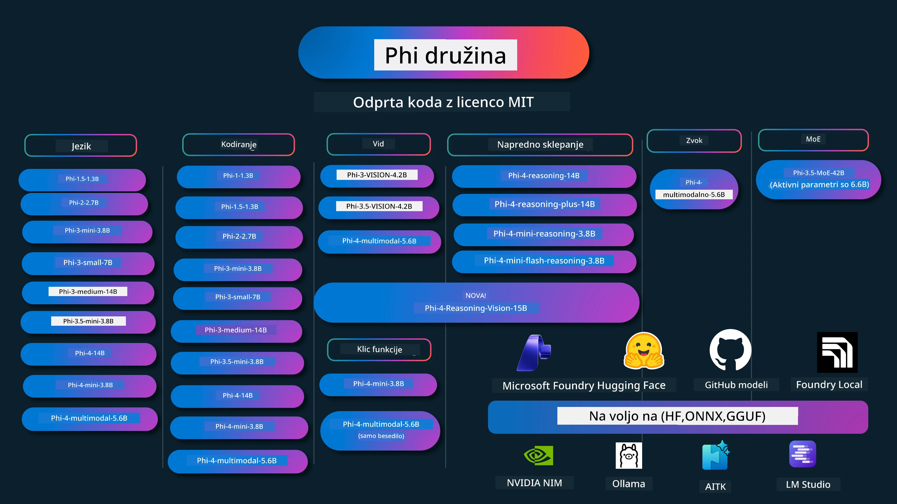

# Kuharska knjiga Phi: Praktični primeri z modeli Phi podjetja Microsoft

[](https://codespaces.new/microsoft/phicookbook)
[](https://vscode.dev/redirect?url=vscode://ms-vscode-remote.remote-containers/cloneInVolume?url=https://github.com/microsoft/phicookbook)

[](https://GitHub.com/microsoft/phicookbook/graphs/contributors/?WT.mc_id=aiml-137032-kinfeylo)
[](https://GitHub.com/microsoft/phicookbook/issues/?WT.mc_id=aiml-137032-kinfeylo)
[](https://GitHub.com/microsoft/phicookbook/pulls/?WT.mc_id=aiml-137032-kinfeylo)
[](http://makeapullrequest.com?WT.mc_id=aiml-137032-kinfeylo)

[](https://GitHub.com/microsoft/phicookbook/watchers/?WT.mc_id=aiml-137032-kinfeylo)
[](https://GitHub.com/microsoft/phicookbook/network/?WT.mc_id=aiml-137032-kinfeylo)
[](https://GitHub.com/microsoft/phicookbook/stargazers/?WT.mc_id=aiml-137032-kinfeylo)

[](https://discord.com/invite/ByRwuEEgH4)

Phi je serija odprtokodnih modelov umetne inteligence, ki jih je razvil Microsoft.

Phi je trenutno najučinkovitejši in stroškovno najbolj učinkovit majhen jezikovni model (SLM), z zelo dobrimi rezultati v večjezičnosti, sklepanju, ustvarjanju besedil/klepetu, kodiranju, slikah, zvoku in drugih scenarijih.

Phi lahko namestite v oblak ali na robne naprave in z omejenimi računalniškimi zmogljivostmi enostavno ustvarite generativne AI aplikacije.

Za začetek rabe teh virov sledite tem korakom:
1. **Razvezi repozitorij**: Kliknite [](https://GitHub.com/microsoft/phicookbook/network/?WT.mc_id=aiml-137032-kinfeylo)
2. **Kloniraj repozitorij**: `git clone https://github.com/microsoft/PhiCookBook.git`
3. [**Pridruži se Microsoft AI Discord skupnosti in spoznaj strokovnjake ter druge razvijalce**](https://discord.com/invite/ByRwuEEgH4?WT.mc_id=aiml-137032-kinfeylo)



### 🌐 Večjezična podpora

#### Podprto preko GitHub Action (avtomatizirano in vedno posodobljeno)

<!-- CO-OP TRANSLATOR LANGUAGES TABLE START -->
[Arabščina](../ar/README.md) | [Bengalščina](../bn/README.md) | [Bolgarščina](../bg/README.md) | [Burmanščina (Mjanmar)](../my/README.md) | [Kitajščina (poenostavljena)](../zh-CN/README.md) | [Kitajščina (tradicionalna, Hong Kong)](../zh-HK/README.md) | [Kitajščina (tradicionalna, Macao)](../zh-MO/README.md) | [Kitajščina (tradicionalna, Tajvan)](../zh-TW/README.md) | [Hrvaščina](../hr/README.md) | [Češčina](../cs/README.md) | [Danščina](../da/README.md) | [Nizozemščina](../nl/README.md) | [Estonščina](../et/README.md) | [Finščina](../fi/README.md) | [Francoščina](../fr/README.md) | [Nemščina](../de/README.md) | [Grščina](../el/README.md) | [Hebrejščina](../he/README.md) | [Hindujščina](../hi/README.md) | [Madžarščina](../hu/README.md) | [Indonezijščina](../id/README.md) | [Italijanščina](../it/README.md) | [Japonščina](../ja/README.md) | [Kannada](../kn/README.md) | [Kmerski jezik](../km/README.md) | [Korejščina](../ko/README.md) | [Litovščina](../lt/README.md) | [Malajščina](../ms/README.md) | [Malajalščina](../ml/README.md) | [Maratščina](../mr/README.md) | [Nepalščina](../ne/README.md) | [Nigerijski pidžin](../pcm/README.md) | [Norveščina](../no/README.md) | [Perzijščina (Farsi)](../fa/README.md) | [Poljščina](../pl/README.md) | [Portugalščina (Brazilija)](../pt-BR/README.md) | [Portugalščina (Portugalska)](../pt-PT/README.md) | [Pandžabščina (Gurmukhi)](../pa/README.md) | [Romunščina](../ro/README.md) | [Ruščina](../ru/README.md) | [Srbščina (cirilica)](../sr/README.md) | [Slovaščina](../sk/README.md) | [Slovenščina](./README.md) | [Španščina](../es/README.md) | [Svahili](../sw/README.md) | [Švedščina](../sv/README.md) | [Tagalog (filipinski)](../tl/README.md) | [Tamilščina](../ta/README.md) | [Telugujščina](../te/README.md) | [Tajščina](../th/README.md) | [Turščina](../tr/README.md) | [Ukrajinščina](../uk/README.md) | [Urdu](../ur/README.md) | [Vietnamščina](../vi/README.md)

> **Raje klonirate lokalno?**
> 
> Ta repozitorij vključuje prevode v več kot 50 jezikov, kar znatno poveča velikost prenosa. Če želite klonirati brez prevodov, uporabite sparse checkout:
> 
> **Bash / macOS / Linux:**
> ```bash
> git clone --filter=blob:none --sparse https://github.com/microsoft/PhiCookBook.git
> cd PhiCookBook
> git sparse-checkout set --no-cone '/*' '!translations' '!translated_images'
> ```
>
> **CMD (Windows):**
> ```cmd
> git clone --filter=blob:none --sparse https://github.com/microsoft/PhiCookBook.git
> cd PhiCookBook
> git sparse-checkout set --no-cone "/*" "!translations" "!translated_images"
> ```
>
> Tako dobite vse, kar potrebujete za dokončanje tečaja, z veliko hitrejšo prenosno hitrostjo.
<!-- CO-OP TRANSLATOR LANGUAGES TABLE END -->

## Vsebina

- Uvod
  - [Dobrodošli v družino Phi](./md/01.Introduction/01/01.PhiFamily.md)
  - [Nastavitev okolja](./md/01.Introduction/01/01.EnvironmentSetup.md)
  - [Razumevanje ključnih tehnologij](./md/01.Introduction/01/01.Understandingtech.md)
  - [Varnost AI za modele Phi](./md/01.Introduction/01/01.AISafety.md)
  - [Podpora za strojno opremo Phi](./md/01.Introduction/01/01.Hardwaresupport.md)
  - [Modeli Phi in razpoložljivost na platformah](./md/01.Introduction/01/01.Edgeandcloud.md)
  - [Uporaba Guidance-ai in Phi](./md/01.Introduction/01/01.Guidance.md)
  - [Modeli na GitHub Marketplace](https://github.com/marketplace/models)
  - [Katalog modelov Azure AI](https://ai.azure.com)

- Inferenca Phi v različnih okoljih
    -  [Hugging face](./md/01.Introduction/02/01.HF.md)
    -  [GitHub modeli](./md/01.Introduction/02/02.GitHubModel.md)
    -  [Microsoft Foundry katalog modelov](./md/01.Introduction/02/03.AzureAIFoundry.md)
    -  [Ollama](./md/01.Introduction/02/04.Ollama.md)
    -  [AI Toolkit VSCode (AITK)](./md/01.Introduction/02/05.AITK.md)
    -  [NVIDIA NIM](./md/01.Introduction/02/06.NVIDIA.md)
    -  [Foundry lokalno](./md/01.Introduction/02/07.FoundryLocal.md)

- Inferenca Phi družine
    - [Inferenca Phi v iOS](./md/01.Introduction/03/iOS_Inference.md)
    - [Inferenca Phi v Androidu](./md/01.Introduction/03/Android_Inference.md)
    - [Inferenca Phi v Jetsonu](./md/01.Introduction/03/Jetson_Inference.md)
    - [Inferenca Phi na AI PCju](./md/01.Introduction/03/AIPC_Inference.md)
    - [Inferenca Phi z Apple MLX Framework](./md/01.Introduction/03/MLX_Inference.md)
    - [Inferenca Phi na lokalnem strežniku](./md/01.Introduction/03/Local_Server_Inference.md)
    - [Inferenca Phi na oddaljenem strežniku z uporabo AI Toolkit](./md/01.Introduction/03/Remote_Interence.md)
    - [Inferenca Phi z Rustom](./md/01.Introduction/03/Rust_Inference.md)
    - [Inferenca Phi–Vid pred lokalno uporabo](./md/01.Introduction/03/Vision_Inference.md)
    - [Inferenca Phi z Kaito AKS, Azure Containers (uradna podpora)](./md/01.Introduction/03/Kaito_Inference.md)
-  [Kvantifikacija družine Phi](./md/01.Introduction/04/QuantifyingPhi.md)
    - [Kvantifikacija Phi-3.5 / 4 z uporabo llama.cpp](./md/01.Introduction/04/UsingLlamacppQuantifyingPhi.md)
    - [Kvantifikacija Phi-3.5 / 4 z uporabo Generative AI razširitev za onnxruntime](./md/01.Introduction/04/UsingORTGenAIQuantifyingPhi.md)
    - [Kvantifikacija Phi-3.5 / 4 z uporabo Intel OpenVINO](./md/01.Introduction/04/UsingIntelOpenVINOQuantifyingPhi.md)
    - [Kvantifikacija Phi-3.5 / 4 z uporabo Apple MLX Framework](./md/01.Introduction/04/UsingAppleMLXQuantifyingPhi.md)

-  Evalvacija Phi
    - [Odgovorna AI](./md/01.Introduction/05/ResponsibleAI.md)
    - [Microsoft Foundry za evalvacijo](./md/01.Introduction/05/AIFoundry.md)
    - [Uporaba Promptflow za evalvacijo](./md/01.Introduction/05/Promptflow.md)
 
- RAG z Azure AI Search
    - [Kako uporabljati Phi-4-mini in Phi-4-multimodal (RAG) z Azure AI Search](https://github.com/microsoft/PhiCookBook/blob/main/code/06.E2E/E2E_Phi-4-RAG-Azure-AI-Search.ipynb)

- Primeri razvoja aplikacij s Phi
  - Besedilne in klepetalne aplikacije
    - Phi-4 primeri 
      - [📓] [Klepet z modelom Phi-4-mini ONNX](./md/02.Application/01.TextAndChat/Phi4/ChatWithPhi4ONNX/README.md)
      - [Klepet z lokalnim modelom Phi-4 ONNX .NET](../../md/04.HOL/dotnet/src/LabsPhi4-Chat-01OnnxRuntime)
      - [Klepet konzolna aplikacija .NET z Phi-4 ONNX z uporabo Semantic Kernel](../../md/04.HOL/dotnet/src/LabsPhi4-Chat-02SK)
    - Phi-3 / 3.5 primeri
      - [Lokalni klepetalni robot v brskalniku z uporabo Phi3, ONNX Runtime Web in WebGPU](https://github.com/microsoft/onnxruntime-inference-examples/tree/main/js/chat)
      - [OpenVino Klepet](./md/02.Application/01.TextAndChat/Phi3/E2E_OpenVino_Chat.md)
      - [Večmodelni - Interaktivni Phi-3-mini in OpenAI Whisper](./md/02.Application/01.TextAndChat/Phi3/E2E_Phi-3-mini_with_whisper.md)
      - [MLFlow - Izdelava ovojnice in uporaba Phi-3 z MLFlow](./md//02.Application/01.TextAndChat/Phi3/E2E_Phi-3-MLflow.md)
      - [Optimizacija modela - Kako optimizirati model Phi-3-min za ONNX Runtime Web z Olive](https://github.com/microsoft/Olive/tree/main/examples/phi3)
      - [WinUI3 aplikacija s Phi-3 mini-4k-instruct-onnx](https://github.com/microsoft/Phi3-Chat-WinUI3-Sample/)
      -[Vzorec večmodelnih opomb z umetno inteligenco WinUI3](https://github.com/microsoft/ai-powered-notes-winui3-sample)
      - [Natančno prilagodite in integrirajte lastne modele Phi-3 s Prompt flow](./md/02.Application/01.TextAndChat/Phi3/E2E_Phi-3-FineTuning_PromptFlow_Integration.md)
      - [Natančno prilagodite in integrirajte lastne modele Phi-3 s Prompt flow v Microsoft Foundry](./md/02.Application/01.TextAndChat/Phi3/E2E_Phi-3-FineTuning_PromptFlow_Integration_AIFoundry.md)
      - [Ocenjevanje natančno prilagojenega modela Phi-3 / Phi-3.5 v Microsoft Foundry s poudarkom na načelih odgovorne umetne inteligence podjetja Microsoft](./md/02.Application/01.TextAndChat/Phi3/E2E_Phi-3-Evaluation_AIFoundry.md)
      - [📓] [Vzorec jezikovne napovedi Phi-3.5-mini-instruct (kitajščina/angleščina)](./md/02.Application/01.TextAndChat/Phi3/phi3-instruct-demo.ipynb)
      - [Phi-3.5-Instruct spletni GPU RAG klepetalnik](./md/02.Application/01.TextAndChat/Phi3/WebGPUWithPhi35Readme.md)
      - [Uporaba Windows GPU za ustvarjanje rešitve Prompt flow s Phi-3.5-Instruct ONNX](./md/02.Application/01.TextAndChat/Phi3/UsingPromptFlowWithONNX.md)
      - [Uporaba Microsoft Phi-3.5 tflite za ustvarjanje Android aplikacije](./md/02.Application/01.TextAndChat/Phi3/UsingPhi35TFLiteCreateAndroidApp.md)
      - [Q&A .NET primer uporabe lokalnega ONNX Phi-3 modela z Microsoft.ML.OnnxRuntime](../../md/04.HOL/dotnet/src/LabsPhi301)
      - [Konzolna .NET aplikacija za klepet s Semantic Kernel in Phi-3](../../md/04.HOL/dotnet/src/LabsPhi302)

  - Azure AI Inference SDK primeri na osnovi kode 
    - Vzorci Phi-4 
      - [📓] [Generiranje kode projekta s Phi-4-multimodal](./md/02.Application/02.Code/Phi4/GenProjectCode/README.md)
    - Vzorci Phi-3 / 3.5
      - [Ustvarite svoj Visual Studio Code GitHub Copilot klepet z Microsoft Phi-3 družino](./md/02.Application/02.Code/Phi3/VSCodeExt/README.md)
      - [Ustvarite svoj Visual Studio Code klepetalnega copilot agenta s Phi-3.5 po modelih GitHub](./md/02.Application/02.Code/Phi3/CreateVSCodeChatAgentWithGitHubModels.md)

  - Napredni vzorci sklepanja
    - Vzorci Phi-4 
      - [📓] [Vzorec Phi-4-mini-sklepanje ali Phi-4-sklepanje](./md/02.Application/03.AdvancedReasoning/Phi4/AdvancedResoningPhi4mini/README.md)
      - [📓] [Natančno prilagajanje Phi-4-mini-sklepanje z Microsoft Olive](./md/02.Application/03.AdvancedReasoning/Phi4/AdvancedResoningPhi4mini/olive_ft_phi_4_reasoning_with_medicaldata.ipynb)
      - [📓] [Natančno prilagajanje Phi-4-mini-sklepanje z Apple MLX](./md/02.Application/03.AdvancedReasoning/Phi4/AdvancedResoningPhi4mini/mlx_ft_phi_4_reasoning_with_medicaldata.ipynb)
      - [📓] [Phi-4-mini-sklepanje z GitHub modeli](./md/02.Application/02.Code/Phi4r/github_models_inference.ipynb)
      - [📓] [Phi-4-mini-sklepanje z Microsoft Foundry modeli](./md/02.Application/02.Code/Phi4r/azure_models_inference.ipynb)
  - Demos
      - [Phi-4-mini demo na Hugging Face Spaces](https://huggingface.co/spaces/microsoft/phi-4-mini?WT.mc_id=aiml-137032-kinfeylo)
      - [Phi-4-multimodal demo na Hugginge Face Spaces](https://huggingface.co/spaces/microsoft/phi-4-multimodal?WT.mc_id=aiml-137032-kinfeylo)
  - Vzorci za vid
    - Vzorci Phi-4 
      - [📓] [Uporaba Phi-4-multimodal za branje slik in ustvarjanje kode](./md/02.Application/04.Vision/Phi4/CreateFrontend/README.md) 
    - Vzorci Phi-3 / 3.5
      -  [📓][Phi-3-vid-slikovni tekst v tekst](./md/02.Application/04.Vision/Phi3/E2E_Phi-3-vision-image-text-to-text-online-endpoint.ipynb)
      - [Phi-3-vid-ONNX](https://onnxruntime.ai/docs/genai/tutorials/phi3-v.html)
      - [📓][Phi-3-vid CLIP embediranje](./md/02.Application/04.Vision/Phi3/E2E_Phi-3-vision-image-text-to-text-online-endpoint.ipynb)
      - [DEMO: Phi-3 Recikliranje](https://github.com/jennifermarsman/PhiRecycling/)
      - [Phi-3-vid - Vizualni jezikovni pomočnik - s Phi3-Vision in OpenVINO](https://docs.openvino.ai/nightly/notebooks/phi-3-vision-with-output.html)
      - [Phi-3 Vid Nvidia NIM](./md/02.Application/04.Vision/Phi3/E2E_Nvidia_NIM_Vision.md)
      - [Phi-3 Vid OpenVino](./md/02.Application/04.Vision/Phi3/E2E_OpenVino_Phi3Vision.md)
      - [📓][Phi-3.5 Vid večslojni ali več-slikovni vzorec](./md/02.Application/04.Vision/Phi3/phi3-vision-demo.ipynb)
      - [Phi-3 Vid lokalni ONNX model z uporabo Microsoft.ML.OnnxRuntime .NET](../../md/04.HOL/dotnet/src/LabsPhi303)
      - [Meni osnovan Phi-3 Vid lokalni ONNX model z uporabo Microsoft.ML.OnnxRuntime .NET](../../md/04.HOL/dotnet/src/LabsPhi304)

  - Razsnovanje-Vid vzorci
    - Phi-4-Razsnovanje-Vid-15B 
      - [📓] [Uporaba Phi-4-Razsnovanje-Vid-15B za zaznavanje prečkanja ceste na mestu, kjer ni prehoda](./md/02.Application/10.ReasoningVision/Phi_4_reasoning_vision_15b_Jaywalking.ipynb)
      - [📓] [Uporaba Phi-4-Razsnovanje-Vid-15B za matematiko](./md/02.Application/10.ReasoningVision/Phi_4_reasoning_vision_15b_Math.ipynb)
      - [📓] [Uporaba Phi-4-Razsnovanje-Vid-15B za zaznavanje uporabniškega vmesnika](./md/02.Application/10.ReasoningVision/Phi_4_reasoning_vision_15b_ui.ipynb)

  - Matematični vzorci
    -  Phi-4-Mini-Flash-Razsnovanje-Instrukt vzorci  [Matematični demo s Phi-4-Mini-Flash-Razsnovanje-Instrukt](./md/02.Application/09.Math/MathDemo.ipynb)

  - Zvočni vzorci
    - Vzorci Phi-4 
      - [📓] [Izvleček zvočnih prepisov z uporabo Phi-4-multimodal](./md/02.Application/05.Audio/Phi4/Transciption/README.md)
      - [📓] [Vzorec zvočnega posnetka Phi-4-multimodal](./md/02.Application/05.Audio/Phi4/Siri/demo.ipynb)
      - [📓] [Vzorec prevajanja govora Phi-4-multimodal](./md/02.Application/05.Audio/Phi4/Translate/demo.ipynb)
      - [.NET konzolna aplikacija, ki uporablja Phi-4-multimodal Audio za analizo zvočne datoteke in generiranje prepisa](../../md/04.HOL/dotnet/src/LabsPhi4-MultiModal-02Audio)

  - MOE Vzorci
    - Vzorci Phi-3 / 3.5
      - [📓] [Phi-3.5 Mešanica strokovnjakov (MoEs) vzorec na družbenih omrežjih](./md/02.Application/06.MoE/Phi3/phi3_moe_demo.ipynb)
      - [📓] [Izdelava Retrieval-Augmented Generation (RAG) cevovoda z NVIDIA NIM Phi-3 MOE, Azure AI Search in LlamaIndex](./md/02.Application/06.MoE/Phi3/azure-ai-search-nvidia-rag.ipynb)
      - 
  - Vzorci klicev funkcij
    - Vzorci Phi-4 🆕
      -  [📓] [Uporaba klicev funkcij s Phi-4-mini](./md/02.Application/07.FunctionCalling/Phi4/FunctionCallingBasic/README.md)
      -  [📓] [Uporaba klicev funkcij za ustvarjanje več agentov s Phi-4-mini](./md/02.Application/07.FunctionCalling/Phi4/Multiagents/Phi_4_mini_multiagent.ipynb)
      -  [📓] [Uporaba klicev funkcij z Ollama](./md/02.Application/07.FunctionCalling/Phi4/Ollama/ollama_functioncalling.ipynb)
      -  [📓] [Uporaba klicev funkcij z ONNX](./md/02.Application/07.FunctionCalling/Phi4/ONNX/onnx_parallel_functioncalling.ipynb)
  - Vzorci multimodalnega mešanja
    - Vzorci Phi-4 🆕
      -  [📓] [Uporaba Phi-4-multimodal kot tehnološkega novinarja](./md/02.Application/08.Multimodel/Phi4/TechJournalist/phi_4_mm_audio_text_publish_news.ipynb)
      - [.NET konzolna aplikacija, ki uporablja Phi-4-multimodal za analizo slik](../../md/04.HOL/dotnet/src/LabsPhi4-MultiModal-01Images)

- Natančno prilagajanje Phi vzorcev
  - [Scenariji natančnega prilagajanja](./md/03.FineTuning/FineTuning_Scenarios.md)
  - [Natančno prilagajanje vs RAG](./md/03.FineTuning/FineTuning_vs_RAG.md)
  - [Natančno prilagajanje naj Phi-3 postane industrijski strokovnjak](./md/03.FineTuning/LetPhi3gotoIndustriy.md)
  - [Natančno prilagajanje Phi-3 z AI orodji za VS Code](./md/03.FineTuning/Finetuning_VSCodeaitoolkit.md)
  - [Natančno prilagajanje Phi-3 z Azure Machine Learning Service](./md/03.FineTuning/Introduce_AzureML.md)
  - [Natančno prilagajanje Phi-3 z Loro](./md/03.FineTuning/FineTuning_Lora.md)
  - [Natančno prilagajanje Phi-3 z QLoro](./md/03.FineTuning/FineTuning_Qlora.md)
  - [Natančno prilagajanje Phi-3 z Microsoft Foundry](./md/03.FineTuning/FineTuning_AIFoundry.md)
  - [Natančno prilagajanje Phi-3 z Azure ML CLI/SDK](./md/03.FineTuning/FineTuning_MLSDK.md)
  - [Natančno prilagajanje z Microsoft Olive](./md/03.FineTuning/FineTuning_MicrosoftOlive.md)
  - [Natančno prilagajanje z Microsoft Olive praksa v laboratoriju](./md/03.FineTuning/olive-lab/readme.md)
  - [Natančno prilagajanje Phi-3-vision z Weights and Bias](./md/03.FineTuning/FineTuning_Phi-3-visionWandB.md)
  - [Natančno prilagajanje Phi-3 z Apple MLX okvirom](./md/03.FineTuning/FineTuning_MLX.md)
  - [Natančno prilagajanje Phi-3-vision (uradna podpora)](./md/03.FineTuning/FineTuning_Vision.md)
  - [Fino nastavljanje Phi-3 z Kaito AKS, Azure Containers (uradna podpora)](./md/03.FineTuning/FineTuning_Kaito.md)
  - [Fino nastavljanje Phi-3 in 3.5 Vision](https://github.com/2U1/Phi3-Vision-Finetune)

- Praktična delavnica
  - [Raziskovanje najnovejših modelov: LLM, SLM, lokalni razvoj in še več](https://github.com/microsoft/aitour-exploring-cutting-edge-models)
  - [Odklepanje potenciala NLP: fino nastavljanje z Microsoft Olive](https://github.com/azure/Ignite_FineTuning_workshop)

- Akademske raziskovalne naloge in publikacije
  - [Vse, kar potrebujete, II: tehnično poročilo phi-1.5](https://arxiv.org/abs/2309.05463)
  - [Tehnično poročilo Phi-3: zelo zmogljiv jezikovni model lokalno na vašem telefonu](https://arxiv.org/abs/2404.14219)
  - [Tehnično poročilo Phi-4](https://arxiv.org/abs/2412.08905)
  - [Tehnično poročilo Phi-4-Mini: kompaktni, vendar zmogljivi multimodalni jezikovni modeli preko mešanice LoRA](https://arxiv.org/abs/2503.01743)
  - [Optimizacija majhnih jezikovnih modelov za funkcijsko klicanje v vozilu](https://arxiv.org/abs/2501.02342)
  - [(WhyPHI) Fino nastavljanje PHI-3 za odgovarjanje na vprašanja z več izbirami: metodologija, rezultati in izzivi](https://arxiv.org/abs/2501.01588)
  - [Tehnično poročilo Phi-4 za sklepanje](https://www.microsoft.com/en-us/research/wp-content/uploads/2025/04/phi_4_reasoning.pdf)
  - [Tehnično poročilo Phi-4-mini za sklepanje](https://huggingface.co/microsoft/Phi-4-mini-reasoning/blob/main/Phi-4-Mini-Reasoning.pdf)

## Uporaba Phi modelov

### Phi na Microsoft Foundry

Lahko se naučite, kako uporabljati Microsoft Phi in kako graditi E2E rešitve na različnih strojnih napravah. Da bi doživeli Phi sami, začnite z igranjem z modeli in prilagajanjem Phi za vaše scenarije z uporabo [Microsoft Foundry Azure AI Model Catalog](https://aka.ms/phi3-azure-ai). Več lahko izveste v vodiču Začetek dela z [Microsoft Foundry](/md/02.QuickStart/AzureAIFoundry_QuickStart.md).

**Igralnica**
Vsak model ima svojo namenjeno igralnico za testiranje modela [Azure AI Playground](https://aka.ms/try-phi3).

### Phi na GitHub modelih

Lahko se naučite, kako uporabljati Microsoft Phi in kako graditi E2E rešitve na različnih strojnih napravah. Da bi doživeli Phi sami, začnite z igranjem z modelom in prilagajanjem Phi za vaše scenarije z uporabo [GitHub Model Catalog](https://github.com/marketplace/models?WT.mc_id=aiml-137032-kinfeylo). Več lahko izveste v vodiču Začetek dela z [GitHub Model Catalog](/md/02.QuickStart/GitHubModel_QuickStart.md).

**Igralnica**
Vsak model ima namenjeno [igralnico za testiranje modela](/md/02.QuickStart/GitHubModel_QuickStart.md).

### Phi na Hugging Face

Model lahko prav tako najdete na [Hugging Face](https://huggingface.co/microsoft).

**Igralnica**
[Hugging Chat igralnica](https://huggingface.co/chat/models/microsoft/Phi-3-mini-4k-instruct)

## 🎒 Drugi tečaji

Naša ekipa ustvarja tudi druge tečaje! Oglejte si:

<!-- CO-OP TRANSLATOR OTHER COURSES START -->
### LangChain
[](https://aka.ms/langchain4j-for-beginners)
[](https://aka.ms/langchainjs-for-beginners?WT.mc_id=m365-94501-dwahlin)
[](https://github.com/microsoft/langchain-for-beginners?WT.mc_id=m365-94501-dwahlin)
---

### Azure / Edge / MCP / Agent
[](https://github.com/microsoft/AZD-for-beginners?WT.mc_id=academic-105485-koreyst)
[](https://github.com/microsoft/edgeai-for-beginners?WT.mc_id=academic-105485-koreyst)
[](https://github.com/microsoft/mcp-for-beginners?WT.mc_id=academic-105485-koreyst)
[](https://github.com/microsoft/ai-agents-for-beginners?WT.mc_id=academic-105485-koreyst)

---

### Serija generativne umetne inteligence
[](https://github.com/microsoft/generative-ai-for-beginners?WT.mc_id=academic-105485-koreyst)
[-9333EA?style=for-the-badge&labelColor=E5E7EB&color=9333EA)](https://github.com/microsoft/Generative-AI-for-beginners-dotnet?WT.mc_id=academic-105485-koreyst)
[-C084FC?style=for-the-badge&labelColor=E5E7EB&color=C084FC)](https://github.com/microsoft/generative-ai-for-beginners-java?WT.mc_id=academic-105485-koreyst)
[-E879F9?style=for-the-badge&labelColor=E5E7EB&color=E879F9)](https://github.com/microsoft/generative-ai-with-javascript?WT.mc_id=academic-105485-koreyst)

---

### Temeljno učenje
[](https://aka.ms/ml-beginners?WT.mc_id=academic-105485-koreyst)
[](https://aka.ms/datascience-beginners?WT.mc_id=academic-105485-koreyst)
[](https://aka.ms/ai-beginners?WT.mc_id=academic-105485-koreyst)
[](https://github.com/microsoft/Security-101?WT.mc_id=academic-96948-sayoung)
[](https://aka.ms/webdev-beginners?WT.mc_id=academic-105485-koreyst)
[](https://aka.ms/iot-beginners?WT.mc_id=academic-105485-koreyst)
[](https://github.com/microsoft/xr-development-for-beginners?WT.mc_id=academic-105485-koreyst)

---

### Serija Copilot
[](https://aka.ms/GitHubCopilotAI?WT.mc_id=academic-105485-koreyst)
[](https://github.com/microsoft/mastering-github-copilot-for-dotnet-csharp-developers?WT.mc_id=academic-105485-koreyst)
[](https://github.com/microsoft/CopilotAdventures?WT.mc_id=academic-105485-koreyst)
<!-- CO-OP TRANSLATOR OTHER COURSES END -->

## Odgovorna umetna inteligenca

Microsoft se zavezuje pomagati našim strankam, da uporabljajo naše AI izdelke odgovorno, deliti naša spoznanja in graditi partnerske odnose, ki temeljijo na zaupanju, preko orodij, kot so Beležke transparentnosti in Ocene vpliva. Veliko teh virov lahko najdete na [https://aka.ms/RAI](https://aka.ms/RAI).
Microsoftov pristop k odgovorni AI temelji na naših načelih AI: pravičnost, zanesljivost in varnost, zasebnost in varnost, vključenost, transparentnost in odgovornost.

Veliki naravni jezikovni, slikovni in glasovni modeli – kot tisti, uporabljeni v tem vzorcu – se lahko potencialno vedejo na načine, ki niso pravični, zanesljivi ali so žaljivi, kar lahko povzroči škodo. Za informacije o tveganjih in omejitvah si oglejte [Opombo o transparentnosti storitve Azure OpenAI](https://learn.microsoft.com/legal/cognitive-services/openai/transparency-note?tabs=text).
Priporočeni pristop za omilitev teh tveganj je vključitev varnostnega sistema v vašo arhitekturo, ki lahko zazna in prepreči škodljivo vedenje. [Azure AI Content Safety](https://learn.microsoft.com/azure/ai-services/content-safety/overview) zagotavlja neodvisno zaščitno plast, ki je sposobna zaznati škodljivo vsebino, ki jo ustvarijo uporabniki ali AI, v aplikacijah in storitvah. Azure AI Content Safety vključuje API-je za besedilo in slike, ki omogočajo zaznavanje škodljivega gradiva. V okviru Microsoft Foundry storitev Content Safety omogoča ogled, raziskovanje in preizkus vzorčne kode za zaznavanje škodljive vsebine v različnih oblikah. Naslednja [hitri začetek dokumentacije](https://learn.microsoft.com/azure/ai-services/content-safety/quickstart-text?tabs=visual-studio%2Clinux&pivots=programming-language-rest) vas vodi skozi pošiljanje zahtevkov tej storitvi.

Drugi vidik, ki ga je treba upoštevati, je splošna zmogljivost aplikacije. Pri večmodalnih in večmodelnih aplikacijah zmogljivost razumemo kot to, da sistem deluje tako, kot vi in vaši uporabniki pričakujete, vključno s tem, da ne ustvarja škodljivih izhodov. Pomembno je oceniti zmogljivost vaše celotne aplikacije z uporabo [ocenjevalcev zmogljivosti, kakovosti, tveganja in varnosti](https://learn.microsoft.com/azure/ai-studio/concepts/evaluation-metrics-built-in). Prav tako imate možnost ustvarjati in ocenjevati z [lastnimi ocenjevalci](https://learn.microsoft.com/azure/ai-studio/how-to/develop/evaluate-sdk#custom-evaluators).

Svojo AI aplikacijo lahko ocenjujete v vašem razvojnem okolju z uporabo [Azure AI Evaluation SDK](https://microsoft.github.io/promptflow/index.html). Glede na testni nabor podatkov ali ciljno vrednost so generacije vaše generativne AI aplikacije kvantitativno izmerjene s pomočjo vgrajenih ali vaših lastnih izbranih ocenjevalcev. Za začetek z azure ai evaluation sdk za ocenjevanje vašega sistema lahko sledite [hitremu vodniku](https://learn.microsoft.com/azure/ai-studio/how-to/develop/flow-evaluate-sdk). Ko izvedete ocenjevalno izvedbo, lahko [vizualizirate rezultate v Microsoft Foundry](https://learn.microsoft.com/azure/ai-studio/how-to/evaluate-flow-results).

## Blagovne znamke

Ta projekt lahko vsebuje blagovne znamke ali logotipe za projekte, izdelke ali storitve. Dovoljena uporaba Microsoftovih blagovnih znamk ali logotipov je predmet in mora slediti [Microsoftovim smernicam za blagovne znamke in znamčenje](https://www.microsoft.com/legal/intellectualproperty/trademarks/usage/general).
Uporaba Microsoftovih blagovnih znamk ali logotipov v spremenjenih različicah tega projekta ne sme povzročiti zmede ali nakazovati sponzorstva s strani Microsofta. Vsaka uporaba blagovnih znamk ali logotipov tretjih oseb je predmet politik teh tretjih oseb.

## Pomoč

Če naletite na težave ali imate vprašanja o ustvarjanju AI aplikacij, se pridružite:

[](https://aka.ms/foundry/discord)

Če imate povratne informacije o izdelku ali napake med razvojem, obiščite:

[](https://aka.ms/foundry/forum)

---

<!-- CO-OP TRANSLATOR DISCLAIMER START -->
**Omejitev odgovornosti**:
Ta dokument je bil preveden z uporabo storitve za prevajanje z umetno inteligenco [Co-op Translator](https://github.com/Azure/co-op-translator). Čeprav si prizadevamo za natančnost, upoštevajte, da lahko avtomatizirani prevodi vsebujejo napake ali netočnosti. Izvirni dokument v njegovem maternem jeziku se šteje za avtoritativni vir. Za ključne informacije priporočamo strokovni človeški prevod. Ne odgovarjamo za morebitna nesporazume ali napačne interpretacije, ki izhajajo iz uporabe tega prevoda.
<!-- CO-OP TRANSLATOR DISCLAIMER END -->