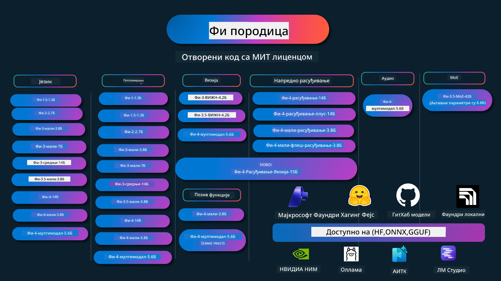

# Phi Cookbook: Примери за праксу са Microsoft Phi моделима

[](https://codespaces.new/microsoft/phicookbook)
[](https://vscode.dev/redirect?url=vscode://ms-vscode-remote.remote-containers/cloneInVolume?url=https://github.com/microsoft/phicookbook)

[](https://GitHub.com/microsoft/phicookbook/graphs/contributors/?WT.mc_id=aiml-137032-kinfeylo)
[](https://GitHub.com/microsoft/phicookbook/issues/?WT.mc_id=aiml-137032-kinfeylo)
[](https://GitHub.com/microsoft/phicookbook/pulls/?WT.mc_id=aiml-137032-kinfeylo)
[](http://makeapullrequest.com?WT.mc_id=aiml-137032-kinfeylo)

[](https://GitHub.com/microsoft/phicookbook/watchers/?WT.mc_id=aiml-137032-kinfeylo)
[](https://GitHub.com/microsoft/phicookbook/network/?WT.mc_id=aiml-137032-kinfeylo)
[](https://GitHub.com/microsoft/phicookbook/stargazers/?WT.mc_id=aiml-137032-kinfeylo)

[](https://discord.com/invite/ByRwuEEgH4)

Phi је серија отворених AI модела које је развио Microsoft.

Phi је тренутно најмоћнији и најисплативији мали језички модел (SLM), са врло добрим резултатима у мултијезику, резоновању, генерисању текста/четова, кодирању, сликама, звуку и другим сценаријима.

Можете да распоредите Phi у облаку или на ивици уређаја, и лако градите генеративне AI апликације са ограниченом рачунарском снагом.

Пратите ове кораке за почетак коришћења ових ресурса:
1. **Направите форк репозиторијума**: Кликните [](https://GitHub.com/microsoft/phicookbook/network/?WT.mc_id=aiml-137032-kinfeylo)
2. **Клонирајте репозиторијум**: `git clone https://github.com/microsoft/PhiCookBook.git`
3. [**Придружите се Microsoft AI Discord заједници и упознајте стручњаке и друге програмере**](https://discord.com/invite/ByRwuEEgH4?WT.mc_id=aiml-137032-kinfeylo)



### 🌐 Подршка за више језика

#### Подржано преко GitHub Action (аутоматски и увек ажурирано)

<!-- CO-OP TRANSLATOR LANGUAGES TABLE START -->
[Arabic](../ar/README.md) | [Bengali](../bn/README.md) | [Bulgarian](../bg/README.md) | [Burmese (Myanmar)](../my/README.md) | [Chinese (Simplified)](../zh-CN/README.md) | [Chinese (Traditional, Hong Kong)](../zh-HK/README.md) | [Chinese (Traditional, Macau)](../zh-MO/README.md) | [Chinese (Traditional, Taiwan)](../zh-TW/README.md) | [Croatian](../hr/README.md) | [Czech](../cs/README.md) | [Danish](../da/README.md) | [Dutch](../nl/README.md) | [Estonian](../et/README.md) | [Finnish](../fi/README.md) | [French](../fr/README.md) | [German](../de/README.md) | [Greek](../el/README.md) | [Hebrew](../he/README.md) | [Hindi](../hi/README.md) | [Hungarian](../hu/README.md) | [Indonesian](../id/README.md) | [Italian](../it/README.md) | [Japanese](../ja/README.md) | [Kannada](../kn/README.md) | [Khmer](../km/README.md) | [Korean](../ko/README.md) | [Lithuanian](../lt/README.md) | [Malay](../ms/README.md) | [Malayalam](../ml/README.md) | [Marathi](../mr/README.md) | [Nepali](../ne/README.md) | [Nigerian Pidgin](../pcm/README.md) | [Norwegian](../no/README.md) | [Persian (Farsi)](../fa/README.md) | [Polish](../pl/README.md) | [Portuguese (Brazil)](../pt-BR/README.md) | [Portuguese (Portugal)](../pt-PT/README.md) | [Punjabi (Gurmukhi)](../pa/README.md) | [Romanian](../ro/README.md) | [Russian](../ru/README.md) | [Serbian (Cyrillic)](./README.md) | [Slovak](../sk/README.md) | [Slovenian](../sl/README.md) | [Spanish](../es/README.md) | [Swahili](../sw/README.md) | [Swedish](../sv/README.md) | [Tagalog (Filipino)](../tl/README.md) | [Tamil](../ta/README.md) | [Telugu](../te/README.md) | [Thai](../th/README.md) | [Turkish](../tr/README.md) | [Ukrainian](../uk/README.md) | [Urdu](../ur/README.md) | [Vietnamese](../vi/README.md)

> **Више волите локално клонирање?**
>
> Овај репозиторијум укључује преко 50 превода на језике што значајно повећава величину преузимања. Да бисте клонирали без превода, користите sparse checkout:
>
> **Bash / macOS / Linux:**
> ```bash
> git clone --filter=blob:none --sparse https://github.com/microsoft/PhiCookBook.git
> cd PhiCookBook
> git sparse-checkout set --no-cone '/*' '!translations' '!translated_images'
> ```
>
> **CMD (Windows):**
> ```cmd
> git clone --filter=blob:none --sparse https://github.com/microsoft/PhiCookBook.git
> cd PhiCookBook
> git sparse-checkout set --no-cone "/*" "!translations" "!translated_images"
> ```
>
> Ово вам даје све што вам је потребно за завршетак курса са много бржим преузимањем.
<!-- CO-OP TRANSLATOR LANGUAGES TABLE END -->

## Садржај

- Увод
  - [Добро дошли у Phi породицу](./md/01.Introduction/01/01.PhiFamily.md)
  - [Подешавање вашег окружења](./md/01.Introduction/01/01.EnvironmentSetup.md)
  - [Разумевање кључних технологија](./md/01.Introduction/01/01.Understandingtech.md)
  - [AI безбедност за Phi моделе](./md/01.Introduction/01/01.AISafety.md)
  - [Подршка за Phi хардвер](./md/01.Introduction/01/01.Hardwaresupport.md)
  - [Phi модели и доступност на платформама](./md/01.Introduction/01/01.Edgeandcloud.md)
  - [Коришћење Guidance-ai и Phi](./md/01.Introduction/01/01.Guidance.md)
  - [GitHub Marketplace модели](https://github.com/marketplace/models)
  - [Azure AI каталог модела](https://ai.azure.com)

- Инференција Phi у различитим окружењима
    -  [Hugging face](./md/01.Introduction/02/01.HF.md)
    -  [GitHub модели](./md/01.Introduction/02/02.GitHubModel.md)
    -  [Microsoft Foundry каталог модела](./md/01.Introduction/02/03.AzureAIFoundry.md)
    -  [Ollama](./md/01.Introduction/02/04.Ollama.md)
    -  [AI Toolkit VSCode (AITK)](./md/01.Introduction/02/05.AITK.md)
    -  [NVIDIA NIM](./md/01.Introduction/02/06.NVIDIA.md)
    -  [Foundry Local](./md/01.Introduction/02/07.FoundryLocal.md)

- Инференција Phi породице
    - [Инференција Phi на iOS](./md/01.Introduction/03/iOS_Inference.md)
    - [Инференција Phi на Android](./md/01.Introduction/03/Android_Inference.md)
    - [Инференција Phi на Jetson](./md/01.Introduction/03/Jetson_Inference.md)
    - [Инференција Phi на AI PC](./md/01.Introduction/03/AIPC_Inference.md)
    - [Инференција Phi са Apple MLX Framework](./md/01.Introduction/03/MLX_Inference.md)
    - [Инференција Phi на локалном серверу](./md/01.Introduction/03/Local_Server_Inference.md)
    - [Инференција Phi на даљинском серверу помоћу AI Toolkit](./md/01.Introduction/03/Remote_Interence.md)
    - [Инференција Phi са Rust](./md/01.Introduction/03/Rust_Inference.md)
    - [Инференција Phi--Vision локално](./md/01.Introduction/03/Vision_Inference.md)
    - [Инференција Phi са Kaito AKS, Azure Containers (званична подршка)](./md/01.Introduction/03/Kaito_Inference.md)
-  [Квантификација Phi породице](./md/01.Introduction/04/QuantifyingPhi.md)
    - [Квантизација Phi-3.5 / 4 коришћењем llama.cpp](./md/01.Introduction/04/UsingLlamacppQuantifyingPhi.md)
    - [Квантизација Phi-3.5 / 4 коришћењем Generative AI екстензија за onnxruntime](./md/01.Introduction/04/UsingORTGenAIQuantifyingPhi.md)
    - [Квантизација Phi-3.5 / 4 коришћењем Intel OpenVINO](./md/01.Introduction/04/UsingIntelOpenVINOQuantifyingPhi.md)
    - [Квантизација Phi-3.5 / 4 коришћењем Apple MLX Framework](./md/01.Introduction/04/UsingAppleMLXQuantifyingPhi.md)

-  Евалуација Phi
    - [Одговорно AI](./md/01.Introduction/05/ResponsibleAI.md)
    - [Microsoft Foundry за евалуацију](./md/01.Introduction/05/AIFoundry.md)
    - [Коришћење Promptflow за евалуацију](./md/01.Introduction/05/Promptflow.md)
 
- RAG са Azure AI Search
    - [Како користити Phi-4-mini и Phi-4-multimodal (RAG) са Azure AI Search](https://github.com/microsoft/PhiCookBook/blob/main/code/06.E2E/E2E_Phi-4-RAG-Azure-AI-Search.ipynb)

- Примери развоја Phi апликација
  - Текст и апликације за чет
    - Phi-4 примери
      - [📓] [Ћаскање са Phi-4-mini ONNX моделом](./md/02.Application/01.TextAndChat/Phi4/ChatWithPhi4ONNX/README.md)
      - [Ћаскање са Phi-4 локалним ONNX моделом у .NET](../../md/04.HOL/dotnet/src/LabsPhi4-Chat-01OnnxRuntime)
      - [Конзолна апликација за чет у .NET са Phi-4 ONNX и Semantic Kernel](../../md/04.HOL/dotnet/src/LabsPhi4-Chat-02SK)
    - Phi-3 / 3.5 примери
      - [Локални chatbot у прегледачу користећи Phi3, ONNX Runtime Web и WebGPU](https://github.com/microsoft/onnxruntime-inference-examples/tree/main/js/chat)
      - [OpenVino Chat](./md/02.Application/01.TextAndChat/Phi3/E2E_OpenVino_Chat.md)
      - [Višestruki modeli - Interaktivni Phi-3-mini i OpenAI Whisper](./md/02.Application/01.TextAndChat/Phi3/E2E_Phi-3-mini_with_whisper.md)
      - [MLFlow - Pravljenje omotača i korišćenje Phi-3 sa MLFlow](./md//02.Application/01.TextAndChat/Phi3/E2E_Phi-3-MLflow.md)
      - [Optimizacija modela - Kako optimizovati Phi-3-min model za ONNX Runtime Web sa Olive](https://github.com/microsoft/Olive/tree/main/examples/phi3)
      - [WinUI3 aplikacija sa Phi-3 mini-4k-instruct-onnx](https://github.com/microsoft/Phi3-Chat-WinUI3-Sample/)
      -[WinUI3 Višestruki modeli AI pokretana aplikacija za beleške primer](https://github.com/microsoft/ai-powered-notes-winui3-sample)
      - [Fino podešavanje i integracija prilagođenih Phi-3 modela sa Prompt flow](./md/02.Application/01.TextAndChat/Phi3/E2E_Phi-3-FineTuning_PromptFlow_Integration.md)
      - [Fino podešavanje i integracija prilagođenih Phi-3 modela sa Prompt flow u Microsoft Foundry](./md/02.Application/01.TextAndChat/Phi3/E2E_Phi-3-FineTuning_PromptFlow_Integration_AIFoundry.md)
      - [Evaluacija fino podešenog Phi-3 / Phi-3.5 modela u Microsoft Foundry sa fokusom na Microsoftove principe Odgovornog AI](./md/02.Application/01.TextAndChat/Phi3/E2E_Phi-3-Evaluation_AIFoundry.md)
      - [📓] [Phi-3.5-mini-instruct uzorak predviđanja jezika (kineski/engleski)](./md/02.Application/01.TextAndChat/Phi3/phi3-instruct-demo.ipynb)
      - [Phi-3.5-Instruct WebGPU RAG Četbot](./md/02.Application/01.TextAndChat/Phi3/WebGPUWithPhi35Readme.md)
      - [Korišćenje Windows GPU za kreiranje Prompt flow rešenja sa Phi-3.5-Instruct ONNX](./md/02.Application/01.TextAndChat/Phi3/UsingPromptFlowWithONNX.md)
      - [Korišćenje Microsoft Phi-3.5 tflite za kreiranje Android aplikacije](./md/02.Application/01.TextAndChat/Phi3/UsingPhi35TFLiteCreateAndroidApp.md)
      - [Q&A .NET primer koristeći lokalni ONNX Phi-3 model sa Microsoft.ML.OnnxRuntime](../../md/04.HOL/dotnet/src/LabsPhi301)
      - [Konzolna čat .NET aplikacija sa Semantic Kernel i Phi-3](../../md/04.HOL/dotnet/src/LabsPhi302)

  - Azure AI Inference SDK Primeri zasnovani na kodu
    - Phi-4 Primeri
      - [📓] [Generisanje koda projekta korišćenjem Phi-4-multimodal](./md/02.Application/02.Code/Phi4/GenProjectCode/README.md)
    - Phi-3 / 3.5 Primeri
      - [Pravljenje sopstvenog Visual Studio Code GitHub Copilot čata sa Microsoft Phi-3 porodicom](./md/02.Application/02.Code/Phi3/VSCodeExt/README.md)
      - [Kreiranje sopstvenog Visual Studio Code Chat Copilot agenta sa Phi-3.5 po GitHub modelima](/md/02.Application/02.Code/Phi3/CreateVSCodeChatAgentWithGitHubModels.md)

  - Primeri naprednog rezonovanja
    - Phi-4 Primeri
      - [📓] [Phi-4-mini-razmišljanje ili Phi-4-razmišljanje primeri](./md/02.Application/03.AdvancedReasoning/Phi4/AdvancedResoningPhi4mini/README.md)
      - [📓] [Fino podešavanje Phi-4-mini-razmišljanja sa Microsoft Olive](./md/02.Application/03.AdvancedReasoning/Phi4/AdvancedResoningPhi4mini/olive_ft_phi_4_reasoning_with_medicaldata.ipynb)
      - [📓] [Fino podešavanje Phi-4-mini-razmišljanja sa Apple MLX](./md/02.Application/03.AdvancedReasoning/Phi4/AdvancedResoningPhi4mini/mlx_ft_phi_4_reasoning_with_medicaldata.ipynb)
      - [📓] [Phi-4-mini-razmišljanje sa GitHub modelima](./md/02.Application/02.Code/Phi4r/github_models_inference.ipynb)
      - [📓] [Phi-4-mini-razmišljanje sa Microsoft Foundry modelima](./md/02.Application/02.Code/Phi4r/azure_models_inference.ipynb)
  - Demo prikazi
      - [Phi-4-mini demo prikazi hostovani na Hugging Face Spaces](https://huggingface.co/spaces/microsoft/phi-4-mini?WT.mc_id=aiml-137032-kinfeylo)
      - [Phi-4-multimodal demo prikazi hostovani na Hugginge Face Spaces](https://huggingface.co/spaces/microsoft/phi-4-multimodal?WT.mc_id=aiml-137032-kinfeylo)
  - Primeri za vid
    - Phi-4 Primeri
      - [📓] [Korišćenje Phi-4-multimodal za čitanje slika i generisanje koda](./md/02.Application/04.Vision/Phi4/CreateFrontend/README.md)
    - Phi-3 / 3.5 Primeri
      -  [📓][Phi-3-vision-Slika tekst u tekst](./md/02.Application/04.Vision/Phi3/E2E_Phi-3-vision-image-text-to-text-online-endpoint.ipynb)
      - [Phi-3-vision-ONNX](https://onnxruntime.ai/docs/genai/tutorials/phi3-v.html)
      - [📓][Phi-3-vision CLIP ugradnja](./md/02.Application/04.Vision/Phi3/E2E_Phi-3-vision-image-text-to-text-online-endpoint.ipynb)
      - [DEMO: Phi-3 Reciklaža](https://github.com/jennifermarsman/PhiRecycling/)
      - [Phi-3-vision - Vizuelni asistent jezika - sa Phi3-Vision i OpenVINO](https://docs.openvino.ai/nightly/notebooks/phi-3-vision-with-output.html)
      - [Phi-3 Vid Nvidia NIM](./md/02.Application/04.Vision/Phi3/E2E_Nvidia_NIM_Vision.md)
      - [Phi-3 Vid OpenVino](./md/02.Application/04.Vision/Phi3/E2E_OpenVino_Phi3Vision.md)
      - [📓][Phi-3.5 Vid višekadrovski ili višeslikovni primer](./md/02.Application/04.Vision/Phi3/phi3-vision-demo.ipynb)
      - [Phi-3 Vid Lokalni ONNX Model koristeći Microsoft.ML.OnnxRuntime .NET](../../md/04.HOL/dotnet/src/LabsPhi303)
      - [Meni zasnovani Phi-3 Vid Lokalni ONNX Model koristeći Microsoft.ML.OnnxRuntime .NET](../../md/04.HOL/dotnet/src/LabsPhi304)

  - Primeri za rezonovanje i vid
    - Phi-4-Reasoning-Vision-15B
      - [📓] [Korišćenje Phi-4-Reasoning-Vision-15B za detekciju prelaženja van pešačkog prelaza](./md/02.Application/10.ReasoningVision/Phi_4_reasoning_vision_15b_Jaywalking.ipynb)
      - [📓] [Korišćenje Phi-4-Reasoning-Vision-15B za matematiku](./md/02.Application/10.ReasoningVision/Phi_4_reasoning_vision_15b_Math.ipynb)
      - [📓] [Korišćenje Phi-4-Reasoning-Vision-15B za detekciju UI](./md/02.Application/10.ReasoningVision/Phi_4_reasoning_vision_15b_ui.ipynb)

  - Primeri matematike
    - Phi-4-Mini-Flash-Reasoning-Instruct Primeri  [Demo matematike sa Phi-4-Mini-Flash-Reasoning-Instruct](./md/02.Application/09.Math/MathDemo.ipynb)

  - Audio primeri
    - Phi-4 primeri
      - [📓] [Ekstrakcija audio transkripata koristeći Phi-4-multimodal](./md/02.Application/05.Audio/Phi4/Transciption/README.md)
      - [📓] [Phi-4-multimodal audio primer](./md/02.Application/05.Audio/Phi4/Siri/demo.ipynb)
      - [📓] [Phi-4-multimodal primer prevoda govora](./md/02.Application/05.Audio/Phi4/Translate/demo.ipynb)
      - [.NET konzolna aplikacija koristeći Phi-4-multimodal audio za analizu audio fajla i generisanje transkripta](../../md/04.HOL/dotnet/src/LabsPhi4-MultiModal-02Audio)

  - MOE primeri
    - Phi-3 / 3.5 primeri
      - [📓] [Phi-3.5 Mešavina stručnjaka (MoEs) primer za društvene mreže](./md/02.Application/06.MoE/Phi3/phi3_moe_demo.ipynb)
      - [📓] [Pravljenje Retrieval-Augmented Generation (RAG) pipeline sa NVIDIA NIM Phi-3 MOE, Azure AI Search i LlamaIndex](./md/02.Application/06.MoE/Phi3/azure-ai-search-nvidia-rag.ipynb)
      - 
  - Primeri poziva funkcija
    - Phi-4 primeri 🆕
      -  [📓] [Korišćenje poziva funkcija sa Phi-4-mini](./md/02.Application/07.FunctionCalling/Phi4/FunctionCallingBasic/README.md)
      -  [📓] [Korišćenje poziva funkcija za kreiranje višestrukih agenata sa Phi-4-mini](./md/02.Application/07.FunctionCalling/Phi4/Multiagents/Phi_4_mini_multiagent.ipynb)
      -  [📓] [Korišćenje poziva funkcija sa Ollama](./md/02.Application/07.FunctionCalling/Phi4/Ollama/ollama_functioncalling.ipynb)
      -  [📓] [Korišćenje poziva funkcija sa ONNX](./md/02.Application/07.FunctionCalling/Phi4/ONNX/onnx_parallel_functioncalling.ipynb)
  - Primeri mešanja multimodala
    - Phi-4 primeri 🆕
      -  [📓] [Korišćenje Phi-4-multimodal kao tehnološki novinar](./md/02.Application/08.Multimodel/Phi4/TechJournalist/phi_4_mm_audio_text_publish_news.ipynb)
      - [.NET konzolna aplikacija koristeći Phi-4-multimodal za analizu slika](../../md/04.HOL/dotnet/src/LabsPhi4-MultiModal-01Images)

- Fino podešavanje Phi primera
  - [Scenariji fino podešavanja](./md/03.FineTuning/FineTuning_Scenarios.md)
  - [Fino podešavanje naspram RAG](./md/03.FineTuning/FineTuning_vs_RAG.md)
  - [Fino podešavanje neka Phi-3 postane industrijski ekspert](./md/03.FineTuning/LetPhi3gotoIndustriy.md)
  - [Fino podešavanje Phi-3 sa AI Toolkit za VS Code](./md/03.FineTuning/Finetuning_VSCodeaitoolkit.md)
  - [Fino podešavanje Phi-3 sa Azure Machine Learning servisom](./md/03.FineTuning/Introduce_AzureML.md)
  - [Fino podešavanje Phi-3 sa Lora](./md/03.FineTuning/FineTuning_Lora.md)
  - [Fino podešavanje Phi-3 sa QLora](./md/03.FineTuning/FineTuning_Qlora.md)
  - [Fino podešavanje Phi-3 sa Microsoft Foundry](./md/03.FineTuning/FineTuning_AIFoundry.md)
  - [Fino podešavanje Phi-3 sa Azure ML CLI/SDK](./md/03.FineTuning/FineTuning_MLSDK.md)
  - [Fino podešavanje sa Microsoft Olive](./md/03.FineTuning/FineTuning_MicrosoftOlive.md)
  - [Fino podešavanje sa Microsoft Olive Praktična radionica](./md/03.FineTuning/olive-lab/readme.md)
  - [Fino podešavanje Phi-3-vision sa Weights and Bias](./md/03.FineTuning/FineTuning_Phi-3-visionWandB.md)
  - [Fino podešavanje Phi-3 sa Apple MLX okvirom](./md/03.FineTuning/FineTuning_MLX.md)
  - [Fino podešavanje Phi-3-vision (službena podrška)](./md/03.FineTuning/FineTuning_Vision.md)
  - [Фино подешавање Phi-3 са Kaito AKS , Azure контејнери (званична подршка)](./md/03.FineTuning/FineTuning_Kaito.md)
  - [Фино подешавање Phi-3 и 3.5 Vision](https://github.com/2U1/Phi3-Vision-Finetune)

- Практична радионица
  - [Истраживање најсавременијих модела: LLM, SLM, локални развој и више](https://github.com/microsoft/aitour-exploring-cutting-edge-models)
  - [Откључавање потенцијала NLP-а: фино подешавање са Microsoft Olive](https://github.com/azure/Ignite_FineTuning_workshop)

- Академски научни радови и публикације
  - [Учебници су све што вам је потребно II: технички извештај phi-1.5](https://arxiv.org/abs/2309.05463)
  - [Технички извештај Phi-3: Високо способан језички модел локално на вашем телефону](https://arxiv.org/abs/2404.14219)
  - [Технички извештај Phi-4](https://arxiv.org/abs/2412.08905)
  - [Технички извештај Phi-4-Mini: Компактни али моћни мултимодални језички модели преко Миксуре LoRA](https://arxiv.org/abs/2503.01743)
  - [Оптимизација малих језичких модела за позивање функција у возилу](https://arxiv.org/abs/2501.02342)
  - [(WhyPHI) Фино подешавање PHI-3 за одговарање на питања са више избора: Методологија, резултати и изазови](https://arxiv.org/abs/2501.01588)
  - [Технички извештај Phi-4-резоновања](https://www.microsoft.com/en-us/research/wp-content/uploads/2025/04/phi_4_reasoning.pdf)
  - [Технички извештај Phi-4-mini-резоновања](https://huggingface.co/microsoft/Phi-4-mini-reasoning/blob/main/Phi-4-Mini-Reasoning.pdf)

## Коришћење Phi модела

### Phi на Microsoft Foundry

Можете научити како да користите Microsoft Phi и како да правите E2E решења на разним хардверским уређајима. Да бисте искусили Phi лично, почните са тестирањем модела и прилагођавањем Phi-ја вашим сценаријима коришћењем [Microsoft Foundry Azure AI Model Catalog](https://aka.ms/phi3-azure-ai). Више информација можете пронаћи у упутству Почетак рада са [Microsoft Foundry](/md/02.QuickStart/AzureAIFoundry_QuickStart.md).

**Плаyгроунд**
Сваки модел има свој посебан плаyгроунд за тестирање модела [Azure AI Playground](https://aka.ms/try-phi3).

### Phi на GitHub моделима

Можете научити како да користите Microsoft Phi и како да правите E2E решења на разним хардверским уређајима. Да бисте искусили Phi лично, почните са тестирањем модела и прилагођавањем Phi-ја вашим сценаријима коришћењем [GitHub Model Catalog](https://github.com/marketplace/models?WT.mc_id=aiml-137032-kinfeylo). Више информација можете пронаћи у упутству Почетак рада са [GitHub Model Catalog](/md/02.QuickStart/GitHubModel_QuickStart.md).

**Плаyгроунд**
Сваки модел има своју посебну [плаyгроунд за тестирање модела](/md/02.QuickStart/GitHubModel_QuickStart.md).

### Phi на Hugging Face

Модел можете пронаћи и на [Hugging Face](https://huggingface.co/microsoft).

**Плаyгроунд**
 [Hugging Chat плаyгроунд](https://huggingface.co/chat/models/microsoft/Phi-3-mini-4k-instruct)

 ## 🎒 Остали курсеви

Наш тим производи и друге курсеве! Погледајте:

<!-- CO-OP TRANSLATOR OTHER COURSES START -->
### LangChain
[](https://aka.ms/langchain4j-for-beginners)
[](https://aka.ms/langchainjs-for-beginners?WT.mc_id=m365-94501-dwahlin)
[](https://github.com/microsoft/langchain-for-beginners?WT.mc_id=m365-94501-dwahlin)
---

### Azure / Edge / MCP / Агенти
[](https://github.com/microsoft/AZD-for-beginners?WT.mc_id=academic-105485-koreyst)
[](https://github.com/microsoft/edgeai-for-beginners?WT.mc_id=academic-105485-koreyst)
[](https://github.com/microsoft/mcp-for-beginners?WT.mc_id=academic-105485-koreyst)
[](https://github.com/microsoft/ai-agents-for-beginners?WT.mc_id=academic-105485-koreyst)

---
 
### Генеративна серија вештачке интелигенције
[](https://github.com/microsoft/generative-ai-for-beginners?WT.mc_id=academic-105485-koreyst)
[-9333EA?style=for-the-badge&labelColor=E5E7EB&color=9333EA)](https://github.com/microsoft/Generative-AI-for-beginners-dotnet?WT.mc_id=academic-105485-koreyst)
[-C084FC?style=for-the-badge&labelColor=E5E7EB&color=C084FC)](https://github.com/microsoft/generative-ai-for-beginners-java?WT.mc_id=academic-105485-koreyst)
[-E879F9?style=for-the-badge&labelColor=E5E7EB&color=E879F9)](https://github.com/microsoft/generative-ai-with-javascript?WT.mc_id=academic-105485-koreyst)

---
 
### Основно учење
[](https://aka.ms/ml-beginners?WT.mc_id=academic-105485-koreyst)
[](https://aka.ms/datascience-beginners?WT.mc_id=academic-105485-koreyst)
[](https://aka.ms/ai-beginners?WT.mc_id=academic-105485-koreyst)
[](https://github.com/microsoft/Security-101?WT.mc_id=academic-96948-sayoung)
[](https://aka.ms/webdev-beginners?WT.mc_id=academic-105485-koreyst)
[](https://aka.ms/iot-beginners?WT.mc_id=academic-105485-koreyst)
[](https://github.com/microsoft/xr-development-for-beginners?WT.mc_id=academic-105485-koreyst)

---
 
### Copilot серија
[](https://aka.ms/GitHubCopilotAI?WT.mc_id=academic-105485-koreyst)
[](https://github.com/microsoft/mastering-github-copilot-for-dotnet-csharp-developers?WT.mc_id=academic-105485-koreyst)
[](https://github.com/microsoft/CopilotAdventures?WT.mc_id=academic-105485-koreyst)
<!-- CO-OP TRANSLATOR OTHER COURSES END -->

## Одговорна вештачка интелигенција

Microsoft је посвећен помоћи нашим корисницима да користе наше AI производе одговорно, делећи своја сазнања и градећи партнерства заснована на поверењу кроз алатке као што су напомене о транспарентности и процене утицаја. Многи од ових ресурса могу се пронаћи на [https://aka.ms/RAI](https://aka.ms/RAI).
Приступ Microsoft-a одговорној вештачкој интелигенцији заснован је на нашим AI принципима праведности, поузданости и безбедности, приватности и безбедности, укључивости, транспарентности и одговорности.

Великоразмерни модели природног језика, слика и говора — као они коришћени у овом примеру — потенцијално могу деловати на неправедан, непоуздан или увредљив начин, што може нанети штету. Молимо вас да консултујете [Azure OpenAI service Transparency note](https://learn.microsoft.com/legal/cognitive-services/openai/transparency-note?tabs=text) да бисте били информисани о ризицима и ограничењима.
Препоручени приступ за смањење ових ризика је да укључите систем безбедности у вашу архитектуру који може да детектује и спречи штетно понашање. [Azure AI Content Safety](https://learn.microsoft.com/azure/ai-services/content-safety/overview) пружа независни слој заштите, способан да детектује штетан кориснички и AI генерисани садржај у апликацијама и услугама. Azure AI Content Safety укључује API-је за текст и слике који вам омогућавају да детектујете материјал који је штетан. У оквиру Microsoft Foundry, сервис Content Safety вам омогућава да видите, истражите и испробате пример кода за детекцију штетног садржаја кроз различите модалитете. Следећа [документација за брзи почетак](https://learn.microsoft.com/azure/ai-services/content-safety/quickstart-text?tabs=visual-studio%2Clinux&pivots=programming-language-rest) вас води кроз прављење захтева ка сервису.

Још један аспект који треба узети у обзир је укупне перформансе апликације. Код мултимодалних и мултимоделских апликација, перформансе подразумевамо као то да систем функционише онако како ви и ваши корисници очекујете, укључујући да не генерише штетне излазне резултате. Важно је да процените перформансе ваше укупне апликације користећи [оценитеље перформанси и квалитета и ризика и безбедности](https://learn.microsoft.com/azure/ai-studio/concepts/evaluation-metrics-built-in). Такође имате могућност да креирате и процените са [прилагођеним оценитељима](https://learn.microsoft.com/azure/ai-studio/how-to/develop/evaluate-sdk#custom-evaluators).

Можете анализирати вашу AI апликацију у вашем развојном окружењу користећи [Azure AI Evaluation SDK](https://microsoft.github.io/promptflow/index.html). Узимајући или тест скуп података или циљ, ваше генерације у генеративној AI апликацији се кванитативно мере са уграђеним оценитељима или вашим изабраним прилагођеним оценитељима. Да бисте започели са azure ai evaluation sdk за процену вашег система, можете пратити [упутство за брзи почетак](https://learn.microsoft.com/azure/ai-studio/how-to/develop/flow-evaluate-sdk). Када извршите процену, можете [визуелизовати резултате у Microsoft Foundry-ју](https://learn.microsoft.com/azure/ai-studio/how-to/evaluate-flow-results).

## Трговачке марке

Овај пројекат може да садржи трговачке марке или логотипе пројеката, производа или услуга. Ауторизована употреба Microsoft трговачких марки или логотипа подлеже и мора пратити [Microsoft-ове смернице за трговачке марке и брендинг](https://www.microsoft.com/legal/intellectualproperty/trademarks/usage/general).
Употреба Microsoft трговачких марки или логотипа у модификованим верзијама овог пројекта не сме да изазове конфузију или да имплицира Microsoft спонзорство. Било каква употреба трговачких марки или логотипа трећих страна подлеже политикама тих трећих страна.

## Добијање помоћи

Ако запнете или имате било каквих питања у вези са прављењем AI апликација, придружите се:

[](https://aka.ms/foundry/discord)

Ако имате повратне информације о производу или грешке током прављења посетите:

[](https://aka.ms/foundry/forum)

---

<!-- CO-OP TRANSLATOR DISCLAIMER START -->
**Изјава о одрицању одговорности**:  
Овај документ је преведен помоћу AI услуге за превођење [Co-op Translator](https://github.com/Azure/co-op-translator). Иако тежимо прецизности, молимо имайте у виду да аутоматизовани преводи могу садржати грешке или нетачности. Оригинални документ на његовом изворном језику треба сматрати ауторитативним извором. За критичне информације препоручује се професионални превод од стране људи. Нисмо одговорни за било каква неразумевања или погрешна тумачења која проистекну из употребе овог превода.
<!-- CO-OP TRANSLATOR DISCLAIMER END -->