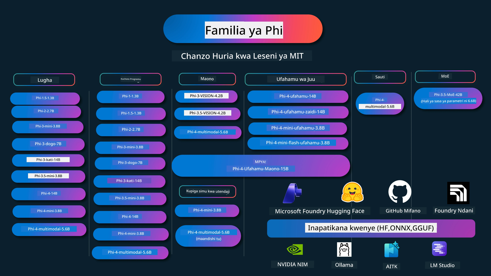

# Kitabu cha Mapishi cha Phi: Mifano ya Vitendo na Mifano ya Phi ya Microsoft

[](https://codespaces.new/microsoft/phicookbook)
[](https://vscode.dev/redirect?url=vscode://ms-vscode-remote.remote-containers/cloneInVolume?url=https://github.com/microsoft/phicookbook)

[](https://GitHub.com/microsoft/phicookbook/graphs/contributors/?WT.mc_id=aiml-137032-kinfeylo)
[](https://GitHub.com/microsoft/phicookbook/issues/?WT.mc_id=aiml-137032-kinfeylo)
[](https://GitHub.com/microsoft/phicookbook/pulls/?WT.mc_id=aiml-137032-kinfeylo)
[](http://makeapullrequest.com?WT.mc_id=aiml-137032-kinfeylo)

[](https://GitHub.com/microsoft/phicookbook/watchers/?WT.mc_id=aiml-137032-kinfeylo)
[](https://GitHub.com/microsoft/phicookbook/network/?WT.mc_id=aiml-137032-kinfeylo)
[](https://GitHub.com/microsoft/phicookbook/stargazers/?WT.mc_id=aiml-137032-kinfeylo)

[](https://discord.com/invite/ByRwuEEgH4)

Phi ni mfululizo wa mifano ya AI ya chanzo huria iliyotengenezwa na Microsoft.

Phi kwa sasa ni mfano mdogo wa lugha (SLM) wenye nguvu zaidi na wa gharama nafuu, wenye viwango bora katika lugha nyingi, reasoning, uzalishaji wa maandishi/mazungumzo, upangaji wa msimbo, picha, sauti na hali nyinginezo.

Unaweza kupeleka Phi mawinguni au kwenye vifaa vya edge, na unaweza kwa urahisi kujenga programu za AI za uzalishaji na nguvu chache za kompyuta.

Fuata hatua hizi kuanza kutumia rasilimali hizi:
1. **Fungua Tawi**: Bonyeza [](https://GitHub.com/microsoft/phicookbook/network/?WT.mc_id=aiml-137032-kinfeylo)
2. **Nakili Hazina**: `git clone https://github.com/microsoft/PhiCookBook.git`
3. [**Jiunge na Jamii ya Microsoft AI Discord na kutana na wataalamu na waendelezaji wenzako**](https://discord.com/invite/ByRwuEEgH4?WT.mc_id=aiml-137032-kinfeylo)



### 🌐 Msaada wa Lugha nyingi

#### Umeungwa mkono kupitia Hatua ya GitHub (mojawapo & daima ya kisasa)

<!-- CO-OP TRANSLATOR LANGUAGES TABLE START -->
[Kiarabu](../ar/README.md) | [Kibengali](../bn/README.md) | [Kibolgaria](../bg/README.md) | [Kibama (Myanmar)](../my/README.md) | [Kichina (Iliyorahisishwa)](../zh-CN/README.md) | [Kichina (Kisasa, Hong Kong)](../zh-HK/README.md) | [Kichina (Kisasa, Macau)](../zh-MO/README.md) | [Kichina (Kisasa, Taiwan)](../zh-TW/README.md) | [Kroeshia](../hr/README.md) | [Kicheki](../cs/README.md) | [Kidenmaki](../da/README.md) | [Kiholanzi](../nl/README.md) | [Kiestonia](../et/README.md) | [Kifini](../fi/README.md) | [Kifaransa](../fr/README.md) | [Kijerumani](../de/README.md) | [Kigiriki](../el/README.md) | [Kiebrania](../he/README.md) | [Kihindi](../hi/README.md) | [Kihungaria](../hu/README.md) | [Kiindonesia](../id/README.md) | [Kiitaliano](../it/README.md) | [Kijapani](../ja/README.md) | [Kikannada](../kn/README.md) | [Kikmere](../km/README.md) | [Kikorea](../ko/README.md) | [Kilithuania](../lt/README.md) | [Kimelayu](../ms/README.md) | [Kimalayalam](../ml/README.md) | [Kimarathi](../mr/README.md) | [Kinepali](../ne/README.md) | [Pidgin ya Nijeria](../pcm/README.md) | [Kinorwe](../no/README.md) | [Kiajemi (Farsi)](../fa/README.md) | [Kipolishi](../pl/README.md) | [Kireno (Brazil)](../pt-BR/README.md) | [Kireno (Ureno)](../pt-PT/README.md) | [Kipunjabi (Gurmukhi)](../pa/README.md) | [Kiromania](../ro/README.md) | [Kirusi](../ru/README.md) | [Kiserbia (Sirilik)](../sr/README.md) | [Kislovakia](../sk/README.md) | [Kislovenia](../sl/README.md) | [Kihispania](../es/README.md) | [Kiswahili](./README.md) | [Kiswidi](../sv/README.md) | [Kitagalogi (Kifilipino)](../tl/README.md) | [Kitamili](../ta/README.md) | [Kitelugu](../te/README.md) | [Kithai](../th/README.md) | [Kituruki](../tr/README.md) | [Kiukraini](../uk/README.md) | [Kiurdu](../ur/README.md) | [Kivenetiamu](../vi/README.md)

> **Ungependa Kunakili Kwa Ndani?**
>
> Hazina hii ina tafsiri zaidi ya 50 za lugha ambazo huongeza ukubwa wa kupakua. Ili nakili bila tafsiri, tumia sparse checkout:
>
> **Bash / macOS / Linux:**
> ```bash
> git clone --filter=blob:none --sparse https://github.com/microsoft/PhiCookBook.git
> cd PhiCookBook
> git sparse-checkout set --no-cone '/*' '!translations' '!translated_images'
> ```
>
> **CMD (Windows):**
> ```cmd
> git clone --filter=blob:none --sparse https://github.com/microsoft/PhiCookBook.git
> cd PhiCookBook
> git sparse-checkout set --no-cone "/*" "!translations" "!translated_images"
> ```
>
> Hii inakupa kila kitu unachohitaji ili kukamilisha kozi kwa upakuaji wa kasi zaidi.
<!-- CO-OP TRANSLATOR LANGUAGES TABLE END -->

## Jedwali la Yaliyomo

- Utangulizi
  - [Karibu kwa Familia ya Phi](./md/01.Introduction/01/01.PhiFamily.md)
  - [Kuweka mazingira yako](./md/01.Introduction/01/01.EnvironmentSetup.md)
  - [Kuelewa Teknolojia Muhimu](./md/01.Introduction/01/01.Understandingtech.md)
  - [Usalama wa AI kwa Mifano ya Phi](./md/01.Introduction/01/01.AISafety.md)
  - [Msaada wa Vifaa vya Phi](./md/01.Introduction/01/01.Hardwaresupport.md)
  - [Mifano ya Phi na Upatikana kwenye majukwaa](./md/01.Introduction/01/01.Edgeandcloud.md)
  - [Kutumia Guidance-ai na Phi](./md/01.Introduction/01/01.Guidance.md)
  - [Mifano ya Soko la GitHub](https://github.com/marketplace/models)
  - [Katalogi ya Mfano wa AI ya Azure](https://ai.azure.com)

- Kutathmini Phi katika mazingira tofauti
    -  [Hugging face](./md/01.Introduction/02/01.HF.md)
    -  [Mifano ya GitHub](./md/01.Introduction/02/02.GitHubModel.md)
    -  [Katalogi ya Mfano ya Microsoft Foundry](./md/01.Introduction/02/03.AzureAIFoundry.md)
    -  [Ollama](./md/01.Introduction/02/04.Ollama.md)
    -  [AI Toolkit VSCode (AITK)](./md/01.Introduction/02/05.AITK.md)
    -  [NVIDIA NIM](./md/01.Introduction/02/06.NVIDIA.md)
    -  [Foundry Local](./md/01.Introduction/02/07.FoundryLocal.md)

- Kutathmini Familia ya Phi
    - [Kutathmini Phi katika iOS](./md/01.Introduction/03/iOS_Inference.md)
    - [Kutathmini Phi katika Android](./md/01.Introduction/03/Android_Inference.md)
    - [Kutathmini Phi katika Jetson](./md/01.Introduction/03/Jetson_Inference.md)
    - [Kutathmini Phi katika AI PC](./md/01.Introduction/03/AIPC_Inference.md)
    - [Kutathmini Phi na Mfumo wa Apple MLX](./md/01.Introduction/03/MLX_Inference.md)
    - [Kutathmini Phi katika Server ya Ndani](./md/01.Introduction/03/Local_Server_Inference.md)
    - [Kutathmini Phi katika Server ya Mbali kwa kutumia AI Toolkit](./md/01.Introduction/03/Remote_Interence.md)
    - [Kutathmini Phi na Rust](./md/01.Introduction/03/Rust_Inference.md)
    - [Kutathmini Phi--Mwangaza Ndani](./md/01.Introduction/03/Vision_Inference.md)
    - [Kutathmini Phi na Kaito AKS, Vyombo vya Azure (msaada rasmi)](./md/01.Introduction/03/Kaito_Inference.md)
-  [Kupima Familia ya Phi](./md/01.Introduction/04/QuantifyingPhi.md)
    - [Kupima Phi-3.5 / 4 kwa kutumia llama.cpp](./md/01.Introduction/04/UsingLlamacppQuantifyingPhi.md)
    - [Kupima Phi-3.5 / 4 kwa kutumia nyongeza za AI za uzalishaji kwa onnxruntime](./md/01.Introduction/04/UsingORTGenAIQuantifyingPhi.md)
    - [Kupima Phi-3.5 / 4 kwa kutumia Intel OpenVINO](./md/01.Introduction/04/UsingIntelOpenVINOQuantifyingPhi.md)
    - [Kupima Phi-3.5 / 4 kwa kutumia Mfumo wa Apple MLX](./md/01.Introduction/04/UsingAppleMLXQuantifyingPhi.md)

-  Tathmini ya Phi
    - [AI Inayowajibika](./md/01.Introduction/05/ResponsibleAI.md)
    - [Microsoft Foundry kwa Tathmini](./md/01.Introduction/05/AIFoundry.md)
    - [Kutumia Promptflow kwa Tathmini](./md/01.Introduction/05/Promptflow.md)
 
- RAG na Azure AI Search
    - [Jinsi ya kutumia Phi-4-mini na Phi-4-multimodal(RAG) na Azure AI Search](https://github.com/microsoft/PhiCookBook/blob/main/code/06.E2E/E2E_Phi-4-RAG-Azure-AI-Search.ipynb)

- Sampuli za maendeleo ya programu za Phi
  - Programu za Maandishi na Mazungumzo
    - Sampuli za Phi-4
      - [📓] [Mazungumzo na Mfano wa Phi-4-mini ONNX](./md/02.Application/01.TextAndChat/Phi4/ChatWithPhi4ONNX/README.md)
      - [Mazungumzo na Mfano wa Phi-4 wa ndani ONNX .NET](../../md/04.HOL/dotnet/src/LabsPhi4-Chat-01OnnxRuntime)
      - [Programu ya mazungumzo ya Console ya .NET na Phi-4 ONNX kwa kutumia Sementic Kernel](../../md/04.HOL/dotnet/src/LabsPhi4-Chat-02SK)
    - Sampuli za Phi-3 / 3.5
      - [Chatbot wa Ndani katika kivinjari kwa kutumia Phi3, ONNX Runtime Web na WebGPU](https://github.com/microsoft/onnxruntime-inference-examples/tree/main/js/chat)
      - [OpenVino Chat](./md/02.Application/01.TextAndChat/Phi3/E2E_OpenVino_Chat.md)
      - [Multi Model - Phi-3-mini ya Kuingiliana na OpenAI Whisper](./md/02.Application/01.TextAndChat/Phi3/E2E_Phi-3-mini_with_whisper.md)
      - [MLFlow - Kujenga kifuniko na kutumia Phi-3 na MLFlow](./md//02.Application/01.TextAndChat/Phi3/E2E_Phi-3-MLflow.md)
      - [Uboreshaji wa Mfano - Jinsi ya kuboresha mfano wa Phi-3-min kwa ONNX Runtime Web na Olive](https://github.com/microsoft/Olive/tree/main/examples/phi3)
      - [WinUI3 App na Phi-3 mini-4k-instruct-onnx](https://github.com/microsoft/Phi3-Chat-WinUI3-Sample/)
      -[WinUI3 Mfano wa AI wa Multimodeli Powered Notes App](https://github.com/microsoft/ai-powered-notes-winui3-sample)
      - [Kufinyaza na Kuunganisha mifano ya desturi ya Phi-3 na Prompt flow](./md/02.Application/01.TextAndChat/Phi3/E2E_Phi-3-FineTuning_PromptFlow_Integration.md)
      - [Kufinyaza na Kuunganisha mifano ya desturi ya Phi-3 na Prompt flow katika Microsoft Foundry](./md/02.Application/01.TextAndChat/Phi3/E2E_Phi-3-FineTuning_PromptFlow_Integration_AIFoundry.md)
      - [Kutathmini Mfano wa Phi-3 / Phi-3.5 uliobinafsishwa katika Microsoft Foundry ukizingatia Kanuni za Haki za Microsoft za AI](./md/02.Application/01.TextAndChat/Phi3/E2E_Phi-3-Evaluation_AIFoundry.md)
      - [📓] [Mfano wa utabiri wa lugha wa Phi-3.5-mini-instruct (Kichina/Kiingereza)](./md/02.Application/01.TextAndChat/Phi3/phi3-instruct-demo.ipynb)
      - [Phi-3.5-Instruct WebGPU RAG Chatbot](./md/02.Application/01.TextAndChat/Phi3/WebGPUWithPhi35Readme.md)
      - [Kutumia Windows GPU kuunda suluhisho la Prompt flow na Phi-3.5-Instruct ONNX](./md/02.Application/01.TextAndChat/Phi3/UsingPromptFlowWithONNX.md)
      - [Kutumia Microsoft Phi-3.5 tflite kuunda programu ya Android](./md/02.Application/01.TextAndChat/Phi3/UsingPhi35TFLiteCreateAndroidApp.md)
      - [Q&A Mfano wa .NET kutumia mfano wa ndani wa ONNX Phi-3 kwa kutumia Microsoft.ML.OnnxRuntime](../../md/04.HOL/dotnet/src/LabsPhi301)
      - [Programu ya mazungumzo ya Console .NET na Semantic Kernel na Phi-3](../../md/04.HOL/dotnet/src/LabsPhi302)

  - Sampuli za Azure AI Inference SDK zinazotegemea Msimbo 
    - Sampuli za Phi-4 
      - [📓] [Tengeneza msimbo wa mradi kwa kutumia Phi-4-multimodal](./md/02.Application/02.Code/Phi4/GenProjectCode/README.md)
    - Sampuli za Phi-3 / 3.5
      - [Jenga mazungumzo yako ya Visual Studio Code GitHub Copilot na Familia ya Microsoft Phi-3](./md/02.Application/02.Code/Phi3/VSCodeExt/README.md)
      - [Unda Wakala wa Mazungumzo wa Visual Studio Code Copilot na Phi-3.5 kwa kutumia Mifano ya GitHub](/md/02.Application/02.Code/Phi3/CreateVSCodeChatAgentWithGitHubModels.md)

  - Sampuli za Ufafanuzi wa Juu
    - Sampuli za Phi-4 
      - [📓] [Sampuli za Phi-4-mini-ufafanuzi au Phi-4-ufafanuzi](./md/02.Application/03.AdvancedReasoning/Phi4/AdvancedResoningPhi4mini/README.md)
      - [📓] [Kufinyaza Phi-4-mini-ufafanuzi kwa Microsoft Olive](./md/02.Application/03.AdvancedReasoning/Phi4/AdvancedResoningPhi4mini/olive_ft_phi_4_reasoning_with_medicaldata.ipynb)
      - [📓] [Kufinyaza Phi-4-mini-ufafanuzi kwa Apple MLX](./md/02.Application/03.AdvancedReasoning/Phi4/AdvancedResoningPhi4mini/mlx_ft_phi_4_reasoning_with_medicaldata.ipynb)
      - [📓] [Phi-4-mini-ufafanuzi na Mifano ya GitHub](./md/02.Application/02.Code/Phi4r/github_models_inference.ipynb)
      - [📓] [Phi-4-mini-ufafanuzi na Mifano ya Microsoft Foundry](./md/02.Application/02.Code/Phi4r/azure_models_inference.ipynb)
  - Maonesho
      - [Demos za Phi-4-mini zilizoandaliwa kwenye Hugging Face Spaces](https://huggingface.co/spaces/microsoft/phi-4-mini?WT.mc_id=aiml-137032-kinfeylo)
      - [Demos za Phi-4-multimodal zilizoandaliwa kwenye Hugging Face Spaces](https://huggingface.co/spaces/microsoft/phi-4-multimodal?WT.mc_id=aiml-137032-kinfeylo)
  - Sampuli za Maono
    - Sampuli za Phi-4 
      - [📓] [Tumia Phi-4-multimodal kusoma picha na kutoa msimbo](./md/02.Application/04.Vision/Phi4/CreateFrontend/README.md) 
    - Sampuli za Phi-3 / 3.5
      -  [📓][Phi-3-maono-Picha maandishi kwa maandishi](./md/02.Application/04.Vision/Phi3/E2E_Phi-3-vision-image-text-to-text-online-endpoint.ipynb)
      - [Phi-3-maono-ONNX](https://onnxruntime.ai/docs/genai/tutorials/phi3-v.html)
      - [📓][Phi-3-maono CLIP Embedding](./md/02.Application/04.Vision/Phi3/E2E_Phi-3-vision-image-text-to-text-online-endpoint.ipynb)
      - [DEMO: Urejeleaji wa Phi-3](https://github.com/jennifermarsman/PhiRecycling/)
      - [Phi-3-maono - Msaidizi wa lugha wa kuona - na Phi3-Maono na OpenVINO](https://docs.openvino.ai/nightly/notebooks/phi-3-vision-with-output.html)
      - [Phi-3 Maono Nvidia NIM](./md/02.Application/04.Vision/Phi3/E2E_Nvidia_NIM_Vision.md)
      - [Phi-3 Maono OpenVino](./md/02.Application/04.Vision/Phi3/E2E_OpenVino_Phi3Vision.md)
      - [📓][Phi-3.5 Maono mfano wa multi-frame au picha nyingi](./md/02.Application/04.Vision/Phi3/phi3-vision-demo.ipynb)
      - [Phi-3 Maono Mfano wa Ndani wa ONNX kutumia Microsoft.ML.OnnxRuntime .NET](../../md/04.HOL/dotnet/src/LabsPhi303)
      - [Menyu inayoanzisha Mfano wa Ndani wa ONNX wa Phi-3 Maono kutumia Microsoft.ML.OnnxRuntime .NET](../../md/04.HOL/dotnet/src/LabsPhi304)

  - Sampuli za Ufafanuzi-Maono
    - Phi-4-Ufafanuzi-Maono-15B 
      - [📓] [Kutumia Phi-4-Ufafanuzi-Maono-15B kugundua kupita barabara mahali pasipo halali](./md/02.Application/10.ReasoningVision/Phi_4_reasoning_vision_15b_Jaywalking.ipynb)
      - [📓] [Kutumia Phi-4-Ufafanuzi-Maono-15B kwa hesabu](./md/02.Application/10.ReasoningVision/Phi_4_reasoning_vision_15b_Math.ipynb)
      - [📓] [Kutumia Phi-4-Ufafanuzi-Maono-15B kugundua UI](./md/02.Application/10.ReasoningVision/Phi_4_reasoning_vision_15b_ui.ipynb)

  - Sampuli za Hisabati
    -  Sampuli za Phi-4-Mini-Flash-Ufafanuzi-Maelekezo  [Demo ya Hisabati na Phi-4-Mini-Flash-Ufafanuzi-Maelekezo](./md/02.Application/09.Math/MathDemo.ipynb)

  - Sampuli za Sauti
    - Sampuli za Phi-4 
      - [📓] [Kutoa maandishi ya sauti kwa kutumia Phi-4-multimodal](./md/02.Application/05.Audio/Phi4/Transciption/README.md)
      - [📓] [Mfano wa Sauti wa Phi-4-multimodal](./md/02.Application/05.Audio/Phi4/Siri/demo.ipynb)
      - [📓] [Mfano wa Tafsiri ya Hotuba ya Phi-4-multimodal](./md/02.Application/05.Audio/Phi4/Translate/demo.ipynb)
      - [Programu ya console ya .NET ikitumia Phi-4-multimodal ya Sauti kuchambua faili la sauti na kutoa maandishi](../../md/04.HOL/dotnet/src/LabsPhi4-MultiModal-02Audio)

  - Sampuli za MOE
    - Sampuli za Phi-3 / 3.5
      - [📓] [Mchanganyiko wa Mifano wa Wataalam wa Phi-3.5 (MoEs) Mfano wa Mitandao ya Kijamii](./md/02.Application/06.MoE/Phi3/phi3_moe_demo.ipynb)
      - [📓] [Kujenga Mlolongo wa Uzalishaji Uliongezwa kwa Utafutaji (RAG) na NVIDIA NIM Phi-3 MOE, Azure AI Search, na LlamaIndex](./md/02.Application/06.MoE/Phi3/azure-ai-search-nvidia-rag.ipynb)
      - 
  - Sampuli za Kupiga Simu za Vitendo
    - Sampuli za Phi-4 🆕
      -  [📓] [Kutumia Kupiga Simu za Vitendo Na Phi-4-mini](./md/02.Application/07.FunctionCalling/Phi4/FunctionCallingBasic/README.md)
      -  [📓] [Kutumia Kupiga Simu za Vitendo kuunda mawakala wengi Na Phi-4-mini](./md/02.Application/07.FunctionCalling/Phi4/Multiagents/Phi_4_mini_multiagent.ipynb)
      -  [📓] [Kutumia Kupiga Simu za Vitendo na Ollama](./md/02.Application/07.FunctionCalling/Phi4/Ollama/ollama_functioncalling.ipynb)
      -  [📓] [Kutumia Kupiga Simu za Vitendo na ONNX](./md/02.Application/07.FunctionCalling/Phi4/ONNX/onnx_parallel_functioncalling.ipynb)
  - Sampuli za Mchanganyiko wa Multimodal
    - Sampuli za Phi-4 🆕
      -  [📓] [Kutumia Phi-4-multimodal kama Mwandishi wa Teknolojia](./md/02.Application/08.Multimodel/Phi4/TechJournalist/phi_4_mm_audio_text_publish_news.ipynb)
      - [Programu ya console ya .NET ikitumia Phi-4-multimodal kuchambua picha](../../md/04.HOL/dotnet/src/LabsPhi4-MultiModal-01Images)

- Kufinyaza Samples za Phi
  - [Hali za Kufinyaza](./md/03.FineTuning/FineTuning_Scenarios.md)
  - [Kufinyaza dhidi ya RAG](./md/03.FineTuning/FineTuning_vs_RAG.md)
  - [Kufinyaza Ili Phi-3 aweke ujuzi wa sekta](./md/03.FineTuning/LetPhi3gotoIndustriy.md)
  - [Kufinyaza Phi-3 na AI Toolkit kwa VS Code](./md/03.FineTuning/Finetuning_VSCodeaitoolkit.md)
  - [Kufinyaza Phi-3 kwa Huduma ya Azure Machine Learning](./md/03.FineTuning/Introduce_AzureML.md)
  - [Kufinyaza Phi-3 na Lora](./md/03.FineTuning/FineTuning_Lora.md)
  - [Kufinyaza Phi-3 na QLora](./md/03.FineTuning/FineTuning_Qlora.md)
  - [Kufinyaza Phi-3 na Microsoft Foundry](./md/03.FineTuning/FineTuning_AIFoundry.md)
  - [Kufinyaza Phi-3 na Azure ML CLI/SDK](./md/03.FineTuning/FineTuning_MLSDK.md)
  - [Kufinyaza na Microsoft Olive](./md/03.FineTuning/FineTuning_MicrosoftOlive.md)
  - [Kufinyaza na Maabara ya Mikono ya Microsoft Olive](./md/03.FineTuning/olive-lab/readme.md)
  - [Kufinyaza Phi-3-maono na Weights and Bias](./md/03.FineTuning/FineTuning_Phi-3-visionWandB.md)
  - [Kufinyaza Phi-3 na Mfumo wa Apple MLX](./md/03.FineTuning/FineTuning_MLX.md)
  - [Kufinyaza Phi-3-maono (msaada rasmi)](./md/03.FineTuning/FineTuning_Vision.md)
  - [Urekebishaji wa Phi-3 na Kaito AKS, Kontena za Azure (Msaada Rasmi)](./md/03.FineTuning/FineTuning_Kaito.md)
  - [Urekebishaji wa Phi-3 na 3.5 Vision](https://github.com/2U1/Phi3-Vision-Finetune)

- Maabara ya Vitendo
  - [Kutafakari mifano ya kisasa: LLMs, SLMs, maendeleo ya ndani na zaidi](https://github.com/microsoft/aitour-exploring-cutting-edge-models)
  - [Kufungua Uwezo wa NLP: Urekebishaji kwa Microsoft Olive](https://github.com/azure/Ignite_FineTuning_workshop)

- Makala za Utafiti wa Kielimu na Machapisho
  - [Vitabu Pekee Ndiyo Inayohitajika II: ripoti ya kiteknolojia ya phi-1.5](https://arxiv.org/abs/2309.05463)
  - [Ripoti ya Kiteknolojia ya Phi-3: Mfano wa Lugha wenye Uwezo Mkubwa Kwenye Simu Yako](https://arxiv.org/abs/2404.14219)
  - [Ripoti ya Kiteknolojia ya Phi-4](https://arxiv.org/abs/2412.08905)
  - [Ripoti ya Kiteknolojia ya Phi-4-Mini: Mifano Midogo Lakini Yenye Nguvu ya Lugha Mtandao kupitia Mchanganyiko wa LoRAs](https://arxiv.org/abs/2503.01743)
  - [Kuboresha Mifano Midogo ya Lugha kwa Kupiga Simu za Kazi Ndani ya Gari](https://arxiv.org/abs/2501.02342)
  - [(WhyPHI) Urekebishaji wa PHI-3 kwa Majibu ya Maswali ya Chaguo Nyingi: Mbinu, Matokeo, na Changamoto](https://arxiv.org/abs/2501.01588)
  - [Ripoti ya Kiteknolojia ya Phi-4-uwezo wa kufikiri](https://www.microsoft.com/en-us/research/wp-content/uploads/2025/04/phi_4_reasoning.pdf)
  - [Ripoti ya Kiteknolojia ya Phi-4-mini-uwezo wa kufikiri](https://huggingface.co/microsoft/Phi-4-mini-reasoning/blob/main/Phi-4-Mini-Reasoning.pdf)

## Kutumia Mifano ya Phi

### Phi kwenye Microsoft Foundry

Unaweza kujifunza jinsi ya kutumia Microsoft Phi na jinsi ya kujenga suluhisho za E2E katika vifaa vyako tofauti vya vifaa. Ili kujionea Phi mwenyewe, anza kwa kucheza na mifano na kubinafsisha Phi kwa hali zako ukitumia [Katalogi ya Mfano wa AI ya Microsoft Foundry Azure](https://aka.ms/phi3-azure-ai) unaweza kujifunza zaidi katika Kuanzisha na [Microsoft Foundry](/md/02.QuickStart/AzureAIFoundry_QuickStart.md)

**Uwanja wa Mchezo**
Kila mfano una uwanja wake wa majaribio wa kujaribu mfano huo [Azure AI Playground](https://aka.ms/try-phi3).

### Phi kwenye Mifano ya GitHub

Unaweza kujifunza jinsi ya kutumia Microsoft Phi na jinsi ya kujenga suluhisho za E2E katika vifaa vyako tofauti vya vifaa. Ili kujionea Phi mwenyewe, anza kwa kucheza na mfano na kubinafsisha Phi kwa hali zako ukitumia [Katalogi ya Mfano ya GitHub](https://github.com/marketplace/models?WT.mc_id=aiml-137032-kinfeylo) unaweza kujifunza zaidi katika Kuanzisha na [Katalogi ya Mfano ya GitHub](/md/02.QuickStart/GitHubModel_QuickStart.md)

**Uwanja wa Mchezo**
Kila mfano una uwanja wa majaribio wa [kujaribu mfano](/md/02.QuickStart/GitHubModel_QuickStart.md).

### Phi kwenye Hugging Face

Unaweza pia kupata mfano kwenye [Hugging Face](https://huggingface.co/microsoft)

**Uwanja wa Mchezo**
 [Uwanja wa Mchezo wa Hugging Chat](https://huggingface.co/chat/models/microsoft/Phi-3-mini-4k-instruct)

 ## 🎒 Kozi Nyingine

Timu yetu huandaa kozi nyingine! Angalia:

<!-- CO-OP TRANSLATOR OTHER COURSES START -->
### LangChain
[](https://aka.ms/langchain4j-for-beginners)
[](https://aka.ms/langchainjs-for-beginners?WT.mc_id=m365-94501-dwahlin)
[](https://github.com/microsoft/langchain-for-beginners?WT.mc_id=m365-94501-dwahlin)
---

### Azure / Edge / MCP / Wakala
[](https://github.com/microsoft/AZD-for-beginners?WT.mc_id=academic-105485-koreyst)
[](https://github.com/microsoft/edgeai-for-beginners?WT.mc_id=academic-105485-koreyst)
[](https://github.com/microsoft/mcp-for-beginners?WT.mc_id=academic-105485-koreyst)
[](https://github.com/microsoft/ai-agents-for-beginners?WT.mc_id=academic-105485-koreyst)

---
 
### Mfululizo wa AI wa Kuumba
[](https://github.com/microsoft/generative-ai-for-beginners?WT.mc_id=academic-105485-koreyst)
[-9333EA?style=for-the-badge&labelColor=E5E7EB&color=9333EA)](https://github.com/microsoft/Generative-AI-for-beginners-dotnet?WT.mc_id=academic-105485-koreyst)
[-C084FC?style=for-the-badge&labelColor=E5E7EB&color=C084FC)](https://github.com/microsoft/generative-ai-for-beginners-java?WT.mc_id=academic-105485-koreyst)
[-E879F9?style=for-the-badge&labelColor=E5E7EB&color=E879F9)](https://github.com/microsoft/generative-ai-with-javascript?WT.mc_id=academic-105485-koreyst)

---
 
### Kujifunza Msingi
[](https://aka.ms/ml-beginners?WT.mc_id=academic-105485-koreyst)
[](https://aka.ms/datascience-beginners?WT.mc_id=academic-105485-koreyst)
[](https://aka.ms/ai-beginners?WT.mc_id=academic-105485-koreyst)
[](https://github.com/microsoft/Security-101?WT.mc_id=academic-96948-sayoung)
[](https://aka.ms/webdev-beginners?WT.mc_id=academic-105485-koreyst)
[](https://aka.ms/iot-beginners?WT.mc_id=academic-105485-koreyst)
[](https://github.com/microsoft/xr-development-for-beginners?WT.mc_id=academic-105485-koreyst)

---
 
### Mfululizo wa Copilot
[](https://aka.ms/GitHubCopilotAI?WT.mc_id=academic-105485-koreyst)
[](https://github.com/microsoft/mastering-github-copilot-for-dotnet-csharp-developers?WT.mc_id=academic-105485-koreyst)
[](https://github.com/microsoft/CopilotAdventures?WT.mc_id=academic-105485-koreyst)
<!-- CO-OP TRANSLATOR OTHER COURSES END -->

## AI Iliyo Wajibu

Microsoft imejizatiti kusaidia wateja wetu kutumia bidhaa zetu za AI kwa uwajibikaji, kushiriki masomo yetu, na kujenga ushirikiano wa msingi wa imani kupitia zana kama Vidokezo vya Uwajibikaji na Tathmini za Athari. Rasilimali nyingi za aina hii zinaweza kupatikana katika [https://aka.ms/RAI](https://aka.ms/RAI).
Mbinu ya Microsoft kuhusu AI yenye uwajibikaji imejikita katika kanuni zetu za AI za usawa, uaminifu na usalama, faragha na usalama, ujumuishaji, uwazi, na uwajibikaji.

Mifano mikubwa ya lugha asilia, picha, na sauti - kama ile inayotumika katika mfano huu - inaweza kutenda kwa njia zisizo za haki, zisizotegemewa, au zenye kukera, na kusababisha madhara. Tafadhali angalia [Kumbuka la Uwajibikaji wa Huduma ya Azure OpenAI](https://learn.microsoft.com/legal/cognitive-services/openai/transparency-note?tabs=text) ili ujue kuhusu hatari na mipaka.
Njia inayopendekezwa kupunguza hatari hizi ni kujumuisha mfumo wa usalama katika usanifu wako ambao unaweza kugundua na kuzuia tabia mbaya. [Azure AI Content Safety](https://learn.microsoft.com/azure/ai-services/content-safety/overview) hutoa tabaka huru la ulinzi, linaloweza kugundua maudhui hatarishi yaliyotengenezwa na watumiaji na AI katika programu na huduma. Azure AI Content Safety inajumuisha API za maandishi na picha ambazo zinakuwezesha kugundua nyenzo zenye madhara. Ndani ya Microsoft Foundry, huduma ya Content Safety inakuwezesha kuona, kuchunguza na kujaribu mfano wa msimbo wa kugundua maudhui hatarishi katika aina mbalimbali. Hati za [quickstart documentation](https://learn.microsoft.com/azure/ai-services/content-safety/quickstart-text?tabs=visual-studio%2Clinux&pivots=programming-language-rest) zitaelekeza hatua kwa hatua jinsi ya kutuma maombi kwa huduma hii.

Jambo lingine la kuzingatia ni utendakazi wa jumla wa programu. Kwa programu zenye modal nyingi na modeli nyingi, tunachukulia utendakazi kama mfumo unavyoenda kama unavyotarajia wewe na watumiaji wako, ikijumuisha kutotengeneza matokeo yenye madhara. Ni muhimu kutathmini utendakazi wa programu yako kwa ujumla kwa kutumia [Performance and Quality and Risk and Safety evaluators](https://learn.microsoft.com/azure/ai-studio/concepts/evaluation-metrics-built-in). Pia una uwezo wa kuunda na kutathmini kwa kutumia [custom evaluators](https://learn.microsoft.com/azure/ai-studio/how-to/develop/evaluate-sdk#custom-evaluators).

Unaweza kutathmini programu yako ya AI katika mazingira yako ya maendeleo kwa kutumia [Azure AI Evaluation SDK](https://microsoft.github.io/promptflow/index.html). Ukiwa na seti ya data ya majaribio au lengo, uzalishaji wa programu yako ya generative AI hupimwa kwa kiasi kwa kutumia wataathiri waliopo au wataathiri wa kawaida wa chaguo lako. Ili kuanza kutumia azure ai evaluation sdk kutathmini mfumo wako, unaweza kufuata [mwongozo wa quickstart](https://learn.microsoft.com/azure/ai-studio/how-to/develop/flow-evaluate-sdk). Mara tu utakapoendesha tathmini, unaweza [kuonyesha matokeo katika Microsoft Foundry](https://learn.microsoft.com/azure/ai-studio/how-to/evaluate-flow-results).

## Hati miliki

Mradi huu unaweza kuwa na alama za biashara au nembo za miradi, bidhaa, au huduma. Matumizi ya idhini ya alama za biashara au nembo za Microsoft yanategemea na lazima yafuatwe kwa mujibu wa [Miongozo ya Alama za Biashara & Brand za Microsoft](https://www.microsoft.com/legal/intellectualproperty/trademarks/usage/general).
Matumizi ya alama za biashara au nembo za Microsoft katika toleo lililobadilishwa la mradi huu hayapaswi kusababisha mkanganyiko au kuashiria udhamini wa Microsoft. Matumizi yoyote ya alama za biashara au nembo za watu wengine yanategemea sera za pande hizo za tatu.

## Kupata Msaada

Ikiwa utakumbwa na matatizo au una maswali yoyote kuhusu kujenga programu za AI, jiunge:

[](https://aka.ms/foundry/discord)

Ikiwa una maoni kuhusu bidhaa au makosa wakati wa ujenzi, tembelea:

[](https://aka.ms/foundry/forum)

---

<!-- CO-OP TRANSLATOR DISCLAIMER START -->
**Kisio cha lawama**:
Hati hii imetafsiriwa kwa kutumia huduma ya utafsiri wa AI [Co-op Translator](https://github.com/Azure/co-op-translator). Ingawa tunajitahidi kwa usahihi, tafadhali fahamu kwamba tafsiri za kiotomatiki zinaweza kuwa na makosa au usahihi mdogo. Hati ya asili katika lugha yake ya asili inapaswa kuchukuliwa kama chanzo chenye mamlaka. Kwa taarifa muhimu, inashauriwa kutumia utafsiri wa kibinadamu wa kitaalamu. Hatuwezi kuwajibika kwa jambo lolote la kutoelewana au tafsiri potofu zitokanazo na matumizi ya tafsiri hii.
<!-- CO-OP TRANSLATOR DISCLAIMER END -->