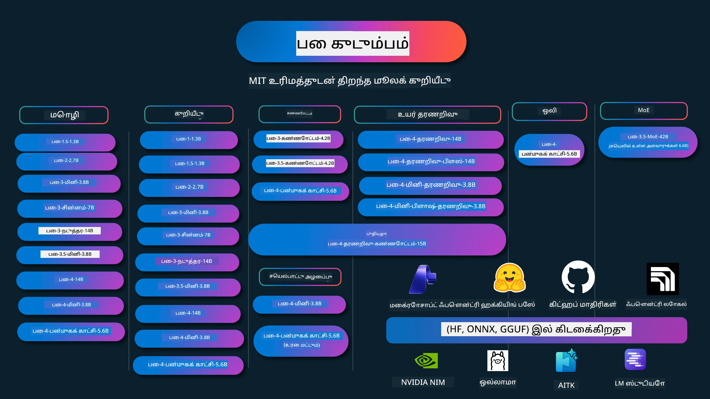

# Phi வாணிகம்: Microsoft இன் Phi மாதிரிகளுடன் நேரடி உதாரணங்கள்

[](https://codespaces.new/microsoft/phicookbook)
[](https://vscode.dev/redirect?url=vscode://ms-vscode-remote.remote-containers/cloneInVolume?url=https://github.com/microsoft/phicookbook)

[](https://GitHub.com/microsoft/phicookbook/graphs/contributors/?WT.mc_id=aiml-137032-kinfeylo)
[](https://GitHub.com/microsoft/phicookbook/issues/?WT.mc_id=aiml-137032-kinfeylo)
[](https://GitHub.com/microsoft/phicookbook/pulls/?WT.mc_id=aiml-137032-kinfeylo)
[](http://makeapullrequest.com?WT.mc_id=aiml-137032-kinfeylo)

[](https://GitHub.com/microsoft/phicookbook/watchers/?WT.mc_id=aiml-137032-kinfeylo)
[](https://GitHub.com/microsoft/phicookbook/network/?WT.mc_id=aiml-137032-kinfeylo)
[](https://GitHub.com/microsoft/phicookbook/stargazers/?WT.mc_id=aiml-137032-kinfeylo)

[](https://discord.com/invite/ByRwuEEgH4)

Phi என்பது Microsoft உருவாக்கிய திறந்த மூல AI மாதிரிகளின் தொடர் ஆகும்.

Phi தற்போது மிகவும் சக்திவாய்ந்ததும் செலவுகுறைந்த சிறிய மொழி மாதிரியாகும் (SLM), பன்மொழி, காரணம் காண்தல், உரை/chat உருவாக்கம், குறியீடு, படங்கள், ஒலி மற்றும் பிற சந்தர்ப்பங்களில் மிகச் சிறந்த மதிப்பீடுகளுடன் உள்ளது.

நீங்கள் Phi-ஐ மேகத்திலும் விளிம்புப் சாதனங்களிலும் (edge devices) அமர்த்தலாம், மேலும் குறைந்த கணினி சக்தியுடன் விளைவு AI பயன்பாடுகளை எளிதாக உருவாக்க முடியும்.

இந்த வளங்களை பயன்படுத்த தொடங்க இந்த படிகளை பின்பற்றவும் :
1. **Repository-ஐ Fork செய்யவும்**: Click [](https://GitHub.com/microsoft/phicookbook/network/?WT.mc_id=aiml-137032-kinfeylo)
2. **Repository-ஐ Clone செய்யவும்**: `git clone https://github.com/microsoft/PhiCookBook.git`
3. [**Microsoft AI Discord சமூகத்தில் சேர்ந்து நிபுணர்களையும் மற்ற அபிவிருத்தியாளர்களையும் சந்திக்கவும்**](https://discord.com/invite/ByRwuEEgH4?WT.mc_id=aiml-137032-kinfeylo)



### 🌐 பன்மொழி ஆதரவு

#### GitHub Action மூலம் ஆதரவானது (தானியங்கி & எப்போதும் புதுப்பிக்கப்பட்டது)

<!-- CO-OP TRANSLATOR LANGUAGES TABLE START -->
[Arabic](../ar/README.md) | [Bengali](../bn/README.md) | [Bulgarian](../bg/README.md) | [Burmese (Myanmar)](../my/README.md) | [Chinese (Simplified)](../zh-CN/README.md) | [Chinese (Traditional, Hong Kong)](../zh-HK/README.md) | [Chinese (Traditional, Macau)](../zh-MO/README.md) | [Chinese (Traditional, Taiwan)](../zh-TW/README.md) | [Croatian](../hr/README.md) | [Czech](../cs/README.md) | [Danish](../da/README.md) | [Dutch](../nl/README.md) | [Estonian](../et/README.md) | [Finnish](../fi/README.md) | [French](../fr/README.md) | [German](../de/README.md) | [Greek](../el/README.md) | [Hebrew](../he/README.md) | [Hindi](../hi/README.md) | [Hungarian](../hu/README.md) | [Indonesian](../id/README.md) | [Italian](../it/README.md) | [Japanese](../ja/README.md) | [Kannada](../kn/README.md) | [Khmer](../km/README.md) | [Korean](../ko/README.md) | [Lithuanian](../lt/README.md) | [Malay](../ms/README.md) | [Malayalam](../ml/README.md) | [Marathi](../mr/README.md) | [Nepali](../ne/README.md) | [Nigerian Pidgin](../pcm/README.md) | [Norwegian](../no/README.md) | [Persian (Farsi)](../fa/README.md) | [Polish](../pl/README.md) | [Portuguese (Brazil)](../pt-BR/README.md) | [Portuguese (Portugal)](../pt-PT/README.md) | [Punjabi (Gurmukhi)](../pa/README.md) | [Romanian](../ro/README.md) | [Russian](../ru/README.md) | [Serbian (Cyrillic)](../sr/README.md) | [Slovak](../sk/README.md) | [Slovenian](../sl/README.md) | [Spanish](../es/README.md) | [Swahili](../sw/README.md) | [Swedish](../sv/README.md) | [Tagalog (Filipino)](../tl/README.md) | [Tamil](./README.md) | [Telugu](../te/README.md) | [Thai](../th/README.md) | [Turkish](../tr/README.md) | [Ukrainian](../uk/README.md) | [Urdu](../ur/README.md) | [Vietnamese](../vi/README.md)

> **உள்ளேகலனாகக் கிளோன் செய்ய விரும்புகிறீர்களா?**
>
> இந்த மறுசீரமைப்பில் 50+ மொழி மொழிபெயர்ப்புகள் உள்ளதால் பதிவிறக்கும் அளவு அதிகமாகிறது. மொழிபெயர்ப்புகள் இல்லாமல் கிளோன் செய்ய sparse checkout-ஐ பயன்படுத்தவும்:
>
> **Bash / macOS / Linux:**
> ```bash
> git clone --filter=blob:none --sparse https://github.com/microsoft/PhiCookBook.git
> cd PhiCookBook
> git sparse-checkout set --no-cone '/*' '!translations' '!translated_images'
> ```
>
> **CMD (Windows):**
> ```cmd
> git clone --filter=blob:none --sparse https://github.com/microsoft/PhiCookBook.git
> cd PhiCookBook
> git sparse-checkout set --no-cone "/*" "!translations" "!translated_images"
> ```
>
> இது பாடத்திட்டத்தை முடிக்க தேவையான அனைத்தையும் மிகவும் விரைவான பதிவிறக்கத்துடன் தரும்.
<!-- CO-OP TRANSLATOR LANGUAGES TABLE END -->

## உள்ளடக்க அட்டவணை

- அறிமுகம்
  - [Phi குடும்பத்திற்கு வரவேற்கிறோம்](./md/01.Introduction/01/01.PhiFamily.md)
  - [உங்கள் சுற்றுப்புறத்தை அமைத்தல்](./md/01.Introduction/01/01.EnvironmentSetup.md)
  - [முக்கிய தொழில்நுட்பங்களை புரிந்து கொள்வது](./md/01.Introduction/01/01.Understandingtech.md)
  - [Phi மாதிரிகளுக்கான AI பாதுகாப்பு](./md/01.Introduction/01/01.AISafety.md)
  - [Phi உடன் பொருந்தும் வன்பொருள் ஆதரவு](./md/01.Introduction/01/01.Hardwaresupport.md)
  - [பல்பிளாட்ஃபாரங்களின் Phi மாதிரிகள் மற்றும் கிடைக்கும் நிலை](./md/01.Introduction/01/01.Edgeandcloud.md)
  - [Guidance-ai மற்றும் Phi பயன்படுத்துதல்](./md/01.Introduction/01/01.Guidance.md)
  - [GitHub Marketplace மாதிரிகள்](https://github.com/marketplace/models)
  - [Azure AI மாதிரி கண்டறிதல்](https://ai.azure.com)

- வெவ்வேறு சூழல்களில் Phi ஊக்குவிப்பு
    -  [Hugging face](./md/01.Introduction/02/01.HF.md)
    -  [GitHub மாதிரிகள்](./md/01.Introduction/02/02.GitHubModel.md)
    -  [Microsoft Foundry Model Catalog](./md/01.Introduction/02/03.AzureAIFoundry.md)
    -  [Ollama](./md/01.Introduction/02/04.Ollama.md)
    -  [AI Toolkit VSCode (AITK)](./md/01.Introduction/02/05.AITK.md)
    -  [NVIDIA NIM](./md/01.Introduction/02/06.NVIDIA.md)
    -  [Foundry Local](./md/01.Introduction/02/07.FoundryLocal.md)

- Phi குடும்ப ஊக்குவிப்பு
    - [iOS இல் Phi ஊக்குவிப்பு](./md/01.Introduction/03/iOS_Inference.md)
    - [Android இல் Phi ஊக்குவிப்பு](./md/01.Introduction/03/Android_Inference.md)
    - [Jetson இல் Phi ஊக்குவிப்பு](./md/01.Introduction/03/Jetson_Inference.md)
    - [AI PC இல் Phi ஊக்குவிப்பு](./md/01.Introduction/03/AIPC_Inference.md)
    - [Apple MLX Framework உடன் Phi ஊக்குவிப்பு](./md/01.Introduction/03/MLX_Inference.md)
    - [இலங்கை (Local) சர்வரில் Phi ஊக்குவிப்பு](./md/01.Introduction/03/Local_Server_Inference.md)
    - [AI Toolkit பயன்படுத்தி தொலைச்சர்வரில் Phi ஊக்குவிப்பு](./md/01.Introduction/03/Remote_Interence.md)
    - [Rust உடன் Phi ஊக்குவிப்பு](./md/01.Introduction/03/Rust_Inference.md)
    - [இலங்கை (Local) பகுப்பாய்வுடன் Phi - காட்சி](./md/01.Introduction/03/Vision_Inference.md)
    - [Kaito AKS, Azure Containers (அதிகாரப்பூர்வ ஆதரவு) உடன் Phi ஊக்குவிப்பு](./md/01.Introduction/03/Kaito_Inference.md)
-  [Phi குடும்பம் குறிவைக்கும் அளவீடு](./md/01.Introduction/04/QuantifyingPhi.md)
    - [llama.cpp பயன்படுத்தி Phi-3.5 / 4 குறிவைக்கும் படி](./md/01.Introduction/04/UsingLlamacppQuantifyingPhi.md)
    - [onnxruntime க்கான Generative AI நீட்டிப்புகள் பயன்படுத்தி Phi-3.5 / 4 குறிவைக்கும் படி](./md/01.Introduction/04/UsingORTGenAIQuantifyingPhi.md)
    - [Intel OpenVINO பயன்படுத்தி Phi-3.5 / 4 குறிவைக்கும் படி](./md/01.Introduction/04/UsingIntelOpenVINOQuantifyingPhi.md)
    - [Apple MLX Framework பயன்படுத்தி Phi-3.5 / 4 குறிவைக்கும் படி](./md/01.Introduction/04/UsingAppleMLXQuantifyingPhi.md)

-  Phi மதிப்பீடு
    - [பொறுப்பான AI](./md/01.Introduction/05/ResponsibleAI.md)
    - [Microsoft Foundry மதிப்பீட்டுக்கு](./md/01.Introduction/05/AIFoundry.md)
    - [Promptflow பயன்படுத்தி மதிப்பீடு](./md/01.Introduction/05/Promptflow.md)
 
- Azure AI தேடல் உடன் RAG
    - [Phi-4-mini மற்றும் Phi-4-multimodal(RAG) ஐ Azure AI தேடலுடன் பயன்படுத்துவது எப்படி](https://github.com/microsoft/PhiCookBook/blob/main/code/06.E2E/E2E_Phi-4-RAG-Azure-AI-Search.ipynb)

- Phi பயன்பாடு அபிவிருத்தி மாதிரிகள்
  - உரை மற்றும் chat பயன்பாடுகள்
    - Phi-4 மாதிரிகள் 
      - [📓] [Phi-4-mini ONNX மாடலுடன் உரையாடல்](./md/02.Application/01.TextAndChat/Phi4/ChatWithPhi4ONNX/README.md)
      - [Phi-4 உள்ளூர் ONNX மாடல் .NET உடன் உரையாடல்](../../md/04.HOL/dotnet/src/LabsPhi4-Chat-01OnnxRuntime)
      - [Semantic Kernel பயன்படுத்தி Phi-4 ONNX உடன் .NET Console செயலி உரையாடல்](../../md/04.HOL/dotnet/src/LabsPhi4-Chat-02SK)
    - Phi-3 / 3.5 மாதிரிகள்
      - [Phi3, ONNX Runtime Web மற்றும் WebGPU பயன்படுத்தி உலாவியில் உள்ளூர் chatbot](https://github.com/microsoft/onnxruntime-inference-examples/tree/main/js/chat)
      - [OpenVino Chat](./md/02.Application/01.TextAndChat/Phi3/E2E_OpenVino_Chat.md)
      - [பல மாடல் - இடையறா Phi-3-மினி மற்றும் OpenAI விச்‍பர்](./md/02.Application/01.TextAndChat/Phi3/E2E_Phi-3-mini_with_whisper.md)
      - [MLFlow - ஒரு அலம்பலை கட்டியமைத்து Phi-3 ஐ MLFlow உடன் பயன்படுத்துவது](./md//02.Application/01.TextAndChat/Phi3/E2E_Phi-3-MLflow.md)
      - [மாடல் மேம்பாடு - ONNX Runtime வலைத்தளத்துக்கான Phi-3-மினி மாடலை Olive மூலம் எவ்வாறு மேம்படுத்துவது](https://github.com/microsoft/Olive/tree/main/examples/phi3)
      - [Phi-3 மினி-4k-இன்பிரக்ட்ஒன்க்ஸ் உடன் WinUI3 செயலி](https://github.com/microsoft/Phi3-Chat-WinUI3-Sample/)
      -[WinUI3 பல மாடல் AI சக்தி பெற்ற குறிப்பு செயலி மாதிரி](https://github.com/microsoft/ai-powered-notes-winui3-sample)
      - [துல்லியமாக அமைய மற்றும் Prompt flow உடன் தனிப்பயன் Phi-3 மாடல்களை இணைத்தல்](./md/02.Application/01.TextAndChat/Phi3/E2E_Phi-3-FineTuning_PromptFlow_Integration.md)
      - [Microsoft Foundry-ல் Prompt flow உடன் தனிப்பயன் Phi-3 மாடல்களை துல்லியமாக அமைய மற்றும் இணைத்தல்](./md/02.Application/01.TextAndChat/Phi3/E2E_Phi-3-FineTuning_PromptFlow_Integration_AIFoundry.md)
      - [Microsoft-ன் பொறுப்பான AI 원칙ங்களை சிந்திப்பதில் Microsoft Foundry இல் துல்லியமாக அமைய Phi-3 / Phi-3.5 மாடலை மதிப்பீடு செய்தல்](./md/02.Application/01.TextAndChat/Phi3/E2E_Phi-3-Evaluation_AIFoundry.md)
      - [📓] [Phi-3.5-மினி-இன்பிரக்ட் மொழி முன்னறிவிப்பு மாதிரி (சீன/ஆங்கிலம்)](./md/02.Application/01.TextAndChat/Phi3/phi3-instruct-demo.ipynb)
      - [Phi-3.5-இன்பிரக்ட் WebGPU RAG சாட்போட்](./md/02.Application/01.TextAndChat/Phi3/WebGPUWithPhi35Readme.md)
      - [Windows GPU பயன்படுத்தி Phi-3.5-இன்பிரக்ட் ONNX உடன் Prompt flow தீர்வைப் படைப்பது](./md/02.Application/01.TextAndChat/Phi3/UsingPromptFlowWithONNX.md)
      - [Android செயலி உருவாக்க Microsoft Phi-3.5 tflite பயன்படுத்தல்](./md/02.Application/01.TextAndChat/Phi3/UsingPhi35TFLiteCreateAndroidApp.md)
      - [Q&A .NET உதாரணம் உள்ளூர் ONNX Phi-3 மாடலை Microsoft.ML.OnnxRuntime பயன்படுத்தி](../../md/04.HOL/dotnet/src/LabsPhi301)
      - [Console சேட்டை .NET செயலி Semantic Kernel மற்றும் Phi-3 உடன்](../../md/04.HOL/dotnet/src/LabsPhi302)

  - Azure AI பகுப்பாய்வு SDK குறியீடு அடிப்படையிலான மாதிரிகள் 
    - Phi-4 மாதிரிகள் 
      - [📓] [Phi-4-பல்சன்மையுடன் திட்ட குறியீட்டை உருவாக்குதல்](./md/02.Application/02.Code/Phi4/GenProjectCode/README.md)
    - Phi-3 / 3.5 மாதிரிகள்
      - [Microsoft Phi-3 குடும்பத்துடன் உங்கள் சொந்த Visual Studio Code GitHub Copilot சேட்டை கட்டுதல்](./md/02.Application/02.Code/Phi3/VSCodeExt/README.md)
      - [Phi-3.5 மூலம் GitHub மாதிரிகளுடன் Visual Studio Code Chat Copilot முகவரியை தயார் செய்வது](/md/02.Application/02.Code/Phi3/CreateVSCodeChatAgentWithGitHubModels.md)

  - மேம்பட்ட தர்க்க மாதிரிகள்
    - Phi-4 மாதிரிகள் 
      - [📓] [Phi-4-மினி-தர்க்கம் அல்லது Phi-4-தர்க்கம் மாதிரிகள்](./md/02.Application/03.AdvancedReasoning/Phi4/AdvancedResoningPhi4mini/README.md)
      - [📓] [Microsoft Olive மூலம் Phi-4-மினி-தர்க்கத்தை துல்லியமாக அமைய செய்தல்](./md/02.Application/03.AdvancedReasoning/Phi4/AdvancedResoningPhi4mini/olive_ft_phi_4_reasoning_with_medicaldata.ipynb)
      - [📓] [Apple MLX உடன் Phi-4-மினி-தர்க்கத்தை துல்லியமாக அமைய செய்தல்](./md/02.Application/03.AdvancedReasoning/Phi4/AdvancedResoningPhi4mini/mlx_ft_phi_4_reasoning_with_medicaldata.ipynb)
      - [📓] [GitHub மாதிரிகளுடன் Phi-4-மினி-தர்க்கம்](./md/02.Application/02.Code/Phi4r/github_models_inference.ipynb)
      - [📓] [Microsoft Foundry மாதிரிகளுடன் Phi-4-மினி-தர்க்கம்](./md/02.Application/02.Code/Phi4r/azure_models_inference.ipynb)
  - மாதிரிகள்
      - [Phi-4-மினி மாதிரிகள் Hugging Face Spacesல் இடம்பெற்றவை](https://huggingface.co/spaces/microsoft/phi-4-mini?WT.mc_id=aiml-137032-kinfeylo)
      - [Phi-4-பல்சன்மை மாதிரிகள் Hugginge Face Spacesல் இடம்பெற்றவை](https://huggingface.co/spaces/microsoft/phi-4-multimodal?WT.mc_id=aiml-137032-kinfeylo)
  - காட்சி மாதிரிகள்
    - Phi-4 மாதிரிகள் 
      - [📓] [Phi-4-பல்சன்மையைப் பயன்படுத்தி படங்களை வாசித்து குறியீட்டைக் உருவாக்குதல்](./md/02.Application/04.Vision/Phi4/CreateFrontend/README.md) 
    - Phi-3 / 3.5 மாதிரிகள்
      -  [📓][Phi-3-காட்சி பட உரையை உரைக்கு மாற்றுதல்](./md/02.Application/04.Vision/Phi3/E2E_Phi-3-vision-image-text-to-text-online-endpoint.ipynb)
      - [Phi-3-காட்சி-ONNX](https://onnxruntime.ai/docs/genai/tutorials/phi3-v.html)
      - [📓][Phi-3-காட்சி CLIP எம்பெட்டிங்](./md/02.Application/04.Vision/Phi3/E2E_Phi-3-vision-image-text-to-text-online-endpoint.ipynb)
      - [வெளியீடு: Phi-3 மறுசுழற்சி](https://github.com/jennifermarsman/PhiRecycling/)
      - [Phi-3-காட்சி - காட்சி மொழி உதவியாளர் - Phi3-காட்சி மற்றும் OpenVINO உதவியுடன்](https://docs.openvino.ai/nightly/notebooks/phi-3-vision-with-output.html)
      - [Phi-3 காட்சி Nvidia NIM](./md/02.Application/04.Vision/Phi3/E2E_Nvidia_NIM_Vision.md)
      - [Phi-3 காட்சி OpenVino](./md/02.Application/04.Vision/Phi3/E2E_OpenVino_Phi3Vision.md)
      - [📓][Phi-3.5 காட்சி பல-வடிவம் அல்லது பல-பட மாதிரி](./md/02.Application/04.Vision/Phi3/phi3-vision-demo.ipynb)
      - [Microsoft.ML.OnnxRuntime .NET மூலம் உள்ளூர் ONNX மாடலான Phi-3 காட்சி](../../md/04.HOL/dotnet/src/LabsPhi303)
      - [Microsoft.ML.OnnxRuntime .NET மூலம் மெனு அடிப்படையிலான உள்ளூர் ONNX மாடலான Phi-3 காட்சி](../../md/04.HOL/dotnet/src/LabsPhi304)

  - தர்க்கம்-காட்சி மாதிரிகள்
    - Phi-4-தர்க்கம்-காட்சி-15B 
      - [📓] [Phi-4-தர்க்கம்-காட்சி-15B பயன்படுத்தி ஜெய்வாகிங்கை கண்டுபிடித்தல்](./md/02.Application/10.ReasoningVision/Phi_4_reasoning_vision_15b_Jaywalking.ipynb)
      - [📓] [Phi-4-தர்க்கம்-காட்சி-15B பயன்படுத்தி கணிதம்](./md/02.Application/10.ReasoningVision/Phi_4_reasoning_vision_15b_Math.ipynb)
      - [📓] [Phi-4-தர்க்கம்-காட்சி-15B பயன்படுத்தி UIயை கண்டறிதல்](./md/02.Application/10.ReasoningVision/Phi_4_reasoning_vision_15b_ui.ipynb)

  - கணித மாதிரிகள்
    -  Phi-4-மினி-உயிரின்மிகு-இன்ஸ்ட்ரக்ட் மாதிரிகள்  [Phi-4-மினி-உயிரின்மிகு-இன்ஸ்ட்ரக்ட் உடன் கணித வெளிப்பாடு](./md/02.Application/09.Math/MathDemo.ipynb)

  - ஆடியோ மாதிரிகள்
    - Phi-4 மாதிரிகள் 
      - [📓] [Phi-4-பல்சன்மை மூலம் ஆடியோ உரைகளை எடுத்தல்](./md/02.Application/05.Audio/Phi4/Transciption/README.md)
      - [📓] [Phi-4-பல்சன்மை ஆடியோ மாதிரி](./md/02.Application/05.Audio/Phi4/Siri/demo.ipynb)
      - [📓] [Phi-4-பல்சன்மை பேச்சு மொழியாக்க மாதிரி](./md/02.Application/05.Audio/Phi4/Translate/demo.ipynb)
      - [.NET கன்சோல் பயன்பாடு Phi-4-பல்சன்மை ஆடியோ மூலம் ஆடியோ கோப்பை பகுப்பாய்வு செய்து உரையை உருவாக்குதல்](../../md/04.HOL/dotnet/src/LabsPhi4-MultiModal-02Audio)

  - MOE மாதிரிகள்
    - Phi-3 / 3.5 மாதிரிகள்
      - [📓] [Phi-3.5 நிபுணர்கள் கலவை (MoEs) சமூக ஊடகம் மாதிரி](./md/02.Application/06.MoE/Phi3/phi3_moe_demo.ipynb)
      - [📓] [NVIDIA NIM Phi-3 MOE, Azure AI Search மற்றும் LlamaIndex உடன் ரிட்ரீவல்-வலுப்படுத்தப்பட்ட உருவாக்கம் (RAG) குழாய் உருவாக்கல்](./md/02.Application/06.MoE/Phi3/azure-ai-search-nvidia-rag.ipynb)
      - 
  - செயல்பாடு அழைப்புப் மாதிரிகள்
    - Phi-4 மாதிரிகள் 🆕
      -  [📓] [Phi-4-மினியுடன் செயல்பாடு அழைப்பைப் பயன்படுத்துதல்](./md/02.Application/07.FunctionCalling/Phi4/FunctionCallingBasic/README.md)
      -  [📓] [Phi-4-மினியுடன் பல முகவர்களை உருவாக்க செயல்பாடு அழைப்பைப் பயன்படுத்துதல்](./md/02.Application/07.FunctionCalling/Phi4/Multiagents/Phi_4_mini_multiagent.ipynb)
      -  [📓] [Ollama உடன் செயல்பாடு அழைப்பைப் பயன்படுத்துதல்](./md/02.Application/07.FunctionCalling/Phi4/Ollama/ollama_functioncalling.ipynb)
      -  [📓] [ONNX உடன் செயல்பாடு அழைப்பைப் பயன்படுத்துதல்](./md/02.Application/07.FunctionCalling/Phi4/ONNX/onnx_parallel_functioncalling.ipynb)
  - பல்சன்மை கலவைக் மாதிரிகள்
    - Phi-4 மாதிரிகள் 🆕
      -  [📓] [கடந்தகால செய்தியாளராக Phi-4-பல்சன்மையைப் பயன்படுத்துதல்](./md/02.Application/08.Multimodel/Phi4/TechJournalist/phi_4_mm_audio_text_publish_news.ipynb)
      - [.NET கன்சோல் பயன்பாடு Phi-4-பல்சன்மையைப் பயன்படுத்தி படங்களை பகுப்பாய்வு செய்தல்](../../md/04.HOL/dotnet/src/LabsPhi4-MultiModal-01Images)

- Phi மாடல்களை துல்லியமாக அமைத்தல்
  - [துல்லியமாக அமைக்கும் கண்காணிப்பு](./md/03.FineTuning/FineTuning_Scenarios.md)
  - [துல்லியமாக அமைத்தல் மற்றும் RAG](./md/03.FineTuning/FineTuning_vs_RAG.md)
  - [Phi-3 ஐ தொழில்துறை நிபுணராக மாற்றுதல்](./md/03.FineTuning/LetPhi3gotoIndustriy.md)
  - [AI கருவி தொகுப்புடன் Phi-3 ஐ துல்லியமாக அமைத்தல்](./md/03.FineTuning/Finetuning_VSCodeaitoolkit.md)
  - [ஆஸ்யூர் இயந்திரக் கற்றல் சேவையுடன் Phi-3 ஐ துல்லியமாக அமைத்தல்](./md/03.FineTuning/Introduce_AzureML.md)
  - [Lora உடன் Phi-3 ஐ துல்லியமாக அமைத்தல்](./md/03.FineTuning/FineTuning_Lora.md)
  - [QLora உடன் Phi-3 ஐ துல்லியமாக அமைத்தல்](./md/03.FineTuning/FineTuning_Qlora.md)
  - [Microsoft Foundry உடன் Phi-3 ஐ துல்லியமாக அமைத்தல்](./md/03.FineTuning/FineTuning_AIFoundry.md)
  - [Azure ML CLI/SDK உடன் Phi-3 ஐ துல்லியமாக அமைத்தல்](./md/03.FineTuning/FineTuning_MLSDK.md)
  - [Microsoft Olive உடன் துல்லியமாக அமைத்தல்](./md/03.FineTuning/FineTuning_MicrosoftOlive.md)
  - [Microsoft Olive கைவினை அறைத் திட்டத்துடன் துல்லியமாக அமைத்தல்](./md/03.FineTuning/olive-lab/readme.md)
  - [Weights and Bias உடன் Phi-3-காட்சி துல்லியமாக அமைத்தல்](./md/03.FineTuning/FineTuning_Phi-3-visionWandB.md)
  - [Apple MLX கட்டமைப்புடன் Phi-3 ஐ துல்லியமாக அமைத்தல்](./md/03.FineTuning/FineTuning_MLX.md)
  - [Phi-3-காட்சி (அதிகாரப்பூர்வ ஆதரவு) துல்லியமாக அமைத்தல்](./md/03.FineTuning/FineTuning_Vision.md)
  - [கைட்டோ AKS உடன் Phi-3 நுட்பச் சீரமைப்பு, Azure கன்டெய்னர்ஸ் (அதிகாரப்பூர்வ ஆதரவு)](./md/03.FineTuning/FineTuning_Kaito.md)
  - [Phi-3 மற்றும் 3.5 விசனுக்கான நுட்பச் சீரமைப்பு](https://github.com/2U1/Phi3-Vision-Finetune)

- அனுபவப்படிப்பு ஆய்வு
  - [முன்னணி மாதிரிகளை ஆராய்தல்: LLMகள், SLMகள், உள்ளூர் அபிவிருத்தி மற்றும் மேலும்](https://github.com/microsoft/aitour-exploring-cutting-edge-models)
  - [NLP திறன்களைத் திறக்குதல்: Microsoft Olive உடன் நுட்பச் சீரமைப்பு](https://github.com/azure/Ignite_FineTuning_workshop)

- அகாடமிக் ஆய்வு கட்டுரைகள் மற்றும் வெளியீடுகள்
  - [புத்தகங்கள் தான் உங்களுக்குத் தேவையானவை II: phi-1.5 தொழில்நுட்ப அறிக்கை](https://arxiv.org/abs/2309.05463)
  - [Phi-3 தொழில்நுட்ப அறிக்கை: உங்கள் போனில் உள்ளூர் மிக திறமையான மொழி மாதிரி](https://arxiv.org/abs/2404.14219)
  - [Phi-4 தொழில்நுட்ப அறிக்கை](https://arxiv.org/abs/2412.08905)
  - [Phi-4-மினி தொழில்நுட்ப அறிக்கை: Mixture-of-LoRAs மூலம் சுருக்கமான ஆனால் சக்திவாய்ந்த பன்முக மொழி மாதிரிகள்](https://arxiv.org/abs/2503.01743)
  - [வாகனங்களில் உள்ள செயல்பாடு அழைக்கும் சிறிய மொழி மாதிரிகளை சிறப்படுத்தல்](https://arxiv.org/abs/2501.02342)
  - [(ஏன்PHI) பன்முக தேர்வு கேள்வி பதில் தொடர்பான PHI-3 நுட்பச் சீரமைப்பு: முறைமைகள், முடிவுகள் மற்றும் சவால்கள்](https://arxiv.org/abs/2501.01588)
  - [Phi-4 காரணமளிக்கும் தொழில்நுட்ப அறிக்கை](https://www.microsoft.com/en-us/research/wp-content/uploads/2025/04/phi_4_reasoning.pdf)
  - [Phi-4-மினி காரணமளிக்கும் தொழில்நுட்ப அறிக்கை](https://huggingface.co/microsoft/Phi-4-mini-reasoning/blob/main/Phi-4-Mini-Reasoning.pdf)

## Phi மாதிரிகள் பயன்படுத்துதல்

### Microsoft Foundry இல் Phi

நீங்கள் Microsoft Phi யைப் பயன்படுத்துவது எப்படி, உங்கள் வேறுபட்ட ஹார்ட்வேர் சாதனங்களில் எ2எ தீர்வுகளை உருவாக்குவது எப்படி என்பதை அறியலாம். Phi என்பதன் அனுபவத்தை பெற, முதலில் மாதிரிகளுடன் விளையாடி, உங்கள் சூழலுக்கு ஏற்ப Phi ஐ தனிப்பயனாக்குங்கள் [Microsoft Foundry Azure AI Model Catalog](https://aka.ms/phi3-azure-ai)ஐப் பயன்படுத்தி மேலும் அறிய, [Microsoft Foundry](/md/02.QuickStart/AzureAIFoundry_QuickStart.md) உடன் தொடங்கலாம்

**விளையாட்டு நிலை**
ஒவ்வொரு மாதிரிக்கும் தனித்துவமான விளையாட்டு நிலை உள்ளது மாதிரியை சோதிக்க [Azure AI Playground](https://aka.ms/try-phi3).

### GitHub மாதிரிகளில் Phi

நீங்கள் Microsoft Phi யைப் பயன்படுத்துவது எப்படி, உங்கள் வேறுபட்ட ஹார்ட்வேர் சாதனங்களில் எ2எ தீர்வுகளை உருவாக்குவது எப்படி என்பதை அறியலாம். Phi அனுபவத்தைப் பெற, முதலில் மாதிரியுடன் விளையாடி, உங்கள் சூழல்களுக்கு ஏற்ப Phi ஐ தனிப்பயனாக்குங்கள் [GitHub Model Catalog](https://github.com/marketplace/models?WT.mc_id=aiml-137032-kinfeylo)ஐப் பயன்படுத்தி மேலும் அறிய, [GitHub Model Catalog](/md/02.QuickStart/GitHubModel_QuickStart.md) உடன் தொடங்கலாம்

**விளையாட்டு நிலை**
ஒவ்வொரு மாதிரிக்கும் தனித்துவமான [விளையாட்டு நிலை உள்ளது](/md/02.QuickStart/GitHubModel_QuickStart.md) மாதிரியை சோதிக்க.

### Hugging Face இல் Phi

நீங்கள் மாதிரியை [Hugging Face](https://huggingface.co/microsoft) இலும் கண்டறியலாம்

**விளையாட்டு நிலை**
[Hugging Chat விளையாட்டு நிலை](https://huggingface.co/chat/models/microsoft/Phi-3-mini-4k-instruct)

## 🎒 மற்ற பாடங்கள்

எங்கள் குழு பிற பாடத்திட்டங்களையும் தயாரிக்கிறது! பாருங்களேன்:

<!-- CO-OP TRANSLATOR OTHER COURSES START -->
### LangChain
[](https://aka.ms/langchain4j-for-beginners)
[](https://aka.ms/langchainjs-for-beginners?WT.mc_id=m365-94501-dwahlin)
[](https://github.com/microsoft/langchain-for-beginners?WT.mc_id=m365-94501-dwahlin)
---

### Azure / Edge / MCP / முனையிகள்
[](https://github.com/microsoft/AZD-for-beginners?WT.mc_id=academic-105485-koreyst)
[](https://github.com/microsoft/edgeai-for-beginners?WT.mc_id=academic-105485-koreyst)
[](https://github.com/microsoft/mcp-for-beginners?WT.mc_id=academic-105485-koreyst)
[](https://github.com/microsoft/ai-agents-for-beginners?WT.mc_id=academic-105485-koreyst)

---

### உருவாக்கும் AI தொடர்
[](https://github.com/microsoft/generative-ai-for-beginners?WT.mc_id=academic-105485-koreyst)
[-9333EA?style=for-the-badge&labelColor=E5E7EB&color=9333EA)](https://github.com/microsoft/Generative-AI-for-beginners-dotnet?WT.mc_id=academic-105485-koreyst)
[-C084FC?style=for-the-badge&labelColor=E5E7EB&color=C084FC)](https://github.com/microsoft/generative-ai-for-beginners-java?WT.mc_id=academic-105485-koreyst)
[-E879F9?style=for-the-badge&labelColor=E5E7EB&color=E879F9)](https://github.com/microsoft/generative-ai-with-javascript?WT.mc_id=academic-105485-koreyst)

---

### அடிப்படை கற்றல்
[](https://aka.ms/ml-beginners?WT.mc_id=academic-105485-koreyst)
[](https://aka.ms/datascience-beginners?WT.mc_id=academic-105485-koreyst)
[](https://aka.ms/ai-beginners?WT.mc_id=academic-105485-koreyst)
[](https://github.com/microsoft/Security-101?WT.mc_id=academic-96948-sayoung)
[](https://aka.ms/webdev-beginners?WT.mc_id=academic-105485-koreyst)
[](https://aka.ms/iot-beginners?WT.mc_id=academic-105485-koreyst)
[](https://github.com/microsoft/xr-development-for-beginners?WT.mc_id=academic-105485-koreyst)

---

### கோபைலட் தொடர்
[](https://aka.ms/GitHubCopilotAI?WT.mc_id=academic-105485-koreyst)
[](https://github.com/microsoft/mastering-github-copilot-for-dotnet-csharp-developers?WT.mc_id=academic-105485-koreyst)
[](https://github.com/microsoft/CopilotAdventures?WT.mc_id=academic-105485-koreyst)
<!-- CO-OP TRANSLATOR OTHER COURSES END -->

## பொறுப்பான AI

Microsoft நமது வாடிக்கையாளர்களுக்கு நமது AI தயாரிப்புகளை பொறுப்புடன் பயன்படுத்த உதவுகின்றது, நமது கற்றல்களை பகிர்ந்து, Transparency Notes மற்றும் Impact Assessments போன்ற கருவிகளின் மூலம் நம்பிக்கையூட்டும் கூட்டணிகளை உருவாக்குகின்றது. இந்த வளங்கள் அனைத்தும் [https://aka.ms/RAI](https://aka.ms/RAI) இல் காணப்படுகின்றன.
Microsoft இன் பொறுப்பான AI அணுகுமுறை நியாயம், நம்பகத்தன்மை மற்றும் பாதுகாப்பு, தனியுரிமை மற்றும் பாதுகாப்பு, உட்புகுத்தல், தெளிவுத்தன்மை மற்றும் பொறுப்பு ஆகிய AI கோட்பாடுகளின் அடிப்படையில் அமைந்துள்ளது.

பெரிய அளவிலான இயற்கை மொழி, படம், மற்றும் பேச்சு மாதிரிகள் - இந்த மாதிரிகள் உதாரணமாக பயன்படும் - எந்தவொரு முறையிலும் அநியாயமான, நம்பமுடியாத அல்லது உளவுத்தான் புள்ளிகளான தொல்லைகளை உண்டாக்கக்கூடிய நடத்தைகளை காணலாம். எச்சரிக்கை மற்றும் வரையறைகளை அறிய [Azure OpenAI சேவை Transparency note](https://learn.microsoft.com/legal/cognitive-services/openai/transparency-note?tabs=text) ஐப் பாருங்கள்.
இந்த ஆபத்துக்களை குறைக்க பரிந்துரைக்கப்படும் அணுகுமுறை உங்கள் கட்டமைப்பில் ஒரு பாதுகாப்பு அமைப்பைச் சேர்ப்பது, அது தீங்கு விளைவிக்கும் நடத்தை கண்டறிந்து தடுப்பதற்கு உதவும். [Azure AI Content Safety](https://learn.microsoft.com/azure/ai-services/content-safety/overview) பயன்பாடுகள் மற்றும் சேவைகளில் பயனர் உருவாக்கிய மற்றும் AI உருவாக்கிய தீங்கு விளைவிக்கும் உள்ளடக்கத்தை கண்டறியக்கூடிய சுயாதீன பாதுகாப்பு அடுக்கு வழங்குகின்றது. Azure AI Content Safety ஆக்சிகளும் படங்களுக்குமான APIகளும் உள்ளன, இது தீங்கு விளைவிக்கும் பொருட்களை கண்டறிய உதவுகிறது. Microsoft Foundryக்குள், Content Safety சேவை ஆபத்து உள்ளடக்கத்தை வேறுபட்ட முறைகளில் கண்டறிய உதவும் மாதிரி குறியீடுகளை பார்வையிட, ஆராய்ந்து, முயற்சிக்க வாய்ப்பு அளிக்கிறது. கீழ்காணும் [துரித ஆரம்ப ஆவணம்](https://learn.microsoft.com/azure/ai-services/content-safety/quickstart-text?tabs=visual-studio%2Clinux&pivots=programming-language-rest) சேவையை அணுகுவதற்கான வழிகாட்டுதலாக உள்ளது.

மற்றொரு முக்கிய அம்சம் உங்கள் செயலியின் மொத்த செயல்திறனை பரிசீலிப்பது ஆகும். பன்முக மற்றும் பன்மாடல் செயலிகளில், செயல்திறன் என்பது உங்கள் மற்றும் உங்கள் பயனர்கள் எதிர்பார்க்கும் விதமாக அமைப்பு செயல்பட வேண்டும், இதில் தீங்கு விளைவிக்கும் வெளியீடுகளை உருவாக்கக்கூடாது என்பதும் அடங்கும். உங்கள் மொத்த செயலியின் செயல்திறனை [Performance and Quality and Risk and Safety evaluators](https://learn.microsoft.com/azure/ai-studio/concepts/evaluation-metrics-built-in) மூலம் மதிப்பீடு செய்வது அவசியம். மேலும், உங்கள் தேவைக்கேற்ப [custom evaluators](https://learn.microsoft.com/azure/ai-studio/how-to/develop/evaluate-sdk#custom-evaluators) உருவாக்கி மதிப்பீடு செய்யும் திறனும் உங்களுக்கு உள்ளது.

[Azure AI Evaluation SDK](https://microsoft.github.io/promptflow/index.html) பயன்படுத்தி உங்கள் AI செயலியை உங்கள் மேம்பாட்டு சூழலில் மதிப்பீடு செய்யலாம். சோதனை தரவுத்தொகை அல்லது இலக்கை கொடுத்தால், உங்கள் உருவாக்கும் AI செயலி உருவாக்கங்கள் கட்டமைக்கப்பட்ட மதிப்பீட்டாளர்களால் அல்லது உங்கள் விருப்பத்திற்கேற்ப உள்ள கட்டமைக்கப்பட்ட மதிப்பீட்டாளர்களால் எண்ணிக்கை அளவில் மதிப்பிடப்படுகின்றன. உங்கள் அமைப்பை மதிப்பிட azure ai evaluation sdk உடன் தொடங்க [துரித தொடக்கம் வழிகாட்டி](https://learn.microsoft.com/azure/ai-studio/how-to/develop/flow-evaluate-sdk) உள்ளது. மதிப்பீடு ஓட்டத்தை இயக்கியதும், [Microsoft Foundryயில் முடிவுகளை காண்பிக்கவும்](https://learn.microsoft.com/azure/ai-studio/how-to/evaluate-flow-results) முடியும்.

## வர்த்தகச் சொத்துகள்

இந்த திட்டத்தில் திட்டங்கள், தயாரிப்புகள் அல்லது சேவைகளுக்கான வர்த்தகச் சின்னங்கள் அல்லது லோகோக்கள் இருக்கலாம். Microsoft வர்த்தகச் சின்னங்கள் அல்லது லோகோக்களின் ஒப்புதலான பயன்பாடு [Microsoft's Trademark & Brand Guidelines](https://www.microsoft.com/legal/intellectualproperty/trademarks/usage/general) படி இருக்கும் மற்றும் பின்பற்ற வேண்டும். இந்த திட்டத்தின் மாற்றிய பதிப்புகளில் Microsoft வர்த்தகச் சின்னங்கள் அல்லது லோகோக்கள் பயன்படுத்தப்படும்போது குழப்பம் ஏற்படக்கூடாது அல்லது Microsoft ஆதரவாக இருக்கிறது என பொருள் கூற கூடாது. மற்றோர் தரப்பின் வர்த்தகச் சின்னங்கள் அல்லது லோகோக்கள் பயன்படுத்தும் போது அந்த தரப்பு கொள்கைகளுக்குட்பட்டது தான் பிராமாணிகம் ஆகும்.

## உதவி பெறுதல்

AI செயலிகளை உருவாக்குவதில் சிக்கல் ஏற்பட்டால் அல்லது சந்தேகம் இருந்தால் கீழ்காணும் ஹோட்டைபோட்டிலில் இணையுங்கள்:

[](https://aka.ms/foundry/discord)

உற்பத்தியின் கருத்துக்கள் அல்லது பிழைகள் இருந்தால், கீழ்காணும் இடத்தை பார்வையிடுங்கள்:

[](https://aka.ms/foundry/forum)

---

<!-- CO-OP TRANSLATOR DISCLAIMER START -->
**குறிப்பு**:  
இந்த ஆவணம் AI மொழிபெயர்ப்பு சேவை [Co-op Translator](https://github.com/Azure/co-op-translator) பயன்படுத்தி மொழிபெயர்க்கப்பட்டுள்ளது. நியாயமான துல்லியத்திற்காக முயற்சிப்பாலும், தானாக-generated மொழிபெயர்ப்புகளில் பிழைகள் அல்லது தவறுகள் இருக்க வாய்ப்பு உள்ளது என்பதைக் கவனத்தில் கொள்ளவும். அசல் ஆவணம் அதன் சொந்த மொழியில் அமைந்திருக்கும் ஆதாரமாக கருதப்படும். முக்கியமான தகவலுக்காக, தொழில்முறை மனித மொழிபெயர்ப்பு பரிந்துரைக்கப்படுகிறது. இந்த மொழிபெயர்ப்பின் பயன்படுத்துவதால் ஏற்படும் எந்த தவறான புரிதல்கள் அல்லது தவறான விளக்கங்களுக்கும் நாங்கள்உறுப்புத் தகுதி எடுப்பதில்லை.
<!-- CO-OP TRANSLATOR DISCLAIMER END -->