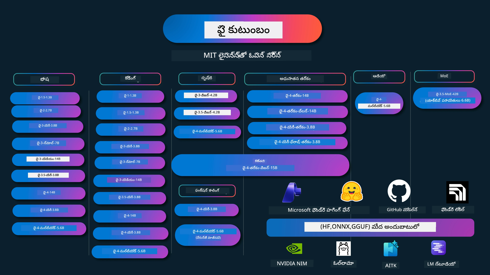

# ఫై కుక్బుక్: మైక్రోసాఫ్ట్ యొక్క ఫై మోడల్స్‌తో హ్యాండ్స్-ఆన్ ఉదాహరణలు

[](https://codespaces.new/microsoft/phicookbook)
[](https://vscode.dev/redirect?url=vscode://ms-vscode-remote.remote-containers/cloneInVolume?url=https://github.com/microsoft/phicookbook)

[](https://GitHub.com/microsoft/phicookbook/graphs/contributors/?WT.mc_id=aiml-137032-kinfeylo)
[](https://GitHub.com/microsoft/phicookbook/issues/?WT.mc_id=aiml-137032-kinfeylo)
[](https://GitHub.com/microsoft/phicookbook/pulls/?WT.mc_id=aiml-137032-kinfeylo)
[](http://makeapullrequest.com?WT.mc_id=aiml-137032-kinfeylo)

[](https://GitHub.com/microsoft/phicookbook/watchers/?WT.mc_id=aiml-137032-kinfeylo)
[](https://GitHub.com/microsoft/phicookbook/network/?WT.mc_id=aiml-137032-kinfeylo)
[](https://GitHub.com/microsoft/phicookbook/stargazers/?WT.mc_id=aiml-137032-kinfeylo)

[](https://discord.com/invite/ByRwuEEgH4)

ఫై అనేది మైక్రోసాఫ్ట్ అభివృద్ధి చేసిన ఓపెన్ సోర్స్ AI మోడల్స్ సిరీస్. 

ఫై ప్రస్తుతం అత్యంత శక్తివంతమైన మరియు ఖర్చు-ప్రభావవంతమైన చిన్న భాషా మోడల్ (SLM), బహుభాషా, తర్కం, టెక్స్ట్/చాట్ జనరేషన్, కోడింగ్, చిత్రాలు, ఆడియో మరియు ఇతర సందర్భాలలో చాలా మంచి బెంచ్‌మార్క్‌లతో ఉంది. 

మీరు ఫైని క్లౌడ్‌లో లేదా ఎడ్జ్ పరికరాలలో డిప్లోయ్ చేయవచ్చు, మరియు పరిమిత కంప్యూటింగ్ శక్తితో తేలికగా జనరేటివ్ AI అనువర్తనాలను తయారుచేయవచ్చు.

ఈ వనరులను ఉపయోగించడం ప్రారంభించడానికి ఈ దశలను అనుసరించండి :
1. **రిపాజిటరీని ఫోర్క్ చేయండి**: క్లిక్ చేయండి [](https://GitHub.com/microsoft/phicookbook/network/?WT.mc_id=aiml-137032-kinfeylo)
2. **రిపాజిటరీని క్లోన్ చేయండి**: `git clone https://github.com/microsoft/PhiCookBook.git`
3. [**Microsoft AI Discord కమ్యూనిటీకి సైన్ అప్ అవ్వండి మరియు నిపుణులు మరియు ఇతర డెవలపర్లను కలుసుకోండి**](https://discord.com/invite/ByRwuEEgH4?WT.mc_id=aiml-137032-kinfeylo)



### 🌐 బహుభాషా మద్దతు

#### GitHub యాక్షన్ ద్వారా మద్దతు (ఆటోమేటెడ్ & ఎప్పుడూ నవీకరించబడింది)

<!-- CO-OP TRANSLATOR LANGUAGES TABLE START -->
[అరవబిక్](../ar/README.md) | [బెంగాలీ](../bn/README.md) | [బల్గేరియన్](../bg/README.md) | [బర్మీస్ (మయన్మార్)](../my/README.md) | [చైనీస్ (సింప్లిఫైడ్)](../zh-CN/README.md) | [చైనీస్ (పారంపరిక, హాంకాంగ్)](../zh-HK/README.md) | [చైనీస్ (పారంపరిక, మకావు)](../zh-MO/README.md) | [చైనీస్ (పారంపరిక, తైవాన్)](../zh-TW/README.md) | [క్రొయేటియన్](../hr/README.md) | [చెక్](../cs/README.md) | [డానిష్](../da/README.md) | [డచ్](../nl/README.md) | [ఎస్టోనియన్](../et/README.md) | [ఫినిష్](../fi/README.md) | [ఫ్రెంచ్](../fr/README.md) | [జర్మన్](../de/README.md) | [గ్రీకు](../el/README.md) | [హీబ్రూ](../he/README.md) | [హింది](../hi/README.md) | [హంగేరియన్](../hu/README.md) | [ఇండోనేషియన్](../id/README.md) | [ఇటాలియన్](../it/README.md) | [జపానీస్](../ja/README.md) | [కన్నడ](../kn/README.md) | [ఖ్మేర్](../km/README.md) | [కొరియన్](../ko/README.md) | [లిథువేనియన్](../lt/README.md) | [మలయ్](../ms/README.md) | [మలయాళం](../ml/README.md) | [మరాఠీ](../mr/README.md) | [నేపాలీ](../ne/README.md) | [నైజీరియన్ పిడ్జిన్](../pcm/README.md) | [నార్వేజియన్](../no/README.md) | [పర్షియన్ (ఫార్సీ)](../fa/README.md) | [పోలిష్](../pl/README.md) | [పోర్చుగీస్ (బ్రెజిల్)](../pt-BR/README.md) | [పోర్చుగీస్ (పోర్టుగల్)](../pt-PT/README.md) | [పంజాబీ (గుర్ముఖీ)](../pa/README.md) | [రోమేనియన్](../ro/README.md) | [రష్యన్](../ru/README.md) | [సెర్బియన్ (సిరిలిక్)](../sr/README.md) | [స్లోవాక్](../sk/README.md) | [స్లోవేనియన్](../sl/README.md) | [స్పానిష్](../es/README.md) | [స్వాహిలి](../sw/README.md) | [స్వీడిష్](../sv/README.md) | [టాగలాగ్ (ఫిలిపినా)](../tl/README.md) | [తమిళ్](../ta/README.md) | [తెలుగు](./README.md) | [థాయ్](../th/README.md) | [టర్కిష్](../tr/README.md) | [ఉక్రెయిన్](../uk/README.md) | [ఉర్దూ](../ur/README.md) | [వియత్నామీస్](../vi/README.md)

> **స్థానికంగా క్లోన్ చేయడం ఇష్టమా?**
>
> ఈ రిపాజిటరీ 50+ భాషా అనువాదాలను కలిగి ఉంది, ఇది డౌన్‌లోడ్ పరిమాణాన్ని గణనీయంగా పెంచుతుంది. అనువాదాలు లేకుండా క్లోన్ చేయడానికి, స్పార్స్ చెకౌట్‌ను ఉపయోగించండి:
>
> **Bash / macOS / Linux:**
> ```bash
> git clone --filter=blob:none --sparse https://github.com/microsoft/PhiCookBook.git
> cd PhiCookBook
> git sparse-checkout set --no-cone '/*' '!translations' '!translated_images'
> ```
>
> **CMD (Windows):**
> ```cmd
> git clone --filter=blob:none --sparse https://github.com/microsoft/PhiCookBook.git
> cd PhiCookBook
> git sparse-checkout set --no-cone "/*" "!translations" "!translated_images"
> ```
>
> ఇది మీరు కోర్సును పూర్తి చేయడానికి అవసరమైన అన్ని వస్తువులను వేగంగా డౌన్‌లోడ్ చేసుకోవడానికి సహాయపడుతుంది.
<!-- CO-OP TRANSLATOR LANGUAGES TABLE END -->

## అంశాల పట్టిక

- పరిచయం
  - [ఫై కుటుంబానికి స్వాగతం](./md/01.Introduction/01/01.PhiFamily.md)
  - [మీ వాతావరణాన్ని సెటప్ చేసుకోవడం](./md/01.Introduction/01/01.EnvironmentSetup.md)
  - [ముఖ్య సాంకేతికతలను అర్థం చేసుకోవడం](./md/01.Introduction/01/01.Understandingtech.md)
  - [ఫై మోడల్స్ కోసం AI సేఫ్టీ](./md/01.Introduction/01/01.AISafety.md)
  - [ఫై హార్డ్‌వేర్ మద్దతు](./md/01.Introduction/01/01.Hardwaresupport.md)
  - [విభిన్న ప్లాట్‌ఫారమ్‌లలో ఫై మోడల్స్ & అందుబాటు](./md/01.Introduction/01/01.Edgeandcloud.md)
  - [Guidance-ai మరియు ఫై ఉపయోగించడం](./md/01.Introduction/01/01.Guidance.md)
  - [GitHub మాకెట్‌ప్లేస్ మోడల్స్](https://github.com/marketplace/models)
  - [Azure AI మోడల్ క్యాటలాగ్](https://ai.azure.com)

- వివిధ వాతావరణాల్లో ఫై ఇన్ఫరెన్స్
    -  [Hugging face](./md/01.Introduction/02/01.HF.md)
    -  [GitHub మోడల్స్](./md/01.Introduction/02/02.GitHubModel.md)
    -  [Microsoft Foundry Model క్యాటలాగ్](./md/01.Introduction/02/03.AzureAIFoundry.md)
    -  [Ollama](./md/01.Introduction/02/04.Ollama.md)
    -  [AI టూల్కిట్ VSCode (AITK)](./md/01.Introduction/02/05.AITK.md)
    -  [NVIDIA NIM](./md/01.Introduction/02/06.NVIDIA.md)
    -  [Foundry Local](./md/01.Introduction/02/07.FoundryLocal.md)

- ఫై కుటుంబం ఇన్ఫరెన్స్
    - [iOSలో ఫై ఇన్ఫరెన్స్](./md/01.Introduction/03/iOS_Inference.md)
    - [Androidలో ఫై ఇన్ఫరెన్స్](./md/01.Introduction/03/Android_Inference.md)
    - [Jetsonలో ఫై ఇన్ఫరెన్స్](./md/01.Introduction/03/Jetson_Inference.md)
    - [AI PCలో ఫై ఇన్ఫరెన్స్](./md/01.Introduction/03/AIPC_Inference.md)
    - [Apple MLX ఫ్రేమ్‌వర్క్‌తో ఫై ఇన్ఫరెన్స్](./md/01.Introduction/03/MLX_Inference.md)
    - [స్థానిక సర్వర్‌లో ఫై ఇన్ఫరెన్స్](./md/01.Introduction/03/Local_Server_Inference.md)
    - [AI టూల్కిట్ ఉపయోగించి రిమోట్ సర్వర్‌లో ఫై ఇన్ఫరెన్స్](./md/01.Introduction/03/Remote_Interence.md)
    - [రస్ట్‌తో ఫై ఇన్ఫరెన్స్](./md/01.Introduction/03/Rust_Inference.md)
    - [స్థానికంగా ఫై -- విజన్ ఇన్ఫరెన్స్](./md/01.Introduction/03/Vision_Inference.md)
    - [Kaito AKS, Azure కంటెయినర్ల(అధికారిక మద్దతు)తో ఫై ఇన్ఫరెన్స్](./md/01.Introduction/03/Kaito_Inference.md)
-  [ఫై కుటుంబం పరిమాణం గణన](./md/01.Introduction/04/QuantifyingPhi.md)
    - [llama.cpp ఉపయోగించి ఫై-3.5 / 4 పరిమాణాన్ని తగ్గించడం](./md/01.Introduction/04/UsingLlamacppQuantifyingPhi.md)
    - [onnxruntime కోసం Generative AI అనుబంధాలు ఉపయోగించి ఫై-3.5 / 4 పరిమాణం తగ్గించడం](./md/01.Introduction/04/UsingORTGenAIQuantifyingPhi.md)
    - [Intel OpenVINO ఉపయోగించి ఫై-3.5 / 4 పరిమాణం తగ్గించడం](./md/01.Introduction/04/UsingIntelOpenVINOQuantifyingPhi.md)
    - [Apple MLX ఫ్రేమ్‌వర్క్ ఉపయోగించి ఫై-3.5 / 4 పరిమాణం తగ్గించడం](./md/01.Introduction/04/UsingAppleMLXQuantifyingPhi.md)

-  ఫై మూల్యాంకనం
    - [సమాధానదాయక AI](./md/01.Introduction/05/ResponsibleAI.md)
    - [మైక్రోసాఫ్ట్ Foundry ఫిర్యాదుల కోసం](./md/01.Introduction/05/AIFoundry.md)
    - [మూల్యాంకన కోసం Promptflow ఉపయోగించడం](./md/01.Introduction/05/Promptflow.md)
 
- Azure AI Search తో RAG
    - [Azure AI Search తో Phi-4-mini మరియు Phi-4-multimodal(RAG) ఎలా ఉపయోగించాలి](https://github.com/microsoft/PhiCookBook/blob/main/code/06.E2E/E2E_Phi-4-RAG-Azure-AI-Search.ipynb)

- ఫై అప్లికేషన్ అభివృద్ధి నమూనాలు
  - టెక్స్ట్ & చాట్ అప్లికేషన్లు
    - ఫై-4 నమూనాలు 
      - [📓] [Phi-4-mini ONNX మోడల్‌తో చాట్](./md/02.Application/01.TextAndChat/Phi4/ChatWithPhi4ONNX/README.md)
      - [ఫై-4 స్థానిక ONNX మోడల్‌తో చాట్ .NET](../../md/04.HOL/dotnet/src/LabsPhi4-Chat-01OnnxRuntime)
      - [సెమెటిక్ కర్నెల్ ఉపయోగించి ఫై-4 ONNX తో చాట్ .NET కన్సోల్ యాప్](../../md/04.HOL/dotnet/src/LabsPhi4-Chat-02SK)
    - ఫై-3 / 3.5 నమూనాలు
      - [ఫై3, ONNX రన్టైమ్ వెబ్ మరియు WebGPU ఉపయోగించి బ్రౌజర్‌లో స్థానిక చాట్‌బాట్](https://github.com/microsoft/onnxruntime-inference-examples/tree/main/js/chat)
      - [OpenVino చాట్](./md/02.Application/01.TextAndChat/Phi3/E2E_OpenVino_Chat.md)
      - [మల్టీ మోడల్ - ఇంటరాక్టివ్ Phi-3-mini మరియు OpenAI Whisper](./md/02.Application/01.TextAndChat/Phi3/E2E_Phi-3-mini_with_whisper.md)
      - [MLFlow - రాపర్ నిర్మాణం మరియు Phi-3 ను MLFlow తో ఉపయోగించడం](./md//02.Application/01.TextAndChat/Phi3/E2E_Phi-3-MLflow.md)
      - [మోడల్ ఆప్టిమైజేషన్ - ONNX రంటైమ్ వెబ్ కోసం Phi-3-min మోడల్ ని Olive తో ఎలా ఆప్టిమైజ్ చేయాలి](https://github.com/microsoft/Olive/tree/main/examples/phi3)
      - [WinUI3 యాప్ తో Phi-3 mini-4k-instruct-onnx](https://github.com/microsoft/Phi3-Chat-WinUI3-Sample/)
      -[WinUI3 మల్టీ మోడల్ AI పవర్డ్ నోట్స్ యాప్ నమూనా](https://github.com/microsoft/ai-powered-notes-winui3-sample)
      - [కస్టమ్ Phi-3 మోడల్స్ ను ఫైన్-ట్యూన్ చేసి Prompt flow తో ఇంటిగ్రేట్ చేయడం](./md/02.Application/01.TextAndChat/Phi3/E2E_Phi-3-FineTuning_PromptFlow_Integration.md)
      - [Microsoft Foundry లో Prompt flow తో కస్టమ్ Phi-3 మోడల్స్ ని ఫైన్-ట్యూన్ చేసి ఇంటిగ్రేట్ చేయడం](./md/02.Application/01.TextAndChat/Phi3/E2E_Phi-3-FineTuning_PromptFlow_Integration_AIFoundry.md)
      - [Microsoft Foundry లోని Microsoft యొక్క బాధ్యతాయుత AI సిద్ధాంతాలపైన దృష్టి పెట్టి ఫైన్-ట్యూన్ చేసిన Phi-3 / Phi-3.5 మోడల్ ని మూల్యాంకనం చేయడం](./md/02.Application/01.TextAndChat/Phi3/E2E_Phi-3-Evaluation_AIFoundry.md)
      - [📓] [Phi-3.5-mini-instruct భాషా భావన నమూనా (చైనా/ఆంగ్లం)](./md/02.Application/01.TextAndChat/Phi3/phi3-instruct-demo.ipynb)
      - [Phi-3.5-Instruct WebGPU RAG చాట్ బాట్](./md/02.Application/01.TextAndChat/Phi3/WebGPUWithPhi35Readme.md)
      - [Windows GPU ఉపయోగించి Phi-3.5-Instruct ONNX తో Prompt flow పరిష్కారం సృష్టించడం](./md/02.Application/01.TextAndChat/Phi3/UsingPromptFlowWithONNX.md)
      - [Microsoft Phi-3.5 tflite ఉపయోగించి Android యాప్ సృష్టించడం](./md/02.Application/01.TextAndChat/Phi3/UsingPhi35TFLiteCreateAndroidApp.md)
      - [Q&A .NET ఉదాహరణ స్థానిక ONNX Phi-3 మోడల్ Microsoft.ML.OnnxRuntime ఉపయోగించి](../../md/04.HOL/dotnet/src/LabsPhi301)
      - [సెమెంటిక్ కర్నెల్ మరియు Phi-3 తో కಾನ్సోల్ చాట్ .NET యాప్](../../md/04.HOL/dotnet/src/LabsPhi302)

  - Azure AI ఇన్ఫరెన్స్ SDK కోడ్ ఆధారిత నమూనాలు 
    - Phi-4 నమూనాలు 
      - [📓] [Phi-4-multimodal ఉపయోగించి ప్రాజెక్ట్ కోడ్ జనరేట్ చేయడం](./md/02.Application/02.Code/Phi4/GenProjectCode/README.md)
    - Phi-3 / 3.5 నమూనాలు
      - [Microsoft Phi-3 ఫ్యామిలీ తో మీ స్వంత విజువల్ స్టూడియో కోడ్ GitHub Copilot చాట్ నిర్మించండి](./md/02.Application/02.Code/Phi3/VSCodeExt/README.md)
      - [GitHub మోడల్స్ తో Phi-3.5 తో మీ స్వంత Visual Studio Code చాట్ Copilot ఏజెంట్ సృష్టించడం](/md/02.Application/02.Code/Phi3/CreateVSCodeChatAgentWithGitHubModels.md)

  - అధునాతన తర్కం నమూనాలు
    - Phi-4 నమూనాలు 
      - [📓] [Phi-4-mini-తర్కం లేదా Phi-4-తర్కం నమూనాలు](./md/02.Application/03.AdvancedReasoning/Phi4/AdvancedResoningPhi4mini/README.md)
      - [📓] [Microsoft Olive తో Phi-4-mini-తర్కం ఫైన్-ట్యూనింగ్](./md/02.Application/03.AdvancedReasoning/Phi4/AdvancedResoningPhi4mini/olive_ft_phi_4_reasoning_with_medicaldata.ipynb)
      - [📓] [Apple MLX తో Phi-4-mini-తర్కం ఫైన్-ట్యూనింగ్](./md/02.Application/03.AdvancedReasoning/Phi4/AdvancedResoningPhi4mini/mlx_ft_phi_4_reasoning_with_medicaldata.ipynb)
      - [📓] [GitHub మోడల్స్ తో Phi-4-mini-తర్కం](./md/02.Application/02.Code/Phi4r/github_models_inference.ipynb)
      - [📓] [Microsoft Foundry మోడల్స్ తో Phi-4-mini-తర్కం](./md/02.Application/02.Code/Phi4r/azure_models_inference.ipynb)
  - డెమోలు
      - [Phi-4-mini డెమోలు Hugging Face Spacesలో హోస్ట్ చేయబడ్డాయి](https://huggingface.co/spaces/microsoft/phi-4-mini?WT.mc_id=aiml-137032-kinfeylo)
      - [Phi-4-మల్టిమోడల్ డెమోలు Hugginge Face Spacesలో హోస్ట్ చేయబడ్డాయి](https://huggingface.co/spaces/microsoft/phi-4-multimodal?WT.mc_id=aiml-137032-kinfeylo)
  - విజన్ నమూనాలు
    - Phi-4 నమూనాలు 
      - [📓] [Phi-4-multimodal ఉపయోగించి చిత్రాలు చదవడం మరియు కోడ్ జనరేట్ చేయడం](./md/02.Application/04.Vision/Phi4/CreateFrontend/README.md) 
    - Phi-3 / 3.5 నమూనాలు
      -  [📓][Phi-3-vision-చిత్రం టెక్స్ట్ నుండి టెక్స్ట్](./md/02.Application/04.Vision/Phi3/E2E_Phi-3-vision-image-text-to-text-online-endpoint.ipynb)
      - [Phi-3-vision-ONNX](https://onnxruntime.ai/docs/genai/tutorials/phi3-v.html)
      - [📓][Phi-3-vision CLIP ఎంబెడ్డింగ్](./md/02.Application/04.Vision/Phi3/E2E_Phi-3-vision-image-text-to-text-online-endpoint.ipynb)
      - [డెమో: Phi-3 రీసైక్లింగ్](https://github.com/jennifermarsman/PhiRecycling/)
      - [Phi-3-vision - విజువల్ భాష సహాయకుడు - Phi3-విజన్ మరియు OpenVINO తో](https://docs.openvino.ai/nightly/notebooks/phi-3-vision-with-output.html)
      - [Phi-3 విజన్ Nvidia NIM](./md/02.Application/04.Vision/Phi3/E2E_Nvidia_NIM_Vision.md)
      - [Phi-3 విజన్ OpenVino](./md/02.Application/04.Vision/Phi3/E2E_OpenVino_Phi3Vision.md)
      - [📓][Phi-3.5 విజన్ మల్టీ-ఫ్రేమ్ లేదా మల్టీ-ఇమేజ్ నమూనా](./md/02.Application/04.Vision/Phi3/phi3-vision-demo.ipynb)
      - [Microsoft.ML.OnnxRuntime .NET ఉపయోగించి స్థానిక Phi-3 విజన్ ONNX మోడల్](../../md/04.HOL/dotnet/src/LabsPhi303)
      - [Microsoft.ML.OnnxRuntime .NET ఉపయోగించి మెనూ ఆధారిత Phi-3 విజన్ స్థానిక ONNX మోడల్](../../md/04.HOL/dotnet/src/LabsPhi304)

  - తర్కం-విజన్ నమూనాలు
    - Phi-4-తర్కం-విజన్-15B 
      - [📓] [Phi-4-తర్కం-విజన్-15B ఉపయోగించి జేవాకింగ్ గుర్తించడం](./md/02.Application/10.ReasoningVision/Phi_4_reasoning_vision_15b_Jaywalking.ipynb)
      - [📓] [Phi-4-తర్కం-విజన్-15B ఉపయోగించి గణితం](./md/02.Application/10.ReasoningVision/Phi_4_reasoning_vision_15b_Math.ipynb)
      - [📓] [Phi-4-తర్కం-విజన్-15B ఉపయోగించి UI గుర్తించడం](./md/02.Application/10.ReasoningVision/Phi_4_reasoning_vision_15b_ui.ipynb)

  - గణితం నమూనాలు
    -  Phi-4-మినీ-ఫ్లాష్-తర్కం-ఇన్‌స్ట్రక్ట్ నమూనాలు  [Phi-4-మినీ-ఫ్లాష్-తర్కం-ఇన్‌స్ట్రక్ట్ తో గణిత డెమో](./md/02.Application/09.Math/MathDemo.ipynb)

  - ఆడియో నమూనాలు
    - Phi-4 నమూనాలు 
      - [📓] [Phi-4-multimodal ఉపయోగించి ఆడియో ట్రాన్స్క్రిప్ట్ సేకరణ](./md/02.Application/05.Audio/Phi4/Transciption/README.md)
      - [📓] [Phi-4-multimodal ఆడియో నమూనా](./md/02.Application/05.Audio/Phi4/Siri/demo.ipynb)
      - [📓] [Phi-4-multimodal స్పీచ్ అనువాద నమూనా](./md/02.Application/05.Audio/Phi4/Translate/demo.ipynb)
      - [.NET కాంసోల్ అప్లికేషన్ Phi-4-multimodal ఆడియోను ఉపయోగించి ఆడియో ఫైల్ విశ్లేషణ మరియు ట్రాన్స్క్రిప్ట్ సృష్టించడం](../../md/04.HOL/dotnet/src/LabsPhi4-MultiModal-02Audio)

  - MOE నమూనాలు
    - Phi-3 / 3.5 నమూనాలు
      - [📓] [Phi-3.5 మిశ్రమ నిపుణుల మోడల్స్ (MoEs) సోషల్ మీడియా నమూనా](./md/02.Application/06.MoE/Phi3/phi3_moe_demo.ipynb)
      - [📓] [NVIDIA NIM Phi-3 MOE, Azure AI సెర్చ్ మరియు LlamaIndex తో రిట్రీవల్-ఆగ్మెంటెడ్ జనరేషన్ (RAG) పైప్‌లైన్ నిర్మాణం](./md/02.Application/06.MoE/Phi3/azure-ai-search-nvidia-rag.ipynb)
      - 
  - ఫంక్షన్ కాలింగ్ నమూనాలు
    - Phi-4 నమూనాలు 🆕
      -  [📓] [Phi-4-mini తో ఫంక్షన్ కాలింగ్ ఉపయోగించడం](./md/02.Application/07.FunctionCalling/Phi4/FunctionCallingBasic/README.md)
      -  [📓] [Phi-4-mini తో మల్టీ-ఏజెంట్స్ సృష్టించడానికి ఫంక్షన్ కాలింగ్ ఉపయోగించడం](./md/02.Application/07.FunctionCalling/Phi4/Multiagents/Phi_4_mini_multiagent.ipynb)
      -  [📓] [Ollama తో ఫంక్షన్ కాలింగ్ ఉపయోగించడం](./md/02.Application/07.FunctionCalling/Phi4/Ollama/ollama_functioncalling.ipynb)
      -  [📓] [ONNX తో ఫంక్షన్ కాలింగ్ ఉపయోగించడం](./md/02.Application/07.FunctionCalling/Phi4/ONNX/onnx_parallel_functioncalling.ipynb)
  - మల్టిమోడల్ మిక్సింగ్ నమూనాలు
    - Phi-4 నమూనాలు 🆕
      -  [📓] [టెక్నాలజీ జర్నలిస్ట్ గా Phi-4-multimodal ఉపయోగించడం](./md/02.Application/08.Multimodel/Phi4/TechJournalist/phi_4_mm_audio_text_publish_news.ipynb)
      - [.NET కాంసోల్ అప్లికేషన్ Phi-4-multimodal ఉపయోగించి చిత్రాల విశ్లేషణ](../../md/04.HOL/dotnet/src/LabsPhi4-MultiModal-01Images)

- ఫైన్-ట్యూనింగ్ Phi నమూనాలు
  - [ఫైన్-ట్యూనింగ్ దృశ్యాలు](./md/03.FineTuning/FineTuning_Scenarios.md)
  - [ఫైన్-ట్యూనింగ్ vs RAG](./md/03.FineTuning/FineTuning_vs_RAG.md)
  - [Phi-3 ను పరిశ్రమ నిపుణుడిగా మార్చేందుకు ఫైన్-ట్యూనింగ్](./md/03.FineTuning/LetPhi3gotoIndustriy.md)
  - [VS కోడ్ కోసం AI టూల్‌కిట్ తో Phi-3 ఫైన్-ట్యూనింగ్](./md/03.FineTuning/Finetuning_VSCodeaitoolkit.md)
  - [Azure మెషిన్ లర్నింగ్ సర్వీస్ తో Phi-3 ఫైన్-ట్యూనింగ్](./md/03.FineTuning/Introduce_AzureML.md)
  - [Lora తో Phi-3 ఫైన్-ట్యూనింగ్](./md/03.FineTuning/FineTuning_Lora.md)
  - [QLora తో Phi-3 ఫైన్-ట్యూనింగ్](./md/03.FineTuning/FineTuning_Qlora.md)
  - [Microsoft Foundry తో Phi-3 ఫైన్-ట్యూనింగ్](./md/03.FineTuning/FineTuning_AIFoundry.md)
  - [Azure ML CLI/SDK తో Phi-3 ఫైన్-ట్యూనింగ్](./md/03.FineTuning/FineTuning_MLSDK.md)
  - [Microsoft Olive తో ఫైన్-ట్యూనింగ్](./md/03.FineTuning/FineTuning_MicrosoftOlive.md)
  - [Microsoft Olive Hands-On ల్యాబ్ తో ఫైన్-ట్యూనింగ్](./md/03.FineTuning/olive-lab/readme.md)
  - [Weights and Bias తో Phi-3-vision ఫైన్-ట్యూనింగ్](./md/03.FineTuning/FineTuning_Phi-3-visionWandB.md)
  - [Apple MLX ఫ్రేమ్‌వర్క్ తో Phi-3 ఫైన్-ట్యూనింగ్](./md/03.FineTuning/FineTuning_MLX.md)
  - [Phi-3-vision ఫైన్-ట్యూనింగ్ (అధికారిక మద్దతు)](./md/03.FineTuning/FineTuning_Vision.md)
  - [KaiTo AKS , Azure కంటైనర్లతో Phi-3 ఫైన్-ట్యూనింగ్ (అధికారిక మద్దతు)](./md/03.FineTuning/FineTuning_Kaito.md)
  - [Phi-3 మరియు 3.5 విజన్ ఫైన్-ట్యూనింగ్](https://github.com/2U1/Phi3-Vision-Finetune)

- ప్రాక్టికల్ ల్యాబ్
  - [కటింగ్-ఎడ్జ్ మోడల్స్ అన్వేషణ: LLMs, SLMs, స్థానిక అభివృద్ధి మరియు మరిన్ని](https://github.com/microsoft/aitour-exploring-cutting-edge-models)
  - [NLP సామర్థ్యాన్ని విడుదల చేయడం: Microsoft Olive తో ఫైన్-ట్యూనింగ్](https://github.com/azure/Ignite_FineTuning_workshop)

- అకడమిక్ పరిశోధన పత్రాలు మరియు ప్రచురణలు
  - [పాఠ్యపుస్తకాలు చేనే కావాలి II: phi-1.5 సాంకేతిక నివేదిక](https://arxiv.org/abs/2309.05463)
  - [Phi-3 సాంకేతిక నివేదిక: మీ ఫోన్‌లో స్థానికంగా ఉన్న అత్యున్నత సామర్థ్య భాషా మోడల్](https://arxiv.org/abs/2404.14219)
  - [Phi-4 సాంకేతిక నివేదిక](https://arxiv.org/abs/2412.08905)
  - [Phi-4-మినీ సాంకేతిక నివేదిక: మిశ్రమ-ఆఫ్-లోరాలతో కంపాక్ట్ అయిన శక్తివంతమైన బహుముఖ భాషా మోడల్స్](https://arxiv.org/abs/2503.01743)
  - [వాహనంలో ఫంక్షన్-కాల్ కోసం చిన్న భాషా మోడల్స్ ఆప్టిమైజేషన్](https://arxiv.org/abs/2501.02342)
  - [(WhyPHI) బహుళ-ఛాయిస్ ప్రశ్నలకు జవాబుకు PHI-3 ఫైన్-ట్యూనింగ్: విధానం, ఫలితాలు, మరియు సవాళ్లు](https://arxiv.org/abs/2501.01588)
  - [Phi-4-ఆలోచన సాంకేతిక నివేదిక](https://www.microsoft.com/en-us/research/wp-content/uploads/2025/04/phi_4_reasoning.pdf)
  - [Phi-4-మినీ-ఆలోచన సాంకేతిక నివేదిక](https://huggingface.co/microsoft/Phi-4-mini-reasoning/blob/main/Phi-4-Mini-Reasoning.pdf)

## Phi మోడల్స్ ఉపయోగించడం

### మైక్రోసాఫ్ట్ ఫౌండ్రీలో Phi

మీ వివిధ హార్డ్‌వేర్ పరికరాల్లో Microsoft Phi ను ఎలా ఉపయోగించాలో, E2E పరిష్కారాలను ఎలా నిర్మించాలో మీరు తెలుసుకోవచ్చు. Phi ని ప్రత్యక్షంగా అనుభవించేందుకు, మొదట మోడల్స్‌తో ఆడండి మరియు మీ సందర్భాల కోసం Phi ను అనుకూలీకరించండి [Microsoft Foundry Azure AI Model Catalog](https://aka.ms/phi3-azure-ai) ఉపయోగించి. మీరు [Microsoft Foundry](/md/02.QuickStart/AzureAIFoundry_QuickStart.md) ద్వారా ప్రారంభం చేసుకోవచ్చు.

**ప్లేగ్రౌండ్**  
ప్రతి మోడల్‌కు మోడల్ పరీక్షించడానికి ప్రత్యేక ప్లేగ్రౌండ్ ఉంది [Azure AI Playground](https://aka.ms/try-phi3).

### GitHub మోడల్స్‌లో Phi

మీ వివిధ హార్డ్‌వేర్ పరికరాల్లో Microsoft Phi ను ఎలా ఉపయోగించాలో, E2E పరిష్కారాలను ఎలా నిర్మించాలో మీరు తెలుసుకోవచ్చు. Phi ని ప్రత్యక్షంగా అనుభవించేందుకు, మొదట మోడల్‌తో ఆడండి మరియు మీ సందర్భాల కోసం Phi ను అనుకూలీకరించండి [GitHub Model Catalog](https://github.com/marketplace/models?WT.mc_id=aiml-137032-kinfeylo) ఉపయోగించి. మీరు [GitHub Model Catalog](/md/02.QuickStart/GitHubModel_QuickStart.md) ద్వారా ప్రారంభం చేసుకోవచ్చు.

**ప్లేగ్రౌండ్**  
ప్రతి మోడల్‌కు ప్రత్యేక [ప్లేగ్రౌండ్ లో మోడల్ పరీక్షించడానికి](/md/02.QuickStart/GitHubModel_QuickStart.md) ఉంటుంది.

### Hugging Face లో Phi

మీకు మోడల్ [Hugging Face](https://huggingface.co/microsoft) లో కూడా లభిస్తుంది.

**ప్లేగ్రౌండ్**  
[Hugging Chat ప్లేగ్రౌండ్](https://huggingface.co/chat/models/microsoft/Phi-3-mini-4k-instruct)

## 🎒 ఇతర కోర్సులు

మా బృందం ఇతర కోర్సులు కూడా తయారు చేస్తోంది! పరిశీలించండి:

<!-- CO-OP TRANSLATOR OTHER COURSES START -->
### LangChain
[](https://aka.ms/langchain4j-for-beginners)
[](https://aka.ms/langchainjs-for-beginners?WT.mc_id=m365-94501-dwahlin)
[](https://github.com/microsoft/langchain-for-beginners?WT.mc_id=m365-94501-dwahlin)
---

### Azure / Edge / MCP / Agents
[](https://github.com/microsoft/AZD-for-beginners?WT.mc_id=academic-105485-koreyst)
[](https://github.com/microsoft/edgeai-for-beginners?WT.mc_id=academic-105485-koreyst)
[](https://github.com/microsoft/mcp-for-beginners?WT.mc_id=academic-105485-koreyst)
[](https://github.com/microsoft/ai-agents-for-beginners?WT.mc_id=academic-105485-koreyst)

---

### Generative AI సిరీస్
[](https://github.com/microsoft/generative-ai-for-beginners?WT.mc_id=academic-105485-koreyst)
[-9333EA?style=for-the-badge&labelColor=E5E7EB&color=9333EA)](https://github.com/microsoft/Generative-AI-for-beginners-dotnet?WT.mc_id=academic-105485-koreyst)
[-C084FC?style=for-the-badge&labelColor=E5E7EB&color=C084FC)](https://github.com/microsoft/generative-ai-for-beginners-java?WT.mc_id=academic-105485-koreyst)
[-E879F9?style=for-the-badge&labelColor=E5E7EB&color=E879F9)](https://github.com/microsoft/generative-ai-with-javascript?WT.mc_id=academic-105485-koreyst)

---

### కోర్ లెర్నింగ్
[](https://aka.ms/ml-beginners?WT.mc_id=academic-105485-koreyst)
[](https://aka.ms/datascience-beginners?WT.mc_id=academic-105485-koreyst)
[](https://aka.ms/ai-beginners?WT.mc_id=academic-105485-koreyst)
[](https://github.com/microsoft/Security-101?WT.mc_id=academic-96948-sayoung)
[](https://aka.ms/webdev-beginners?WT.mc_id=academic-105485-koreyst)
[](https://aka.ms/iot-beginners?WT.mc_id=academic-105485-koreyst)
[](https://github.com/microsoft/xr-development-for-beginners?WT.mc_id=academic-105485-koreyst)

---

### కోపైలట్ సిరీస్
[](https://aka.ms/GitHubCopilotAI?WT.mc_id=academic-105485-koreyst)
[](https://github.com/microsoft/mastering-github-copilot-for-dotnet-csharp-developers?WT.mc_id=academic-105485-koreyst)
[](https://github.com/microsoft/CopilotAdventures?WT.mc_id=academic-105485-koreyst)
<!-- CO-OP TRANSLATOR OTHER COURSES END -->

## బాధ్యతాయుత AI

మైక్రోసాఫ్ట్ మా కస్టమర్లకు మా AI ఉత్పత్తులను బాధ్యతాయుతంగా ఉపయోగించుకోవడంలో సహాయం చేయడానికి प्रतिबद्धం, మా అభ్యాసాలను పంచుకోవడం, మరియు ట్రాన్స్పరెన్సీ నోట్స్ మరియు ఇంపెక్ట్ అస్సెస్‌మెంట్‌ల వంటి పరికరాల ద్వారా విశ్వాస లేని భాగస్వామ్యాలను నిర్మించడం. ఈ వనరులలో చాలావరకు [https://aka.ms/RAI](https://aka.ms/RAI) లో కనుగొనవచ్చు.  
మైక్రోసాఫ్ట్ బాధ్యతాయుత AI విధానం మా AI సూత్రాల ఆధారంగా ఉంటుంది: న్యాయం, విశ్వసనీయత మరియు భద్రత, గోప్యత మరియు భద్రత, సమగ్రత, పారదర్శకత మరియు బాధ్యత.

ఈ నమూనాలో ఉపయోగించిన పెద్ద స్కేల్ సహజ భాష, చిత్రం, మరియు మాట మోడల్స్ - అవి అన్యాయం, అప్రామాణికత లేదా అవమానకరమైన రూపంలో ప్రవర్తించవచ్చు, మరియు దాని వల్ల హానులు రావచ్చు. ప్రాథమిక జాగ్రత్తలు మరియు పరిమితుల గురించి తెలియకుండానే మీరు వాడకూడదు, దయచేసి [Azure OpenAI సేవా పారదర్శకత నోట్](https://learn.microsoft.com/legal/cognitive-services/openai/transparency-note?tabs=text) ని సంప్రదించండి.
ఈ ప్రమాదాలను నివారించడానికి సూచించబడిన విధానం మీ ఆర్కిటెక్చర్‌లో హానికరమైన ప్రవర్తనను గుర్తించి నివారించగల సేఫ్టీ సిస్టమ్‌ను చేర్చడం. [Azure AI Content Safety](https://learn.microsoft.com/azure/ai-services/content-safety/overview) ఒక స్వతంత్ర రక్షణ పొరను అందిస్తుంది, ఇది అప్లికేషన్లు మరియు సేవలలో హానికరమైన వినియోగదారు-సృష్టించిన మరియు AI-సృష్టించిన కంటెంట్‌ను గుర్తించగలదు. Azure AI Content Safety టెక్స్ట్ మరియు చిత్రం APIల‌ను కలిగి ఉంది, ఇవి హానికరమైన పదార్థాన్ని గుర్తించడానికి అనుమతిస్తాయి. Microsoft Foundryలో, Content Safety సేవ ద్వారా మీరు వివిధ మోడాలిటీలలో హానికరమైన కంటెంట్‌ను గుర్తించడానికి నమూనా కోడ్‌ను వీక్షించడానికి, అన్వేషించడానికి మరియు ప్రయత్నించడానికి వీలుగా ఉంటుంది. ఈ కింది [quickstart డాక్యుమెంటేషన్](https://learn.microsoft.com/azure/ai-services/content-safety/quickstart-text?tabs=visual-studio%2Clinux&pivots=programming-language-rest) మీరు సేవకు అభ్యర్థనలను చేయడంలో గైడ్ చేస్తుంది.

మరొక అంశం వెయ్యాలి అంటే మొత్తం అప్లికేషన్ పనితీరు. బహుళ-మోడల్ మరియు బహుళ-మోడల్స్ అప్లికేషన్లతో, మేము పనితీరును మీరూ మరియు మీ వినియోగదారులు ఆశించే విధంగా వ్యవహరించడం అని భావిస్తాము, హానికరమైన అవుట్పుట్‌లు ఉత్పత్తి చేయకుండా ఉండటం సహా. మీరు మీ మొత్త అప్లికేషన్ పనితీరును [Performance and Quality and Risk and Safety evaluators](https://learn.microsoft.com/azure/ai-studio/concepts/evaluation-metrics-built-in) ఉపయోగించి అంచనా వేయడం ముఖ్యము. మీరు [custom evaluators](https://learn.microsoft.com/azure/ai-studio/how-to/develop/evaluate-sdk#custom-evaluators) సృష్టించి, వాటితో అంచనా వేయగలుగుతారు.

మీ AI అప్లికేషన్‌ను మీ అభివృద్ధి పర్యావరణంలో [Azure AI Evaluation SDK](https://microsoft.github.io/promptflow/index.html) ఉపయోగించి అంచనా వేయవచ్చు. ఒక పరీక్ష డేటాసెట్ లేదా లక్ష్యము ఇచ్చినప్పుడల్లా, మీ జనరేటివ్ AI అప్లికేషన్ పుట్టిపడినది అంతర్జాతీయ ప్రమాణాల లేదా మీరు ఎంచుకున్న కస్టమ్ ఈవాల్యుటర్ల ద్వారా గణాంకపరంగా కొలవబడుతుంది. మీ సిస్టమ్‌ను అంచనా వేయడానికి Azure AI Evaluation SDKతో ప్రారంభించడానికి, మీరు [quickstart గైడ్](https://learn.microsoft.com/azure/ai-studio/how-to/develop/flow-evaluate-sdk)‌ను అనుసరించవచ్చు. మీరు ఒక ఈవాల్యుయేషన్ ను అమలు చేసిన వెంటనే, మీరు [Microsoft Foundryలో ఫలితాలను విజువలైజ్](https://learn.microsoft.com/azure/ai-studio/how-to/evaluate-flow-results) చేయవచ్చు.

## ట్రేడ్మార్కులు

ఈ ప్రాజెక్ట్ ప్రాజెక్టులు, ఉత్పత్తులు లేదా సేవలకు ట్రేడ్మార్కులు లేదా లోగోలు కలిగి ఉండవచ్చు. Microsoft ట్రేడ్మార్కులు లేదా లోగోల అధికారిక వినియోగం [Microsoft's Trademark & Brand Guidelines](https://www.microsoft.com/legal/intellectualproperty/trademarks/usage/general) కు అనుగుణంగా ఉండాలి మరియు దాని ప్రకారం మాత్రమే ఉండాలి.
మార్పులు చేసిన సంస్కరణలలో Microsoft ట్రేడ్మార్కులు లేదా లోగోలు వాడటం Microsoft స్పాన్సర్‌షిప్‌ను కలిగించినట్లు లేదా గందరగోళం కలిగించే విధంగా ఉండకూడదు. మూడవ పక్ష ట్రేడ్మార్కులు లేదా లోగోల ఏదైనా వినియోగం ఆ మూడవ పక్ష పాలసీలకు అనుగుణంగా ఉండాలి.

## సహాయం పొందుట

మీరు ఏదైనా ఇబ్బంది పడితే లేదా AI అప్లికేషన్లు నిర్మించడంపై ఏవైనా ప్రశ్నలు ఉంటే, చేరండి:

[](https://aka.ms/foundry/discord)

మీకు ఉత్పత్తి ప్రసక్తి సూచనలు లేదా లోపాలు ఉన్నట్లయితే సందర్శించండి:

[](https://aka.ms/foundry/forum)

---

<!-- CO-OP TRANSLATOR DISCLAIMER START -->
**అస్పష్టత**:  
ఈ డాక్యుమెంట్ [Co-op Translator](https://github.com/Azure/co-op-translator) అనే AI అనువాద సేవ ఉపయోగించి అనువదించబడింది. మనం ఖచ్చితత్వానికి ప్రయత్నిస్తుంటే కూడా, ఆటోమేటిక్ అనువాదాల్లో పొరపాట్లు లేదా లోపాలు ఉండవచ్చు. అసలు డాక్యుమెంట్ తన స్వదేశీ భాషలో వున్నదే అధికారం కలిగిన మూలం గా పరిగణించాలి. కీలకమైన సమాచారం కోసం, ప్రొఫెషనల్ మానవ అనువాదం సిఫార్సు చేయబడుతుంది. ఈ అనువాదం ఉపయోగించుట వలన వచ్చిన ఏదైనా అపార్థాలు లేదా తప్పుదోషాల కోసం మేము బాధ్యులు క కాదు.
<!-- CO-OP TRANSLATOR DISCLAIMER END -->