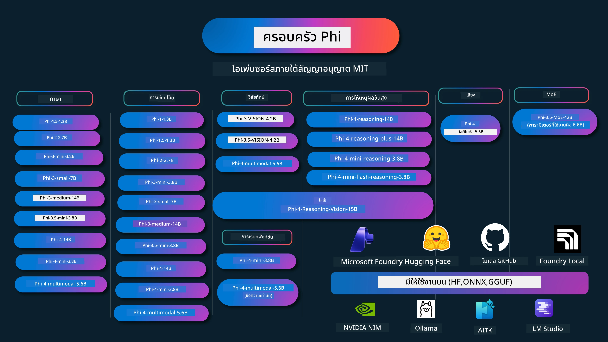

# Phi Cookbook: ตัวอย่างใช้งานจริงกับโมเดล Phi ของ Microsoft

[](https://codespaces.new/microsoft/phicookbook)
[](https://vscode.dev/redirect?url=vscode://ms-vscode-remote.remote-containers/cloneInVolume?url=https://github.com/microsoft/phicookbook)

[](https://GitHub.com/microsoft/phicookbook/graphs/contributors/?WT.mc_id=aiml-137032-kinfeylo)
[](https://GitHub.com/microsoft/phicookbook/issues/?WT.mc_id=aiml-137032-kinfeylo)
[](https://GitHub.com/microsoft/phicookbook/pulls/?WT.mc_id=aiml-137032-kinfeylo)
[](http://makeapullrequest.com?WT.mc_id=aiml-137032-kinfeylo)

[](https://GitHub.com/microsoft/phicookbook/watchers/?WT.mc_id=aiml-137032-kinfeylo)
[](https://GitHub.com/microsoft/phicookbook/network/?WT.mc_id=aiml-137032-kinfeylo)
[](https://GitHub.com/microsoft/phicookbook/stargazers/?WT.mc_id=aiml-137032-kinfeylo)

[](https://discord.com/invite/ByRwuEEgH4)

Phi คือชุดโมเดล AI แบบโอเพนซอร์สที่พัฒนาโดย Microsoft

Phi ปัจจุบันเป็นโมเดลภาษาขนาดเล็ก (SLM) ที่ทรงพลังและคุ้มค่าที่สุด มีการวัดผลที่ดีมากในหลายภาษา การให้เหตุผล การสร้างข้อความ/แชท โค้ดดิ้ง รูปภาพ เสียง และสถานการณ์อื่นๆ

คุณสามารถปรับใช้ Phi บนคลาวด์หรืออุปกรณ์ที่ EDGE และสามารถสร้างแอปพลิเคชัน AI เชิงสร้างสรรค์ได้ง่ายๆ ด้วยพลังการคำนวณที่จำกัด

ทำตามขั้นตอนเหล่านี้เพื่อเริ่มใช้งานแหล่งข้อมูลนี้:
1. **Fork ที่เก็บนี้:** คลิก [](https://GitHub.com/microsoft/phicookbook/network/?WT.mc_id=aiml-137032-kinfeylo)
2. **โคลนที่เก็บนี้:** `git clone https://github.com/microsoft/PhiCookBook.git`
3. [**เข้าร่วมชุมชน Microsoft AI Discord และพบปะผู้เชี่ยวชาญและนักพัฒนาร่วมกัน**](https://discord.com/invite/ByRwuEEgH4?WT.mc_id=aiml-137032-kinfeylo)



### 🌐 รองรับหลายภาษา

#### รองรับผ่าน GitHub Action (อัตโนมัติและอัปเดตเสมอ)

<!-- CO-OP TRANSLATOR LANGUAGES TABLE START -->
[อาหรับ](../ar/README.md) | [เบงกาลี](../bn/README.md) | [บัลแกเรีย](../bg/README.md) | [พม่า (เมียนมา)](../my/README.md) | [จีน (ตัวย่อ)](../zh-CN/README.md) | [จีน (ตัวเต็ม, ฮ่องกง)](../zh-HK/README.md) | [จีน (ตัวเต็ม, มาเก๊า)](../zh-MO/README.md) | [จีน (ตัวเต็ม, ไต้หวัน)](../zh-TW/README.md) | [โครเอเชีย](../hr/README.md) | [เช็ก](../cs/README.md) | [เดนมาร์ก](../da/README.md) | [ดัตช์](../nl/README.md) | [เอสโตเนีย](../et/README.md) | [ฟินแลนด์](../fi/README.md) | [ฝรั่งเศส](../fr/README.md) | [เยอรมัน](../de/README.md) | [กรีก](../el/README.md) | [ฮีบรู](../he/README.md) | [ฮินดี](../hi/README.md) | [ฮังการี](../hu/README.md) | [อินโดนีเซีย](../id/README.md) | [อิตาลี](../it/README.md) | [ญี่ปุ่น](../ja/README.md) | [กันนาดา](../kn/README.md) | [เขมร](../km/README.md) | [เกาหลี](../ko/README.md) | [ลิทัวเนีย](../lt/README.md) | [มาเลย์](../ms/README.md) | [มาลายาลัม](../ml/README.md) | [มาราธี](../mr/README.md) | [เนปาล](../ne/README.md) | [ไพจิ้นไนจีเรีย](../pcm/README.md) | [นอร์เวย์](../no/README.md) | [เปอร์เซีย (ฟาร์ซี)](../fa/README.md) | [โปแลนด์](../pl/README.md) | [โปรตุเกส (บราซิล)](../pt-BR/README.md) | [โปรตุเกส (โปรตุเกส)](../pt-PT/README.md) | [ปัญจาบี (กูรมุกฮี)](../pa/README.md) | [โรมาเนีย](../ro/README.md) | [รัสเซีย](../ru/README.md) | [เซอร์เบีย (คีริลลิก)](../sr/README.md) | [สโลวัก](../sk/README.md) | [สโลวีเนีย](../sl/README.md) | [สเปน](../es/README.md) | [สวาฮิลี](../sw/README.md) | [สวีเดน](../sv/README.md) | [ตากาล็อก (ฟิลิปปินส์)](../tl/README.md) | [ทมิฬ](../ta/README.md) | [เทลูกู](../te/README.md) | [ไทย](./README.md) | [ตุรกี](../tr/README.md) | [ยูเครน](../uk/README.md) | [อูรดู](../ur/README.md) | [เวียดนาม](../vi/README.md)

> **ต้องการโคลนแบบโลคัล?**
>
> ที่เก็บนี้มีการแปลภาษามากกว่า 50 ภาษา ซึ่งทำให้ขนาดดาวน์โหลดเพิ่มขึ้นอย่างมาก หากต้องการโคลนโดยไม่รวมการแปล ให้ใช้ sparse checkout:
>
> **Bash / macOS / Linux:**
> ```bash
> git clone --filter=blob:none --sparse https://github.com/microsoft/PhiCookBook.git
> cd PhiCookBook
> git sparse-checkout set --no-cone '/*' '!translations' '!translated_images'
> ```
>
> **CMD (Windows):**
> ```cmd
> git clone --filter=blob:none --sparse https://github.com/microsoft/PhiCookBook.git
> cd PhiCookBook
> git sparse-checkout set --no-cone "/*" "!translations" "!translated_images"
> ```
>
> นี่จะมอบทุกอย่างที่คุณต้องการเพื่อทำคอร์สให้เสร็จเร็วขึ้นมาก
<!-- CO-OP TRANSLATOR LANGUAGES TABLE END -->

## สารบัญ

- บทนำ
  - [ยินดีต้อนรับสู่ครอบครัว Phi](./md/01.Introduction/01/01.PhiFamily.md)
  - [การตั้งค่าสิ่งแวดล้อมของคุณ](./md/01.Introduction/01/01.EnvironmentSetup.md)
  - [ทำความเข้าใจเทคโนโลยีหลัก](./md/01.Introduction/01/01.Understandingtech.md)
  - [ความปลอดภัย AI สำหรับโมเดล Phi](./md/01.Introduction/01/01.AISafety.md)
  - [การรองรับฮาร์ดแวร์ Phi](./md/01.Introduction/01/01.Hardwaresupport.md)
  - [โมเดล Phi และการใช้งานบนแพลตฟอร์มต่างๆ](./md/01.Introduction/01/01.Edgeandcloud.md)
  - [การใช้ Guidance-ai และ Phi](./md/01.Introduction/01/01.Guidance.md)
  - [โมเดล GitHub Marketplace](https://github.com/marketplace/models)
  - [แคตตาล็อกโมเดล Azure AI](https://ai.azure.com)

- การรัน Phi ในสภาพแวดล้อมต่างๆ
    -  [Hugging face](./md/01.Introduction/02/01.HF.md)
    -  [โมเดล GitHub](./md/01.Introduction/02/02.GitHubModel.md)
    -  [แคตตาล็อกโมเดล Microsoft Foundry](./md/01.Introduction/02/03.AzureAIFoundry.md)
    -  [Ollama](./md/01.Introduction/02/04.Ollama.md)
    -  [AI Toolkit VSCode (AITK)](./md/01.Introduction/02/05.AITK.md)
    -  [NVIDIA NIM](./md/01.Introduction/02/06.NVIDIA.md)
    -  [Foundry Local](./md/01.Introduction/02/07.FoundryLocal.md)

- การรัน Phi Family
    - [การรัน Phi บน iOS](./md/01.Introduction/03/iOS_Inference.md)
    - [การรัน Phi บน Android](./md/01.Introduction/03/Android_Inference.md)
    - [การรัน Phi บน Jetson](./md/01.Introduction/03/Jetson_Inference.md)
    - [การรัน Phi บน AI PC](./md/01.Introduction/03/AIPC_Inference.md)
    - [การรัน Phi กับ Apple MLX Framework](./md/01.Introduction/03/MLX_Inference.md)
    - [การรัน Phi บน Local Server](./md/01.Introduction/03/Local_Server_Inference.md)
    - [การรัน Phi บน Remote Server โดยใช้ AI Toolkit](./md/01.Introduction/03/Remote_Interence.md)
    - [การรัน Phi กับ Rust](./md/01.Introduction/03/Rust_Inference.md)
    - [การรัน Phi--Vision ในเครื่อง](./md/01.Introduction/03/Vision_Inference.md)
    - [การรัน Phi กับ Kaito AKS, Azure Containers(รองรับอย่างเป็นทางการ)](./md/01.Introduction/03/Kaito_Inference.md)
-  [การ Quantify Phi Family](./md/01.Introduction/04/QuantifyingPhi.md)
    - [การ Quantize Phi-3.5 / 4 โดยใช้ llama.cpp](./md/01.Introduction/04/UsingLlamacppQuantifyingPhi.md)
    - [การ Quantize Phi-3.5 / 4 โดยใช้ Generative AI extensions สำหรับ onnxruntime](./md/01.Introduction/04/UsingORTGenAIQuantifyingPhi.md)
    - [การ Quantize Phi-3.5 / 4 โดยใช้ Intel OpenVINO](./md/01.Introduction/04/UsingIntelOpenVINOQuantifyingPhi.md)
    - [การ Quantize Phi-3.5 / 4 โดยใช้ Apple MLX Framework](./md/01.Introduction/04/UsingAppleMLXQuantifyingPhi.md)

-  การประเมิน Phi
    - [AI ที่รับผิดชอบ](./md/01.Introduction/05/ResponsibleAI.md)
    - [Microsoft Foundry สำหรับการประเมิน](./md/01.Introduction/05/AIFoundry.md)
    - [การใช้ Promptflow สำหรับการประเมิน](./md/01.Introduction/05/Promptflow.md)
 
- RAG กับ Azure AI Search
    - [วิธีใช้ Phi-4-mini และ Phi-4-multimodal(RAG) กับ Azure AI Search](https://github.com/microsoft/PhiCookBook/blob/main/code/06.E2E/E2E_Phi-4-RAG-Azure-AI-Search.ipynb)

- ตัวอย่างการพัฒนาแอปพลิเคชัน Phi
  - แอปพลิเคชันข้อความและแชท
    - Phi-4 ตัวอย่าง 
      - [📓] [แชทกับโมเดล Phi-4-mini ONNX](./md/02.Application/01.TextAndChat/Phi4/ChatWithPhi4ONNX/README.md)
      - [แชทกับโมเดล Phi-4 local ONNX แบบ .NET](../../md/04.HOL/dotnet/src/LabsPhi4-Chat-01OnnxRuntime)
      - [แชทแอปพลิเคชันคอนโซล .NET กับ Phi-4 ONNX โดยใช้ Sementic Kernel](../../md/04.HOL/dotnet/src/LabsPhi4-Chat-02SK)
    - Phi-3 / 3.5 ตัวอย่าง
      - [แชทบอทโลคัลในเว็บเบราว์เซอร์โดยใช้ Phi3, ONNX Runtime Web และ WebGPU](https://github.com/microsoft/onnxruntime-inference-examples/tree/main/js/chat)
      - [OpenVino Chat](./md/02.Application/01.TextAndChat/Phi3/E2E_OpenVino_Chat.md)
      - [โมเดลหลายตัว - การโต้ตอบ Phi-3-mini และ OpenAI Whisper](./md/02.Application/01.TextAndChat/Phi3/E2E_Phi-3-mini_with_whisper.md)
      - [MLFlow - การสร้าง wrapper และใช้ Phi-3 กับ MLFlow](./md//02.Application/01.TextAndChat/Phi3/E2E_Phi-3-MLflow.md)
      - [การปรับแต่งโมเดล - วิธีปรับแต่งโมเดล Phi-3-min สำหรับ ONNX Runtime Web ด้วย Olive](https://github.com/microsoft/Olive/tree/main/examples/phi3)
      - [แอป WinUI3 กับ Phi-3 mini-4k-instruct-onnx](https://github.com/microsoft/Phi3-Chat-WinUI3-Sample/)
      - [ตัวอย่างแอปโน้ตที่ขับเคลื่อนด้วย AI แบบหลายโมเดล WinUI3](https://github.com/microsoft/ai-powered-notes-winui3-sample)
      - [ปรับแต่งและรวมโมเดล Phi-3 ที่กำหนดเองกับ Prompt flow](./md/02.Application/01.TextAndChat/Phi3/E2E_Phi-3-FineTuning_PromptFlow_Integration.md)
      - [ปรับแต่งและรวมโมเดล Phi-3 ที่กำหนดเองกับ Prompt flow ใน Microsoft Foundry](./md/02.Application/01.TextAndChat/Phi3/E2E_Phi-3-FineTuning_PromptFlow_Integration_AIFoundry.md)
      - [ประเมินโมเดล Phi-3 / Phi-3.5 ที่ปรับแต่งใน Microsoft Foundry มุ่งเน้นไปที่หลักการ Responsible AI ของ Microsoft](./md/02.Application/01.TextAndChat/Phi3/E2E_Phi-3-Evaluation_AIFoundry.md)
      - [📓] [ตัวอย่างการทำนายภาษา Phi-3.5-mini-instruct (จีน/อังกฤษ)](./md/02.Application/01.TextAndChat/Phi3/phi3-instruct-demo.ipynb)
      - [Phi-3.5-Instruct WebGPU RAG Chatbot](./md/02.Application/01.TextAndChat/Phi3/WebGPUWithPhi35Readme.md)
      - [ใช้ Windows GPU สร้างโซลูชัน Prompt flow กับ Phi-3.5-Instruct ONNX](./md/02.Application/01.TextAndChat/Phi3/UsingPromptFlowWithONNX.md)
      - [ใช้ Microsoft Phi-3.5 tflite สร้างแอป Android](./md/02.Application/01.TextAndChat/Phi3/UsingPhi35TFLiteCreateAndroidApp.md)
      - [ตัวอย่าง Q&A .NET การใช้โมเดล ONNX Phi-3 ท้องถิ่นโดยใช้ Microsoft.ML.OnnxRuntime](../../md/04.HOL/dotnet/src/LabsPhi301)
      - [แอปแชทคอนโซล .NET กับ Semantic Kernel และ Phi-3](../../md/04.HOL/dotnet/src/LabsPhi302)

  - ตัวอย่างโค้ด SDK การอนุมาน Azure AI
    - ตัวอย่าง Phi-4 
      - [📓] [สร้างโค้ดโปรเจกต์โดยใช้ Phi-4-multimodal](./md/02.Application/02.Code/Phi4/GenProjectCode/README.md)
    - ตัวอย่าง Phi-3 / 3.5
      - [สร้าง Visual Studio Code GitHub Copilot Chat ของคุณเองกับครอบครัว Microsoft Phi-3](./md/02.Application/02.Code/Phi3/VSCodeExt/README.md)
      - [สร้าง Visual Studio Code Chat Copilot Agent ของคุณเองกับ Phi-3.5 โดย GitHub Models](/md/02.Application/02.Code/Phi3/CreateVSCodeChatAgentWithGitHubModels.md)

  - ตัวอย่างเหตุผลขั้นสูง
    - ตัวอย่าง Phi-4 
      - [📓] [ตัวอย่าง Phi-4-mini-reasoning หรือ Phi-4-reasoning](./md/02.Application/03.AdvancedReasoning/Phi4/AdvancedResoningPhi4mini/README.md)
      - [📓] [การปรับแต่ง Phi-4-mini-reasoning ด้วย Microsoft Olive](./md/02.Application/03.AdvancedReasoning/Phi4/AdvancedResoningPhi4mini/olive_ft_phi_4_reasoning_with_medicaldata.ipynb)
      - [📓] [การปรับแต่ง Phi-4-mini-reasoning ด้วย Apple MLX](./md/02.Application/03.AdvancedReasoning/Phi4/AdvancedResoningPhi4mini/mlx_ft_phi_4_reasoning_with_medicaldata.ipynb)
      - [📓] [Phi-4-mini-reasoning กับ GitHub Models](./md/02.Application/02.Code/Phi4r/github_models_inference.ipynb)
      - [📓] [Phi-4-mini-reasoning กับ Microsoft Foundry Models](./md/02.Application/02.Code/Phi4r/azure_models_inference.ipynb)
  - ตัวอย่างสาธิต
      - [ตัวอย่าง Phi-4-mini โฮสต์บน Hugging Face Spaces](https://huggingface.co/spaces/microsoft/phi-4-mini?WT.mc_id=aiml-137032-kinfeylo)
      - [ตัวอย่าง Phi-4-multimodal โฮสต์บน Hugginge Face Spaces](https://huggingface.co/spaces/microsoft/phi-4-multimodal?WT.mc_id=aiml-137032-kinfeylo)
  - ตัวอย่างการมองเห็น
    - ตัวอย่าง Phi-4 
      - [📓] [ใช้ Phi-4-multimodal อ่านภาพและสร้างโค้ด](./md/02.Application/04.Vision/Phi4/CreateFrontend/README.md) 
    - ตัวอย่าง Phi-3 / 3.5
      -  [📓][Phi-3-vision-แปลงข้อความจากภาพเป็นข้อความ](./md/02.Application/04.Vision/Phi3/E2E_Phi-3-vision-image-text-to-text-online-endpoint.ipynb)
      - [Phi-3-vision-ONNX](https://onnxruntime.ai/docs/genai/tutorials/phi3-v.html)
      - [📓][Phi-3-vision CLIP Embedding](./md/02.Application/04.Vision/Phi3/E2E_Phi-3-vision-image-text-to-text-online-endpoint.ipynb)
      - [สาธิต: Phi-3 รีไซเคิล](https://github.com/jennifermarsman/PhiRecycling/)
      - [Phi-3-vision - ผู้ช่วยภาษาภาพ - กับ Phi3-Vision และ OpenVINO](https://docs.openvino.ai/nightly/notebooks/phi-3-vision-with-output.html)
      - [Phi-3 Vision Nvidia NIM](./md/02.Application/04.Vision/Phi3/E2E_Nvidia_NIM_Vision.md)
      - [Phi-3 Vision OpenVino](./md/02.Application/04.Vision/Phi3/E2E_OpenVino_Phi3Vision.md)
      - [📓][ตัวอย่าง Phi-3.5 Vision หลายเฟรมหรือหลายภาพ](./md/02.Application/04.Vision/Phi3/phi3-vision-demo.ipynb)
      - [Phi-3 Vision โมเดล ONNX ท้องถิ่นโดยใช้ Microsoft.ML.OnnxRuntime .NET](../../md/04.HOL/dotnet/src/LabsPhi303)
      - [เมนูพื้นฐาน Phi-3 Vision โมเดล ONNX ท้องถิ่นโดยใช้ Microsoft.ML.OnnxRuntime .NET](../../md/04.HOL/dotnet/src/LabsPhi304)

  - ตัวอย่าง Reasoning-Vision
    - Phi-4-Reasoning-Vision-15B 
      - [📓] [ใช้ Phi-4-Reasoning-Vision-15B ตรวจจับการเดินลัดถนน](./md/02.Application/10.ReasoningVision/Phi_4_reasoning_vision_15b_Jaywalking.ipynb)
      - [📓] [ใช้ Phi-4-Reasoning-Vision-15B ทำคณิตศาสตร์](./md/02.Application/10.ReasoningVision/Phi_4_reasoning_vision_15b_Math.ipynb)
      - [📓] [ใช้ Phi-4-Reasoning-Vision-15B ตรวจจับ UI](./md/02.Application/10.ReasoningVision/Phi_4_reasoning_vision_15b_ui.ipynb)

  - ตัวอย่างคณิตศาสตร์
    - ตัวอย่าง Phi-4-Mini-Flash-Reasoning-Instruct  [สาธิตคณิตศาสตร์กับ Phi-4-Mini-Flash-Reasoning-Instruct](./md/02.Application/09.Math/MathDemo.ipynb)

  - ตัวอย่างเสียง
    - ตัวอย่าง Phi-4 
      - [📓] [การถอดเสียงเสียงด้วย Phi-4-multimodal](./md/02.Application/05.Audio/Phi4/Transciption/README.md)
      - [📓] [ตัวอย่างเสียง Phi-4-multimodal](./md/02.Application/05.Audio/Phi4/Siri/demo.ipynb)
      - [📓] [ตัวอย่างการแปลเสียงพูด Phi-4-multimodal](./md/02.Application/05.Audio/Phi4/Translate/demo.ipynb)
      - [แอปพลิเคชันคอนโซล .NET ที่ใช้ Phi-4-multimodal Audio เพื่อวิเคราะห์ไฟล์เสียงและสร้างถอดความ](../../md/04.HOL/dotnet/src/LabsPhi4-MultiModal-02Audio)

  - ตัวอย่าง MOE
    - ตัวอย่าง Phi-3 / 3.5
      - [📓] [ตัวอย่างโมเดล Mixture of Experts (MoEs) Phi-3.5 สำหรับโซเชียลมีเดีย](./md/02.Application/06.MoE/Phi3/phi3_moe_demo.ipynb)
      - [📓] [การสร้าง Retrieval-Augmented Generation (RAG) Pipeline กับ NVIDIA NIM Phi-3 MOE, Azure AI Search, และ LlamaIndex](./md/02.Application/06.MoE/Phi3/azure-ai-search-nvidia-rag.ipynb)
      - 
  - ตัวอย่างการเรียกใช้ฟังก์ชัน
    - ตัวอย่าง Phi-4 🆕
      -  [📓] [การใช้ Function Calling กับ Phi-4-mini](./md/02.Application/07.FunctionCalling/Phi4/FunctionCallingBasic/README.md)
      -  [📓] [การใช้ Function Calling เพื่อสร้าง multi-agents กับ Phi-4-mini](./md/02.Application/07.FunctionCalling/Phi4/Multiagents/Phi_4_mini_multiagent.ipynb)
      -  [📓] [การใช้ Function Calling กับ Ollama](./md/02.Application/07.FunctionCalling/Phi4/Ollama/ollama_functioncalling.ipynb)
      -  [📓] [การใช้ Function Calling กับ ONNX](./md/02.Application/07.FunctionCalling/Phi4/ONNX/onnx_parallel_functioncalling.ipynb)
  - ตัวอย่างการผสมผสานมัลติโมดอล
    - ตัวอย่าง Phi-4 🆕
      -  [📓] [การใช้ Phi-4-multimodal เป็นนักข่าวเทคโนโลยี](./md/02.Application/08.Multimodel/Phi4/TechJournalist/phi_4_mm_audio_text_publish_news.ipynb)
      - [แอปคอนโซล .NET ที่ใช้ Phi-4-multimodal วิเคราะห์ภาพ](../../md/04.HOL/dotnet/src/LabsPhi4-MultiModal-01Images)

- การปรับแต่งโมเดล Phi
  - [สถานการณ์การปรับแต่งโมเดล](./md/03.FineTuning/FineTuning_Scenarios.md)
  - [การปรับแต่งโมเดล vs RAG](./md/03.FineTuning/FineTuning_vs_RAG.md)
  - [ให้ Phi-3 กลายเป็นผู้เชี่ยวชาญในอุตสาหกรรม](./md/03.FineTuning/LetPhi3gotoIndustriy.md)
  - [การปรับแต่ง Phi-3 ด้วย AI Toolkit สำหรับ VS Code](./md/03.FineTuning/Finetuning_VSCodeaitoolkit.md)
  - [การปรับแต่ง Phi-3 ด้วย Azure Machine Learning Service](./md/03.FineTuning/Introduce_AzureML.md)
  - [การปรับแต่ง Phi-3 ด้วย Lora](./md/03.FineTuning/FineTuning_Lora.md)
  - [การปรับแต่ง Phi-3 ด้วย QLora](./md/03.FineTuning/FineTuning_Qlora.md)
  - [การปรับแต่ง Phi-3 ด้วย Microsoft Foundry](./md/03.FineTuning/FineTuning_AIFoundry.md)
  - [การปรับแต่ง Phi-3 ด้วย Azure ML CLI/SDK](./md/03.FineTuning/FineTuning_MLSDK.md)
  - [การปรับแต่งด้วย Microsoft Olive](./md/03.FineTuning/FineTuning_MicrosoftOlive.md)
  - [ห้องปฏิบัติการปรับแต่งด้วย Microsoft Olive Hands-On](./md/03.FineTuning/olive-lab/readme.md)
  - [การปรับแต่ง Phi-3-vision ด้วย Weights and Bias](./md/03.FineTuning/FineTuning_Phi-3-visionWandB.md)
  - [การปรับแต่ง Phi-3 ด้วย Apple MLX Framework](./md/03.FineTuning/FineTuning_MLX.md)
  - [การปรับแต่ง Phi-3-vision (สนับสนุนอย่างเป็นทางการ)](./md/03.FineTuning/FineTuning_Vision.md)
  - [การปรับแต่ง Phi-3 ด้วย Kaito AKS , Azure Containers (การสนับสนุนอย่างเป็นทางการ)](./md/03.FineTuning/FineTuning_Kaito.md)
  - [การปรับแต่ง Phi-3 และ 3.5 Vision](https://github.com/2U1/Phi3-Vision-Finetune)

- ห้องปฏิบัติการเชิงปฏิบัติการ
  - [สำรวจโมเดลล้ำสมัย: LLMs, SLMs, การพัฒนาท้องถิ่น และอื่น ๆ](https://github.com/microsoft/aitour-exploring-cutting-edge-models)
  - [ปลดล็อกศักยภาพ NLP: การปรับแต่งด้วย Microsoft Olive](https://github.com/azure/Ignite_FineTuning_workshop)

- งานวิจัยทางวิชาการและสิ่งพิมพ์
  - [หนังสือเรียนคือสิ่งที่คุณต้องการ II: รายงานทางเทคนิค phi-1.5](https://arxiv.org/abs/2309.05463)
  - [รายงานทางเทคนิค Phi-3: โมเดลภาษาที่มีความสามารถสูงบนโทรศัพท์ของคุณ](https://arxiv.org/abs/2404.14219)
  - [รายงานทางเทคนิค Phi-4](https://arxiv.org/abs/2412.08905)
  - [รายงานทางเทคนิค Phi-4-Mini: โมเดลภาษามัลติโมเดลที่กะทัดรัดแต่ทรงพลังผ่าน Mixture-of-LoRAs](https://arxiv.org/abs/2503.01743)
  - [การปรับแต่งโมเดลภาษาขนาดเล็กสำหรับฟังก์ชันเรียกใช้งานในรถยนต์](https://arxiv.org/abs/2501.02342)
  - [(WhyPHI) การปรับแต่ง PHI-3 สำหรับการตอบคำถามแบบตัวเลือกหลายข้อ: ระเบียบวิธี ผลลัพธ์ และความท้าทาย](https://arxiv.org/abs/2501.01588)
  - [รายงานทางเทคนิค Phi-4-reasoning](https://www.microsoft.com/en-us/research/wp-content/uploads/2025/04/phi_4_reasoning.pdf)
  - [รายงานทางเทคนิค Phi-4-mini-reasoning](https://huggingface.co/microsoft/Phi-4-mini-reasoning/blob/main/Phi-4-Mini-Reasoning.pdf)

## การใช้โมเดล Phi

### Phi บน Microsoft Foundry

คุณสามารถเรียนรู้วิธีใช้ Microsoft Phi และวิธีสร้างโซลูชันแบบ E2E ในอุปกรณ์ฮาร์ดแวร์ที่แตกต่างกันของคุณ เพื่อสัมผัสประสบการณ์ Phi ด้วยตัวเอง ให้เริ่มต้นด้วยการลองเล่นกับโมเดลและปรับแต่ง Phi สำหรับสถานการณ์ของคุณโดยใช้ [Microsoft Foundry Azure AI Model Catalog](https://aka.ms/phi3-azure-ai) คุณสามารถเรียนรู้เพิ่มเติมได้ที่ การเริ่มต้นใช้งานกับ [Microsoft Foundry](/md/02.QuickStart/AzureAIFoundry_QuickStart.md)

**สนามเล่น**
แต่ละโมเดลมีสนามเล่นเฉพาะเพื่อทดสอบโมเดล [Azure AI Playground](https://aka.ms/try-phi3)

### Phi บน GitHub Models

คุณสามารถเรียนรู้วิธีใช้ Microsoft Phi และวิธีสร้างโซลูชันแบบ E2E ในอุปกรณ์ฮาร์ดแวร์ของคุณต่าง ๆ เพื่อสัมผัสประสบการณ์ Phi ด้วยตัวเอง ให้เริ่มต้นด้วยการเล่นกับโมเดลและปรับแต่ง Phi สำหรับสถานการณ์ของคุณโดยใช้ [GitHub Model Catalog](https://github.com/marketplace/models?WT.mc_id=aiml-137032-kinfeylo) คุณสามารถเรียนรู้เพิ่มเติมได้ที่ การเริ่มต้นใช้งานกับ [GitHub Model Catalog](/md/02.QuickStart/GitHubModel_QuickStart.md)

**สนามเล่น**
แต่ละโมเดลมี [สนามเล่นเพื่อทดสอบโมเดล](/md/02.QuickStart/GitHubModel_QuickStart.md)

### Phi บน Hugging Face

คุณยังสามารถค้นหาโมเดลบน [Hugging Face](https://huggingface.co/microsoft)

**สนามเล่น**
 [สนามเล่น Hugging Chat](https://huggingface.co/chat/models/microsoft/Phi-3-mini-4k-instruct)

 ## 🎒 หลักสูตรอื่นๆ

ทีมของเราผลิตหลักสูตรอื่นๆ! ลองดู:

<!-- CO-OP TRANSLATOR OTHER COURSES START -->
### LangChain
[](https://aka.ms/langchain4j-for-beginners)
[](https://aka.ms/langchainjs-for-beginners?WT.mc_id=m365-94501-dwahlin)
[](https://github.com/microsoft/langchain-for-beginners?WT.mc_id=m365-94501-dwahlin)
---

### Azure / Edge / MCP / Agents
[](https://github.com/microsoft/AZD-for-beginners?WT.mc_id=academic-105485-koreyst)
[](https://github.com/microsoft/edgeai-for-beginners?WT.mc_id=academic-105485-koreyst)
[](https://github.com/microsoft/mcp-for-beginners?WT.mc_id=academic-105485-koreyst)
[](https://github.com/microsoft/ai-agents-for-beginners?WT.mc_id=academic-105485-koreyst)

---
 
### ชุดการเรียนรู้ Generative AI
[](https://github.com/microsoft/generative-ai-for-beginners?WT.mc_id=academic-105485-koreyst)
[-9333EA?style=for-the-badge&labelColor=E5E7EB&color=9333EA)](https://github.com/microsoft/Generative-AI-for-beginners-dotnet?WT.mc_id=academic-105485-koreyst)
[-C084FC?style=for-the-badge&labelColor=E5E7EB&color=C084FC)](https://github.com/microsoft/generative-ai-for-beginners-java?WT.mc_id=academic-105485-koreyst)
[-E879F9?style=for-the-badge&labelColor=E5E7EB&color=E879F9)](https://github.com/microsoft/generative-ai-with-javascript?WT.mc_id=academic-105485-koreyst)

---
 
### การเรียนรู้แกนหลัก
[](https://aka.ms/ml-beginners?WT.mc_id=academic-105485-koreyst)
[](https://aka.ms/datascience-beginners?WT.mc_id=academic-105485-koreyst)
[](https://aka.ms/ai-beginners?WT.mc_id=academic-105485-koreyst)
[](https://github.com/microsoft/Security-101?WT.mc_id=academic-96948-sayoung)
[](https://aka.ms/webdev-beginners?WT.mc_id=academic-105485-koreyst)
[](https://aka.ms/iot-beginners?WT.mc_id=academic-105485-koreyst)
[](https://github.com/microsoft/xr-development-for-beginners?WT.mc_id=academic-105485-koreyst)

---
 
### ชุด Copilot
[](https://aka.ms/GitHubCopilotAI?WT.mc_id=academic-105485-koreyst)
[](https://github.com/microsoft/mastering-github-copilot-for-dotnet-csharp-developers?WT.mc_id=academic-105485-koreyst)
[](https://github.com/microsoft/CopilotAdventures?WT.mc_id=academic-105485-koreyst)
<!-- CO-OP TRANSLATOR OTHER COURSES END -->

## ปัญญาประดิษฐ์ที่รับผิดชอบ 

ไมโครซอฟท์มุ่งมั่นที่จะช่วยลูกค้าใช้ผลิตภัณฑ์ AI ของเราอย่างรับผิดชอบ แบ่งปันบทเรียนของเรา และสร้างพันธมิตรที่มีพื้นฐานความไว้วางใจผ่านเครื่องมือต่าง ๆ เช่น Transparency Notes และ Impact Assessments แหล่งข้อมูลเหล่านี้หลายรายการสามารถพบได้ที่ [https://aka.ms/RAI](https://aka.ms/RAI)  
แนวทางของไมโครซอฟท์สำหรับ AI ที่รับผิดชอบมีรากฐานจากหลักการ AI ของเราเกี่ยวกับความเป็นธรรม ความน่าเชื่อถือและความปลอดภัย ความเป็นส่วนตัวและความปลอดภัย ความครอบคลุม ความโปร่งใส และความรับผิดชอบ  

โมเดลภาษา ข้อความ และเสียงขนาดใหญ่ - เช่น โมเดลที่ใช้ในตัวอย่างนี้ - อาจมีพฤติกรรมที่ไม่เป็นธรรม ไม่น่าเชื่อถือ หรือน่าสะเทือนใจจนก่อให้เกิดความเสียหาย โปรดศึกษาเอกสาร [Azure OpenAI service Transparency note](https://learn.microsoft.com/legal/cognitive-services/openai/transparency-note?tabs=text) เพื่อรับทราบเกี่ยวกับความเสี่ยงและข้อจำกัดต่าง ๆ
แนวทางที่แนะนำในการลดความเสี่ยงเหล่านี้คือการรวมระบบความปลอดภัยไว้ในสถาปัตยกรรมของคุณที่สามารถตรวจจับและป้องกันพฤติกรรมที่เป็นอันตรายได้ [Azure AI Content Safety](https://learn.microsoft.com/azure/ai-services/content-safety/overview) ให้ชั้นการป้องกันอิสระที่สามารถตรวจจับเนื้อหาที่เป็นอันตรายที่สร้างขึ้นโดยผู้ใช้และ AI ในแอปพลิเคชันและบริการต่างๆ Azure AI Content Safety รวมถึง API ข้อความและภาพที่ช่วยให้คุณตรวจจับเนื้อหาที่เป็นอันตราย ใน Microsoft Foundry บริการ Content Safety ช่วยให้คุณดู สำรวจ และลองใช้ตัวอย่างโค้ดสำหรับการตรวจจับเนื้อหาที่เป็นอันตรายในหลายรูปแบบ เอกสาร [quickstart documentation](https://learn.microsoft.com/azure/ai-services/content-safety/quickstart-text?tabs=visual-studio%2Clinux&pivots=programming-language-rest) ต่อไปนี้จะแนะนำคุณผ่านการส่งคำขอไปยังบริการนี้

อีกด้านหนึ่งที่ต้องพิจารณาคือประสิทธิภาพโดยรวมของแอปพลิเคชัน ด้วยแอปพลิเคชันแบบมัลติ-โหมดและมัลติ-โมเดล เราถือว่าประสิทธิภาพหมายถึงระบบทำงานตามที่คุณและผู้ใช้ของคุณคาดหวัง รวมถึงการไม่สร้างผลลัพธ์ที่เป็นอันตราย สิ่งสำคัญคือต้องประเมินประสิทธิภาพของแอปพลิเคชันโดยรวมของคุณโดยใช้ [Performance and Quality and Risk and Safety evaluators](https://learn.microsoft.com/azure/ai-studio/concepts/evaluation-metrics-built-in) นอกจากนี้คุณยังสามารถสร้างและประเมินผลด้วย [custom evaluators](https://learn.microsoft.com/azure/ai-studio/how-to/develop/evaluate-sdk#custom-evaluators)

คุณสามารถประเมินแอปพลิเคชัน AI ของคุณในสภาพแวดล้อมการพัฒนาด้วย [Azure AI Evaluation SDK](https://microsoft.github.io/promptflow/index.html) โดยใช้ชุดข้อมูลทดสอบหรือเป้าหมาย การสร้าง AI ของแอปพลิเคชันของคุณจะถูกวัดเชิงปริมาณด้วยตัวประเมินในตัวหรือผู้ประเมินที่คุณกำหนดเอง ในการเริ่มต้นใช้งาน azure ai evaluation sdk เพื่อประเมินระบบของคุณ คุณสามารถติดตาม [quickstart guide](https://learn.microsoft.com/azure/ai-studio/how-to/develop/flow-evaluate-sdk) เมื่อคุณดำเนินการรันการประเมินแล้ว คุณสามารถ [visualize the results in Microsoft Foundry](https://learn.microsoft.com/azure/ai-studio/how-to/evaluate-flow-results) 

## เครื่องหมายการค้า

โปรเจกต์นี้อาจมีเครื่องหมายการค้าหรือโลโก้สำหรับโปรเจกต์ ผลิตภัณฑ์ หรือบริการ ใช้งานที่ได้รับอนุญาตของเครื่องหมายการค้าหรือโลโก้ของ Microsoft ต้องเป็นไปตามและปฏิบัติตาม [Microsoft's Trademark & Brand Guidelines](https://www.microsoft.com/legal/intellectualproperty/trademarks/usage/general) การใช้เครื่องหมายการค้าหรือโลโก้ของ Microsoft ในเวอร์ชันที่ดัดแปลงของโปรเจกต์นี้ต้องไม่ก่อให้เกิดความสับสนหรือสื่อว่ามีการสนับสนุนจาก Microsoft การใช้เครื่องหมายการค้าหรือโลโก้ของบุคคลที่สามใดๆ อยู่ภายใต้นโยบายของบุคคลที่สามเหล่านั้น

## ขอความช่วยเหลือ

หากคุณติดขัดหรือต้องการคำถามเกี่ยวกับการสร้างแอป AI เข้าร่วมได้ที่:

[](https://aka.ms/foundry/discord)

หากคุณมีข้อเสนอแนะเกี่ยวกับผลิตภัณฑ์หรือข้อผิดพลาดระหว่างการสร้างเยี่ยมชมได้ที่:

[](https://aka.ms/foundry/forum)

---

<!-- CO-OP TRANSLATOR DISCLAIMER START -->
**ข้อจำกัดความรับผิดชอบ**:  
เอกสารนี้ได้รับการแปลโดยใช้บริการแปลภาษา AI [Co-op Translator](https://github.com/Azure/co-op-translator) แม้เราจะพยายามให้เกิดความถูกต้องแต่กรุณาทราบว่าการแปลอัตโนมัติอาจมีข้อผิดพลาดหรือความไม่ถูกต้อง เอกสารต้นฉบับในภาษาต้นทางควรถือเป็นแหล่งข้อมูลที่เชื่อถือได้ สำหรับข้อมูลที่สำคัญ ควรใช้การแปลโดยผู้เชี่ยวชาญด้านมนุษย์ เราไม่รับผิดชอบต่อความเข้าใจผิดหรือการตีความผิดที่เกิดจากการใช้การแปลนี้
<!-- CO-OP TRANSLATOR DISCLAIMER END -->