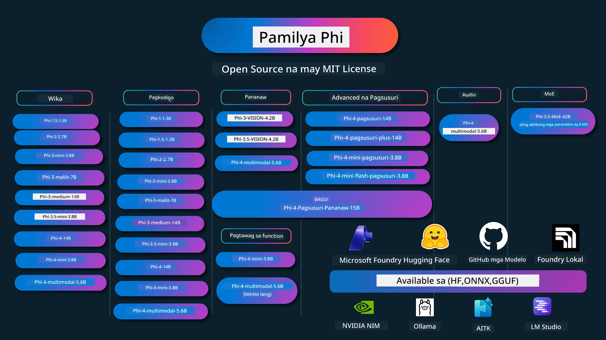

# Phi Cookbook: Mga Hands-On na Halimbawa gamit ang mga Phi Models ng Microsoft

[](https://codespaces.new/microsoft/phicookbook)
[](https://vscode.dev/redirect?url=vscode://ms-vscode-remote.remote-containers/cloneInVolume?url=https://github.com/microsoft/phicookbook)

[](https://GitHub.com/microsoft/phicookbook/graphs/contributors/?WT.mc_id=aiml-137032-kinfeylo)
[](https://GitHub.com/microsoft/phicookbook/issues/?WT.mc_id=aiml-137032-kinfeylo)
[](https://GitHub.com/microsoft/phicookbook/pulls/?WT.mc_id=aiml-137032-kinfeylo)
[](http://makeapullrequest.com?WT.mc_id=aiml-137032-kinfeylo)

[](https://GitHub.com/microsoft/phicookbook/watchers/?WT.mc_id=aiml-137032-kinfeylo)
[](https://GitHub.com/microsoft/phicookbook/network/?WT.mc_id=aiml-137032-kinfeylo)
[](https://GitHub.com/microsoft/phicookbook/stargazers/?WT.mc_id=aiml-137032-kinfeylo)

[](https://discord.com/invite/ByRwuEEgH4)

Ang Phi ay isang serye ng bukas na pinagmulan na mga AI modelong binuo ng Microsoft.

Ang Phi ay kasalukuyang ang pinaka-makapangyarihan at cost-effective na maliit na language model (SLM), na may napakahusay na mga benchmark sa multi-wika, pag-iisip, text/chat generation, coding, mga larawan, audio at iba pang mga sitwasyon.

Maaari mong i-deploy ang Phi sa cloud o sa mga edge device, at madali kang makakagawa ng mga generative AI application na may limitadong computing power.

Sundin ang mga hakbang na ito upang makapagsimula gamit ang mga resource na ito :
1. **I-fork ang Repository**: Pindutin ang [](https://GitHub.com/microsoft/phicookbook/network/?WT.mc_id=aiml-137032-kinfeylo)
2. **I-clone ang Repository**: `git clone https://github.com/microsoft/PhiCookBook.git`
3. [**Sumali sa Microsoft AI Discord Community at makipagkita sa mga eksperto at kapwa mga developer**](https://discord.com/invite/ByRwuEEgH4?WT.mc_id=aiml-137032-kinfeylo)



### 🌐 Suporta sa Maramihang Wika

#### Sinusuportahan sa pamamagitan ng GitHub Action (Automated at Palaging Napapanahon)

<!-- CO-OP TRANSLATOR LANGUAGES TABLE START -->
[Arabic](../ar/README.md) | [Bengali](../bn/README.md) | [Bulgarian](../bg/README.md) | [Burmese (Myanmar)](../my/README.md) | [Chinese (Simplified)](../zh-CN/README.md) | [Chinese (Traditional, Hong Kong)](../zh-HK/README.md) | [Chinese (Traditional, Macau)](../zh-MO/README.md) | [Chinese (Traditional, Taiwan)](../zh-TW/README.md) | [Croatian](../hr/README.md) | [Czech](../cs/README.md) | [Danish](../da/README.md) | [Dutch](../nl/README.md) | [Estonian](../et/README.md) | [Finnish](../fi/README.md) | [French](../fr/README.md) | [German](../de/README.md) | [Greek](../el/README.md) | [Hebrew](../he/README.md) | [Hindi](../hi/README.md) | [Hungarian](../hu/README.md) | [Indonesian](../id/README.md) | [Italian](../it/README.md) | [Japanese](../ja/README.md) | [Kannada](../kn/README.md) | [Khmer](../km/README.md) | [Korean](../ko/README.md) | [Lithuanian](../lt/README.md) | [Malay](../ms/README.md) | [Malayalam](../ml/README.md) | [Marathi](../mr/README.md) | [Nepali](../ne/README.md) | [Nigerian Pidgin](../pcm/README.md) | [Norwegian](../no/README.md) | [Persian (Farsi)](../fa/README.md) | [Polish](../pl/README.md) | [Portuguese (Brazil)](../pt-BR/README.md) | [Portuguese (Portugal)](../pt-PT/README.md) | [Punjabi (Gurmukhi)](../pa/README.md) | [Romanian](../ro/README.md) | [Russian](../ru/README.md) | [Serbian (Cyrillic)](../sr/README.md) | [Slovak](../sk/README.md) | [Slovenian](../sl/README.md) | [Spanish](../es/README.md) | [Swahili](../sw/README.md) | [Swedish](../sv/README.md) | [Tagalog (Filipino)](./README.md) | [Tamil](../ta/README.md) | [Telugu](../te/README.md) | [Thai](../th/README.md) | [Turkish](../tr/README.md) | [Ukrainian](../uk/README.md) | [Urdu](../ur/README.md) | [Vietnamese](../vi/README.md)

> **Mas gusto mo bang Mag-clone nang Lokal?**
>
> Ang repositoryong ito ay may higit sa 50 na pagsasalin ng wika na malaki ang pinapataas sa laki ng i-download. Upang mag-clone nang walang mga pagsasalin, gamitin ang sparse checkout:
>
> **Bash / macOS / Linux:**
> ```bash
> git clone --filter=blob:none --sparse https://github.com/microsoft/PhiCookBook.git
> cd PhiCookBook
> git sparse-checkout set --no-cone '/*' '!translations' '!translated_images'
> ```
>
> **CMD (Windows):**
> ```cmd
> git clone --filter=blob:none --sparse https://github.com/microsoft/PhiCookBook.git
> cd PhiCookBook
> git sparse-checkout set --no-cone "/*" "!translations" "!translated_images"
> ```
>
> Ito ay magbibigay sa iyo ng lahat ng kailangan mo upang makumpleto ang kurso nang mas mabilis ang pag-download.
<!-- CO-OP TRANSLATOR LANGUAGES TABLE END -->

## Talaan ng Nilalaman

- Panimula
  - [Maligayang pagdating sa Pamilyang Phi](./md/01.Introduction/01/01.PhiFamily.md)
  - [Pagsasaayos ng iyong kapaligiran](./md/01.Introduction/01/01.EnvironmentSetup.md)
  - [Pag-unawa sa mga Pangunahing Teknolohiya](./md/01.Introduction/01/01.Understandingtech.md)
  - [AI Kaligtasan para sa mga Phi Models](./md/01.Introduction/01/01.AISafety.md)
  - [Suporta ng Hardware ng Phi](./md/01.Introduction/01/01.Hardwaresupport.md)
  - [Phi Models at Pagkakaroon sa iba't ibang platform](./md/01.Introduction/01/01.Edgeandcloud.md)
  - [Paggamit ng Guidance-ai at Phi](./md/01.Introduction/01/01.Guidance.md)
  - [GitHub Marketplace Models](https://github.com/marketplace/models)
  - [Azure AI Model Catalog](https://ai.azure.com)

- Pagsusuri ng Phi sa iba't ibang kapaligiran
    -  [Hugging face](./md/01.Introduction/02/01.HF.md)
    -  [GitHub Models](./md/01.Introduction/02/02.GitHubModel.md)
    -  [Microsoft Foundry Model Catalog](./md/01.Introduction/02/03.AzureAIFoundry.md)
    -  [Ollama](./md/01.Introduction/02/04.Ollama.md)
    -  [AI Toolkit VSCode (AITK)](./md/01.Introduction/02/05.AITK.md)
    -  [NVIDIA NIM](./md/01.Introduction/02/06.NVIDIA.md)
    -  [Foundry Local](./md/01.Introduction/02/07.FoundryLocal.md)

- Pagsusuri ng Pamilyang Phi
    - [Pagsusuri ng Phi sa iOS](./md/01.Introduction/03/iOS_Inference.md)
    - [Pagsusuri ng Phi sa Android](./md/01.Introduction/03/Android_Inference.md)
    - [Pagsusuri ng Phi sa Jetson](./md/01.Introduction/03/Jetson_Inference.md)
    - [Pagsusuri ng Phi sa AI PC](./md/01.Introduction/03/AIPC_Inference.md)
    - [Pagsusuri ng Phi gamit ang Apple MLX Framework](./md/01.Introduction/03/MLX_Inference.md)
    - [Pagsusuri ng Phi sa Lokal na Server](./md/01.Introduction/03/Local_Server_Inference.md)
    - [Pagsusuri ng Phi sa Remote Server gamit ang AI Toolkit](./md/01.Introduction/03/Remote_Interence.md)
    - [Pagsusuri ng Phi gamit ang Rust](./md/01.Introduction/03/Rust_Inference.md)
    - [Pagsusuri ng Phi--Vision sa Lokal](./md/01.Introduction/03/Vision_Inference.md)
    - [Pagsusuri ng Phi gamit ang Kaito AKS, Azure Containers (opisyal na suporta)](./md/01.Introduction/03/Kaito_Inference.md)
-  [Pag-quantify sa Pamilyang Phi](./md/01.Introduction/04/QuantifyingPhi.md)
    - [Pag-quantize ng Phi-3.5 / 4 gamit ang llama.cpp](./md/01.Introduction/04/UsingLlamacppQuantifyingPhi.md)
    - [Pag-quantize ng Phi-3.5 / 4 gamit ang Generative AI extensions para sa onnxruntime](./md/01.Introduction/04/UsingORTGenAIQuantifyingPhi.md)
    - [Pag-quantize ng Phi-3.5 / 4 gamit ang Intel OpenVINO](./md/01.Introduction/04/UsingIntelOpenVINOQuantifyingPhi.md)
    - [Pag-quantize ng Phi-3.5 / 4 gamit ang Apple MLX Framework](./md/01.Introduction/04/UsingAppleMLXQuantifyingPhi.md)

-  Pagsusuri ng Phi
    - [Responsible AI](./md/01.Introduction/05/ResponsibleAI.md)
    - [Microsoft Foundry para sa Pagsusuri](./md/01.Introduction/05/AIFoundry.md)
    - [Paggamit ng Promptflow para sa Pagsusuri](./md/01.Introduction/05/Promptflow.md)
 
- RAG gamit ang Azure AI Search
    - [Paano gamitin ang Phi-4-mini at Phi-4-multimodal (RAG) gamit ang Azure AI Search](https://github.com/microsoft/PhiCookBook/blob/main/code/06.E2E/E2E_Phi-4-RAG-Azure-AI-Search.ipynb)

- Mga halimbawa ng pagbuo ng Phi application
  - Mga Text at Chat Application
    - Phi-4 Samples 
      - [📓] [Makipag-chat gamit ang Phi-4-mini ONNX Model](./md/02.Application/01.TextAndChat/Phi4/ChatWithPhi4ONNX/README.md)
      - [Makipag-chat gamit ang Phi-4 lokal na ONNX Model .NET](../../md/04.HOL/dotnet/src/LabsPhi4-Chat-01OnnxRuntime)
      - [Chat .NET Console App gamit ang Phi-4 ONNX gamit ang Semantic Kernel](../../md/04.HOL/dotnet/src/LabsPhi4-Chat-02SK)
    - Phi-3 / 3.5 Samples
      - [Lokal na Chatbot sa browser gamit ang Phi3, ONNX Runtime Web at WebGPU](https://github.com/microsoft/onnxruntime-inference-examples/tree/main/js/chat)
      - [OpenVino Chat](./md/02.Application/01.TextAndChat/Phi3/E2E_OpenVino_Chat.md)
      - [Multi Model - Interactive Phi-3-mini and OpenAI Whisper](./md/02.Application/01.TextAndChat/Phi3/E2E_Phi-3-mini_with_whisper.md)
      - [MLFlow - Paggawa ng wrapper at paggamit ng Phi-3 kasama ang MLFlow](./md//02.Application/01.TextAndChat/Phi3/E2E_Phi-3-MLflow.md)
      - [Pag-optimize ng Modelo - Paano i-optimize ang Phi-3-min na modelo para sa ONNX Runtime Web gamit ang Olive](https://github.com/microsoft/Olive/tree/main/examples/phi3)
      - [WinUI3 App gamit ang Phi-3 mini-4k-instruct-onnx](https://github.com/microsoft/Phi3-Chat-WinUI3-Sample/)
      -[WinUI3 Multi Model AI Powered Notes App Sample](https://github.com/microsoft/ai-powered-notes-winui3-sample)
      - [Fine-tune at Integrate ang custom Phi-3 models gamit ang Prompt flow](./md/02.Application/01.TextAndChat/Phi3/E2E_Phi-3-FineTuning_PromptFlow_Integration.md)
      - [Fine-tune at Integrate ang custom Phi-3 models gamit ang Prompt flow sa Microsoft Foundry](./md/02.Application/01.TextAndChat/Phi3/E2E_Phi-3-FineTuning_PromptFlow_Integration_AIFoundry.md)
      - [Suriin ang Fine-tuned na Phi-3 / Phi-3.5 Model sa Microsoft Foundry na nakatuon sa Mga Prinsipyo ng Responsable AI ng Microsoft](./md/02.Application/01.TextAndChat/Phi3/E2E_Phi-3-Evaluation_AIFoundry.md)
      - [📓] [Phi-3.5-mini-instruct na halimbawa ng prediksyon ng wika (Tsino/Ingles)](./md/02.Application/01.TextAndChat/Phi3/phi3-instruct-demo.ipynb)
      - [Phi-3.5-Instruct WebGPU RAG Chatbot](./md/02.Application/01.TextAndChat/Phi3/WebGPUWithPhi35Readme.md)
      - [Paggamit ng Windows GPU upang gumawa ng Prompt flow na solusyon gamit ang Phi-3.5-Instruct ONNX](./md/02.Application/01.TextAndChat/Phi3/UsingPromptFlowWithONNX.md)
      - [Paggamit ng Microsoft Phi-3.5 tflite para gumawa ng Android app](./md/02.Application/01.TextAndChat/Phi3/UsingPhi35TFLiteCreateAndroidApp.md)
      - [Q&A .NET Halimbawa gamit ang local ONNX Phi-3 model gamit ang Microsoft.ML.OnnxRuntime](../../md/04.HOL/dotnet/src/LabsPhi301)
      - [Console chat .NET app gamit ang Semantic Kernel at Phi-3](../../md/04.HOL/dotnet/src/LabsPhi302)

  - Azure AI Inference SDK Code Based Samples 
    - Phi-4 Samples 
      - [📓] [Gumawa ng project code gamit ang Phi-4-multimodal](./md/02.Application/02.Code/Phi4/GenProjectCode/README.md)
    - Phi-3 / 3.5 Samples
      - [Bumuo ng sarili mong Visual Studio Code GitHub Copilot Chat gamit ang Microsoft Phi-3 Family](./md/02.Application/02.Code/Phi3/VSCodeExt/README.md)
      - [Gumawa ng sarili mong Visual Studio Code Chat Copilot Agent gamit ang Phi-3.5 mula sa mga GitHub Models](/md/02.Application/02.Code/Phi3/CreateVSCodeChatAgentWithGitHubModels.md)

  - Advanced Reasoning Samples
    - Phi-4 Samples 
      - [📓] [Phi-4-mini-reasoning o Phi-4-reasoning Samples](./md/02.Application/03.AdvancedReasoning/Phi4/AdvancedResoningPhi4mini/README.md)
      - [📓] [Fine-tuning ng Phi-4-mini-reasoning gamit ang Microsoft Olive](./md/02.Application/03.AdvancedReasoning/Phi4/AdvancedResoningPhi4mini/olive_ft_phi_4_reasoning_with_medicaldata.ipynb)
      - [📓] [Fine-tuning ng Phi-4-mini-reasoning gamit ang Apple MLX](./md/02.Application/03.AdvancedReasoning/Phi4/AdvancedResoningPhi4mini/mlx_ft_phi_4_reasoning_with_medicaldata.ipynb)
      - [📓] [Phi-4-mini-reasoning gamit ang GitHub Models](./md/02.Application/02.Code/Phi4r/github_models_inference.ipynb)
      - [📓] [Phi-4-mini-reasoning gamit ang Microsoft Foundry Models](./md/02.Application/02.Code/Phi4r/azure_models_inference.ipynb)
  - Demos
      - [Phi-4-mini demos na naka-host sa Hugging Face Spaces](https://huggingface.co/spaces/microsoft/phi-4-mini?WT.mc_id=aiml-137032-kinfeylo)
      - [Phi-4-multimodal demos na naka-host sa Hugging Face Spaces](https://huggingface.co/spaces/microsoft/phi-4-multimodal?WT.mc_id=aiml-137032-kinfeylo)
  - Vision Samples
    - Phi-4 Samples 
      - [📓] [Gamitin ang Phi-4-multimodal upang basahin ang mga larawan at gumawa ng code](./md/02.Application/04.Vision/Phi4/CreateFrontend/README.md) 
    - Phi-3 / 3.5 Samples
      -  [📓][Phi-3-vision-Larawan teksto to teksto](./md/02.Application/04.Vision/Phi3/E2E_Phi-3-vision-image-text-to-text-online-endpoint.ipynb)
      - [Phi-3-vision-ONNX](https://onnxruntime.ai/docs/genai/tutorials/phi3-v.html)
      - [📓][Phi-3-vision CLIP Embedding](./md/02.Application/04.Vision/Phi3/E2E_Phi-3-vision-image-text-to-text-online-endpoint.ipynb)
      - [DEMO: Phi-3 Recycling](https://github.com/jennifermarsman/PhiRecycling/)
      - [Phi-3-vision - Visual language assistant - gamit ang Phi3-Vision at OpenVINO](https://docs.openvino.ai/nightly/notebooks/phi-3-vision-with-output.html)
      - [Phi-3 Vision Nvidia NIM](./md/02.Application/04.Vision/Phi3/E2E_Nvidia_NIM_Vision.md)
      - [Phi-3 Vision OpenVino](./md/02.Application/04.Vision/Phi3/E2E_OpenVino_Phi3Vision.md)
      - [📓][Phi-3.5 Vision multi-frame o multi-image na halimbawa](./md/02.Application/04.Vision/Phi3/phi3-vision-demo.ipynb)
      - [Phi-3 Vision Lokal na ONNX Model gamit ang Microsoft.ML.OnnxRuntime .NET](../../md/04.HOL/dotnet/src/LabsPhi303)
      - [Menu based Phi-3 Vision Lokal na ONNX Model gamit ang Microsoft.ML.OnnxRuntime .NET](../../md/04.HOL/dotnet/src/LabsPhi304)

  - Reasoning-Vision Samples
    - Phi-4-Reasoning-Vision-15B 
      - [📓] [Paggamit ng Phi-4-Reasoning-Vision-15B upang makita ang jaywalking](./md/02.Application/10.ReasoningVision/Phi_4_reasoning_vision_15b_Jaywalking.ipynb)
      - [📓] [Paggamit ng Phi-4-Reasoning-Vision-15B para sa math](./md/02.Application/10.ReasoningVision/Phi_4_reasoning_vision_15b_Math.ipynb)
      - [📓] [Paggamit ng Phi-4-Reasoning-Vision-15B upang makita ang UI](./md/02.Application/10.ReasoningVision/Phi_4_reasoning_vision_15b_ui.ipynb)

  - Math Samples
    -  Phi-4-Mini-Flash-Reasoning-Instruct Samples  [Math Demo gamit ang Phi-4-Mini-Flash-Reasoning-Instruct](./md/02.Application/09.Math/MathDemo.ipynb)

  - Audio Samples
    - Phi-4 Samples 
      - [📓] [Pagkuhà ng audio transcripts gamit ang Phi-4-multimodal](./md/02.Application/05.Audio/Phi4/Transciption/README.md)
      - [📓] [Phi-4-multimodal Audio Sample](./md/02.Application/05.Audio/Phi4/Siri/demo.ipynb)
      - [📓] [Phi-4-multimodal Speech Translation Sample](./md/02.Application/05.Audio/Phi4/Translate/demo.ipynb)
      - [.NET console application gamit ang Phi-4-multimodal Audio para suriin ang isang audio file at gumawa ng transcript](../../md/04.HOL/dotnet/src/LabsPhi4-MultiModal-02Audio)

  - MOE Samples
    - Phi-3 / 3.5 Samples
      - [📓] [Phi-3.5 Mixture of Experts Models (MoEs) Social Media Sample](./md/02.Application/06.MoE/Phi3/phi3_moe_demo.ipynb)
      - [📓] [Paggawa ng Retrieval-Augmented Generation (RAG) Pipeline gamit ang NVIDIA NIM Phi-3 MOE, Azure AI Search, at LlamaIndex](./md/02.Application/06.MoE/Phi3/azure-ai-search-nvidia-rag.ipynb)
      - 
  - Function Calling Samples
    - Phi-4 Samples 🆕
      -  [📓] [Paggamit ng Function Calling kasama ang Phi-4-mini](./md/02.Application/07.FunctionCalling/Phi4/FunctionCallingBasic/README.md)
      -  [📓] [Paggamit ng Function Calling upang gumawa ng multi-agents gamit ang Phi-4-mini](./md/02.Application/07.FunctionCalling/Phi4/Multiagents/Phi_4_mini_multiagent.ipynb)
      -  [📓] [Paggamit ng Function Calling kasama ang Ollama](./md/02.Application/07.FunctionCalling/Phi4/Ollama/ollama_functioncalling.ipynb)
      -  [📓] [Paggamit ng Function Calling kasama ang ONNX](./md/02.Application/07.FunctionCalling/Phi4/ONNX/onnx_parallel_functioncalling.ipynb)
  - Multimodal Mixing Samples
    - Phi-4 Samples 🆕
      -  [📓] [Paggamit ng Phi-4-multimodal bilang isang Technology journalist](./md/02.Application/08.Multimodel/Phi4/TechJournalist/phi_4_mm_audio_text_publish_news.ipynb)
      - [.NET console application gamit ang Phi-4-multimodal para suriin ang mga larawan](../../md/04.HOL/dotnet/src/LabsPhi4-MultiModal-01Images)

- Fine-tuning Phi Samples
  - [Mga Scenario ng Fine-tuning](./md/03.FineTuning/FineTuning_Scenarios.md)
  - [Fine-tuning vs RAG](./md/03.FineTuning/FineTuning_vs_RAG.md)
  - [Fine-tuning Hayaan ang Phi-3 maging isang eksperto sa industriya](./md/03.FineTuning/LetPhi3gotoIndustriy.md)
  - [Fine-tuning Phi-3 gamit ang AI Toolkit para sa VS Code](./md/03.FineTuning/Finetuning_VSCodeaitoolkit.md)
  - [Fine-tuning Phi-3 gamit ang Azure Machine Learning Service](./md/03.FineTuning/Introduce_AzureML.md)
  - [Fine-tuning Phi-3 gamit ang Lora](./md/03.FineTuning/FineTuning_Lora.md)
  - [Fine-tuning Phi-3 gamit ang QLora](./md/03.FineTuning/FineTuning_Qlora.md)
  - [Fine-tuning Phi-3 gamit ang Microsoft Foundry](./md/03.FineTuning/FineTuning_AIFoundry.md)
  - [Fine-tuning Phi-3 gamit ang Azure ML CLI/SDK](./md/03.FineTuning/FineTuning_MLSDK.md)
  - [Fine-tuning gamit ang Microsoft Olive](./md/03.FineTuning/FineTuning_MicrosoftOlive.md)
  - [Fine-tuning gamit ang Microsoft Olive Hands-On Lab](./md/03.FineTuning/olive-lab/readme.md)
  - [Fine-tuning Phi-3-vision gamit ang Weights and Bias](./md/03.FineTuning/FineTuning_Phi-3-visionWandB.md)
  - [Fine-tuning Phi-3 gamit ang Apple MLX Framework](./md/03.FineTuning/FineTuning_MLX.md)
  - [Fine-tuning Phi-3-vision (opisyal na suporta)](./md/03.FineTuning/FineTuning_Vision.md)
  - [Fine-Tuning Phi-3 gamit ang Kaito AKS, Azure Containers (opisyal na Suporta)](./md/03.FineTuning/FineTuning_Kaito.md)
  - [Fine-Tuning Phi-3 at 3.5 Vision](https://github.com/2U1/Phi3-Vision-Finetune)

- Hands on Lab
  - [Pagsusuri ng mga pinaka-advanced na modelo: LLMs, SLMs, lokal na pag-unlad at iba pa](https://github.com/microsoft/aitour-exploring-cutting-edge-models)
  - [Pagbubukas ng Potensyal ng NLP: Fine-Tuning gamit ang Microsoft Olive](https://github.com/azure/Ignite_FineTuning_workshop)

- Mga Papel sa Pananaliksik at Publikasyon ng Akademya
  - [Textbooks Are All You Need II: phi-1.5 technical report](https://arxiv.org/abs/2309.05463)
  - [Phi-3 Technical Report: Isang Mataas na Kakayahang Modelong Pangwika nang Lokal sa Iyong Telepono](https://arxiv.org/abs/2404.14219)
  - [Phi-4 Technical Report](https://arxiv.org/abs/2412.08905)
  - [Phi-4-Mini Technical Report: Compact ngunit Makapangyarihang Multimodal Language Models sa pamamagitan ng Mixture-of-LoRAs](https://arxiv.org/abs/2503.01743)
  - [Pag-optimize ng Maliliit na Modelo ng Wika para sa In-Vehicle Function-Calling](https://arxiv.org/abs/2501.02342)
  - [(WhyPHI) Fine-Tuning PHI-3 para sa Multiple-Choice Question Answering: Metodolohiya, Mga Resulta, at Mga Hamon](https://arxiv.org/abs/2501.01588)
  - [Phi-4-reasoning Technical Report](https://www.microsoft.com/en-us/research/wp-content/uploads/2025/04/phi_4_reasoning.pdf)
  - [Phi-4-mini-reasoning Technical Report](https://huggingface.co/microsoft/Phi-4-mini-reasoning/blob/main/Phi-4-Mini-Reasoning.pdf)

## Paggamit ng Mga Modelo ng Phi

### Phi sa Microsoft Foundry

Matutunan mo kung paano gamitin ang Microsoft Phi at kung paano bumuo ng mga solusyong E2E sa iba't ibang hardware devices mo. Para maranasan ang Phi, simulan sa paglalaro gamit ang mga modelo at i-customize ang Phi para sa iyong mga senaryo gamit ang [Microsoft Foundry Azure AI Model Catalog](https://aka.ms/phi3-azure-ai). Maaari kang matuto nang higit pa sa Pagsisimula gamit ang [Microsoft Foundry](/md/02.QuickStart/AzureAIFoundry_QuickStart.md).

**Playground**
Bawat modelo ay may dedikadong playground para subukan ang modelo sa [Azure AI Playground](https://aka.ms/try-phi3).

### Phi sa GitHub Models

Matutunan mo kung paano gamitin ang Microsoft Phi at kung paano bumuo ng mga solusyong E2E sa iba't ibang hardware devices mo. Para maranasan ang Phi, simulan sa paglalaro gamit ang modelo at i-customize ang Phi para sa iyong mga senaryo gamit ang [GitHub Model Catalog](https://github.com/marketplace/models?WT.mc_id=aiml-137032-kinfeylo). Maaari kang matuto nang higit pa sa Pagsisimula gamit ang [GitHub Model Catalog](/md/02.QuickStart/GitHubModel_QuickStart.md).

**Playground**
Bawat modelo ay may dedikadong [playground para subukan ang modelo](/md/02.QuickStart/GitHubModel_QuickStart.md).

### Phi sa Hugging Face

Maaari mo ring makita ang modelo sa [Hugging Face](https://huggingface.co/microsoft)

**Playground**
[Hugging Chat playground](https://huggingface.co/chat/models/microsoft/Phi-3-mini-4k-instruct)

 ## 🎒 Iba Pang Mga Kurso

Ang aming koponan ay gumagawa rin ng iba pang mga kurso! Tingnan ang:

<!-- CO-OP TRANSLATOR OTHER COURSES START -->
### LangChain
[](https://aka.ms/langchain4j-for-beginners)
[](https://aka.ms/langchainjs-for-beginners?WT.mc_id=m365-94501-dwahlin)
[](https://github.com/microsoft/langchain-for-beginners?WT.mc_id=m365-94501-dwahlin)
---

### Azure / Edge / MCP / Agents
[](https://github.com/microsoft/AZD-for-beginners?WT.mc_id=academic-105485-koreyst)
[](https://github.com/microsoft/edgeai-for-beginners?WT.mc_id=academic-105485-koreyst)
[](https://github.com/microsoft/mcp-for-beginners?WT.mc_id=academic-105485-koreyst)
[](https://github.com/microsoft/ai-agents-for-beginners?WT.mc_id=academic-105485-koreyst)

---
 
### Generative AI Series
[](https://github.com/microsoft/generative-ai-for-beginners?WT.mc_id=academic-105485-koreyst)
[-9333EA?style=for-the-badge&labelColor=E5E7EB&color=9333EA)](https://github.com/microsoft/Generative-AI-for-beginners-dotnet?WT.mc_id=academic-105485-koreyst)
[-C084FC?style=for-the-badge&labelColor=E5E7EB&color=C084FC)](https://github.com/microsoft/generative-ai-for-beginners-java?WT.mc_id=academic-105485-koreyst)
[-E879F9?style=for-the-badge&labelColor=E5E7EB&color=E879F9)](https://github.com/microsoft/generative-ai-with-javascript?WT.mc_id=academic-105485-koreyst)

---
 
### Pangunahing Pagkatuto
[](https://aka.ms/ml-beginners?WT.mc_id=academic-105485-koreyst)
[](https://aka.ms/datascience-beginners?WT.mc_id=academic-105485-koreyst)
[](https://aka.ms/ai-beginners?WT.mc_id=academic-105485-koreyst)
[](https://github.com/microsoft/Security-101?WT.mc_id=academic-96948-sayoung)
[](https://aka.ms/webdev-beginners?WT.mc_id=academic-105485-koreyst)
[](https://aka.ms/iot-beginners?WT.mc_id=academic-105485-koreyst)
[](https://github.com/microsoft/xr-development-for-beginners?WT.mc_id=academic-105485-koreyst)

---
 
### Copilot Series
[](https://aka.ms/GitHubCopilotAI?WT.mc_id=academic-105485-koreyst)
[](https://github.com/microsoft/mastering-github-copilot-for-dotnet-csharp-developers?WT.mc_id=academic-105485-koreyst)
[](https://github.com/microsoft/CopilotAdventures?WT.mc_id=academic-105485-koreyst)
<!-- CO-OP TRANSLATOR OTHER COURSES END -->

## Responsable AI

Ang Microsoft ay nakatuon sa pagtulong sa aming mga customer na gamitin ang aming mga produktong AI nang responsable, ibahagi ang aming mga natutunan, at bumuo ng mga partnership na nakabatay sa pagtitiwala sa pamamagitan ng mga tool tulad ng Transparency Notes at Impact Assessments. Marami sa mga mapagkukunang ito ay makikita sa [https://aka.ms/RAI](https://aka.ms/RAI).
Ang paraan ng Microsoft sa responsable AI ay nakabase sa aming mga prinsipyong AI ng patas, maaasahan at ligtas, privacy at seguridad, pagiging inklusibo, transparency, at pananagutan.

Ang mga malalaking modelo ng natural na wika, imahe, at pagsasalita - tulad ng mga ginamit sa sample na ito - ay maaaring kumilos sa mga paraan na hindi patas, hindi maaasahan, o nakakasakit, na maaaring magdulot ng pinsala. Mangyaring kumonsulta sa [Azure OpenAI service Transparency note](https://learn.microsoft.com/legal/cognitive-services/openai/transparency-note?tabs=text) upang malaman ang mga panganib at limitasyon.
Ang inirerekomendang paraan upang mabawasan ang mga panganib na ito ay ang magsama ng isang sistema ng kaligtasan sa iyong arkitektura na maaaring makadetect at makapigil ng mapanganib na pag-uugali. Nagbibigay ang [Azure AI Content Safety](https://learn.microsoft.com/azure/ai-services/content-safety/overview) ng isang independiyenteng layer ng proteksyon, na kayang matukoy ang mapanganib na nilalaman na ginawa ng user at AI sa mga aplikasyon at serbisyo. Kasama sa Azure AI Content Safety ang mga text at image API na nagpapahintulot sa iyo na matukoy ang mga materyal na mapanganib. Sa loob ng Microsoft Foundry, ang serbisyo ng Content Safety ay nagbibigay-daan sa iyo upang tingnan, tuklasin at subukan ang sample code para sa pagtuklas ng mapanganib na nilalaman sa iba't ibang modalidad. Ang sumusunod na [quickstart documentation](https://learn.microsoft.com/azure/ai-services/content-safety/quickstart-text?tabs=visual-studio%2Clinux&pivots=programming-language-rest) ay gagabay sa iyo sa paggawa ng mga request sa serbisyo.

Isa pang aspeto na dapat isaalang-alang ay ang kabuuang pagganap ng aplikasyon. Sa mga multi-modal at multi-model na aplikasyon, itinuturing namin ang pagganap bilang ang sistema ay gumaganap ayon sa inaasahan mo at ng iyong mga user, kabilang na ang hindi paggawa ng mapanganib na outputs. Mahalaga na suriin ang pagganap ng iyong pangkalahatang aplikasyon gamit ang [Performance and Quality and Risk and Safety evaluators](https://learn.microsoft.com/azure/ai-studio/concepts/evaluation-metrics-built-in). Mayroon ka ring kakayahan na lumikha at magsuri gamit ang [custom evaluators](https://learn.microsoft.com/azure/ai-studio/how-to/develop/evaluate-sdk#custom-evaluators).

Maaari mong suriin ang iyong AI aplikasyon sa iyong development environment gamit ang [Azure AI Evaluation SDK](https://microsoft.github.io/promptflow/index.html). Kapag mayroong test dataset o target, ang mga generative AI application generation mo ay nasusukat nang quantitatively gamit ang built-in evaluators o custom evaluators na iyong pinili. Upang makapagsimula gamit ang azure ai evaluation sdk para suriin ang iyong sistema, maaari mong sundan ang [quickstart guide](https://learn.microsoft.com/azure/ai-studio/how-to/develop/flow-evaluate-sdk). Kapag naisagawa mo na ang evaluation run, maaari mo nang [makita ang resulta sa Microsoft Foundry](https://learn.microsoft.com/azure/ai-studio/how-to/evaluate-flow-results). 

## Mga Trademark

Maaaring naglalaman ang proyektong ito ng mga trademark o logo para sa mga proyekto, produkto, o serbisyo. Ang awtorisadong paggamit ng mga trademark o logo ng Microsoft ay sakop at dapat sumunod sa [Microsoft's Trademark & Brand Guidelines](https://www.microsoft.com/legal/intellectualproperty/trademarks/usage/general).
Ang paggamit ng mga trademark o logo ng Microsoft sa mga binagong bersyon ng proyektong ito ay hindi dapat magdulot ng kalituhan o magpahiwatig ng sponsorship ng Microsoft. Anumang paggamit ng trademark o logo ng third-party ay alinsunod sa mga patakaran ng third-party na iyon.

## Paghingi ng Tulong

Kung ikaw ay nahihirapan o may mga tanong tungkol sa paggawa ng mga AI na apps, sumali sa:

[](https://aka.ms/foundry/discord)

Kung mayroon kang feedback sa produkto o mga error habang nagde-develop, bisitahin ang:

[](https://aka.ms/foundry/forum)

---

<!-- CO-OP TRANSLATOR DISCLAIMER START -->
**Disclaimer**:  
Ang dokumentong ito ay isinalin gamit ang AI translation service na [Co-op Translator](https://github.com/Azure/co-op-translator). Bagamat nagsusumikap kami para sa katumpakan, pakiusap tandaan na ang mga awtomatikong pagsasalin ay maaaring maglaman ng mga pagkakamali o di-tumpak na impormasyon. Ang orihinal na dokumento sa orihinal nitong wika ang dapat ituring na pangunahing sanggunian. Para sa mahahalagang impormasyon, inirerekomenda ang propesyonal na pagsasaling-tao. Hindi kami mananagot sa anumang hindi pagkakaunawaan o maling interpretasyon na nagmumula sa paggamit ng pagsasaling ito.
<!-- CO-OP TRANSLATOR DISCLAIMER END -->