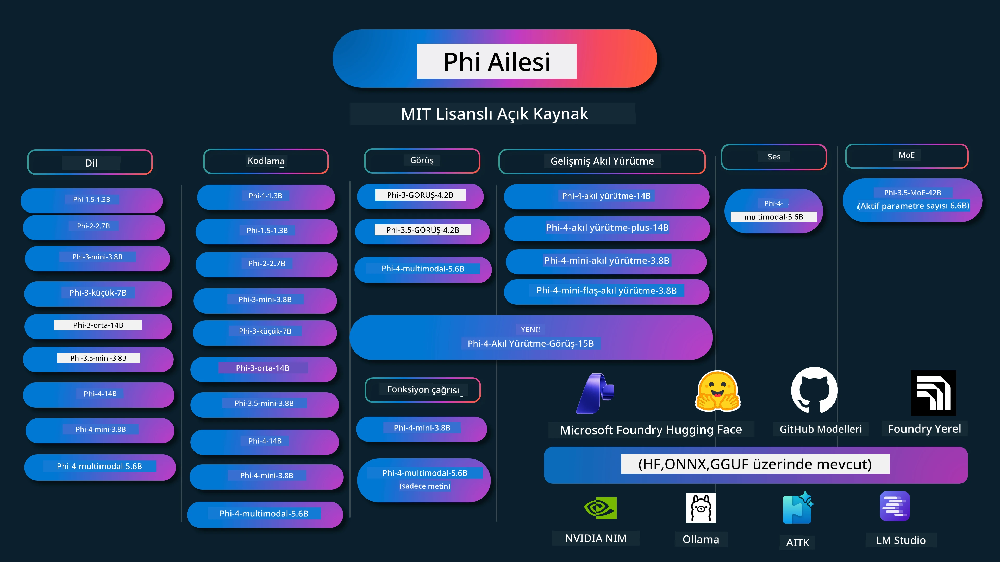

# Phi Yemek Kitabı: Microsoft'un Phi Modelleri ile Uygulamalı Örnekler

[](https://codespaces.new/microsoft/phicookbook)
[](https://vscode.dev/redirect?url=vscode://ms-vscode-remote.remote-containers/cloneInVolume?url=https://github.com/microsoft/phicookbook)

[](https://GitHub.com/microsoft/phicookbook/graphs/contributors/?WT.mc_id=aiml-137032-kinfeylo)
[](https://GitHub.com/microsoft/phicookbook/issues/?WT.mc_id=aiml-137032-kinfeylo)
[](https://GitHub.com/microsoft/phicookbook/pulls/?WT.mc_id=aiml-137032-kinfeylo)
[](http://makeapullrequest.com?WT.mc_id=aiml-137032-kinfeylo)

[](https://GitHub.com/microsoft/phicookbook/watchers/?WT.mc_id=aiml-137032-kinfeylo)
[](https://GitHub.com/microsoft/phicookbook/network/?WT.mc_id=aiml-137032-kinfeylo)
[](https://GitHub.com/microsoft/phicookbook/stargazers/?WT.mc_id=aiml-137032-kinfeylo)

[](https://discord.com/invite/ByRwuEEgH4)

Phi, Microsoft tarafından geliştirilen açık kaynaklı yapay zeka modelleri serisidir.

Phi şu anda çok dilli, muhakeme, metin/sohbet üretimi, kodlama, görüntüler, ses ve diğer senaryolarda çok iyi performans gösteren en güçlü ve maliyet etkili küçük dil modeli (SLM) olarak öne çıkmaktadır.

Phi'yi buluta veya uç cihazlara dağıtabilir ve sınırlı hesaplama gücüyle kolayca üretken yapay zeka uygulamaları geliştirebilirsiniz.

Bu kaynakları kullanmaya başlamak için şu adımları izleyin:
1. **Depoyu Çatalla**: Tıklayın [](https://GitHub.com/microsoft/phicookbook/network/?WT.mc_id=aiml-137032-kinfeylo)
2. **Depoyu Klonla**: `git clone https://github.com/microsoft/PhiCookBook.git`
3. [**Microsoft AI Discord Topluluğuna Katılın ve uzmanlar ile diğer geliştiricilerle tanışın**](https://discord.com/invite/ByRwuEEgH4?WT.mc_id=aiml-137032-kinfeylo)



### 🌐 Çok Dilli Destek

#### GitHub Action ile Desteklenmektedir (Otomatik ve Her Zaman Güncel)

<!-- CO-OP TRANSLATOR LANGUAGES TABLE START -->
[Arapça](../ar/README.md) | [Bengalce](../bn/README.md) | [Bulgarca](../bg/README.md) | [Burma (Myanmar)](../my/README.md) | [Çince (Basitleştirilmiş)](../zh-CN/README.md) | [Çince (Geleneksel, Hong Kong)](../zh-HK/README.md) | [Çince (Geleneksel, Makao)](../zh-MO/README.md) | [Çince (Geleneksel, Tayvan)](../zh-TW/README.md) | [Hırvatça](../hr/README.md) | [Çekçe](../cs/README.md) | [Danca](../da/README.md) | [Hollandaca](../nl/README.md) | [Estonca](../et/README.md) | [Fince](../fi/README.md) | [Fransızca](../fr/README.md) | [Almanca](../de/README.md) | [Yunanca](../el/README.md) | [İbranice](../he/README.md) | [Hintçe](../hi/README.md) | [Macarca](../hu/README.md) | [Endonezce](../id/README.md) | [İtalyanca](../it/README.md) | [Japonca](../ja/README.md) | [Kannada](../kn/README.md) | [Khmer](../km/README.md) | [Korece](../ko/README.md) | [Litvanca](../lt/README.md) | [Malayca](../ms/README.md) | [Malayalam](../ml/README.md) | [Marathi](../mr/README.md) | [Nepalce](../ne/README.md) | [Nijerya Pidgin](../pcm/README.md) | [Norveççe](../no/README.md) | [Farsça (Farsi)](../fa/README.md) | [Lehçe](../pl/README.md) | [Portekizce (Brezilya)](../pt-BR/README.md) | [Portekizce (Portekiz)](../pt-PT/README.md) | [Pencapça (Gurmukhi)](../pa/README.md) | [Rumence](../ro/README.md) | [Rusça](../ru/README.md) | [Sırpça (Kiril)](../sr/README.md) | [Slovakça](../sk/README.md) | [Slovence](../sl/README.md) | [İspanyolca](../es/README.md) | [Svahili](../sw/README.md) | [İsveççe](../sv/README.md) | [Tagalog (Filipinler)](../tl/README.md) | [Tamilce](../ta/README.md) | [Telugu](../te/README.md) | [Tayca](../th/README.md) | [Türkçe](./README.md) | [Ukraynaca](../uk/README.md) | [Urduca](../ur/README.md) | [Viyetnamca](../vi/README.md)

> **Yerel Klonlamayı mı Tercih Ediyorsunuz?**
>
> Bu depo 50'den fazla dil çevirisi içerir ve bu da indirme boyutunu önemli ölçüde artırır. Çeviriler olmadan klonlamak için sparse checkout kullanın:
>
> **Bash / macOS / Linux:**
> ```bash
> git clone --filter=blob:none --sparse https://github.com/microsoft/PhiCookBook.git
> cd PhiCookBook
> git sparse-checkout set --no-cone '/*' '!translations' '!translated_images'
> ```
>
> **CMD (Windows):**
> ```cmd
> git clone --filter=blob:none --sparse https://github.com/microsoft/PhiCookBook.git
> cd PhiCookBook
> git sparse-checkout set --no-cone "/*" "!translations" "!translated_images"
> ```
>
> Bu, kursu tamamlamak için ihtiyacınız olan her şeyi çok daha hızlı bir indirme ile sunar.
<!-- CO-OP TRANSLATOR LANGUAGES TABLE END -->

## İçindekiler

- Giriş
  - [Phi Ailesine Hoş Geldiniz](./md/01.Introduction/01/01.PhiFamily.md)
  - [Ortamınızı Kurma](./md/01.Introduction/01/01.EnvironmentSetup.md)
  - [Ana Teknolojileri Anlama](./md/01.Introduction/01/01.Understandingtech.md)
  - [Phi Modelleri için Yapay Zeka Güvenliği](./md/01.Introduction/01/01.AISafety.md)
  - [Phi Donanım Desteği](./md/01.Introduction/01/01.Hardwaresupport.md)
  - [Phi Modelleri ve Platformlar Arasındaki Kullanılabilirlik](./md/01.Introduction/01/01.Edgeandcloud.md)
  - [Guidance-ai ve Phi Kullanımı](./md/01.Introduction/01/01.Guidance.md)
  - [GitHub Marketplace Modelleri](https://github.com/marketplace/models)
  - [Azure AI Model Kataloğu](https://ai.azure.com)

- Farklı Ortamlarda Phi Çıkarımı
    -  [Hugging face](./md/01.Introduction/02/01.HF.md)
    -  [GitHub Modelleri](./md/01.Introduction/02/02.GitHubModel.md)
    -  [Microsoft Foundry Model Kataloğu](./md/01.Introduction/02/03.AzureAIFoundry.md)
    -  [Ollama](./md/01.Introduction/02/04.Ollama.md)
    -  [AI Toolkit VSCode (AITK)](./md/01.Introduction/02/05.AITK.md)
    -  [NVIDIA NIM](./md/01.Introduction/02/06.NVIDIA.md)
    -  [Foundry Yerel](./md/01.Introduction/02/07.FoundryLocal.md)

- Phi Ailesi Çıkarımı
    - [iOS'ta Phi Çıkarımı](./md/01.Introduction/03/iOS_Inference.md)
    - [Android'te Phi Çıkarımı](./md/01.Introduction/03/Android_Inference.md)
    - [Jetson'da Phi Çıkarımı](./md/01.Introduction/03/Jetson_Inference.md)
    - [AI PC'de Phi Çıkarımı](./md/01.Introduction/03/AIPC_Inference.md)
    - [Apple MLX Framework ile Phi Çıkarımı](./md/01.Introduction/03/MLX_Inference.md)
    - [Yerel Sunucuda Phi Çıkarımı](./md/01.Introduction/03/Local_Server_Inference.md)
    - [AI Toolkit kullanarak Uzaktan Sunucuda Phi Çıkarımı](./md/01.Introduction/03/Remote_Interence.md)
    - [Rust ile Phi Çıkarımı](./md/01.Introduction/03/Rust_Inference.md)
    - [Yerelde Phi--Vision Çıkarımı](./md/01.Introduction/03/Vision_Inference.md)
    - [Kaito AKS, Azure Containers ile Phi Çıkarımı (resmi destek)](./md/01.Introduction/03/Kaito_Inference.md)
-  [Phi Ailesinin Kantifikasyonu](./md/01.Introduction/04/QuantifyingPhi.md)
    - [llama.cpp kullanarak Phi-3.5 / 4'ü Kantize Etme](./md/01.Introduction/04/UsingLlamacppQuantifyingPhi.md)
    - [onnxruntime için Generative AI uzantıları kullanarak Phi-3.5 / 4'ü Kantize Etme](./md/01.Introduction/04/UsingORTGenAIQuantifyingPhi.md)
    - [Intel OpenVINO kullanarak Phi-3.5 / 4'ü Kantize Etme](./md/01.Introduction/04/UsingIntelOpenVINOQuantifyingPhi.md)
    - [Apple MLX Framework kullanarak Phi-3.5 / 4'ü Kantize Etme](./md/01.Introduction/04/UsingAppleMLXQuantifyingPhi.md)

-  Phi Değerlendirmesi
    - [Sorumlu AI](./md/01.Introduction/05/ResponsibleAI.md)
    - [Değerlendirme için Microsoft Foundry](./md/01.Introduction/05/AIFoundry.md)
    - [Değerlendirme için Promptflow Kullanımı](./md/01.Introduction/05/Promptflow.md)
 
- Azure AI Search ile RAG
    - [Phi-4-mini ve Phi-4-multimodal (RAG) ile Azure AI Search Kullanımı](https://github.com/microsoft/PhiCookBook/blob/main/code/06.E2E/E2E_Phi-4-RAG-Azure-AI-Search.ipynb)

- Phi uygulama geliştirme örnekleri
  - Metin & Sohbet Uygulamaları
    - Phi-4 Örnekleri 
      - [📓] [Phi-4-mini ONNX Modeli ile Sohbet](./md/02.Application/01.TextAndChat/Phi4/ChatWithPhi4ONNX/README.md)
      - [Phi-4 yerel ONNX Modeli .NET ile Sohbet](../../md/04.HOL/dotnet/src/LabsPhi4-Chat-01OnnxRuntime)
      - [Sementic Kernel kullanarak Phi-4 ONNX ile .NET Konsol Uygulaması Sohbet](../../md/04.HOL/dotnet/src/LabsPhi4-Chat-02SK)
    - Phi-3 / 3.5 Örnekleri
      - [Phi3, ONNX Runtime Web ve WebGPU kullanarak tarayıcıda Yerel Sohbetbot](https://github.com/microsoft/onnxruntime-inference-examples/tree/main/js/chat)
      - [OpenVino Sohbet](./md/02.Application/01.TextAndChat/Phi3/E2E_OpenVino_Chat.md)
      - [Çoklu Model - Etkileşimli Phi-3-mini ve OpenAI Whisper](./md/02.Application/01.TextAndChat/Phi3/E2E_Phi-3-mini_with_whisper.md)
      - [MLFlow - Bir sarıcı oluşturma ve Phi-3'ü MLFlow ile kullanma](./md//02.Application/01.TextAndChat/Phi3/E2E_Phi-3-MLflow.md)
      - [Model Optimizasyonu - Phi-3-min modelini ONNX Runtime Web için Olive ile nasıl optimize edilir](https://github.com/microsoft/Olive/tree/main/examples/phi3)
      - [WinUI3 Uygulaması Phi-3 mini-4k-instruct-onnx ile](https://github.com/microsoft/Phi3-Chat-WinUI3-Sample/)
      - [WinUI3 Çoklu Model Yapay Zeka Destekli Notlar Uygulaması Örneği](https://github.com/microsoft/ai-powered-notes-winui3-sample)
      - [Özel Phi-3 modellerini ince ayar yapma ve Prompt flow ile entegre etme](./md/02.Application/01.TextAndChat/Phi3/E2E_Phi-3-FineTuning_PromptFlow_Integration.md)
      - [Microsoft Foundry'de Prompt flow ile özel Phi-3 modellerini ince ayar yapma ve entegre etme](./md/02.Application/01.TextAndChat/Phi3/E2E_Phi-3-FineTuning_PromptFlow_Integration_AIFoundry.md)
      - [Microsoft'un Sorumlu Yapay Zeka İlkelerine odaklanarak Microsoft Foundry'de ince ayar yapılmış Phi-3 / Phi-3.5 Modelini değerlendirme](./md/02.Application/01.TextAndChat/Phi3/E2E_Phi-3-Evaluation_AIFoundry.md)
      - [📓] [Phi-3.5-mini-instruct dil tahmini örneği (Çince/İngilizce)](./md/02.Application/01.TextAndChat/Phi3/phi3-instruct-demo.ipynb)
      - [Phi-3.5-Instruct WebGPU RAG Chatbot](./md/02.Application/01.TextAndChat/Phi3/WebGPUWithPhi35Readme.md)
      - [Windows GPU kullanarak Phi-3.5-Instruct ONNX ile Prompt flow çözümü oluşturma](./md/02.Application/01.TextAndChat/Phi3/UsingPromptFlowWithONNX.md)
      - [Microsoft Phi-3.5 tflite kullanarak Android uygulaması oluşturma](./md/02.Application/01.TextAndChat/Phi3/UsingPhi35TFLiteCreateAndroidApp.md)
      - [Microsoft.ML.OnnxRuntime kullanarak yerel ONNX Phi-3 modeli ile Soru-Cevap .NET Örneği](../../md/04.HOL/dotnet/src/LabsPhi301)
      - [Semantic Kernel ve Phi-3 ile Konsol sohbet .NET uygulaması](../../md/04.HOL/dotnet/src/LabsPhi302)

  - Azure AI Tahmin SDK Kod Tabanlı Örnekler 
    - Phi-4 Örnekleri 
      - [📓] [Phi-4-multimodal kullanarak proje kodu oluşturma](./md/02.Application/02.Code/Phi4/GenProjectCode/README.md)
    - Phi-3 / 3.5 Örnekleri
      - [Microsoft Phi-3 Ailesi ile kendi Visual Studio Code GitHub Copilot Sohbetinizi oluşturun](./md/02.Application/02.Code/Phi3/VSCodeExt/README.md)
      - [GitHub Modelleri ile Phi-3.5 kullanarak kendi Visual Studio Code Sohbet Copilot Ajanınızı oluşturun](/md/02.Application/02.Code/Phi3/CreateVSCodeChatAgentWithGitHubModels.md)

  - Gelişmiş Akıl Yürütme Örnekleri
    - Phi-4 Örnekleri 
      - [📓] [Phi-4-mini-akıl yürütme veya Phi-4-akıl yürütme Örnekleri](./md/02.Application/03.AdvancedReasoning/Phi4/AdvancedResoningPhi4mini/README.md)
      - [📓] [Microsoft Olive ile Phi-4-mini-akıl yürütme ince ayarı](./md/02.Application/03.AdvancedReasoning/Phi4/AdvancedResoningPhi4mini/olive_ft_phi_4_reasoning_with_medicaldata.ipynb)
      - [📓] [Apple MLX ile Phi-4-mini-akıl yürütme ince ayarı](./md/02.Application/03.AdvancedReasoning/Phi4/AdvancedResoningPhi4mini/mlx_ft_phi_4_reasoning_with_medicaldata.ipynb)
      - [📓] [GitHub Modelleri ile Phi-4-mini-akıl yürütme](./md/02.Application/02.Code/Phi4r/github_models_inference.ipynb)
      - [📓] [Microsoft Foundry Modelleri ile Phi-4-mini-akıl yürütme](./md/02.Application/02.Code/Phi4r/azure_models_inference.ipynb)
  - Demo'lar
      - [Hugging Face Spaces'da barındırılan Phi-4-mini demoları](https://huggingface.co/spaces/microsoft/phi-4-mini?WT.mc_id=aiml-137032-kinfeylo)
      - [Hugging Face Spaces'da barındırılan Phi-4-multimodal demoları](https://huggingface.co/spaces/microsoft/phi-4-multimodal?WT.mc_id=aiml-137032-kinfeylo)
  - Görüntü Örnekleri
    - Phi-4 Örnekleri 
      - [📓] [Phi-4-multimodal kullanarak resimleri okuma ve kod üretme](./md/02.Application/04.Vision/Phi4/CreateFrontend/README.md) 
    - Phi-3 / 3.5 Örnekleri
      -  [📓][Phi-3-görüntü-Resim metinden metne](./md/02.Application/04.Vision/Phi3/E2E_Phi-3-vision-image-text-to-text-online-endpoint.ipynb)
      - [Phi-3-görüntü-ONNX](https://onnxruntime.ai/docs/genai/tutorials/phi3-v.html)
      - [📓][Phi-3-görüntü CLIP Gömme](./md/02.Application/04.Vision/Phi3/E2E_Phi-3-vision-image-text-to-text-online-endpoint.ipynb)
      - [DEMO: Phi-3 Geri Dönüşüm](https://github.com/jennifermarsman/PhiRecycling/)
      - [Phi-3-görüntü - Görsel dil asistanı - Phi3-Görüntü ve OpenVINO ile](https://docs.openvino.ai/nightly/notebooks/phi-3-vision-with-output.html)
      - [Phi-3 Görüntü Nvidia NIM](./md/02.Application/04.Vision/Phi3/E2E_Nvidia_NIM_Vision.md)
      - [Phi-3 Görüntü OpenVino](./md/02.Application/04.Vision/Phi3/E2E_OpenVino_Phi3Vision.md)
      - [📓][Phi-3.5 Görüntü çok kareli veya çoklu resim örneği](./md/02.Application/04.Vision/Phi3/phi3-vision-demo.ipynb)
      - [Microsoft.ML.OnnxRuntime .NET kullanarak yerel Phi-3 Görüntü ONNX Modeli](../../md/04.HOL/dotnet/src/LabsPhi303)
      - [Menü tabanlı Microsoft.ML.OnnxRuntime .NET kullanarak yerel Phi-3 Görüntü ONNX Modeli](../../md/04.HOL/dotnet/src/LabsPhi304)

  - Akıl Yürütme-Görüntü Örnekleri
    - Phi-4-AkılYürütme-Görüntü-15B 
      - [📓] [Phi-4-AkılYürütme-Görüntü-15B kullanarak karşıdan karşıya geçme algılama](./md/02.Application/10.ReasoningVision/Phi_4_reasoning_vision_15b_Jaywalking.ipynb)
      - [📓] [Phi-4-AkılYürütme-Görüntü-15B kullanarak matematik](./md/02.Application/10.ReasoningVision/Phi_4_reasoning_vision_15b_Math.ipynb)
      - [📓] [Phi-4-AkılYürütme-Görüntü-15B kullanarak UI algılama](./md/02.Application/10.ReasoningVision/Phi_4_reasoning_vision_15b_ui.ipynb)

  - Matematik Örnekleri
    -  Phi-4-Mini-Flash-Akıl-Yürütme-Yönergeleri Örnekleri  [Phi-4-Mini-Flash-Akıl-Yürütme-Yönergeleri ile Matematik Demo](./md/02.Application/09.Math/MathDemo.ipynb)

  - Ses Örnekleri
    - Phi-4 Örnekleri 
      - [📓] [Phi-4-multimodal kullanarak ses transkriptlerini çıkarma](./md/02.Application/05.Audio/Phi4/Transciption/README.md)
      - [📓] [Phi-4-multimodal Ses Örneği](./md/02.Application/05.Audio/Phi4/Siri/demo.ipynb)
      - [📓] [Phi-4-multimodal Konuşma Çevirisi Örneği](./md/02.Application/05.Audio/Phi4/Translate/demo.ipynb)
      - [.NET konsol uygulaması Phi-4-multimodal Ses kullanarak bir ses dosyasını analiz etme ve transkript oluşturma](../../md/04.HOL/dotnet/src/LabsPhi4-MultiModal-02Audio)

  - MOE Örnekleri
    - Phi-3 / 3.5 Örnekleri
      - [📓] [Phi-3.5 Uzman Karışımı Modeller (MoEs) Sosyal Medya Örneği](./md/02.Application/06.MoE/Phi3/phi3_moe_demo.ipynb)
      - [📓] [NVIDIA NIM Phi-3 MOE, Azure AI Search ve LlamaIndex ile Bir Retrieval-Augmented Generation (RAG) Pipeline Oluşturma](./md/02.Application/06.MoE/Phi3/azure-ai-search-nvidia-rag.ipynb)
      - 
  - Fonksiyon Çağırma Örnekleri
    - Phi-4 Örnekleri 🆕
      -  [📓] [Phi-4-mini ile Fonksiyon Çağırma kullanımı](./md/02.Application/07.FunctionCalling/Phi4/FunctionCallingBasic/README.md)
      -  [📓] [Phi-4-mini ile çoklu ajanlar oluşturmak için Fonksiyon Çağırma kullanımı](./md/02.Application/07.FunctionCalling/Phi4/Multiagents/Phi_4_mini_multiagent.ipynb)
      -  [📓] [Ollama ile Fonksiyon Çağırma kullanımı](./md/02.Application/07.FunctionCalling/Phi4/Ollama/ollama_functioncalling.ipynb)
      -  [📓] [ONNX ile Fonksiyon Çağırma kullanımı](./md/02.Application/07.FunctionCalling/Phi4/ONNX/onnx_parallel_functioncalling.ipynb)
  - Çok Modlu Karışım Örnekleri
    - Phi-4 Örnekleri 🆕
      -  [📓] [Phi-4-multimodal'ı Teknoloji gazetecisi olarak kullanma](./md/02.Application/08.Multimodel/Phi4/TechJournalist/phi_4_mm_audio_text_publish_news.ipynb)
      - [.NET konsol uygulaması Phi-4-multimodal kullanarak resimleri analiz etme](../../md/04.HOL/dotnet/src/LabsPhi4-MultiModal-01Images)

- Phi İnce Ayar Örnekleri
  - [İnce Ayar Senaryoları](./md/03.FineTuning/FineTuning_Scenarios.md)
  - [İnce Ayar ile RAG Karşılaştırması](./md/03.FineTuning/FineTuning_vs_RAG.md)
  - [Phi-3'ü bir endüstri uzmanı yapma ince ayarı](./md/03.FineTuning/LetPhi3gotoIndustriy.md)
  - [VS Code için AI Araç Kiti ile Phi-3 ince ayarı](./md/03.FineTuning/Finetuning_VSCodeaitoolkit.md)
  - [Azure Machine Learning Hizmeti ile Phi-3 ince ayarı](./md/03.FineTuning/Introduce_AzureML.md)
  - [Lora ile Phi-3 ince ayarı](./md/03.FineTuning/FineTuning_Lora.md)
  - [QLora ile Phi-3 ince ayarı](./md/03.FineTuning/FineTuning_Qlora.md)
  - [Microsoft Foundry ile Phi-3 ince ayarı](./md/03.FineTuning/FineTuning_AIFoundry.md)
  - [Azure ML CLI/SDK ile Phi-3 ince ayarı](./md/03.FineTuning/FineTuning_MLSDK.md)
  - [Microsoft Olive ile ince ayar](./md/03.FineTuning/FineTuning_MicrosoftOlive.md)
  - [Microsoft Olive Uygulamalı Laboratuvar ile ince ayar](./md/03.FineTuning/olive-lab/readme.md)
  - [Weights and Bias ile Phi-3-görüntü ince ayarı](./md/03.FineTuning/FineTuning_Phi-3-visionWandB.md)
  - [Apple MLX Framework ile Phi-3 ince ayarı](./md/03.FineTuning/FineTuning_MLX.md)
  - [Phi-3-görüntü ince ayarı (resmi destek)](./md/03.FineTuning/FineTuning_Vision.md)
  - [Kaito AKS ile Phi-3 İnce Ayarı, Azure Containers (Resmi Destek)](./md/03.FineTuning/FineTuning_Kaito.md)
  - [Phi-3 ve 3.5 Vision İnce Ayarı](https://github.com/2U1/Phi3-Vision-Finetune)

- Uygulamalı Laboratuvar
  - [Öncü modellerin keşfi: LLM'ler, SLM'ler, yerel geliştirme ve daha fazlası](https://github.com/microsoft/aitour-exploring-cutting-edge-models)
  - [NLP Potansiyelini Açığa Çıkarmak: Microsoft Olive ile İnce Ayar](https://github.com/azure/Ignite_FineTuning_workshop)

- Akademik Araştırma Makaleleri ve Yayınlar
  - [Sadece Ders Kitapları II: phi-1.5 teknik raporu](https://arxiv.org/abs/2309.05463)
  - [Phi-3 Teknik Raporu: Telefonunuzda Yüksek Kapasiteli Dil Modeli](https://arxiv.org/abs/2404.14219)
  - [Phi-4 Teknik Raporu](https://arxiv.org/abs/2412.08905)
  - [Phi-4-Mini Teknik Raporu: Mixture-of-LoRAs ile Kompakt ama Güçlü Multimodal Dil Modelleri](https://arxiv.org/abs/2503.01743)
  - [Araç İçi Fonksiyon Çağrısı için Küçük Dil Modellerinin Optimize Edilmesi](https://arxiv.org/abs/2501.02342)
  - [(WhyPHI) Çoktan Seçmeli Soru Cevaplama için PHI-3 İnce Ayarı: Yöntem, Sonuçlar ve Zorluklar](https://arxiv.org/abs/2501.01588)
  - [Phi-4-mantık Teknik Raporu](https://www.microsoft.com/en-us/research/wp-content/uploads/2025/04/phi_4_reasoning.pdf)
  - [Phi-4-mini-mantık Teknik Raporu](https://huggingface.co/microsoft/Phi-4-mini-reasoning/blob/main/Phi-4-Mini-Reasoning.pdf)

## Phi Modellerini Kullanma

### Microsoft Foundry'de Phi

Microsoft Phi'yi nasıl kullanacağınızı ve farklı donanım cihazlarınızda uçtan uca çözümler nasıl oluşturacağınızı öğrenebilirsiniz. Phi'yi kendiniz deneyimlemek için modellerle oynamaya başlayın ve Phi'yi senaryolarınıza göre özelleştirin. Daha fazla bilgi için [Microsoft Foundry Azure AI Model Envanteri](https://aka.ms/phi3-azure-ai) ve [Microsoft Foundry ile Başlangıç](./md/02.QuickStart/AzureAIFoundry_QuickStart.md) rehberine göz atabilirsiniz.

**Oyun Alanı**  
Her modelin test edilmesi için ayrılmış bir oyun alanı vardır: [Azure AI Playground](https://aka.ms/try-phi3).

### GitHub Modellerinde Phi

Microsoft Phi'yi nasıl kullanacağınızı ve farklı donanım cihazlarınızda uçtan uca çözümler oluşturmayı öğrenebilirsiniz. Phi'yi kendiniz deneyimlemek için modelle oynamaya başlayın ve Phi'yi senaryolarınıza göre özelleştirin. Daha fazla bilgi için [GitHub Model Envanteri](https://github.com/marketplace/models?WT.mc_id=aiml-137032-kinfeylo) ve [GitHub Model Envanteri ile Başlangıç](./md/02.QuickStart/GitHubModel_QuickStart.md) rehberine göz atabilirsiniz.

**Oyun Alanı**  
Her modelin test edilmesi için ayrılmış bir [oyun alanı](/md/02.QuickStart/GitHubModel_QuickStart.md) vardır.

### Hugging Face'te Phi

Modeli ayrıca [Hugging Face](https://huggingface.co/microsoft) üzerinde de bulabilirsiniz.

**Oyun Alanı**  
[Hugging Chat oyun alanı](https://huggingface.co/chat/models/microsoft/Phi-3-mini-4k-instruct)

## 🎒 Diğer Kurslar

Ekibimiz başka kurslar da üretiyor! Göz atın:

<!-- CO-OP TRANSLATOR OTHER COURSES START -->
### LangChain
[](https://aka.ms/langchain4j-for-beginners)
[](https://aka.ms/langchainjs-for-beginners?WT.mc_id=m365-94501-dwahlin)
[](https://github.com/microsoft/langchain-for-beginners?WT.mc_id=m365-94501-dwahlin)
---

### Azure / Edge / MCP / Ajanlar
[](https://github.com/microsoft/AZD-for-beginners?WT.mc_id=academic-105485-koreyst)
[](https://github.com/microsoft/edgeai-for-beginners?WT.mc_id=academic-105485-koreyst)
[](https://github.com/microsoft/mcp-for-beginners?WT.mc_id=academic-105485-koreyst)
[](https://github.com/microsoft/ai-agents-for-beginners?WT.mc_id=academic-105485-koreyst)

---

### Üretken AI Serisi
[](https://github.com/microsoft/generative-ai-for-beginners?WT.mc_id=academic-105485-koreyst)
[-9333EA?style=for-the-badge&labelColor=E5E7EB&color=9333EA)](https://github.com/microsoft/Generative-AI-for-beginners-dotnet?WT.mc_id=academic-105485-koreyst)
[-C084FC?style=for-the-badge&labelColor=E5E7EB&color=C084FC)](https://github.com/microsoft/generative-ai-for-beginners-java?WT.mc_id=academic-105485-koreyst)
[-E879F9?style=for-the-badge&labelColor=E5E7EB&color=E879F9)](https://github.com/microsoft/generative-ai-with-javascript?WT.mc_id=academic-105485-koreyst)

---

### Temel Öğrenme
[](https://aka.ms/ml-beginners?WT.mc_id=academic-105485-koreyst)
[](https://aka.ms/datascience-beginners?WT.mc_id=academic-105485-koreyst)
[](https://aka.ms/ai-beginners?WT.mc_id=academic-105485-koreyst)
[](https://github.com/microsoft/Security-101?WT.mc_id=academic-96948-sayoung)
[](https://aka.ms/webdev-beginners?WT.mc_id=academic-105485-koreyst)
[](https://aka.ms/iot-beginners?WT.mc_id=academic-105485-koreyst)
[](https://github.com/microsoft/xr-development-for-beginners?WT.mc_id=academic-105485-koreyst)

---

### Copilot Serisi
[](https://aka.ms/GitHubCopilotAI?WT.mc_id=academic-105485-koreyst)
[](https://github.com/microsoft/mastering-github-copilot-for-dotnet-csharp-developers?WT.mc_id=academic-105485-koreyst)
[](https://github.com/microsoft/CopilotAdventures?WT.mc_id=academic-105485-koreyst)
<!-- CO-OP TRANSLATOR OTHER COURSES END -->

## Sorumlu Yapay Zeka

Microsoft, müşterilerimizin yapay zeka ürünlerimizi sorumlu bir şekilde kullanmalarına yardımcı olmaya, öğrendiklerimizi paylaşmaya ve Transparan Notlar ve Etki Değerlendirmeleri gibi araçlarla güvene dayalı ortaklıklar kurmaya kararlıdır. Bu kaynakların birçoğuna [https://aka.ms/RAI](https://aka.ms/RAI) adresinden ulaşabilirsiniz.  
Microsoft'un sorumlu yapay zeka yaklaşımı, adalet, güvenilirlik ve güvenlik, gizlilik ve güvenlik, kapsayıcılık, şeffaflık ve hesap verebilirlik yapay zeka ilkelerimize dayanır.

Bu örnekte kullanılan gibi büyük ölçekli doğal dil, görüntü ve konuşma modelleri potansiyel olarak adaletsiz, güvenilmez veya saldırgan davranışlar sergileyerek zarar verebilir. Riskler ve sınırlamalar hakkında bilgi edinmek için [Azure OpenAI hizmeti Şeffaflık notuna](https://learn.microsoft.com/legal/cognitive-services/openai/transparency-note?tabs=text) başvurunuz.
Bu riskleri azaltmak için önerilen yaklaşım, zararlı davranışları tespit edip önleyebilen bir güvenlik sistemini mimarinize dahil etmektir. [Azure AI Content Safety](https://learn.microsoft.com/azure/ai-services/content-safety/overview), uygulamalarda ve servislerde zararlı kullanıcı tarafından oluşturulan ve yapay zeka tarafından oluşturulan içeriği tespit edebilen bağımsız bir koruma katmanı sağlar. Azure AI Content Safety, zararlı materyali tespit etmenize olanak tanıyan metin ve resim API'lerini içerir. Microsoft Foundry içinde, Content Safety servisi, farklı modaliteler arasında zararlı içeriği tespit etmek için örnek kodu görüntülemenize, keşfetmenize ve denemenize olanak tanır. Aşağıdaki [hızlı başlangıç dökümü](https://learn.microsoft.com/azure/ai-services/content-safety/quickstart-text?tabs=visual-studio%2Clinux&pivots=programming-language-rest) hizmete istek yapma konusunda sizi yönlendirmektedir.

Dikkate alınması gereken bir diğer husus ise genel uygulama performansıdır. Çok modlu ve çok modellli uygulamalarda, performansın, sizin ve kullanıcılarınızın beklentilerine uygun şekilde sistemin çalışması, zararlı çıktılar üretmemesi anlamına geldiğini düşünüyoruz. Genel uygulamanızın performansını değerlendirmek için [Performans ve Kalite ile Risk ve Güvenlik değerlendiricilerini](https://learn.microsoft.com/azure/ai-studio/concepts/evaluation-metrics-built-in) kullanmanız önemlidir. Ayrıca, [özel değerlendiriciler](https://learn.microsoft.com/azure/ai-studio/how-to/develop/evaluate-sdk#custom-evaluators) oluşturma ve değerlendirme yeteneğiniz de bulunmaktadır.

AI uygulamanızı geliştirme ortamınızda [Azure AI Evaluation SDK](https://microsoft.github.io/promptflow/index.html) kullanarak değerlendirebilirsiniz. Bir test veri seti veya hedef verildiğinde, üretken AI uygulamanızın çıktıları, yerleşik değerlendiriciler veya seçtiğiniz özel değerlendiricilerle niceliksel olarak ölçülür. Sisteminizi değerlendirmek için azure ai evaluation sdk ile başlamak isterseniz, [hızlı başlangıç kılavuzunu](https://learn.microsoft.com/azure/ai-studio/how-to/develop/flow-evaluate-sdk) takip edebilirsiniz. Bir değerlendirme çalıştırdıktan sonra, sonucu [Microsoft Foundry’de görselleştirebilirsiniz](https://learn.microsoft.com/azure/ai-studio/how-to/evaluate-flow-results).

## Ticarî Markalar

Bu proje, projeler, ürünler veya servisler için ticarî markalar veya logolar içerebilir. Microsoft ticarî markalarının veya logolarının yetkili kullanımı, [Microsoft'un Ticarî Marka ve Marka Yönergeleri](https://www.microsoft.com/legal/intellectualproperty/trademarks/usage/general) kurallarına tabidir ve bu kurallara uymalıdır. Microsoft ticarî markalarının veya logolarının bu projenin değiştirilmiş sürümlerinde kullanımı karışıklığa yol açmamalı veya Microsoft sponsorluğunu ima etmemelidir. Üçüncü taraf ticarî marka veya logoların kullanımı ise ilgili üçüncü taraf politikalarına tabidir.

## Yardım Alma

Eğer takılırsanız veya AI uygulamalar geliştirme hakkında sorularınız olursa, katılın:

[](https://aka.ms/foundry/discord)

Eğer ürün geri bildirimi vermek veya yapım sırasında hatalarla karşılaşırsanız ziyaret edin:

[](https://aka.ms/foundry/forum)

---

<!-- CO-OP TRANSLATOR DISCLAIMER START -->
**Feragatname**:  
Bu belge, AI çeviri servisi [Co-op Translator](https://github.com/Azure/co-op-translator) kullanılarak çevrilmiştir. Doğruluk için çaba göstermemize rağmen, otomatik çevirilerin hata veya yanlışlık içerebileceğini lütfen unutmayın. Orijinal belge, kendi ana dilindeki haliyle yetkili kaynak olarak kabul edilmelidir. Kritik bilgiler için profesyonel insan çevirisi önerilir. Bu çevirinin kullanımı sonucunda ortaya çıkabilecek yanlış anlaşılma veya yanlış yorumlamalardan sorumlu değiliz.
<!-- CO-OP TRANSLATOR DISCLAIMER END -->