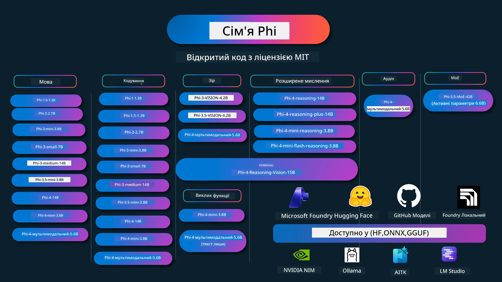

# Phi Cookbook: Практичні приклади з моделями Phi від Microsoft

[](https://codespaces.new/microsoft/phicookbook)
[](https://vscode.dev/redirect?url=vscode://ms-vscode-remote.remote-containers/cloneInVolume?url=https://github.com/microsoft/phicookbook)

[](https://GitHub.com/microsoft/phicookbook/graphs/contributors/?WT.mc_id=aiml-137032-kinfeylo)
[](https://GitHub.com/microsoft/phicookbook/issues/?WT.mc_id=aiml-137032-kinfeylo)
[](https://GitHub.com/microsoft/phicookbook/pulls/?WT.mc_id=aiml-137032-kinfeylo)
[](http://makeapullrequest.com?WT.mc_id=aiml-137032-kinfeylo)

[](https://GitHub.com/microsoft/phicookbook/watchers/?WT.mc_id=aiml-137032-kinfeylo)
[](https://GitHub.com/microsoft/phicookbook/network/?WT.mc_id=aiml-137032-kinfeylo)
[](https://GitHub.com/microsoft/phicookbook/stargazers/?WT.mc_id=aiml-137032-kinfeylo)

[](https://discord.com/invite/ByRwuEEgH4)

Phi — це серія відкритих моделей штучного інтелекту, розроблених Microsoft.

Наразі Phi є найпотужнішою та найекономічнішою малою мовною моделлю (SLM), з дуже хорошими показниками у багатомовності, логічному мисленні, генерації тексту/чатів, кодуванні, роботі з зображеннями, аудіо та інших сценаріях.

Ви можете розгорнути Phi в хмарі або на пристроях на краю мережі, і ви легко можете будувати генеративні AI-застосунки з обмеженими обчислювальними ресурсами.

Дотримуйтесь цих кроків для початку роботи з цими ресурсами:
1. **Форкніть репозиторій**: Клікніть [](https://GitHub.com/microsoft/phicookbook/network/?WT.mc_id=aiml-137032-kinfeylo)
2. **Клонувати репозиторій**: `git clone https://github.com/microsoft/PhiCookBook.git`
3. [**Приєднайтесь до спільноти Microsoft AI Discord, щоб зустрітися з експертами та іншими розробниками**](https://discord.com/invite/ByRwuEEgH4?WT.mc_id=aiml-137032-kinfeylo)



### 🌐 Підтримка багатьох мов

#### Підтримується через GitHub Action (автоматично та завжди оновлено)

<!-- CO-OP TRANSLATOR LANGUAGES TABLE START -->
[Арабська](../ar/README.md) | [Бенгальська](../bn/README.md) | [Болгарська](../bg/README.md) | [Бирманська (М’янма)](../my/README.md) | [Китайська (спрощена)](../zh-CN/README.md) | [Китайська (традиційна, Гонконг)](../zh-HK/README.md) | [Китайська (традиційна, Макао)](../zh-MO/README.md) | [Китайська (традиційна, Тайвань)](../zh-TW/README.md) | [Хорватська](../hr/README.md) | [Чеська](../cs/README.md) | [Данська](../da/README.md) | [Нідерландська](../nl/README.md) | [Естонська](../et/README.md) | [Фінська](../fi/README.md) | [Французька](../fr/README.md) | [Німецька](../de/README.md) | [Грецька](../el/README.md) | [Іврит](../he/README.md) | [Гінді](../hi/README.md) | [Угорська](../hu/README.md) | [Індонезійська](../id/README.md) | [Італійська](../it/README.md) | [Японська](../ja/README.md) | [Каннада](../kn/README.md) | [Корейська](../ko/README.md) | [Литовська](../lt/README.md) | [Малайська](../ms/README.md) | [Малаялам](../ml/README.md) | [Маратхі](../mr/README.md) | [Непальська](../ne/README.md) | [Нігерійський діалект](../pcm/README.md) | [Норвезька](../no/README.md) | [Перська (Фарсі)](../fa/README.md) | [Польська](../pl/README.md) | [Португальська (Бразилія)](../pt-BR/README.md) | [Португальська (Португалія)](../pt-PT/README.md) | [Пенджабі (Гурмухі)](../pa/README.md) | [Румунська](../ro/README.md) | [Російська](../ru/README.md) | [Сербська (кирилиця)](../sr/README.md) | [Словацька](../sk/README.md) | [Словенська](../sl/README.md) | [Іспанська](../es/README.md) | [Свахілі](../sw/README.md) | [Шведська](../sv/README.md) | [Тагальська (філіппінська)](../tl/README.md) | [Тамільська](../ta/README.md) | [Телугу](../te/README.md) | [Тайська](../th/README.md) | [Турецька](../tr/README.md) | [Українська](./README.md) | [Урду](../ur/README.md) | [Вʼєтнамська](../vi/README.md)

> **Віддаєте перевагу клонувати локально?**
>
> Цей репозиторій містить понад 50 перекладів мов, що значно збільшує розмір завантаження. Щоб клонувати без перекладів, використовуйте sparse checkout:
>
> **Bash / macOS / Linux:**
> ```bash
> git clone --filter=blob:none --sparse https://github.com/microsoft/PhiCookBook.git
> cd PhiCookBook
> git sparse-checkout set --no-cone '/*' '!translations' '!translated_images'
> ```
>
> **CMD (Windows):**
> ```cmd
> git clone --filter=blob:none --sparse https://github.com/microsoft/PhiCookBook.git
> cd PhiCookBook
> git sparse-checkout set --no-cone "/*" "!translations" "!translated_images"
> ```
>
> Це дасть вам усе необхідне для проходження курсу та значно швидше завантаження.
<!-- CO-OP TRANSLATOR LANGUAGES TABLE END -->

## Зміст таблиці
- Вступ - [Ласкаво просимо до родини Phi](./md/01.Introduction/01/01.PhiFamily.md) - [Налаштування вашого середовища](./md/01.Introduction/01/01.EnvironmentSetup.md) - [Розуміння ключових технологій](./md/01.Introduction/01/01.Understandingtech.md) - [Безпека ШІ для моделей Phi](./md/01.Introduction/01/01.AISafety.md) - [Підтримка апаратного забезпечення Phi](./md/01.Introduction/01/01.Hardwaresupport.md) - [Моделі Phi і доступність на різних платформах](./md/01.Introduction/01/01.Edgeandcloud.md) - [Використання Guidance-ai та Phi](./md/01.Introduction/01/01.Guidance.md) - [Моделі на GitHub Marketplace](https://github.com/marketplace/models) - [Каталог моделей Azure AI](https://ai.azure.com) - Інференс Phi в різних середовищах - [Hugging face](./md/01.Introduction/02/01.HF.md) - [Моделі GitHub](./md/01.Introduction/02/02.GitHubModel.md) - [Каталог моделей Microsoft Foundry](./md/01.Introduction/02/03.AzureAIFoundry.md) - [Ollama](./md/01.Introduction/02/04.Ollama.md) - [AI Toolkit VSCode (AITK)](./md/01.Introduction/02/05.AITK.md) - [NVIDIA NIM](./md/01.Introduction/02/06.NVIDIA.md) - [Foundry Local](./md/01.Introduction/02/07.FoundryLocal.md) - Інференс Phi Family - [Інференс Phi на iOS](./md/01.Introduction/03/iOS_Inference.md) - [Інференс Phi на Android](./md/01.Introduction/03/Android_Inference.md) - [Інференс Phi на Jetson](./md/01.Introduction/03/Jetson_Inference.md) - [Інференс Phi на AI PC](./md/01.Introduction/03/AIPC_Inference.md) - [Інференс Phi з використанням Apple MLX Framework](./md/01.Introduction/03/MLX_Inference.md) - [Інференс Phi на локальному сервері](./md/01.Introduction/03/Local_Server_Inference.md) - [Інференс Phi на віддаленому сервері із AI Toolkit](./md/01.Introduction/03/Remote_Interence.md) - [Інференс Phi з Rust](./md/01.Introduction/03/Rust_Inference.md) - [Інференс Phi--Vision локально](./md/01.Introduction/03/Vision_Inference.md) - [Інференс Phi з Kaito AKS, Azure Containers (офіційна підтримка)](./md/01.Introduction/03/Kaito_Inference.md) - [Квантифікація Phi Family](./md/01.Introduction/04/QuantifyingPhi.md) - [Квантизація Phi-3.5 / 4 з використанням llama.cpp](./md/01.Introduction/04/UsingLlamacppQuantifyingPhi.md) - [Квантизація Phi-3.5 / 4 за допомогою розширень Generative AI для onnxruntime](./md/01.Introduction/04/UsingORTGenAIQuantifyingPhi.md) - [Квантизація Phi-3.5 / 4 з Intel OpenVINO](./md/01.Introduction/04/UsingIntelOpenVINOQuantifyingPhi.md) - [Квантизація Phi-3.5 / 4 за допомогою Apple MLX Framework](./md/01.Introduction/04/UsingAppleMLXQuantifyingPhi.md) - Оцінка Phi - [Відповідальна ШІ](./md/01.Introduction/05/ResponsibleAI.md) - [Microsoft Foundry для оцінки](./md/01.Introduction/05/AIFoundry.md) - [Використання Promptflow для оцінки](./md/01.Introduction/05/Promptflow.md) - RAG з Azure AI Search - [Як використовувати Phi-4-mini та Phi-4-мультимодальний (RAG) з Azure AI Search](https://github.com/microsoft/PhiCookBook/blob/main/code/06.E2E/E2E_Phi-4-RAG-Azure-AI-Search.ipynb) - Зразки розробки додатків Phi - Текстові та чат-застосунки - Зразки Phi-4 - [📓] [Чат з моделлю Phi-4-mini ONNX](./md/02.Application/01.TextAndChat/Phi4/ChatWithPhi4ONNX/README.md) - [Чат з локальною моделлю Phi-4 ONNX .NET](../../md/04.HOL/dotnet/src/LabsPhi4-Chat-01OnnxRuntime) - [Консольний чат .NET з Phi-4 ONNX з використанням Semantic Kernel](../../md/04.HOL/dotnet/src/LabsPhi4-Chat-02SK) - Зразки Phi-3 / 3.5 - [Локальний чат-бот у браузері з Phi3, ONNX Runtime Web та WebGPU](https://github.com/microsoft/onnxruntime-inference-examples/tree/main/js/chat) - [OpenVino чат](./md/02.Application/01.TextAndChat/Phi3/E2E_OpenVino_Chat.md) - [Мультимодель - інтерактивний Phi-3-mini та OpenAI Whisper](./md/02.Application/01.TextAndChat/Phi3/E2E_Phi-3-mini_with_whisper.md) - [MLFlow - створення обгортки та використання Phi-3 з MLFlow](./md//02.Application/01.TextAndChat/Phi3/E2E_Phi-3-MLflow.md) - [Оптимізація моделей - як оптимізувати модель Phi-3-mini для ONNX Runtime Web з Olive](https://github.com/microsoft/Olive/tree/main/examples/phi3) - [WinUI3 додаток з Phi-3 mini-4k-instruct-onnx](https://github.com/microsoft/Phi3-Chat-WinUI3-Sample/) - [WinUI3 Мультимодель AI Power Notes App Sample](https://github.com/microsoft/ai-powered-notes-winui3-sample) - [Тонке налаштування та інтеграція користувацьких моделей Phi-3 із Prompt flow](./md/02.Application/01.TextAndChat/Phi3/E2E_Phi-3-FineTuning_PromptFlow_Integration.md) - [Тонке налаштування та інтеграція користувацьких моделей Phi-3 з Prompt flow у Microsoft Foundry](./md/02.Application/01.TextAndChat/Phi3/E2E_Phi-3-FineTuning_PromptFlow_Integration_AIFoundry.md) - [Оцінка тонко налаштованої моделі Phi-3 / Phi-3.5 у Microsoft Foundry з акцентом на принципи Responsible AI від Microsoft](./md/02.Application/01.TextAndChat/Phi3/E2E_Phi-3-Evaluation_AIFoundry.md) - [📓] [Приклад мовного прогнозування Phi-3.5-mini-instruct (китайська/англійська)](./md/02.Application/01.TextAndChat/Phi3/phi3-instruct-demo.ipynb) - [Phi-3.5-Instruct WebGPU RAG чат-бот](./md/02.Application/01.TextAndChat/Phi3/WebGPUWithPhi35Readme.md) - [Використання Windows GPU для створення рішення Prompt flow з Phi-3.5-Instruct ONNX](./md/02.Application/01.TextAndChat/Phi3/UsingPromptFlowWithONNX.md) - [Використання Microsoft Phi-3.5 tflite для створення Android-додатку](./md/02.Application/01.TextAndChat/Phi3/UsingPhi35TFLiteCreateAndroidApp.md) - [Приклад запитань і відповідей .NET із локальною моделлю ONNX Phi-3 з Microsoft.ML.OnnxRuntime](../../md/04.HOL/dotnet/src/LabsPhi301) - [Консольний чат .NET додаток з Semantic Kernel та Phi-3](../../md/04.HOL/dotnet/src/LabsPhi302) - Зразки коду SDK Azure AI для інференсу - Зразки Phi-4 - [📓] [Створення коду проекту за допомогою Phi-4-мультимодальний](./md/02.Application/02.Code/Phi4/GenProjectCode/README.md) - Зразки Phi-3 / 3.5 - [Створіть власного GitHub Copilot Chat для Visual Studio Code з Microsoft Phi-3 Family](./md/02.Application/02.Code/Phi3/VSCodeExt/README.md) - [Створіть власного агента чату GitHub Copilot у Visual Studio Code з Phi-3.5 від GitHub Models](/md/02.Application/02.Code/Phi3/CreateVSCodeChatAgentWithGitHubModels.md) - Зразки розширеного міркування - Зразки Phi-4 - [📓] [Зразки міркувань Phi-4-mini або Phi-4](./md/02.Application/03.AdvancedReasoning/Phi4/AdvancedResoningPhi4mini/README.md) - [📓] [Тонке налаштування Phi-4-mini-reasoning за допомогою Microsoft Olive](./md/02.Application/03.AdvancedReasoning/Phi4/AdvancedResoningPhi4mini/olive_ft_phi_4_reasoning_with_medicaldata.ipynb) - [📓] [Тонке налаштування Phi-4-mini-reasoning за допомогою Apple MLX](./md/02.Application/03.AdvancedReasoning/Phi4/AdvancedResoningPhi4mini/mlx_ft_phi_4_reasoning_with_medicaldata.ipynb) - [📓] [Phi-4-mini-reasoning із GitHub Models](./md/02.Application/02.Code/Phi4r/github_models_inference.ipynb) - [📓] [Phi-4-mini-reasoning з Microsoft Foundry Models](./md/02.Application/02.Code/Phi4r/azure_models_inference.ipynb) - 
Демонстрації - [Phi-4-mini демонстрації, розміщені на Hugging Face Spaces](https://huggingface.co/spaces/microsoft/phi-4-mini?WT.mc_id=aiml-137032-kinfeylo) - [Phi-4-мультимодальні демонстрації, розміщені на Hugging Face Spaces](https://huggingface.co/spaces/microsoft/phi-4-multimodal?WT.mc_id=aiml-137032-kinfeylo) - Зразки для зору - Зразки Phi-4 - [📓] [Використання Phi-4-мультимодального для читання зображень і генерації коду](./md/02.Application/04.Vision/Phi4/CreateFrontend/README.md) - Зразки Phi-3 / 3.5 - [📓][Phi-3-vision-Image текст у текст](./md/02.Application/04.Vision/Phi3/E2E_Phi-3-vision-image-text-to-text-online-endpoint.ipynb) - [Phi-3-vision-ONNX](https://onnxruntime.ai/docs/genai/tutorials/phi3-v.html) - [📓][Phi-3-vision CLIP Відображення](./md/02.Application/04.Vision/Phi3/E2E_Phi-3-vision-image-text-to-text-online-endpoint.ipynb) - [DEMO: Phi-3 Recycling](https://github.com/jennifermarsman/PhiRecycling/) - [Phi-3-vision - Візуальний мовний помічник - з Phi3-Vision і OpenVINO](https://docs.openvino.ai/nightly/notebooks/phi-3-vision-with-output.html) - [Phi-3 Vision Nvidia NIM](./md/02.Application/04.Vision/Phi3/E2E_Nvidia_NIM_Vision.md) - [Phi-3 Vision OpenVino](./md/02.Application/04.Vision/Phi3/E2E_OpenVino_Phi3Vision.md) - [📓][Phi-3.5 Vision зразок мультикадрів або мультізображень](./md/02.Application/04.Vision/Phi3/phi3-vision-demo.ipynb) - [Phi-3 Vision Локальна ONNX модель за допомогою Microsoft.ML.OnnxRuntime .NET](../../md/04.HOL/dotnet/src/LabsPhi303) - [Меню на основі Phi-3 Vision Локальна ONNX модель за допомогою Microsoft.ML.OnnxRuntime .NET](../../md/04.HOL/dotnet/src/LabsPhi304) - Зразки з розуміння та зору - Phi-4-Reasoning-Vision-15B - [📓] [Використання Phi-4-Reasoning-Vision-15B для виявлення порушень правил переходу](./md/02.Application/10.ReasoningVision/Phi_4_reasoning_vision_15b_Jaywalking.ipynb) - [📓] [Використання Phi-4-Reasoning-Vision-15B для математики](./md/02.Application/10.ReasoningVision/Phi_4_reasoning_vision_15b_Math.ipynb) - [📓] [Використання Phi-4-Reasoning-Vision-15B для виявлення UI](./md/02.Application/10.ReasoningVision/Phi_4_reasoning_vision_15b_ui.ipynb) - Зразки з математики - Зразки Phi-4-Mini-Flash-Reasoning-Instruct [Демонстрація математики з Phi-4-Mini-Flash-Reasoning-Instruct](./md/02.Application/09.Math/MathDemo.ipynb) - Аудіо зразки - Зразки Phi-4 - [📓] [Витяг аудіотранскриптів за допомогою Phi-4-мультимодального](./md/02.Application/05.Audio/Phi4/Transciption/README.md) - [📓] [Phi-4-мультимодальний аудіозразок](./md/02.Application/05.Audio/Phi4/Siri/demo.ipynb) - [📓] [Phi-4-мультимодальний зразок перекладу мовлення](./md/02.Application/05.Audio/Phi4/Translate/demo.ipynb) - [Консольний додаток .NET, що використовує Phi-4-мультимодальний аудіо для аналізу аудіофайлу і генерації транскрипту](../../md/04.HOL/dotnet/src/LabsPhi4-MultiModal-02Audio) - Зразки MOE - Зразки Phi-3 / 3.5 - [📓] [Phi-3.5 Моделі Суміші Експертів (MoEs) зразок соціальних мереж](./md/02.Application/06.MoE/Phi3/phi3_moe_demo.ipynb) - [📓] [Створення конвеєра Retrieval-Augmented Generation (RAG) з NVIDIA NIM Phi-3 MOE, Azure AI Search і LlamaIndex](./md/02.Application/06.MoE/Phi3/azure-ai-search-nvidia-rag.ipynb) - Зразки виклику функцій - Зразки Phi-4 🆕 - [📓] [Використання виклику функцій з Phi-4-mini](./md/02.Application/07.FunctionCalling/Phi4/FunctionCallingBasic/README.md) - [📓] [Використання виклику функцій для створення мультиагентів з Phi-4-mini](./md/02.Application/07.FunctionCalling/Phi4/Multiagents/Phi_4_mini_multiagent.ipynb) - [📓] [Використання виклику функцій з Ollama](./md/02.Application/07.FunctionCalling/Phi4/Ollama/ollama_functioncalling.ipynb) - [📓] [Використання виклику функцій з ONNX](./md/02.Application/07.FunctionCalling/Phi4/ONNX/onnx_parallel_functioncalling.ipynb) - Зразки мультимодального змішування - Зразки Phi-4 🆕 - [📓] [Використання Phi-4-мультимодального як технологічного журналіста](./md/02.Application/08.Multimodel/Phi4/TechJournalist/phi_4_mm_audio_text_publish_news.ipynb) - [Консольний додаток .NET, що використовує Phi-4-мультимодальний для аналізу зображень](../../md/04.HOL/dotnet/src/LabsPhi4-MultiModal-01Images) - Зразки донавчання Phi - [Сценарії донавчання](./md/03.FineTuning/FineTuning_Scenarios.md) - [Доначання проти RAG](./md/03.FineTuning/FineTuning_vs_RAG.md) - [Доначання: Нехай Phi-3 стане галузевим експертом](./md/03.FineTuning/LetPhi3gotoIndustriy.md) - [Доначання Phi-3 з AI Toolkit для VS Code](./md/03.FineTuning/Finetuning_VSCodeaitoolkit.md) - [Доначання Phi-3 з Azure Machine Learning Service](./md/03.FineTuning/Introduce_AzureML.md) - [Доначання Phi-3 з Lora](./md/03.FineTuning/FineTuning_Lora.md) - [Доначання Phi-3 з QLora](./md/03.FineTuning/FineTuning_Qlora.md) - [Доначання Phi-3 з Microsoft Foundry](./md/03.FineTuning/FineTuning_AIFoundry.md) - [Доначання Phi-3 з Azure ML CLI/SDK](./md/03.FineTuning/FineTuning_MLSDK.md) - [Доначання з Microsoft Olive](./md/03.FineTuning/FineTuning_MicrosoftOlive.md) - [Практична лабораторія з Microsoft Olive](./md/03.FineTuning/olive-lab/readme.md) - [Доначання Phi-3-vision за допомогою Weights and Bias](./md/03.FineTuning/FineTuning_Phi-3-visionWandB.md) - [Доначання Phi-3 з Apple MLX Framework](./md/03.FineTuning/FineTuning_MLX.md) - [Доначання Phi-3-vision (офіційна підтримка)](./md/03.FineTuning/FineTuning_Vision.md) - [Доначання Phi-3 з Kaito AKS, Azure Containers (офіційна підтримка)](./md/03.FineTuning/FineTuning_Kaito.md) - [Доначання Phi-3 і 3.5 Vision](https://github.com/2U1/Phi3-Vision-Finetune) - Практична лабораторія - [Вивчення передових моделей: LLMs, SLMs, локальна розробка та інше](https://github.com/microsoft/aitour-exploring-cutting-edge-models) - [Розкриття потенціалу NLP: донавчання з Microsoft Olive](https://github.com/azure/Ignite_FineTuning_workshop) - Академічні наукові роботи та публікації - [Textbooks Are All You Need II: технічний звіт phi-1.5](https://arxiv.org/abs/2309.05463) - [Технічний звіт Phi-3: високоефективна мовна модель локально на вашому телефоні](https://arxiv.org/abs/2404.14219) - [Технічний звіт Phi-4](https://arxiv.org/abs/2412.08905) - [Технічний звіт Phi-4-Mini: компактні, але потужні мультимодальні мовні моделі через Mixture-of-LoRAs](https://arxiv.org/abs/2503.01743) - [Оптимізація малих мовних моделей для виклику функцій у транспортних засобах](https://arxiv.org/abs/2501.02342) - [(WhyPHI) Доначання PHI-3 для відповіді на запитання з множинним вибором: методологія, результати та виклики](https://arxiv.org/abs/2501.01588) - [Технічний звіт Phi-4-reasoning](https://www.microsoft.com/en-us/research/wp-content/uploads/2025/04/phi_4_reasoning.pdf)
- [Технічний звіт Phi-4-mini-reasoning](https://huggingface.co/microsoft/Phi-4-mini-reasoning/blob/main/Phi-4-Mini-Reasoning.pdf)
# Phi Cookbook: Практичні приклади з моделями Phi від Microsoft

[](https://codespaces.new/microsoft/phicookbook)
[](https://vscode.dev/redirect?url=vscode://ms-vscode-remote.remote-containers/cloneInVolume?url=https://github.com/microsoft/phicookbook)

[](https://GitHub.com/microsoft/phicookbook/graphs/contributors/?WT.mc_id=aiml-137032-kinfeylo)
[](https://GitHub.com/microsoft/phicookbook/issues/?WT.mc_id=aiml-137032-kinfeylo)
[](https://GitHub.com/microsoft/phicookbook/pulls/?WT.mc_id=aiml-137032-kinfeylo)
[](http://makeapullrequest.com?WT.mc_id=aiml-137032-kinfeylo)

[](https://GitHub.com/microsoft/phicookbook/watchers/?WT.mc_id=aiml-137032-kinfeylo)
[](https://GitHub.com/microsoft/phicookbook/network/?WT.mc_id=aiml-137032-kinfeylo)
[](https://GitHub.com/microsoft/phicookbook/stargazers/?WT.mc_id=aiml-137032-kinfeylo)

[](https://discord.com/invite/ByRwuEEgH4)

Phi — це серія моделей штучного інтелекту з відкритим кодом, розроблених Microsoft.

Phi наразі є найпотужнішою та найекономнішою малою мовною моделлю (SLM) з дуже хорошими результатами у мульти-мовності, міркуванні, генерації тексту/чатів, кодуванні, зображеннях, аудіо та інших сценаріях.

Ви можете розгортати Phi у хмарі або на пристроях на периферії, а також легко створювати генеративні AI-застосунки з обмеженою обчислювальною потужністю.

Слідуйте цим крокам, щоб розпочати роботу з цими ресурсами:
1. **Форкніть репозиторій**: Натисніть [](https://GitHub.com/microsoft/phicookbook/network/?WT.mc_id=aiml-137032-kinfeylo)
2. **Клонуйте репозиторій**:   `git clone https://github.com/microsoft/PhiCookBook.git`
3. [**Приєднайтеся до спільноти Microsoft AI Discord та спілкуйтеся з експертами і розробниками**](https://discord.com/invite/ByRwuEEgH4?WT.mc_id=aiml-137032-kinfeylo)


### 🌐 Підтримка мульти-мов

#### Підтримується через GitHub Action (Автоматично та завжди актуально)

<!-- CO-OP TRANSLATOR LANGUAGES TABLE START -->
[Арабська](../ar/README.md) | [Бенгальська](../bn/README.md) | [Болгарська](../bg/README.md) | [Бірманська (Мʼянма)](../my/README.md) | [Китайська (спрощена)](../zh-CN/README.md) | [Китайська (традиційна, Гонконг)](../zh-HK/README.md) | [Китайська (традиційна, Макао)](../zh-MO/README.md) | [Китайська (традиційна, Тайвань)](../zh-TW/README.md) | [Хорватська](../hr/README.md) | [Чеська](../cs/README.md) | [Данська](../da/README.md) | [Нідерландська](../nl/README.md) | [Естонська](../et/README.md) | [Фінська](../fi/README.md) | [Французька](../fr/README.md) | [Німецька](../de/README.md) | [Грецька](../el/README.md) | [Іврит](../he/README.md) | [Хінді](../hi/README.md) | [Угорська](../hu/README.md) | [Індонезійська](../id/README.md) | [Італійська](../it/README.md) | [Японська](../ja/README.md) | [Каннада](../kn/README.md) | [Корейська](../ko/README.md) | [Литовська](../lt/README.md) | [Малайська](../ms/README.md) | [Малаялам](../ml/README.md) | [Маратхі](../mr/README.md) | [Непальська](../ne/README.md) | [Нігерійський пиджин](../pcm/README.md) | [Норвезька](../no/README.md) | [Перська (фарсі)](../fa/README.md) | [Польська](../pl/README.md) | [Португальська (Бразилія)](../pt-BR/README.md) | [Португальська (Португалія)](../pt-PT/README.md) | [Пенджабі (гурмухі)](../pa/README.md) | [Румунська](../ro/README.md) | [Російська](../ru/README.md) | [Сербська (кирилиця)](../sr/README.md) | [Словацька](../sk/README.md) | [Словенська](../sl/README.md) | [Іспанська](../es/README.md) | [Свахілі](../sw/README.md) | [Шведська](../sv/README.md) | [Тагалог (філіппінська)](../tl/README.md) | [Тамільська](../ta/README.md) | [Телугу](../te/README.md) | [Тайська](../th/README.md) | [Турецька](../tr/README.md) | [Українська](./README.md) | [Урду](../ur/README.md) | [Вʼєтнамська](../vi/README.md)

> **Віддаєте перевагу локальному клонуванню?**
>
> Цей репозиторій містить понад 50 перекладів мов, що значно збільшує обсяг завантаження. Щоб клонувати без перекладів, використайте sparse checkout:
>
> **Bash / macOS / Linux:**
> ```bash
> git clone --filter=blob:none --sparse https://github.com/microsoft/PhiCookBook.git
> cd PhiCookBook
> git sparse-checkout set --no-cone '/*' '!translations' '!translated_images'
> ```
>
> **CMD (Windows):**
> ```cmd
> git clone --filter=blob:none --sparse https://github.com/microsoft/PhiCookBook.git
> cd PhiCookBook
> git sparse-checkout set --no-cone "/*" "!translations" "!translated_images"
> ```
>
> Це дасть вам усе необхідне для проходження курсу з набагато швидшим завантаженням.
<!-- CO-OP TRANSLATOR LANGUAGES TABLE END -->

## Зміст

## Використання моделей Phi

### Phi на Microsoft Foundry

Ви можете навчитися використовувати Microsoft Phi і будувати комплексні (E2E) рішення на своїх різних пристроях. Щоб особисто ознайомитись з Phi, почніть експериментувати з моделями та налаштовувати Phi для своїх сценаріїв, використовуючи [Microsoft Foundry Azure AI Model Catalog](https://aka.ms/phi3-azure-ai). Більше дізнайтесь у розділі Початок роботи з [Microsoft Foundry](/md/02.QuickStart/AzureAIFoundry_QuickStart.md)

**Плейґраунд**
Кожна модель має власний плейґраунд для тестування моделі [Azure AI Playground](https://aka.ms/try-phi3).

### Phi на GitHub Models

Ви можете навчитися використовувати Microsoft Phi і будувати комплексні рішення на своїх різних пристроях. Щоб відчути Phi самостійно, почніть експериментувати з моделлю та налаштовувати Phi для своїх сценаріїв, використовуючи [GitHub Model Catalog](https://github.com/marketplace/models?WT.mc_id=aiml-137032-kinfeylo). Більше дізнайтесь у розділі Початок роботи з [GitHub Model Catalog](/md/02.QuickStart/GitHubModel_QuickStart.md)

**Плейґраунд**
Кожна модель має присвячений [плейґраунд для тестування моделі](/md/02.QuickStart/GitHubModel_QuickStart.md).

### Phi на Hugging Face

Ви також можете знайти модель на [Hugging Face](https://huggingface.co/microsoft)

**Плейґраунд**
 [Плейґраунд Hugging Chat](https://huggingface.co/chat/models/microsoft/Phi-3-mini-4k-instruct)

 ## 🎒 Інші курси

Наша команда створює інші курси! Перегляньте:

<!-- CO-OP TRANSLATOR OTHER COURSES START -->
### LangChain
[](https://aka.ms/langchain4j-for-beginners)
[](https://aka.ms/langchainjs-for-beginners?WT.mc_id=m365-94501-dwahlin)
[](https://github.com/microsoft/langchain-for-beginners?WT.mc_id=m365-94501-dwahlin)
---

### Azure / Edge / MCP / Агенти
[](https://github.com/microsoft/AZD-for-beginners?WT.mc_id=academic-105485-koreyst)
[](https://github.com/microsoft/edgeai-for-beginners?WT.mc_id=academic-105485-koreyst)
[](https://github.com/microsoft/mcp-for-beginners?WT.mc_id=academic-105485-koreyst)
[](https://github.com/microsoft/ai-agents-for-beginners?WT.mc_id=academic-105485-koreyst)

---
 
### Серія Generative AI
[](https://github.com/microsoft/generative-ai-for-beginners?WT.mc_id=academic-105485-koreyst)
[-9333EA?style=for-the-badge&labelColor=E5E7EB&color=9333EA)](https://github.com/microsoft/Generative-AI-for-beginners-dotnet?WT.mc_id=academic-105485-koreyst)
[-C084FC?style=for-the-badge&labelColor=E5E7EB&color=C084FC)](https://github.com/microsoft/generative-ai-for-beginners-java?WT.mc_id=academic-105485-koreyst)
[-E879F9?style=for-the-badge&labelColor=E5E7EB&color=E879F9)](https://github.com/microsoft/generative-ai-with-javascript?WT.mc_id=academic-105485-koreyst)

---
 
### Основне навчання
[](https://aka.ms/ml-beginners?WT.mc_id=academic-105485-koreyst)
[](https://aka.ms/datascience-beginners?WT.mc_id=academic-105485-koreyst)
[](https://aka.ms/ai-beginners?WT.mc_id=academic-105485-koreyst)
[](https://github.com/microsoft/Security-101?WT.mc_id=academic-96948-sayoung)
[](https://aka.ms/webdev-beginners?WT.mc_id=academic-105485-koreyst)
[](https://aka.ms/iot-beginners?WT.mc_id=academic-105485-koreyst)
[](https://github.com/microsoft/xr-development-for-beginners?WT.mc_id=academic-105485-koreyst)

---
 
### Серія Copilot
[](https://aka.ms/GitHubCopilotAI?WT.mc_id=academic-105485-koreyst)
[](https://github.com/microsoft/mastering-github-copilot-for-dotnet-csharp-developers?WT.mc_id=academic-105485-koreyst)
[](https://github.com/microsoft/CopilotAdventures?WT.mc_id=academic-105485-koreyst)
<!-- CO-OP TRANSLATOR OTHER COURSES END -->

## Відповідальний AI

Microsoft прагне допомогти нашим користувачам відповідально використовувати наші продукти AI, ділитися знаннями та будувати партнерства, засновані на довірі, за допомогою таких інструментів, як Примітки прозорості та Оцінки впливу. Багато з цих ресурсів можна знайти за адресою [https://aka.ms/RAI](https://aka.ms/RAI).
Підхід Microsoft до відповідального AI базується на наших принципах AI: справедливість, надійність і безпека, конфіденційність і безпека, інклюзивність, прозорість і відповідальність.

Великомасштабні моделі природної мови, зображень і мовлення — як ті, що використовуються у цьому зразку — потенційно можуть поводитися несправедливо, ненадійно або образливо, що призводить до шкоди. Будь ласка, ознайомтеся з [Приміткою прозорості служби Azure OpenAI](https://learn.microsoft.com/legal/cognitive-services/openai/transparency-note?tabs=text), щоб дізнатися про ризики та обмеження.

Рекомендований підхід до зменшення цих ризиків полягає у включенні в вашу архітектуру системи безпеки, яка може виявляти та запобігати шкідливій поведінці. [Azure AI Content Safety](https://learn.microsoft.com/azure/ai-services/content-safety/overview) забезпечує незалежний рівень захисту, здатний виявляти шкідливий користувацький та AI-згенерований контент у додатках і сервісах. Azure AI Content Safety включає API для тексту та зображень, які дозволяють виявляти шкідливі матеріали. У Microsoft Foundry сервіс Content Safety дозволяє переглядати, досліджувати та випробовувати приклади коду для виявлення шкідливого контенту у різних модальностях. Наступна [документація швидкого запуску](https://learn.microsoft.com/azure/ai-services/content-safety/quickstart-text?tabs=visual-studio%2Clinux&pivots=programming-language-rest) допоможе вам зробити запити до сервісу.

Ще одним аспектом, який слід враховувати, є загальна продуктивність додатку. У багатомодальних і багатомоделях додатках продуктивність означає, що система працює так, як ви та ваші користувачі очікують, включно з тим, що не генерує шкідливі результати. Важливо оцінювати продуктивність вашого додатку за допомогою [Оцінювачів продуктивності, якості, ризику та безпеки](https://learn.microsoft.com/azure/ai-studio/concepts/evaluation-metrics-built-in). Ви також можете створювати та оцінювати за допомогою [кастомних оцінювачів](https://learn.microsoft.com/azure/ai-studio/how-to/develop/evaluate-sdk#custom-evaluators).

Ви можете оцінити ваш AI-додаток у середовищі розробки за допомогою [Azure AI Evaluation SDK](https://microsoft.github.io/promptflow/index.html). За наявності тестового набору даних або цілі, генерації вашого генеративного AI-додатку кількісно вимірюються вбудованими або кастомними оцінювачами на ваш вибір. Щоб розпочати з azure ai evaluation sdk для оцінки вашої системи, скористайтеся [керівництвом швидкого запуску](https://learn.microsoft.com/azure/ai-studio/how-to/develop/flow-evaluate-sdk). Після виконання оцінки ви можете [візуалізувати результати у Microsoft Foundry](https://learn.microsoft.com/azure/ai-studio/how-to/evaluate-flow-results). 

## Торгові марки

Цей проект може містити торгові марки або логотипи проектів, продуктів чи сервісів. Авторизоване використання торгових марок чи логотипів Microsoft підпорядковується та має відповідати [Правилам використання торгових марок і брендів Microsoft](https://www.microsoft.com/legal/intellectualproperty/trademarks/usage/general).
Використання торгових марок або логотипів Microsoft у змінених версіях цього проекту не повинно створювати плутанину або припускати спонсорство Microsoft. Будь-яке використання торгових марок або логотипів третіх сторін підпорядковується політикам цих третіх сторін.

## Отримання допомоги

Якщо ви застрягли або маєте якісь питання щодо створення AI-додатків, приєднуйтесь:

[](https://aka.ms/foundry/discord)

Якщо у вас є відгуки про продукт або помилки під час створення, відвідайте:

[](https://aka.ms/foundry/forum)

---

<!-- CO-OP TRANSLATOR DISCLAIMER START -->
**Відмова від відповідальності**:  
Цей документ було перекладено за допомогою сервісу автоматичного перекладу [Co-op Translator](https://github.com/Azure/co-op-translator). Хоч ми й прагнемо до точності, будь ласка, майте на увазі, що автоматичні переклади можуть містити помилки або неточності. Оригінальний документ рідною мовою слід вважати авторитетним джерелом. Для критично важливої інформації рекомендується звертатися до професійного людського перекладу. Ми не несемо відповідальності за будь-які непорозуміння чи неправильні тлумачення, що можуть виникнути внаслідок використання цього перекладу.
<!-- CO-OP TRANSLATOR DISCLAIMER END -->