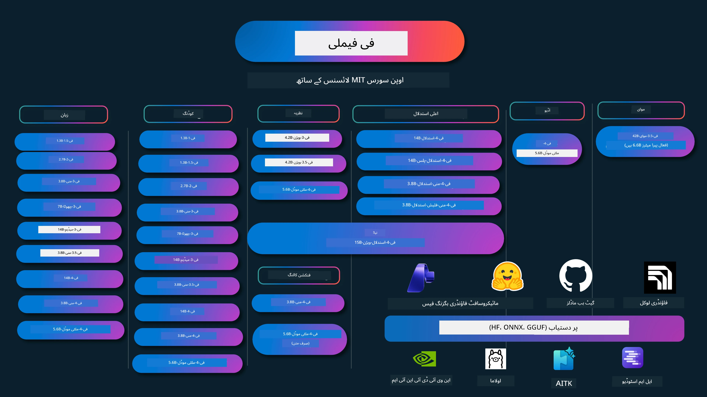

# فی کک بک: مائیکروسافٹ کے فی ماڈلز کے ساتھ ہاتھوں پر مبنی مثالیں

[](https://codespaces.new/microsoft/phicookbook)
[](https://vscode.dev/redirect?url=vscode://ms-vscode-remote.remote-containers/cloneInVolume?url=https://github.com/microsoft/phicookbook)

[](https://GitHub.com/microsoft/phicookbook/graphs/contributors/?WT.mc_id=aiml-137032-kinfeylo)
[](https://GitHub.com/microsoft/phicookbook/issues/?WT.mc_id=aiml-137032-kinfeylo)
[](https://GitHub.com/microsoft/phicookbook/pulls/?WT.mc_id=aiml-137032-kinfeylo)
[](http://makeapullrequest.com?WT.mc_id=aiml-137032-kinfeylo)

[](https://GitHub.com/microsoft/phicookbook/watchers/?WT.mc_id=aiml-137032-kinfeylo)
[](https://GitHub.com/microsoft/phicookbook/network/?WT.mc_id=aiml-137032-kinfeylo)
[](https://GitHub.com/microsoft/phicookbook/stargazers/?WT.mc_id=aiml-137032-kinfeylo)

[](https://discord.com/invite/ByRwuEEgH4)

فی مائیکروسافٹ کی طرف سے تیار کردہ ایک سلسلہ ہے جو اوپن سورس AI ماڈلز پر مشتمل ہے۔

فی فی الوقت سب سے طاقتور اور کم لاگت والا چھوٹا زبان ماڈل (SLM) ہے، جس نے کئی زبانوں، منطق، متن/چیٹ تخلیق، کوڈنگ، تصاویر، آڈیو اور دیگر منظرناموں میں بہترین بیچ مارکس حاصل کیے ہیں۔

آپ فی کو کلاؤڈ یا ایج ڈیوائسز پر تعینات کر سکتے ہیں، اور محدود کمپیوٹنگ طاقت کے ساتھ آسانی سے جنریٹو AI ایپلیکیشنز بنا سکتے ہیں۔

ان وسائل کو استعمال شروع کرنے کے لیے درج ذیل مراحل پر عمل کریں:
1. **ریپوزٹری کو فورک کریں**: کلک کریں [](https://GitHub.com/microsoft/phicookbook/network/?WT.mc_id=aiml-137032-kinfeylo)
2. **ریپوزٹری کو کلون کریں**: `git clone https://github.com/microsoft/PhiCookBook.git`
3. [**مائیکروسافٹ AI ڈسکارڈ کمیونٹی میں شامل ہوں اور ماہرین و دیگر ڈویلپرز سے ملیں**](https://discord.com/invite/ByRwuEEgH4?WT.mc_id=aiml-137032-kinfeylo)



### 🌐 متعدد زبانوں کی حمایت

#### GitHub ایکشن کے ذریعے معاونت (خودکار اور ہمیشہ تازہ ترین)

<!-- CO-OP TRANSLATOR LANGUAGES TABLE START -->
[عربی](../ar/README.md) | [بنگالی](../bn/README.md) | [بلغاریائی](../bg/README.md) | [برمی (میانمار)](../my/README.md) | [چینی (سادہ)](../zh-CN/README.md) | [چینی (روایتی، ہانگ کانگ)](../zh-HK/README.md) | [چینی (روایتی، میکاؤ)](../zh-MO/README.md) | [چینی (روایتی، تائیوان)](../zh-TW/README.md) | [کروشیائی](../hr/README.md) | [چیک](../cs/README.md) | [ڈینش](../da/README.md) | [ڈچ](../nl/README.md) | [ایسٹونین](../et/README.md) | [فنلش](../fi/README.md) | [فرانسیسی](../fr/README.md) | [جرمن](../de/README.md) | [یونانی](../el/README.md) | [عبرانی](../he/README.md) | [ہندی](../hi/README.md) | [ہنگیرین](../hu/README.md) | [انڈونیشین](../id/README.md) | [اطالوی](../it/README.md) | [جاپانی](../ja/README.md) | [کنڑ](../kn/README.md) | [خمیر](../km/README.md) | [کوریائی](../ko/README.md) | [لیتھوینین](../lt/README.md) | [ملائی](../ms/README.md) | [مالیالم](../ml/README.md) | [مراٹھی](../mr/README.md) | [نیپالی](../ne/README.md) | [نائجیریائی پیجین](../pcm/README.md) | [ناروے (ناروے زبان)](../no/README.md) | [فارسی (فارسی)](../fa/README.md) | [پولش](../pl/README.md) | [پرتگالی (برازیل)](../pt-BR/README.md) | [پرتگالی (پرتگال)](../pt-PT/README.md) | [پنجابی (گورمکھی)](../pa/README.md) | [رومانیائی](../ro/README.md) | [روسی](../ru/README.md) | [سربیائی (سریلیک)](../sr/README.md) | [سلوواک](../sk/README.md) | [سلووینیائی](../sl/README.md) | [ہسپانوی](../es/README.md) | [سواحلی](../sw/README.md) | [سویڈش](../sv/README.md) | [تاگالوگ (فلپائنی)](../tl/README.md) | [تمل](../ta/README.md) | [تیلگو](../te/README.md) | [تھائی](../th/README.md) | [ترکی](../tr/README.md) | [یوکرائنی](../uk/README.md) | [اردو](./README.md) | [ویتنامی](../vi/README.md)

> **لوکل کلوننگ کو ترجیح دیں؟**
>
> یہ ریپوزٹری 50+ زبانوں میں تراجم شامل کرتی ہے جو ڈاؤن لوڈ سائز کو نمایاں طور پر بڑھاتی ہے۔ بغیر تراجم کے کلون کرنے کے لیے، sparse checkout کا استعمال کریں:
>
> **باش / میک او ایس / لینکس:**
> ```bash
> git clone --filter=blob:none --sparse https://github.com/microsoft/PhiCookBook.git
> cd PhiCookBook
> git sparse-checkout set --no-cone '/*' '!translations' '!translated_images'
> ```
>
> **کمانڈ پرامپٹ (ونڈوز):**
> ```cmd
> git clone --filter=blob:none --sparse https://github.com/microsoft/PhiCookBook.git
> cd PhiCookBook
> git sparse-checkout set --no-cone "/*" "!translations" "!translated_images"
> ```
>
> اس سے آپ کو تیزی سے ڈاؤن لوڈ کے ساتھ کورس مکمل کرنے کے لیے تمام ضروریات مل جاتی ہیں۔
<!-- CO-OP TRANSLATOR LANGUAGES TABLE END -->

## فہرست مضامین

- تعارف
  - [فی فیملی میں خوش آمدید](./md/01.Introduction/01/01.PhiFamily.md)
  - [اپنا ماحول ترتیب دینا](./md/01.Introduction/01/01.EnvironmentSetup.md)
  - [اہم ٹیکنالوجیز کو سمجھنا](./md/01.Introduction/01/01.Understandingtech.md)
  - [فی ماڈلز کے لیے AI حفاظت](./md/01.Introduction/01/01.AISafety.md)
  - [فی ہارڈویئر سپورٹ](./md/01.Introduction/01/01.Hardwaresupport.md)
  - [فی ماڈلز اور پلیٹ فارمز پر دستیابی](./md/01.Introduction/01/01.Edgeandcloud.md)
  - [گائیڈنس-ai اور فی کا استعمال](./md/01.Introduction/01/01.Guidance.md)
  - [گیٹ ہب مارکیٹ پلیس ماڈلز](https://github.com/marketplace/models)
  - [ایزور AI ماڈل کیٹلاگ](https://ai.azure.com)

- مختلف ماحول میں فی کی انفرنس
    -  [ہیگنگ فیس](./md/01.Introduction/02/01.HF.md)
    -  [گیٹ ہب ماڈلز](./md/01.Introduction/02/02.GitHubModel.md)
    -  [مائیکروسافٹ فاؤنڈری ماڈل کیٹلاگ](./md/01.Introduction/02/03.AzureAIFoundry.md)
    -  [اولاما](./md/01.Introduction/02/04.Ollama.md)
    -  [AI ٹول کٹ VSCode (AITK)](./md/01.Introduction/02/05.AITK.md)
    -  [NVIDIA NIM](./md/01.Introduction/02/06.NVIDIA.md)
    -  [فاؤنڈری لوکل](./md/01.Introduction/02/07.FoundryLocal.md)

- فی فیملی کی انفرنس
    - [iOS میں فی کی انفرنس](./md/01.Introduction/03/iOS_Inference.md)
    - [Android میں فی کی انفرنس](./md/01.Introduction/03/Android_Inference.md)
    - [Jetson میں فی کی انفرنس](./md/01.Introduction/03/Jetson_Inference.md)
    - [AI پی سی میں فی کی انفرنس](./md/01.Introduction/03/AIPC_Inference.md)
    - [ایپل MLX فریم ورک کے ساتھ فی کی انفرنس](./md/01.Introduction/03/MLX_Inference.md)
    - [لوکل سرور میں فی کی انفرنس](./md/01.Introduction/03/Local_Server_Inference.md)
    - [AI ٹول کٹ کا استعمال کرتے ہوئے ریموٹ سرور پر فی کی انفرنس](./md/01.Introduction/03/Remote_Interence.md)
    - [رسٹ کے ساتھ فی کی انفرنس](./md/01.Introduction/03/Rust_Inference.md)
    - [لوکل میں فی وژن کی انفرنس](./md/01.Introduction/03/Vision_Inference.md)
    - [کائٹو AKS، ایزور کنٹینرز (سرکاری سپورٹ) کے ساتھ فی کی انفرنس](./md/01.Introduction/03/Kaito_Inference.md)
-  [فی فیملی کو مقداری بنانا](./md/01.Introduction/04/QuantifyingPhi.md)
    - [llama.cpp کے ذریعے Phi-3.5 / 4 کو مقداری بنانا](./md/01.Introduction/04/UsingLlamacppQuantifyingPhi.md)
    - [onnxruntime کے لیے جنریٹو AI ایکسٹینشنز کے ذریعے Phi-3.5 / 4 کو مقداری بنانا](./md/01.Introduction/04/UsingORTGenAIQuantifyingPhi.md)
    - [انٹل اوپن وی نو کے ذریعے Phi-3.5 / 4 کو مقداری بنانا](./md/01.Introduction/04/UsingIntelOpenVINOQuantifyingPhi.md)
    - [ایپل MLX فریم ورک کے ذریعے Phi-3.5 / 4 کو مقداری بنانا](./md/01.Introduction/04/UsingAppleMLXQuantifyingPhi.md)

-  فی کی جانچ
    - [ردعمل AI](./md/01.Introduction/05/ResponsibleAI.md)
    - [تجزیے کے لیے مائیکروسافٹ فاؤنڈری](./md/01.Introduction/05/AIFoundry.md)
    - [جانچ کے لیے Promptflow کا استعمال](./md/01.Introduction/05/Promptflow.md)
 
- ایزور AI سرچ کے ساتھ RAG
    - [Phi-4-mini اور Phi-4-multimodal(RAG) کو ایزور AI سرچ کے ساتھ کیسے استعمال کریں](https://github.com/microsoft/PhiCookBook/blob/main/code/06.E2E/E2E_Phi-4-RAG-Azure-AI-Search.ipynb)

- Phi ایپلیکیشن ڈویلپمنٹ کے نمونے
  - متن اور چیٹ ایپلیکیشنز
    - Phi-4 کے نمونے 
      - [📓] [Phi-4-mini ONNX ماڈل کے ساتھ چیٹ](./md/02.Application/01.TextAndChat/Phi4/ChatWithPhi4ONNX/README.md)
      - [Phi-4 لوکل ONNX ماڈل .NET کے ساتھ چیٹ](../../md/04.HOL/dotnet/src/LabsPhi4-Chat-01OnnxRuntime)
      - [Phi-4 ONNX کے ساتھ سمنٹک کرنل استعمال کرتے ہوئے .NET کنسول ایپ میں چیٹ](../../md/04.HOL/dotnet/src/LabsPhi4-Chat-02SK)
    - Phi-3 / 3.5 کے نمونے
      - [Phi3، ONNX Runtime Web اور WebGPU استعمال کرتے ہوئے براؤزر میں لوکل چیٹ بوٹ](https://github.com/microsoft/onnxruntime-inference-examples/tree/main/js/chat)
      - [اوپن وینو چیٹ](./md/02.Application/01.TextAndChat/Phi3/E2E_OpenVino_Chat.md)
      - [ملٹی ماڈل - انٹرایکٹو فی-3-منی اور اوپن اے آئی وسپر](./md/02.Application/01.TextAndChat/Phi3/E2E_Phi-3-mini_with_whisper.md)
      - [ایم ایل فلو - ایک ریپر بنانے اور ایم ایل فلو کے ساتھ فی-3 کا استعمال](./md//02.Application/01.TextAndChat/Phi3/E2E_Phi-3-MLflow.md)
      - [ماڈل کی اصلاح - فی-3-منی ماڈل کو ONNX رن ٹائم ویب کے لیے اولیو کے ساتھ کیسے بہتر بنائیں](https://github.com/microsoft/Olive/tree/main/examples/phi3)
      - [WinUI3 ایپ کے ساتھ Phi-3 mini-4k-instruct-onnx](https://github.com/microsoft/Phi3-Chat-WinUI3-Sample/)
      -[ WinUI3 ملٹی ماڈل AI پاورڈ نوٹس ایپ سیمپل](https://github.com/microsoft/ai-powered-notes-winui3-sample)
      - [حسب ضرورت فی-3 ماڈلز کو پرامپٹ فلو کے ساتھ فائن ٹیون اور انٹیگریٹ کریں](./md/02.Application/01.TextAndChat/Phi3/E2E_Phi-3-FineTuning_PromptFlow_Integration.md)
      - [مائیکروسافٹ فاؤنڈری میں پرامپٹ فلو کے ساتھ حسب ضرورت فی-3 ماڈلز کو فائن ٹیون اور انٹیگریٹ کریں](./md/02.Application/01.TextAndChat/Phi3/E2E_Phi-3-FineTuning_PromptFlow_Integration_AIFoundry.md)
      - [مائیکروسافٹ فاؤنڈری میں مائیکروسافٹ کے ذمہ دار AI اصولوں پر توجہ دیتے ہوئے فائن ٹیون شدہ فی-3 / فی-3.5 ماڈل کا جائزہ لیں](./md/02.Application/01.TextAndChat/Phi3/E2E_Phi-3-Evaluation_AIFoundry.md)
      - [📓] [Phi-3.5-mini-instruct زبان کی پیش گوئی کا سیمپل (چینی/انگریزی)](./md/02.Application/01.TextAndChat/Phi3/phi3-instruct-demo.ipynb)
      - [Phi-3.5-Instruct WebGPU RAG چیٹ بوٹ](./md/02.Application/01.TextAndChat/Phi3/WebGPUWithPhi35Readme.md)
      - [Windows GPU کا استعمال کرتے ہوئے پرامپٹ فلو حل تخلیق کرنا Phi-3.5-Instruct ONNX کے ساتھ](./md/02.Application/01.TextAndChat/Phi3/UsingPromptFlowWithONNX.md)
      - [مائیکروسافٹ Phi-3.5 tflite کا استعمال کرتے ہوئے اینڈرائیڈ ایپ بنائیں](./md/02.Application/01.TextAndChat/Phi3/UsingPhi35TFLiteCreateAndroidApp.md)
      - [Q&A .NET مثال مقامی ONNX Phi-3 ماڈل استعمال کرتے ہوئے Microsoft.ML.OnnxRuntime](../../md/04.HOL/dotnet/src/LabsPhi301)
      - [کنسول چیٹ .NET ایپ Semantic Kernel اور Phi-3 کے ساتھ](../../md/04.HOL/dotnet/src/LabsPhi302)

  - ایژور AI انفرنس SDK کوڈ کی بنیاد پر نمونے
    - Phi-4 نمونے
      - [📓] [Phi-4-multimodal کا استعمال کرتے ہوئے پروجیکٹ کوڈ تیار کریں](./md/02.Application/02.Code/Phi4/GenProjectCode/README.md)
    - Phi-3 / 3.5 نمونے
      - [اپنا Visual Studio Code GitHub Copilot Chat مائیکروسافٹ Phi-3 فیملی کے ساتھ بنائیں](./md/02.Application/02.Code/Phi3/VSCodeExt/README.md)
      - [GitHub ماڈلز کے ساتھ Phi-3.5 کے ذریعے اپنا Visual Studio Code Chat Copilot Agent بنائیں](/md/02.Application/02.Code/Phi3/CreateVSCodeChatAgentWithGitHubModels.md)

  - ایڈوانسڈ ریزننگ نمونے
    - Phi-4 نمونے
      - [📓] [Phi-4-mini-reasoning یا Phi-4-reasoning نمونے](./md/02.Application/03.AdvancedReasoning/Phi4/AdvancedResoningPhi4mini/README.md)
      - [📓] [مائیکروسافٹ اولیو کے ساتھ Phi-4-mini-reasoning کی فائن ٹیوننگ](./md/02.Application/03.AdvancedReasoning/Phi4/AdvancedResoningPhi4mini/olive_ft_phi_4_reasoning_with_medicaldata.ipynb)
      - [📓] [ایپل MLX کے ساتھ Phi-4-mini-reasoning کی فائن ٹیوننگ](./md/02.Application/03.AdvancedReasoning/Phi4/AdvancedResoningPhi4mini/mlx_ft_phi_4_reasoning_with_medicaldata.ipynb)
      - [📓] [GitHub ماڈلز کے ساتھ Phi-4-mini-reasoning](./md/02.Application/02.Code/Phi4r/github_models_inference.ipynb)
      - [📓] [مائیکروسافٹ فاؤنڈری ماڈلز کے ساتھ Phi-4-mini-reasoning](./md/02.Application/02.Code/Phi4r/azure_models_inference.ipynb)
  - ڈیموز
      - [Phi-4-mini ڈیموز جو Hugging Face Spaces پر میزبان ہیں](https://huggingface.co/spaces/microsoft/phi-4-mini?WT.mc_id=aiml-137032-kinfeylo)
      - [Phi-4-multimodal ڈیموز جو Hugginge Face Spaces پر میزبان ہیں](https://huggingface.co/spaces/microsoft/phi-4-multimodal?WT.mc_id=aiml-137032-kinfeylo)
  - وژن نمونے
    - Phi-4 نمونے
      - [📓] [تصاویر پڑھنے اور کوڈ تیار کرنے کے لیے Phi-4-multimodal کا استعمال کریں](./md/02.Application/04.Vision/Phi4/CreateFrontend/README.md)
    - Phi-3 / 3.5 نمونے
      -  [📓][Phi-3-vision-تصویر متن سے متن تک](./md/02.Application/04.Vision/Phi3/E2E_Phi-3-vision-image-text-to-text-online-endpoint.ipynb)
      - [Phi-3-vision-ONNX](https://onnxruntime.ai/docs/genai/tutorials/phi3-v.html)
      - [📓][Phi-3-vision CLIP ایمبیڈنگ](./md/02.Application/04.Vision/Phi3/E2E_Phi-3-vision-image-text-to-text-online-endpoint.ipynb)
      - [ڈیمو: Phi-3 ری سائیکلنگ](https://github.com/jennifermarsman/PhiRecycling/)
      - [Phi-3-vision - بصری زبان کا معاون - Phi3-Vision اور OpenVINO کے ساتھ](https://docs.openvino.ai/nightly/notebooks/phi-3-vision-with-output.html)
      - [Phi-3 وژن Nvidia NIM](./md/02.Application/04.Vision/Phi3/E2E_Nvidia_NIM_Vision.md)
      - [Phi-3 وژن اوپن وینو](./md/02.Application/04.Vision/Phi3/E2E_OpenVino_Phi3Vision.md)
      - [📓][Phi-3.5 وژن ملٹی فریم یا ملٹی تصویر کا سیمپل](./md/02.Application/04.Vision/Phi3/phi3-vision-demo.ipynb)
      - [Phi-3 وژن لوکل ONNX ماڈل Microsoft.ML.OnnxRuntime .NET استعمال کرتے ہوئے](../../md/04.HOL/dotnet/src/LabsPhi303)
      - [مینیو پر مبنی Phi-3 وژن لوکل ONNX ماڈل Microsoft.ML.OnnxRuntime .NET استعمال کرتے ہوئے](../../md/04.HOL/dotnet/src/LabsPhi304)

  - ریزننگ-وژن نمونے
    - Phi-4-Reasoning-Vision-15B
      - [📓] [Phi-4-Reasoning-Vision-15B کا استعمال کرتے ہوئے جے واکنگ کا پتہ لگانا](./md/02.Application/10.ReasoningVision/Phi_4_reasoning_vision_15b_Jaywalking.ipynb)
      - [📓] [Phi-4-Reasoning-Vision-15B کا استعمال کرتے ہوئے ریاضی](./md/02.Application/10.ReasoningVision/Phi_4_reasoning_vision_15b_Math.ipynb)
      - [📓] [Phi-4-Reasoning-Vision-15B کا استعمال کرتے ہوئے UI کا پتہ لگانا](./md/02.Application/10.ReasoningVision/Phi_4_reasoning_vision_15b_ui.ipynb)

  - ریاضی کے نمونے
    - Phi-4-Mini-Flash-Reasoning-Instruct نمونے  [ریاضی ڈیمو Phi-4-Mini-Flash-Reasoning-Instruct کے ساتھ](./md/02.Application/09.Math/MathDemo.ipynb)

  - آڈیو نمونے
    - Phi-4 نمونے
      - [📓] [Phi-4-multimodal کا استعمال کرتے ہوئے آڈیو ٹرانسکرپٹس نکالنا](./md/02.Application/05.Audio/Phi4/Transciption/README.md)
      - [📓] [Phi-4-multimodal آڈیو سیمپل](./md/02.Application/05.Audio/Phi4/Siri/demo.ipynb)
      - [📓] [Phi-4-multimodal تقریر ترجمہ سیمپل](./md/02.Application/05.Audio/Phi4/Translate/demo.ipynb)
      - [.NET کنسول ایپلیکیشن Phi-4-multimodal آڈیو کا استعمال کرتے ہوئے آڈیو فائل کا تجزیہ اور ٹرانسکرپٹ تیار کرنا](../../md/04.HOL/dotnet/src/LabsPhi4-MultiModal-02Audio)

  - ماہرین کے مرکب کے نمونے (MOE)
    - Phi-3 / 3.5 نمونے
      - [📓] [Phi-3.5 ماہرین کے مرکب (MoEs) سوشل میڈیا سیمپل](./md/02.Application/06.MoE/Phi3/phi3_moe_demo.ipynb)
      - [📓] [NVIDIA NIM Phi-3 MOE، ایژور AI سرچ، اور لاما انڈیکس کے ساتھ ریٹریول آگمینٹڈ جنریشن (RAG) پائپ لائن بنانا](./md/02.Application/06.MoE/Phi3/azure-ai-search-nvidia-rag.ipynb)
      - 
  - فنکشن کالنگ نمونے
    - Phi-4 نمونے 🆕
      -  [📓] [Phi-4-mini کے ساتھ فنکشن کالنگ کا استعمال](./md/02.Application/07.FunctionCalling/Phi4/FunctionCallingBasic/README.md)
      -  [📓] [فنکشن کالنگ کا استعمال کرتے ہوئے Phi-4-mini کے ساتھ ملٹی ایجنٹس بنانا](./md/02.Application/07.FunctionCalling/Phi4/Multiagents/Phi_4_mini_multiagent.ipynb)
      -  [📓] [اولاما کے ساتھ فنکشن کالنگ کا استعمال](./md/02.Application/07.FunctionCalling/Phi4/Ollama/ollama_functioncalling.ipynb)
      -  [📓] [ONNX کے ساتھ فنکشن کالنگ کا استعمال](./md/02.Application/07.FunctionCalling/Phi4/ONNX/onnx_parallel_functioncalling.ipynb)
  - کثیرالماڈل مکسنگ نمونے
    - Phi-4 نمونے 🆕
      -  [📓] [ٹیکنالوجی جرنلسٹ کے طور پر Phi-4-multimodal کا استعمال](./md/02.Application/08.Multimodel/Phi4/TechJournalist/phi_4_mm_audio_text_publish_news.ipynb)
      - [.NET کنسول ایپلیکیشن جس میں Phi-4-multimodal کا استعمال تصاویر کا تجزیہ کرنے کے لیے](../../md/04.HOL/dotnet/src/LabsPhi4-MultiModal-01Images)

- فی نمونوں کی فائن ٹیوننگ
  - [فائن ٹیوننگ کے مناظر](./md/03.FineTuning/FineTuning_Scenarios.md)
  - [فائن ٹیوننگ بمقابلہ RAG](./md/03.FineTuning/FineTuning_vs_RAG.md)
  - [فی-3 کو صنعت کا ماہر بننے دیں](./md/03.FineTuning/LetPhi3gotoIndustriy.md)
  - [VS کوڈ کے لیے AI ٹول کٹ کے ساتھ فی-3 کی فائن ٹیوننگ](./md/03.FineTuning/Finetuning_VSCodeaitoolkit.md)
  - [ایژور مشین لرننگ سروس کے ساتھ فی-3 کی فائن ٹیوننگ](./md/03.FineTuning/Introduce_AzureML.md)
  - [لوڑا کے ساتھ فی-3 کی فائن ٹیوننگ](./md/03.FineTuning/FineTuning_Lora.md)
  - [QLora کے ساتھ فی-3 کی فائن ٹیوننگ](./md/03.FineTuning/FineTuning_Qlora.md)
  - [مائیکروسافٹ فاؤنڈری کے ساتھ فی-3 کی فائن ٹیوننگ](./md/03.FineTuning/FineTuning_AIFoundry.md)
  - [ایژور ML CLI/SDK کے ساتھ فی-3 کی فائن ٹیوننگ](./md/03.FineTuning/FineTuning_MLSDK.md)
  - [مائیکروسافٹ اولیو کے ساتھ فائن ٹیوننگ](./md/03.FineTuning/FineTuning_MicrosoftOlive.md)
  - [مائیکروسافٹ اولیو ہینڈز آن لیب کے ساتھ فائن ٹیوننگ](./md/03.FineTuning/olive-lab/readme.md)
  - [ویز اور بایس کے ساتھ فی-3-ویژن کی فائن ٹیوننگ](./md/03.FineTuning/FineTuning_Phi-3-visionWandB.md)
  - [ایپل MLX فریم ورک کے ساتھ فی-3 کی فائن ٹیوننگ](./md/03.FineTuning/FineTuning_MLX.md)
  - [فی-3-ویژن کی فائن ٹیوننگ (سرکاری حمایت)](./md/03.FineTuning/FineTuning_Vision.md)
  - [کائتو AKS کے ساتھ Phi-3 کی فائن ٹوننگ، Azure کنٹینرز (سرکاری سپورٹ)](./md/03.FineTuning/FineTuning_Kaito.md)
  - [Phi-3 اور 3.5 وژن کی فائن ٹوننگ](https://github.com/2U1/Phi3-Vision-Finetune)

- ہینڈز آن لیب
  - [جدید ماڈلز کی دریافت: LLMs، SLMs، مقامی ترقی اور مزید](https://github.com/microsoft/aitour-exploring-cutting-edge-models)
  - [NLP کی صلاحیتوں کا انلاک کرنا: Microsoft Olive کے ساتھ فائن ٹوننگ](https://github.com/azure/Ignite_FineTuning_workshop)

- علمی تحقیقی مقالات اور اشاعتیں
  - [کتابیں سب کچھ ہیں II: phi-1.5 تکنیکی رپورٹ](https://arxiv.org/abs/2309.05463)
  - [Phi-3 تکنیکی رپورٹ: ایک اعلیٰ صلاحیت والا زبان ماڈل آپ کے فون پر مقامی طور پر](https://arxiv.org/abs/2404.14219)
  - [Phi-4 تکنیکی رپورٹ](https://arxiv.org/abs/2412.08905)
  - [Phi-4-Mini تکنیکی رپورٹ: کمپیکٹ لیکن طاقتور ملٹی موڈل زبان ماڈلز LoRAs کے مِکسچر کے ذریعے](https://arxiv.org/abs/2503.01743)
  - [گاڑی میں فنکشن کالنگ کے لیے چھوٹے زبان ماڈلز کو بہتر بنانا](https://arxiv.org/abs/2501.02342)
  - [(WhyPHI) PHI-3 کی فائن ٹوننگ برائے ملٹی پل چوائس سوالات کے جواب: طریقہ کار، نتائج، اور چیلنجز](https://arxiv.org/abs/2501.01588)
  - [Phi-4-ریزننگ تکنیکی رپورٹ](https://www.microsoft.com/en-us/research/wp-content/uploads/2025/04/phi_4_reasoning.pdf)
  - [Phi-4-منی-ریزننگ تکنیکی رپورٹ](https://huggingface.co/microsoft/Phi-4-mini-reasoning/blob/main/Phi-4-Mini-Reasoning.pdf)

## Phi ماڈلز کا استعمال

### Microsoft Foundry پر Phi

آپ سیکھ سکتے ہیں کہ Microsoft Phi کو کیسے استعمال کیا جائے اور اپنے مختلف ہارڈویئر ڈیوائسز میں E2E حل کیسے بنائیں۔ خود Phi کا تجربہ کرنے کے لیے، ماڈلز کے ساتھ کھیلنا شروع کریں اور [Microsoft Foundry Azure AI Model Catalog](https://aka.ms/phi3-azure-ai) استعمال کرتے ہوئے اپنے منظرناموں کے لیے Phi کو ذاتی بنائیں۔ آپ مزید جان سکتے ہیں Getting Started with [Microsoft Foundry](/md/02.QuickStart/AzureAIFoundry_QuickStart.md) سے۔

**پلے گراؤنڈ**  
ہر ماڈل کا ایک مخصوص پلے گراؤنڈ ہوتا ہے جہاں آپ ماڈل کو آزما سکتے ہیں [Azure AI Playground](https://aka.ms/try-phi3)۔

### GitHub ماڈلز پر Phi

آپ سیکھ سکتے ہیں کہ Microsoft Phi کو کیسے استعمال کیا جائے اور اپنے مختلف ہارڈویئر ڈیوائسز میں E2E حل کیسے بنائیں۔ خود Phi کا تجربہ کرنے کے لیے، ماڈل کے ساتھ کھیلنا شروع کریں اور اپنے منظرناموں کے لیے Phi کو ذاتی بنانے کے لیے [GitHub Model Catalog](https://github.com/marketplace/models?WT.mc_id=aiml-137032-kinfeylo) استعمال کریں۔ آپ مزید جان سکتے ہیں Getting Started with [GitHub Model Catalog](/md/02.QuickStart/GitHubModel_QuickStart.md) سے۔

**پلے گراؤنڈ**  
ہر ماڈل کا مخصوص [پلے گراؤنڈ جہاں ماڈل کو آزمایا جا سکتا ہے](/md/02.QuickStart/GitHubModel_QuickStart.md) موجود ہے۔

### Hugging Face پر Phi

آپ ماڈل کو [Hugging Face](https://huggingface.co/microsoft) پر بھی تلاش کر سکتے ہیں۔

**پلے گراؤنڈ**  
[Hugging Chat playground](https://huggingface.co/chat/models/microsoft/Phi-3-mini-4k-instruct)

## 🎒 دیگر کورسز

ہماری ٹیم دیگر کورسز بھی تیار کرتی ہے! دیکھیں:

<!-- CO-OP TRANSLATOR OTHER COURSES START -->
### LangChain
[](https://aka.ms/langchain4j-for-beginners)
[](https://aka.ms/langchainjs-for-beginners?WT.mc_id=m365-94501-dwahlin)
[](https://github.com/microsoft/langchain-for-beginners?WT.mc_id=m365-94501-dwahlin)
---

### Azure / Edge / MCP / ایجینٹس
[](https://github.com/microsoft/AZD-for-beginners?WT.mc_id=academic-105485-koreyst)
[](https://github.com/microsoft/edgeai-for-beginners?WT.mc_id=academic-105485-koreyst)
[](https://github.com/microsoft/mcp-for-beginners?WT.mc_id=academic-105485-koreyst)
[](https://github.com/microsoft/ai-agents-for-beginners?WT.mc_id=academic-105485-koreyst)

---

### جنریٹیو AI سیریز
[](https://github.com/microsoft/generative-ai-for-beginners?WT.mc_id=academic-105485-koreyst)
[-9333EA?style=for-the-badge&labelColor=E5E7EB&color=9333EA)](https://github.com/microsoft/Generative-AI-for-beginners-dotnet?WT.mc_id=academic-105485-koreyst)
[-C084FC?style=for-the-badge&labelColor=E5E7EB&color=C084FC)](https://github.com/microsoft/generative-ai-for-beginners-java?WT.mc_id=academic-105485-koreyst)
[-E879F9?style=for-the-badge&labelColor=E5E7EB&color=E879F9)](https://github.com/microsoft/generative-ai-with-javascript?WT.mc_id=academic-105485-koreyst)

---

### بنیادی سیکھنا
[](https://aka.ms/ml-beginners?WT.mc_id=academic-105485-koreyst)
[](https://aka.ms/datascience-beginners?WT.mc_id=academic-105485-koreyst)
[](https://aka.ms/ai-beginners?WT.mc_id=academic-105485-koreyst)
[](https://github.com/microsoft/Security-101?WT.mc_id=academic-96948-sayoung)
[](https://aka.ms/webdev-beginners?WT.mc_id=academic-105485-koreyst)
[](https://aka.ms/iot-beginners?WT.mc_id=academic-105485-koreyst)
[](https://github.com/microsoft/xr-development-for-beginners?WT.mc_id=academic-105485-koreyst)

---

### کوپایلٹ سیریز
[](https://aka.ms/GitHubCopilotAI?WT.mc_id=academic-105485-koreyst)
[](https://github.com/microsoft/mastering-github-copilot-for-dotnet-csharp-developers?WT.mc_id=academic-105485-koreyst)
[](https://github.com/microsoft/CopilotAdventures?WT.mc_id=academic-105485-koreyst)
<!-- CO-OP TRANSLATOR OTHER COURSES END -->

## ذمہ دار AI

Microsoft اپنے صارفین کی مدد کرنے کے لیے پرعزم ہے کہ وہ ہمارے AI مصنوعات کو ذمہ داری کے ساتھ استعمال کریں، اپنی سیکھ کو شیئر کریں، اور ٹرانسپیرنسی نوٹس اور امپیکٹ اسیسمنٹس جیسے ٹولز کے ذریعے بھروسے پر مبنی شراکت داریاں قائم کریں۔ ان میں سے بہت سے وسائل [https://aka.ms/RAI](https://aka.ms/RAI) پر دستیاب ہیں۔  
Microsoft کا ذمہ دار AI کا نظریہ ہمارے AI کے اصولوں پر مبنی ہے: انصاف، قابل اعتماد ہونا اور حفاظت، رازداری اور سیکورٹی، شمولیت، شفافیت، اور جوابدہی۔

بڑے پیمانے کے قدرتی زبان، تصویر، اور تقریر کے ماڈلز — جیسے کہ اس نمونے میں استعمال ہونے والے — ممکن ہے کہ کچھ معاملات میں ناجائز، ناقابل اعتماد، یا توہین آمیز رویہ اپنائیں، جو نقصان کا سبب بن سکتی ہے۔ براہ کرم خطرات اور حد بندیوں سے آگاہ ہونے کے لیے [Azure OpenAI service Transparency note](https://learn.microsoft.com/legal/cognitive-services/openai/transparency-note?tabs=text) کو دیکھیں۔
ان خطرات کو کم کرنے کے لیے تجویز کردہ طریقہ یہ ہے کہ آپ اپنی آرکیٹیکچر میں ایک حفاظتی نظام شامل کریں جو نقصان دہ رویے کا پتہ لگا سکے اور اسے روک سکے۔ [Azure AI Content Safety](https://learn.microsoft.com/azure/ai-services/content-safety/overview) ایک آزاد حفاظتی پرت فراہم کرتا ہے، جو ایپلیکیشنز اور خدمات میں نقصان دہ صارف-بنائی گئی اور AI-بنائی گئی مواد کا پتہ لگا سکتا ہے۔ Azure AI Content Safety میں ٹیکسٹ اور امیج APIs شامل ہیں جو آپ کو نقصان دہ مواد کا پتہ لگانے کی اجازت دیتے ہیں۔ Microsoft Foundry کے اندر، Content Safety سروس آپ کو مختلف طریقوں سے نقصان دہ مواد کا پتہ لگانے کے لیے نمونہ کوڈ دیکھنے، دریافت کرنے اور آزمانے کی سہولت فراہم کرتی ہے۔ درج ذیل [quickstart دستاویزات](https://learn.microsoft.com/azure/ai-services/content-safety/quickstart-text?tabs=visual-studio%2Clinux&pivots=programming-language-rest) آپ کو سروس کو درخواستیں دینے کے عمل سے رہنمائی کرتی ہیں۔

ایک اور پہلو جس پر غور کرنا ضروری ہے وہ مجموعی ایپلیکیشن کی کارکردگی ہے۔ کثیر المناحل اور کثیر ماڈلز ایپلیکیشنز کے ساتھ، ہم کارکردگی سے مراد لیتے ہیں کہ نظام آپ اور آپ کے صارفین کی توقعات کے مطابق کام کرے، جس میں نقصان دہ نتائج پیدا نہ کرنا بھی شامل ہے۔ آپ کے لیے ضروری ہے کہ آپ اپنی مجموعی ایپلیکیشن کی کارکردگی کا جائزہ لیں [Performance and Quality and Risk and Safety evaluators](https://learn.microsoft.com/azure/ai-studio/concepts/evaluation-metrics-built-in) کا استعمال کرتے ہوئے۔ آپ کے پاس [custom evaluators](https://learn.microsoft.com/azure/ai-studio/how-to/develop/evaluate-sdk#custom-evaluators) بنانے اور جانچنے کی بھی صلاحیت موجود ہے۔

آپ اپنے AI ایپلیکیشن کو اپنے ترقیاتی ماحول میں [Azure AI Evaluation SDK](https://microsoft.github.io/promptflow/index.html) استعمال کرکے جانچ سکتے ہیں۔ چاہے آپ کے پاس ٹیسٹ ڈیٹا سیٹ ہو یا کوئی ہدف، آپ کی جینیریٹو AI ایپلیکیشن کی تخلیقات کو بلٹ ان یا آپ کے منتخب کردہ کسٹم ایویلیویٹرز کے ذریعے مقداری طور پر ماپا جاتا ہے۔ اپنے نظام کا جائزہ لینے کے لیے azure ai evaluation sdk کے ساتھ شروع کرنے کے لیے، آپ [quickstart guide](https://learn.microsoft.com/azure/ai-studio/how-to/develop/flow-evaluate-sdk) کی پیروی کر سکتے ہیں۔ ایک بار جب آپ جائزہ چلائیں گے، تو آپ [Microsoft Foundry میں نتائج کو بصری صورت میں دیکھ سکتے ہیں](https://learn.microsoft.com/azure/ai-studio/how-to/evaluate-flow-results)۔

## ٹریڈ مارکس

یہ پروجیکٹ پروجیکٹس، مصنوعات، یا خدمات کے لیے ٹریڈ مارکس یا لوگوز پر مشتمل ہو سکتا ہے۔ Microsoft کے ٹریڈ مارکس یا لوگوز کے مجاز استعمال پر [Microsoft کے ٹریڈ مارک اور برانڈ گائیڈ لائنز](https://www.microsoft.com/legal/intellectualproperty/trademarks/usage/general) لاگو ہوتے ہیں اور انہیں لازمی طور پر ان قواعد کی پیروی کرنا ہوتی ہے۔ اس پروجیکٹ کے ترمیم شدہ ورژنز میں Microsoft کے ٹریڈ مارکس یا لوگوز کا استعمال الجھن پیدا نہیں کرے گا اور نہ ہی Microsoft کی اسپانسرشپ کا اشارہ دے گا۔ تیسرے فریق کے ٹریڈ مارکس یا لوگوز کا کوئی بھی استعمال ان تیسرے فریق کی پالیسیوں کے تابع ہوگا۔

## مدد حاصل کرنا

اگر آپ پھنس جائیں یا AI ایپس بنانے کے بارے میں کوئی سوال ہو، تو شامل ہوں:

[](https://aka.ms/foundry/discord)

اگر آپ کو مصنوعات کے بارے میں تاثرات یا تعمیر کے دوران خرابیوں کا سامنا ہو، تو وزٹ کریں:

[](https://aka.ms/foundry/forum)

---

<!-- CO-OP TRANSLATOR DISCLAIMER START -->
**ڈسکلیمر**:
یہ دستاویز AI ترجمہ سروس [Co-op Translator](https://github.com/Azure/co-op-translator) کے ذریعے ترجمہ کی گئی ہے۔ اگرچہ ہم درستگی کی کوشش کرتے ہیں، براہ کرم آگاہ رہیں کہ خودکار ترجمے میں غلطیاں یا غیر یقینی باتیں ہو سکتی ہیں۔ اصل دستاویز اپنی مادری زبان میں معتبر ذریعہ سمجھی جانی چاہیے۔ اہم معلومات کے لیے پیشہ ور انسانی ترجمہ کی سفارش کی جاتی ہے۔ اس ترجمے کے استعمال سے پیدا ہونے والی کسی بھی غلط فہمی یا غلط تشریح کی ذمہ داری ہم پر عائد نہیں ہوتی۔
<!-- CO-OP TRANSLATOR DISCLAIMER END -->