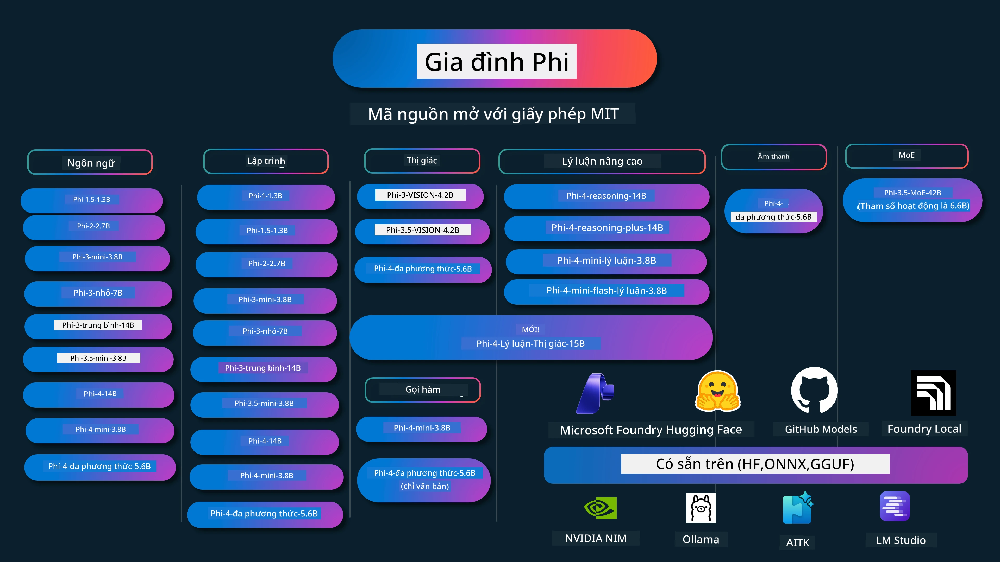

# Phi Cookbook: Ví dụ Thực hành với các Mô hình Phi của Microsoft

[](https://codespaces.new/microsoft/phicookbook)
[](https://vscode.dev/redirect?url=vscode://ms-vscode-remote.remote-containers/cloneInVolume?url=https://github.com/microsoft/phicookbook)

[](https://GitHub.com/microsoft/phicookbook/graphs/contributors/?WT.mc_id=aiml-137032-kinfeylo)
[](https://GitHub.com/microsoft/phicookbook/issues/?WT.mc_id=aiml-137032-kinfeylo)
[](https://GitHub.com/microsoft/phicookbook/pulls/?WT.mc_id=aiml-137032-kinfeylo)
[](http://makeapullrequest.com?WT.mc_id=aiml-137032-kinfeylo)

[](https://GitHub.com/microsoft/phicookbook/watchers/?WT.mc_id=aiml-137032-kinfeylo)
[](https://GitHub.com/microsoft/phicookbook/network/?WT.mc_id=aiml-137032-kinfeylo)
[](https://GitHub.com/microsoft/phicookbook/stargazers/?WT.mc_id=aiml-137032-kinfeylo)

[](https://discord.com/invite/ByRwuEEgH4)

Phi là một chuỗi các mô hình AI mã nguồn mở được phát triển bởi Microsoft.

Phi hiện là mô hình ngôn ngữ nhỏ (SLM) mạnh mẽ và tiết kiệm chi phí nhất, với các đánh giá rất tốt trong đa ngôn ngữ, suy luận, tạo văn bản/trò chuyện, lập trình, hình ảnh, âm thanh và các kịch bản khác.

Bạn có thể triển khai Phi lên đám mây hoặc thiết bị biên, và bạn có thể dễ dàng xây dựng các ứng dụng AI sinh tạo với năng lực tính toán giới hạn.

Thực hiện các bước sau để bắt đầu sử dụng tài nguyên này:
1. **Fork Repository**: Nhấp [](https://GitHub.com/microsoft/phicookbook/network/?WT.mc_id=aiml-137032-kinfeylo)
2. **Clone Repository**: `git clone https://github.com/microsoft/PhiCookBook.git`
3. [**Tham gia cộng đồng Microsoft AI Discord và gặp gỡ các chuyên gia cùng nhà phát triển**](https://discord.com/invite/ByRwuEEgH4?WT.mc_id=aiml-137032-kinfeylo)



### 🌐 Hỗ trợ Đa Ngôn Ngữ

#### Hỗ trợ qua GitHub Action (Tự động & luôn Cập nhật)

<!-- CO-OP TRANSLATOR LANGUAGES TABLE START -->
[Tiếng Ả Rập](../ar/README.md) | [Tiếng Bengal](../bn/README.md) | [Tiếng Bungari](../bg/README.md) | [Tiếng Miến Điện (Myanmar)](../my/README.md) | [Tiếng Trung (Giản thể)](../zh-CN/README.md) | [Tiếng Trung (Phồn thể, Hồng Kông)](../zh-HK/README.md) | [Tiếng Trung (Phồn thể, Macau)](../zh-MO/README.md) | [Tiếng Trung (Phồn thể, Đài Loan)](../zh-TW/README.md) | [Tiếng Croatia](../hr/README.md) | [Tiếng Séc](../cs/README.md) | [Tiếng Đan Mạch](../da/README.md) | [Tiếng Hà Lan](../nl/README.md) | [Tiếng Estonia](../et/README.md) | [Tiếng Phần Lan](../fi/README.md) | [Tiếng Pháp](../fr/README.md) | [Tiếng Đức](../de/README.md) | [Tiếng Hy Lạp](../el/README.md) | [Tiếng Do Thái](../he/README.md) | [Tiếng Hindi](../hi/README.md) | [Tiếng Hungary](../hu/README.md) | [Tiếng Indonesia](../id/README.md) | [Tiếng Ý](../it/README.md) | [Tiếng Nhật](../ja/README.md) | [Tiếng Kannada](../kn/README.md) | [Tiếng Khmer](../km/README.md) | [Tiếng Hàn](../ko/README.md) | [Tiếng Litva](../lt/README.md) | [Tiếng Mã Lai](../ms/README.md) | [Tiếng Malayalam](../ml/README.md) | [Tiếng Marathi](../mr/README.md) | [Tiếng Nepal](../ne/README.md) | [Tiếng Pidgin Nigeria](../pcm/README.md) | [Tiếng Na Uy](../no/README.md) | [Tiếng Ba Tư (Farsi)](../fa/README.md) | [Tiếng Ba Lan](../pl/README.md) | [Tiếng Bồ Đào Nha (Brazil)](../pt-BR/README.md) | [Tiếng Bồ Đào Nha (Bồ Đào Nha)](../pt-PT/README.md) | [Tiếng Punjabi (Gurmukhi)](../pa/README.md) | [Tiếng Rumani](../ro/README.md) | [Tiếng Nga](../ru/README.md) | [Tiếng Serbia (Chữ Kirin)](../sr/README.md) | [Tiếng Slovakia](../sk/README.md) | [Tiếng Slovenia](../sl/README.md) | [Tiếng Tây Ban Nha](../es/README.md) | [Tiếng Swahili](../sw/README.md) | [Tiếng Thụy Điển](../sv/README.md) | [Tiếng Tagalog (Philippines)](../tl/README.md) | [Tiếng Tamil](../ta/README.md) | [Tiếng Telugu](../te/README.md) | [Tiếng Thái](../th/README.md) | [Tiếng Thổ Nhĩ Kỳ](../tr/README.md) | [Tiếng Ukraina](../uk/README.md) | [Tiếng Urdu](../ur/README.md) | [Tiếng Việt](./README.md)

> **Ưa thích Clone cục bộ?**
>
> Kho này bao gồm hơn 50 bản dịch ngôn ngữ, điều này làm tăng đáng kể kích thước tải về. Để clone mà không có bản dịch, sử dụng sparse checkout:
>
> **Bash / macOS / Linux:**
> ```bash
> git clone --filter=blob:none --sparse https://github.com/microsoft/PhiCookBook.git
> cd PhiCookBook
> git sparse-checkout set --no-cone '/*' '!translations' '!translated_images'
> ```
>
> **CMD (Windows):**
> ```cmd
> git clone --filter=blob:none --sparse https://github.com/microsoft/PhiCookBook.git
> cd PhiCookBook
> git sparse-checkout set --no-cone "/*" "!translations" "!translated_images"
> ```
>
> Điều này cung cấp cho bạn tất cả những gì cần thiết để hoàn thành khóa học với tốc độ tải nhanh hơn rất nhiều.
<!-- CO-OP TRANSLATOR LANGUAGES TABLE END -->

## Mục lục

- Giới thiệu
  - [Chào mừng đến với Gia đình Phi](./md/01.Introduction/01/01.PhiFamily.md)
  - [Cài đặt môi trường của bạn](./md/01.Introduction/01/01.EnvironmentSetup.md)
  - [Hiểu biết về Các Công nghệ Chính](./md/01.Introduction/01/01.Understandingtech.md)
  - [An toàn AI cho các Mô hình Phi](./md/01.Introduction/01/01.AISafety.md)
  - [Hỗ trợ Phần cứng Phi](./md/01.Introduction/01/01.Hardwaresupport.md)
  - [Mô hình Phi & Khả năng sẵn có trên các nền tảng](./md/01.Introduction/01/01.Edgeandcloud.md)
  - [Sử dụng Guidance-ai và Phi](./md/01.Introduction/01/01.Guidance.md)
  - [Mô hình trên GitHub Marketplace](https://github.com/marketplace/models)
  - [Danh mục Mô hình AI Azure](https://ai.azure.com)

- Suy luận Phi trong các môi trường khác nhau
    -  [Hugging face](./md/01.Introduction/02/01.HF.md)
    -  [Mô hình GitHub](./md/01.Introduction/02/02.GitHubModel.md)
    -  [Danh mục Mô hình Microsoft Foundry](./md/01.Introduction/02/03.AzureAIFoundry.md)
    -  [Ollama](./md/01.Introduction/02/04.Ollama.md)
    -  [Bộ công cụ AI VSCode (AITK)](./md/01.Introduction/02/05.AITK.md)
    -  [NVIDIA NIM](./md/01.Introduction/02/06.NVIDIA.md)
    -  [Foundry Local](./md/01.Introduction/02/07.FoundryLocal.md)

- Suy luận Gia đình Phi
    - [Suy luận Phi trên iOS](./md/01.Introduction/03/iOS_Inference.md)
    - [Suy luận Phi trên Android](./md/01.Introduction/03/Android_Inference.md)
    - [Suy luận Phi trên Jetson](./md/01.Introduction/03/Jetson_Inference.md)
    - [Suy luận Phi trên AI PC](./md/01.Introduction/03/AIPC_Inference.md)
    - [Suy luận Phi với Apple MLX Framework](./md/01.Introduction/03/MLX_Inference.md)
    - [Suy luận Phi trên Máy chủ cục bộ](./md/01.Introduction/03/Local_Server_Inference.md)
    - [Suy luận Phi trên Máy chủ từ xa sử dụng AI Toolkit](./md/01.Introduction/03/Remote_Interence.md)
    - [Suy luận Phi với Rust](./md/01.Introduction/03/Rust_Inference.md)
    - [Suy luận Phi--Thị giác tại địa phương](./md/01.Introduction/03/Vision_Inference.md)
    - [Suy luận Phi với Kaito AKS, Azure Containers (hỗ trợ chính thức)](./md/01.Introduction/03/Kaito_Inference.md)
-  [Lượng tử hóa Gia đình Phi](./md/01.Introduction/04/QuantifyingPhi.md)
    - [Lượng tử hóa Phi-3.5 / 4 bằng llama.cpp](./md/01.Introduction/04/UsingLlamacppQuantifyingPhi.md)
    - [Lượng tử hóa Phi-3.5 / 4 bằng tiện ích mở rộng Generative AI cho onnxruntime](./md/01.Introduction/04/UsingORTGenAIQuantifyingPhi.md)
    - [Lượng tử hóa Phi-3.5 / 4 bằng Intel OpenVINO](./md/01.Introduction/04/UsingIntelOpenVINOQuantifyingPhi.md)
    - [Lượng tử hóa Phi-3.5 / 4 bằng Apple MLX Framework](./md/01.Introduction/04/UsingAppleMLXQuantifyingPhi.md)

-  Đánh giá Phi
    - [AI có trách nhiệm](./md/01.Introduction/05/ResponsibleAI.md)
    - [Microsoft Foundry cho Đánh giá](./md/01.Introduction/05/AIFoundry.md)
    - [Sử dụng Promptflow để Đánh giá](./md/01.Introduction/05/Promptflow.md)
 
- RAG với Azure AI Search
    - [Cách sử dụng Phi-4-mini và Phi-4-multimodal(RAG) với Azure AI Search](https://github.com/microsoft/PhiCookBook/blob/main/code/06.E2E/E2E_Phi-4-RAG-Azure-AI-Search.ipynb)

- Ví dụ phát triển ứng dụng Phi
  - Ứng dụng Văn bản & Trò chuyện
    - Mẫu Phi-4
      - [📓] [Trò chuyện với Mô hình Phi-4-mini ONNX](./md/02.Application/01.TextAndChat/Phi4/ChatWithPhi4ONNX/README.md)
      - [Trò chuyện với Mô hình ONNX Phi-4 cục bộ .NET](../../md/04.HOL/dotnet/src/LabsPhi4-Chat-01OnnxRuntime)
      - [Ứng dụng Console trò chuyện .NET với Phi-4 ONNX sử dụng Sementic Kernel](../../md/04.HOL/dotnet/src/LabsPhi4-Chat-02SK)
    - Mẫu Phi-3 / 3.5
      - [Chatbot cục bộ trong trình duyệt sử dụng Phi3, ONNX Runtime Web và WebGPU](https://github.com/microsoft/onnxruntime-inference-examples/tree/main/js/chat)
      - [OpenVino Chat](./md/02.Application/01.TextAndChat/Phi3/E2E_OpenVino_Chat.md)
      - [Mở nhiều mô hình - Tương tác Phi-3-mini và OpenAI Whisper](./md/02.Application/01.TextAndChat/Phi3/E2E_Phi-3-mini_with_whisper.md)
      - [MLFlow - Xây dựng bộ đóng gói và sử dụng Phi-3 với MLFlow](./md//02.Application/01.TextAndChat/Phi3/E2E_Phi-3-MLflow.md)
      - [Tối ưu hóa mô hình - Cách tối ưu hóa mô hình Phi-3-min cho ONNX Runtime Web với Olive](https://github.com/microsoft/Olive/tree/main/examples/phi3)
      - [Ứng dụng WinUI3 với Phi-3 mini-4k-instruct-onnx](https://github.com/microsoft/Phi3-Chat-WinUI3-Sample/)
      -[Mẫu ứng dụng Ghi chú sử dụng AI với Nhiều mô hình WinUI3](https://github.com/microsoft/ai-powered-notes-winui3-sample)
      - [Tinh chỉnh và tích hợp các mô hình Phi-3 tùy chỉnh với Prompt flow](./md/02.Application/01.TextAndChat/Phi3/E2E_Phi-3-FineTuning_PromptFlow_Integration.md)
      - [Tinh chỉnh và tích hợp các mô hình Phi-3 tùy chỉnh với Prompt flow trong Microsoft Foundry](./md/02.Application/01.TextAndChat/Phi3/E2E_Phi-3-FineTuning_PromptFlow_Integration_AIFoundry.md)
      - [Đánh giá mô hình Phi-3 / Phi-3.5 đã tinh chỉnh trong Microsoft Foundry với trọng tâm là các Nguyên tắc AI có Trách nhiệm của Microsoft](./md/02.Application/01.TextAndChat/Phi3/E2E_Phi-3-Evaluation_AIFoundry.md)
      - [📓] [Mẫu dự đoán ngôn ngữ Phi-3.5-mini-instruct (Tiếng Trung/Anh)](./md/02.Application/01.TextAndChat/Phi3/phi3-instruct-demo.ipynb)
      - [Phi-3.5-Instruct WebGPU RAG Chatbot](./md/02.Application/01.TextAndChat/Phi3/WebGPUWithPhi35Readme.md)
      - [Sử dụng GPU Windows để tạo giải pháp Prompt flow với Phi-3.5-Instruct ONNX](./md/02.Application/01.TextAndChat/Phi3/UsingPromptFlowWithONNX.md)
      - [Sử dụng Microsoft Phi-3.5 tflite để tạo ứng dụng Android](./md/02.Application/01.TextAndChat/Phi3/UsingPhi35TFLiteCreateAndroidApp.md)
      - [Ví dụ Hỏi & Đáp .NET sử dụng mô hình Phi-3 ONNX cục bộ với Microsoft.ML.OnnxRuntime](../../md/04.HOL/dotnet/src/LabsPhi301)
      - [Ứng dụng chat .NET console với Semantic Kernel và Phi-3](../../md/04.HOL/dotnet/src/LabsPhi302)

  - Mẫu Code SDK Azure AI Inference 
    - Mẫu Phi-4 
      - [📓] [Tạo mã dự án sử dụng Phi-4-multimodal](./md/02.Application/02.Code/Phi4/GenProjectCode/README.md)
    - Mẫu Phi-3 / 3.5
      - [Xây dựng Chat Copilot Visual Studio Code của riêng bạn với Microsoft Phi-3 Family](./md/02.Application/02.Code/Phi3/VSCodeExt/README.md)
      - [Tạo Chat Copilot Agent Visual Studio Code của riêng bạn với Phi-3.5 bằng các Mô hình GitHub](/md/02.Application/02.Code/Phi3/CreateVSCodeChatAgentWithGitHubModels.md)

  - Mẫu Lý luận Nâng cao
    - Mẫu Phi-4 
      - [📓] [Mẫu Phi-4-mini-lý luận hoặc Phi-4-lý luận](./md/02.Application/03.AdvancedReasoning/Phi4/AdvancedResoningPhi4mini/README.md)
      - [📓] [Tinh chỉnh Phi-4-mini-lý luận với Microsoft Olive](./md/02.Application/03.AdvancedReasoning/Phi4/AdvancedResoningPhi4mini/olive_ft_phi_4_reasoning_with_medicaldata.ipynb)
      - [📓] [Tinh chỉnh Phi-4-mini-lý luận với Apple MLX](./md/02.Application/03.AdvancedReasoning/Phi4/AdvancedResoningPhi4mini/mlx_ft_phi_4_reasoning_with_medicaldata.ipynb)
      - [📓] [Phi-4-mini-lý luận với Mô hình GitHub](./md/02.Application/02.Code/Phi4r/github_models_inference.ipynb)
      - [📓] [Phi-4-mini-lý luận với Mô hình Microsoft Foundry](./md/02.Application/02.Code/Phi4r/azure_models_inference.ipynb)
  - Bản Demo
      - [Bản demo Phi-4-mini được lưu trữ trên Hugging Face Spaces](https://huggingface.co/spaces/microsoft/phi-4-mini?WT.mc_id=aiml-137032-kinfeylo)
      - [Bản demo Phi-4-multimodal được lưu trữ trên Hugging Face Spaces](https://huggingface.co/spaces/microsoft/phi-4-multimodal?WT.mc_id=aiml-137032-kinfeylo)
  - Mẫu Thị giác
    - Mẫu Phi-4 
      - [📓] [Sử dụng Phi-4-multimodal để đọc hình ảnh và tạo mã](./md/02.Application/04.Vision/Phi4/CreateFrontend/README.md) 
    - Mẫu Phi-3 / 3.5
      -  [📓][Phi-3-thị giác - chuyển văn bản hình ảnh thành văn bản](./md/02.Application/04.Vision/Phi3/E2E_Phi-3-vision-image-text-to-text-online-endpoint.ipynb)
      - [Phi-3-thị giác-ONNX](https://onnxruntime.ai/docs/genai/tutorials/phi3-v.html)
      - [📓][Phi-3-thị giác nhúng CLIP](./md/02.Application/04.Vision/Phi3/E2E_Phi-3-vision-image-text-to-text-online-endpoint.ipynb)
      - [DEMO: Phi-3 Tái chế](https://github.com/jennifermarsman/PhiRecycling/)
      - [Phi-3-thị giác - Trợ lý ngôn ngữ thị giác - với Phi3-Vision và OpenVINO](https://docs.openvino.ai/nightly/notebooks/phi-3-vision-with-output.html)
      - [Phi-3 Thị giác Nvidia NIM](./md/02.Application/04.Vision/Phi3/E2E_Nvidia_NIM_Vision.md)
      - [Phi-3 Thị giác OpenVino](./md/02.Application/04.Vision/Phi3/E2E_OpenVino_Phi3Vision.md)
      - [📓][Phi-3.5 Thị giác đa khung hoặc đa hình ảnh mẫu](./md/02.Application/04.Vision/Phi3/phi3-vision-demo.ipynb)
      - [Phi-3 Thị giác Mô hình ONNX cục bộ sử dụng Microsoft.ML.OnnxRuntime .NET](../../md/04.HOL/dotnet/src/LabsPhi303)
      - [Mô hình ONNX cục bộ Phi-3 Thị giác dựa trên Menu sử dụng Microsoft.ML.OnnxRuntime .NET](../../md/04.HOL/dotnet/src/LabsPhi304)

  - Mẫu Lý luận-Thị giác
    - Phi-4-Lý luận-Thị giác-15B 
      - [📓] [Sử dụng Phi-4-Lý luận-Thị giác-15B để phát hiện hành vi đi bộ không đúng nơi quy định](./md/02.Application/10.ReasoningVision/Phi_4_reasoning_vision_15b_Jaywalking.ipynb)
      - [📓] [Sử dụng Phi-4-Lý luận-Thị giác-15B cho toán học](./md/02.Application/10.ReasoningVision/Phi_4_reasoning_vision_15b_Math.ipynb)
      - [📓] [Sử dụng Phi-4-Lý luận-Thị giác-15B để phát hiện giao diện người dùng](./md/02.Application/10.ReasoningVision/Phi_4_reasoning_vision_15b_ui.ipynb)

  - Mẫu Toán học
    -  Mẫu Phi-4-Mini-Flash-Reasoning-Instruct  [Demo Toán học với Phi-4-Mini-Flash-Reasoning-Instruct](./md/02.Application/09.Math/MathDemo.ipynb)

  - Mẫu Âm thanh
    - Mẫu Phi-4 
      - [📓] [Trích xuất bản ghi âm thanh sử dụng Phi-4-multimodal](./md/02.Application/05.Audio/Phi4/Transciption/README.md)
      - [📓] [Mẫu âm thanh Phi-4-multimodal](./md/02.Application/05.Audio/Phi4/Siri/demo.ipynb)
      - [📓] [Mẫu dịch nói Phi-4-multimodal](./md/02.Application/05.Audio/Phi4/Translate/demo.ipynb)
      - [Ứng dụng console .NET sử dụng Phi-4-multimodal Audio phân tích tệp âm thanh và tạo bản ghi](../../md/04.HOL/dotnet/src/LabsPhi4-MultiModal-02Audio)

  - Mẫu MOE
    - Mẫu Phi-3 / 3.5
      - [📓] [Mô hình hỗn hợp Chuyên gia Phi-3.5 (MoEs) Mẫu mạng xã hội](./md/02.Application/06.MoE/Phi3/phi3_moe_demo.ipynb)
      - [📓] [Xây dựng dây chuyền Tăng cường Truy xuất (RAG) với NVIDIA NIM Phi-3 MOE, Azure AI Search và LlamaIndex](./md/02.Application/06.MoE/Phi3/azure-ai-search-nvidia-rag.ipynb)
      - 
  - Mẫu Gọi Hàm
    - Mẫu Phi-4 🆕
      -  [📓] [Sử dụng Gọi Hàm với Phi-4-mini](./md/02.Application/07.FunctionCalling/Phi4/FunctionCallingBasic/README.md)
      -  [📓] [Sử dụng Gọi Hàm để tạo đa tác nhân Với Phi-4-mini](./md/02.Application/07.FunctionCalling/Phi4/Multiagents/Phi_4_mini_multiagent.ipynb)
      -  [📓] [Sử dụng Gọi Hàm với Ollama](./md/02.Application/07.FunctionCalling/Phi4/Ollama/ollama_functioncalling.ipynb)
      -  [📓] [Sử dụng Gọi Hàm với ONNX](./md/02.Application/07.FunctionCalling/Phi4/ONNX/onnx_parallel_functioncalling.ipynb)
  - Mẫu Trộn Đa phương thức
    - Mẫu Phi-4 🆕
      -  [📓] [Sử dụng Phi-4-multimodal như một Nhà báo Công nghệ](./md/02.Application/08.Multimodel/Phi4/TechJournalist/phi_4_mm_audio_text_publish_news.ipynb)
      - [Ứng dụng console .NET sử dụng Phi-4-multimodal để phân tích hình ảnh](../../md/04.HOL/dotnet/src/LabsPhi4-MultiModal-01Images)

- Tinh chỉnh mẫu Phi
  - [Tình huống tinh chỉnh](./md/03.FineTuning/FineTuning_Scenarios.md)
  - [So sánh Tinh chỉnh và RAG](./md/03.FineTuning/FineTuning_vs_RAG.md)
  - [Tinh chỉnh để Phi-3 trở thành chuyên gia ngành](./md/03.FineTuning/LetPhi3gotoIndustriy.md)
  - [Tinh chỉnh Phi-3 với Bộ Công cụ AI cho VS Code](./md/03.FineTuning/Finetuning_VSCodeaitoolkit.md)
  - [Tinh chỉnh Phi-3 với Dịch vụ Machine Learning Azure](./md/03.FineTuning/Introduce_AzureML.md)
  - [Tinh chỉnh Phi-3 với Lora](./md/03.FineTuning/FineTuning_Lora.md)
  - [Tinh chỉnh Phi-3 với QLora](./md/03.FineTuning/FineTuning_Qlora.md)
  - [Tinh chỉnh Phi-3 với Microsoft Foundry](./md/03.FineTuning/FineTuning_AIFoundry.md)
  - [Tinh chỉnh Phi-3 với Azure ML CLI/SDK](./md/03.FineTuning/FineTuning_MLSDK.md)
  - [Tinh chỉnh với Microsoft Olive](./md/03.FineTuning/FineTuning_MicrosoftOlive.md)
  - [Thực hành Tinh chỉnh với Microsoft Olive](./md/03.FineTuning/olive-lab/readme.md)
  - [Tinh chỉnh Phi-3-thị giác với Weights and Bias](./md/03.FineTuning/FineTuning_Phi-3-visionWandB.md)
  - [Tinh chỉnh Phi-3 với Khung Apple MLX](./md/03.FineTuning/FineTuning_MLX.md)
  - [Tinh chỉnh Phi-3-thị giác (hỗ trợ chính thức)](./md/03.FineTuning/FineTuning_Vision.md)
  - [Tinh chỉnh Phi-3 với Kaito AKS, Azure Containers (Hỗ trợ chính thức)](./md/03.FineTuning/FineTuning_Kaito.md)
  - [Tinh chỉnh Phi-3 và 3.5 Vision](https://github.com/2U1/Phi3-Vision-Finetune)

- Thực hành
  - [Khám phá các mô hình tiên tiến: LLMs, SLMs, phát triển cục bộ và hơn thế nữa](https://github.com/microsoft/aitour-exploring-cutting-edge-models)
  - [Khám phá tiềm năng NLP: Tinh chỉnh với Microsoft Olive](https://github.com/azure/Ignite_FineTuning_workshop)

- Các bài báo và ấn phẩm nghiên cứu học thuật
  - [Textbooks Are All You Need II: báo cáo kỹ thuật phi-1.5](https://arxiv.org/abs/2309.05463)
  - [Báo cáo kỹ thuật Phi-3: Mô hình ngôn ngữ có khả năng cao cục bộ trên điện thoại của bạn](https://arxiv.org/abs/2404.14219)
  - [Báo cáo kỹ thuật Phi-4](https://arxiv.org/abs/2412.08905)
  - [Báo cáo kỹ thuật Phi-4-Mini: Mô hình ngôn ngữ đa phương tiện nhỏ gọn nhưng mạnh mẽ thông qua Mixture-of-LoRAs](https://arxiv.org/abs/2503.01743)
  - [Tối ưu hóa các mô hình ngôn ngữ nhỏ cho gọi hàm trong xe](https://arxiv.org/abs/2501.02342)
  - [(WhyPHI) Tinh chỉnh PHI-3 cho câu hỏi trắc nghiệm: Phương pháp, kết quả và thách thức](https://arxiv.org/abs/2501.01588)
  - [Báo cáo kỹ thuật Phi-4-reasoning](https://www.microsoft.com/en-us/research/wp-content/uploads/2025/04/phi_4_reasoning.pdf)
  - [Báo cáo kỹ thuật Phi-4-mini-reasoning](https://huggingface.co/microsoft/Phi-4-mini-reasoning/blob/main/Phi-4-Mini-Reasoning.pdf)

## Sử dụng các mô hình Phi

### Phi trên Microsoft Foundry

Bạn có thể học cách sử dụng Microsoft Phi và cách xây dựng các giải pháp E2E trên các thiết bị phần cứng khác nhau của bạn. Để trải nghiệm Phi cho chính bạn, hãy bắt đầu bằng cách thử chơi với các mô hình và tùy chỉnh Phi cho các kịch bản của bạn bằng cách sử dụng [Microsoft Foundry Azure AI Model Catalog](https://aka.ms/phi3-azure-ai). Bạn có thể tìm hiểu thêm tại Bắt đầu với [Microsoft Foundry](/md/02.QuickStart/AzureAIFoundry_QuickStart.md)

**Khu vui chơi**
Mỗi mô hình đều có một sân chơi riêng để kiểm tra mô hình [Azure AI Playground](https://aka.ms/try-phi3).

### Phi trên GitHub Models

Bạn có thể học cách sử dụng Microsoft Phi và cách xây dựng các giải pháp E2E trên các thiết bị phần cứng khác nhau của bạn. Để trải nghiệm Phi cho chính bạn, hãy bắt đầu bằng cách thử chơi với mô hình và tùy chỉnh Phi cho các kịch bản của bạn bằng cách sử dụng [GitHub Model Catalog](https://github.com/marketplace/models?WT.mc_id=aiml-137032-kinfeylo). Bạn có thể tìm hiểu thêm tại Bắt đầu với [GitHub Model Catalog](/md/02.QuickStart/GitHubModel_QuickStart.md)

**Khu vui chơi**
Mỗi mô hình đều có một [sân chơi riêng để kiểm tra mô hình](/md/02.QuickStart/GitHubModel_QuickStart.md).

### Phi trên Hugging Face

Bạn cũng có thể tìm thấy mô hình trên [Hugging Face](https://huggingface.co/microsoft)

**Khu vui chơi**
[Sân chơi Hugging Chat](https://huggingface.co/chat/models/microsoft/Phi-3-mini-4k-instruct)

## 🎒 Các khóa học khác

Nhóm của chúng tôi còn có các khóa học khác! Hãy khám phá:

<!-- CO-OP TRANSLATOR OTHER COURSES START -->
### LangChain
[](https://aka.ms/langchain4j-for-beginners)
[](https://aka.ms/langchainjs-for-beginners?WT.mc_id=m365-94501-dwahlin)
[](https://github.com/microsoft/langchain-for-beginners?WT.mc_id=m365-94501-dwahlin)
---

### Azure / Edge / MCP / Agents
[](https://github.com/microsoft/AZD-for-beginners?WT.mc_id=academic-105485-koreyst)
[](https://github.com/microsoft/edgeai-for-beginners?WT.mc_id=academic-105485-koreyst)
[](https://github.com/microsoft/mcp-for-beginners?WT.mc_id=academic-105485-koreyst)
[](https://github.com/microsoft/ai-agents-for-beginners?WT.mc_id=academic-105485-koreyst)

---

### Chuỗi AI Tạo Sinh
[](https://github.com/microsoft/generative-ai-for-beginners?WT.mc_id=academic-105485-koreyst)
[-9333EA?style=for-the-badge&labelColor=E5E7EB&color=9333EA)](https://github.com/microsoft/Generative-AI-for-beginners-dotnet?WT.mc_id=academic-105485-koreyst)
[-C084FC?style=for-the-badge&labelColor=E5E7EB&color=C084FC)](https://github.com/microsoft/generative-ai-for-beginners-java?WT.mc_id=academic-105485-koreyst)
[-E879F9?style=for-the-badge&labelColor=E5E7EB&color=E879F9)](https://github.com/microsoft/generative-ai-with-javascript?WT.mc_id=academic-105485-koreyst)

---

### Học tập Cốt lõi
[](https://aka.ms/ml-beginners?WT.mc_id=academic-105485-koreyst)
[](https://aka.ms/datascience-beginners?WT.mc_id=academic-105485-koreyst)
[](https://aka.ms/ai-beginners?WT.mc_id=academic-105485-koreyst)
[](https://github.com/microsoft/Security-101?WT.mc_id=academic-96948-sayoung)
[](https://aka.ms/webdev-beginners?WT.mc_id=academic-105485-koreyst)
[](https://aka.ms/iot-beginners?WT.mc_id=academic-105485-koreyst)
[](https://github.com/microsoft/xr-development-for-beginners?WT.mc_id=academic-105485-koreyst)

---

### Chuỗi Copilot
[](https://aka.ms/GitHubCopilotAI?WT.mc_id=academic-105485-koreyst)
[](https://github.com/microsoft/mastering-github-copilot-for-dotnet-csharp-developers?WT.mc_id=academic-105485-koreyst)
[](https://github.com/microsoft/CopilotAdventures?WT.mc_id=academic-105485-koreyst)
<!-- CO-OP TRANSLATOR OTHER COURSES END -->

## AI có trách nhiệm

Microsoft cam kết giúp khách hàng sử dụng các sản phẩm AI của chúng tôi một cách có trách nhiệm, chia sẻ những bài học của chúng tôi, và xây dựng các quan hệ đối tác dựa trên sự tin cậy thông qua các công cụ như Ghi chú Minh bạch và Đánh giá Tác động. Nhiều tài nguyên này có thể được tìm thấy tại [https://aka.ms/RAI](https://aka.ms/RAI).
Cách tiếp cận AI có trách nhiệm của Microsoft dựa trên các nguyên tắc AI của chúng tôi về công bằng, độ tin cậy và an toàn, quyền riêng tư và bảo mật, tính bao trùm, minh bạch và trách nhiệm giải trình.

Các mô hình ngôn ngữ tự nhiên, hình ảnh và giọng nói quy mô lớn - như những mô hình được sử dụng trong ví dụ này - có thể hành xử theo cách không công bằng, không đáng tin cậy, hoặc gây xúc phạm, từ đó gây hại. Vui lòng tham khảo [Ghi chú Minh bạch dịch vụ Azure OpenAI](https://learn.microsoft.com/legal/cognitive-services/openai/transparency-note?tabs=text) để được thông tin về các rủi ro và hạn chế.
Cách tiếp cận được khuyến nghị để giảm thiểu những rủi ro này là bao gồm một hệ thống an toàn trong kiến trúc của bạn có thể phát hiện và ngăn chặn hành vi gây hại. [Azure AI Content Safety](https://learn.microsoft.com/azure/ai-services/content-safety/overview) cung cấp một lớp bảo vệ độc lập, có khả năng phát hiện nội dung do người dùng và AI tạo ra gây hại trong các ứng dụng và dịch vụ. Azure AI Content Safety bao gồm các API văn bản và hình ảnh cho phép bạn phát hiện các tài liệu có hại. Trong Microsoft Foundry, dịch vụ Content Safety cho phép bạn xem, khám phá và thử mã mẫu để phát hiện nội dung gây hại trên các phương thức khác nhau. Tài liệu [bắt đầu nhanh sau đây](https://learn.microsoft.com/azure/ai-services/content-safety/quickstart-text?tabs=visual-studio%2Clinux&pivots=programming-language-rest) hướng dẫn bạn cách gửi yêu cầu đến dịch vụ.

Một khía cạnh khác cần lưu ý là hiệu suất tổng thể của ứng dụng. Với các ứng dụng đa phương thức và đa mô hình, chúng tôi coi hiệu suất là hệ thống hoạt động như bạn và người dùng mong đợi, bao gồm cả việc không tạo ra các kết quả gây hại. Việc đánh giá hiệu suất tổng thể của ứng dụng của bạn bằng cách sử dụng [đánh giá Hiệu suất và Chất lượng và Rủi ro và An toàn](https://learn.microsoft.com/azure/ai-studio/concepts/evaluation-metrics-built-in) là rất quan trọng. Bạn cũng có khả năng tạo và đánh giá với [bộ đánh giá tùy chỉnh](https://learn.microsoft.com/azure/ai-studio/how-to/develop/evaluate-sdk#custom-evaluators).

Bạn có thể đánh giá ứng dụng AI của mình trong môi trường phát triển bằng cách sử dụng [Azure AI Evaluation SDK](https://microsoft.github.io/promptflow/index.html). Với bộ dữ liệu kiểm thử hoặc mục tiêu đã cho, các kết quả tạo AI tổng hợp của bạn sẽ được đo lường định lượng bằng các bộ đánh giá tích hợp hoặc bộ đánh giá tùy chỉnh mà bạn lựa chọn. Để bắt đầu với azure ai evaluation sdk nhằm đánh giá hệ thống của bạn, bạn có thể theo dõi [hướng dẫn nhanh](https://learn.microsoft.com/azure/ai-studio/how-to/develop/flow-evaluate-sdk). Khi bạn thực hiện một lần chạy đánh giá, bạn có thể [trực quan hóa kết quả trong Microsoft Foundry](https://learn.microsoft.com/azure/ai-studio/how-to/evaluate-flow-results).

## Nhãn hiệu

Dự án này có thể chứa nhãn hiệu hoặc logo cho các dự án, sản phẩm hoặc dịch vụ. Việc sử dụng được phép các nhãn hiệu hoặc logo của Microsoft phải tuân thủ và theo [Hướng dẫn Nhãn hiệu & Thương hiệu của Microsoft](https://www.microsoft.com/legal/intellectualproperty/trademarks/usage/general).  
Việc sử dụng nhãn hiệu hoặc logo của Microsoft trong các phiên bản chỉnh sửa của dự án này không được gây hiểu nhầm hoặc ngụ ý rằng Microsoft bảo trợ. Bất kỳ việc sử dụng nhãn hiệu hoặc logo của bên thứ ba phải tuân thủ chính sách của bên thứ ba đó.

## Nhận trợ giúp

Nếu bạn gặp khó khăn hoặc có bất kỳ câu hỏi nào về việc xây dựng ứng dụng AI, hãy tham gia:

[](https://aka.ms/foundry/discord)

Nếu bạn có phản hồi về sản phẩm hoặc lỗi trong quá trình xây dựng, hãy truy cập:

[](https://aka.ms/foundry/forum)

---

<!-- CO-OP TRANSLATOR DISCLAIMER START -->
**Từ chối trách nhiệm**:  
Tài liệu này đã được dịch bằng dịch vụ dịch thuật AI [Co-op Translator](https://github.com/Azure/co-op-translator). Mặc dù chúng tôi cố gắng đảm bảo độ chính xác, xin lưu ý rằng các bản dịch tự động có thể chứa lỗi hoặc không chính xác. Tài liệu gốc bằng ngôn ngữ gốc của nó được coi là nguồn chính thức. Đối với thông tin quan trọng, nên sử dụng dịch thuật chuyên nghiệp bởi con người. Chúng tôi không chịu trách nhiệm về bất kỳ sự hiểu lầm hoặc diễn giải sai nào phát sinh từ việc sử dụng bản dịch này.
<!-- CO-OP TRANSLATOR DISCLAIMER END -->