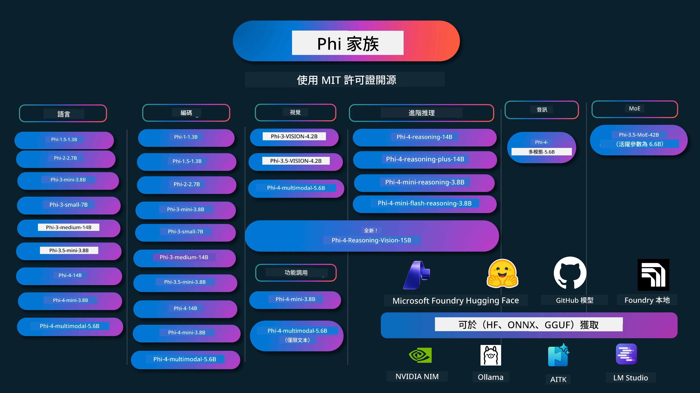

# Phi Cookbook: 使用 Microsoft Phi 模型的實作範例

[](https://codespaces.new/microsoft/phicookbook)
[](https://vscode.dev/redirect?url=vscode://ms-vscode-remote.remote-containers/cloneInVolume?url=https://github.com/microsoft/phicookbook)

[](https://GitHub.com/microsoft/phicookbook/graphs/contributors/?WT.mc_id=aiml-137032-kinfeylo)
[](https://GitHub.com/microsoft/phicookbook/issues/?WT.mc_id=aiml-137032-kinfeylo)
[](https://GitHub.com/microsoft/phicookbook/pulls/?WT.mc_id=aiml-137032-kinfeylo)
[](http://makeapullrequest.com?WT.mc_id=aiml-137032-kinfeylo)

[](https://GitHub.com/microsoft/phicookbook/watchers/?WT.mc_id=aiml-137032-kinfeylo)
[](https://GitHub.com/microsoft/phicookbook/network/?WT.mc_id=aiml-137032-kinfeylo)
[](https://GitHub.com/microsoft/phicookbook/stargazers/?WT.mc_id=aiml-137032-kinfeylo)

[](https://discord.com/invite/ByRwuEEgH4)

Phi 是由 Microsoft 開發的一系列開源 AI 模型。

Phi 目前是功能最強大且具成本效益的小型語言模型 (SLM)，在多語言、推理、文字／聊天生成、編碼、圖像、音訊及其他場景中具備非常優秀的基準表現。

您可以將 Phi 部署到雲端或邊緣裝置，並且可以輕鬆使用有限的計算能力構建生成式 AI 應用程式。

請按照以下步驟開始使用這些資源：
1. <strong>分叉倉庫</strong>：點擊 [](https://GitHub.com/microsoft/phicookbook/network/?WT.mc_id=aiml-137032-kinfeylo)
2. <strong>克隆倉庫</strong>： `git clone https://github.com/microsoft/PhiCookBook.git`
3. [**加入 Microsoft AI Discord 社群，與專家及其他開發者交流**](https://discord.com/invite/ByRwuEEgH4?WT.mc_id=aiml-137032-kinfeylo)



### 🌐 多語言支援

#### 透過 GitHub Action 支援（自動且持續更新）

<!-- CO-OP TRANSLATOR LANGUAGES TABLE START -->
[阿拉伯文](../ar/README.md) | [孟加拉文](../bn/README.md) | [保加利亞文](../bg/README.md) | [緬甸語（緬甸）](../my/README.md) | [中文（簡體）](../zh-CN/README.md) | [中文（繁體，香港）](../zh-HK/README.md) | [中文（繁體，澳門）](./README.md) | [中文（繁體，台灣）](../zh-TW/README.md) | [克羅地亞語](../hr/README.md) | [捷克語](../cs/README.md) | [丹麥語](../da/README.md) | [荷蘭語](../nl/README.md) | [愛沙尼亞語](../et/README.md) | [芬蘭語](../fi/README.md) | [法語](../fr/README.md) | [德語](../de/README.md) | [希臘語](../el/README.md) | [希伯來語](../he/README.md) | [印地語](../hi/README.md) | [匈牙利語](../hu/README.md) | [印尼語](../id/README.md) | [義大利語](../it/README.md) | [日語](../ja/README.md) | [卡納達語](../kn/README.md) | [韓語](../ko/README.md) | [立陶宛語](../lt/README.md) | [馬來語](../ms/README.md) | [馬拉雅拉姆語](../ml/README.md) | [馬拉提語](../mr/README.md) | [尼泊爾語](../ne/README.md) | [尼日利亞皮欽語](../pcm/README.md) | [挪威語](../no/README.md) | [波斯語 (法爾西)](../fa/README.md) | [波蘭語](../pl/README.md) | [巴西葡萄牙語](../pt-BR/README.md) | [葡萄牙語 (葡萄牙)](../pt-PT/README.md) | [旁遮普語 (古魯穆奇體)](../pa/README.md) | [羅馬尼亞語](../ro/README.md) | [俄語](../ru/README.md) | [塞爾維亞語 (西里爾字母)](../sr/README.md) | [斯洛伐克語](../sk/README.md) | [斯洛維尼亞語](../sl/README.md) | [西班牙語](../es/README.md) | [斯瓦希里語](../sw/README.md) | [瑞典語](../sv/README.md) | [塔加洛語 (菲律賓語)](../tl/README.md) | [泰米爾語](../ta/README.md) | [泰盧固語](../te/README.md) | [泰語](../th/README.md) | [土耳其語](../tr/README.md) | [烏克蘭語](../uk/README.md) | [烏爾都語](../ur/README.md) | [越南語](../vi/README.md)

> **偏好本地克隆？**
>
> 本倉庫包含 50 多種語言翻譯，會大幅增加下載大小。若要不含翻譯版本的克隆，請使用稀疏檢出：
>
> **Bash / macOS / Linux:**
> ```bash
> git clone --filter=blob:none --sparse https://github.com/microsoft/PhiCookBook.git
> cd PhiCookBook
> git sparse-checkout set --no-cone '/*' '!translations' '!translated_images'
> ```
>
> **CMD (Windows):**
> ```cmd
> git clone --filter=blob:none --sparse https://github.com/microsoft/PhiCookBook.git
> cd PhiCookBook
> git sparse-checkout set --no-cone "/*" "!translations" "!translated_images"
> ```
>
> 這樣可讓您以更快的速度下載，且擁有完成課程所需的一切。
<!-- CO-OP TRANSLATOR LANGUAGES TABLE END -->

## 目錄
- 介紹 - [歡迎加入 Phi 家族](./md/01.Introduction/01/01.PhiFamily.md) - [設置您的環境](./md/01.Introduction/01/01.EnvironmentSetup.md) - [了解關鍵技術](./md/01.Introduction/01/01.Understandingtech.md) - [Phi 模型的 AI 安全性](./md/01.Introduction/01/01.AISafety.md) - [Phi 硬件支援](./md/01.Introduction/01/01.Hardwaresupport.md) - [Phi 模型及跨平台可用性](./md/01.Introduction/01/01.Edgeandcloud.md) - [使用 Guidance-ai 與 Phi](./md/01.Introduction/01/01.Guidance.md) - [GitHub 市場模型](https://github.com/marketplace/models) - [Azure AI 模型目錄](https://ai.azure.com) - 在不同環境中推論 Phi - [Hugging face](./md/01.Introduction/02/01.HF.md) - [GitHub 模型](./md/01.Introduction/02/02.GitHubModel.md) - [Microsoft Foundry 模型目錄](./md/01.Introduction/02/03.AzureAIFoundry.md) - [Ollama](./md/01.Introduction/02/04.Ollama.md) - [AI 工具箱 VSCode (AITK)](./md/01.Introduction/02/05.AITK.md) - [NVIDIA NIM](./md/01.Introduction/02/06.NVIDIA.md) - [Foundry 本地端](./md/01.Introduction/02/07.FoundryLocal.md) - Phi 家族推論 - [iOS 中的 Phi 推論](./md/01.Introduction/03/iOS_Inference.md) - [Android 中的 Phi 推論](./md/01.Introduction/03/Android_Inference.md) - [Jetson 中的 Phi 推論](./md/01.Introduction/03/Jetson_Inference.md) - [AI PC 中的 Phi 推論](./md/01.Introduction/03/AIPC_Inference.md) - [使用 Apple MLX 框架進行 Phi 推論](./md/01.Introduction/03/MLX_Inference.md) - [本地伺服器中 Phi 推論](./md/01.Introduction/03/Local_Server_Inference.md) - [使用 AI 工具箱進行遠程伺服器 Phi 推論](./md/01.Introduction/03/Remote_Interence.md) - [使用 Rust 進行 Phi 推論](./md/01.Introduction/03/Rust_Inference.md) - [本地端 Phi 視覺推論](./md/01.Introduction/03/Vision_Inference.md) - [使用 Kaito AKS，Azure 容器（官方支援）進行 Phi 推論](./md/01.Introduction/03/Kaito_Inference.md) - [Phi 家族量化](./md/01.Introduction/04/QuantifyingPhi.md) - [使用 llama.cpp 量化 Phi-3.5 / 4](./md/01.Introduction/04/UsingLlamacppQuantifyingPhi.md) - [使用 onnxruntime 生成式 AI 擴展量化 Phi-3.5 / 4](./md/01.Introduction/04/UsingORTGenAIQuantifyingPhi.md) - [使用 Intel OpenVINO 量化 Phi-3.5 / 4](./md/01.Introduction/04/UsingIntelOpenVINOQuantifyingPhi.md) - [使用 Apple MLX 框架量化 Phi-3.5 / 4](./md/01.Introduction/04/UsingAppleMLXQuantifyingPhi.md) - Phi 評估 - [負責任的 AI](./md/01.Introduction/05/ResponsibleAI.md) - [Microsoft Foundry 評估](./md/01.Introduction/05/AIFoundry.md) - [使用 Promptflow 進行評估](./md/01.Introduction/05/Promptflow.md) - 與 Azure AI Search 的 RAG - [如何使用 Phi-4-mini 及 Phi-4-multimodal(RAG) 配合 Azure AI Search](https://github.com/microsoft/PhiCookBook/blob/main/code/06.E2E/E2E_Phi-4-RAG-Azure-AI-Search.ipynb) - Phi 應用開發範例 - 文字與聊天應用 - Phi-4 範例 - [📓] [與 Phi-4-mini ONNX 模型聊天](./md/02.Application/01.TextAndChat/Phi4/ChatWithPhi4ONNX/README.md) - [使用 Phi-4 本地 ONNX 模型的聊天 .NET 應用](../../md/04.HOL/dotnet/src/LabsPhi4-Chat-01OnnxRuntime) - [使用 Semantic Kernel 與 Phi-4 ONNX 的聊天 .NET 控制台應用](../../md/04.HOL/dotnet/src/LabsPhi4-Chat-02SK) - Phi-3 / 3.5 範例 - [使用 Phi3、ONNX Runtime Web 和 WebGPU 在瀏覽器中本地聊天機器人](https://github.com/microsoft/onnxruntime-inference-examples/tree/main/js/chat) - [OpenVino 聊天](./md/02.Application/01.TextAndChat/Phi3/E2E_OpenVino_Chat.md) - [多模型 - 互動式 Phi-3-mini 與 OpenAI Whisper](./md/02.Application/01.TextAndChat/Phi3/E2E_Phi-3-mini_with_whisper.md) - [MLFlow - 建立包裝器並使用 Phi-3 與 MLFlow](./md//02.Application/01.TextAndChat/Phi3/E2E_Phi-3-MLflow.md) - [模型優化 - 如何使用 Olive 優化 Phi-3-min 模型以搭配 ONNX Runtime Web](https://github.com/microsoft/Olive/tree/main/examples/phi3) - [使用 Phi-3 mini-4k-instruct-onnx 的 WinUI3 應用](https://github.com/microsoft/Phi3-Chat-WinUI3-Sample/) - [WinUI3 多模型 AI 支援筆記應用範例](https://github.com/microsoft/ai-powered-notes-winui3-sample) - [使用 Prompt flow 微調並整合自訂 Phi-3 模型](./md/02.Application/01.TextAndChat/Phi3/E2E_Phi-3-FineTuning_PromptFlow_Integration.md) - [在 Microsoft Foundry 中使用 Prompt flow 微調並整合自訂 Phi-3 模型](./md/02.Application/01.TextAndChat/Phi3/E2E_Phi-3-FineTuning_PromptFlow_Integration_AIFoundry.md) - [在 Microsoft Foundry 中評估微調後的 Phi-3 / Phi-3.5 模型，重點放在 Microsoft 的負責任 AI 原則](./md/02.Application/01.TextAndChat/Phi3/E2E_Phi-3-Evaluation_AIFoundry.md) - [📓] [Phi-3.5-mini-instruct 語言預測範例（中英雙語）](./md/02.Application/01.TextAndChat/Phi3/phi3-instruct-demo.ipynb) - [Phi-3.5-Instruct WebGPU RAG 聊天機器人](./md/02.Application/01.TextAndChat/Phi3/WebGPUWithPhi35Readme.md) - [使用 Windows GPU 與 Phi-3.5-Instruct ONNX 建立 Prompt flow 解決方案](./md/02.Application/01.TextAndChat/Phi3/UsingPromptFlowWithONNX.md) - [使用 Microsoft Phi-3.5 tflite 建立 Android 應用](./md/02.Application/01.TextAndChat/Phi3/UsingPhi35TFLiteCreateAndroidApp.md) - [使用 Microsoft.ML.OnnxRuntime 本地 ONNX Phi-3 模型的問答 .NET 範例](../../md/04.HOL/dotnet/src/LabsPhi301) - [結合 Semantic Kernel 與 Phi-3 的控制台聊天 .NET 應用](../../md/04.HOL/dotnet/src/LabsPhi302) - Azure AI 推論 SDK 程式碼範例 - Phi-4 範例 - [📓] [使用 Phi-4-multimodal 生成專案程式碼](./md/02.Application/02.Code/Phi4/GenProjectCode/README.md) - Phi-3 / 3.5 範例 - [使用 Microsoft Phi-3 家族打造您自己的 Visual Studio Code GitHub Copilot 聊天功能](./md/02.Application/02.Code/Phi3/VSCodeExt/README.md) - [使用 GitHub 模型打造您自己的 Visual Studio Code 聊天 Copilot 代理，採用 Phi-3.5](./md/02.Application/02.Code/Phi3/CreateVSCodeChatAgentWithGitHubModels.md) - 進階推理範例 - Phi-4 範例 - [📓] [Phi-4-mini 推理或 Phi-4 推理範例](./md/02.Application/03.AdvancedReasoning/Phi4/AdvancedResoningPhi4mini/README.md) - [📓] [使用 Microsoft Olive 微調 Phi-4-mini 推理](./md/02.Application/03.AdvancedReasoning/Phi4/AdvancedResoningPhi4mini/olive_ft_phi_4_reasoning_with_medicaldata.ipynb) - [📓] [使用 Apple MLX 微調 Phi-4-mini 推理](./md/02.Application/03.AdvancedReasoning/Phi4/AdvancedResoningPhi4mini/mlx_ft_phi_4_reasoning_with_medicaldata.ipynb) - [📓] [Phi-4-mini 推理與 GitHub 模型](./md/02.Application/02.Code/Phi4r/github_models_inference.ipynb) - [📓] [Phi-4-mini 推理與 Microsoft Foundry 模型](./md/02.Application/02.Code/Phi4r/azure_models_inference.ipynb) -
示範 - [Phi-4-mini 示範托管於 Hugging Face Spaces](https://huggingface.co/spaces/microsoft/phi-4-mini?WT.mc_id=aiml-137032-kinfeylo) - [Phi-4-multimodal 示範托管於 Hugging Face Spaces](https://huggingface.co/spaces/microsoft/phi-4-multimodal?WT.mc_id=aiml-137032-kinfeylo) - 視覺範例 - Phi-4 範例 - [📓] [使用 Phi-4-multimodal 讀取圖像並生成程式碼](./md/02.Application/04.Vision/Phi4/CreateFrontend/README.md) - Phi-3 / 3.5 範例 - [📓][Phi-3-vision-影像文字轉文本](./md/02.Application/04.Vision/Phi3/E2E_Phi-3-vision-image-text-to-text-online-endpoint.ipynb) - [Phi-3-vision-ONNX](https://onnxruntime.ai/docs/genai/tutorials/phi3-v.html) - [📓][Phi-3-vision CLIP 嵌入](./md/02.Application/04.Vision/Phi3/E2E_Phi-3-vision-image-text-to-text-online-endpoint.ipynb) - [示範: Phi-3 循環利用](https://github.com/jennifermarsman/PhiRecycling/) - [Phi-3-vision - 視覺語言助理 - 使用 Phi3-Vision 和 OpenVINO](https://docs.openvino.ai/nightly/notebooks/phi-3-vision-with-output.html) - [Phi-3 視覺 Nvidia NIM](./md/02.Application/04.Vision/Phi3/E2E_Nvidia_NIM_Vision.md) - [Phi-3 視覺 OpenVino](./md/02.Application/04.Vision/Phi3/E2E_OpenVino_Phi3Vision.md) - [📓][Phi-3.5 視覺多幀或多圖像示例](./md/02.Application/04.Vision/Phi3/phi3-vision-demo.ipynb) - [Phi-3 視覺本地 ONNX 模型，使用 Microsoft.ML.OnnxRuntime .NET](../../md/04.HOL/dotnet/src/LabsPhi303) - [基於選單的 Phi-3 視覺本地 ONNX 模型，使用 Microsoft.ML.OnnxRuntime .NET](../../md/04.HOL/dotnet/src/LabsPhi304) - 推理-視覺範例 - Phi-4-Reasoning-Vision-15B - [📓] [使用 Phi-4-Reasoning-Vision-15B 檢測闖紅燈](./md/02.Application/10.ReasoningVision/Phi_4_reasoning_vision_15b_Jaywalking.ipynb) - [📓] [使用 Phi-4-Reasoning-Vision-15B 計算數學](./md/02.Application/10.ReasoningVision/Phi_4_reasoning_vision_15b_Math.ipynb) - [📓] [使用 Phi-4-Reasoning-Vision-15B 檢測用戶界面](./md/02.Application/10.ReasoningVision/Phi_4_reasoning_vision_15b_ui.ipynb) - 數學範例 - Phi-4-Mini-Flash-Reasoning-Instruct 範例 [使用 Phi-4-Mini-Flash-Reasoning-Instruct 進行數學示範](./md/02.Application/09.Math/MathDemo.ipynb) - 聲音範例 - Phi-4 範例 - [📓] [使用 Phi-4-multimodal 提取音訊轉錄](./md/02.Application/05.Audio/Phi4/Transciption/README.md) - [📓] [Phi-4-multimodal 音訊範例](./md/02.Application/05.Audio/Phi4/Siri/demo.ipynb) - [📓] [Phi-4-multimodal 語音翻譯範例](./md/02.Application/05.Audio/Phi4/Translate/demo.ipynb) - [.NET 控制台應用程式，使用 Phi-4-multimodal 音訊分析音頻檔並生成轉錄文本](../../md/04.HOL/dotnet/src/LabsPhi4-MultiModal-02Audio) - MOE 範例 - Phi-3 / 3.5 範例 - [📓] [Phi-3.5 混合專家模型 (MoEs) 社交媒體範例](./md/02.Application/06.MoE/Phi3/phi3_moe_demo.ipynb) - [📓] [使用 NVIDIA NIM Phi-3 MOE、Azure AI 搜索及 LlamaIndex 建構檢索增強生成 (RAG) 管線](./md/02.Application/06.MoE/Phi3/azure-ai-search-nvidia-rag.ipynb) - - 函式呼叫範例 - Phi-4 範例 🆕 - [📓] [使用 Phi-4-mini 進行函數呼叫](./md/02.Application/07.FunctionCalling/Phi4/FunctionCallingBasic/README.md) - [📓] [使用函數呼叫建立多智能體，搭配 Phi-4-mini](./md/02.Application/07.FunctionCalling/Phi4/Multiagents/Phi_4_mini_multiagent.ipynb) - [📓] [使用函數呼叫與 Ollama](./md/02.Application/07.FunctionCalling/Phi4/Ollama/ollama_functioncalling.ipynb) - [📓] [使用函數呼叫與 ONNX](./md/02.Application/07.FunctionCalling/Phi4/ONNX/onnx_parallel_functioncalling.ipynb) - 多模態混合範例 - Phi-4 範例 🆕 - [📓] [使用 Phi-4-multimodal 作為科技記者](./md/02.Application/08.Multimodel/Phi4/TechJournalist/phi_4_mm_audio_text_publish_news.ipynb) - [.NET 控制台應用程式，使用 Phi-4-multimodal 分析圖像](../../md/04.HOL/dotnet/src/LabsPhi4-MultiModal-01Images) - 精調 Phi 範例 - [精調場景](./md/03.FineTuning/FineTuning_Scenarios.md) - [精調與 RAG 比較](./md/03.FineTuning/FineTuning_vs_RAG.md) - [精調讓 Phi-3 成為產業專家](./md/03.FineTuning/LetPhi3gotoIndustriy.md) - [使用 AI 工具組為 VS Code 精調 Phi-3](./md/03.FineTuning/Finetuning_VSCodeaitoolkit.md) - [使用 Azure 機器學習服務精調 Phi-3](./md/03.FineTuning/Introduce_AzureML.md) - [使用 Lora 精調 Phi-3](./md/03.FineTuning/FineTuning_Lora.md) - [使用 QLora 精調 Phi-3](./md/03.FineTuning/FineTuning_Qlora.md) - [使用 Microsoft Foundry 精調 Phi-3](./md/03.FineTuning/FineTuning_AIFoundry.md) - [使用 Azure ML CLI/SDK 精調 Phi-3](./md/03.FineTuning/FineTuning_MLSDK.md) - [使用 Microsoft Olive 精調](./md/03.FineTuning/FineTuning_MicrosoftOlive.md) - [使用 Microsoft Olive 實作實驗室](./md/03.FineTuning/olive-lab/readme.md) - [使用 Weights and Bias 精調 Phi-3-vision](./md/03.FineTuning/FineTuning_Phi-3-visionWandB.md) - [使用 Apple MLX 框架精調 Phi-3](./md/03.FineTuning/FineTuning_MLX.md) - [精調 Phi-3-vision（官方支援）](./md/03.FineTuning/FineTuning_Vision.md) - [使用 Kaito AKS、Azure 容器精調 Phi-3（官方支援）](./md/03.FineTuning/FineTuning_Kaito.md) - [精調 Phi-3 及 3.5 視覺模型](https://github.com/2U1/Phi3-Vision-Finetune) - 實作實驗室 - [探索尖端模型：大型語言模型、專用語言模型、本地開發等](https://github.com/microsoft/aitour-exploring-cutting-edge-models) - [解鎖自然語言處理潛力：使用 Microsoft Olive 進行精調](https://github.com/azure/Ignite_FineTuning_workshop) - 學術研究論文與出版品 - [Textbooks Are All You Need II: phi-1.5 技術報告](https://arxiv.org/abs/2309.05463) - [Phi-3 技術報告：在您手機上可本地運行的高能力語言模型](https://arxiv.org/abs/2404.14219) - [Phi-4 技術報告](https://arxiv.org/abs/2412.08905) - [Phi-4-Mini 技術報告：透過 Mixture-of-LoRAs 實現精簡但強大的多模態語言模型](https://arxiv.org/abs/2503.01743) - [優化小型語言模型以支援車載函數呼叫](https://arxiv.org/abs/2501.02342) - [(WhyPHI) 精調 PHI-3 用於多選題：方法學、結果與挑戰](https://arxiv.org/abs/2501.01588) - [Phi-4 推理技術報告](https://www.microsoft.com/en-us/research/wp-content/uploads/2025/04/phi_4_reasoning.pdf)
- [Phi-4-mini推理技術報告](https://huggingface.co/microsoft/Phi-4-mini-reasoning/blob/main/Phi-4-Mini-Reasoning.pdf)
# Phi Cookbook：使用 Microsoft Phi 模型的實作範例

[](https://codespaces.new/microsoft/phicookbook)
[](https://vscode.dev/redirect?url=vscode://ms-vscode-remote.remote-containers/cloneInVolume?url=https://github.com/microsoft/phicookbook)

[](https://GitHub.com/microsoft/phicookbook/graphs/contributors/?WT.mc_id=aiml-137032-kinfeylo)
[](https://GitHub.com/microsoft/phicookbook/issues/?WT.mc_id=aiml-137032-kinfeylo)
[](https://GitHub.com/microsoft/phicookbook/pulls/?WT.mc_id=aiml-137032-kinfeylo)
[](http://makeapullrequest.com?WT.mc_id=aiml-137032-kinfeylo)

[](https://GitHub.com/microsoft/phicookbook/watchers/?WT.mc_id=aiml-137032-kinfeylo)
[](https://GitHub.com/microsoft/phicookbook/network/?WT.mc_id=aiml-137032-kinfeylo)
[](https://GitHub.com/microsoft/phicookbook/stargazers/?WT.mc_id=aiml-137032-kinfeylo)

[](https://discord.com/invite/ByRwuEEgH4)

Phi 是由 Microsoft 開發的一系列開源 AI 模型。

Phi 目前是最強大且具成本效益的小型語言模型（SLM），在多語言、推理、文本/聊天生成、程式碼、影像、音訊及其他場景均有優異的基準表現。

您可以將 Phi 部署到雲端或邊緣裝置，並且可以輕鬆使用有限的計算資源構建生成式 AI 應用。

請按照以下步驟開始使用這些資源：
1. **Fork 此資源庫**：點擊 [](https://GitHub.com/microsoft/phicookbook/network/?WT.mc_id=aiml-137032-kinfeylo)
2. **Clone 此資源庫**： `git clone https://github.com/microsoft/PhiCookBook.git`
3. [**加入 Microsoft AI Discord 社群，與專家及其他開發者互動**](https://discord.com/invite/ByRwuEEgH4?WT.mc_id=aiml-137032-kinfeylo)


### 🌐 多語言支援

#### 透過 GitHub Action 支援（自動且持續更新）

<!-- CO-OP TRANSLATOR LANGUAGES TABLE START -->
[Arabic](../ar/README.md) | [Bengali](../bn/README.md) | [Bulgarian](../bg/README.md) | [Burmese (Myanmar)](../my/README.md) | [Chinese (Simplified)](../zh-CN/README.md) | [Chinese (Traditional, Hong Kong)](../zh-HK/README.md) | [Chinese (Traditional, Macau)](./README.md) | [Chinese (Traditional, Taiwan)](../zh-TW/README.md) | [Croatian](../hr/README.md) | [Czech](../cs/README.md) | [Danish](../da/README.md) | [Dutch](../nl/README.md) | [Estonian](../et/README.md) | [Finnish](../fi/README.md) | [French](../fr/README.md) | [German](../de/README.md) | [Greek](../el/README.md) | [Hebrew](../he/README.md) | [Hindi](../hi/README.md) | [Hungarian](../hu/README.md) | [Indonesian](../id/README.md) | [Italian](../it/README.md) | [Japanese](../ja/README.md) | [Kannada](../kn/README.md) | [Korean](../ko/README.md) | [Lithuanian](../lt/README.md) | [Malay](../ms/README.md) | [Malayalam](../ml/README.md) | [Marathi](../mr/README.md) | [Nepali](../ne/README.md) | [Nigerian Pidgin](../pcm/README.md) | [Norwegian](../no/README.md) | [Persian (Farsi)](../fa/README.md) | [Polish](../pl/README.md) | [Portuguese (Brazil)](../pt-BR/README.md) | [Portuguese (Portugal)](../pt-PT/README.md) | [Punjabi (Gurmukhi)](../pa/README.md) | [Romanian](../ro/README.md) | [Russian](../ru/README.md) | [Serbian (Cyrillic)](../sr/README.md) | [Slovak](../sk/README.md) | [Slovenian](../sl/README.md) | [Spanish](../es/README.md) | [Swahili](../sw/README.md) | [Swedish](../sv/README.md) | [Tagalog (Filipino)](../tl/README.md) | [Tamil](../ta/README.md) | [Telugu](../te/README.md) | [Thai](../th/README.md) | [Turkish](../tr/README.md) | [Ukrainian](../uk/README.md) | [Urdu](../ur/README.md) | [Vietnamese](../vi/README.md)

> **偏好本地 Clone？**
>
> 此資源庫包含超過 50 種語言的翻譯，會大幅增加下載大小。若欲不含翻譯檔案進行 Clone，請使用稀疏檢出：
>
> **Bash / macOS / Linux：**
> ```bash
> git clone --filter=blob:none --sparse https://github.com/microsoft/PhiCookBook.git
> cd PhiCookBook
> git sparse-checkout set --no-cone '/*' '!translations' '!translated_images'
> ```
>
> **CMD (Windows)：**
> ```cmd
> git clone --filter=blob:none --sparse https://github.com/microsoft/PhiCookBook.git
> cd PhiCookBook
> git sparse-checkout set --no-cone "/*" "!translations" "!translated_images"
> ```
>
> 如此可快速下載所需內容，完成課程所需資源。
<!-- CO-OP TRANSLATOR LANGUAGES TABLE END -->

## 目錄

## 使用 Phi 模型

### Microsoft Foundry 上的 Phi

您可以學習如何使用 Microsoft Phi 以及如何在不同硬件裝置上構建端對端解決方案。若想親身體驗 Phi，請先透過 [Microsoft Foundry Azure AI Model Catalog](https://aka.ms/phi3-azure-ai) 玩玩模型並為您的場景客製化 Phi，詳情請參考「從零開始使用 [Microsoft Foundry](/md/02.QuickStart/AzureAIFoundry_QuickStart.md)」

<strong>操作平台</strong>
每個模型都有專屬測試平台：[Azure AI Playground](https://aka.ms/try-phi3)。

### GitHub 模型上的 Phi

您可以學習如何在您的不同硬件裝置上使用 Microsoft Phi 以及如何構建端對端解決方案。若想親身體驗 Phi，請先透過 [GitHub Model Catalog](https://github.com/marketplace/models?WT.mc_id=aiml-137032-kinfeylo) 玩玩模型並為您的場景客製化 Phi，詳情請參考「從零開始使用 [GitHub Model Catalog](/md/02.QuickStart/GitHubModel_QuickStart.md)」

<strong>操作平台</strong>
每個模型都有專屬[測試平台](/md/02.QuickStart/GitHubModel_QuickStart.md)。

### Hugging Face 上的 Phi

您也可在 [Hugging Face](https://huggingface.co/microsoft) 找到該模型

<strong>操作平台</strong>
 [Hugging Chat 測試平台](https://huggingface.co/chat/models/microsoft/Phi-3-mini-4k-instruct)

## 🎒 其他課程

我們團隊也製作其他課程！請參考：

<!-- CO-OP TRANSLATOR OTHER COURSES START -->
### LangChain
[](https://aka.ms/langchain4j-for-beginners)
[](https://aka.ms/langchainjs-for-beginners?WT.mc_id=m365-94501-dwahlin)
[](https://github.com/microsoft/langchain-for-beginners?WT.mc_id=m365-94501-dwahlin)
---

### Azure / Edge / MCP / Agents
[](https://github.com/microsoft/AZD-for-beginners?WT.mc_id=academic-105485-koreyst)
[](https://github.com/microsoft/edgeai-for-beginners?WT.mc_id=academic-105485-koreyst)
[](https://github.com/microsoft/mcp-for-beginners?WT.mc_id=academic-105485-koreyst)
[](https://github.com/microsoft/ai-agents-for-beginners?WT.mc_id=academic-105485-koreyst)

---
 
### 生成式 AI 系列
[](https://github.com/microsoft/generative-ai-for-beginners?WT.mc_id=academic-105485-koreyst)
[-9333EA?style=for-the-badge&labelColor=E5E7EB&color=9333EA)](https://github.com/microsoft/Generative-AI-for-beginners-dotnet?WT.mc_id=academic-105485-koreyst)
[-C084FC?style=for-the-badge&labelColor=E5E7EB&color=C084FC)](https://github.com/microsoft/generative-ai-for-beginners-java?WT.mc_id=academic-105485-koreyst)
[-E879F9?style=for-the-badge&labelColor=E5E7EB&color=E879F9)](https://github.com/microsoft/generative-ai-with-javascript?WT.mc_id=academic-105485-koreyst)

---
 
### 核心學習
[](https://aka.ms/ml-beginners?WT.mc_id=academic-105485-koreyst)
[](https://aka.ms/datascience-beginners?WT.mc_id=academic-105485-koreyst)
[](https://aka.ms/ai-beginners?WT.mc_id=academic-105485-koreyst)
[](https://github.com/microsoft/Security-101?WT.mc_id=academic-96948-sayoung)
[](https://aka.ms/webdev-beginners?WT.mc_id=academic-105485-koreyst)
[](https://aka.ms/iot-beginners?WT.mc_id=academic-105485-koreyst)
[](https://github.com/microsoft/xr-development-for-beginners?WT.mc_id=academic-105485-koreyst)

---
 
### Copilot 系列
[](https://aka.ms/GitHubCopilotAI?WT.mc_id=academic-105485-koreyst)
[](https://github.com/microsoft/mastering-github-copilot-for-dotnet-csharp-developers?WT.mc_id=academic-105485-koreyst)
[](https://github.com/microsoft/CopilotAdventures?WT.mc_id=academic-105485-koreyst)
<!-- CO-OP TRANSLATOR OTHER COURSES END -->

## 負責任的 AI

微軟致力於幫助客戶負責任地使用我們的 AI 產品，分享我們的學習成果，並通過透明度說明和影響評估等工具建立基於信任的夥伴關係。許多相關資源可在 [https://aka.ms/RAI](https://aka.ms/RAI) 找到。
微軟對負責任 AI 的方法基於我們的 AI 原則，包括公平性、可靠性與安全性、隱私與安全性、包容性、透明性和問責制。

大型的自然語言、圖像和語音模型——如本範例中使用的模型——可能會出現不公平、不可靠或冒犯性行為，從而造成損害。請參閱 [Azure OpenAI 服務透明度說明](https://learn.microsoft.com/legal/cognitive-services/openai/transparency-note?tabs=text) 以了解風險和限制。

推薦的減輕這些風險的方法是在您的架構中包含一個可以檢測並防止有害行為的安全系統。[Azure AI 內容安全](https://learn.microsoft.com/azure/ai-services/content-safety/overview) 提供獨立的保護層，能夠檢測應用和服務中用戶生成和 AI 生成的有害內容。Azure AI 內容安全包含文本和圖像 API，允許您檢測有害的材料。在 Microsoft Foundry 中，內容安全服務允許您查看、探索及嘗試跨不同模式檢測有害內容的範例程式碼。以下的[快速入門文件](https://learn.microsoft.com/azure/ai-services/content-safety/quickstart-text?tabs=visual-studio%2Clinux&pivots=programming-language-rest)指導您如何向該服務發出請求。

另一個需要考慮的方面是整體應用性能。對於多模態和多模型的應用，我們認為性能指的是系統如您和使用者所期望的運作，包括不產生有害輸出。使用[性能與質量以及風險與安全評估器](https://learn.microsoft.com/azure/ai-studio/concepts/evaluation-metrics-built-in)來評估整體應用的性能非常重要。您也可以使用[自訂評估器](https://learn.microsoft.com/azure/ai-studio/how-to/develop/evaluate-sdk#custom-evaluators)創建和進行評估。

您可以使用[Azure AI 評估 SDK](https://microsoft.github.io/promptflow/index.html)在您的開發環境中評估您的 AI 應用。根據測試數據集或目標，您生成的 AI 輸出可以透過內建評估器或您自行選擇的自訂評估器進行量化測量。要開始使用 azure ai 評估 sdk 評估您的系統，您可以參考[快速入門指南](https://learn.microsoft.com/azure/ai-studio/how-to/develop/flow-evaluate-sdk)。完成評估執行後，您可以在[Microsoft Foundry 中視覺化結果](https://learn.microsoft.com/azure/ai-studio/how-to/evaluate-flow-results)。

## 商標

本項目可能包含項目、產品或服務的商標或標誌。授權使用微軟商標或標誌須遵守[微軟商標及品牌指南](https://www.microsoft.com/legal/intellectualproperty/trademarks/usage/general)的規範。
在本項目中修改版本使用微軟商標或標誌時，應避免造成混淆或暗示微軟的贊助。使用第三方商標或標誌時，須依照該第三方的政策進行。

## 尋求協助

如果遇到困難或有關建置 AI 應用的任何問題，歡迎加入：

[](https://aka.ms/foundry/discord)

如果您在開發中有產品反饋或錯誤，請訪問：

[](https://aka.ms/foundry/forum)

---

<!-- CO-OP TRANSLATOR DISCLAIMER START -->
**免責聲明**：  
本文件是使用 AI 翻譯服務 [Co-op Translator](https://github.com/Azure/co-op-translator) 所翻譯。雖然我們盡力確保準確性，請注意自動翻譯可能包含錯誤或不準確之處。原始文件的母語版本應被視為唯一權威來源。對於重要資訊，建議採用專業的人類翻譯。我們不對因使用本翻譯所產生的任何誤解或誤釋負責。
<!-- CO-OP TRANSLATOR DISCLAIMER END -->