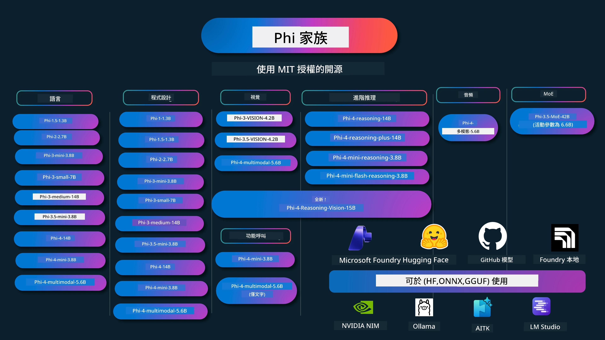

# Phi Cookbook：使用 Microsoft Phi 模型的實作範例

[](https://codespaces.new/microsoft/phicookbook)
[](https://vscode.dev/redirect?url=vscode://ms-vscode-remote.remote-containers/cloneInVolume?url=https://github.com/microsoft/phicookbook)

[](https://GitHub.com/microsoft/phicookbook/graphs/contributors/?WT.mc_id=aiml-137032-kinfeylo)
[](https://GitHub.com/microsoft/phicookbook/issues/?WT.mc_id=aiml-137032-kinfeylo)
[](https://GitHub.com/microsoft/phicookbook/pulls/?WT.mc_id=aiml-137032-kinfeylo)
[](http://makeapullrequest.com?WT.mc_id=aiml-137032-kinfeylo)

[](https://GitHub.com/microsoft/phicookbook/watchers/?WT.mc_id=aiml-137032-kinfeylo)
[](https://GitHub.com/microsoft/phicookbook/network/?WT.mc_id=aiml-137032-kinfeylo)
[](https://GitHub.com/microsoft/phicookbook/stargazers/?WT.mc_id=aiml-137032-kinfeylo)

[](https://discord.com/invite/ByRwuEEgH4)

Phi 是微軟開發的一系列開源 AI 模型。

Phi 目前是最強大且具成本效益的小型語言模型 (SLM)，在多語言、推理、文本/聊天生成、編程、影像、音訊及其他場景中擁有非常優異的基準表現。

你可以將 Phi 部署於雲端或邊緣設備，並且能夠輕鬆地用有限的計算資源建置生成式 AI 應用。

請按照以下步驟開始使用這些資源：
1. **Fork 此儲存庫**：點擊 [](https://GitHub.com/microsoft/phicookbook/network/?WT.mc_id=aiml-137032-kinfeylo)
2. **Clone 此儲存庫**： `git clone https://github.com/microsoft/PhiCookBook.git`
3. [**加入 Microsoft AI Discord 社群，與專家及其他開發者交流**](https://discord.com/invite/ByRwuEEgH4?WT.mc_id=aiml-137032-kinfeylo)



### 🌐 多語言支援

#### 透過 GitHub Action 支持（自動且持續更新）

<!-- CO-OP TRANSLATOR LANGUAGES TABLE START -->
[Arabic](../ar/README.md) | [Bengali](../bn/README.md) | [Bulgarian](../bg/README.md) | [Burmese (Myanmar)](../my/README.md) | [Chinese (Simplified)](../zh-CN/README.md) | [Chinese (Traditional, Hong Kong)](../zh-HK/README.md) | [Chinese (Traditional, Macau)](../zh-MO/README.md) | [Chinese (Traditional, Taiwan)](./README.md) | [Croatian](../hr/README.md) | [Czech](../cs/README.md) | [Danish](../da/README.md) | [Dutch](../nl/README.md) | [Estonian](../et/README.md) | [Finnish](../fi/README.md) | [French](../fr/README.md) | [German](../de/README.md) | [Greek](../el/README.md) | [Hebrew](../he/README.md) | [Hindi](../hi/README.md) | [Hungarian](../hu/README.md) | [Indonesian](../id/README.md) | [Italian](../it/README.md) | [Japanese](../ja/README.md) | [Kannada](../kn/README.md) | [Korean](../ko/README.md) | [Lithuanian](../lt/README.md) | [Malay](../ms/README.md) | [Malayalam](../ml/README.md) | [Marathi](../mr/README.md) | [Nepali](../ne/README.md) | [Nigerian Pidgin](../pcm/README.md) | [Norwegian](../no/README.md) | [Persian (Farsi)](../fa/README.md) | [Polish](../pl/README.md) | [Portuguese (Brazil)](../pt-BR/README.md) | [Portuguese (Portugal)](../pt-PT/README.md) | [Punjabi (Gurmukhi)](../pa/README.md) | [Romanian](../ro/README.md) | [Russian](../ru/README.md) | [Serbian (Cyrillic)](../sr/README.md) | [Slovak](../sk/README.md) | [Slovenian](../sl/README.md) | [Spanish](../es/README.md) | [Swahili](../sw/README.md) | [Swedish](../sv/README.md) | [Tagalog (Filipino)](../tl/README.md) | [Tamil](../ta/README.md) | [Telugu](../te/README.md) | [Thai](../th/README.md) | [Turkish](../tr/README.md) | [Ukrainian](../uk/README.md) | [Urdu](../ur/README.md) | [Vietnamese](../vi/README.md)

> **偏好本地 Clone？**
>
> 此儲存庫包含 50 多種語言翻譯，會大幅增加下載大小。若要不包含翻譯內容 Clone，請使用稀疏檢出：
>
> **Bash / macOS / Linux：**
> ```bash
> git clone --filter=blob:none --sparse https://github.com/microsoft/PhiCookBook.git
> cd PhiCookBook
> git sparse-checkout set --no-cone '/*' '!translations' '!translated_images'
> ```
>
> **CMD (Windows)：**
> ```cmd
> git clone --filter=blob:none --sparse https://github.com/microsoft/PhiCookBook.git
> cd PhiCookBook
> git sparse-checkout set --no-cone "/*" "!translations" "!translated_images"
> ```
>
> 這樣能讓你以更快的速度下載到完成課程所需的所有內容。
<!-- CO-OP TRANSLATOR LANGUAGES TABLE END -->

## 目錄
- 章節介紹 - [歡迎來到Phi家族](./md/01.Introduction/01/01.PhiFamily.md) - [設定您的環境](./md/01.Introduction/01/01.EnvironmentSetup.md) - [理解關鍵技術](./md/01.Introduction/01/01.Understandingtech.md) - [Phi模型的AI安全](./md/01.Introduction/01/01.AISafety.md) - [Phi硬體支援](./md/01.Introduction/01/01.Hardwaresupport.md) - [Phi模型與跨平台可用性](./md/01.Introduction/01/01.Edgeandcloud.md) - [使用Guidance-ai和Phi](./md/01.Introduction/01/01.Guidance.md) - [GitHub 市集模型](https://github.com/marketplace/models) - [Azure AI模型目錄](https://ai.azure.com) - 不同環境中推理Phi - [Hugging face](./md/01.Introduction/02/01.HF.md) - [GitHub模型](./md/01.Introduction/02/02.GitHubModel.md) - [Microsoft Foundry模型目錄](./md/01.Introduction/02/03.AzureAIFoundry.md) - [Ollama](./md/01.Introduction/02/04.Ollama.md) - [AI工具包 VSCode (AITK)](./md/01.Introduction/02/05.AITK.md) - [NVIDIA NIM](./md/01.Introduction/02/06.NVIDIA.md) - [Foundry Local](./md/01.Introduction/02/07.FoundryLocal.md) - Phi家族推理應用 - [在iOS中推理Phi](./md/01.Introduction/03/iOS_Inference.md) - [在Android中推理Phi](./md/01.Introduction/03/Android_Inference.md) - [在Jetson中推理Phi](./md/01.Introduction/03/Jetson_Inference.md) - [在AI PC中推理Phi](./md/01.Introduction/03/AIPC_Inference.md) - [使用Apple MLX框架推理Phi](./md/01.Introduction/03/MLX_Inference.md) - [在本地伺服器推理Phi](./md/01.Introduction/03/Local_Server_Inference.md) - [使用AI工具包於遠端伺服器推理Phi](./md/01.Introduction/03/Remote_Interence.md) - [使用Rust推理Phi](./md/01.Introduction/03/Rust_Inference.md) - [本地推理Phi–Vision](./md/01.Introduction/03/Vision_Inference.md) - [使用Kaito AKS、Azure Containers官方支援推理Phi](./md/01.Introduction/03/Kaito_Inference.md) - [Phi家族量化](./md/01.Introduction/04/QuantifyingPhi.md) - [使用llama.cpp量化Phi-3.5 / 4](./md/01.Introduction/04/UsingLlamacppQuantifyingPhi.md) - [使用onnxruntime的生成式AI擴充套件量化Phi-3.5 / 4](./md/01.Introduction/04/UsingORTGenAIQuantifyingPhi.md) - [使用Intel OpenVINO量化Phi-3.5 / 4](./md/01.Introduction/04/UsingIntelOpenVINOQuantifyingPhi.md) - [使用Apple MLX框架量化Phi-3.5 / 4](./md/01.Introduction/04/UsingAppleMLXQuantifyingPhi.md) - Phi模型評估 - [AI負責任指南](./md/01.Introduction/05/ResponsibleAI.md) - [Microsoft Foundry模型評估](./md/01.Introduction/05/AIFoundry.md) - [使用Promptflow進行評估](./md/01.Introduction/05/Promptflow.md) - Azure AI搜尋結合RAG - [如何將Phi-4-mini與Phi-4-multimodal(RAG)結合Azure AI搜尋](https://github.com/microsoft/PhiCookBook/blob/main/code/06.E2E/E2E_Phi-4-RAG-Azure-AI-Search.ipynb) - Phi應用程式開發範例 - 文字與聊天應用 - Phi-4範例 - [📓] [使用Phi-4-mini ONNX模型聊天](./md/02.Application/01.TextAndChat/Phi4/ChatWithPhi4ONNX/README.md) - [使用本地Phi-4 ONNX模型的聊天.NET應用](../../md/04.HOL/dotnet/src/LabsPhi4-Chat-01OnnxRuntime) - [使用Semantic Kernel與Phi-4 ONNX的.NET控制台聊天應用](../../md/04.HOL/dotnet/src/LabsPhi4-Chat-02SK) - Phi-3 / 3.5範例 - [使用Phi3, ONNX Runtime Web與WebGPU在瀏覽器中建立本地聊天機器人](https://github.com/microsoft/onnxruntime-inference-examples/tree/main/js/chat) - [OpenVino聊天](./md/02.Application/01.TextAndChat/Phi3/E2E_OpenVino_Chat.md) - [多模型 - 互動式Phi-3-mini與OpenAI Whisper](./md/02.Application/01.TextAndChat/Phi3/E2E_Phi-3-mini_with_whisper.md) - [MLFlow - 建立封裝並使用Phi-3配合MLFlow](./md//02.Application/01.TextAndChat/Phi3/E2E_Phi-3-MLflow.md) - [模型優化 - 如何使用Olive優化Phi-3-mini模型以用於ONNX Runtime Web](https://github.com/microsoft/Olive/tree/main/examples/phi3) - [搭配Phi-3 mini-4k-instruct-onnx的WinUI3應用](https://github.com/microsoft/Phi3-Chat-WinUI3-Sample/) - [WinUI3多模型AI驅動筆記應用範例](https://github.com/microsoft/ai-powered-notes-winui3-sample) - [微調並使用Prompt flow整合自訂Phi-3模型](./md/02.Application/01.TextAndChat/Phi3/E2E_Phi-3-FineTuning_PromptFlow_Integration.md) - [在Microsoft Foundry中微調並使用Prompt flow整合自訂Phi-3模型](./md/02.Application/01.TextAndChat/Phi3/E2E_Phi-3-FineTuning_PromptFlow_Integration_AIFoundry.md) - [針對Microsoft負責任AI原則評估自訂Phi-3 / Phi-3.5模型 (Microsoft Foundry)](./md/02.Application/01.TextAndChat/Phi3/E2E_Phi-3-Evaluation_AIFoundry.md) - [📓] [Phi-3.5-mini-instruct語言預測範例 (中文/英文)](./md/02.Application/01.TextAndChat/Phi3/phi3-instruct-demo.ipynb) - [Phi-3.5-Instruct WebGPU RAG聊天機器人](./md/02.Application/01.TextAndChat/Phi3/WebGPUWithPhi35Readme.md) - [使用Windows GPU建立Phi-3.5-Instruct ONNX的Prompt flow方案](./md/02.Application/01.TextAndChat/Phi3/UsingPromptFlowWithONNX.md) - [使用Microsoft Phi-3.5 tflite建立Android應用](./md/02.Application/01.TextAndChat/Phi3/UsingPhi35TFLiteCreateAndroidApp.md) - [使用Microsoft.ML.OnnxRuntime與本地ONNX Phi-3模型的問答.NET範例](../../md/04.HOL/dotnet/src/LabsPhi301) - [使用Semantic Kernel與Phi-3的控制台聊天.NET應用](../../md/04.HOL/dotnet/src/LabsPhi302) - Azure AI推理SDK程式碼範例 - Phi-4範例 - [📓] [使用Phi-4-multimodal生成專案程式碼](./md/02.Application/02.Code/Phi4/GenProjectCode/README.md) - Phi-3 / 3.5範例 - [使用Microsoft Phi-3家族建置您自己的Visual Studio Code GitHub Copilot聊天](./md/02.Application/02.Code/Phi3/VSCodeExt/README.md) - [使用GitHub模型創建您自己的Visual Studio Code聊天助手代理（Phi-3.5）](/md/02.Application/02.Code/Phi3/CreateVSCodeChatAgentWithGitHubModels.md) - 進階推理範例 - Phi-4範例 - [📓] [Phi-4-mini推理或Phi-4推理範例](./md/02.Application/03.AdvancedReasoning/Phi4/AdvancedResoningPhi4mini/README.md) - [📓] [使用Microsoft Olive微調Phi-4-mini推理](./md/02.Application/03.AdvancedReasoning/Phi4/AdvancedResoningPhi4mini/olive_ft_phi_4_reasoning_with_medicaldata.ipynb) - [📓] [使用Apple MLX微調Phi-4-mini推理](./md/02.Application/03.AdvancedReasoning/Phi4/AdvancedResoningPhi4mini/mlx_ft_phi_4_reasoning_with_medicaldata.ipynb) - [📓] [Phi-4-mini推理與GitHub模型](./md/02.Application/02.Code/Phi4r/github_models_inference.ipynb) - [📓] [Phi-4-mini推理與Microsoft Foundry模型](./md/02.Application/02.Code/Phi4r/azure_models_inference.ipynb) -
演示 - [Phi-4-mini 演示托管於 Hugging Face Spaces](https://huggingface.co/spaces/microsoft/phi-4-mini?WT.mc_id=aiml-137032-kinfeylo) - [Phi-4-multimodal 演示托管於 Hugginge Face Spaces](https://huggingface.co/spaces/microsoft/phi-4-multimodal?WT.mc_id=aiml-137032-kinfeylo) - 視覺樣本 - Phi-4 樣本 - [📓] [使用 Phi-4-multimodal 讀取圖片並生成程式碼](./md/02.Application/04.Vision/Phi4/CreateFrontend/README.md) - Phi-3 / 3.5 樣本 - [📓][Phi-3-vision-圖片文字轉文字](./md/02.Application/04.Vision/Phi3/E2E_Phi-3-vision-image-text-to-text-online-endpoint.ipynb) - [Phi-3-vision-ONNX](https://onnxruntime.ai/docs/genai/tutorials/phi3-v.html) - [📓][Phi-3-vision CLIP 嵌入](./md/02.Application/04.Vision/Phi3/E2E_Phi-3-vision-image-text-to-text-online-endpoint.ipynb) - [演示：Phi-3 回收利用](https://github.com/jennifermarsman/PhiRecycling/) - [Phi-3-vision - 視覺語言助理 - 使用 Phi3-Vision 和 OpenVINO](https://docs.openvino.ai/nightly/notebooks/phi-3-vision-with-output.html) - [Phi-3 視覺 Nvidia NIM](./md/02.Application/04.Vision/Phi3/E2E_Nvidia_NIM_Vision.md) - [Phi-3 視覺 OpenVino](./md/02.Application/04.Vision/Phi3/E2E_OpenVino_Phi3Vision.md) - [📓][Phi-3.5 視覺多幀或多圖像範例](./md/02.Application/04.Vision/Phi3/phi3-vision-demo.ipynb) - [Phi-3 視覺本地 ONNX 模型使用 Microsoft.ML.OnnxRuntime .NET](../../md/04.HOL/dotnet/src/LabsPhi303) - [基於菜單的 Phi-3 視覺本地 ONNX 模型使用 Microsoft.ML.OnnxRuntime .NET](../../md/04.HOL/dotnet/src/LabsPhi304) - 推理視覺樣本 - Phi-4-Reasoning-Vision-15B - [📓] [使用 Phi-4-Reasoning-Vision-15B 偵測亂穿馬路](./md/02.Application/10.ReasoningVision/Phi_4_reasoning_vision_15b_Jaywalking.ipynb) - [📓] [使用 Phi-4-Reasoning-Vision-15B 進行數學計算](./md/02.Application/10.ReasoningVision/Phi_4_reasoning_vision_15b_Math.ipynb) - [📓] [使用 Phi-4-Reasoning-Vision-15B 偵測使用者介面](./md/02.Application/10.ReasoningVision/Phi_4_reasoning_vision_15b_ui.ipynb) - 數學樣本 - Phi-4-Mini-Flash-Reasoning-Instruct 樣本 [Phi-4-Mini-Flash-Reasoning-Instruct 數學演示](./md/02.Application/09.Math/MathDemo.ipynb) - 音訊樣本 - Phi-4 樣本 - [📓] [使用 Phi-4-multimodal 抽取音訊文字稿](./md/02.Application/05.Audio/Phi4/Transciption/README.md) - [📓] [Phi-4-multimodal 音訊範例](./md/02.Application/05.Audio/Phi4/Siri/demo.ipynb) - [📓] [Phi-4-multimodal 語音翻譯範例](./md/02.Application/05.Audio/Phi4/Translate/demo.ipynb) - [.NET 控制台應用程式使用 Phi-4-multimodal 音訊分析音訊檔並生成文字稿](../../md/04.HOL/dotnet/src/LabsPhi4-MultiModal-02Audio) - MOE 樣本 - Phi-3 / 3.5 樣本 - [📓] [Phi-3.5 混合專家模型 (MoEs) 社群媒體範例](./md/02.Application/06.MoE/Phi3/phi3_moe_demo.ipynb) - [📓] [建立帶有 NVIDIA NIM Phi-3 MOE、Azure AI Search 及 LlamaIndex 的檢索增強生成管線 (RAG)](./md/02.Application/06.MoE/Phi3/azure-ai-search-nvidia-rag.ipynb) - 功能呼叫樣本 - Phi-4 樣本 🆕 - [📓] [在 Phi-4-mini 使用功能呼叫](./md/02.Application/07.FunctionCalling/Phi4/FunctionCallingBasic/README.md) - [📓] [使用功能呼叫建立多代理程式，搭配 Phi-4-mini](./md/02.Application/07.FunctionCalling/Phi4/Multiagents/Phi_4_mini_multiagent.ipynb) - [📓] [使用功能呼叫與 Ollama](./md/02.Application/07.FunctionCalling/Phi4/Ollama/ollama_functioncalling.ipynb) - [📓] [使用功能呼叫與 ONNX](./md/02.Application/07.FunctionCalling/Phi4/ONNX/onnx_parallel_functioncalling.ipynb) - 多模態混合樣本 - Phi-4 樣本 🆕 - [📓] [使用 Phi-4-multimodal 作為科技記者](./md/02.Application/08.Multimodel/Phi4/TechJournalist/phi_4_mm_audio_text_publish_news.ipynb) - [.NET 控制台應用程式使用 Phi-4-multimodal 分析圖片](../../md/04.HOL/dotnet/src/LabsPhi4-MultiModal-01Images) - 微調 Phi 樣本 - [微調應用場景](./md/03.FineTuning/FineTuning_Scenarios.md) - [微調與 RAG 比較](./md/03.FineTuning/FineTuning_vs_RAG.md) - [微調讓 Phi-3 成為產業專家](./md/03.FineTuning/LetPhi3gotoIndustriy.md) - [使用 AI 工具組 for VS Code 微調 Phi-3](./md/03.FineTuning/Finetuning_VSCodeaitoolkit.md) - [使用 Azure 機器學習服務微調 Phi-3](./md/03.FineTuning/Introduce_AzureML.md) - [使用 Lora 微調 Phi-3](./md/03.FineTuning/FineTuning_Lora.md) - [使用 QLora 微調 Phi-3](./md/03.FineTuning/FineTuning_Qlora.md) - [利用 Microsoft Foundry 微調 Phi-3](./md/03.FineTuning/FineTuning_AIFoundry.md) - [使用 Azure ML CLI/SDK 微調 Phi-3](./md/03.FineTuning/FineTuning_MLSDK.md) - [使用 Microsoft Olive 進行微調](./md/03.FineTuning/FineTuning_MicrosoftOlive.md) - [Microsoft Olive 手作實驗室微調](./md/03.FineTuning/olive-lab/readme.md) - [使用 Weights and Bias 微調 Phi-3-vision](./md/03.FineTuning/FineTuning_Phi-3-visionWandB.md) - [使用 Apple MLX 框架微調 Phi-3](./md/03.FineTuning/FineTuning_MLX.md) - [微調 Phi-3-vision（官方支援）](./md/03.FineTuning/FineTuning_Vision.md) - [使用 Kaito AKS、Azure 容器微調 Phi-3（官方支援）](./md/03.FineTuning/FineTuning_Kaito.md) - [微調 Phi-3 和 3.5 視覺](https://github.com/2U1/Phi3-Vision-Finetune) - 實作實驗室 - [探索尖端模型：LLMs、SLMs、本地開發及更多](https://github.com/microsoft/aitour-exploring-cutting-edge-models) - [解鎖自然語言處理潛力：使用 Microsoft Olive 進行微調](https://github.com/azure/Ignite_FineTuning_workshop) - 學術研究論文與出版物 - [Textbooks Are All You Need II: phi-1.5 技術報告](https://arxiv.org/abs/2309.05463) - [Phi-3 技術報告：可在您手機本地運行的高性能語言模型](https://arxiv.org/abs/2404.14219) - [Phi-4 技術報告](https://arxiv.org/abs/2412.08905) - [Phi-4-Mini 技術報告：透過混合 LoRA 的緊湊且強大的多模態語言模型](https://arxiv.org/abs/2503.01743) - [優化車載功能呼叫的小型語言模型](https://arxiv.org/abs/2501.02342) - [(WhyPHI) 微調 PHI-3 用於多選題問答：方法論、結果與挑戰](https://arxiv.org/abs/2501.01588) - [Phi-4-推理技術報告](https://www.microsoft.com/en-us/research/wp-content/uploads/2025/04/phi_4_reasoning.pdf)
- [Phi-4-mini-推理技術報告](https://huggingface.co/microsoft/Phi-4-mini-reasoning/blob/main/Phi-4-Mini-Reasoning.pdf)
# Phi Cookbook：使用 Microsoft Phi 模型的實作範例

[](https://codespaces.new/microsoft/phicookbook)
[](https://vscode.dev/redirect?url=vscode://ms-vscode-remote.remote-containers/cloneInVolume?url=https://github.com/microsoft/phicookbook)

[](https://GitHub.com/microsoft/phicookbook/graphs/contributors/?WT.mc_id=aiml-137032-kinfeylo)
[](https://GitHub.com/microsoft/phicookbook/issues/?WT.mc_id=aiml-137032-kinfeylo)
[](https://GitHub.com/microsoft/phicookbook/pulls/?WT.mc_id=aiml-137032-kinfeylo)
[](http://makeapullrequest.com?WT.mc_id=aiml-137032-kinfeylo)

[](https://GitHub.com/microsoft/phicookbook/watchers/?WT.mc_id=aiml-137032-kinfeylo)
[](https://GitHub.com/microsoft/phicookbook/network/?WT.mc_id=aiml-137032-kinfeylo)
[](https://GitHub.com/microsoft/phicookbook/stargazers/?WT.mc_id=aiml-137032-kinfeylo)

[](https://discord.com/invite/ByRwuEEgH4)

Phi 是由 Microsoft 開發的一系列開源人工智慧模型。

Phi 目前是效能最佳且成本效益最高的小型語言模型（SLM），在多語言、推理、文字／聊天生成、程式編碼、影像、音訊及其他場景中皆有優異表現。

您可以將 Phi 部署到雲端或邊緣裝置，並且能輕鬆使用有限的運算資源打造生成式 AI 應用程式。

請依照以下步驟開始使用這些資源：
1. **從本存放庫派生（Fork）**：點擊 [](https://GitHub.com/microsoft/phicookbook/network/?WT.mc_id=aiml-137032-kinfeylo)
2. **複製存放庫（Clone）**：`git clone https://github.com/microsoft/PhiCookBook.git`
3. [**加入 Microsoft AI Discord 社群，與專家和其他開發者交流**](https://discord.com/invite/ByRwuEEgH4?WT.mc_id=aiml-137032-kinfeylo)


### 🌐 多語言支援

#### 透過 GitHub Action 支援（自動化且持續更新）

<!-- CO-OP TRANSLATOR LANGUAGES TABLE START -->
[阿拉伯語](../ar/README.md) | [孟加拉語](../bn/README.md) | [保加利亞語](../bg/README.md) | [緬甸語](../my/README.md) | [中文（簡體）](../zh-CN/README.md) | [中文（繁體，香港）](../zh-HK/README.md) | [中文（繁體，澳門）](../zh-MO/README.md) | [中文（繁體，台灣）](./README.md) | [克羅埃西亞語](../hr/README.md) | [捷克語](../cs/README.md) | [丹麥語](../da/README.md) | [荷蘭語](../nl/README.md) | [愛沙尼亞語](../et/README.md) | [芬蘭語](../fi/README.md) | [法語](../fr/README.md) | [德語](../de/README.md) | [希臘語](../el/README.md) | [希伯來語](../he/README.md) | [印地語](../hi/README.md) | [匈牙利語](../hu/README.md) | [印尼語](../id/README.md) | [義大利語](../it/README.md) | [日語](../ja/README.md) | [卡納達語](../kn/README.md) | [韓語](../ko/README.md) | [立陶宛語](../lt/README.md) | [馬來語](../ms/README.md) | [馬拉雅拉姆語](../ml/README.md) | [馬拉地語](../mr/README.md) | [尼泊爾語](../ne/README.md) | [奈及利亞洋泾浜英語](../pcm/README.md) | [挪威語](../no/README.md) | [波斯語（法爾西語）](../fa/README.md) | [波蘭語](../pl/README.md) | [葡萄牙語（巴西）](../pt-BR/README.md) | [葡萄牙語（葡萄牙）](../pt-PT/README.md) | [旁遮普語（古爾穆奇文）](../pa/README.md) | [羅馬尼亞語](../ro/README.md) | [俄語](../ru/README.md) | [塞爾維亞語（西里爾字母）](../sr/README.md) | [斯洛伐克語](../sk/README.md) | [斯洛文尼亞語](../sl/README.md) | [西班牙語](../es/README.md) | [斯瓦希里語](../sw/README.md) | [瑞典語](../sv/README.md) | [菲律賓語（他加祿語）](../tl/README.md) | [泰米爾語](../ta/README.md) | [泰盧固語](../te/README.md) | [泰語](../th/README.md) | [土耳其語](../tr/README.md) | [烏克蘭語](../uk/README.md) | [烏爾都語](../ur/README.md) | [越南語](../vi/README.md)

> **偏好本機複製？**
>
> 本存放庫包含超過 50 種語言的翻譯，會大幅增加下載大小。若想不含翻譯內容的複製，請使用稀疏擷取（sparse checkout）：
>
> **Bash / macOS / Linux:**
> ```bash
> git clone --filter=blob:none --sparse https://github.com/microsoft/PhiCookBook.git
> cd PhiCookBook
> git sparse-checkout set --no-cone '/*' '!translations' '!translated_images'
> ```
>
> **CMD (Windows):**
> ```cmd
> git clone --filter=blob:none --sparse https://github.com/microsoft/PhiCookBook.git
> cd PhiCookBook
> git sparse-checkout set --no-cone "/*" "!translations" "!translated_images"
> ```
>
> 這樣將大幅縮短下載時間，並包含完成課程所需的所有內容。
<!-- CO-OP TRANSLATOR LANGUAGES TABLE END -->

## 目錄

## 使用 Phi 模型

### 在 Microsoft Foundry 上使用 Phi

您可以學習如何使用 Microsoft Phi 並在不同硬體裝置上打造端到端（E2E）解決方案。想親自體驗 Phi，請從試用各模型並按照您的場景進行客製化開始，透過 [Microsoft Foundry Azure AI 模型目錄](https://aka.ms/phi3-azure-ai) 了解更多，入門請參考 [Microsoft Foundry 快速開始](/md/02.QuickStart/AzureAIFoundry_QuickStart.md)

<strong>沙盒環境</strong>  
每個模型皆有專屬的測試沙盒，[Azure AI Playground](https://aka.ms/try-phi3)。

### 在 GitHub Models 上使用 Phi

您可以學習如何使用 Microsoft Phi 並在不同硬體裝置打造端到端解決方案。想親自體驗 Phi，請從試用模型並依據您的場景客製化 Phi，透過 [GitHub 模型目錄](https://github.com/marketplace/models?WT.mc_id=aiml-137032-kinfeylo) 了解更多，入門請參考 [GitHub 模型目錄快速開始](/md/02.QuickStart/GitHubModel_QuickStart.md)

<strong>沙盒環境</strong>  
每個模型皆有專屬的 [測試沙盒](/md/02.QuickStart/GitHubModel_QuickStart.md)。

### 在 Hugging Face 上使用 Phi

您也可以在 [Hugging Face](https://huggingface.co/microsoft) 找到該模型。

<strong>沙盒環境</strong>  
 [Hugging Chat 測試沙盒](https://huggingface.co/chat/models/microsoft/Phi-3-mini-4k-instruct)

## 🎒 其他課程

我們團隊還有其他課程！歡迎參考：

<!-- CO-OP TRANSLATOR OTHER COURSES START -->
### LangChain
[](https://aka.ms/langchain4j-for-beginners)
[](https://aka.ms/langchainjs-for-beginners?WT.mc_id=m365-94501-dwahlin)
[](https://github.com/microsoft/langchain-for-beginners?WT.mc_id=m365-94501-dwahlin)
---

### Azure / Edge / MCP / Agents
[](https://github.com/microsoft/AZD-for-beginners?WT.mc_id=academic-105485-koreyst)
[](https://github.com/microsoft/edgeai-for-beginners?WT.mc_id=academic-105485-koreyst)
[](https://github.com/microsoft/mcp-for-beginners?WT.mc_id=academic-105485-koreyst)
[](https://github.com/microsoft/ai-agents-for-beginners?WT.mc_id=academic-105485-koreyst)

---
 
### 生成式 AI 系列
[](https://github.com/microsoft/generative-ai-for-beginners?WT.mc_id=academic-105485-koreyst)
[-9333EA?style=for-the-badge&labelColor=E5E7EB&color=9333EA)](https://github.com/microsoft/Generative-AI-for-beginners-dotnet?WT.mc_id=academic-105485-koreyst)

[-C084FC?style=for-the-badge&labelColor=E5E7EB&color=C084FC)](https://github.com/microsoft/generative-ai-for-beginners-java?WT.mc_id=academic-105485-koreyst)
[-E879F9?style=for-the-badge&labelColor=E5E7EB&color=E879F9)](https://github.com/microsoft/generative-ai-with-javascript?WT.mc_id=academic-105485-koreyst)

---
 
### 核心學習
[](https://aka.ms/ml-beginners?WT.mc_id=academic-105485-koreyst)
[](https://aka.ms/datascience-beginners?WT.mc_id=academic-105485-koreyst)
[](https://aka.ms/ai-beginners?WT.mc_id=academic-105485-koreyst)
[](https://github.com/microsoft/Security-101?WT.mc_id=academic-96948-sayoung)
[](https://aka.ms/webdev-beginners?WT.mc_id=academic-105485-koreyst)
[](https://aka.ms/iot-beginners?WT.mc_id=academic-105485-koreyst)
[](https://github.com/microsoft/xr-development-for-beginners?WT.mc_id=academic-105485-koreyst)

---
 
### Copilot 系列
[](https://aka.ms/GitHubCopilotAI?WT.mc_id=academic-105485-koreyst)
[](https://github.com/microsoft/mastering-github-copilot-for-dotnet-csharp-developers?WT.mc_id=academic-105485-koreyst)
[](https://github.com/microsoft/CopilotAdventures?WT.mc_id=academic-105485-koreyst)
<!-- CO-OP TRANSLATOR OTHER COURSES END -->

## 負責任的 AI 

微軟致力於協助客戶負責任地使用我們的 AI 產品，分享我們的學習，並透過如透明度說明和影響評估等工具，建立基於信任的夥伴關係。這些資源的很多內容可在 [https://aka.ms/RAI](https://aka.ms/RAI) 找到。
微軟負責任的 AI 方法基於我們的 AI 原則：公平性、可靠性與安全、隱私與安全性、包容性、透明度與問責制。

大型自然語言、圖片和語音模型——如本範例中使用的模型——可能會以不公平、不可靠或冒犯性的方式行事，進而造成傷害。請參考 [Azure OpenAI 服務透明度說明](https://learn.microsoft.com/legal/cognitive-services/openai/transparency-note?tabs=text)，以了解相關風險及限制。

減輕這些風險的建議方法是在您的架構中包含一個安全系統，可以偵測並防止有害行為。[Azure AI 內容安全](https://learn.microsoft.com/azure/ai-services/content-safety/overview) 提供獨立的防護層，能偵測應用程式和服務中用戶生成及 AI 生成的有害內容。Azure AI 內容安全包含文字與影像 API，允許您偵測有害材料。在 Microsoft Foundry 中，內容安全服務讓您檢視、探索並試用用於偵測不同模態間有害內容的範例代碼。以下的 [快速入門文件](https://learn.microsoft.com/azure/ai-services/content-safety/quickstart-text?tabs=visual-studio%2Clinux&pivots=programming-language-rest) 指導您如何向服務發送請求。

另一個需要注意的面向是整體應用程式的效能。對於多模態和多模型的應用，我們認為效能意味著系統表現達到您與用戶的期望，包括不產生有害輸出。評估您整體應用的效能時，請使用 [效能與品質以及風險與安全評估器](https://learn.microsoft.com/azure/ai-studio/concepts/evaluation-metrics-built-in)。您也可以使用 [自訂評估器](https://learn.microsoft.com/azure/ai-studio/how-to/develop/evaluate-sdk#custom-evaluators) 來建立和評估應用。

您可以使用 [Azure AI 評估 SDK](https://microsoft.github.io/promptflow/index.html) 在開發環境中評估 AI 應用。利用測試資料集或目標，您的生成式 AI 產出將透過內建評估器或您選擇的自訂評估器進行量化測量。若想開始使用 Azure AI 評估 SDK 來評估您的系統，請參考 [快速入門指南](https://learn.microsoft.com/azure/ai-studio/how-to/develop/flow-evaluate-sdk)。執行評估後，您可以在 [Microsoft Foundry 中視覺化結果](https://learn.microsoft.com/azure/ai-studio/how-to/evaluate-flow-results)。

## 商標

本專案可能包含專案、產品或服務的商標或標誌。授權使用微軟商標或標誌須遵守並依據 [微軟商標與品牌指導方針](https://www.microsoft.com/legal/intellectualproperty/trademarks/usage/general)。
在本專案的修改版本中使用微軟商標或標誌，不得造成混淆或暗示微軟贊助。所有第三方商標或標誌的使用須遵守該第三方之政策。

## 取得協助

如果您遇到困難或有關於構建 AI 應用程式的任何疑問，請加入：

[](https://aka.ms/foundry/discord)

如果您在構建過程中有產品反饋或錯誤，請訪問：

[](https://aka.ms/foundry/forum)

---

<!-- CO-OP TRANSLATOR DISCLAIMER START -->
**免責聲明**：  
本文件係使用 AI 翻譯服務 [Co-op Translator](https://github.com/Azure/co-op-translator) 所翻譯。雖然我們致力於確保準確性，但請注意自動翻譯可能包含錯誤或不準確之處。原始文件的母語版本應被視為權威來源。對於重要資訊，建議採用專業人工翻譯。我們不對因使用此翻譯所產生之任何誤解或誤譯負責。
<!-- CO-OP TRANSLATOR DISCLAIMER END -->